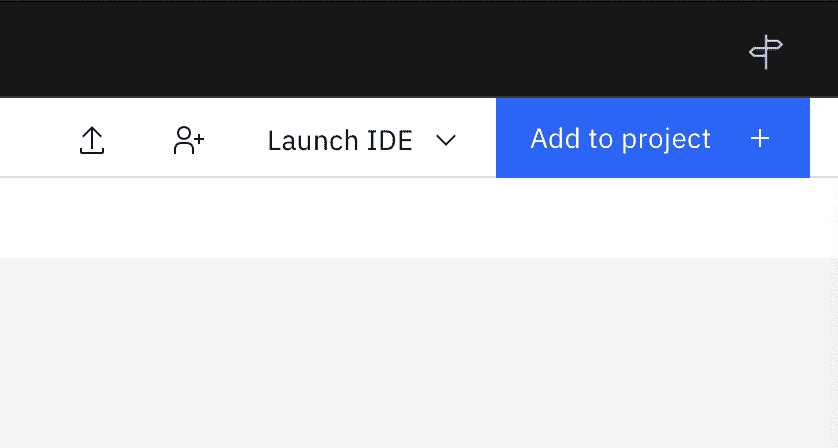

# 借助 TensorFlow 采用受限玻尔兹曼机构建一个推荐引擎

> 原文：[`developer.ibm.com/zh/tutorials/build-a-recommendation-engine-with-a-restricted-boltzmann-machine-using-tensorflow/`](https://developer.ibm.com/zh/tutorials/build-a-recommendation-engine-with-a-restricted-boltzmann-machine-using-tensorflow/)

在本教程中，学习如何使用 TensorFlow 构建可以根据您观看过的电影为您做出推荐的受限玻尔兹曼机。本教程中使用的数据集来自 [GroupLens](http://grouplens.org/datasets/movielens/)，其中包含电影、用户和电影评级。您对神经网络使用了 Sigmoid 激活函数，并且返回的推荐是基于受限玻尔兹曼机 (RBM) 生成的推荐分数。

### 学习目标

在本教程中，您将：

*   了解受限玻尔兹曼机如何工作
*   了解如何在受限玻尔兹曼机上实施协作过滤
*   了解受限玻尔兹曼机的用例和学习过程

### 前提条件

要学习本教程，必须满足以下先决条件：

*   一个 [IBM Cloud®](https://cloud.ibm.com/registration?cm_sp=ibmdev-_-developer-tutorials-_-cloudreg) 帐户
*   [IBM Cloud Pak® for Data](https://www.ibm.com/products/cloud-pak-for-data)

### 预估时间

完成本教程大约需要 40 分钟。

## 受限玻尔兹曼机简介

受限玻尔兹曼机 (RBM) 是两层（输入层和隐藏层）人工神经网络，可基于一组输入来学习概率分布。它是随机的（不确定的），有助于解决基于组合的不同问题。RBM 可用于降维、分类、回归、协作过滤、特征学习和主题建模。

顾名思义，RBM 是一类玻尔兹曼机。但是，在考虑神经网络的输入与隐藏节点之间的关联时，RBM 在某些方面受到限制，因此实现 RBM 比实现玻尔兹曼机更加容易。层以及这些层中的节点以一对多的方式连接，其中输入层中的每个节点都连接到隐藏层中的每个节点，但同一层中的节点不会彼此连接。由于这种限制，可以使用比玻尔兹曼机中通常所使用的算法更简化的训练算法。

下图显示了 RBM 的外观。如您所见，输入层中的所有节点都连接到隐藏层中的每个节点。神经网络本身的结构特点，在训练神经网络时会很高效，因为一个输入层可以使用很多隐藏层进行训练。也可以将多个 RBM 堆叠在一起，创建一个深度信念网络，从而可以对神经网络进行更深入的学习并运用。


## 受限玻尔兹曼机的工作方式

至于 RBM 的工作方式，其中涉及两个步骤：多个输入和重建。

### 多个输入

训练神经网络时，第一步便是多个输入。输入被放入输入层，乘以权重，然后与偏置相加。此后，它经过激活函数 (sigmoid)，输出是否激活隐藏状态的决定。

神经网络中的权重位于一个矩阵中，其中行数表示输入节点数，列数表示隐藏节点数。主隐藏节点获得输入的矢量乘积，与权重的第一列相乘，然后再将其与对应的偏置项相加。


### 重建

在重建中，逻辑非常简单。你有一个激活，此时需要输入，然后传递到隐藏层，接着再传递到输入。然后生成新的偏置，而这个新的输出便是重建。


那么学习过程如何真正发挥作用？由于这两个步骤相继进行，因此您首先使用多个输入的阶段生成激活，然后便会进行重建。当在某个时期进行重建时，主要目标是减少重建误差，因此算法随后会针对每个迭代相应地调整权重，以减少重建误差。这为您提供了良好的预测和更高的准确性。


## 步骤

1.  设置 IBM Cloud Pak for Data as a Service
2.  创建新项目
3.  导入 Notebook
4.  读取 Notebook

### 设置 IBM Cloud Pak for Data as a Service

1.  登录您的 [IBM Cloud 帐户](https://cloud.ibm.com/registration?cm_sp=ibmdev-_-developer-tutorials-_-cloudreg)。
2.  在目录中搜索 Watson Studio 以创建 IBM Watson® Studio 的实例。

    

3.  选择 Lite 套餐，然后单击 **Create**。

    

### 创建新项目

1.  访问服务，然后单击 **Create a project** 或 **New project**。

    

2.  选择 **Create an empty project**。

3.  为项目提供一个名称。
4.  选择现有的 IBM Cloud Object Storage 服务实例或创建一个新实例。
5.  单击 **Create**。

或者，您可以单击左上角的导航菜单，单击 **View all projects**，然后创建一个新项目。


### 导入 Notebook

在创建了项目后：

1.  访问已创建的项目。
2.  单击 **Add to project +**。

    

3.  单击 **Notebook**。

    

4.  单击 **From URL**。

5.  为 Notebook 命名。
6.  在 **Select runtime** 下面，选择 **Default Python 3.7 XS**。
7.  输入 `https://raw.githubusercontent.com/IBM/dl-learning-path-assets/main/unsupervised-deeplearning/notebooks/CollabortiveFilteringUsingRBM.ipynb` 作为 Notebook URL。
8.  单击 **Create**。

    

9.  运行该 Notebook。在打开的 Notebook 中，单击 **Run** 可一次运行一个单元。教程的其余部分遵循 Notebook 的顺序。

### 读取 Notebook

像每个 Notebook 一样，您首先要将数据集下载到环境中。


然后，将数据添加到数据框中。在此示例中，您创建两个数据框：用于电影的“movies_df”和用于电影评级的“ratings_df”。


您在数据框中重命名列，以确保您能够正确理解数据。

*   `movies_df` 包含以下三列：MovieID、Title 和 Genres
*   `ratings_df` 包含以下四列：UserID、MovieID、Rating 和 Timestamp


为了规范化数据，在我们创建“ratings_df”的透视图时，有很多数据标记为 `NaN`。

```
user_rating_df = ratings_df.pivot(index='UserID', columns='MovieID', values='Rating')
user_rating_df.head() 
```

因此，我们将规范化的用户评级存储为用户评级矩阵（名为 trX），并对值进行规范化。


规范化数据后，设置模型参数，其中包括隐藏部分和可见部分。然后，添加激活函数 `f.sigmoid` 和 `tf.relu`，因为它们通常用于 RBM，并继续定义一个仅针对隐藏层以及重构的输出返回生成的隐藏状态的函数。


设置模型参数后，可以使用以下代码训练模型：

```
epochs = 5
batchsize = 500
errors = []
weights = []
K=1
alpha = 0.1 
```


接下来，通过提供一个 `mock user id` 并将其输入模型来创建一个模拟用户。


然后，列出为模拟用户推荐的电影。通过按模型提供的推荐分数进行排序，可以为模拟用户列出 20 部最受推荐的电影。


然后，您可以通过以下函数，使用 `ratings_df` 数据框添加基于用户的时间戳记：

```
movies_df_mock = ratings_df[ratings_df['UserID'] == mock_user_id]
movies_df_mock.head() 
```


最后，将观看的电影与预测分数合并。您可以合并和输出前 20 行，从而可以查看用户观看的电影以及根据他们的推荐分数而推荐的电影。


完成这最后一步之后，您便完成了 Notebook。您可以尝试更改模型参数，例如向隐藏层添加更多内容或更改损失函数以查看是否有任何变化。要进行更多优化，您可以更改纪元数、K 的大小和批处理大小。这些都是值得探索的有趣数字，因为它们会给出不同的输出。

## 总结

在本教程中，您研究了使用 TensorFlow 的受限玻尔兹曼机的基础知识和实现方式，并创建了基于协作过滤的电影推荐模型，它综合考虑了评级和用户推荐来为用户推荐他们可能有兴趣观看的电影。

本文翻译自：[Build a recommendation engine with a restricted Boltzmann machine using TensorFlow](https://developer.ibm.com/tutorials/build-a-recommendation-engine-with-a-restricted-boltzmann-machine-using-tensorflow/)（2020-11-06）