# 使用 TensorFlow 执行线性回归

> 原文：[`developer.ibm.com/zh/tutorials/build-a-linear-regression-neural-network-using-tensorflow/`](https://developer.ibm.com/zh/tutorials/build-a-linear-regression-neural-network-using-tensorflow/)

在本教程中，学习如何创建一个包含用于定义线性回归的 Python 代码的 Jupyter Notebook，然后使用 TensorFlow 来实现这个线性回归。Notebook 在 IBM Cloud Pak® for Data 即服务上运行。IBM Cloud Pak for Data 平台还提供了其他支持，例如，与多个数据源的集成、内置分析、Jupyter Notebook 和机器学习。它还通过跨多个计算资源分布过程来提供可扩展性。

## 简介

简单来说，线性回归是用于描述两个或多个变量之间关系的线性模型的近似模拟。在一个简单的线性回归中，有两个变量：

*   因变量，可以看作我们研究并试图预测的“状态”或“最终目标”
*   自变量，也称为解释变量，可以看作是“状态”的“原因”

当存在多个自变量时，该过程称为多元线性回归。预测多个因变量时，这个过程就是多元线性回归。

一个简单的线性模型的方程为：

𝑌=𝑎𝑋+𝑏

在此方程中，*Y* 是因变量，*X* 是自变量，*a* 和 *b* 是我们调整的参数。*a* 称为“斜率”或“梯度”，*b* 称为“截距”。您可以将该方程解释为 *Y* 是 *X* 的函数，或者 *Y* 取决于 *X*。

## 前提条件

*   一个 [IBM Cloud](https://cloud.ibm.com/registration?cm_sp=ibmdev-_-developer-tutorials-_-cloudreg) 帐户。
*   [IBM Cloud Pak for Data](https://www.ibm.com/products/cloud-pak-for-data)
*   [Python](https://www.python.org/) 的实用知识
*   [TensorFlow](https://www.tensorflow.org/) 的实用知识

## 估计的运行时间

完成本教程大约需要 30 分钟。

## 步骤

1.  创建您的 IBM Cloud 帐户并访问 IBM Cloud Pak for Data 即服务
2.  创建新项目
3.  将 Watson Machine Learning Service 与项目相关联
4.  将数据集添加到您的项目（如果您使用的是 IBM Cloud Pak for Data as a Service）
5.  将 Notebook 添加到您的项目
6.  运行 Notebook

### 创建 IBM Cloud 帐户并访问 IBM Cloud Pak for Data 即服务

1.  登录到 [IBM Cloud](https://cloud.ibm.com/registration?cm_sp=ibmdev-_-developer-tutorials-_-cloudreg)。
2.  搜索 IBM Watson® Studio。

    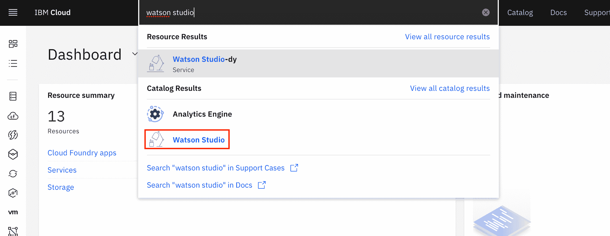

3.  通过选择区域和价格套餐来创建服务，然后单击 **Create**。

    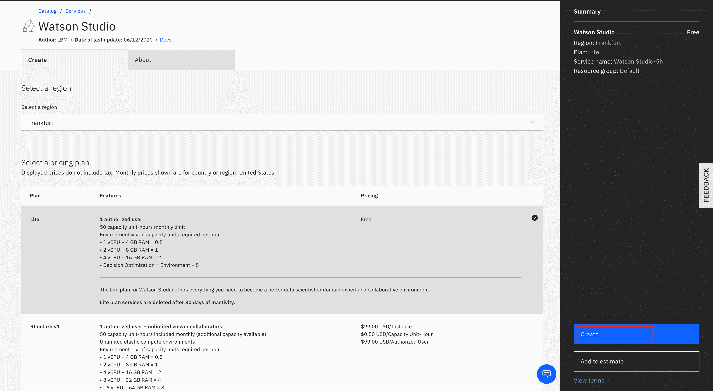

### 创建新项目

1.  启动 Watson Studio 服务。

    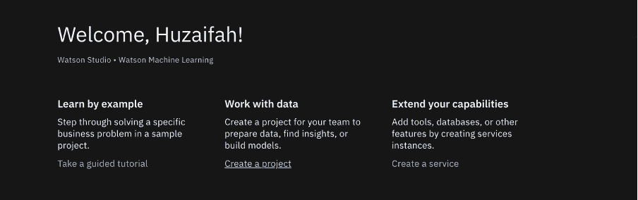

2.  依次单击 **Create a project** 和 **Create an empty project**。确保为项目命名并添加存储服务，然后单击 **Create**。

    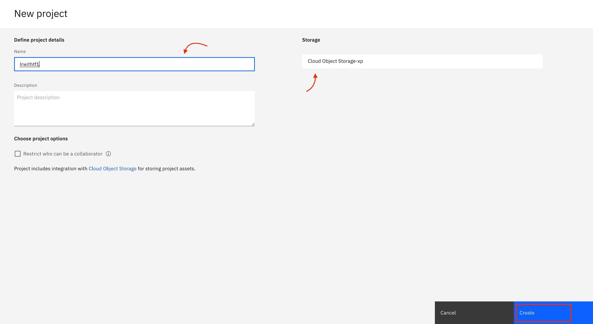

创建项目后，您将定向到项目仪表板。

### 将 Watson Machine Learning Service 与项目相关联

1.  转到项目的 **Settings**。
2.  在“关联的服务”中单击 **Add service**，然后在下拉菜单中选择 **Watson**。

    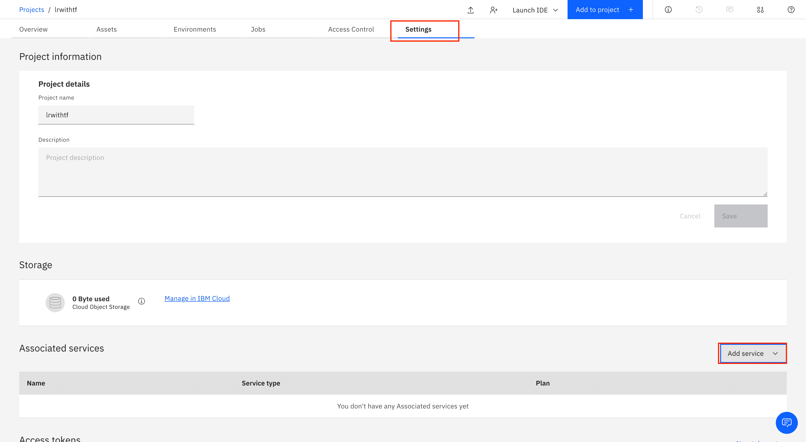

3.  添加 Watson Machine Learning 服务。

    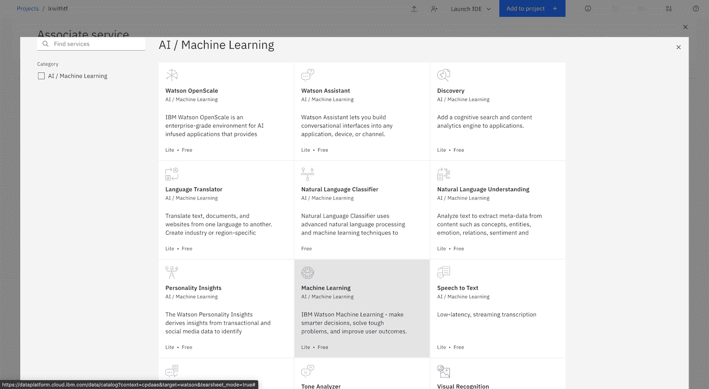

4.  标记服务并将其与项目相关联。

    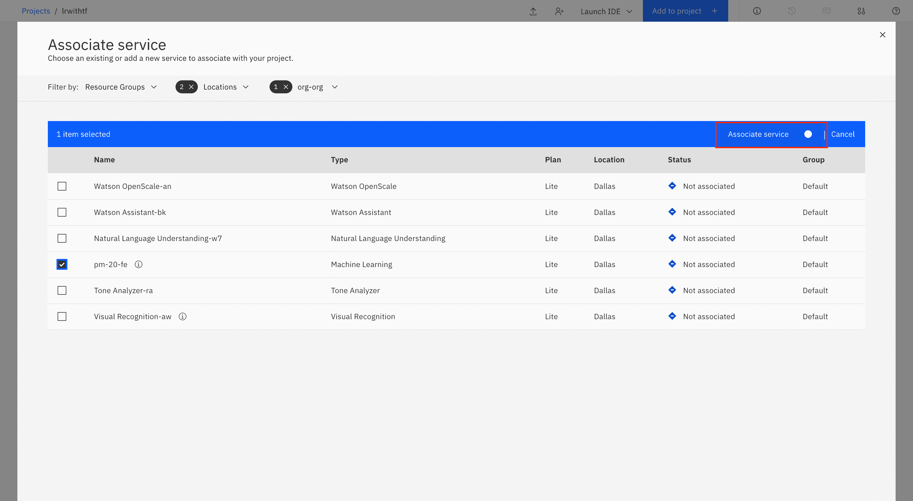

### 将数据集添加到您的项目

单击右侧的 **browse** 并选择 **csv file** 以将数据集添加到您的项目。可以从以下 URL 下载数据集：

```
https://github.com/IBM/dl-learning-path-assets/tree/main/fundamentals-of-deeplearning/data/FuelConsumption.csv 
```

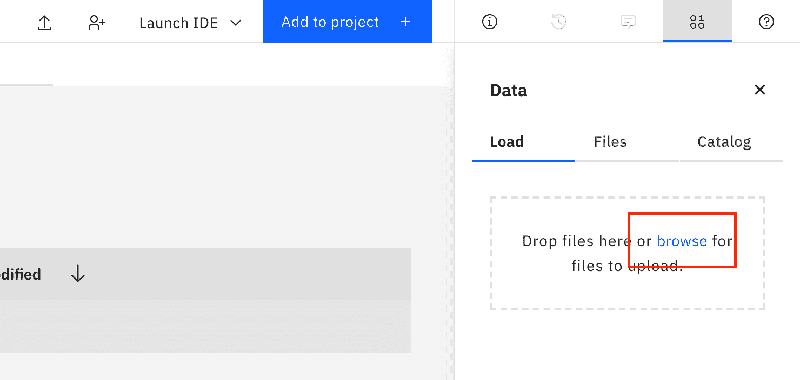

数据集上传后，将显示在“数据资产”下。

### 将 Notebook 添加到您的项目

1.  单击 **Add to Project**，然后在菜单中选择 **Notebook**，从而将 Jupyter Notebook 添加到您的项目。

    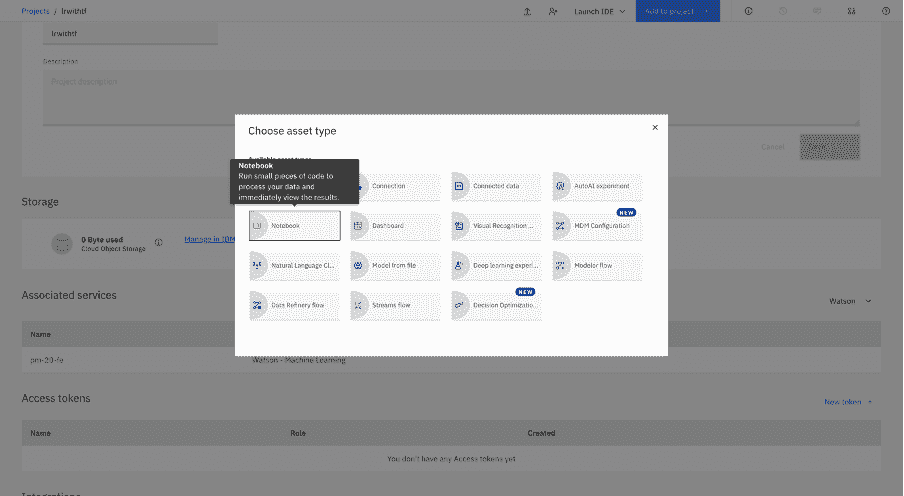

2.  选择 **From URL**，然后从 GitHub 存储库中粘贴 Notebook URL：

    ```
     https://github.com/IBM/dl-learning-path-assets/tree/main/fundamentals-of-deeplearning/notebooks/LinearRegressionwithTensorFlow.ipynb 
    ```

3.  命名您的 Notebook，然后单击 **Create**。

    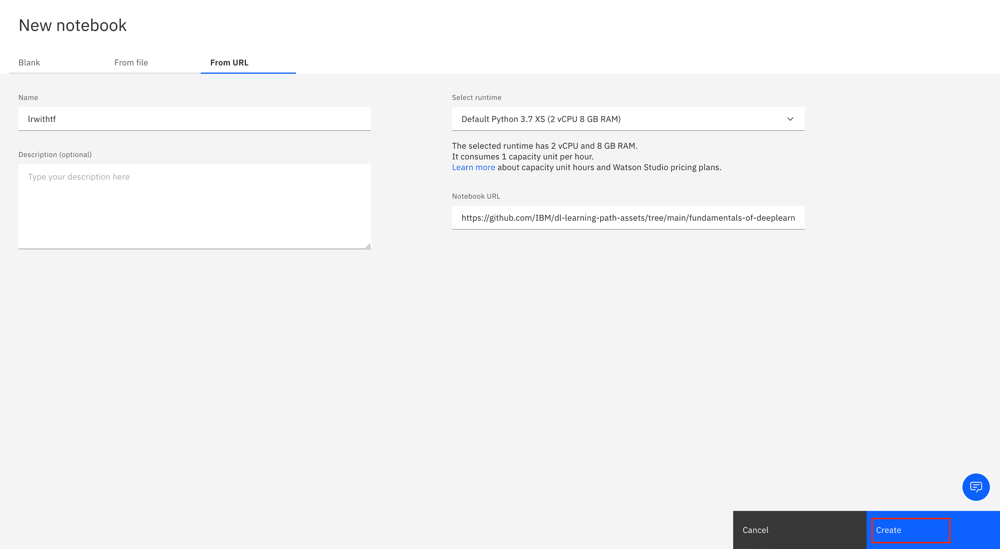

### 运行 Notebook

在加载 Notebook 后，浏览 Notebook。单击 **Cell**，然后单击 **Select Run All** 以运行 Notebook。

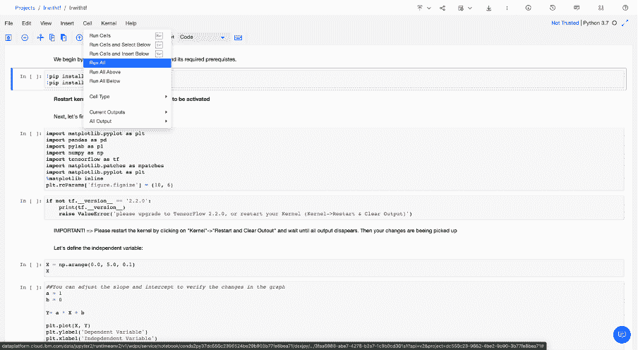

Notebook 提供了一个简单的线性函数示例，以帮助您了解 TensorFlow 背后的基本机制。

## 总结

在本教程和相关的 Notebook 中，您学习了线性回归的基础知识以及 TensorFlow 如何用于实现机器学习算法。您学习了如何在 IBM Cloud Pak for Data 即服务上使用 Watson Studio 运行 Jupyter Notebook，以及如何在 IBM Cloud Pak for Data 即服务中使用开源框架。

本文翻译自：[Perform linear regression using TensorFlow](https://developer.ibm.com/tutorials/build-a-linear-regression-neural-network-using-tensorflow/)（2020-11-06）