# 通过单点登录 (SSO) 保护企业应用程序， 并使用 IBM Security Verify 监控其使用情况

> 原文：[`developer.ibm.com/zh/tutorials/protect-applications-sso-ibm-security-verify/`](https://developer.ibm.com/zh/tutorials/protect-applications-sso-ibm-security-verify/)

[IBM Security Verify](https://www.ibm.com/products/verify-for-workforce-iam) 为每个用户提供身份即服务，包括单点登录 (SSO)、基于风险的多因素身份验证 (MFA) 和自适应访问、用户生命周期管理以及身份分析。

在本教程中，您将学习如何：

*   在 Security Verify 上为 SSO 添加和配置自定义应用程序
*   使用 Spring Security 为 SSO 修改 Java 应用程序
*   在 Security Verify 上监控应用程序的使用情况

## 前提条件

*   [IBM Security Verify 帐户](https://www.ibm.com/account/reg/signup?formid=urx-30041)。在注册帐户之后，将通过电子邮件发送帐户 URL (`https://[tenant name].verify.ibm.com/ui/admin`)。

在创建帐户时，将为您添加一个管理员帐户。

*   [Maven](https://maven.apache.org/)

*   [Java](https://www.oracle.com/in/java/technologies/javase-downloads.html)

*   [Git 客户端](https://git-scm.com/downloads)

## 预估时间

完成本教程大约需要 30 分钟。

## 步骤

### 在 IBM Security Verify 上添加自定义应用程序

1.  登录至 Security Verify。使用在确认电子邮件中发送给您的管理员帐户的 URL：`https://[tenant name].verify.ibm.com/ui/admin`。

2.  从左侧的菜单中选择 **Applications**。

3.  要添加应用程序，单击 **Add application**。

4.  应用程序类型选择 `Custom Application`，然后单击 **Add application**。

    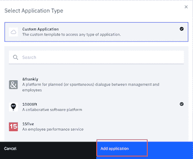

5.  指定应用程序的名称。然后在 General 选项卡上，指定公司名称。

    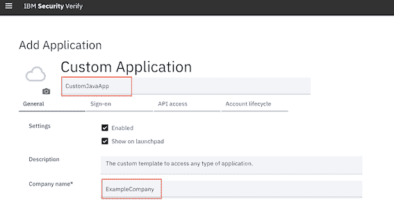

6.  单击 Sign-on 选项卡。使用带有 `Authorization code` 方案的基于 [OpenID Connect](https://openid.net/connect/) 的身份验证配置 SSO。指定以下值：

    *   对于 **Sign-on method**，选择 `Open ID Connect 1.0`。
    *   对于 **Application URL**，输入 `http://localhost:8080`。
    *   对于 **Grant types**，选中 **Authorization code**。
    *   取消选中 **Require proof key for code exchange (PKCE) verification**。
    *   对于 **Redirect URIs**，输入 `http://localhost:8080/login`。

        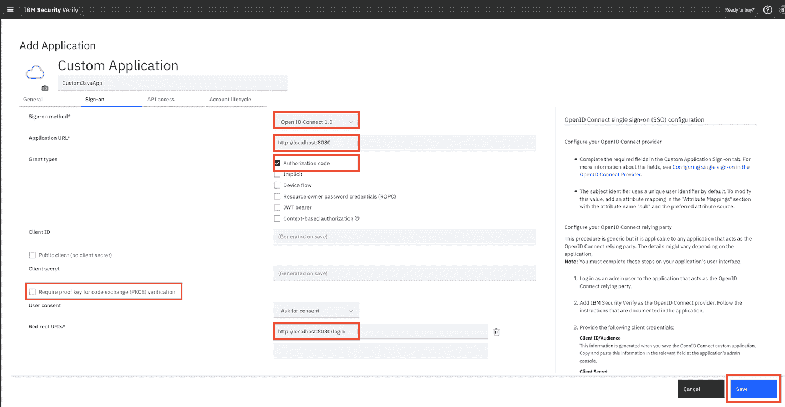

        单击 **Save** 以保存此 SSO 配置。

7.  单击 Entitlements 选项卡。对于 **Access Type**，选择 **Automatic access for all users and groups**。单击 **Save** 以保存自定义应用程序。

### 记下应用程序设置和端点

要在 Java 应用程序中设置 SSO，您需要应用程序设置和端点。

1.  从 Security Verify 菜单，单击 **Applications**。

2.  从 Applications 列表，选择包含刚创建的自定义应用程序的行，然后单击 **Settings** 图标。

    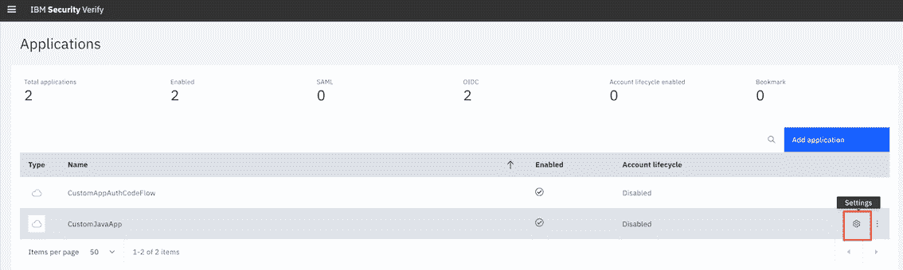

3.  单击 Sign-on 选项卡。记下客户机标识和客户机密钥。

    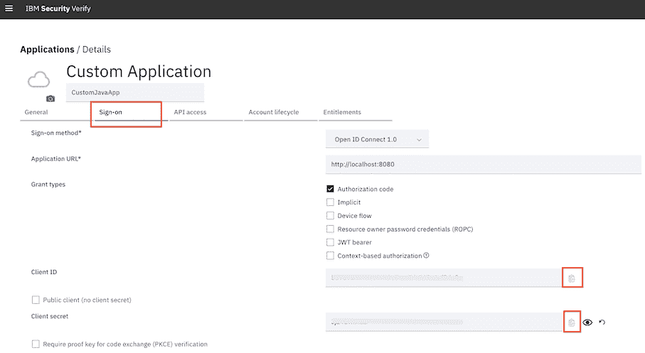

4.  在最右侧的信息窗格中，记下 IBM Security Verify 端点。

    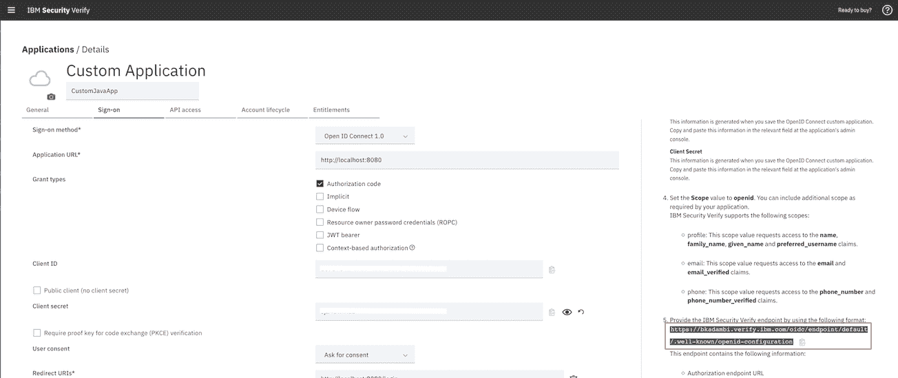

5.  在新浏览器窗口中，打开 IBM Security Verify 端点。然后，记下以下端点：`authorization_endpoint`、`token_endpoint` 和 `userinfo_endpoint`。

    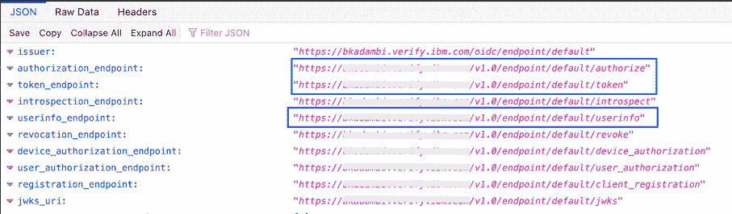

### 部署样本 Java 应用程序

1.  克隆包含样本 Java 应用程序的 GitHub 代码库。

    ```
     git clone https://github.com/IBM/custom-javaapp-security-verify-tutorial.git 
    ```

2.  在您的本地系统上，转至 resources 目录：`custom-javaapp-security-verify-tutorial/src/main/resources/`。

3.  编辑并配置 `application.yml` 文件。利用您在先前步骤中记下的应用程序设置和端点，使用 `Client ID`、`Client secret`、`token_endpoint`、`authorization_endpoint` 和 `userinfo_endpoint` 信息填写 `clientId`、`clientSecret`、`accessTokenUri`、`userAuthorizationUri` 和 `userInfoUri`。

    确保每个条目的冒号后面都有一个空格。如果没有空格，`application.yml` 文件将无法正确加载。

    ```
     security:
       oauth2:
         client:
           clientId: 317xxxxxxxxxxxxxxxxx2717d
           clientSecret: LXuxxxxxZ4
           accessTokenUri: https://xxxx.verify.ibm.com/v1.0/endpoint/default/token
           userAuthorizationUri: https://xxxx.verify.ibm.com/v1.0/endpoint/default/authorize
           tokenName: access_token
           authorizedGrantTypes: authorization_code
           authenticationScheme: form
           clientAuthenticationScheme: form
           scope: openid,profile,email
         resource:
           userInfoUri: https://xxxx.verify.ibm.com/v1.0/endpoint/default/userinfo
     server:
       port:  8080 
    ```

4.  从 `custom-javaapp-security-verify-tutorial` 文件夹运行样本 java 应用程序：

```
mvn spring-boot:run 
```

### 向 Security Verify 添加新用户

将您自己添加为用户，以针对 Java 应用程序测试 SSO。确保使用与创建 Security Verify 帐户时不同的电子邮件地址。

1.  从 Security Verify 菜单，单击 **Users & Groups**。

2.  单击 **Add user**。

3.  在 Add user 对话框中，为 **Identity source** 选择 `Cloud Directory`。然后，输入 **Given name**、**Surname**、**User name** 和 **Work e-mail**。确保使用与创建 Security Verify 帐户时使用的电子邮件地址不同的电子邮件地址。单击 **Save**。

    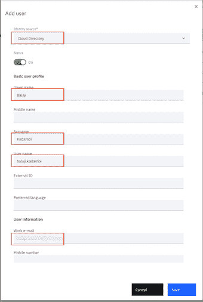

4.  检查电子邮件帐户中是否有来自 Security Verify 的确认邮件。电子邮件包含一个临时密码和一个用于登录到 Security Verify 的链接。登录到 Security Verify 并更改您的密码。

    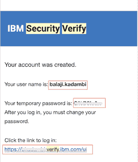

### 使用 SSO 访问应用程序

1.  打开新的浏览器窗口。清除所有浏览器缓存。

2.  导航到 `http://localhost:8080`。这会将您重定向到 Security Verify 身份验证页面。输入您的凭证，然后单击 Continue 以提供访问权。将显示应用程序页面。

    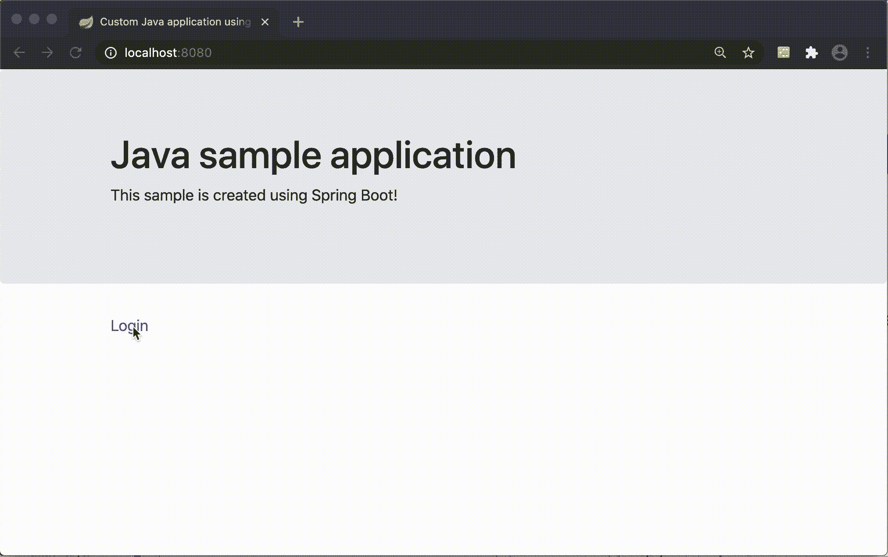

还将保护以下端点：`http://localhost:8080/user` 和 `http://localhost:8080/userInfo`。要测试它们，可打开一个新的私有（或隐身）浏览器窗口。访问上述端点之一，它将重定向到 Security Verify 进行身份验证。

### 监控应用程序使用情况

要监控访问应用程序的程度，可以为其生成报告。

1.  从 Security Verify 菜单，单击 **Reports**。

2.  在 Application usage 框中，选择应用程序，然后单击 **View report**。

3.  查看应用程序的用户活动。

    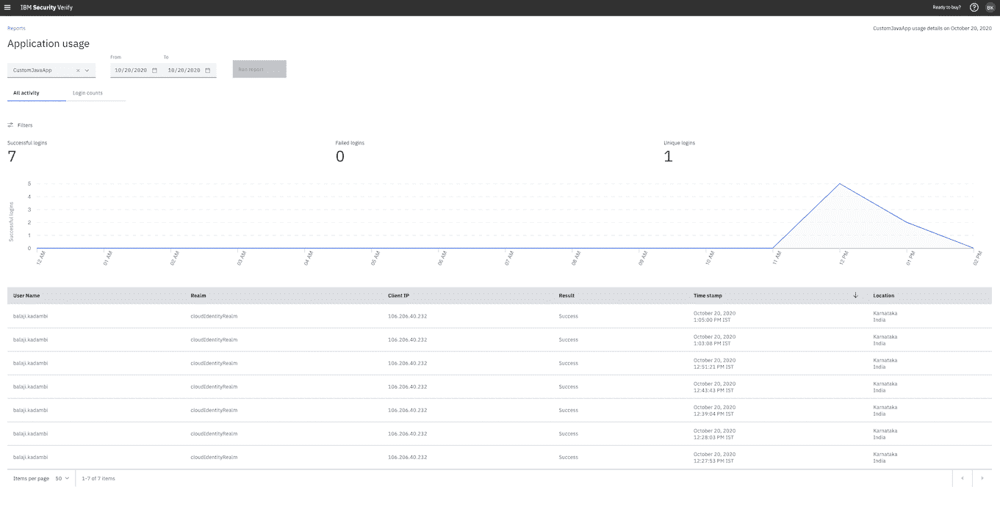

### 结束语及后续步骤

在本教程中，您已使用 Security Verify 将 SSO 添加到自定义 Java 应用程序中。您了解了如何使用 Spring Security 配置 OpenID Connect 客户端以使用 Security Verify。

接下来，探究如何将 SSO 添加到 [Node](https://github.com/IBM-Security/verify-sdk-javascript)、[Android](https://github.com/IBM-Security/verify-sdk-android) 或 [iOS](https://github.com/IBM-Security/verify-sdk-ios) 应用程序。

本文翻译自：[Protect enterprise applications with single sign-on (SSO) and monitor their usage using IBM Security Verify](https://developer.ibm.com/tutorials/protect-applications-sso-ibm-security-verify/)（2020-11-12）