# 将可信 AI 软件包添加到自定义的 Anaconda 通道

> 原文：[`developer.ibm.com/zh/tutorials/industry-applications-using-dax-dataset-with-anaconda-repository-with-ibm/`](https://developer.ibm.com/zh/tutorials/industry-applications-using-dax-dataset-with-anaconda-repository-with-ibm/)

本教程介绍了如何将可信 AI 软件包添加到自定义的 Anaconda 通道，以及如何在 IBM Cloud Pak® for Data 的 IBM Watson® Studio 中使用这些软件包来解决业务用例。

## 学习目标

我们正在试图解决二元分类问题，以便预测抵押能否得到批准。基于各种信任维度（包括预测性能、公平性、对抗鲁棒性等）来评估各种模型。

使用 Anaconda 中央企业存储库时，您可以：

*   访问 7,500 多个 Python 和 R 软件包
*   添加自己的专有软件包
*   管理软件包的漏洞、访问和使用，从而提供安全的管道
*   在用户工作流程中轻松地分发软件包

我们将结合使用这些功能来开发安全应用程序。

## 步骤

1.  安装 [IBM Cloud Pak for Data](https://www.ibm.com/support/producthub/icpdata/docs/content/SSQNUZ_current/cpd/install/install.html)。
2.  为 IBM Cloud Pak for Data 安装 [Anaconda 存储库](https://www.ibm.com/support/producthub/icpdata/docs/content/SSQNUZ_current/svc-anaconda/anaconda_install.html)。存储指向 Anaconda 用户管理 UI (Keycloak) 的链接和登录凭证。
3.  使用所显示的登录凭证来打开 Anaconda Team Edition 登录页面。
4.  创建通道并设置适当的权限。
5.  由于默认情况下不提供可信 AI 软件包，因此需将软件包文件（wheel、sdist、egg）上传到 Anaconda 通道。
6.  在 IBM Cloud Pak for Data 中配置 Anaconda，以便访问 Anaconda 存储库中的软件包。
7.  配置 Watson Studio 环境以使用自定义通道。
8.  在自定义环境中创建一个 Notebook 并运行该 Notebook。

提供了以下可信 AI 软件包：

*   AIF360，其在整个 AI 应用程序生命周期中帮助检测和减轻机器学习模型的偏差
*   AIX360，其提供了数据和机器学习模型的可解释性和可解读性
*   ART，这是一个可确保机器学习安全性的 Python 库，包括入侵、毒化、提取和推理

## 步骤

### 第 1 步：使用凭证

登录凭证如下所示：

```
User anaconda created, realm=dev, roles=admin
password: xxxx
User admin created, realm=master, roles=admin
password: xxx
…
…
…
Install success
Please login using admin username and generated admin password above at http://xx.xx.xx.xx/auth/admin 
```

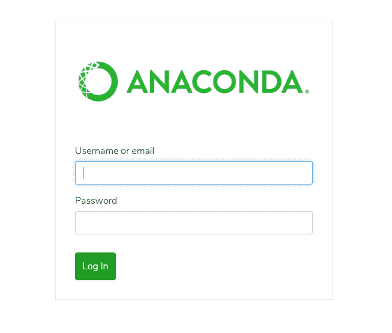

### 第 2 步：创建一个新通道

通过单击 **Create Channel**、填写详细信息并设置隐私来创建一个通道。在本文中，通道名称设置为 **trusted_ai**。

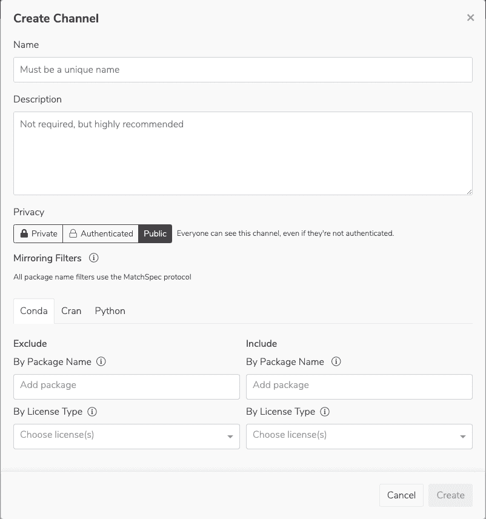

### 第 3 步：上传文件

接下来，您将软件包文件上传到 **trusted_ai** 通道。

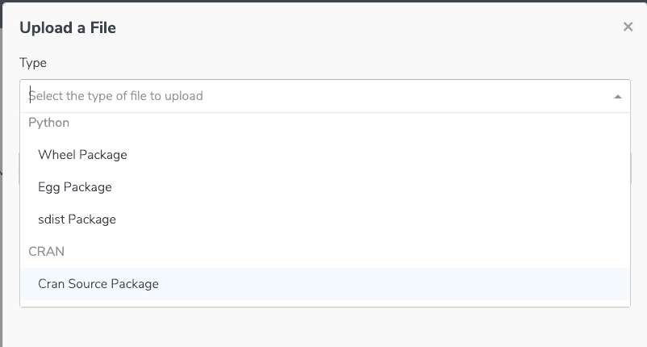

| 软件包 | Wheel 文件位置 |
| --- | --- |
| AI Fairness 360 | [`pypi.org/project/aif360/#files`](https://pypi.org/project/aif360/#files) |
| AI Explainability 360 | [`pypi.org/project/aix360/#files`](https://pypi.org/project/aix360/#files) |
| Adversarial Robustness Toolbox | [`pypi.org/project/adversarial-robustness-toolbox/#files`](https://pypi.org/project/adversarial-robustness-toolbox/#files) |

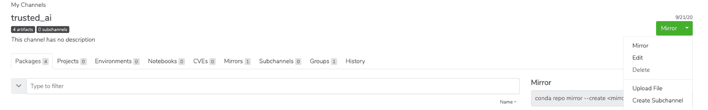


上传软件包后，您将看到下图。

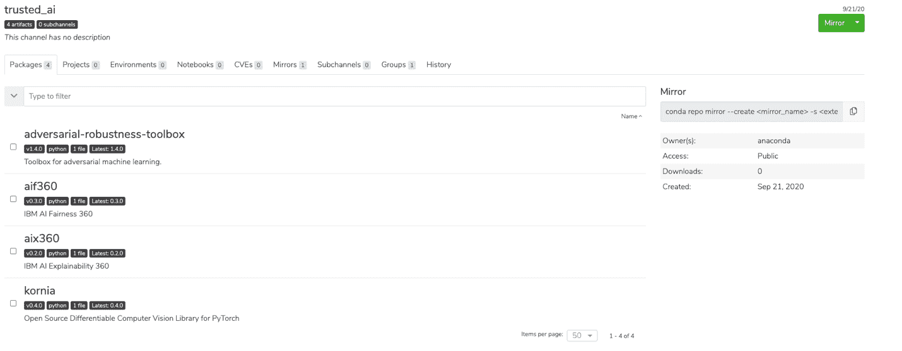

您可以查看软件包的漏洞评分、使用此通道的组、每个软件包的依赖关系等。这样便可以创建安全的托管型管道。

### 第 4 步：访问通道软件包

更新 [condarc](https://www.ibm.com/support/producthub/icpdata/docs/content/SSQNUZ_current/wsj/analyze-data/anaconda.html) IBM Cloud Pak for Data 文件，以访问新通道中的软件包。

```
channel_alias: http://xx.xx.xx.xx/api/repo

channels:
 - trust_ai

default_channels:
 - http://xx.xx.xx.xx/api/repo/trust_ai

ssl_verify: False 
```

### 第 5 步：创建一个 Watson Studio 项目

登录到 Cloud Pak for Data 集群，创建一个新的 Watson Studio 项目并创建新的环境。

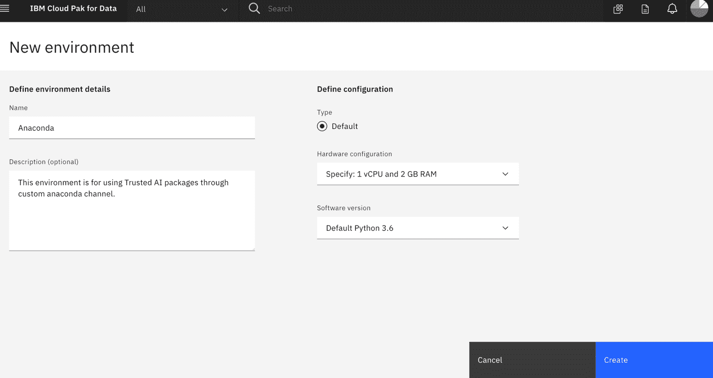

### 第 6 步：更新定义

通过单击 **customization** 下的 **Create** 来更新要使用的环境定义。按照说明进行编辑并应用更改。

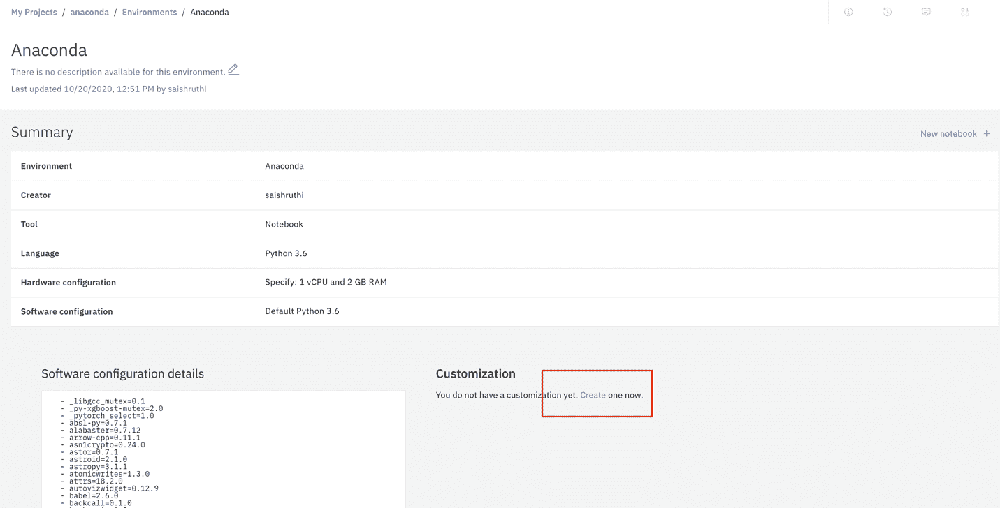

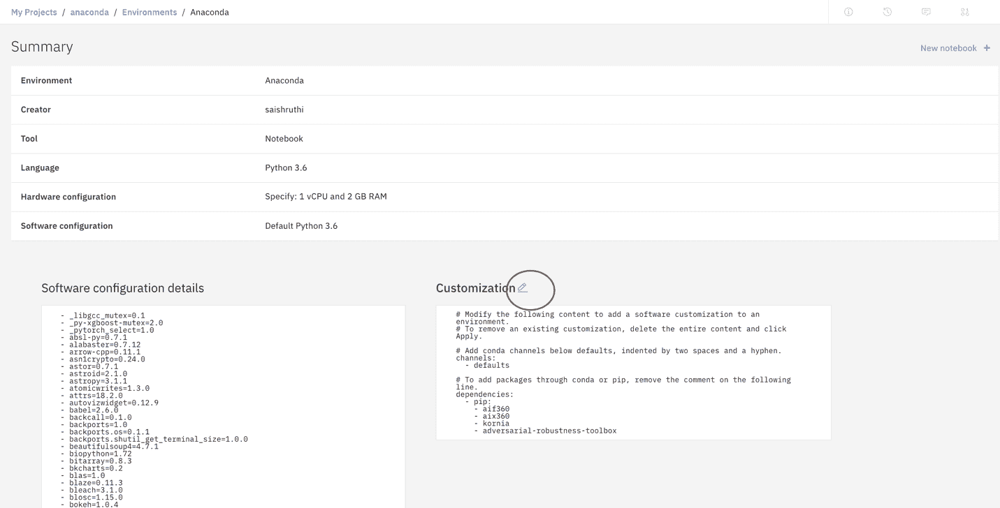

### 第 7 步：使用新环境运行

上传[抵押批准](https://github.com/IBM/anaconda-cpd-mortgage-approval/blob/main/Mortgage_Approval.ipynb)并使用新环境运行。

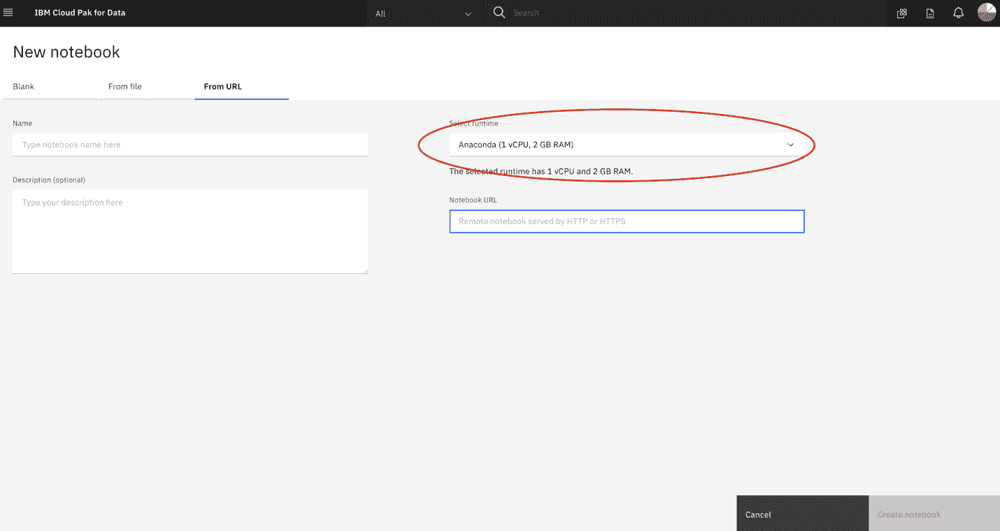

此 Notebook 首先会应用这些自定义项。现在，您可以在不安装可信 AI 软件包的情况下运行 Notebook。

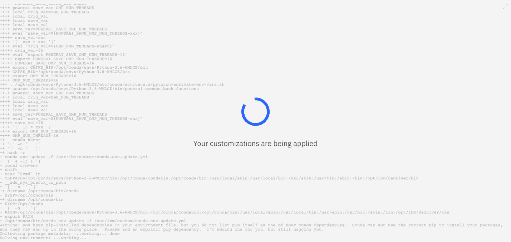

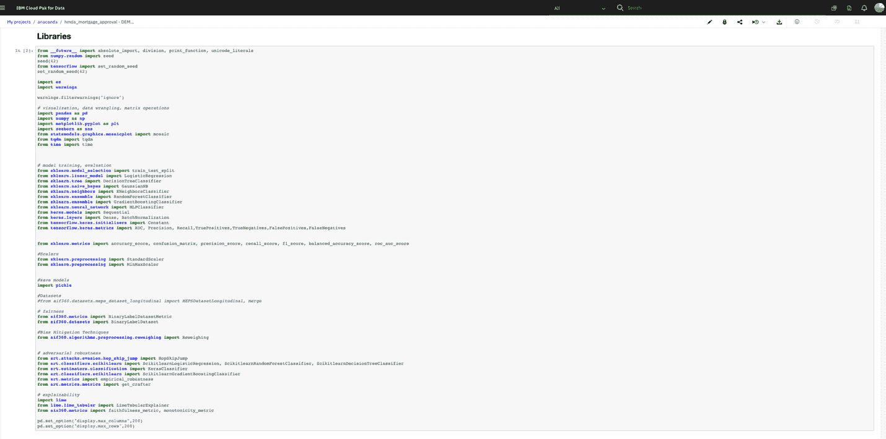

## 结束语

本教程展示了如何将可信 AI 软件包添加到自定义的 Anaconda 通道，以及如何在 IBM Cloud Pak® for Data 的 IBM Watson Studio 中使用这些软件包来解决业务用例。

本文翻译自：[Add trusted AI packages to a custom Anaconda channel](https://developer.ibm.com/tutorials/industry-applications-using-dax-dataset-with-anaconda-repository-with-ibm/)（2020-10-26）