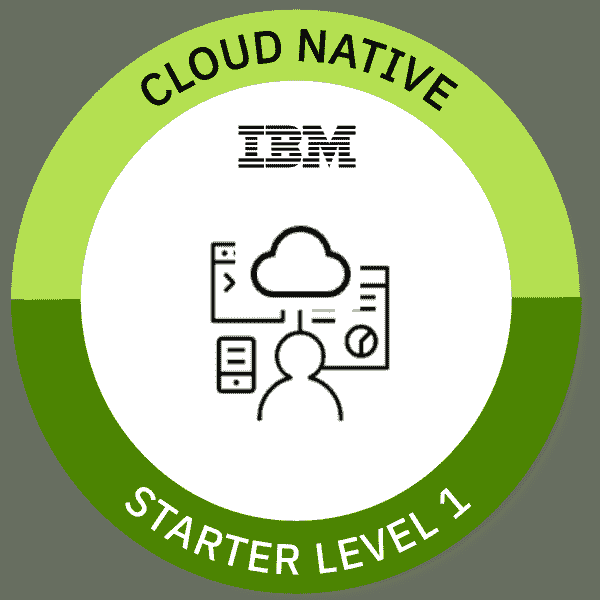

# 启动并运行 Java 微服务

> 原文：[`developer.ibm.com/zh/tutorials/get-your-java-microservice-up-and-running-workshop/`](https://developer.ibm.com/zh/tutorials/get-your-java-microservice-up-and-running-workshop/)

## 学习目标

在本次研讨会中，您将学习如何使用 Java 构建微服务并将其部署到 IBM Cloud 上的 Kubernetes。本次研讨会中会尽可能使用简单的微服务，以便可以将其用作其他微服务的起点。

完成本次研讨会后，您将能够：

*   了解基于开放技术 Eclipse MicroProfile 和 Open Liberty 构建的云原生 RESTful Java 微服务的 Java 实现。
*   了解如何在容器中的本地计算机上有效地构建并运行微服务
*   了解将单个微服务部署到 Kubernetes 和 IBM Cloud Kubernetes 服务时需要执行的步骤

完成本次研讨会后，您可以通过至少答对 80% 的题目来通过测验，进而获得 [Cloud Native 初学者 1 级徽章](https://www.youracclaim.com/org/ibm/badge/cloud-native-starter-level-1)。

## 前提条件

要参加本次研讨会，您将需要：

*   创建一个 [IBM Cloud 帐户](https://cloud.ibm.com/registration?cm_sp=ibmdev-_-developer-tutorials-_-cloudreg)（或者[登录](https://cloud.ibm.com/login?cm_sp=ibmdev-_-developer-tutorials-_-cloudreg)到现有帐户）
*   创建一个免费的 IBM Cloud Kubernetes 集群
*   在您的本地计算机上安装 [Docker Desktop](https://docs.docker.com/install/)，以便能够访问包含所有必需 CLI 的 Docker 镜像

## 预估时间

完成本次研讨会大约需要 1 小时。

## 步骤

1

### 设置本地和 IBM Cloud 环境

遵循本次研讨会的“[概述](https://ibm-developer.gitbook.io/get-your-java-microservice-up-and-running/setup-local-and-ibm-cloud-environment/pre-work)”部分中的步骤：

*   注册 [IBM Cloud](https://cloud.ibm.com/registration?cm_sp=ibmdev-_-developer-tutorials-_-cloudreg)
*   创建一个免费的 Kubernetes 集群
*   配置容器注册表
*   为本地开发和云部署完成相应设置
*   访问 Kubernetes 集群

2

### 在本地运行 Java 微服务

设置完毕后，您将在 Dockerfile 中设定如何构建容器镜像。通过使用多阶段构建，您将创建一个负责构建微服务的容器（构建环境容器），以及另一个包含微服务本身的容器（生产容器）。通过使用生产容器，可以在本地运行微服务。

完成本次研讨会的“[在本地运行 Java 微服务](https://ibm-developer.gitbook.io/get-your-java-microservice-up-and-running/exercises/exercise-01)”部分中的步骤。

3

### Java 实现

了解如何对该项目使用 Maven、如何配置 Open Liberty 服务器，以及如何使用 MicroProfile 实现 REST GET 端点。通过更改 Authors 微服务的代码并在容器中本地运行该服务来获得动手实践经验。

完成本次研讨会的“[Java 实现](https://ibm-developer.gitbook.io/get-your-java-microservice-up-and-running/exercises/exercise-02)”部分中的步骤。

4

### 部署到 Kubernetes

在[本节](https://ibm-developer.gitbook.io/get-your-java-microservice-up-and-running/exercises/exercise-03)中，您将会使用 Kubernetes Web 控制台和 Kubernetes CLI。

本节包含以下两个部分：

*   开始构建并保存容器镜像
*   部署应用程序并公开服务，您将在其中完成以下操作：

    *   定义并应用部署配置 (yaml) 以使用微服务创建 Pod
    *   定义一个服务以使用微服务将请求路由到 Pod

## 结束语

现在，您了解了如何使用 Java 构建微服务并将其部署到 IBM Cloud 上的 Kubernetes。使用本次研讨会中的微服务作为其他微服务的起点。

您还可以通过测验来检验自己的学习成果并获得 [Cloud Native 初学者 1 级徽章](https://www.youracclaim.com/org/ibm/badge/cloud-native-starter-level-1)。

本文翻译自：[Get your Java microservice up and running](https://developer.ibm.com/tutorials/get-your-java-microservice-up-and-running-workshop/)（2020-10-27）