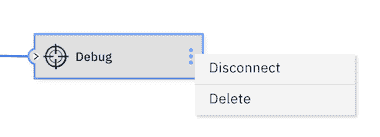

# 无需编写代码即可创建您的首个 IBM Streams 应用程序

> 原文：[`developer.ibm.com/zh/tutorials/create-your-first-ibm-streams-app-without-writing-code/`](https://developer.ibm.com/zh/tutorials/create-your-first-ibm-streams-app-without-writing-code/)

**本教程已纳入[学习路径：IBM Streams 入门](https://developer.ibm.com/zh/series/getting-started-with-ibm-streams-learning-path)**。

| 级别 | 主题 | 类型 |
| --- | --- | --- |
| 100 | [IBM Streams 简介](https://developer.ibm.com/zh/articles/introduction-ibm-streams/) | 文章 |
| **101** | **无需编写代码即可创建您的首个 IBM Streams 应用程序** | **教程** |
| 201 | [从 Apache Kafka 提取数据](https://developer.ibm.com/zh/patterns/add-event-streams-and-a-db-in-python-to-clickstream) | Code Pattern |
| 301 | [使用 Python API 构建流应用程序](https://developer.ibm.com/zh/patterns/build-a-streaming-app-using-ibm-streams-python-api) | Code Pattern |
| 401 | [使用机器学习模型对流数据评分](https://developer.ibm.com/zh/patterns/score-streaming-data-with-a-machine-learning-model) | Code Pattern |

## 简介

本教程的目的是教您如何构建和演示流应用程序。流应用程序从数据源开始，执行一些数据处理（例如过滤和汇总），然后将结果发送到目标。在本教程中，我们将使用 IBM Streams Flows 构建流应用程序。借助 IBM Cloud Pak® for Data 上的 IBM Streams Flows，无需编写任何代码，即可在易于使用的用户界面中构建流应用程序。在进入更高级的场景（其中您更有可能编写一些代码来完成某些处理）之前，最好先在直观的可视化用户界面中体验流应用程序。

## 前提条件

若要全面了解 IBM Streams，建议您从 [IBM Streams 简介](https://developer.ibm.com/zh/articles/introduction-ibm-streams/)开始。

要完成本教程，您需要有访问 IBM Cloud Pak for Data 和 IBM Streams 实例的权限。

## 预估时间

完成本教程大约需要 30 分钟。

## 步骤

1.  确认有 IBM Cloud Pak for Data 上的 IBM Streams 实例的访问权限。
2.  在 IBM Cloud Pak for Data 中创建一个新项目。
3.  尝试将示例 IBM Streams 流与点击流数据结合使用。
4.  从头开始重建应用程序。
5.  添加一个汇总操作程序。

### 第 1 步：确认对 IBM Cloud Pak for Data 上的 IBM Streams 实例的访问权限

登录到 IBM Cloud Pak for Data 实例后，确保管理员已配置一个 IBM Streams 实例，并已向用户授予对该实例的访问权限。

要查看可用服务，可单击服务图标并搜索 `Streams`。您应该会看到 **Enabled** 指示器。

要查看已配置的实例，可单击屏幕左上角的汉堡 (☰) 菜单图标，然后单击 **My Instances**。

### 第 2 步：在 IBM Cloud Pak for Data 中创建一个新项目

在 IBM Cloud Pak for Data 中，我们使用项目来收集和组织用于实现特定目标的资源（即，用于构建问题解决方案的资源）。项目资源可能包括数据、合作者以及诸如 Notebook、模型、IBM Streams Flows 之类的分析资产。

单击屏幕左上角的汉堡 (☰) 菜单，然后单击 **Projects > New project +**，创建一个空项目，并为该项目输入一个唯一名称，然后单击 **Create**。

### 第 3 步：尝试将示例 IBM Streams 流与点击流数据结合使用

此示例应用程序将提取点击流数据并按类型过滤掉事件。点击流数据是通过 **Sample Data** 源操作程序生成的。使用 **Filter** 操作程序来仅保留“add_to_cart”事件（丢弃其他事件数据）。最后，使用 **Debug** 目标操作程序来帮助演示结果。运行该应用程序时，您可以监视在应用过滤器之前和之后的数据，以了解其是否正常运行。

1.  单击 **Add to project +**。 

2.  选择资产类型 **Streams flow**。 

3.  单击 **From example** 选项卡，提供名称，选择您的 **Streams instance**，选择 **Clickstream Example** 卡，然后单击 **Create**。 

4.  创建完毕后，您将看到一个应用程序，其中包含由两个流连接的三个操作程序。 

5.  将鼠标悬停在按钮栏上以查看可用操作。您应该会看到用于执行以下操作的按钮：

    *   启动 IBM Streams 流。
    *   停止流（该流因为已停止而被禁用）
    *   在此项目中生成流副本。
    *   将流副本导出到文件中。
    *   删除流。
    *   编辑流。
    *   管理 IBM Streams。
    *   显示通知。
    *   查看所有流。
6.  点击 **Play** 按钮以构建并运行示例流。

7.  运行该流后，单击该流的各个部分以查看更多信息。注意，动画显示了从 **Sample Data** 到 **Filter**，再从 **Filter** 到 **Debug** 的流。第二个流中的数据会少很多，因为过滤器仅保留了“add_to_cart”事件。根据您选择的内容，右侧的表格将为您提供流式传输的数据视图。 

    **注意：**使用 **Debug** 作为最终节点非常适合进行这样的可视化测试。一旦该流按预期工作，Debug 节点就会替换为其他目标（例如，数据库、文件或 Kafka 代理）。

8.  单击 **Stop** 按钮以停止流应用程序。

恭喜您！您已运行了第一个流应用程序。

### 第 4 步：从头开始重建应用程序

接下来，我们将不使用该示例，而是从头开始构建一个应用程序。这仍然是一个简单练习（我们将利用样本数据源和 Debug 目标操作程序），但它有利于您全面了解编辑器，并向您展示了一些其他功能。具体操作如下：

1.  返回到您的项目。
2.  单击 **Add to project +**。
3.  选择资产类型 **Streams flow**。
4.  单击 **Blank** 选项卡，提供 **Name**，选择您的 **Streams instance**，选择 **Manually** 卡，然后单击 **Create**。

创建空白 IBM Streams 流时，系统会带您进入编辑器。这看起来与我们之前使用的示例略有不同。记住，我们可以单击画笔图标来编辑该示例。

注意，侧边栏中包含 **Sources**、**Targets**、**Processing and Analytics**、**Alerts**、**Connections** 和 **WML Deployments** 下拉菜单。

1.  展开 **Sources**。
2.  将 **Sample Data** 拖放到画布上。
3.  展开 **Processing and Analytics**。
4.  将 **Filter** 拖放到画布上。每个操作程序都用一个红点来指示错误。您可以将鼠标悬停在每个红点上，以查看该操作程序缺少的内容。您也可以使用右上角的通知图标。 

我们来填写缺少的设置，然后将它们连接起来：

1.  单击 **Sample Data**。
2.  在右侧边栏和 **Topic** 中，下拉以选择 **Clickstream**。注意，您可以在此处编辑或重新排列 **Output Schema**，但我们现在不需要这样做。 

3.  单击 **Filter** 操作程序。

4.  在右侧边栏中，将 **Conditional Expression** 从 True 更改为 `click_event_type == "add_to_cart"`。 

您应该还剩下三个错误：

*   **Sample Data** 需要输出流。
*   **Filter** 需要输入流和输出流。
*   **Debug** 需要输入流。

要将它们连接起来，可从输出选项卡上的小圆圈拖放到输入选项卡上的小圆圈，如下图所示。

现在，您应该已解决了所有错误。接下来：

1.  使用 **Save** 保存您的 IBM Streams 流。
2.  使用 **Play** 构建并运行流。
3.  单击流以查看动态数据的预览。
4.  您应该会看到与我们先前在使用提供的示例时尝试过的相同的工作流应用程序。
5.  使用 **Stop** 按钮停止应用程序。

提示：单击每个操作程序时，可通过侧边栏来编辑显示名称。

### 第 5 步：添加一个汇总操作

我们来尝试将汇总操作添加到示例中。为了演示 **Aggregation** 操作，我们将使用一个持续 30 秒的滑动窗口，并在该滑动窗口中跟踪每个客户添加到购物车的产品的总价。我们不会输出所有“添加到购物车”事件，而只会输出客户 ID 和总价。

1.  将鼠标悬停在 **Debug** 操作上，然后使用三个垂直点菜单对该操作程序执行 **Disconnect** 操作。 

2.  将 **Aggregation** 操作程序从 **Processing and Analytics** 下拖放到画布上的 **Filter** 和 **Debug** 操作程序之间。**注意：**您可以拖动现有操作程序以将其排列在画布上，并为新操作程序腾出空间。

3.  通过拖放操作将 **Filter** 的输出连接到 **Aggregation** 的输入，并将 **Aggregation** 的输出连接到 **Debug** 操作程序的输入。

4.  单击 **Aggregation** 操作程序以在侧边栏中填写缺少的信息。您必须选择 **AGGREGATION WINDOW**。例如，尝试 **sliding**。您可以单击 Type 旁边的信息图标，以获取有关轮转窗口和滑动窗口选项的描述：

    *   对于 **Time Unit**，选择 **second**。
    *   将 **Number of Time Units** 设置为 `30`。
    *   在 **Partition By** 下，使用 **Select Attribute…** 下拉菜单来选择 **customer_id**。
5.  在 **AGGREGATION DEFINITION** 下：

    *   在 **Group By** 下，使用 **Select Attribute…** 下拉菜单来选择 **customer_id**。 
6.  在 **Functions** 下：

    *   将 **Output Field Name** 设置为 **customer_id**。
    *   将 **Function Type** 设置为 **PassThrough**。
    *   对于 **Apply Function to**，选择属性 **customer_id**。
    *   单击 **Add Function +** 按钮以再次获得 **Enter Function Details**。
    *   将 **Output Field Name** 设置为 `sum_product_price`。
    *   将 **Function Type** 设置为 **Sum**。
    *   对于 **Apply Function to**，选择 **product_price** 属性。 
7.  展开 **SCHEMA**，查看 **Output Schema**。输出现在包含通过汇总此滑动窗口中的数据而生成的 customer_id 和 sum_product_price。

8.  保存并运行具有过滤和汇总功能的新流应用程序。 

9.  记住，按下 **Stop** 按钮来停止该应用程序。

## 后续步骤

通过这个简单示例（无需编写任何代码），我们演示了可使用流应用程序执行的许多操作。现在，您可以浏览 UI 来寻找您可能想要尝试的其他操作程序。如果您拥有现成的示例，您可能还想了解如何复制、导出和导入应用程序。

本教程已纳入[学习路径：IBM Streams 入门](https://developer.ibm.com/zh/series/getting-started-with-ibm-streams-learning-path)。要继续学习本系列教程并了解有关 IBM Streams 的更多信息，可查看本系列教程的下一部分：[从 Apache Kafka 提取数据](https://developer.ibm.com/zh/patterns/add-event-streams-and-a-db-in-python-to-clickstream) Code Pattern。在继续完成此学习路径的过程中，我们会向您展示如何将机器学习模型用于中流 AI，以及如何添加包含 Python 代码的操作程序。我们甚至会使用 Python API，通过 Jupyter Notebook 来运行流应用程序。

本文翻译自：[Create your first IBM Streams app without writing code](https://developer.ibm.com/tutorials/create-your-first-ibm-streams-app-without-writing-code/)（2020-11-23）