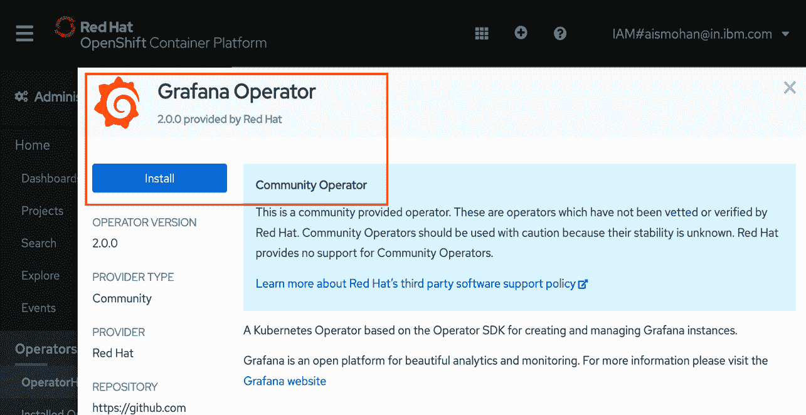
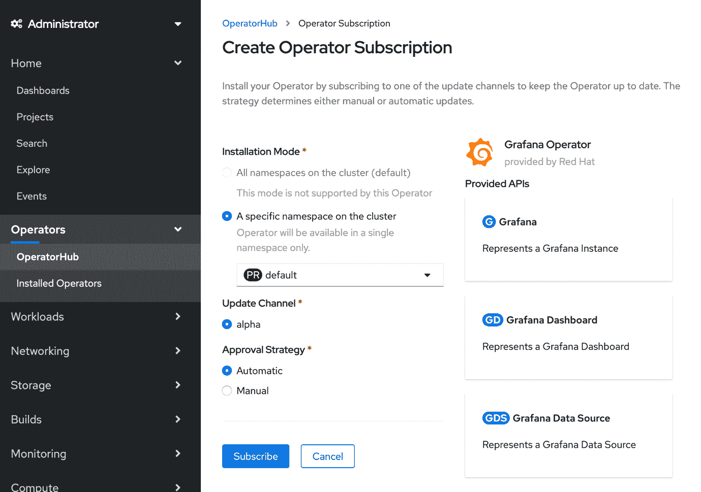
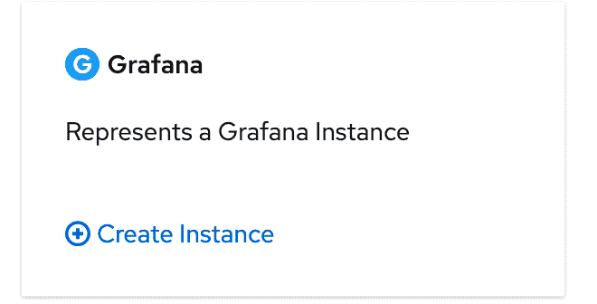
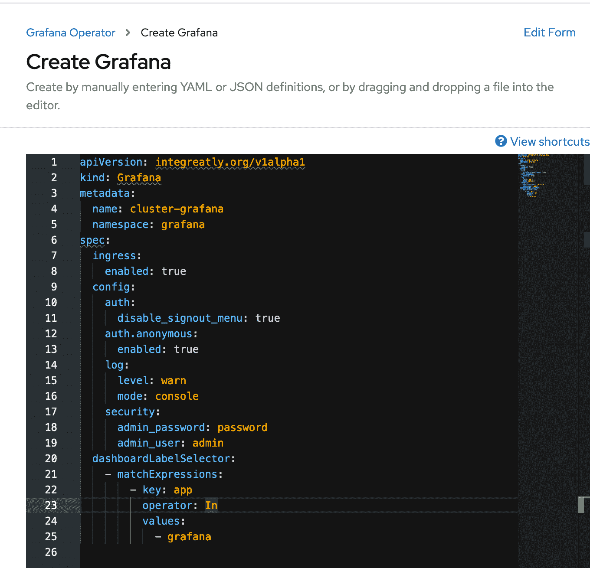
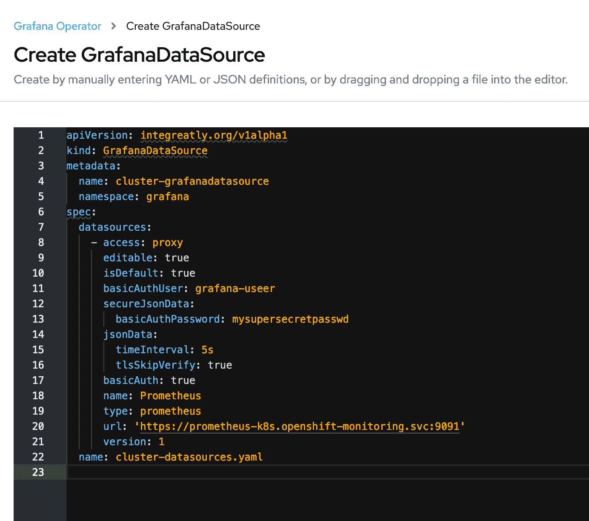
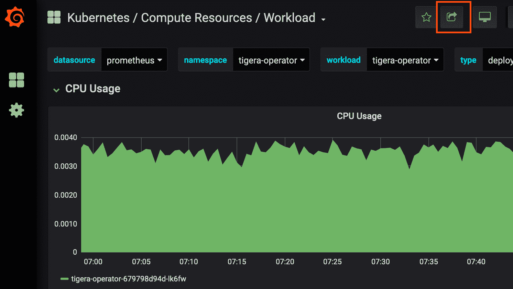
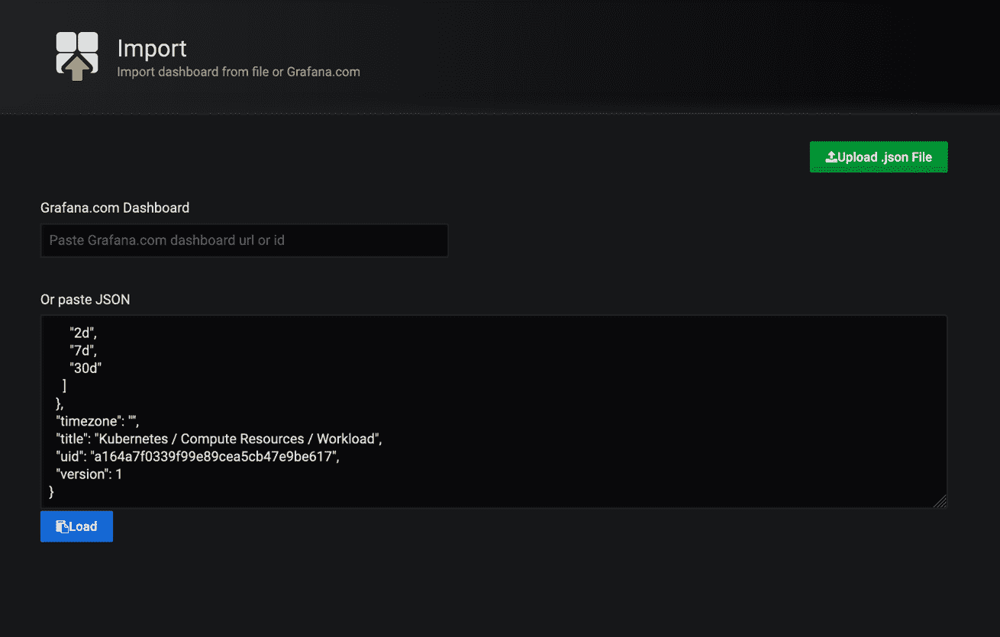
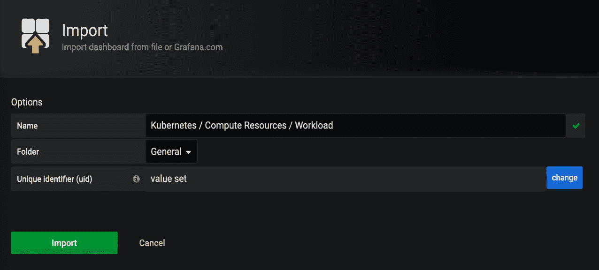
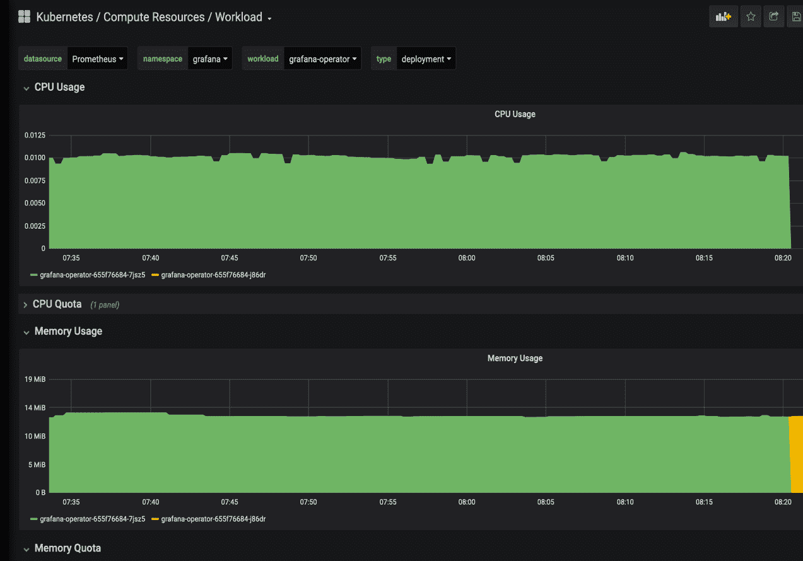
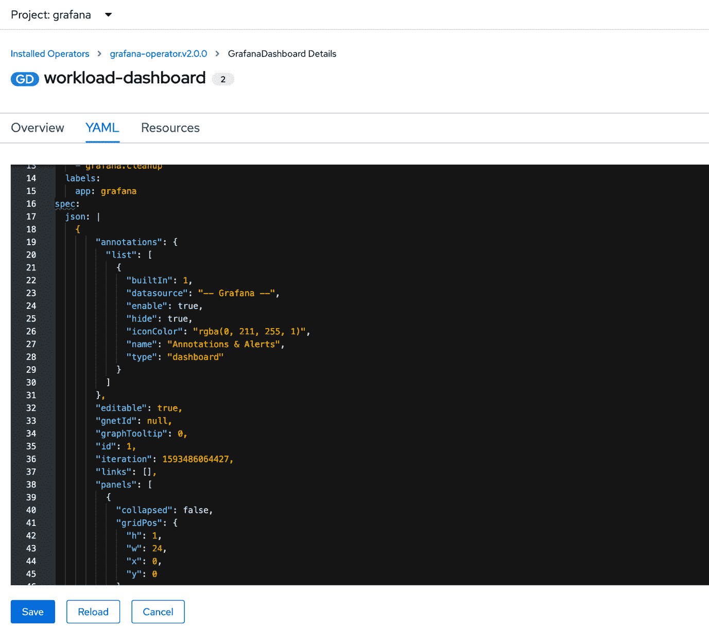

# 从 OpenShift Container Platform 4.3 内置的 Prometheus 构建高效的 Grafana 仪表板

> 原文：[`developer.ibm.com/zh/tutorials/custom-grafana-dashboards-from-pre-configured-prometheus-ocp-43-datasource/`](https://developer.ibm.com/zh/tutorials/custom-grafana-dashboards-from-pre-configured-prometheus-ocp-43-datasource/)

## 简介

[Red Hat OpenShift Container Platform](https://www.openshift.com/products/container-platform) 集群提供的现有内置 [Grafana](https://grafana.com/) 仪表板具有一个包含许多指标详细信息的固定模板。鉴于是使用自定义仪表板，系统管理员可以只关注所需的监视参数。但由于编写自定义查询时存在一些限制，因此实现起来并不容易。本分步教程介绍了如何部署 Grafana Operator Community Edition，并使用现有的 [Prometheus](https://prometheus.io/) 作为 Grafana 数据源以创建可自定义的 Grafana 仪表板。

## 相关背景

默认情况下，OpenShift Container Platform 提供了一个基于 Prometheus 的监视堆栈。但是，此内置监视功能仅提供了只读集群监视，并且不允许监视任何其他目标。此内置监视功能可以监视集群组件（例如，Pod、工作空间、节点），并提供了一组不可自定义的 Grafana 仪表板。

## 前提条件

*   [IBM Cloud 上的 Red Hat OpenShift](https://cloud.ibm.com/docs/openshift?topic=openshift-getting-started) 是一项托管服务，可以简化 OpenShift Container Platform 的部署和配置。
*   [Red Hat CodeReady Containers](https://developers.redhat.com/products/codeready-containers/overview) 是预配置的 OpenShift 4.1（或更高版本）集群。它们提供了一个最低配置的 OpenShift 集群环境，此环节用于在本地计算机上进行测试和开发。

## 部署

### 安装 Grafana Operator Community Edition

1.  使用 cluster-admin 角色登录到 OpenShift Container Platform 集群控制台。
2.  创建一个名为 Grafana 的新项目。

    ```
     $ oc new-project Grafana
     Created project Grafana 
    ```

3.  在 Web 控制台上，单击 **Operators**，然后单击 **OperatorHub**。

4.  搜索 Grafana Operator，并安装 Grafana Operator Community Edition。

    

5.  在 **Create Operator Subscription** 上的 **Installation Mode** 下，单击 **A specific namespace on the cluster**；在 **Update Channel** 下，单击 **alpha**；在 **Approval Strategy** 下，单击 **Automatic**。然后单击 **Subscribe**。

    

6.  检查 Pod 状态以了解是否已完成安装。

    ```
     $ oc get pods -n grafana -o name
     pod/grafana-operator-655f76684-7jsz5 
    ```

### 创建一个 Prometheus 用户

在创建 Grafana 和 Grafana 数据源实例之前，您需要在 openshift-monitoring 项目的现有 Prometheus 中创建一个特殊用户。

1.  导航至 openshift-monitoring 名称空间：

    ```
     $ oc project openshift-monitoring
     Now using project "openshift-monitoring" on server 
    ```

2.  加载 tmp 文件中的 prometheus-k8s-htpassword 数据：

    ```
     $ oc get secret prometheus-k8s-htpasswd -o jsonpath='{.data.auth}' | base64 -d > /tmp/htpasswd-tmp 
    ```

3.  为现有的 Prometheus 密钥创建一个特殊用户：

    ```
     $ htpasswd -s -b  /tmp/htpasswd-tmp grafana-user mysupersecretpasswd
     Adding password for user grafana-user 
    ```

4.  检查 grafana-user 的 /tmp/htpasswd-tmp 内容：

    ```
     $ cat /tmp/htpasswd-tmp | tail -1
     grafana-user:{SHA}xxxxxxSwuJxNmjPI6vdZEyyyyy= 
    ```

5.  将 prometheus-k8s-secret 数据替换为 /tmp/htpasswd-tmp：

    ```
     $ oc patch secret prometheus-k8s-htpasswd -p "{\"data\":{\"auth\":\"$(base64 -w0 /tmp/htpasswd-tmp)\"}}"
     secret/prometheus-k8s-htpasswd patched 
    ```

6.  删除 Prometheus Pod，以便使用新数据重新启动这些 Pod：

    ```
     $ oc delete pods -l app=prometheus
     pod "prometheus-k8s-0" deleted
     pod "prometheus-k8s-1" deleted

     $ oc get pods -l app=prometheus -o name
     pod/prometheus-k8s-0
     pod/prometheus-k8s-1 
    ```

### 创建 Grafana 实例

1.  在 Grafana 名称空间上，单击 Grafana 卡上的 **Installed Operators > Grafana Operator > Create Instance**（如下所示）：

    

2.  在“Create Grafana YAML”文件中，根据需要编辑名称以及 spec.config.security.admin_user 和 spec.config.security.admin_password，然后单击 **Create**。下图显示了用于创建 Grafana 实例的 YAML 文件。

    

3.  确保 Grafana Pod 已创建完毕并正在运行：

    ```
     $ oc get pods -n grafana -o name
     pods/grafana-deployment-689d864797-n4lpl
     pods/grafana-operator-655f76684-7jsz5 
    ```

### 创建 Grafana 数据源实例

1.  单击 **Installed Operators > Grafana Operator > Create Grafana DataSource** 实例。
2.  修改“Create GrafanaDataSource YAML”文件中的 metadata.name、spec.name、basicAuthUser 和 basicAuthPassword。

    

    **注意**：确保已添加 spec.datasources.jsonData.tlsSkipVerify 并将 spec.datasources.basicAuth 设置为 true。另外，验证预配置的 Prometheus URL，并在“Create GrafanaDataSource YAML”文件的 spec.datasources.url 下添加正确的 URL。

    操作程序会自动替换 grafana-deployment-xxx-xxx Pod 以反映新的配置。

3.  现在，您可以访问 Grafana 路由了：

    ```
     $ oc get route
     NAME    HOST/PORT
     grafana-route    grafana-route-grafana.xxxx.appdomain.cloud 
    ```

### 导入仪表板

现在，您可以从内置的 Grafana 中导出现有仪表板，并将其导入到使用操作程序创建的新 Grafana 实例中，以检查是否集成了 Prometheus 数据源。

在 Openshift 监视堆栈上：

1.  登录到 Openshift 监视堆栈 Grafana。
2.  选择任何仪表板（例如，**Kubernetes** / **Compute Resources** / **Workload**）。
3.  单击共享仪表板图标导出选项卡，然后复制 .json 文件。

    

4.  现在打开刚创建的 Grafana 实例路由。

5.  转至 **Dashboard > Manage > Import**。粘贴该 .json 文件并单击 **Load**。

    

6.  根据需要修改 **Name**，然后单击 **Import** 以导入仪表板。

    

7.  查看仪表板。 

8.  将仪表板导入到 Grafana UI 后，创建 Grafana 仪表板实例以在重新启动 Grafana 实例时保留仪表板。

#### 创建 Grafana DataSource 实例

1.  在 Grafana 名称空间上，创建 Grafana 仪表板实例 (**Operators > Grafana Operator > Grafana Dashboard**)。
2.  复制已导入到 Grafana 的仪表板的 .json 文件（如“导入仪表板”下的步骤 3 和 4 中所述）。
3.  将复制的 .json 文件粘贴到“Create Grafana Dashboard YAML”空间中的 spec.json 下。
4.  根据需要修改 metadata.name，然后单击 **Save**。 

使用自定义的 Grafana 仪表板，您可以根据需要为个别 Pod、工作空间、名称空间等对象创建自定义仪表板。

## 结束语

这些具有预配置数据源的自定义 Grafana 仪表板可在集群上保存计算资源，并提供了相应的选项来用于创建您自己的仪表板视图，以便您全面了解每个应用程序的计算资源使用情况，并使基础架构管理员可以轻松进行监视。

本文翻译自：[Build efficient Grafana dashboards from the built-in Prometheus of OpenShift Container Platform 4.3](https://developer.ibm.com/tutorials/custom-grafana-dashboards-from-pre-configured-prometheus-ocp-43-datasource/)（2020-10-15）