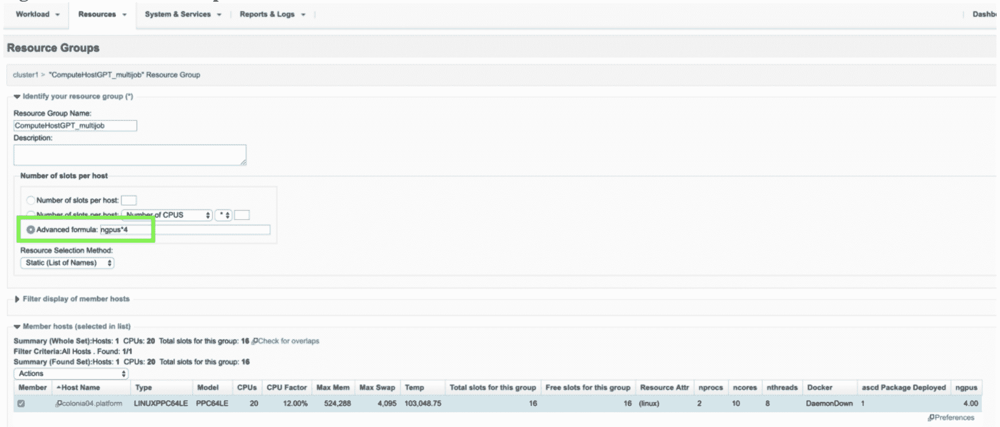
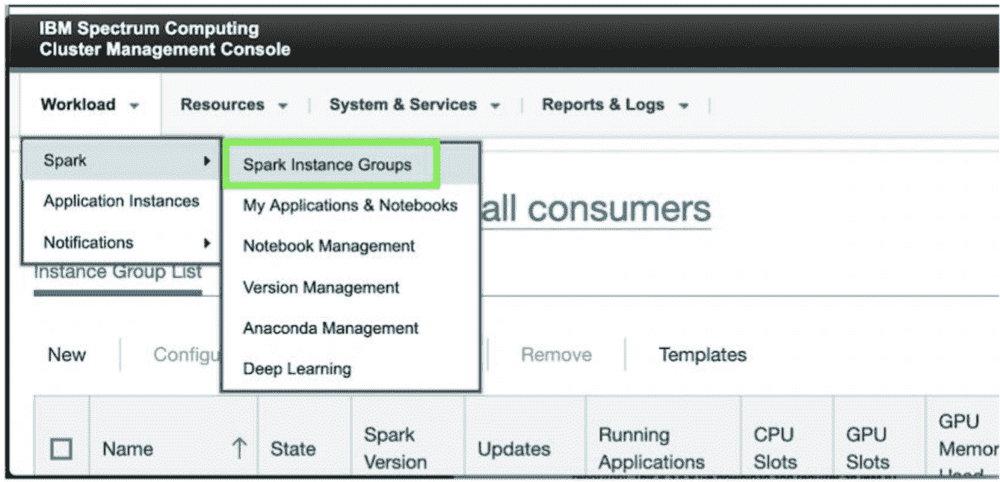
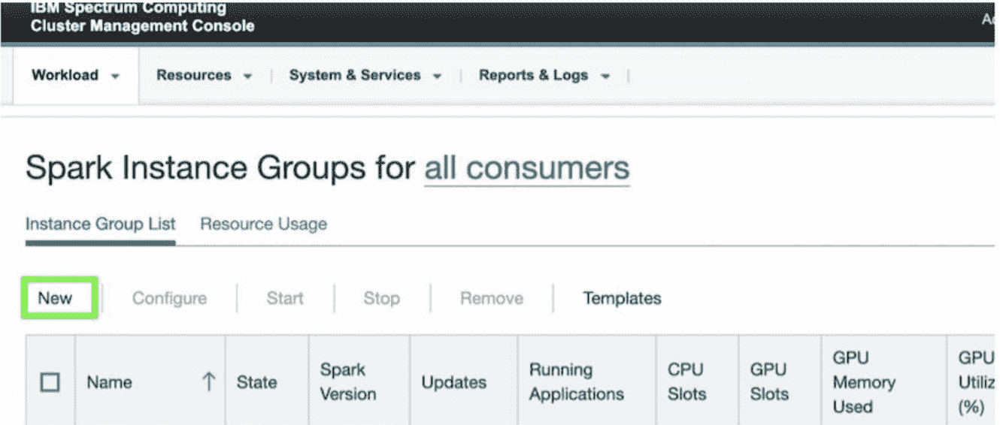
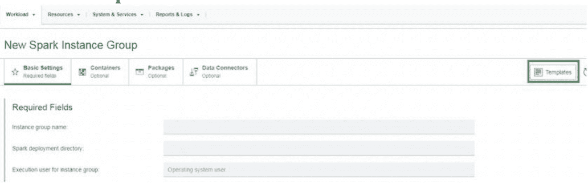
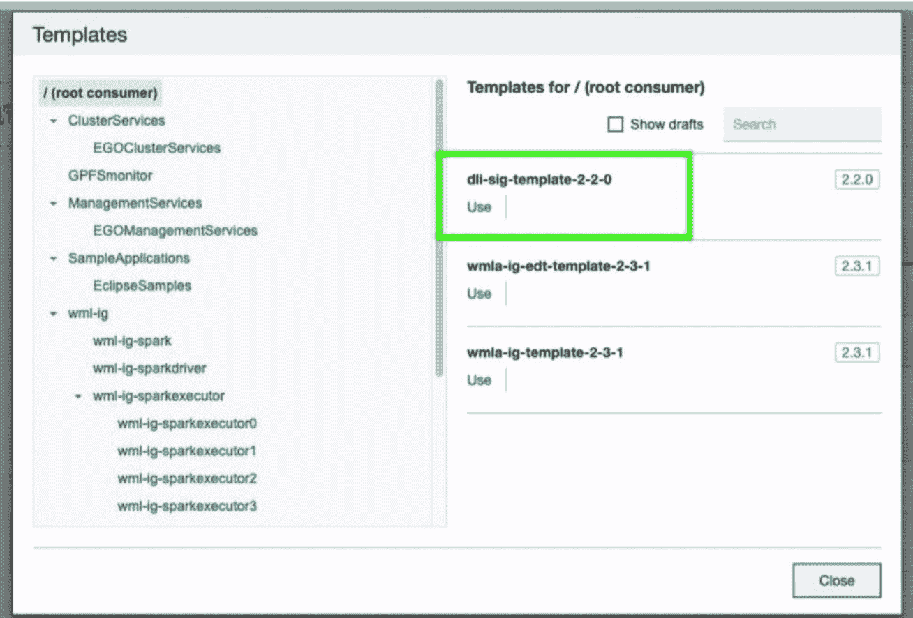
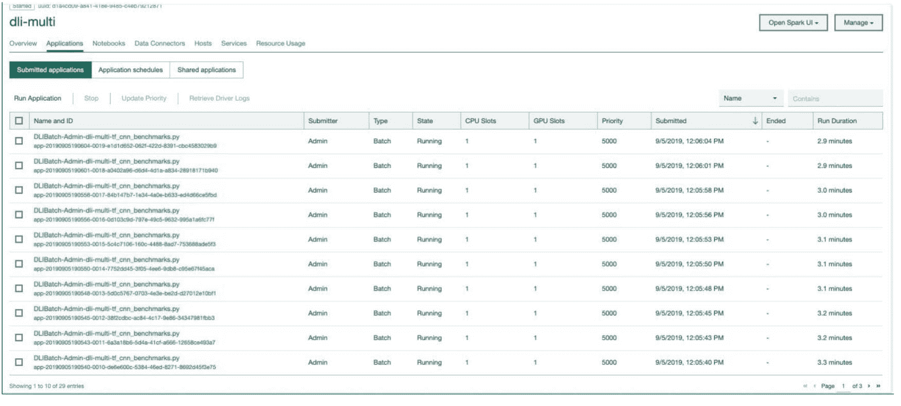
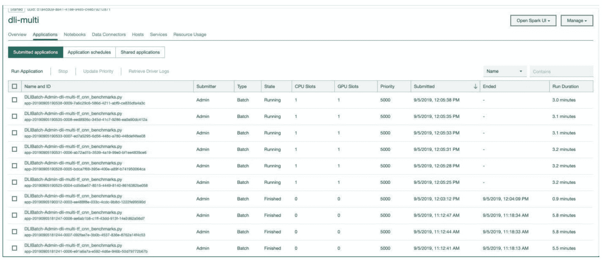

# 提高 GPU 利用率和吞吐量

> 原文：[`developer.ibm.com/zh/tutorials/drive-higher-gpu-utilization-and-throughput-with-watson-machine-learning-accelerator/`](https://developer.ibm.com/zh/tutorials/drive-higher-gpu-utilization-and-throughput-with-watson-machine-learning-accelerator/)

本文已纳入[学习路径：Watson Machine Learning Accelerator 入门](https://developer.ibm.com/zh/series/learning-path-get-started-with-watson-machine-learning-accelerator/)系列。

| 主题 | 类型 |
| --- | --- |
| [Watson Machine Learning Accelerator 简介](https://developer.ibm.com/zh/articles/introduction-to-watson-machine-learning-accelerator) | 文章 |
| [加速深度学习和机器学习](https://developer.ibm.com/zh/articles/accelerate-dl-with-wmla-and-cp4d/) | 文章 + Notebook |
| [Watson Machine Learning Accelerator 中的 Elastic Distributed Training](https://developer.ibm.com/zh/articles/elastic-distributed-training-edt-in-watson-machine-learning-accelerator/) | 文章 + Notebook |
| [使用 Watson Machine Learning Accelerator 超参数优化来加快零售价格预测](https://developer.ibm.com/zh/tutorials/expedite-price-prediction-with-watson-ml-accelerator-hyperparameter-tuning) | 教程 |
| **提高 GPU 利用率和吞吐量** | **教程** |
| [使用 Watson Machine Learning Accelerator 对图像进行分类](https://developer.ibm.com/zh/articles/classify-images-with-watson-machine-learning-accelerator) | 文章 + Notebook |

## 简介

GPU 设计为可运行某些最复杂的深度学习模型，例如 RESNET、NMT、Transformer、DeepSpeech 和 NCF。训练或部署后的大多数企业模型都只会使用一小部分的 GPU 计算和内存容量。该如何回收这些未使用的计算和内存容量以便获得最高的 GPU 投资回报率呢？

IBM Watson® Machine Learning Accelerator 提供了一些可在多个小型作业之间共享 GPU 资源的工具。这样，对 GPU 有很高需求的企业中的 IT 团队就可以获得最大的投资回报率。此外，当作业正在等待资源时或者在多个可能彼此堆叠的 GPU 中运行分布式作业时，可以在多个作业之间共享同一个 GPU。通过在没有任何资源冲突的情况下并行运行多个作业，可以使集群的总体作业吞吐量跨越多个租户和用户，从而产生倍增效应。GPU 作业共享功能可以提高训练、推理、技术和数学密集型定量工作负载的吞吐量。

## 学习目标

在本教程中，学习如何使用 Watson Machine Learning Accelerator 高级调度程序，通过在单个 GPU 中批处理并运行 4 个作业来加速完成多个深度学习训练作业。我们将向四个 GPU 提交 16 个正在运行的作业，其中每个 GPU 都会均匀分配资源以便并行运行四个作业。默认情况下，Watson Machine Learning Accelerator 会为每个 GPU 分配一个执行插槽。我们将为每个 GPU 启用多个执行插槽，以便调度程序可以将多个作业分派给该 GPU。

## 预估时间

完成本教程大约需要 2 小时，其中有近 30 分钟时间是用于模型训练、安装和配置以及通过 GUI 操作模型。

## 前提条件

1.  下载 [Watson Machine Learning Accelerator 评估软件](https://www-01.ibm.com/marketing/iwm/iwm/web/dispatcher.do?source=swerpsw-watsonml-3)。下载需占用 4.9 GB 空间，并且需要 IBM ID。
2.  使用 [IBM Knowledge Center](https://www.ibm.com/support/knowledgecenter/SSFHA8_1.2.1/wmla_overview.html) 中的说明来安装并配置 Watson Machine Learning Accelerator。
3.  配置操作系统用户。在操作系统级别，在所有节点上以 root 用户身份为操作系统执行创建用户组和用户操作。

    ```
     groupadd egoadmin
     useradd -g egoadmin -m egoadmin 
    ```

4.  创建 GPU 资源组 `ComputeHostGPT_multijob`。注意：Advanced Formula 设置为 `ngpus*4`。这样，多个作业（在此示例中为四个）便可以共享同一个 GPU 资源。如果您有多个可容纳在 GPU 内存中的轻量级工作负载，则可以将它们堆叠在一起，然后并行运行。 

5.  创建 Spark 实例组 `dli-multi`。单击 **Create** 以创建该资源组。 

    a. 单击 **New**。 

    b. 选择 **Templates**。 

    C. 选择 **dli-sig-template-2-2-0**。 

    d. 输入以下三个值：

    *   实例组：`dli-multi`
    *   Spark 部署路径：`/home/egoadmin/dli-multi`
    *   执行实例组的用户：`egoadmin`

        E. 选择 Spark 执行程序（GPU 插槽）中的 **ComputeHostGPT_multijob**。

6.  通过单击 **Create and Deploy Instance group > Continue to Instance Group** 来部署 Spark 实例组，并监视该实例组的部署进度。

## 启动作业

要测试 Watson Machine Learning Accelerator，您必须先训练模型或使用现有模型并将其连接到数据集，以便解决特定的问题。在配置环境后，提交多个训练作业并运行执行脚本。然后，您可以登录到 Watson Machine Learning Accelerator GUI，以便监视跨 GPU 运行的作业以及 GPU 资源在各个运行之间的平均分配方式。

1.  将数据集放置在 `$DLI_DATA_FS` 下。在此例中，我们将设置 `DLI_DATA_FS: /dlidata/`，并将 `creditcard.csv` 文件存储在 `/dlidata/dataset/multijob/creditcard.csv` 下。

2.  下载模型 [fc_model.py](https://s3.us.cloud-object-storage.appdomain.cloud/developer/default/tutorials/drive-higher-gpu-utilization-and-throughput-with-watson-machine-learning-accelerator/static/fc_model.py) 文件。

    a. 将该模型放置在 `$DL_NFS_PATH` 下。在此例中，我们将设置 `$DL_NFS_PATH = /dlishared`，然后将 `fc_model.py` 文件存储在 `/dlishared/autotest/examples/multijob/fc_model` 下。

    b. 默认情况下，TensorFlow 会预分配 GPU 卡的全部内存。我们将使用 `per_process_gpu_memory_fraction` 配置选项。0 – 1 之间的值指示要为每个进程预分配可用 GPU 内存的比例。1 表示预分配全部 GPU 内存。在我们的例子中，我们将该值设置为 0.2，这表示为该进程分配了大约 $20%$ 的可用 GPU 内存。

    ```
     config.gpu_options.per_process_gpu_memory_fraction = 0.2
     session = tf.Session(config=config)
     K.set_session(session) 
    ```

    c. 使用数据集路径来更新模型。

    ```
     df = pd.read_csv('/dlidata/dataset/multijob/creditcard.csv') 
    ```

3.  使用类似于以下信息的内容来创建名为 `dlicmd-env.txt` 的环境文件。

    ```
     export PATH=/opt/anaconda3/bin:$PATH (WML-CE installed path)
     export EGO_TOP=${EGO_TOP}
     export DLPD_HOME=${EGO_TOP}/dli/1.2.3/dlpd
     export dlicmd=$DLPD_HOME/bin/dlicmd.py
     export masterHost=$Master_Host
     export username=$username
     export password=$password
     export ig= dli-multi
     export dlirestport=9280
     export BYOF_model_top=/dlishared/autotest/examples/multijob/fc_model 
    ```

4.  确定环境源：`source ./dlicmd_env.txt`。

5.  使用 `dlicmd` 登录到主机。

    ```
     python $dlicmd --logon --master-host $masterHost --dli-rest-port $dlirestport --username $username --password $password 
    ```

6.  提交 16 个训练作业。

    a. 使用以下内容创建 `execution_script.sh` 脚本。

    ```
     ```
     for ((i=1; i<=16; i++))
     do
       python $dlicmd --exec-start tensorflow --master-host $masterHost --dli-rest-port $dlirestport --ig $ig --model-dir  ${BYOF_model_top} --model-main fc_model.py --cs-datastore-meta type=fs --debug-level=debug
       echo $i
     done
     ``` 
    ```

    b. 运行该脚本。

    ```
     ```
     [root@colonia04 prashant]# ./execution_script.sh
     Copying files and directories ...
     Exec id Admin-304068407245025-498756644 created
     1
     Copying files and directories ...
     Exec id Admin-304070357812332-369823390 created
     2
     Copying files and directories ...
     Exec id Admin-304071905599067-1955804738 created
     3
     Copying files and directories ...
     Exec id Admin-304073609133798-402707217 created
     4
     Copying files and directories ...
     Exec id Admin-304075411972223-1414479207 created
     5
     Copying files and directories ...
     Exec id Admin-304077274965883-1968820453 created
     6
     Copying files and directories ...
     Exec id Admin-304078953068401-1159214027 created
     7
     Copying files and directories ...
     Exec id Admin-304080731467734-1788381765 created
     8
     Copying files and directories ...
     Exec id Admin-304082727464962-730766126 created
     9
     Copying files and directories ...
     Exec id Admin-304084633178436-1947332630 created
     10
     Copying files and directories ...
     Exec id Admin-304086929287836-1777346414 created
     11
     Copying files and directories ...
     Exec id Admin-304089188990888-1423786338 created
     12
     Copying files and directories ...
     Exec id Admin-304092951501272-1827537637 created
     13
     Copying files and directories ...
     Exec id Admin-304095523336369-5713970 created
     14
     Copying files and directories ...
     Exec id Admin-304097780378443-1739096834 created
     15
     Copying files and directories ...
     Exec id Admin-304099849311454-674376479 created
     16
     ``` 
    ```

7.  登录到 Watson Machine Learning Accelerator，监视并行运行的 16 个 TensorFlow 作业。

     

8.  运行 NVIDIA-SMI，以监视在四个 GPU 中运行的 16 个作业。

    ```
     [root@colonia04 prashant]# nvidia-smi -l
     Thu Jan  9 22:31:21 2020
     +-----------------------------------------------------------------------------+
     | NVIDIA-SMI 418.40.04    Driver Version: 418.40.04    CUDA Version: 10.1     |
     |-------------------------------+----------------------+----------------------+
     | GPU  Name        Persistence-M| Bus-Id        Disp.A | Volatile Uncorr.ECC |
     | Fan  Temp  Perf  Pwr:Usage/Cap|         Memory-Usage | GPU-Util  Compute M. |
     |===============================+======================+======================|
     |   0  Tesla P100-SXM2...On   | 00000002:01:00.0 Off |                    0 |
     | N/A   37C    P0    57W / 300W |  14494MiB / 16280MiB |     90%      Default |
     +-------------------------------+----------------------+----------------------+
     |   1  Tesla P100-SXM2...On   | 00000003:01:00.0 Off |                    0 |
     | N/A   34C    P0    56W / 300W |  14494MiB / 16280MiB |     88%      Default |
     +-------------------------------+----------------------+----------------------+
     |   2  Tesla P100-SXM2...On   | 00000006:01:00.0 Off |                    0 |
     | N/A   37C    P0    53W / 300W |  14494MiB / 16280MiB |     82%      Default |
     +-------------------------------+----------------------+----------------------+
     |   3  Tesla P100-SXM2...On   | 00000007:01:00.0 Off |                    0 |
     | N/A   35C    P0    53W / 300W |  14494MiB / 16280MiB |     85%      Default |
     +-------------------------------+----------------------+----------------------+

     +-----------------------------------------------------------------------------+
     | Processes:                                                       GPU Memory |
     |  GPU       PID   Type   Process name                             Usage      |
     |=============================================================================|
     |    0     23665      C   python                                      3621MiB |
     |    0     29378      C   python                                      3621MiB |
     |    0     37582      C   python                                      3621MiB |
     |    0     39954      C   python                                      3621MiB |
     |    1     21378      C   python                                      3621MiB |
     |    1     29020      C   python                                      3621MiB |
     |    1     36054      C   python                                      3621MiB |
     |    1     38589      C   python                                      3621MiB |
     |    2     18656      C   python                                      3621MiB |
     |    2     27194      C   python                                      3621MiB |
     |    2     33068      C   python                                      3621MiB |
     |    2     38638      C   python                                      3621MiB |
     |    3     15624      C   python                                      3621MiB |
     |    3     25161      C   python                                      3621MiB |
     |    3     29849      C   python                                      3621MiB |
     |    3     38154      C   python                                      3621MiB |
     +-----------------------------------------------------------------------------+ 
    ```

## 结束语

企业发现，数据研究员和程序员都迫切需要借助 GPU 来加速完成计算密集型的训练、推理、技术和定量工作负载。大多数企业作业都只会使用一小部分的可用 GPU 计算和内存容量。默认情况下，多种深度学习框架都不允许 GPU 共享其他作业。本教程介绍了如何通过在 GPU 上调度其他 Watson Machine Learning Accelerator 插槽来利用未使用的 GPU 计算和内存容量。这不仅可以提高作业吞吐量，还可以提升数据研究员和企业 IT 专业人员的工作效率。

您可以在 [Watson Machine Learning Accelerator](https://developer.ibm.com/zh/series/learning-path-get-started-with-watson-machine-learning-accelerator/) 系列中找到更多教程。

本文翻译自：[Drive higher GPU utilization and throughput](https://developer.ibm.com/tutorials/drive-higher-gpu-utilization-and-throughput-with-watson-machine-learning-accelerator/)（2020-09-22）