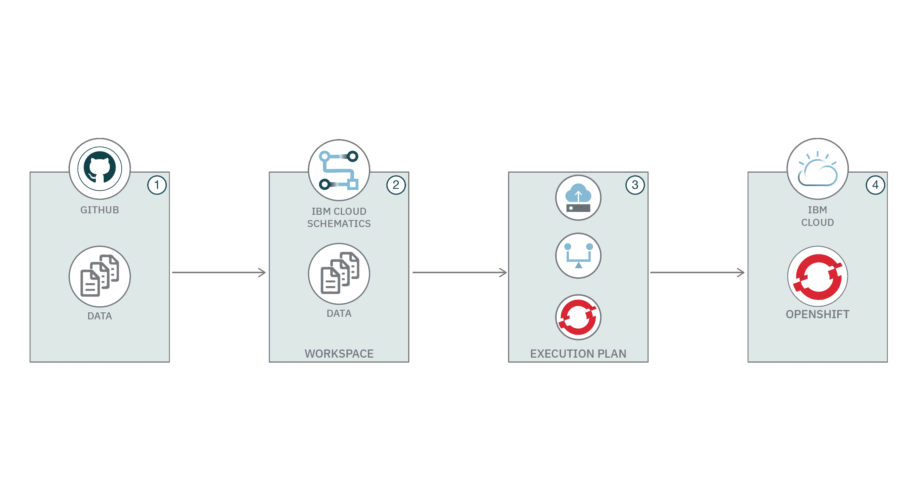
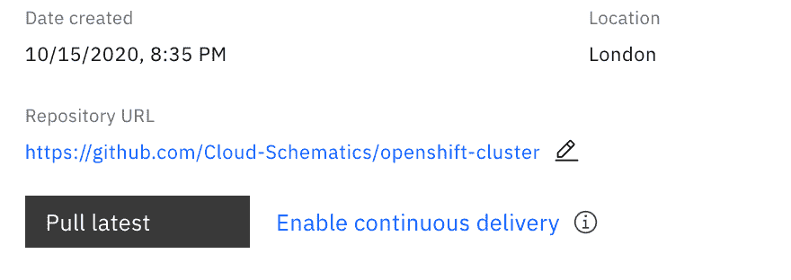
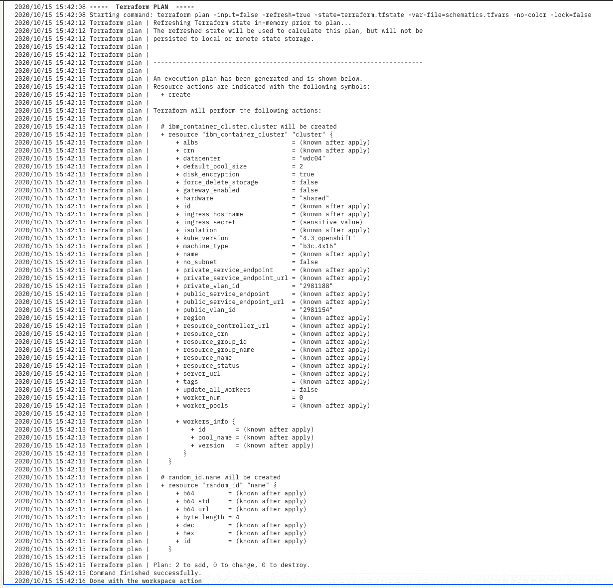

# 自动创建 Red Hat OpenShift 集群

> 原文：[`developer.ibm.com/zh/tutorials/automate-red-hat-openshift-cluster-creation-using-ibm-cloud-schematics/`](https://developer.ibm.com/zh/tutorials/automate-red-hat-openshift-cluster-creation-using-ibm-cloud-schematics/)

本教程介绍了如何使用 IBM Cloud Schematics 在 IBM Cloud 帐户中自动部署 Red Hat OpenShift 集群。

IBM Cloud™ 上的 Red Hat® OpenShift® 是一项完全托管的 OpenShift 服务，可以通过自动缩放集群来提高工作效率。它还可以完全控制工作程序节点配置并提供一定的灵活性，因此您不必再担心过度配置或未充分配置应用程序。

IBM Cloud Schematics 是一种托管的 Terraform 解决方案，它提供了 “Terraform 即服务”，因此您可以使用高级脚本编制语言对 IBM Cloud 环境中所需的资源进行建模，并启用“基础架构即代码”（IaC）。

## 前提条件

在开始使用 IBM Cloud Schematics 之前，需要注意以下前提条件：

*   一个 [IBM Cloud](https://cloud.ibm.com/?cm_sp=ibmdev-_-developer-tutorials-_-cloudreg) 帐户，以及足以在该帐户中创建 OpenShift 集群的权限。
*   需要公用和专用虚拟 LAN 才能创建 OpenShift 集群。
*   一个 [GitHub](https://github.com/) 帐户。

## 预估时间

完成本教程大约需要 8 分钟。

## 步骤



*   第 1 步：在 IBM Cloud 上编写 OpenShift 代码
*   第 2 步：在 IBM Cloud Schematics 中创建工作空间
*   第 3 步：创建一个执行计划
*   第 4 步：将 OpenShift 集群部署到 IBM Cloud 中

### 第 1 步：在 IBM Cloud 上编写 OpenShift 代码

在此步骤中，您将使用 Terraform HashiCorp 配置语言 (HCL) 格式来指定要在 IBM Cloud 环境中供应的 IBM Cloud 资源。使用以下 Terraform 配置，您可以在专区 `ams03` 和区域 `eu-de` 中创建一个具有默认 `worker_pool`（其 `default_pool_size` 为 1）的 OpenShift 集群。

*   使用以下提供程序配置，在 GitHub 代码库中创建 `provider.tf` 文件：

    ```
    variable "ibmcloud_api_key" {
      description = "Enter your IBM Cloud API, you can get your IBM Cloud API key using: https://cloud.ibm.com/iam#/apikeys"
    }

    provider "ibm" {
      ibmcloud_api_key = var.ibm.cloud_api_key
    } 
    ```

    **注意：**可以在 [IBM Cloud Provider](https://cloud.ibm.com/docs/terraform?topic=terraform-index-of-terraform-resources-and-data-sources) 文档中了解有关该配置文件的更多信息。

*   使用 OpenShift 集群的以下配置，在 GitHub 代码库中创建一个名为 `main.tf` 的文件：

    ```
     resource "ibm_container_cluster" "cluster" {
        name              = "${var.cluster_name}${random_id.name.hex}"
        datacenter        = var.datacenter
        default_pool_size = 3
        machine_type      = var.machine_type
        hardware          = var.hardware
        kube_version      = var.kube_version
        public_vlan_id    = var.public_vlan_id
        private_vlan_id   = var.private_vlan_id
      } 
    ```

[此 GitHub 代码库](https://github.com/Cloud-Schematics/openshift-cluster)解释了用于部署 OpenShift 集群的模板配置。

### 第 2 步：在 IBM Cloud Schematics 中创建工作空间

遵循 IBM Cloud Schematics 产品文档中的[设置工作空间的详细步骤](https://cloud.ibm.com/docs/schematics?topic=schematics-getting-started#setup-workspace)。

*   在工作空间的 **Settings** 页面上，输入 GitHub 代码库的 URL。

    

*   更新 **Variable** 部分下的变量，如下所示：

    *   **`datacenter`**
        要在其中配置工作程序节点的数据中心。要在其中创建集群的区域必须支持您所选的专区。要查找受支持的专区，可运行 `ibmcloud ks zone` 命令。默认值为 `wdc04`。

    *   **`machine_type`**
        您的工作程序节点的机器类型。机器类型决定了工作程序节点可用的内存、CPU 和磁盘空间。默认值为 `b3c.4x16`。

    *   **`hardware`**
        您的工作程序节点的硬件隔离级别。使用 `dedicated` 可使物理资源专供您使用，而使用 `shared` 可将物理资源与其他 IBM 客户共享。此选项仅适用于虚拟机工作程序节点版本。默认值为 `shared`。

    *   **`public_vlan_id`**
        要用于工作程序节点的公用 VLAN 的 ID。您可以使用 `ibmcloud ks vlans --zone <zone>` 命令来检索 VLAN ID。

    *   **`private_vlan_id`**
        要用于工作程序节点的专用 VLAN 的 ID。您可以使用 `ibmcloud ks vlans --zone <zone>` 命令来检索 VLAN ID。

    *   **`cluster_name`**
        集群的名称。此名称必须以字母开头，并且可以包含字母、数字和连字符 (-)。其长度不得超过 35 个字符。使用在区域内唯一的名称。集群名称和用于部署集群的区域名称一起构成了[入口子域](https://cloud.ibm.com/docs/containers?topic=containers-ingress-about)的标准域名。为确保入口子域在区域内唯一，集群名称可能会被截断并附加入口域名内的某个随机值。默认值为 `iks_openshift`。

    *   **`kube_version`**
        要在集群中安装的 Kubernetes 或 OpenShift 版本。对于 OpenShift 集群，您可以指定 `version 3.11_openshift` 或 `4.3.1_openshift`。默认值为 `4.3_openshift`。

### 第 3 步：创建一个执行计划

*   查看 **Settings** 下的变量，然后单击 **Generate plan** 来创建执行计划。
*   单击 **View log** 来查看执行计划日志。下面的截屏显示了一个示例计划。

    

### 第 4 步：将 OpenShift 集群部署到 IBM Cloud 中

*   查看该计划后，单击 **Apply plan** 来应用该计划。这会将 OpenShift 集群部署到 IBM Cloud 中。
*   完成该活动后，您可以通过单击 **View log** 来查看日志。

## 结束语

我希望本教程可以帮助您了解如何在 IBM Cloud 上自动部署 OpenShift 集群。IBM Cloud Schematics 是一种自动部署基础架构的强大方法。借助 IBM Cloud Schematics，您可以使用工作空间跨环境组织 IBM Cloud 资源。

您可以转至 OpenShift 4.3 集群中的 [OperatorHub](https://docs.openshift.com/container-platform/4.3/operators/olm-understanding-operatorhub.html)，发现集群中可供安装的其他服务。您还可以在 [Red Hat Marketplace](https://marketplace.redhat.com/) 上找到经认证的软件。您也可以转至 [OperatorHub.io](https://operatorhub.io/)，获取可以手动安装的操作程序的更完整列表。

## 后续步骤

使用以下文章和视频中的开源代码和说明，进一步了解如何使用 IBM Cloud Schematics 来部署基础架构：

*   **文章：**[发现用于部署应用程序的最佳实践 VPC 配置](https://developer.ibm.com/articles/secure-vpc-access-with-a-bastion-host-and-terraform/)
*   **文章：**[了解可重复的可靠端到端应用程序供应和配置](https://developer.ibm.com/articles/application-deployment-with-redhat-ansible-and-ibm-cloud-schematics/)
*   **视频：**[为何选择 IBM Cloud 上的 Cloud Paks？](https://developer.ibm.com/zh/videos/why-cloud-paks-on-ibm-cloud/)

本文翻译自：[Automate Red Hat OpenShift cluster creation](https://developer.ibm.com/tutorials/automate-red-hat-openshift-cluster-creation-using-ibm-cloud-schematics/)（2020-10-16）