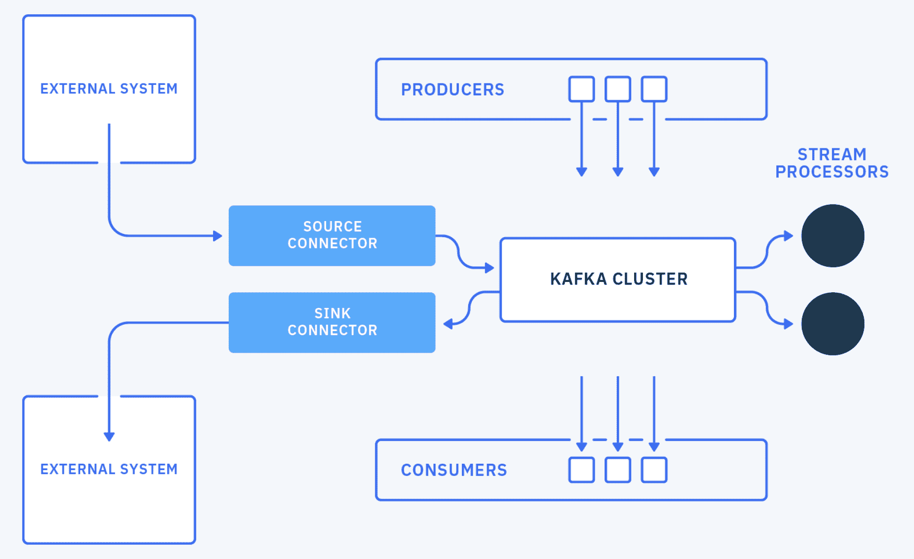
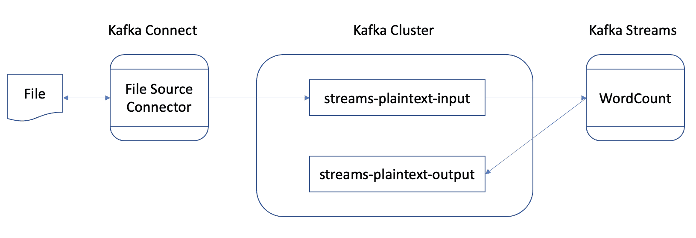

# Apache Kafka 入门

> 原文：[`developer.ibm.com/zh/tutorials/get-started-with-apache-kafka/`](https://developer.ibm.com/zh/tutorials/get-started-with-apache-kafka/)

Apache Kafka 是一个分布式流平台。 它由以下组件构成： Broker、Producer、Consumer、Admin、Connect 和 Streams。

## 学习目标

在本研讨会中，您将学习如何使用 Apache Kafka、Kafka Connect 和 Kafka Streams 构建端到端的流管道。

您将学习如何：

*   配置 Kafka 命令行工具
*   使用 `kafka-topics.sh` 工具创建、列出和描述主题
*   通过 `kafka-console-consumer.sh` 工具使用记录
*   通过 `kafka-console-producer.sh` 工具生成记录
*   通过 `kafka-consumer-group.sh` 工具描述消费者组
*   在分布式模式下配置和运行 Kafka Connect 运行时
*   配置和运行 FileStreamsSourceConnector Kafka 连接器
*   运行 Kafka Streams 应用程序

## 前提条件

*   [Apache Kafka CLI](http://kafka.apache.org/downloads)
*   [Java SDK](https://openjdk.java.net/install/)，V8 或更高版本
*   [gradle](https://gradle.org/install/)，V6 或更高版本

## 预估时间

完成本研讨会大约需要 1 小时。

## 步骤

1.  安装并配置 Kafka 集群
2.  发送并消费消息
3.  将数据与 Kafka Connect 集成
4.  使用 Kafka Streams 处理数据

### 步骤 1：安装并配置 Kafka 集群

在本研讨会的[第 1 部分](https://github.com/IBM/kafka-quickstart-workshop/blob/main/part1/README.md)，设置 Kafka 集群：

*   使用 [IBM Event Streams on IBM Cloud] ([`github.com/IBM/kafka-quickstart-workshop/blob/main/part1/event-streams.md`](https://github.com/IBM/kafka-quickstart-workshop/blob/main/part1/event-streams.md))
*   [在本地机器上使用一个 3 代理 Kafka 集群](https://github.com/IBM/kafka-quickstart-workshop/blob/main/part1/local-kafka.md)

### 步骤 2：发送并消费消息

在本研讨会的[第 2 部分](https://github.com/IBM/kafka-quickstart-workshop/blob/main/part2/README.md)，使用 Kafka CLI 创建主题、发送一些消息并使用一些消息。 您还将学习如何设置消费者组。

### 步骤 3：将数据与 Kafka Connect 集成

在本研讨会的[第 3 部分](https://github.com/IBM/kafka-quickstart-workshop/blob/main/part3/README.md)，为环境配置 Kafka Connect 运行时：

*   针对 [IBM Event Streams on IBM Cloud](https://github.com/IBM/kafka-quickstart-workshop/blob/main/part3/event-streams.md)
*   针对[本地 Kafka 集群](https://github.com/IBM/kafka-quickstart-workshop/blob/main/part3/local-kafka.md)

然后，配置、启动并测试连接器。

### 步骤 4：使用 Kafka Streams 处理数据

在本研讨会的[第 4 部分](https://github.com/IBM/kafka-quickstart-workshop/blob/main/part4/README.md)，学习如何使用 Kafka Streams 通过内置的样本应用程序实时处理数据流。

## 结束语

在本研讨会中，您学习了如何构建端到端的流管道，使数据从外部系统流入 Apache Kafka，然后对该数据进行实时处理。 通过在本研讨会中了解 Apache Kafka 的关键概念和组件，现在您可以构建可靠、可扩展且高性能的环境。

### 后续步骤

或许您已经准备好尝试某一项教程和 Code Pattern，以进一步提高您的 Kafka 技能：

*   教程：使用 Kafka Producer 和 Consumer API 开发 Java 程序以在 Apache Kafka 中生成和消费消息
*   教程：使用 Kafka Streams 通过 Apache Kafka 开发流处理器
*   Code Pattern：使用 Apache Spark 和 Apache Kafka 通过点击流分析确定热门主题

本文翻译自：[Workshop: Get started with Apache Kafka](https://developer.ibm.com/tutorials/get-started-with-apache-kafka/)（2020-10-26）