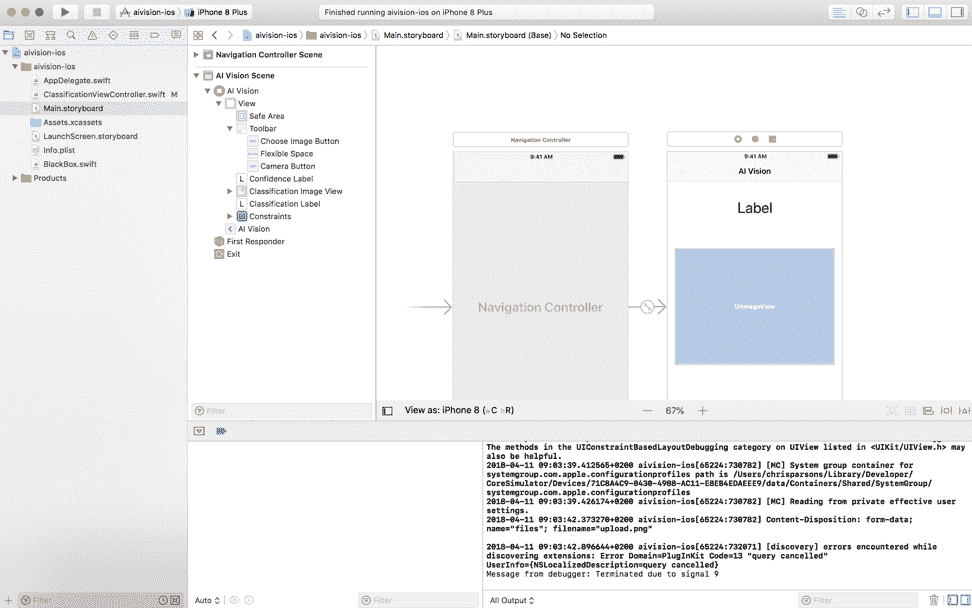

# 构建和部署 IBM Maximo Visual Inspection 模型并在 iOS 应用程序中使用

> 原文：[`developer.ibm.com/zh/tutorials/build-and-deploy-a-powerai-vision-model-and-use-it-in-ios/`](https://developer.ibm.com/zh/tutorials/build-and-deploy-a-powerai-vision-model-and-use-it-in-ios/)

**本教程已纳入 [IBM Maximo Visual Inspection 入门](https://developer.ibm.com/zh/series/learning-path-powerai-vision)学习路径**。

| 级别 | 主题 | 类型 |
| --- | --- | --- |
| 100 | [计算机视觉简介](https://developer.ibm.com/zh/articles/introduction-computer-vision) | 文章 |
| 101 | [IBM Maximo Visual Inspection 简介](https://developer.ibm.com/zh/articles/introduction-powerai-vision) | 文章 |
| **201** | **[构建并部署 IBM Maximo Visual Inspection 模型并在 iOS 应用中使用](https://developer.ibm.com/zh/tutorials/build-and-deploy-a-powerai-vision-model-and-use-it-in-ios/)** | 教程 |
| 202 | [通过对象检测定位并统计物体](https://developer.ibm.com/zh/patterns/locate-and-count-items-with-object-detection/) | Code Pattern |
| 203 | [使用 OpenCV 和深度学习对视频中的对象进行跟踪](https://developer.ibm.com/zh/patterns/detect-track-and-count-cars-in-a-video/) | Code Pattern |
| 301 | [验证计算机视觉深度学习模型](https://developer.ibm.com/zh/patterns/validate-deep-learning-models/) | Code Pattern |
| 302 | [使用 IBM Maximo Visual Inspection 针对 AI 项目开发分析仪表板](https://developer.ibm.com/zh/patterns/develop-analytical-dashboards-for-ai-projects-with-powerai-vision) | Code Pattern |
| 303 | [自动化视觉识别模型训练](https://developer.ibm.com/zh/patterns/upload-datasets-for-training-models-in-ibm-visual-insights/) | Code Pattern |
| 304 | [在仪表板中加载 IBM Maximo Visual Inspection 推断结果](https://developer.ibm.com/zh/patterns/generate-dashboards-of-insights-from-inferred-results) | Code Pattern |
| 305 | [构建对象检测模型以从汽车图像中识别车牌](https://developer.ibm.com/zh/patterns/custom-inference-script-for-reading-license-plates-of-cars) | Code Pattern |
| 306 | [自动化视频分析](https://developer.ibm.com/zh/patterns/derive-insights-from-asset-on-a-transmission-tower/) | Code Pattern |
| 307 | [通过 AI 对实时摄像头流和视频收集洞察](https://developer.ibm.com/zh/patterns/glean-insights-with-ai-on-live-camera-streams-and-videos/) | Code Pattern |

## 简介

AI 无处不在！如果您用 10 分钟跟他人讨论过 AI 或机器学习，那么您肯定会发现数百个这方面的用例，所有这些用例都将改变我们的工作方式或日常生活。

但是，如何将这种想法变成现实呢？机器学习领域十分复杂，往往令人望而生畏。因为可用的资源太多，所以我们不知道该从何处入手。从最初的“美好愿景”到“最终实现”，到底有多容易呢？答案是非常容易。

实际上，IBM 关注这种可访问性和部署速度已经有一段时间了。当机器学习和 AI 技术变得无处不在时，必然要由主题专家来重掌数据科学。IBM Maximo Visual Inspection 这款软件产品便可以完全做到这一点。它是一款易于使用的工具，可使用 PowerAI 平台和 IBM Power Systems 来轻松管理、训练和部署机器学习模型。本教程中将介绍如何完成这些任务。

## 学习目标

在本教程中，您将学习如何：

1.  创建数据集
2.  训练图像分类模型
3.  将其部署到 Web API
4.  将该 API 集成到 iOS 应用程序中

## 前提条件

本教程假定您有权访问 Maximo Visual Inspection。下载并安装[技术预览版](https://developer.ibm.com/linuxonpower/deep-learning-powerai/vision/)。另外，由于要构建 iOS 应用程序，因此需要一台 Mac 电脑和最新版本的 Xcode。

## 预估时间

完成本教程大约需要一个小时。

## 步骤

### 创建数据集

首先，将训练数据上传到 AI Vision。该数据集将确定 AI 要理解的内容、您要解决的问题以及所需的图像分类类别。

在此示例中，您将使用 [Kaggle 提供的关于鸟类的数据集](https://www.kaggle.com/c/mlsp-2013-birds)。转到 **Data** 选项卡以下载该数据。但是，您也可以使用自己的数据集。

在 AI Vision 的左上角选择 **My Data Sets**。


单击 **Add Dataset**，然后单击 **For Image Classification**。


为数据集命名，然后从列表中选择最合适的类别。如果现有类别都不适合您的用例，可以选择 **Other**。完成后，单击 **Add Dataset**。


现在，转至数据集管理页面，您可以在此页面中创建、编辑和管理数据集中的图像。选择 **+ Add Category**，然后输入该给定类别的名称。在本教程中，我们选择对不同类型的鸟进行分类，因此第一个类别是 Larus。单击 **Add Category** 来完成操作。


接下来，您需要为该类别添加训练图像，因此您将上载本地文件。


对要支持的所有类别重复上述步骤。就这么简单！您已经构建了训练数据集。


### 训练图像分类模型。

下一步是构建模型。即使您没有数据科学背景，或者以前从未构建过模型，也不用担心。Maximo Visual Inspection 将为您解决所有问题。从左上方的菜单中选择 **My DL Tasks**，然后选择 **Create New Task**。在此示例中，您将构建一个图像分类模型，因此在下一个页面上选择 **Classification**。


选择您之前创建的训练数据，以将其作为模型的基础。确保该数据集出现在 **Select Dataset** 字段中，并确保 **Training Strategy** 为 Precise First。为模型命名，然后单击 **Build Model**。


Maximo Visual Inspection 将处理训练图像并构建数据模型。您将在下图页面看到训练进度和准确性提升情况。


### 部署到 Web API

训练完成后，转到 **My Trained Models** 选项卡以查看已完成的产品。


在这里，您可以查看模型的准确性，从而了解系统在 iOS 应用程序中的运行情况。在此示例中，准确性为 76%，这相当不错，因此我们来部署这个模型。选择 **Deploy**，然后选择 **Deploy API** 以确认您的选择。


就这么简单！您已经构建了模型，并已将其部署到可通过 API 进行访问的 Web 位置，您在这整个过程中没有写过一行代码！现在，我们来将其集成到 iOS 应用程序中，以供用户使用。

### 将 API 集成到 iOS 应用程序中

在本教程的最后，我们将学习如何在 iOS 应用程序中调用 API。我们提供了一个可供您使用的样本 [GitHub 存储库](https://github.com/ChrisParsonsDev/vision_ios)，因此实际上只需要编写少量代码。

#### 调用 API

以下代码显示了用于对图像进行分类的主函数。基本上，您只需要调用 Maximo Visual Inspection 在上一步中提供的 API URL。您将针对 Maximo Visual Inspection 提供的 API 创建一个 **POST** 请求，并包含摄像机中的本地图像作为有效负载。

```
func classifyImage(image: UIImage){
    //URL for your AI Vision instance and model
    let urlString = "AI Vision API URL"

    //Set up HTTP Request Object
    var request  = URLRequest(url: URL(string: urlString)!)
    request.httpMethod = "POST"
    let boundary = "Boundary-\(UUID().uuidString)"
    request.setValue("multipart/form-data; boundary=\(boundary)", forHTTPHeaderField: "Content-Type")
    request.setValue("gzip, deflate", forHTTPHeaderField: "Accept-Encoding")

    let imageData = UIImagePNGRepresentation(image)!
    let fileName = "upload.png"
    let fullData = photoDataToFormData(data: imageData,boundary:boundary,fileName:fileName)

    request.setValue(String(fullData.count), forHTTPHeaderField: "Content-Length")
    request.httpBody = fullData
    request.httpShouldHandleCookies = false 
```

URL 的格式取决于您运行的 AI Vision 版本。虽然提供了完整的 API 参考，但可以参考我的 API，如下所示：

```
http://reallyawesomepoweraitutorial.com:9080/powerai-vision/api/dlapis/API_CODE_FROM_AI_VISION 
```

其中 `reallyawesomepoweraitutorial` 是您的 PowerAI 主机，而 `API_CODE_FROM_AI_VISION` 是您的 API 部署中使用的长名称。类似于 `1d361a45-ebde-44c5-b086-65b3a8b32e14` 的内容。

#### 有关参考应用程序的更多信息

如前所述，我们提供了一个可供您使用的样本 [GitHub 存储库](https://github.com/ChrisParsonsDev/vision_ios)。利用这个简单应用程序，您可以从相机或相册中上传图像，并根据刚刚构建的 AI 对图像进行分类。最受关注的文件是 ClassificationViewController.swift，其中包含对上述 API 的调用。您还可以查看和编辑 Main.storyboard 文件中的应用程序布局。下面是该应用程序在 Xcode 中的样子。



#### 运行模拟器

现在，我们来测试所有功能是否按预期运行。选择 Xcode 左上角的 **Play**，以在 iOS 模拟器中运行该应用程序。


启动后，从相册中选择一张图像以测试该应用程序和您的 AI。


## 结束语

就这么简单！您已经构建了自定义图像分类模型，并将其部署到 Web API，然后只编写了少量代码便将其集成到 iOS 应用程序中。我们鼓励您继续遍历所提供的 GitHub 存储库，并自行创建有趣的 iOS 应用程序。此教程已纳入 [IBM Maximo Visual Inspection 入门](https://developer.ibm.com/zh/series/learning-path-powerai-vision)学习路径，可帮助您快速了解 Maximo Visual Inspection 提供的功能以及如何使用此工具。要继续学习，可查看下一个 Code Pattern：[通过对象检测定位物品并统计数量](https://developer.ibm.com/zh/patterns/locate-and-count-items-with-object-detection/)。

本文翻译自：[Build and deploy an IBM Maximo Visual Inspection model and use it in an iOS app](https://developer.ibm.com/tutorials/build-and-deploy-a-powerai-vision-model-and-use-it-in-ios/)（2020-06-16）