# 开始使用 Red Hat Marketplace 上托管的 Findability Platform Predict Plus

> 原文：[`developer.ibm.com/zh/tutorials/get-started-findability-platform-predict-plus-red-hat-marketplace/`](https://developer.ibm.com/zh/tutorials/get-started-findability-platform-predict-plus-red-hat-marketplace/)

Red Hat® OpenShift® 4 用户可以在 [Red Hat Marketplace](https://marketplace.redhat.com/en-us/about) 中访问适用于基于容器环境的经认证的软件。该市场中的软件可立即部署到任何 Red Hat OpenShift 集群中，从而提供快速的集成体验。在本教程中，您将学习如何安装、设置和开始使用 Findability Platform Predict Plus (FP-Predict+) Operator。

FP-Predict +™ 是一种自动化的人工智能 (AI) 工具，它可以自主学习并进行多模型建模，并能够处理离散目标变量、连续目标变量和时间序列数据。它提供了 GUI 界面，因此不需要编码。这样，您可以通过在 Red Hat OpenShift 中使用经认证的受支持 AI 解决方案而受益。

## 前提条件

*   必须使用 Red Hat OpenShift V4.3，才能使用 Red Hat Markeplace 中的软件。您可以根据以下说明在 IBM Cloud 上设置类集群：[设置 OpenShift 集群](https://cloud.ibm.com/docs/openshift?topic=openshift-getting-started)。

*   在 Red Hat Marketplace 上[创建一个帐户](https://marketplace.redhat.com/api-security/en-us/login/landing)。

## 预估时间

完成本教程大约需要 1 小时。

## 步骤

要启动并运行 Red Hat Marketplace 上托管的 FP-Predict+，您将执行以下操作：

1.  访问 Red Hat OpenShift Container Platform 控制台
2.  在 Red Hat Marketplace 上注册集群
3.  在 Red Hat Marketplace Web 控制台中创建一个项目
4.  安装 Operator
5.  为 Operator 创建存储器
6.  安装 FP-Predict Plus 实例或操作数
7.  启动 FP-Predict Plus 实例
8.  注册 FP-Predict Plus 实例

## 1\. 访问 Red Hat OpenShift Container Platform Web 控制台

遵循下面的步骤来启动 Red Hat OpenShift Container Platform。

1.  登录到 IBM Cloud 帐户并导航至仪表板：

    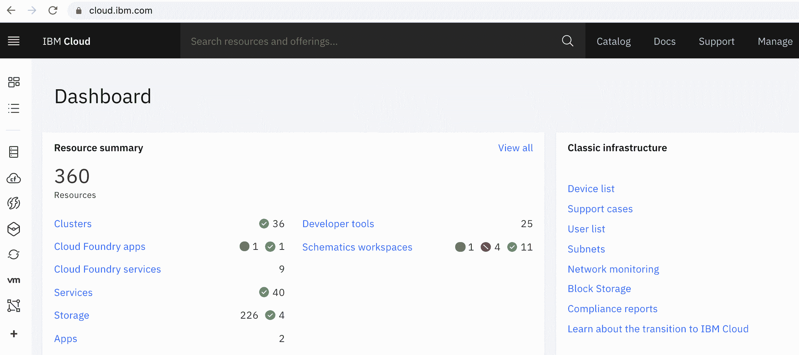

2.  单击 **Clusters**，并选择您在前提条件部分中创建的集群。在本教程中，集群名称为 `cp-rhm-poc`。

    

3.  在启动集群后，单击屏幕右上方的 **OpenShift web console**。

    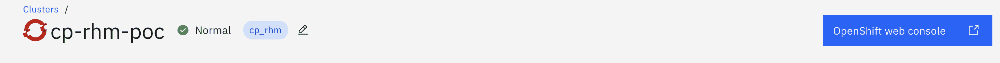

4.  您应该会看到 Red Hat OpenShift Container Platform Web 控制台。单击右上方的问号图标，然后选择 **Command Line Tools**。

    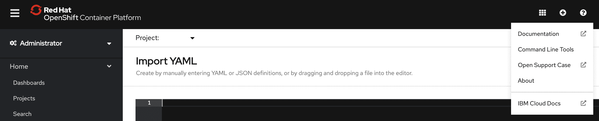

5.  导航至 `oc - OpenShift Command Line Interface (CLI)` 部分，并将相应的 oc 二进制文件下载到本地系统上。您需要使用该二进制文件来管理终端上的 OpenShift 项目。该二进制文件已扩展为本机支持 OpenShift Container Platform 功能。

    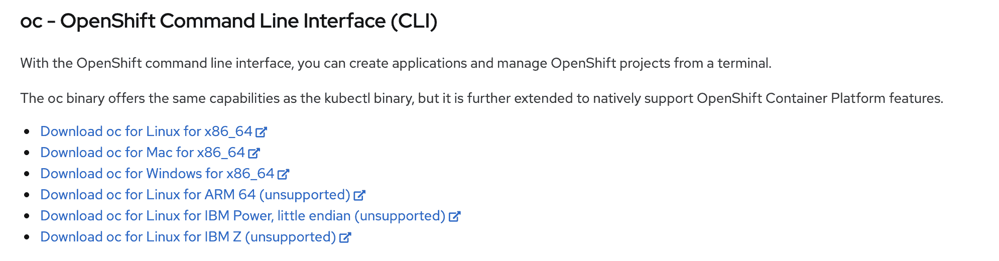

现在，您可以在 Red Hat Marketplace 上注册 OpenShift 集群了。必须完成此步骤，才能使用 OpenShift 集群安装来自 Red Hat Marketplace 平台的任何 Operator。

## 2\. 在 Red Hat Marketplace 上注册集群

1.  [Red Hat Marketplace](https://marketplace.redhat.com/en-us)。选择工作空间，然后单击 **Clusters**。您需要添加一个新的 OpenShift 集群并在 Red Hat Marketplace 平台上注册该集群。

    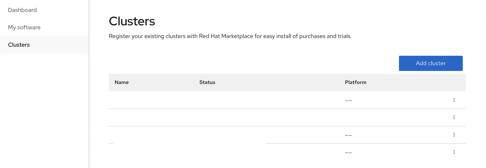

2.  选择 **Add cluster**，更新集群名称，按照提示生成提取密钥并保存此密钥。

    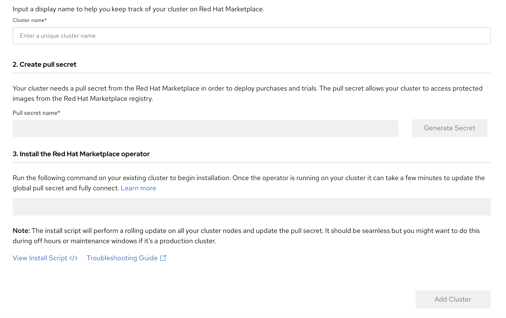

3.  在 GUI 中，复制以 `curl -sL https` 开头的 curl 命令，并在其末尾附加提取密钥。整个脚本应该已准备就绪，可以在下一步中使用。

4.  需要先启动集群，然后才能注册该集群。打开命令提示符，键入 `oc login`，更新用于访问集群的用户名和密码，然后按 **Enter** 键。

    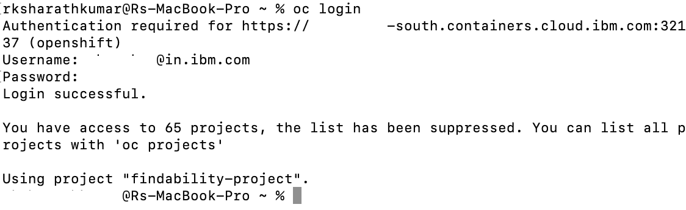

5.  此时，您的集群应该已启动并正在运行。您需要在命令提示符中运行整个脚本（从上一步中复制而来），然后点击 `Enter` 键或 `Return` 键（在 Mac 中）。只需几分钟就可以看到您在 Red Hat Marketplace 门户网站上成功注册了集群。

    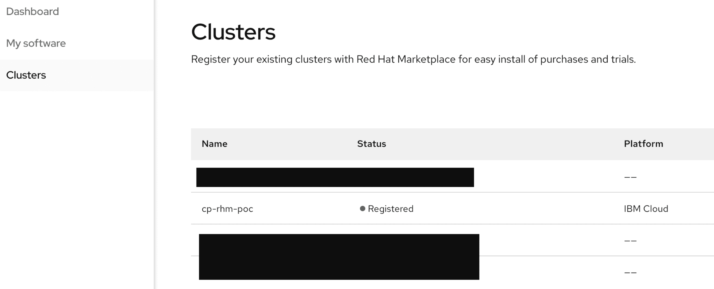

## 3\. 在 Red Hat Marketplace Web 控制台中创建一个项目

要创建可在命令行中使用和管理的项目，可转至 Red Hat Marketplace Web 控制台并单击 **Create Project**。根据需要命名该项目；本教程使用名称 `findability-project`。

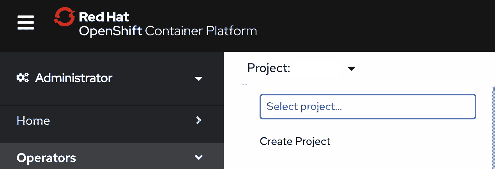

## 4\. 安装 Operator

1.  登录到 Red Hat Marketplace，导航至搜索栏，然后搜索“Findability Platform Predict Plus”。

    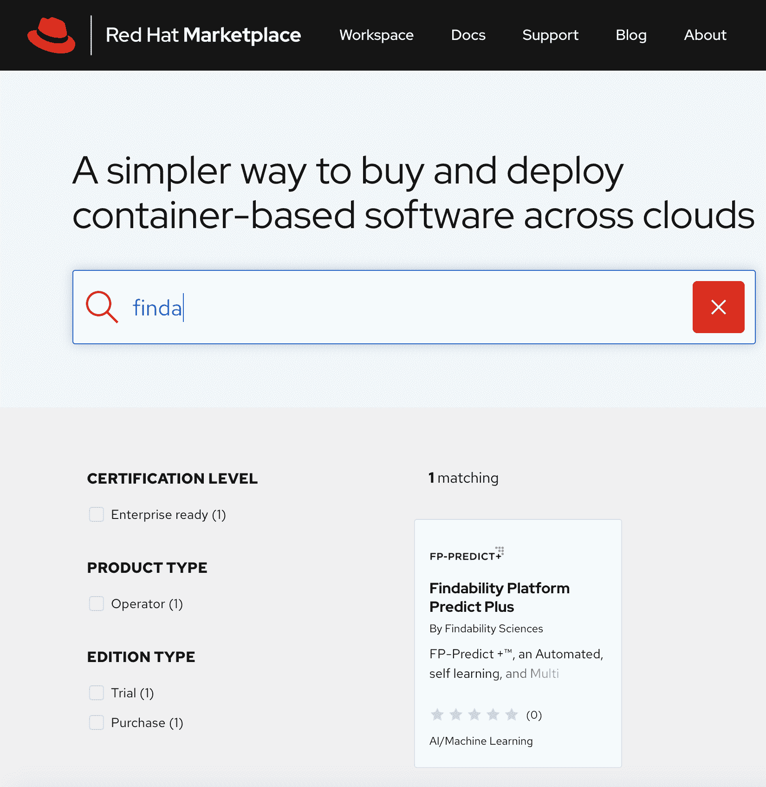

2.  在下一个页面上选择 **Free trial** 选项，然后选择 **Findability Platform Predict Plus**。

    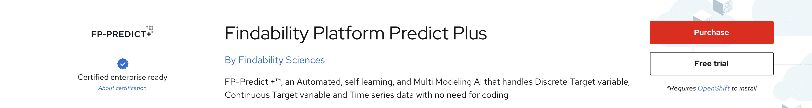

    > 注意：此试用实例具有以下约束：

    *   最多包含 10 万行的训练数据，且最多包含 5 万行的预测数据
    *   最多包含 500 个变量、特征和列
    *   30 天免费试用
3.  单击顶部的 **Workspace** 按钮，然后单击左侧窗格上的 **My software** 选项。

    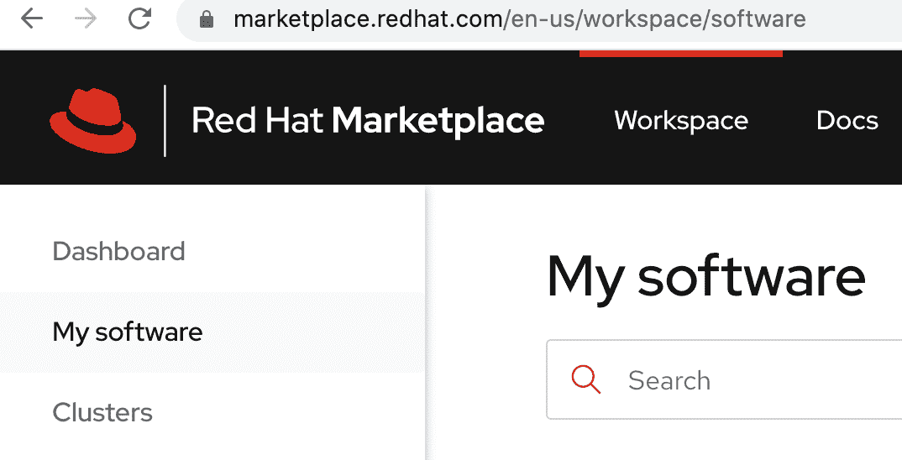

4.  单击您需要的 Operator，在此例中为 **FP-Predict+**。您将被定向到下一个页面，您需要从 Operator 的菜单中选择 **Install operator**。

    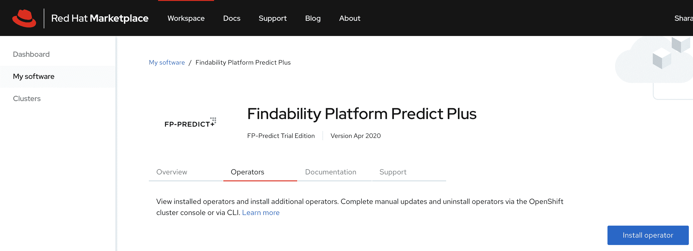

5.  在 Target Clusters 标题下，选中您的集群名称所对应的框。在 Namespace Scope 下，选择您在先前步骤中创建的项目名称。您可以保留其他默认选项，然后单击 **Install**。在本教程中，我们将选择自动安装方法，但您也可以选择手动安装 Operator。

    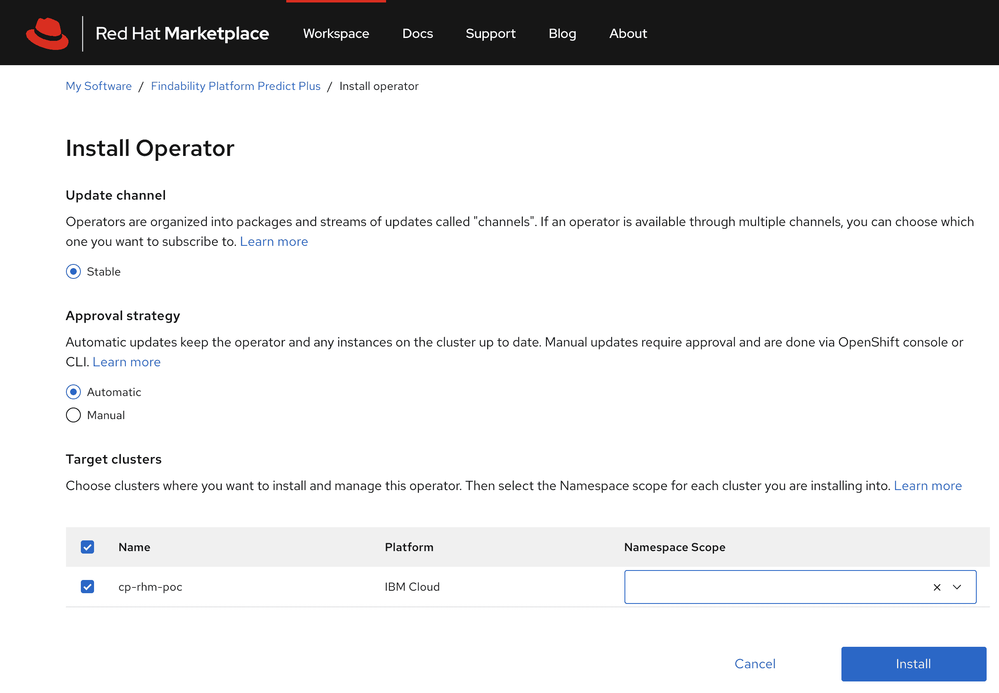

6.  几分钟后，Operator 便已安装在集群中。状态应该会显示“Up to date”消息。通过单击 Cluster Console 旁边的选项来启动 Web 控制台。

    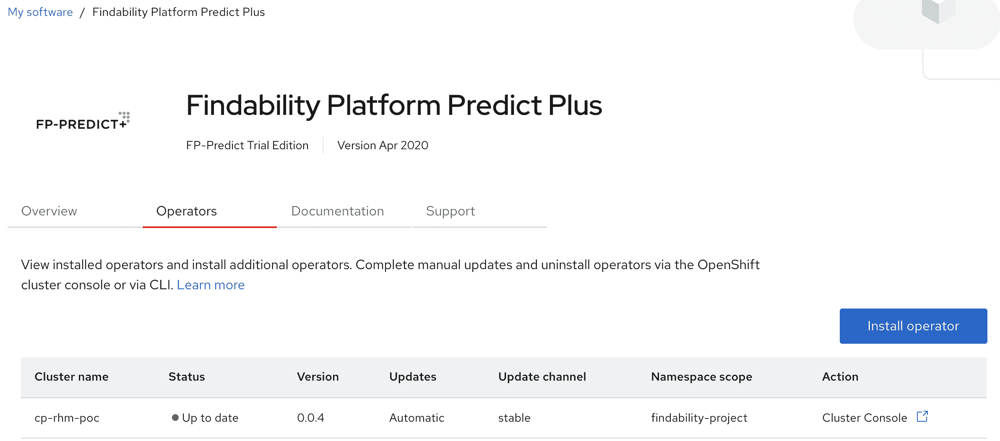

7.  在 Web 控制台中，通过在左侧导航栏中选择 **Operators** 并单击 Installed Operators 来确认您已正确安装了 Operator。状态应该会显示安装已成功。

    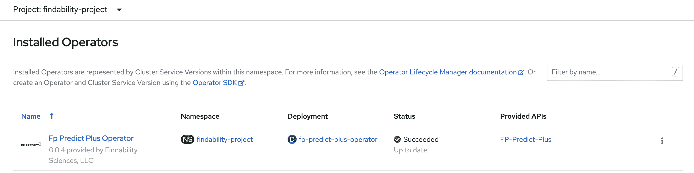

## 5\. 为 Operator 创建存储器

1.  现在，Operator 已设置完毕，您需要创建名为 `fp-predict-plus-pv` 的持久卷，以将其绑定到持久卷声明。必须完成此步骤，才能启用存储功能以便 Operator 可以管理数据集。在左侧导航栏中，单击 **Storage > Persistent volume**。将名称更新为 `fp-predict-plus-pv`，将存储容量设置为 20 GB，然后选择 **Create**。如果需要更多存储空间，可以在 YAML 文件中增加该容量，然后相应地创建持久卷。

    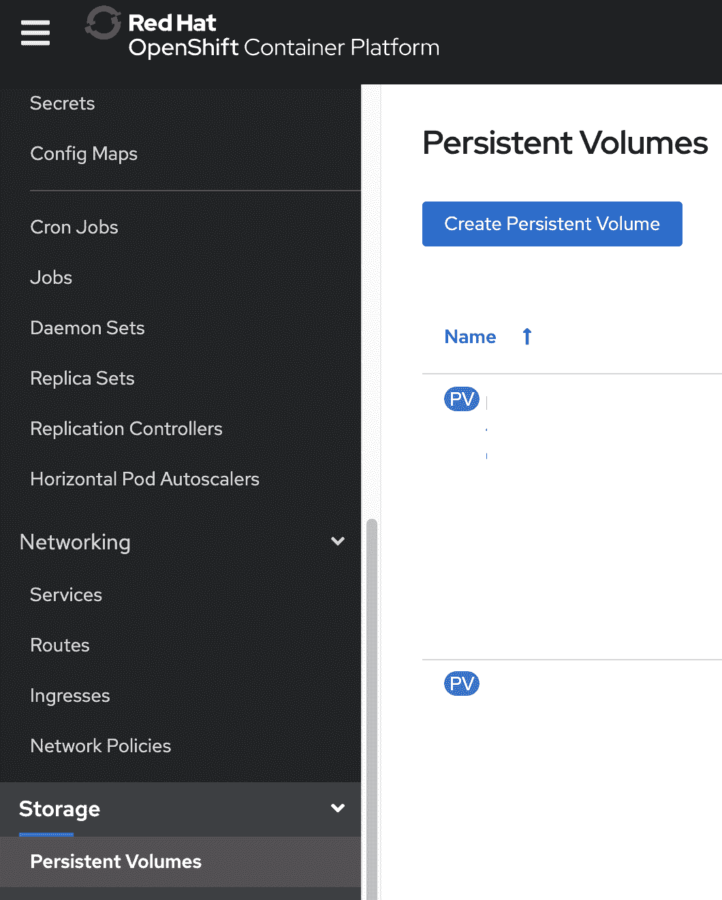

2.  您需要创建一个持久卷声明（存储器），以便使用在先前步骤中创建的存储器并将其绑定到该 Operator 的实例。在 Web 控制台上，单击 **Storage**，然后选择 **Persistent Volume Claims**。

    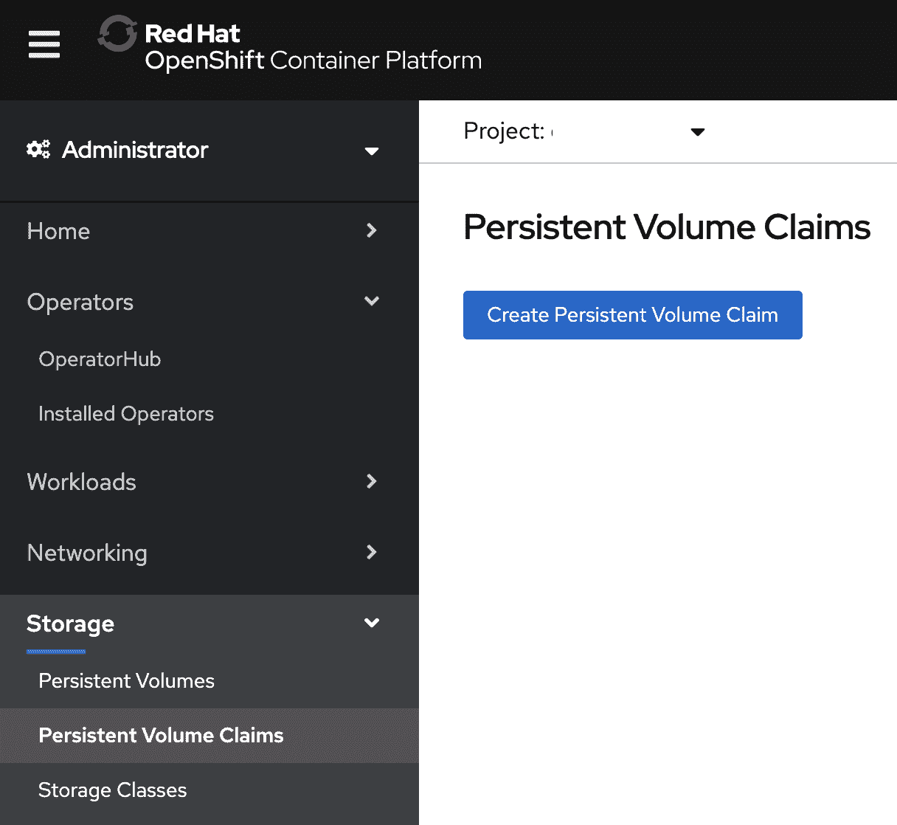

3.  下一步是创建持久卷声明。选择所需的存储类别：gold、silver 或 bronze。添加 `fp-predict-plus-pvc` 作为名称，选择单用户访问，然后将存储大小指定为 20 GB。

    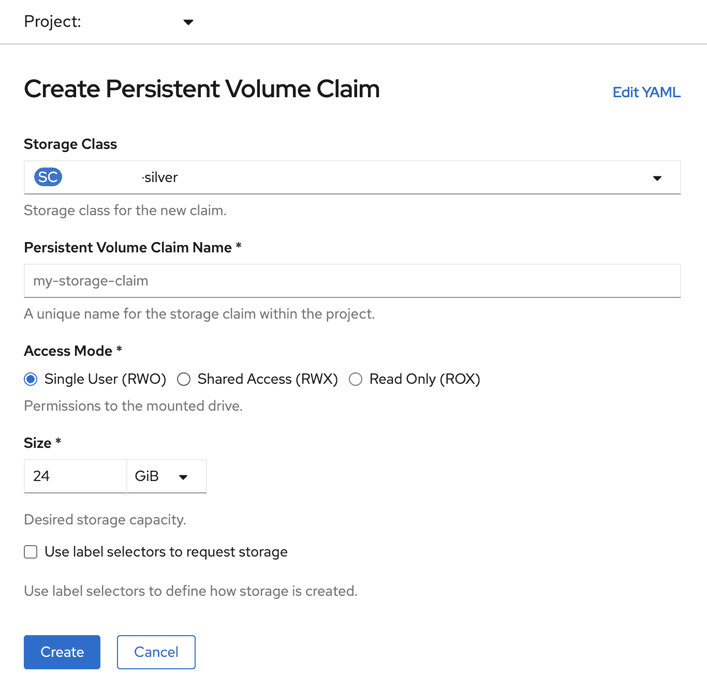

4.  在创建持久卷声明 (PVC) 后，需要将其与先前步骤中创建的持久卷 (PV) 绑定在一起。几分钟后，您应该会在下面看到状态为 `Bound`。

    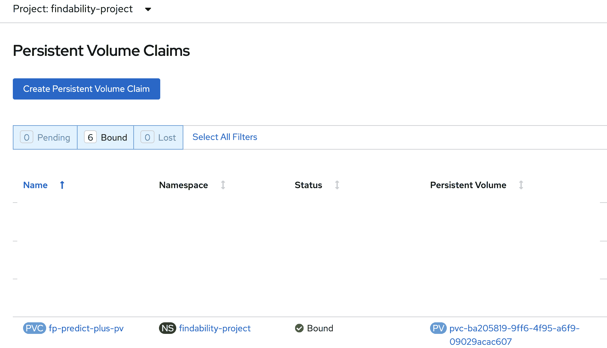

## 6\. 安装 FP-Predict Plus 实例或操作数

遵循以下步骤来安装 FP-Predict+ 实例（也称为*操作数*）：

1.  在 Operators 选项卡下，单击 **Installed operators > FP Predict Plus Operator**。您应该会看到一些选项，例如 Overview、YAML、Subscription、Events 和 FP-Predict-Plus。

2.  单击 YAML，设置以下属性，然后单击 **Save**：

    *   name：`fp-predict-plus-pvc`
    *   useExisting：`false`（如果要对另一个实例使用相同的存储器，那么 useExisting 应为 true）
    *   volumeName：`fp-predict-plus-pv`

        对于 `routerCanonicalHostname`：它应以集群名称开头，后跟集群 ID（直至您看到“appdomain.cloud”为止）。务必要先移除 URL 的初始部分 (`https://console-openshift-console`)。

        

3.  下一步是转至 FP-Predict+ 选项，然后单击 **Create Fppredictplus** 实例。编辑 YAML 文件，为该实例指定名称并单击 `Save`。

    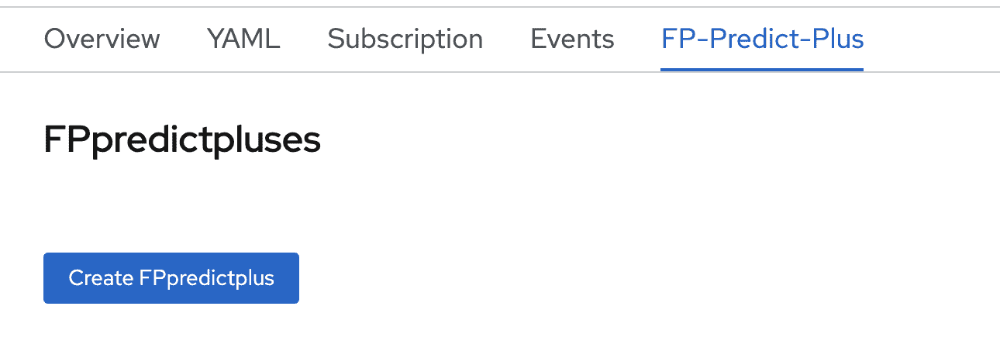

## 7\. 启动 FP-Predict Plus 实例

现在您可以开始启动该实例了。要执行此操作，可单击 **Networking**，选择 **Routes**，然后单击要启动该实例的位置下方的 URL。

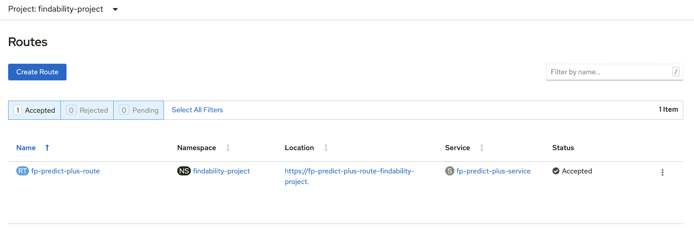

## 8\. 注册 FP-Predict Plus 实例

使用[配置文件](https://github.com/IBM/getting-started-with-fppredictplus/blob/master/credentials.txt)中的默认凭证登录，并接受最终用户许可协议。您将被定向到下一个页面，您应在该页面中单击 **Download** 以与 Findability Sciences 支持团队共享该文件。

支持团队将发送许可证文件（有效期为 30 天），您可以通过选择 **Upload File** 并导航至系统上的该文件来进行上载。现在您可以开始访问 FP-Predict+ 实例了。

在上载许可证密钥后，调出 FP-Predict+ 实例。左侧的导航窗格包含以下四个选项： Dashboard、Analytics、Dataset Management 和 License Information。

**注意：支持团队仅提供一次试用许可证密钥。不要卸载 FP-Predict+ 实例（在 Web 控制台中或在 Red Hat Marketplace 门户网站中），因为需要新的试用许可证密钥才能重新安装该实例。**

`注意`：如果进行版本升级，那么您可能必须重复所有这些步骤，因为安装中的某些组件不支持产品升级。

# 结束语

本教程向您展示了如何安装、配置和设置来自 Red Hat Marketplace 的 FP-Predict+ Operator 并添加存储器以开始使用 FP-Predict+ Operator。现在，您已经准备好 FP-Predict+ 实例，可以将 OpenShift 集群用于 AI 用例了。

本文翻译自：[Get started using Findability Platform Predict Plus hosted on Red Hat Marketplace](https://developer.ibm.com/tutorials/get-started-findability-platform-predict-plus-red-hat-marketplace/)（2020-08-27）