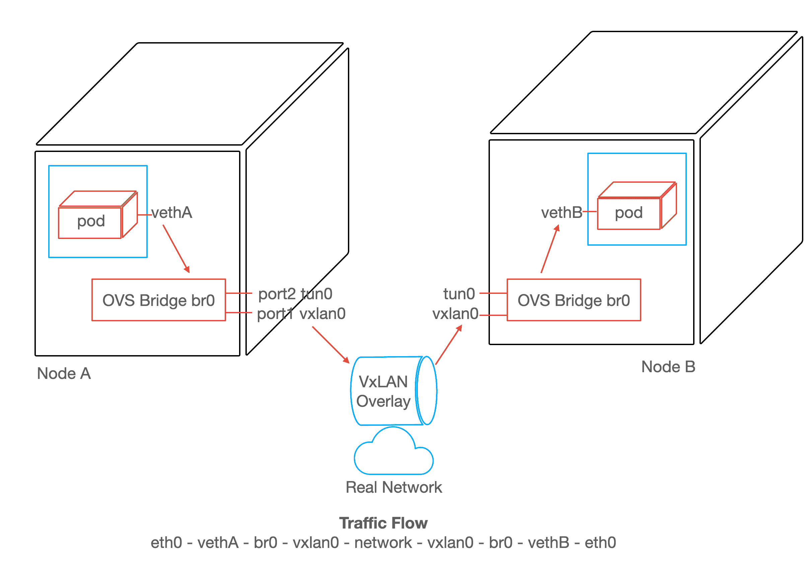
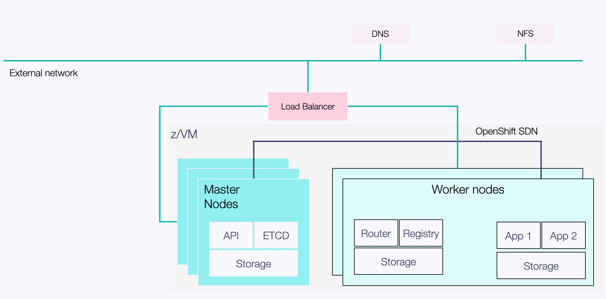
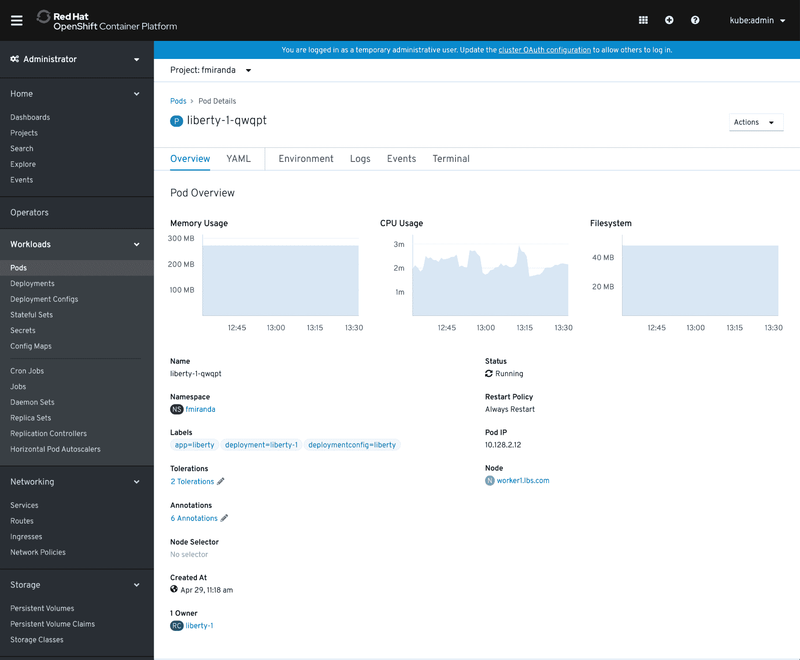
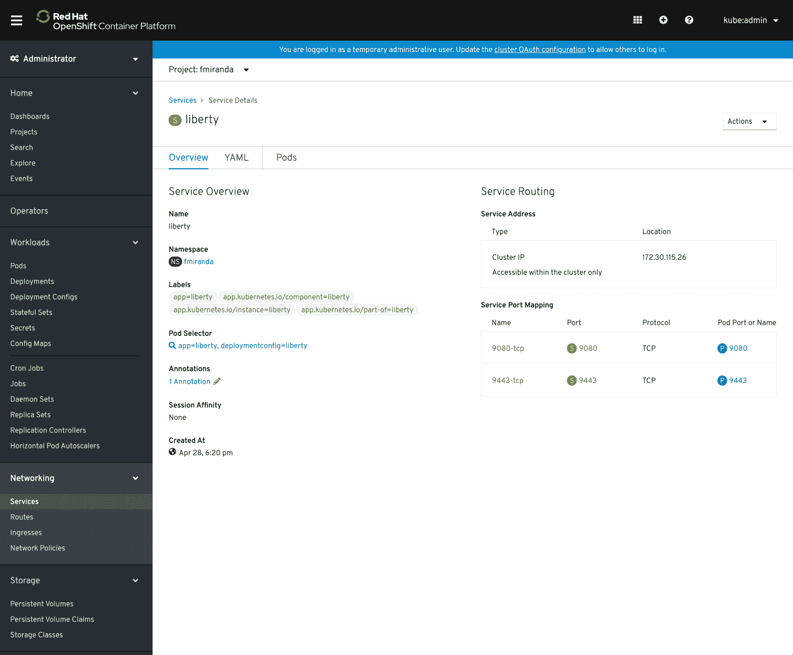
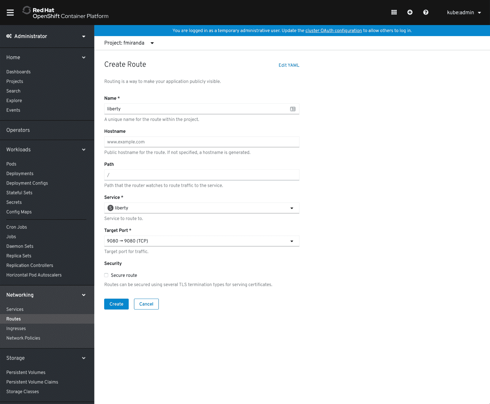
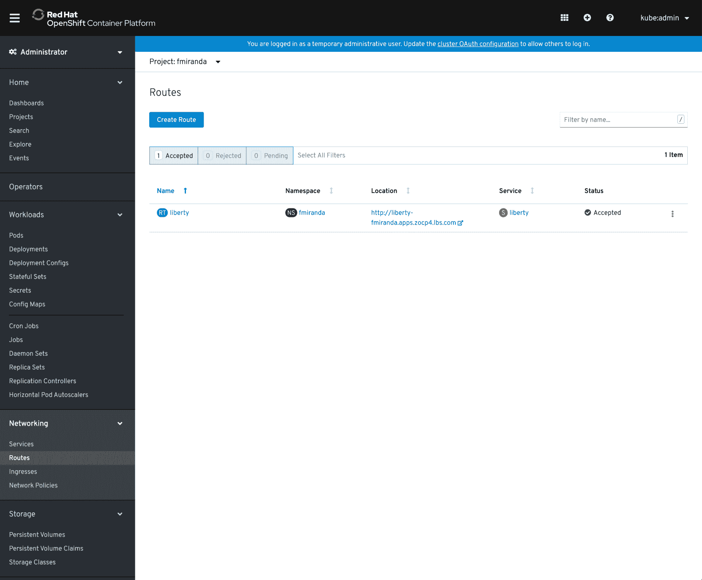
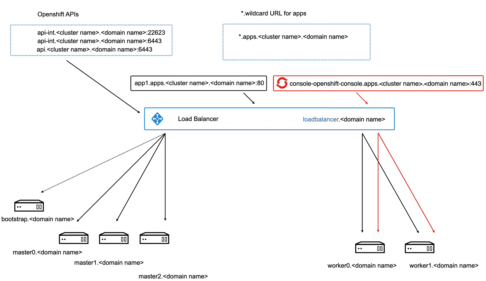
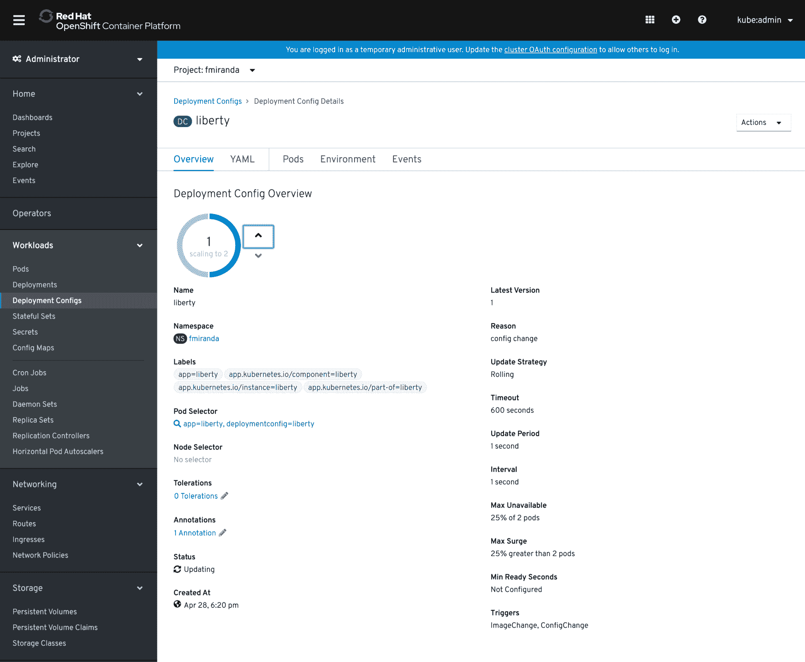
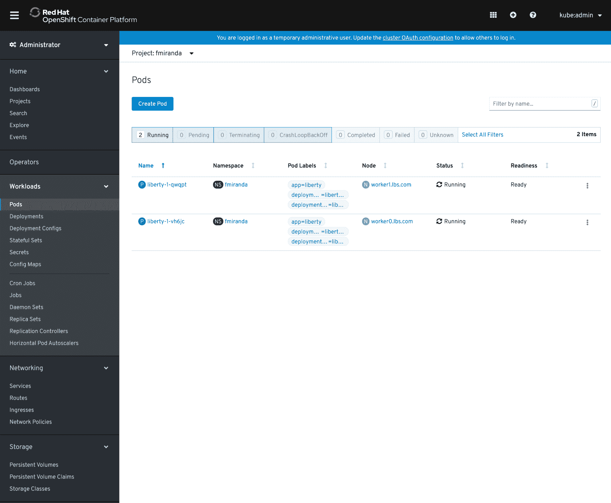
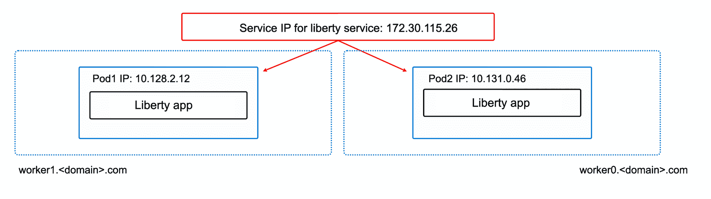

# 开始使用 Red Hat OpenShift 4 网络

> 原文：[`developer.ibm.com/zh/tutorials/understanding-network-definitions-for-openshift-4-on-ibm-z-and-linuxone/`](https://developer.ibm.com/zh/tutorials/understanding-network-definitions-for-openshift-4-on-ibm-z-and-linuxone/)

对于一般系统管理员而言，使用用户配置的基础架构 (UPI) 部署 Red Hat Openshift Container Platform V4 有一定的难度。为此，我编写了[一份指南](https://developer.ibm.com/components/ibmz/tutorials/install-red-hat-openshift-on-ibmz-linuxone)，其中介绍了使用 UPI 在 IBM Z/LinuxONE 硬件上部署 OpenShift 的基础知识。

但是，其中并没有详细介绍 install-config.yaml 配置文件中的 OpenShift 内部网络部分，而这是 UPI 安装方法的关键部分。这就是我要在本简短教程中介绍的内容。

## 学习目标

本教程可帮助您更好地了解 OpenShift 软件定义网络 (SDN) 的工作方式。它将展示如何配置 OpenShift SDN，以及如何使用示例来了解 install-config.yaml 的网络部分。

## 前提条件

要完成本教程，您需要具备网络方面的中级知识，因为我将要介绍软件定义网络以及 CIDR 块、子网和网络包封装 (VxLAN)。另外还建议您掌握 OpenShift 架构方面的中级知识。

OpenShift Container Platform 使用软件定义网络 (SDN) 方法提供一个统一集群网络，而 OpenShift Container Platform 集群中的 pod 就是通过这个网络进行通信的。此 pod 网络由 OpenShift SDN 建立和维护，后者使用 Open vSwitch (OVS) 配置了一个重叠网络。

**图 1\. 两个不同节点上的 pod 间流量**



## 预估时间

完成本教程大约需要 15 分钟。

## 步骤

在使用 UPI 方法安装 OpenShift 的过程中，核对表中有一项是编辑 install-config.yaml 文件。此文件包含多个部分，但我将只处理网络部分。

OpenShift 使用以下两种类型的网络：外部网络和内部网络 (SDN)。以下各部分介绍了如何配置内部网络，以及有关如何根据需要调整此配置的所有详细信息。

**图 2\. OpenShift 网络**



我们来从样本 install-config.yaml 文件开始：

```
apiVersion: v1
baseDomain: <domain> 
compute:
- architecture: s390x
  hyperthreading: Enabled   
  name: worker
  replicas: 0 
controlPlane:
  architecture: s390x
  hyperthreading: Enabled   
  name: master 
  replicas: 3 
metadata:
  name: <cluster_name> 
networking:
  clusterNetwork:
  - cidr: 10.128.0.0/14 
    hostPrefix: 23 
  networkType: OpenShiftSDN
  serviceNetwork: 
  - 172.30.0.0/16
platform:
  none: {} 
fips: false 
pullSecret: '<pull-secret>' 
sshKey: '<ssh-public-key>' 
```

现在，让我们仅关注此配置文件的网络部分，该部分又分为两个主要部分。第一个主要部分是 `clusterNetwork`：

```
clusterNetwork:
  - cidr: 10.128.0.0/14 
    hostPrefix: 23 
```

`clusterNetwork` 定义了要用于 OpenShift 集群中所有已创建 pod 的 IP 地址块。(*注意：*此块不得与现有物理网络重叠。）

但 `hostPrefix: 23` 是什么呢？这是分配给每个节点的子网前缀长度。例如，如果将 `hostPrefix` 设置为 23，那么会为每个节点分配给定 cidr 中的一个 /23 子网，该子网允许 510 (2^(32 – 23) – 2) 个 pod IP 地址。

我们来通过使用 Web 控制台并查询 OpenShift 集群上的一些工作负载来用事实检验这一点：

*   从左侧菜单中选择 **Pods**，然后选择 liberty-1-qwqpt pod。验证此 pod 的 IP 是否为 10.128.2.12：

**图 3\. 选择 pod**



注意：这些 Pod 使用的 IP 范围与 CIDR 配置在 install-config-yaml 文件的 clusterNetwork 部分中定义的 IP 范围相同。

现在，可以查看网络部分的另一个部分：

```
networkType: OpenShiftSDN
  serviceNetwork:
 - 172.30.0.0/16 
```

用事实检验的时刻到来了！使用 OpenShift Web 控制台，从左侧菜单中选择 **Networking** -> **Services**，然后选择 Liberty 服务。验证此服务的 IP 是否为 172.30.115.26。

**图 4\. 验证服务 IP**



如果要从集群外部访问此应用程序，该怎么做？很简单：从左侧菜单中，选择 **Routes** -> **Create Route**。然后为路由设置一个名称，选择一个服务和一个目标端口，然后单击 **Create** 按钮，如图 5 所示：

**图 5\. 创建路由**



在创建路由后，应用程序的标准域名 (FQDN) 将在 **Location** 下显示为一个超链接，单击该超链接后，将打开默认浏览器，并且允许您从集群外部访问应用程序。

**图 6\. 标准域名**



您可能想知道此路由的 IP 是什么。实际上，它与 DNS 基础架构所定义的负载均衡器的 IP 相同。（还记得吗？）

图 7 是 OpenShift 网络（这*不是*内部集群网络）的直观表示：

**图 7\. OpenShift 网络**



现在可以查看和深入研究 OpenShift 内部集群的直观表示了，但在此之前，我们来先将应用程序扩展到 2 个 pod。在左侧菜单中选择 **Deployment Configs**，接着选择应用程序的部署配置名称（在此例中为 liberty），然后在 **Overview** 选项卡下，使用 **Deployment Config Overview** 下的箭头将应用程序扩展到 2 个 pod：

**图 8\. 扩展应用程序**



可以通过从左侧菜单中选择 **Pods** 来验证该应用程序是否已扩展到 2 个 pod：

**图 9\. 验证是否扩展了 pod 数量**



现在，选择第二个 pod，然后验证其 IP 地址：

**图 10\. 验证第二个 pod 的 IP 地址**


您可以看到已为新 pod 分配了 IP 地址 10.131.0.46，该地址在配置文件中指定的范围内。

图 11 提供了服务 IP 以及两个 pod 的 IP 地址的直观表示：

**图 11\. 服务 IP 以及 pod 的 IP 地址**



## 结束语

本教程向您展示了如何在 install-config.yaml 文件的网络部分中定义集群内部 IP 范围，并通过示例演示了 pod 和服务如何从中受益。

注意：对于在 Red Hat CoreOS 安装过程中为 OpenShift 集群中的实际节点（例如 master0、master1、worker0 和 worker1）定义的 IP 地址，它们所属的 IP 范围与 OpenShift 内部使用的 IP 范围（针对 clusterNetwork 和 serviceNetwork）不同，因为它们会将 IP 范围用于外部网络。

***致谢：**感谢 Brad Hinson 和 Shanna Chan 为本教程做出的贡献。*

本文翻译自：[Start working with Red Hat OpenShift 4 networks](https://developer.ibm.com/tutorials/understanding-network-definitions-for-openshift-4-on-ibm-z-and-linuxone/)（2020-08-11）