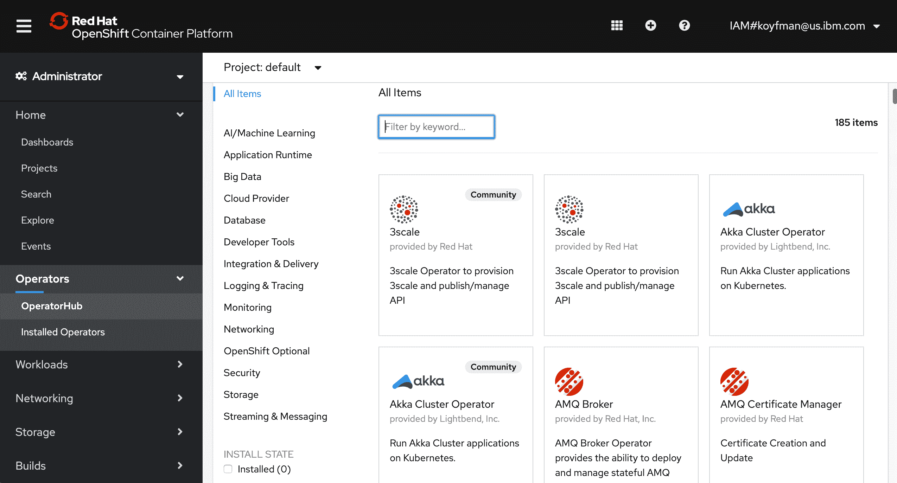
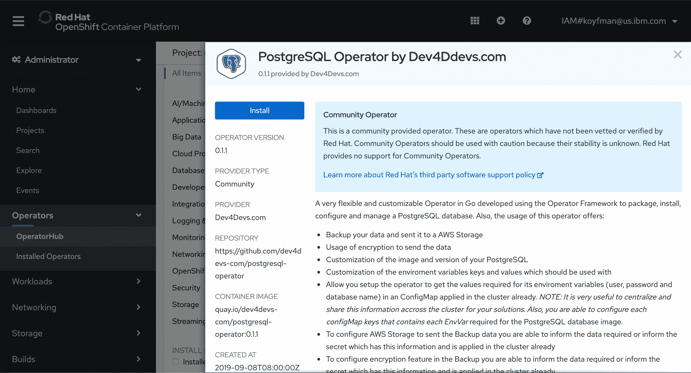
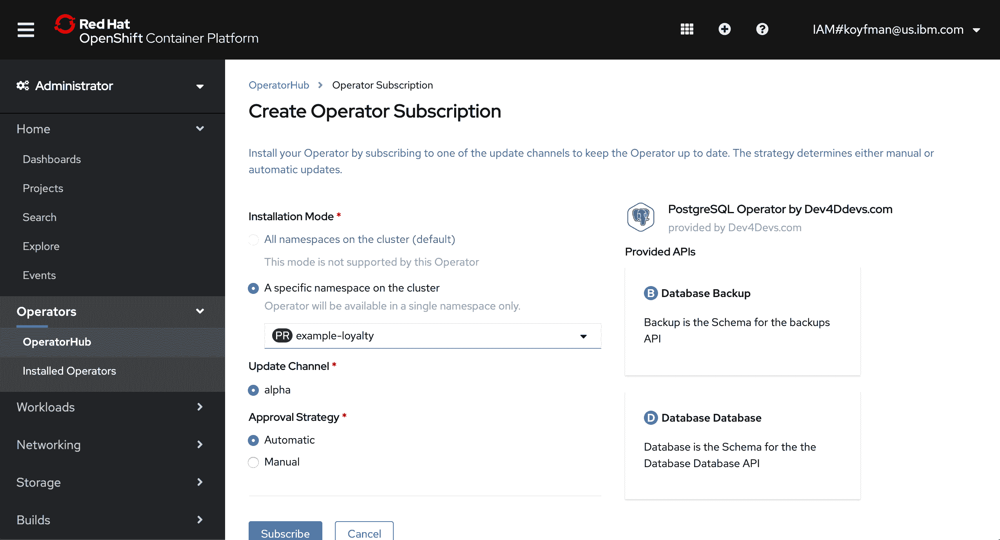
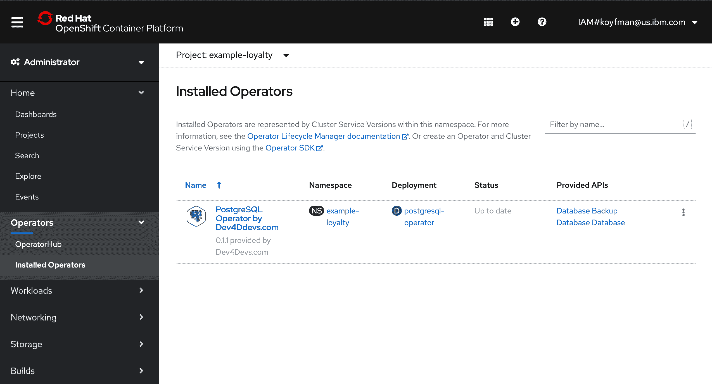
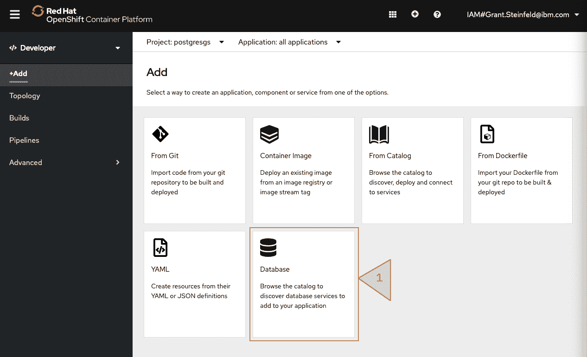
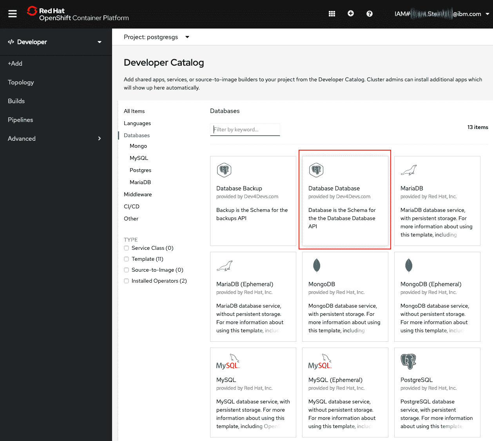
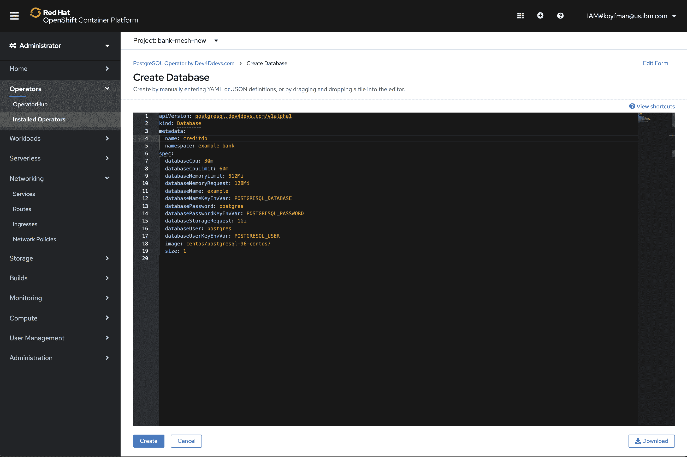

# 玩转 OperatorHub

> 原文：[`developer.ibm.com/zh/tutorials/operator-hub-openshift-4-operators-ibm-cloud/`](https://developer.ibm.com/zh/tutorials/operator-hub-openshift-4-operators-ibm-cloud/)

Operator 提供了一种在 OpenShift Kubernetes 集群中运行更复杂工作负载的机制。在本教程中，您将学习如何通过用于管理集群内数据库实例的社区数据库 Operator，设置热门的 PostgreSQL 数据库的实例。

Operator 向 Kubernetes 引入了一种新的原生对象。不妨将 Operator 视为用于为集群内服务启动 pod 的工厂。您可以编写 Operator 来升级和备份应用程序以及从某些种类的错误中恢复。此外，根据具体的复杂程度和功能，Operator 还能代替具备特定业务逻辑的固有知识的操作团队。

OpenShift 随附许多资源，如节点、部署和 pod，您可以在 UI 中以及通过 `oc` 或 `kubectl` 命令行界面进行处理。Operator 可以向 Kubernetes 创建具备其自己的特定于功能的逻辑的新定制对象。Operator 使用一种控制器来以特定于资源的方式协调状态。OpenShift 4 引入了 [OperatorHub](https://docs.openshift.com/container-platform/4.3/operators/olm-understanding-operatorhub.html)，这是可由管理员安装并由开发者添加到各个项目的应用程序的目录。虽然模板允许您部署应用程序，但它们一般不向 Kubernetes 安装定制资源，并且更为重要的是，它们只运行一次，而无法响应环境中的更改来管理服务。

本教程会指导您完成将社区 Operator 部署到现有 OpenShift 项目的整个过程，以便您可以创建 PostgreSQL 数据库的实例。参阅[通过移动银行应用的后端来关注数据隐私](https://developer.ibm.com/zh/patterns/privacy-backend-loyalty-app-openshift-4/) Code Pattern，以了解使用此 Operator 部署的 PostgreSQL 实例的完整微服务应用程序。

本教程中的示例使用了 [Red Hat® OpenShift® on IBM Cloud™](https://www.ibm.com/cn-zh/cloud/openshift)。

## 前提条件

本教程适用于熟悉 Kubernetes 或 OpenShift 并希望学习 OpenShift 4 中的 Operator 和 OperatorHub 的软件开发者。

在开始本教程之前，完成以下步骤：

1.  登录 [IBM Cloud](https://cloud.ibm.com?cm_sp=ibmdev-_-developer-tutorials-_-cloudreg) 或在其中创建帐户
2.  在 [IBM Cloud](https://cloud.ibm.com/docs/openshift?topic=openshift-openshift_tutorial&cm_sp=ibmdev-_-developer-tutorials-_-cloudreg) 上供应一个 OpenShift 4.3 集群
3.  创建一个[项目](https://docs.openshift.com/container-platform/4.3/applications/projects/configuring-project-creation.html)

## 预估时间

完成本教程大约需要 30 分钟，不包括供应 OpenShift 集群所需的时间。

## 理解 OperatorHub 和 OLM

OperatorHub 中列出的 Operator（包括 Red Hat 官方的 Operator 和不受官方支持的“社区”Operator）由 Operator Lifecycle Management (OLM) 服务进行管理，该服务本身也是一个 Kubernetes Operator。[访问 Red Hat Marketplace](https://marketplace.redhat.com/en-us) 以访问经认证可在 Red Hat OpenShift 上运行的 Operator。

OLM 提供了 `subscription` 对象，用于列出已安装的 Operator。这允许您查询已安装的对象。

通过执行本教程中的步骤来安装 Operator 后，可以使用 `oc get sub` 命令列出通过 Operator 目录安装的 Operator：

```
$   oc get subs
NAME                               PACKAGE                            SOURCE                CHANNEL
postgresql-operator-dev4devs-com   postgresql-operator-dev4devs-com   community-operators   alpha 
```

## 第 1 步：查找社区 Operator

首先切换到 OpenShift 中的管理员方式，并浏览到 OperatorHub。在导航中，展开 **Operator** 并选择 **OperatorHub**：



然后在 OperatorHub 中搜索 PostgreSQL，并单击**安装**按钮以安装 [Dev4Devs 社区 PostgreSQL Operator](https://github.com/dev4devs-com/postgresql-operator)：



## 第 2 步：订阅 Operator

现在您需要选择一个现有的要在其中安装 Operator 的名称空间。这是您可以在其中创建数据库实例的名称空间：



安装 Operator 之后通过订阅频道以保持最新，您可以查看已安装的 Operator。在导航中的 **Operator**下，选择**已安装的 Operator**。现在您将看到 PostgreSQL Operator：



## 第 3 步：切换到“开发者”视图并创建数据库

将视图从“管理员”切换为“开发者”，并选择**拓扑**以查看部署的 Operator。

单击左侧面板中的 **+添加**链接，然后选择“数据库”磁贴，如下面的屏幕截图中所示：



接下来，在开发者目录中，选择您的 Operator 的 Postgres **数据库**磁贴：



在此处，您可以选择分配给数据库的卷的大小，以及数据库的资源限制。 还可以指定数据库名称和名称空间：例如，将数据库命名为 `creditdb`，并将名称空间命名为 `example-bank`，如下面的屏幕截图所示：



下面是通过 Operator 创建的新数据库：

```
$   oc get pods

NAME                                  READY     STATUS    RESTARTS   AGE
creditdb-8565d6bfd9-dm88t             1/1       Running   1          6d4h
postgresql-operator-576dc87c4-vtr6j   1/1       Running   0          6d21h 
```

`databases` CRD 现在是一个 Kubernetes 原生对象，可通过 `oc` 或等效的 `kubectl` 进行查询，如下面的示例所示：

```
$   oc get databases

NAME       AGE
creditdb   6d6h

$   kubectl get databases

NAME       AGE
creditdb   6d6h 
```

Operator 不仅会实例化数据库实例，还会创建 `PersistentVolumeClaim` 以用于数据库存储。

## 第 4 步：连接到数据库

通过 `oc expose` 公开服务以允许通过外部 IP 从集群外部进行访问。注意，OpenShift 路由仅支持 HTTP/HTTPS 流量，因此无法将其用于连接到 `PostgreSQL` 实例：

```
$ oc expose deploy creditdb --port=5432 --target-port=5432 --type=LoadBalancer --name my-pg-svc

service/my-pg-svc exposed 
```

```
$  oc get svc

NAME                          TYPE           CLUSTER-IP      EXTERNAL-IP      PORT(S)             AGE
my-pg-svc                     LoadBalancer   172.21.48.131   169.aaa.bbb.ccc   5432:32469/TCP      12s 
```

现在可以使用先前所述的外部 IP 从集群外部访问数据库。

数据库处于生产环境后，可以删除 LoadBalancer。删除 LoadBalancer 会禁止对数据库的外部访问，只允许服务通过内部集群 IP 或服务连接到数据库。

## 结束语

OpenShift OperatorHub 提供了类似于“应用商店”的体验来查找服务并将其安装到 OpenShift 集群中。OLM 服务及其命令行界面可帮助您管理 Operator 并使其保持更新。

您可以转至 OpenShift 4.3 集群中的 OperatorHub，以发现可供安装在集群中的其他服务，或参阅 [operatorhub.io](https://operatorhub.io/) 以获取可以手动安装的 Operator 的更大列表。

## 后续步骤

利用以下内容中的开源代码和说明来了解在使用 OpenShift 4.3 构建安全的 Example Bank 云应用程序时执行的步骤：

*   **博客文章**：[使用 OpenShift 4.3 在公共云上构建安全的应用程序](https://developer.ibm.com/zh/blogs/build-secure-applications-with-openshift-4-public-cloud/)
*   **文章**：[OpenShift 4 简介](https://developer.ibm.com/zh/articles/intro-to-openshift-4/)
*   **文章**：[微服务架构环境中的威胁建模](https://developer.ibm.com/zh/articles/threat-modeling-microservices-openshift-4/)
*   **Code Pattern**：[通过移动银行应用的后端来关注数据隐私](https://developer.ibm.com/zh/patterns/privacy-backend-loyalty-app-openshift-4/)
*   **Code Pattern**：[使用 OpenShift 服务网格的微服务](https://developer.ibm.com/zh/patterns/microservices-with-the-openshift-service-mesh/)
*   **教程**：[使用 OpenShift Serverless Operator 构建无服务器 Node.js 应用程序](https://developer.ibm.com/zh/tutorials/build-serverless-nodejs-applications-with-the-openshift-serverless-operator/)
*   **教程**：[构建 Tekton Pipeline 以将移动应用程序后端部署到 OpenShift 4](https://developer.ibm.com/zh/tutorials/tekton-pipeline-deploy-a-mobile-app-backend-openshift-4/)

本文翻译自：[Fun with OperatorHub](https://developer.ibm.com/tutorials/operator-hub-openshift-4-operators-ibm-cloud/)（2020-08-04）