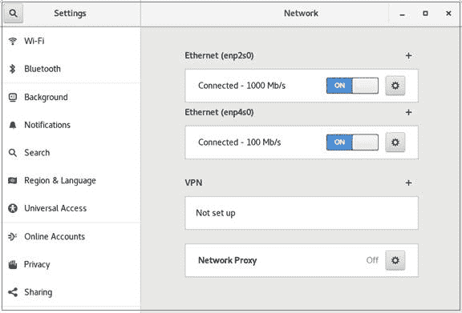
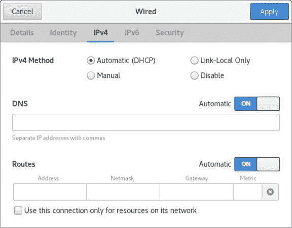
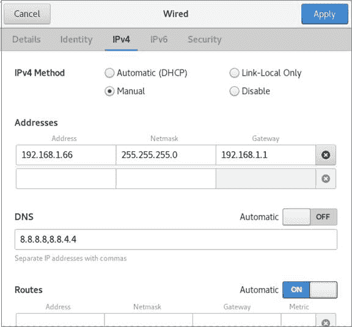

# 学习 Linux 101：永久网络配置

> 原文：[`developer.ibm.com/zh/tutorials/l-lpic1-109-2/`](https://developer.ibm.com/zh/tutorials/l-lpic1-109-2/)

## 概述

在本教程中，将学习如何管理 Linux 主机的永久网络配置学习内容：

*   了解基本的 TCP/IP 主机配置。
*   使用网络管理器配置以太网和 wifi 网络。
*   了解 systemd-networkd。

## Linux 中的网络

##### 关于本系列教程

本系列教程将帮助您学习 Linux 系统管理任务。您还可以使用这些教程中的材料来准备参加 [Linux Professional Institute LPIC-1：Linux 服务器专业认证考试。](https://www.lpi.org/)

参阅“[学习 Linux 101：LPIC-1 学习路线图](https://developer.ibm.com/zh/tutorials/l-lpic1-map/)”，获得本系列中每个教程的简介和链接。该路线图仍在制定中。本教程反映了 2018 年 10 月 29 日更新的 5.0 版本的目标。在教程完成时，会将它们添加到路线图中。

当您在网咖、酒店或朋友家中拿出笔记本电脑或智能手机时，通常希望可以正常使用互联网。有时候，您需要输入密码或执行其他一些连接操作。想要能够随时随地进行上网连接，通常会有一个使用静态配置的计算机网络。在本教程中，您将了解实现此目标所需的文件和命令。

本教程将帮助您为 Linux® 系统管理员 (PIC-1) 考试 102 的主题 109 中的目标 109.2 做好应考准备。该目标的权重为 4。本教程反映了 2018 年 10 月 29 日更新的 5.0 版本的目标。

## 前提条件

要想最充分地利用本系列教程，您应该掌握 Linux 的基本知识，还应该有一个正常工作的 Linux 系统，您可以在这个系统上练习本教程中涵盖的命令。您还需要透彻理解“学习 Linux 101：互联网协议基础知识”中讲述的内容。有时候，由于程序的不同版本会产生不同的输出格式，因此您的结果不一定与这里显示的清单和图完全相同。本教程中的示例来自 Fedora 29 和 30、CentOS 7 以及 Ubuntu 18.04.2 LTS。

## 静态、动态和 wifi 配置

在早期的计算机网络中，对于每个连接到网络的设备，都会为其分配一个 IP 地址，并为其配置地址和其他信息，最重要的是，允许它通过网关连接到网络的其余部分并使用名称服务器连接其他设备。随后，专门的服务器可以从可用池中自动分配地址。这称为“动态主机配置”，而用于交换的协议称为*动态主机配置协议*或 *DHCP*。IP 地址通常会保留一段时间，因此，如果客户端系统进入睡眠状态或暂时断开连接，将使用相同的地址重新连接。客户端系统还可以请求特定的地址（例如分配的最后一个地址），如果该地址未被其他设备使用，那么 DHCP 服务器可以接受该请求。

随着 wifi 网络的出现，动态配置变得越来越重要。您的笔记本电脑（或其他设备）能够以无线方式在建筑物甚至校园内漫游，而无需将以太网电缆的一端插入墙上的插座，并将另一端插入笔记本电脑上的端口。您的系统必须能够识别无线接入点并连接到合适的无线接入点，才能访问网络。通常，您必须提供密码才能使用 wifi 网络。连接到 wifi 后，将进行正常的 DHCP 地址分配，然后您就可以连接到互联网或内部网络。当您在网络覆盖区域内移动并可能走出初始接入点的覆盖范围时，系统通常会自动连接到另一个具有更强信号的接入点。如果您完全走出网络覆盖范围，那么系统将连接新的网络，进行身份验证，然后分配地址。

在本教程中，我将介绍在现代化的 Linux 系统中实现此目标所需的基本文件和命令。大多数示例都使用的是 IPv4。有关 Ipv6 以及 Ipv6 与 IPv4 的区别的更多信息，可参阅我的配套教程：[学习 Linux 101：互联网协议基础知识](https://developer.ibm.com/zh/tutorials/l-lpic1-109-1/)。

## TCP/IP 主机配置

Linux 系统都具有主机名，不论该系统是独立系统还是连接到网络的系统，都会使用此名称来标识该系统。通常，如果系统是网络的一部分，那么将使用相同的主机名来标识该系统。当系统连接到网络或互联网时，它将具有一个更严格的名称，此名称是域名系统 (DNS) 名称的一部分。DNS 名称由两部分组成：主机名和域名。标准域名 (FQDN) 由主机名、点和域名组成（例如，myhost.mydomain）。域名通常包含多个由点分隔的部分（例如，ibm.com 或 lpi.org）。

内核通常在引导期间使用配置文件来设置主机名值。

### 主机名是什么？

许多 Linux 系统将主机名存储在 /etc/hostname 文件中。大多数系统还可以使用 `hostname` 命令来显示或设置主机名。

清单 1 展示了如何显示 Fedora 29 系统和 Slackware 14.2 系统上的主机名。

**清单 1\. 显示主机名**

```
[ian@attic5-f29 ~]$ # Fedora 29
[ian@attic5-f29 ~]$ ls /etc/hostname
/etc/hostname
[ian@attic5-f29 ~]$ cat /etc/hostname
attic5-f29
[ian@attic5-f29 ~]$ hostname
attic5-f29

ian@attic4-sl42 ~]$ # Slackware 14.2
[ian@attic4-sl42 ~]$ ls /etc/hostname
/bin/ls: cannot access '/etc/hostname': No such file or directory
[ian@attic4-sl42 ~]$ hostname
attic4-sl42 
```

内核将当前活动的主机名存储在 /proc 虚拟文件系统内的 /proc/sys/kernel/hostname 文件中。主机名和 FQDN 也可以存储在 /etc/hosts 中。

### 更改主机名

您可以使用 root 用户权限，通过 `hostname` 命令来更改主机名。这不会更新 /etc/hostname 中的该值。清单 2 在 Fedora 29 系统上对此进行了说明。

**清单 2\. 使用 hostname 命令更改主机名**

```
[ian@attic5-f29 ~]$ cat /etc/hostname
attic5-f29
[ian@attic5-f29 ~]$ hostname
attic5-f29
[ian@attic5-f29 ~]$ sudo hostname attic5-f29-a
[ian@attic5-f29 ~]$ hostname
attic5-f29-a
[ian@attic5-f29 ~]$ cat /etc/hostname
attic5-f29
[ian@attic5-f29 ~]$ cat /proc/sys/kernel/hostname
attic5-f29-a 
```

注意，/etc/hostname 并没有更新，但虚拟 /proc/sys/kernel/hostname 却显示了已更新的值。如果要永久保留此更改，那么您需要自行更新 /etc/hostname。您可能还需要更新 /etc/hosts 或其他文件。

如果您的系统使用 systemd 系统和服务管理器，那么可以使用 `hostnamectl` 命令。`hostnamectl` 命令中包含多个命令，可用于显示状态、设置主机名或设置其他值。如果它不与任何命令一起使用，或者它与 `status` 命令一起使用，那么将显示当前主机名状态，如清单 3 所示。

**清单 3\. 使用 hostnamectl 命令显示主机名**

```
[ian@attic5-f29 ~]$ hostnamectl status
   Static hostname: attic5-f29
Transient hostname: attic5-f29-a
         Icon name: computer-desktop
           Chassis: desktop
        Machine ID: 434ef6f0139941b8bbdeb5b2950278d0
           Boot ID: 3f2201af05364f819287617d8c215ec7
  Operating System: Fedora 29 (Workstation Edition)
       CPE OS Name: cpe:/o:fedoraproject:fedora:29
            Kernel: Linux 5.0.14-200.fc29.x86_64
      Architecture: x86-64 
```

您会看到旧主机名 attic5-f29 显示为静态主机名，而新主机名 attic5-f29-a 显示为瞬态主机名。`hostnamectl` 命令还可以区分第三个主机名（即灵活主机名），此主机名可以是描述性名称，例如 **Ian’s UEFI computer**。可使用 `set-hostname` 命令来设置其中一个或所有主机名。如果未指定特定主机名，那么所有三个主机名都会更新为相同的新值。清单 4 展示了如何将主机名设置为 attic5-f29-b 并验证是否已更新 /etc/host6name 文件。我还会展示如何设置灵活主机名。状态不再显示唯一的瞬态主机名，因为它现在与静态主机名相同。

**清单 4\. 使用 hostnamectl 命令设置主机名**

```
[ian@attic5-f29 ~]$ cat /etc/hostname
attic5-f29
[ian@attic5-f29 ~]$ sudo hostnamectl set-hostname attic5-f29-b
[ian@attic5-f29 ~]$ sudo find /etc -type f -mmin -5
/etc/hostname
[ian@attic5-f29 ~]$ cat /etc/hostname
attic5-f29-b
[ian@attic5-f29 ~]$ sudo hostnamectl --pretty set-hostname "Ian's UEFI desktop"
[ian@attic5-f29 ~]$ hostnamectl
   Static hostname: attic5-f29-b
   Pretty hostname: Ian's UEFI desktop
         Icon name: computer-desktop
           Chassis: desktop
        Machine ID: 434ef6f0139941b8bbdeb5b2950278d0
           Boot ID: 3f2201af05364f819287617d8c215ec7
  Operating System: Fedora 29 (Workstation Edition)
       CPE OS Name: cpe:/o:fedoraproject:fedora:29
            Kernel: Linux 5.0.14-200.fc29.x86_64
      Architecture: x86-64 
```

更改主机名的第三种方法是，使用网络管理器命令行界面 (nmcli) 来与网络管理器守护程序进行交互。与 `hostnamectl` 一样，`nmcli` 命令中也包含多个命令。使用带有 `hostname` 选项的 `general` 命令，可以查看或更改主机名。如您所料，无需任何权限即可查看主机名，但需要具有 root 用户权限才能更改主机名。清单 5 展示了如何使用 `nmcli general` 命令来查看和设置主机名。

**清单 5\. 使用 nmcli 命令设置主机名**

```
ian@attic5-f29 ~]$ nmcli general hostname
attic5-f29-b
[ian@attic5-f29 ~]$ sudo nmcli general hostname attic5-f29
[ian@attic5-f29 ~]$ cat /etc/hostname
[ian@attic5-f29 ~]$ hostname
attic5-f29
attic5-f29
[ian@attic5-f29 ~]$ hostnamectl
   Static hostname: attic5-f29
   Pretty hostname: Ian's UEFI desktop
Transient hostname: attic5-f29-b
         Icon name: computer-desktop
           Chassis: desktop
        Machine ID: 434ef6f0139941b8bbdeb5b2950278d0
           Boot ID: 3f2201af05364f819287617d8c215ec7
  Operating System: Fedora 29 (Workstation Edition)
       CPE OS Name: cpe:/o:fedoraproject:fedora:29
            Kernel: Linux 5.0.14-200.fc29.x86_64
      Architecture: x86-64 
```

注意，`nmcli general` 命令可更新 /etc/hostname 并更改由 `hostname` 显示的主机名以及由 `hostnamectl` 显示的静态主机名。由 `hostnamectl` 显示的瞬态主机名不会立即受到影响，但不久后会更改为新的静态主机名。由 `hostnamectl` 存储的灵活主机名将不受影响。

### 查找其他主机

为了使网络发挥作用，您必须能够查找其他计算机并连接到它们以获取服务。在引导期间，您没有任何网络连接，并且计算机上通常只有很少的信息，因此您至少要知道可从哪里开始查找连接。/etc/hosts 文件将用作主机名的最小地址簿，并始终针对本地主机（通常为 localhost.localdomain）提供 IPv4 条目。如果启用了 IPv6，那么将针对 IPv6 本地主机提供其他条目。主机名和域名也可能存储在 /etc/hosts 中。清单 6 展示了我的 Ubuntu 18.04 LTS 系统中的 /etc/hosts 文件。

**清单 6\. 我的 Ubuntu 18.04 LTS 系统中的 /etc/hosts**

```
127.0.0.1 localhost
127.0.1.1 attic5-u18

# The following lines are desirable for IPv6 capable hosts
::1     ip6-localhost ip6-loopback
fe00::0 ip6-localnet
ff00::0 ip6-mcastprefix
ff02::1 ip6-allnodes
ff02::2 ip6-allrouters

192.168.1.24 attic4 attic4-stw attic4-f28 
```

注意，本地主机使用惯用的回送地址 127.0.0.1，而我的主机名 attic5-0u18 显示为使用其他回送地址，即 127.0.1.1。针对 IPv6 还提供几个条目，包括 ::1，这表示默认回送地址且名称为 ip6-localhost 和 ip6-loopback。最后一行包含 IP 地址 192.168.1.24 的几个短别名，这是我的网络上的另一个系统，可引导至多个可能的系统之一。

清单 7 展示了使用 `ping` 命令联系多个本地主机名以及已连接到主机 attic4-f28 的网络的结果。

**清单 7\. Ping 本地主机**

```
ian@attic5-u18:~$ ping -c 2 localhost
PING localhost (127.0.0.1) 56(84) bytes of data.
64 bytes from localhost (127.0.0.1): icmp_seq=1 ttl=64 time=0.032 ms
64 bytes from localhost (127.0.0.1): icmp_seq=2 ttl=64 time=0.037 ms

--- localhost ping statistics ---
2 packets transmitted, 2 received, 0% packet loss, time 1010ms
rtt min/avg/max/mdev = 0.032/0.034/0.037/0.006 ms
ian@attic5-u18:~$ ping -c2 ip6-loopback
PING ip6-loopback(ip6-localhost (::1)) 56 data bytes
64 bytes from ip6-localhost (::1): icmp_seq=1 ttl=64 time=0.072 ms
64 bytes from ip6-localhost (::1): icmp_seq=2 ttl=64 time=0.065 ms

--- ip6-loopback ping statistics ---
2 packets transmitted, 2 received, 0% packet loss, time 1012ms
rtt min/avg/max/mdev = 0.065/0.068/0.072/0.009 ms
ian@attic5-u18:~$ ping -c2 attic5-u18
PING attic5-u18 (127.0.1.1) 56(84) bytes of data.
64 bytes from attic5-u18 (127.0.1.1): icmp_seq=1 ttl=64 time=0.052 ms
64 bytes from attic5-u18 (127.0.1.1): icmp_seq=2 ttl=64 time=0.039 ms

--- attic5-u18 ping statistics ---
2 packets transmitted, 2 received, 0% packet loss, time 1029ms
rtt min/avg/max/mdev = 0.039/0.045/0.052/0.009 ms
ian@attic5-u18:~$ ping -c2 attic4-f28
PING attic4 (192.168.1.24) 56(84) bytes of data.
64 bytes from attic4 (192.168.1.24): icmp_seq=1 ttl=64 time=0.133 ms
64 bytes from attic4 (192.168.1.24): icmp_seq=2 ttl=64 time=0.088 ms

--- attic4 ping statistics ---
2 packets transmitted, 2 received, 0% packet loss, time 1014ms
rtt min/avg/max/mdev = 0.088/0.110/0.133/0.024 ms 
```

为了进行比较，清单 8 展示了我的 Fedora 29 系统中的 /etc/hosts。注意，尽管每个地址都有多个别名，但仅包含回送地址。Fedora 未将此系统的主机名 attic5-f29 添加到 /etc/hosts 中。

**清单 8\. 我的 Fedora 29 系统中的 /etc/hosts**

```
127.0.0.1   localhost localhost.localdomain localhost4 localhost4.localdomain4
::1         localhost localhost.localdomain localhost6 localhost6.localdomain6 
```

如果想要连接到像 www.ibm.com 或 lpi.org 这样的系统，那么您需要更多信息。DNS 就像是一本域名电话簿。DNS 解析器接受请求，并尝试将名称解析为 IP 地址或将 IP 地址解析为名称。DNS 由许多按层次组织的服务器组成。每个服务器都会缓存搜索结果，因此您可以在不搜索整个互联网的情况下尽快解析名称。

/etc/resolv.conf 文件会告诉系统从哪里开始搜索。该文件通常是自动生成的，尤其是在使用 DHCP 配置系统或使用 systemd 时。清单 9 展示了 CentOS 7 系统中最小的 resolv.conf 文件。*nameserver* 选项指定要联系的名称服务器。在本例中，它为 192.168.1.1，即我的路由器中的名称服务器。路由器通常又会使用由互联网服务提供商 (ISP) 提供的名称服务器或公共名称服务器（例如 Google 名称服务器 8.8.8.8 或 8.8.4.4）。

**清单 9\. 基本的 /etc/resolv.conf**

```
# Generated by NetworkManager
search lan
nameserver 192.168.1.1 
```

如果系统使用 systemd，那么 resolv.conf 中的 *nameserver* 值可能为 127.0.0.53，这是 systemd-resolved 中的内部 DNS 存根解析器。如果在类似于上面系统的系统上运行 `systemd-resolved --status`，您会看到存根也连接到 192.168.1.1。/etc/resolv.conf 文件也可能是 /run/systemd/resolve/stub-resolv.conf 的符号链接。如果您要创建自己的 resolv.conf，那么应该先断开此链接。

您还可以在 resolv.conf 中指定其他内容，包括可供搜索非标准域名的域名列表。参阅 resolv.conf 的联机帮助页，以获取其他信息。

名称服务切换文件 /etc/nsswitch.conf 提供了其他配置，包括用于查找名称的数据源或所谓的数据库。清单 10 展示了我的 Ubuntu 18.04 LTS 系统中的 /etc/nsswitch.conf。在此示例中，将根据 hosts 行中的规范来解析主机名。首先，搜索文件 (/etc/hosts)，接着使用 mdns4_minimal（用于使用常规 DNS 搜索语义来搜索小型本地网络的多播 DNS），然后使用 DNS，最后查看当前主机名是否符合搜索条件。现在，您已经知道 Fedora 为何选择不为 /etc/hosts 中的主机名创建条目。尝试使用 `dig $(hostname)` 在此类系统上查找您的主机名。

**清单 10\. Ubuntu 18.04 LTS 中的 /etc/nsswitch.conf**

```
# /etc/nsswitch.conf
#
# Example configuration of GNU Name Service Switch functionality.
# If you have the `glibc-doc-reference' and `info' packages installed, try:
# `info libc "Name Service Switch"' for information about this file.

passwd:         compat systemd
group:          compat systemd
shadow:         compat
gshadow:        files

hosts:          files mdns4_minimal [NOTFOUND=return] dns myhostname
networks:       files

protocols:      db files
services:       db files
ethers:         db files
rpc:            db files

netgroup:       nis 
```

您会在 /etc/nsswitch.conf 中看到其他几行。这些行指定应如何查找其他种类的名称。例如，可以使用轻量级目录访问协议 (LDAP) 数据库来存储公司或学校（在其中，任何登录用户都可以共享可用计算机）中用户的登录信息。这些工作站在用户注销后可能会自动重新引导。在下一个用户成功进行身份验证后，系统可能会连接到某种联网存储器上该用户的主目录。参阅 nsswitch.conf 的联机帮助页或信息页，以获取有关该文件中其他内容的更多信息。

### 配置以太网和 wifi 连接

到目前为止的示例主要使用的是动态 (DHCP) 配置。这种配置通常适用于工作站，而不适用于通常静态配置的服务器。

图形系统通常有一个设置或网络配置对话框，此对话框可通过网络管理器与网络配置进行交互。我将向您展示如何使用 CentOS 7 系统上的设置对话框将两个以太网接口之一重新配置为使用静态配置。图 1 展示了同时连接了两个以太网接口的设置对话框。您可以打开或关闭每个接口，也可以单击齿轮图标以编辑设置。

**图 1\. 包含两个以太网连接的 Network settings 对话框**


在图 2 中，我单击了 enp4s0 (100 Mbps) 连接的齿轮图标，然后选择了 **IPv4** 选项卡。您可以看到，IP 配置以及 DNS 和路由配置都是自动的。

**图 2\. IPv4 自动设置**


在图 3 中，我已切换为手动配置，将 IP 地址设置为 192.168.1.66，将网络掩码设置为 255.255.255.0，并将网关设置为 192.168.1.1（这是我的路由器的地址）。我还关闭了自动 DNS 解析功能，并将 DNS 服务器设置为两个公共 Google DNS 服务器：8.8.8.8 和 8.8.4.4。在我提供的例子中，所有流量都会通过 192.168.1.1 网关，因此我不需要配置任何特殊路由。

**图 3\. Ipv4 手动（静态）设置**


在单击 **Apply** 后，将保存您的设置。清单 11 展示了 /etc/sysconfig/network-scripts/ifcfg-enp4s0 中修改后的配置。

**清单 11\. 接口 enp4s0 的修改后配置**

```
TYPE=Ethernet
BOOTPROTO=none
DEFROUTE=yes
PEERDNS=no
IPV4_FAILURE_FATAL=no
IPV6INIT=yes
IPV6_AUTOCONF=yes
IPV6_DEFROUTE=yes
IPV6_FAILURE_FATAL=no
IPV6_ADDR_GEN_MODE=stable-privacy
NAME=enp4s0
UUID=132a0ea9-e934-4961-b278-0c70dbab84a2
DEVICE=enp4s0
ONBOOT=no
PROXY_METHOD=none
BROWSER_ONLY=no
IPADDR=192.168.1.66
PREFIX=24
GATEWAY=192.168.1.1
DNS1=8.8.8.8
DNS2=8.8.4.4 
```

在停止并重新启动接口后，将使用两个新的 DNS 服务器来更新 /etc/resolv.conf，如清单 12 所示。

**清单 12\. 已更新 /etc/resolv.conf**

```
# Generated by NetworkManager
search lan
nameserver 192.168.1.1
nameserver 8.8.8.8
nameserver 8.8.4.4 
```

### 激活和停用接口

除了用图形化方式激活和停用接口（如图 1 所示）外，还可以使用一些命令（例如传统的 `ifup` 和 `ifdown`）来激活和停用接口。清单 13 中对此进行了说明。

**清单 13\. 使用 ifup 和 ifdown**

```
[ian@attic4-ce7 ~]$ sudo ifdown enp4s0
Device 'enp4s0' successfully disconnected.
[ian@attic4-ce7 ~]$ sudo ifup enp4s0
Connection successfully activated (D-Bus active path: /org/freedesktop/NetworkManager/ActiveConnection/9) 
```

在本教程的前面部分中，我向您展示了如何使用 `nmcli` 命令来显示或处理主机名。使用此命令来显示或处理您的连接，如清单 14 所示。

**清单 14\. 使用 nmcli 激活和停用连接**

```
[ian@attic4-ce7 ~]$ sudo nmcli connection down enp4s0
Connection 'enp4s0' successfully deactivated (D-Bus active path: /org/freedesktop/NetworkManager/ActiveConnection/11)
[ian@attic4-ce7 ~]$ sudo nmcli connection up enp4s0
Connection successfully activated (D-Bus active path: /org/freedesktop/NetworkManager/ActiveConnection/12) 
```

在较新的系统上，也可使用 `ip` 命令来处理接口、路由和其他网络方面。如果系统上尚未安装 `ifup` 和 `ifdown`，那么通常可以进行安装。 也可以改用 `nmcli` 或 `ip` 命令。参阅联机帮助页或信息页，以了解更多详细信息。

### 使用 nmcli 的命令行配置

`nmcli` 命令还可以处理网络配置的许多其他方面。清单 15 展示了如何显示所有设备的状态，以及如何显示我刚刚配置的静态链路的详细信息。

**清单 15\. 使用 nmcli 显示设备状态**

```
[ian@attic4-ce7 ~]$ nmcli device status
DEVICE      TYPE      STATE      CONNECTION
enp2s0      ethernet  connected  enp2s0
enp4s0      ethernet  connected  enp4s0
virbr0      bridge    connected  virbr0
lo          loopback  unmanaged  --
virbr0-nic  tun       unmanaged  --
[ian@attic4-ce7 ~]$ nmcli device show enp4s0
GENERAL.DEVICE:                         enp4s0
GENERAL.TYPE:                           ethernet
GENERAL.HWADDR:                         00:23:54:33:F3:EE
GENERAL.MTU:                            1500
GENERAL.STATE:                          100 (connected)
GENERAL.CONNECTION:                     enp4s0
GENERAL.CON-PATH:                       /org/freedesktop/NetworkManager/ActiveCo
WIRED-PROPERTIES.CARRIER:               on
IP4.ADDRESS[1]:                         192.168.1.66/24
IP4.GATEWAY:                            192.168.1.1
IP4.ROUTE[1]:                           dst = 192.168.1.0/24, nh = 0.0.0.0, mt =
IP4.ROUTE[2]:                           dst = 0.0.0.0/0, nh = 192.168.1.1, mt =
IP4.DNS[1]:                             8.8.8.8
IP4.DNS[2]:                             8.8.4.4
IP6.ADDRESS[1]:                         fe80::6d6c:67f7:72a1:e950/64
IP6.GATEWAY:                            --
IP6.ROUTE[1]:                           dst = fe80::/64, nh = ::, mt = 103
IP6.ROUTE[2]:                           dst = ff00::/8, nh = ::, mt = 256, tabl 
```

在此示例中，处于连接状态的设备的 `nmcli device status` 输出中的每一行都包含一个设备和一个连接，该设备和连接具有相同的名称（如清单 16 所示）这不是必需的。清单 16 展示了在 Ubuntu 18.04 LTS 系统上运行同一命令所生成的输出。

**清单 16\. 在 Ubuntu 18.04 LTS 上使用 nmcli 显示设备状态**

```
ian@attic5-u18:~$ nmcli device status
DEVICE  TYPE      STATE      CONNECTION
.  ethernet  connected  Wired connection 1
lo      loopback  unmanaged  -- 
```

在此例中，连接名称为 **Wired connection 1**，该连接在设备 enp9s0 上处于活动状态。

根据 nmcli 的信息页，网络管理器*将所有网络配置都存储为“连接”，这些连接是用于描述如何创建或连接到网络的数据集（第 2 层详细信息、IP 地址等）。当设备使用连接的配置来创建或连接到网络时，该连接处于“活动”状态。可能有多个连接适用于同一个设备，但是在任何给定时间，只有一个连接可以在该设备上处于活动状态。使用其他连接，可以在不同的网络和配置之间快速进行切换。*

您还可以使用 `nmcli connection show enp4s0` 命令来显示某个连接（例如 enp4s0）的连接状态。实际上，`nmcli` 可以处理多种不同类型的对象或命令（如表 1 所汇总）。这些对象或命令可以缩写为明确的前缀，当前的前缀为第一个字母。

**表 1\. nmcli 命令**

| 命令/对象 | nmcli 含义 |
| --- | --- |
| help | 从 nmcli 获取简短帮助。 |
| general | 显示网络管理器的状态和权限。获取和更改系统主机名或网络管理器日志记录级别和域。 |
| networking | 查询网络管理器的联网状态以及启用和禁用联网。 |
| radio | 显示各种无线电开关的状态。启用和禁用无线电开关。 |
| connection | 显示网络数据集合。 |
| device | 显示或管理网络接口。 |
| agent | 将 nmcli 作为网络管理器秘密代理或 polkit 代理运行。 |
| monitor | 查看网络管理器活动。监视连接状态、设备或连接概要文件中的更改。注意，您还可以监视连接或设备对象。参阅信息页，以了解更多详细信息。 |

现在，我将向您展示如何克隆静态配置并使用 `nmcli` 进行一些修改。在清单 17 中，我先克隆 enp4s0 并将其保存为 enp4s0new。接下来，确保该连接不会自动连接，并将 IP 地址更改为 192.168.1.67/24。最后，我在 ipv4.dns 上使用 – 前缀来移除第二个 DNS 地址。像 DNS 服务器列表这样的容器都是从 0 开始编号。因此，`-ipv4.dns 1` 将删除第二个容器（我之前将其设置为 8.8.4.4）。最后，我选择性地展示了受影响字段的值，并确认我仍在使用接口 enp4s0。

**清单 17\. 使用 nmcli 克隆和修改连接**

```
[ian@attic4-ce7 ~]$ sudo nmcli connection clone enp4s0 enp4s0new
enp4s0 (132a0ea9-e934-4961-b278-0c70dbab84a2) cloned as enp4s0new (ded070be-f416-4313-acfd-f09899c4b27a).
[ian@attic4-ce7 ~]$ sudo nmcli connection modify enp4s0new connection.autoconnect no
[ian@attic4-ce7 ~]$ sudo nmcli connection modify enp4s0new ipv4.addresses 192.168.1.67/24
[ian@attic4-ce7 ~]$ sudo nmcli connection modify enp4s0new -ipv4.dns 1
[ian@attic4-ce7 ~]$ nmcli -f \ipv4.addresses,ipv4.dns,connection.autoconnect,connection.interface-name conn show enp4s0new
[ian@attic4-ce7 ~]$ nmcli -f \
> ipv4.addresses,ipv4.dns,connection.autoconnect,connection.interface-name \
> conn show enp4s0new
ipv4.addresses:                         192.168.1.67/24
ipv4.dns:                               8.8.8.8
connection.autoconnect:                 no
connection.interface-name:              enp4s0 
```

清单 18 展示了如何使用 `ifup` 和 `ifdown` 来停用原始的静态接口并激活克隆的接口。

**清单 18\. 激活克隆接口**

```
[ian@attic4-ce7 ~]$ sudo ifdown enp4s0
Device 'enp4s0' successfully disconnected.
[ian@attic4-ce7 ~]$ sudo ifup enp4s0new
Connection successfully activated (D-Bus active path: /org/freedesktop/NetworkManager/ActiveConnection/15)
[ian@attic4-ce7 ~]$ nmcli device status
DEVICE      TYPE      STATE      CONNECTION
enp2s0      ethernet  connected  enp2s0     Hi
enp4s0      ethernet  connected  enp4s0new
virbr0      bridge    connected  virbr0
lo          loopback  unmanaged  --
virbr0-nic  tun       unmanaged  --
[ian@attic4-ce7 ~]$ ping -c 2 192.168.1.67
PING 192.168.1.67 (192.168.1.67) 56(84) bytes of data.
64 bytes from 192.168.1.67: icmp_seq=1 ttl=64 time=0.089 ms
64 bytes from 192.168.1.67: icmp_seq=2 ttl=64 time=0.055 ms

--- 192.168.1.67 ping statistics ---
2 packets transmitted, 2 received, 0% packet loss, time 999ms
rtt min/avg/max/mdev = 0.055/0.072/0.089/0.017 ms 
```

网络管理器可以处理以太网连接以外的各种连接。清单 19 展示了新配置的 Fedora 30 笔记本电脑上的 802-11-wireless 字段。

**清单 19\. 使用 nmcli 配置无线连接设置**

```
[ian@localhost ~]$ nmcli -f 802-11-wireless c show Ian-guest
802-11-wireless.ssid:                   Ian-guest
802-11-wireless.mode:                   infrastructure
802-11-wireless.band:                   --
802-11-wireless.channel:                0
802-11-wireless.bssid:                  --
802-11-wireless.rate:                   0
802-11-wireless.tx-power:               0
802-11-wireless.mac-address:            --
802-11-wireless.cloned-mac-address:     --
802-11-wireless.generate-mac-address-mask:--
802-11-wireless.mac-address-blacklist:  --
802-11-wireless.mac-address-randomization:default
802-11-wireless.mtu:                    auto
802-11-wireless.seen-bssids:            1E:F2:9A:C7:50:0C
802-11-wireless.hidden:                 no
802-11-wireless.powersave:              0 (default)
802-11-wireless.wake-on-wlan:           0x1 (default) 
```

参阅联机帮助页或信息页，以获取有关 nmcli 的信息；参阅 nmcli-examples，以获取有关 nmcli 的更多信息（包括其交互式编辑功能）。

## systemd-networkd 守护程序

从 systemd V210 开始，systemd 包含了 *systemd-networkd* 和 *systemd-resolved* 守护程序形式的联网功能，这两个守护程序分别用于网络管理和 DNS 解析。*systemd-networkd* 守护程序正在开发中，因此可能缺少网络管理器所期望的功能。此守护程序从 Fedora 21、Ubuntu 15.04 和 Debian 8 开始可用。

使用 `systemctl --version` 检查系统上 systemd 的版本。清单 20 展示了我的 Fedora 29 系统上生成的结果。

**清单 20\. 检查 systemd 版本**

```
[ian@attic5-f29 ~]$ systemctl --version
systemd 239
+PAM +AUDIT +SELINUX +IMA -APPARMOR +SMACK +SYSVINIT +UTMP +LIBCRYPTSETUP +GCRYPT +GNUTLS +ACL +XZ +LZ4 +SECCOMP +BLKID +ELFUTILS +KMOD +IDN2 -IDN +PCRE2 default-hierarchy=hybrid 
```

您的系统可能同时安装了网络管理器和 systemd-networkd。可使用 `systemctl status` 命令来查看您正在运行的是网络管理器还是 systemd-networkd。清单 21 展示了我的 Fedora 29 系统正在运行网络管理器。

**清单 21\. 检查网络管理器和 systemd-networkd**

```
[ian@attic5-f29 ~]$ systemctl status NetworkManager
• NetworkManager.service - Network Manager
   Loaded: loaded (/usr/lib/systemd/system/NetworkManager.service; enabled; vendor preset: enabled)
   Active: active (running) since Tue 2019-06-18 23:09:06 EDT; 17h ago
     Docs: man:NetworkManager(8)
 Main PID: 973 (NetworkManager)
    Tasks: 4 (limit: 4915)
   Memory: 19.0M
   CGroup: /system.slice/NetworkManager.service
           ├─ 973 /usr/sbin/NetworkManager --no-daemon
           └─1531 /sbin/dhclient -d -q -sf /usr/libexec/nm-dhcp-helper -pf /var/run/dhclient-enp9s0.pid -lf /var/lib/NetworkManager/dhc>

Jun 19 09:03:16 attic5-f29 dhclient[1531]: DHCPACK from 192.168.1.1 (xid=0xb4abcb6b)
Jun 19 09:03:16 attic5-f29 NetworkManager[973]: <info>  [1560949396.1270] dhcp4 (enp9s0):   address 192.168.1.25
Jun 19 09:03:16 attic5-f29 NetworkManager[973]: <info>  [1560949396.1275] dhcp4 (enp9s0):   plen 24 (255.255.255.0)
Jun 19 09:03:16 attic5-f29 NetworkManager[973]: <info>  [1560949396.1275] dhcp4 (enp9s0):   gateway 192.168.1.1
Jun 19 09:03:16 attic5-f29 NetworkManager[973]: <info>  [1560949396.1275] dhcp4 (enp9s0):   lease time 86400
Jun 19 09:03:16 attic5-f29 NetworkManager[973]: <info>  [1560949396.1276] dhcp4 (enp9s0):   hostname 'attic5-f29'
Jun 19 09:03:16 attic5-f29 NetworkManager[973]: <info>  [1560949396.1276] dhcp4 (enp9s0):   nameserver '192.168.1.1'
Jun 19 09:03:16 attic5-f29 NetworkManager[973]: <info>  [1560949396.1276] dhcp4 (enp9s0):   domain name 'lan'
Jun 19 09:03:16 attic5-f29 NetworkManager[973]: <info>  [1560949396.1276] dhcp4 (enp9s0): state changed bound -> bound
Jun 19 09:03:16 attic5-f29 dhclient[1531]: bound to 192.168.1.25 -- renewal in 37454 seconds.
[ian@attic5-f29 ~]$ systemctl status systemd-networkd
• systemd-networkd.service - Network Service
   Loaded: loaded (/usr/lib/systemd/system/systemd-networkd.service; enabled; vendor preset: disabled)
   Active: inactive (dead)
     Docs: man:systemd-networkd.service(8) 
```

您会看到网络管理器正在运行，而 systemd-networkd 已安装且可用。

systemd-networkd 使用的配置文件具有 .network 扩展名。这些文件存储在 /usr/lib/systemd/network,/run/systemd/network 和 /etc/systemd/network 中。这些文件按照词典顺序进行排序和处理，因此，当出现设备时，将应用所找到的第一个匹配项。

可以在 /etc/systemd/network/ 中存储一个最小文件，该文件提供一个静态 IPv4 地址 192.168.1.68，而不是分配的 DHCP（清单 21 中所示的 192.168.1.25）。清单 22 中展示了一个样本。

**清单 22\. systemd-networkd 的样本 .network 文件**

```
[ian@attic5-f29 ~]$ cat /etc/systemd/network/20-static-enp9s0.network
[Match]
Name=enp9s0

[Network]
Address=192.168.1.68/24
Gateway=192.168.1.1
DNS=8.8.8.8 
```

要从网络管理器切换到 systemd-networkd，可使用 `systemctl` 命令先禁用网络管理器，然后启用并启动 systemd-networkd 和 systemd-resolved。注意，systemd-resolved 将在 /run/systemd 目录下创建自己的 resolv.conf 文件。由于其他系统服务可能依赖于 /etc 中的服务，因此最好是创建指向新服务的符号链接。

参阅 systemd.network 的联机帮助页或信息页，以了解更多详细信息。

## 结束语

对“主题 109.2：永久网络配置”的介绍到此结束。

本文翻译自：[Learn Linux 101: Persistent network configuration](https://developer.ibm.com/tutorials/l-lpic1-109-2/)（2019-07-01）