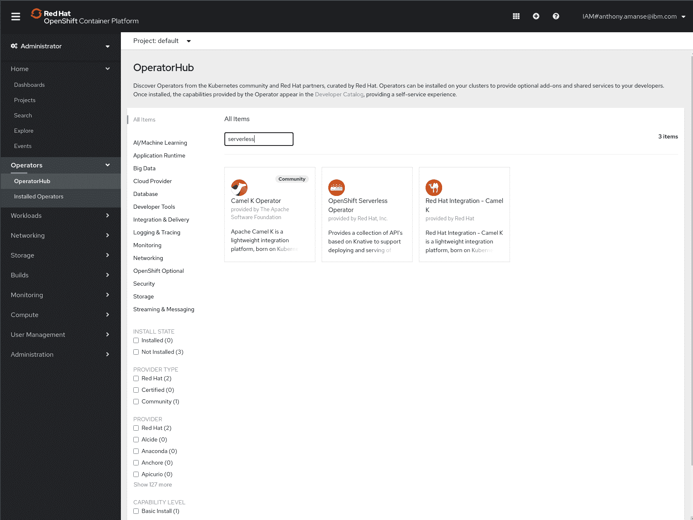
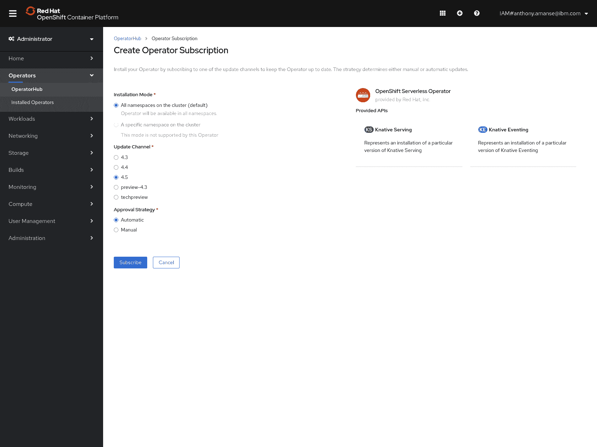
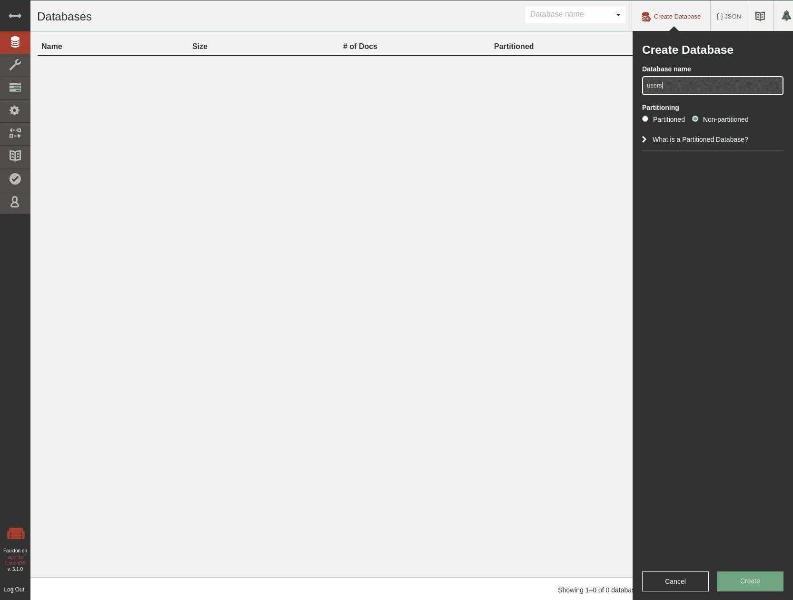
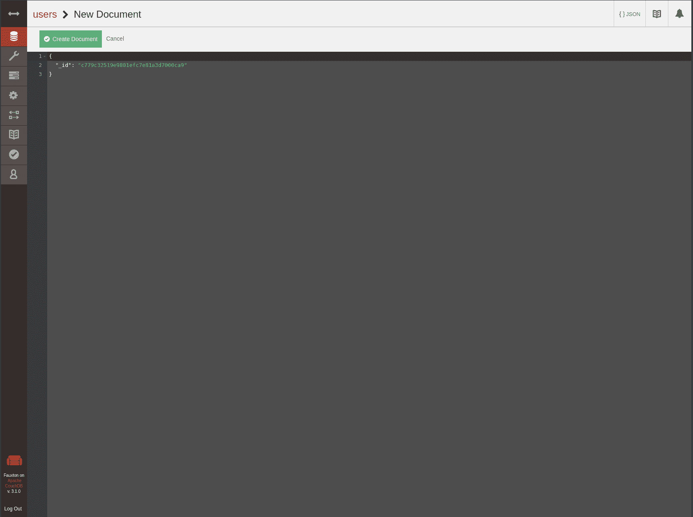
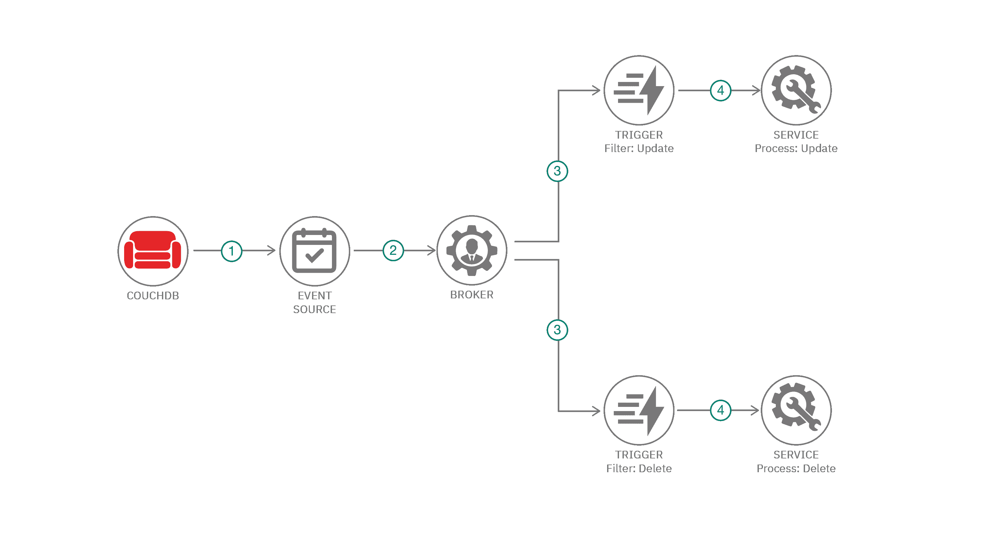

# 使用 OpenShift Serverless Operator 构建无服务器 Node.js 应用程序

> 原文：[`developer.ibm.com/zh/tutorials/build-serverless-nodejs-applications-with-the-openshift-serverless-operator/`](https://developer.ibm.com/zh/tutorials/build-serverless-nodejs-applications-with-the-openshift-serverless-operator/)

OpenShift 为开发者提供了许多现成的功能。例如，您可以使用 Operator 在自己的平台上轻松添加更多功能。本教程重点介绍了一种让 OpenShift 能够处理无服务器工作负载的 Operator：OpenShift Serverless。使用 OperatorHub Web 控制台，在自己的 OpenShift 环境中部署 OpenShift Serverless。OpenShift Serverless 基于 [Knative](https://knative.dev/) 项目，该项目允许在 Kubernetes 上部署其无服务器组件。

本教程展示了在 OpenShift 环境中安装 OpenShift Serverless 的过程。它还会介绍如何部署可用的无服务器组件以及如何基于事件在平台中运行无服务器应用程序。本教程中的示例使用 CouchDB 数据库来展示如何在对数据库进行了更改的情况下从零开始扩展应用程序。

本教程中的示例使用了 [Red Hat® OpenShift® on IBM Cloud™](https://www.ibm.com/cn-zh/cloud/openshift)。

## 前提条件

要完成本教程，您需要以下环境：

*   一个 Red Hat OpenShift on IBM Cloud 集群（配置此集群是为了设置管道）。如果需要创建一个集群，那么可以使用 [IBM Cloud Web 控制台](https://cloud.ibm.com/kubernetes/catalog/cluster/create?platformType=openshift&cm_sp=ibmdev-_-developer-tutorials-_-cloudreg)或 `ibmcloud` CLI。如果使用后者，那么[创建 Red Hat OpenShift on IBM Cloud 集群](https://cloud.ibm.com/docs/openshift?topic=openshift-openshift_tutorial#openshift_create_cluster&cm_sp=ibmdev-_-developer-tutorials-_-cloudreg)教程可能会派上用场。**注意：**本教程与 IBM Cloud Pak for Applications 不兼容。您需要一个空集群。
*   [OpenShift CLI `oc`](https://www.okd.io/download.html)。
*   [IBM/openshift-serverless-nodejs-couchdb](https://github.com/IBM/openshift-serverless-nodejs-couchdb) GitHub 存储库中的几个文件。按如下方式克隆存储库。

```
$ git clone https://github.com/IBM/openshift-serverless-nodejs-couchdb
$ cd openshift-serverless-nodejs-couch 
```

## 预估时间

在满足前提条件后，完成本教程大约需要 20 分钟。

## 步骤

1.  安装 OpenShift Serverless Operator
2.  安装 CouchDB Events Source
3.  创建 CouchDB 和事件源
4.  构建样本 Node.js 无服务器应用程序
5.  部署无服务器应用程序
6.  安装代理和触发器
7.  对数据库进行更改

### 1\. 安装 OpenShift Serverless Operator

您可以使用 OpenShift 仪表板中的 OperatorHub 来安装 OpenShift Serverless Operator。使用 Update Channel V4.5。





本教程使用的是 Knative Serving 和 Knative Eventing。您可以使用 Knative Serving 运行无状态的无服务器服务。要预订事件源，您需要使用 Knative Eventing。

要安装 Knative Serving

```
$ oc create namespace knative-serving
$ oc apply -f knative-serving.yaml 
```

确保 Knative Serving 的状态为 Ready，这可能需要几分钟时间。

```
$ oc get knativeserving.operator.knative.dev/knative-serving -n knative-serving --template='{{range .status.conditions}}{{printf "%s=%s\n" .type .status}}{{end}}'

DependenciesInstalled=True
DeploymentsAvailable=True
InstallSucceeded=True
Ready=True 
```

继续安装 Knative Eventing。

```
$ oc create namespace knative-eventing
$ oc apply -f knative-eventing.yaml 
```

确保 Knative Eventing 的状态为 Ready，这可能需要几分钟时间。

```
$ oc get knativeeventing.operator.knative.dev/knative-eventing \
  -n knative-eventing \
  --template='{{range .status.conditions}}{{printf "%s=%s\n" .type .status}}{{end}}'

InstallSucceeded=True
Ready=True 
```

### 2\. 安装 CouchDB Events Source

安装 CouchDB Events Source，以允许无服务器平台侦听 CouchDB 数据库中的更改。

```
$ oc apply -f https://github.com/knative/eventing-contrib/releases/download/v0.15.1/couchdb.yaml 
```

### 3\. 创建 CouchDB 和事件源

使用存储库中提供的 yaml 文件，在集群中创建 CouchDB 部署。

```
$ oc apply -f couchdb-deployment.yaml 
```

接下来，在 CouchDB 中创建一个示例数据库。您必须公开该数据库，以便在学习本教程的过程中在您的环境中访问该数据库。

```
$ oc expose svc/couchdb

$ oc get routes
NAME      HOST/PORT                   PATH   SERVICES   PORT   TERMINATION   WILDCARD
couchdb   couchdb-default.***.cloud          couchdb    5984                 None 
```

在路由的 `/_utils` 路径（例如，`couchdb-default.***.cloud/_utils`）中访问您的 couchdb 部署。用户名和密码为 `admin` 和 `password`。

在本教程中，创建一个名为 `users` 的数据库。在分区选项中，选择 `Non-partitioned`。



现在，您可以使用 `users` 数据库创建 CouchDB 事件源了。使用提供的 yaml 文件创建凭证密钥和事件源。

```
$ oc apply -f couchdb-secret.yaml
$ oc apply -f couchdb-source.yaml 
```

### 4\. 构建样本 Node.js 无服务器应用程序

存储库中提供了样本 Node.js 无服务器应用程序的源代码。您可以选择构建该应用程序并将其推送到 Docker Hub。

> 您也可以跳过此步骤，并使用 `serverless-app.yaml` 中提供的镜像。

要构建该应用程序，您可以选择使用 `docker` 或 `podman` 进行构建。

```
$ docker build -t <image-name> .
$ docker push <image-name> 
```

然后，在 `serverless-app.yaml` 中将镜像名称更改为您所需的名称。

该应用程序使用 [CloudEvents](https://cloudevents.io/) SDK 从 OpenShift 无服务器事件源中读取事件。CloudEvents 是一种规范，可以用一种通用方式描述事件数据以在服务、平台和系统之间提供互操作性。适用于 JavaScript 的 CloudEvents SDK 位于 [cloudevents/sdk-javascript](https://github.com/cloudevents/sdk-javascript) GitHub 存储库中。

### 5\. 部署无服务器应用程序

您现在可以部署样本应用程序了。这是您的 Knative Serving Service（通常称为 Knative 服务）。

```
$ oc apply -f serverless-app.yaml 
```

您可以使用以下命令来检查部署状态。检查 Ready 状态是否为 `True`。

```
$ oc get ksvc
NAME                      URL                                                        LATESTCREATED                   LATESTREADY                     READY   REASON
process-deleted-user      http://process-deleted-user.default.svc.cluster.local      process-deleted-user-4sg8s      process-deleted-user-4sg8s      True    
process-registered-user   http://process-registered-user.default.svc.cluster.local   process-registered-user-j2b82   process-registered-user-j2b82   True 
```

在本教程的后面部分中，出于演示目的，随同一应用程序一起部署了两个 Knative 服务。

### 6\. 安装代理和触发器

*代理*和*触发器*都是 OpenShift Serverless 中的自定义资源。代理表示事件网格，可以接收来自事件源的事件。然后，代理将事件发送给订户（称为触发器）。将触发器配置为预订代理。

要在 OpenShift Serverless 中安装代理，您必须创建一些服务帐户，以确保代理具有足够的权限。使用以下命令创建 `serviceaccount`。

```
$ oc -n default create serviceaccount eventing-broker-ingress
$ oc -n default create serviceaccount eventing-broker-filter 
```

创建与服务帐户的角色绑定。

```
$ oc -n default create rolebinding eventing-broker-ingress \
  --clusterrole=eventing-broker-ingress \
  --serviceaccount=default:eventing-broker-ingress
$ oc -n default create rolebinding eventing-broker-filter \
  --clusterrole=eventing-broker-filter \
  --serviceaccount=default:eventing-broker-filter 
```

这样，您便可以安装代理了。

```
$ oc apply -f broker.yaml 
```

安装触发器。

```
$ oc apply -f triggers.yaml 
```

如果您查看 `triggers.yaml` 文件，那么将过滤这两个触发器以预订特定的 CloudEvent 类型 `org.apache.couchdb.document.update` 和 `org.apache.couchdb.document.delete`。在添加或更新文档时，yaml 文件的第一部分会将事件发送到 `process-registered-user` Knative 服务。第二部分会将事件发送到在删除文档时部署的 `process-deleted-user` Knative 服务。

### 7\. 对数据库进行更改

现在您可以检查 pod 的状态了。您的无服务器应用程序现在应该已缩小至零。要查看 pod，您可以使用以下命令。

```
$ oc get pods -w 
```

每当对您在先前步骤中使用 `triggers.yaml` 配置的数据库进行更改时，都会运行无服务器应用程序。

现在返回到 CouchDB 仪表板 (`couchdb-default.***.cloud/_utils`)，在 `users` 数据库中添加包含任何 JSON 内容的文档。



如果返回到用于执行 watch pods 命令的终端，您会看到因无服务器平台中的更新事件而运行了 `process-registered-user` 无服务器应用程序。

```
$ oc get pods -w
NAME                                                              READY   STATUS    RESTARTS   AGE
couchdb-7f88bf6d65-snfr4                                          1/1     Running   0          44h
couchdbsource-couchdb-tran-f95d5c21-5e67-47b5-adc4-65228d5cdbr8   1/1     Running   0          28s
default-broker-filter-b5967fd6c-k4tlw                             1/1     Running   0          4m29s
default-broker-ingress-558585dc6c-nbbtp                           1/1     Running   0          4m29s
process-registered-user-j2b82-deployment-78569d5444-hmp6h         0/2     Pending   0          0s
process-registered-user-j2b82-deployment-78569d5444-hmp6h         0/2     Pending   0          0s
process-registered-user-j2b82-deployment-78569d5444-hmp6h         0/2     ContainerCreating   0          0s
process-registered-user-j2b82-deployment-78569d5444-hmp6h         0/2     ContainerCreating   0          2s
process-registered-user-j2b82-deployment-78569d5444-hmp6h         0/2     ContainerCreating   0          2s
process-registered-user-j2b82-deployment-78569d5444-hmp6h         1/2     Running             0          4s
process-registered-user-j2b82-deployment-78569d5444-hmp6h         2/2     Running             0          4s 
```

一会儿后，它应该会缩小至零。如果删除了刚刚创建的文档，您应该会看到已运行了另一个无服务器应用程序 `process-deleted-user`。

```
process-deleted-user-4sg8s-deployment-5b75749f98-sr4sv            0/2     Pending             0          0s
process-deleted-user-4sg8s-deployment-5b75749f98-sr4sv            0/2     Pending             0          0s
process-deleted-user-4sg8s-deployment-5b75749f98-sr4sv            0/2     ContainerCreating   0          0s
process-deleted-user-4sg8s-deployment-5b75749f98-sr4sv            0/2     ContainerCreating   0          2s
process-deleted-user-4sg8s-deployment-5b75749f98-sr4sv            0/2     ContainerCreating   0          2s
process-deleted-user-4sg8s-deployment-5b75749f98-sr4sv            0/2     ContainerCreating   0          3s
process-deleted-user-4sg8s-deployment-5b75749f98-sr4sv            1/2     Running             0          3s
process-deleted-user-4sg8s-deployment-5b75749f98-sr4sv            2/2     Running             0          4s 
```

下图显示的架构说明了所有组件如何协同工作。



1.  已创建的事件源连接将接收数据库中的更改。
2.  事件源将事件发送到默认代理。
3.  已预订代理的触发器将接收这些事件。过滤其中一个触发器以仅获取在执行更新时发生的事件，并过滤另一个触发器以获取删除事件。
4.  调用相应的服务以处理事件，例如，处理已更新的文档或处理已删除的文档。

## 结束语

借助 OpenShift Serverless Operator，您可以在 OpenShift 平台中拥有自己的无服务器架构。您可以高效地运行应用程序，也可以基于事件运行应用程序。现在，您可以实现因使用无服务器架构而受益的应用程序，并使用无服务器组件（您刚刚学习了其部署方式）来构建该应用程序。

## 后续步骤

利用以下内容中的开源代码和说明来深入了解 OpenShift，以便构建基于云的安全应用程序：

*   **博客文章**：[使用 OpenShift 4.3 在公共云上构建安全的微服务应用程序](https://developer.ibm.com/zh/blogs/build-secure-applications-with-openshift-4-public-cloud/)
*   **文章**：[OpenShift 4 简介](https://developer.ibm.com/zh/articles/intro-to-openshift-4/)
*   **文章**：[微服务架构环境中的威胁建模](https://developer.ibm.com/zh/articles/threat-modeling-microservices-openshift-4/)
*   **教程**：[玩转 OperatorHub](https://developer.ibm.com/tutorials/operator-hub-openshift-4-operators-ibm-cloud/)
*   **Code Pattern**：[通过移动银行应用程序后端来关注数据隐私](https://developer.ibm.com/zh/patterns/privacy-backend-loyalty-app-openshift-4/)
*   **Code Pattern**：[使用 OpenShift 服务网格的微服务](https://developer.ibm.com/zh/patterns/microservices-with-the-openshift-service-mesh/)
*   **教程**：[构建 Tekton Pipeline 以将移动应用程序后端部署到 OpenShift 4](https://developer.ibm.com/zh/tutorials/tekton-pipeline-deploy-a-mobile-app-backend-openshift-4/)

本文翻译自：[Build serverless Node.js applications with the OpenShift Serverless Operator](https://developer.ibm.com/tutorials/build-serverless-nodejs-applications-with-the-openshift-serverless-operator/)（2020-08-04）