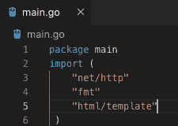
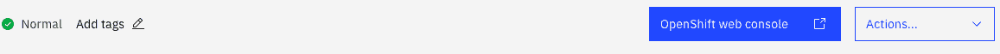
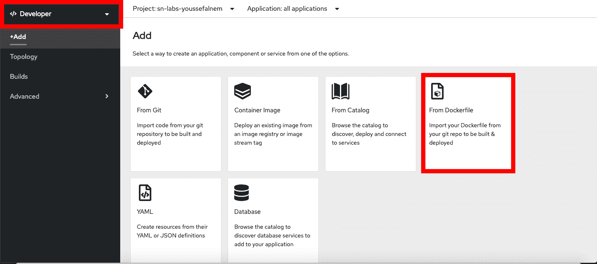
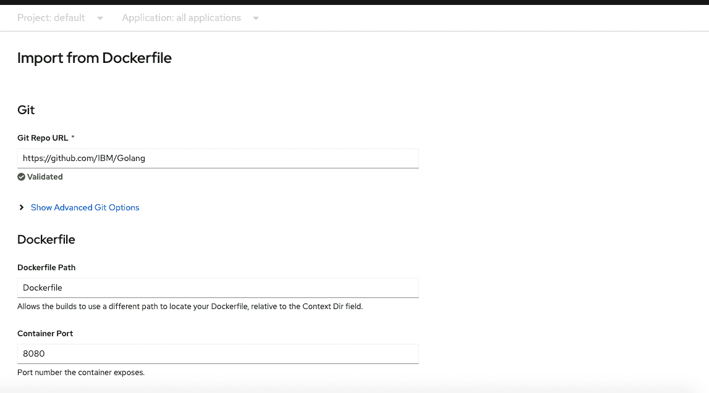
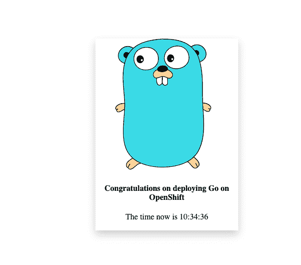

# 在 OpenShift 上部署使用 Go 的简单网站

> 原文：[`developer.ibm.com/zh/tutorials/deploy-a-simple-website-using-go-on-openshift/`](https://developer.ibm.com/zh/tutorials/deploy-a-simple-website-using-go-on-openshift/)

Go 通常也称为 Golang，它是目前很受欢迎的一种开源编程语言，之所以如此受欢迎，是因为它能够在大型分布式服务器上运行，并且可以更好地替代 C++ 和 Java。通过使用 Go，您可以创建聊天室、大型分布式网站以及许多其他类型的应用程序，而不会遇到像 C++ 中那样难以调试的错误。同样，Go 非常易于学习，因为它在语法和概念方面与 C++ 和 Java 相当接近，并且是由大型社区进行维护。

Kubernetes 是部署可伸缩应用程序的老式方法之一。但是，使用 Red Hat OpenShift，您可以不依赖命令行就可以轻松部署应用程序。本教程演示了如何构建一个简单的 Go 网站并将其部署在 OpenShift 集群上。

## 前提条件

*   代码编辑器（如 [Visual Studio Code](https://code.visualstudio.com/)、[Sublime](https://www.sublimetext.com/) 等）
*   [IBM Cloud](https://cloud.ibm.com?cm_sp=ibmdev-_-developer-tutorials-_-cloudreg) 帐户
*   [Red Hat OpenShift 集群](https://cloud.ibm.com/docs/openshift?cm_sp=ibmdev-_-developer-tutorials-_-cloudreg)

可选：

*   [GitHub](https://github.com/) 帐户
*   [OpenShift 命令行界面](https://cloud.ibm.com/docs/openshift?topic=openshift-openshift-cli&cm_sp=ibmdev-_-developer-tutorials-_-cloudreg) (oc)

本教程还假定您能熟练使用 [Docker](https://developer.ibm.com/zh/components/docker/) 和编写 Dockerfile，因为在本教程中创建的网站要依赖于 Dockerfile，并假定您已创建 OpenShift 集群。

## 预估时间

完成本教程大约需要 10 到 15 分钟。

## 开发 Web 服务器

本教程使用 Go 中的 `net/http` 库来创建 Web 服务器，您将在此服务器中映射网页（最终 URL 可能与页面名称有所不同）。Go 中有许多库可用于 Web 开发，但是 `net/http` 库是最容易上手的。

Go 文件是从定义包开始；它会引用文件名。例如，`main.go` 具有 `main` 包，如以下截屏所示。您可使用 `html/template` 库在浏览器中呈现页面，并使用 `fmt` 库（类似于 C++ 中的 `cout` 以及 Python 中的 `println`）在控制台中打印输出页面。



您可创建主函数并定义模板变量，以将 HTML 文件保存在模板文件夹中。变量将使用语法 `x:= y` 进行初始化。

使用以下代码片段，告知 Go 您的 HTML 文件的确切位置，并要求 Go 解析该 HTML 文件（注意，使用的是相对路径）。您可将其包装在 `template.Must()` 调用中，该调用可处理所有错误并在出现致命错误时暂停。

```
func main() {

    templates := template.Must(template.ParseGlob("template/*")) 
```

接下来，为 Go 创建一个句柄，以查找包含 CSS 文件的静态文件夹，如以下代码片段所示。您的 HTML 随附了 Go 在运行应用程序时需要提供的 CSS。让 Go 创建一个用于在静态目录中执行查找的句柄，然后 Go 使用 `"/static/"` 作为 URL（HTML 在查找 CSS 和其他文件时可以引用此 URL）。最终的 URL 可以是任何内容。

```
 http.Handle("/static/",
       http.StripPrefix("/static/",
          http.FileServer(http.Dir("static")))) 
```

Go 首先使用 `http.FileServer()` 在 `"static"` 相对目录中执行查找，然后将其与您选择的 URL 进行匹配，如 `http.Handle("/static/")` 所示。引用 CSS 文件时，需要使用此 URL。因此，在服务器启动后，您的 HTML 代码为 `<link rel="stylesheet" href="/static/stylesheet/...">`。务必要注意，`http.Handle` 中的 URL 可以是您想要的任何内容（只要保持一致即可）。

到目前为止，您已经获得了 HTML 页面并链接了 CSS 文件的目录。接下来，为 URL 编写句柄函数。`http.HandleFunc` 采用一个 URL 路径和一个函数，此函数采用一个 `responseWriter` 和一个指向 HTTP 请求的指针（类似于 C++）。与 C++ 和 Java 一样，Go 也允许将匿名函数作为参数传递。使用以下代码片段，您可以为主页创建句柄函数。此方法采用 URL 路径 `"/"` 和一个函数（此函数采用一个响应编写器和一个 HTTP 请求）。如果出现错误，那么将显示内部服务器错误消息。

```
 http.HandleFunc("/" , func(w http.ResponseWriter, r *http.Request) {

              if err := templates.ExecuteTemplate(w, "homepage.html", nil); err != nil {
          http.Error(w, err.Error(), http.StatusInternalServerError)
       }
    }) 
```

最后，打印输出正在侦听请求的 Web 服务器，并将网站链接到端口号 8080。

```
 fmt.Println("Listening");
    fmt.Println(http.ListenAndServe(":8080", nil));
 } 
```

用于构建 Web 服务器的步骤到此结束。为了更好地了解所编写的 Dockerfile，可参考[适用于 Go 的 Docker 官方镜像](https://hub.docker.com/_/golang)。

可以使用以下两种方法在 OpenShift 上部署网站：Web 控制台或 OpenShift 命令行界面 (oc)。本教程介绍了这两种方法。

先注册并登录 [IBM Cloud](https://cloud.ibm.com?cm_sp=ibmdev-_-developer-tutorials-_-cloudreg) 帐户。

## 使用 OpenShift Web 控制台部署 Go 网站

### 第 1 步：访问您的 OpenShift 集群

通过单击 **OpenShift web console** 按钮，登录到您的 OpenShift 集群。



### 第 2 步：将网站添加到集群中

切换到 Developer 视图并单击 **+Add** 按钮。接下来，在 Add 窗格中，选择 **From Dockerfile**。



将 `https://github.com/IBM/Golang` 插入 **Git Repo URL** 字段中，然后选择公开到您的应用程序的路由。



单击 **Create** 按钮。

### 第 3 步：启动网站

在 Developer 菜单中，单击 **Topology**。完成构建后，您将看到 pod 已启动。单击箭头图标以打开指向 `golang-ex` 网站的外部链接。


## 使用 OpenShift 命令行界面部署 Go 网站

### 第 1 步：登录到集群

使用以下命令登录到您的集群：

```
oc login 
```

填写您的集群凭证。

### 第 2 步：下载代码并部署网站

将代码从 `https://github.com/IBM/Golang` 存储库下载到您的计算机上。

输入以下命令以部署和公开网站：

```
cd Golang
oc new-app .--name=golang-ex
oc expose svc/golang-ex 
```

### 第 3 步：获取路由

要获取已公开网站的路由，可以输入以下命令：

```
oc get route golang-ex 
```

复制该网站的 URL 并将其粘贴到浏览器中。

如果您正确遵循了前面的操作说明，那么将显示一个祝贺页面。



## 结束语

恭喜！您已在 OpenShift 集群上成功部署了第一个 Go 网站。

本文翻译自：[Deploy a simple website using Go on OpenShift](https://developer.ibm.com/tutorials/deploy-a-simple-website-using-go-on-openshift/)（2020-08-28）