# 部署 ChatOps 解决方案以创建事件

> 原文：[`developer.ibm.com/zh/tutorials/deploy-a-chatops-solution-for-creating-events-and-incidents/`](https://developer.ibm.com/zh/tutorials/deploy-a-chatops-solution-for-creating-events-and-incidents/)

ChatOps 是协作平台中的开发工具、运营工具和流程集成，通过它团队可以高效地进行沟通，并轻松地管理工作流程。

ChatOps 允许主题专家（运营人员、SRE、DevOps 工程师和开发者）相互之间进行即时协作，以及通过机器人与其他应用程序进行即时协作。进一步了解 [ChatOps 和 IBM Garage 实践中的虚拟作战指挥室](https://www.ibm.com/garage/method/practices/manage/virtual-war-room)。在本教程中，ChatOps 将帮助团队更快地解决问题（缩短“平均修复时间”）。

IBM Cloud Event Management 使您可以在出现操作问题时管理事件。此组件通过以下几种方式供应：

*   独立的 SaaS 服务
*   IBM Cloud 服务
*   作为 Cloud Pak for Multicloud Management 的监控模块的一部分。

Cloud Event Management 随附 ChatOps 集成，可用于将事件转发到 Slack，但不能从 Slack 创建事件。通过本教程，您可以在 Slack 通道内创建事件，从而扩展 Cloud Event Management 并开发完整的 ChatOps 解决方案。

Cloud Event Management Slack 机器人界面如下所示：

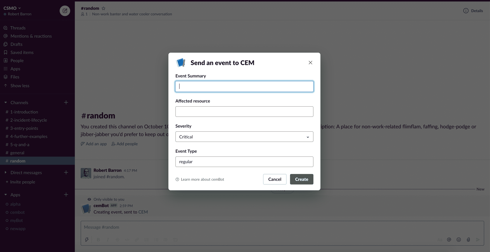

通过使用 Slack 机器人界面创建的事件在 Cloud Event Management UI 中如下所示：

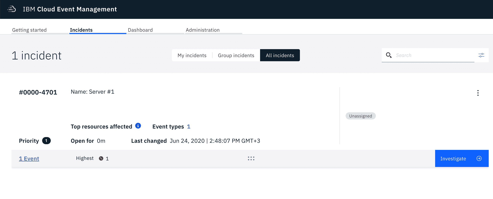

## 学习目标

在本教程中，您将学习如何：

*   在 Cloud Event Management 中创建传入的 Webhook 集成
*   创建将与该 webhook 集成的 IBM Cloud Functions
*   使用 IBM Cloud Functions 将 Slack 工作空间与 Cloud Event Management 集成。

## 前提条件

*   一个 [IBM Cloud 帐户](https://cloud.ibm.com/registration?cm_sp=ibmdev-_-developer-tutorials-_-cloudreg)。
*   对 Cloud Event Management 实例的管理员访问权限。
    *   [IBM Cloud](https://www.ibm.com/cn-zh/cloud/event-management) 上的 Cloud Event Management
    *   [IBM Cloud Pak for Multicloud Management 中的监控模块](https://www.ibm.com/support/knowledgecenter/SSFC4F_1.3.0/install/install_pm.html)
*   [对 Slack 工作空间的管理员访问权限和管理权限](https://slack.com/help/articles/206845317-Create-a-Slack-workspace)

## 预估时间

安装并配置必备软件后，完成本教程大约需要 30 分钟。

## 架构

下图显示了用于创建 Cloud Event Management 事件的 Slack 机器人的工作流程。

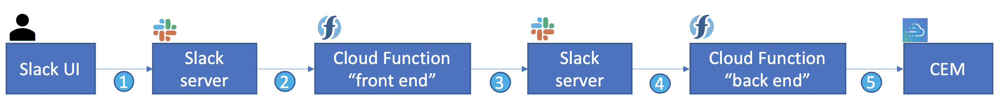

1.  用户在 Slack 通道中执行指令行 `/cemcreate`。
2.  Slack 服务器调用 IBM Cloud Function 以创建对话框屏幕。
3.  用户单击“submit”，数据将被返回到 Slack 服务器。
4.  Slack 服务器调用 IBM Cloud Function 以处理返回的数据。
5.  Cloud Function 在 Cloud Event Management 中创建事件。

## 步骤

### 创建 Cloud Event Management 集成

1.  登录到您的 IBM Cloud Event Management 实例。 单击 Administration 选项卡。

    对于部署在 IBM Cloud 上的实例，此选项卡的 URL 可能为：[`console.us-south.cloudeventmanagement.cloud.ibm.com/administration`](https://console.us-south.cloudeventmanagement.cloud.ibm.com/administration?cm_sp=ibmdev-_-developer-tutorials-_-cloudreg)。

2.  单击 **Integrations** 六边形。

3.  单击 **New Integration** 按钮以查看可能的集成列表。

4.  确保您在 **Incoming** 选项卡上。向下滚动到 **Webhook** 集成，然后单击 **Configure**。

    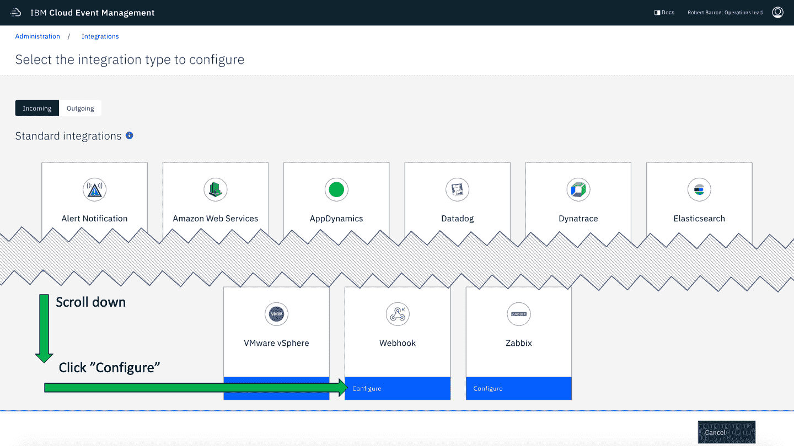

5.  为您的 webhook 指定一个名称。 例如，使用 `CEM-ChatOps`。

6.  在 **Example incoming request** 框中，复制并粘贴以下 JSON 样本：

```
{
  "Severity": "Critical",
  "Summary": "This is my message",
  "ResourceName": "ServerA",
  "EventType": "standard"
} 
```

*   用以下值填写必填的 **Event attributes**：

    *   Severity : `Severity`
    *   Summary : `Summary`
    *   Resource Name : `ResourceName`
    *   Event Type : `EventType`
*   复制并记录 Webhook 端点的 **URL**。

*   确保将 **Enable** 开关设置为 On。

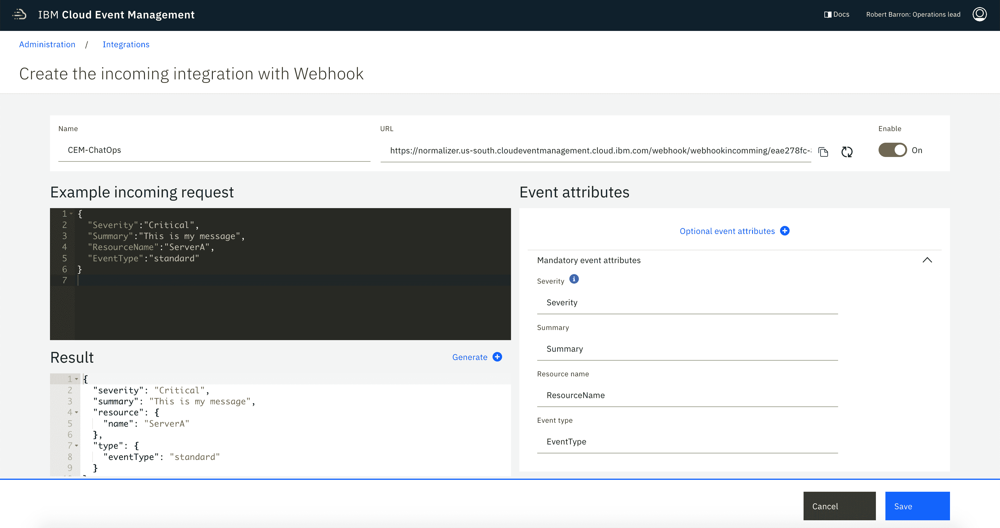

*   单击 **Save**。

现在，您就可以正常使用传入的 Webhook 集成了。

### 创建并测试后端 Cloud Function

1.  在浏览器中打开一个新标签页，然后导航至 [IBM Cloud Functions](https://cloud.ibm.com/functions?cm_sp=ibmdev-_-developer-tutorials-_-cloudreg)。

2.  单击 **Log in to IBM Cloud**，然后登录到您的 IBM Cloud 帐户。您将被重定向到 IBM Cloud Functions 主页。如果未重定向，转到 [`cloud.ibm.com/functions/`](https://cloud.ibm.com/functions?cm_sp=ibmdev-_-developer-tutorials-_-cloudreg)。

3.  单击 **Start Creating**。如果这是您第一次使用 IBM Cloud，可能会收到一条消息，要求您创建名称空间。

4.  选择 **Action**。 为您的操作指定一个名称。 例如，`cem-chatops-backend`。然后，选择 Python 3.x 运行时。将其余字段保留为默认选项。

    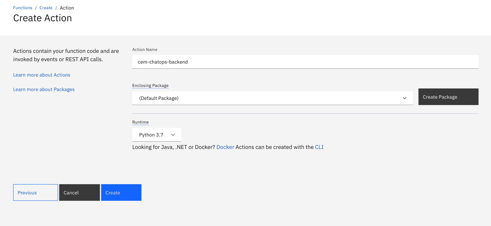

5.  单击 **Create**。

    您的新功能已准备就绪。

    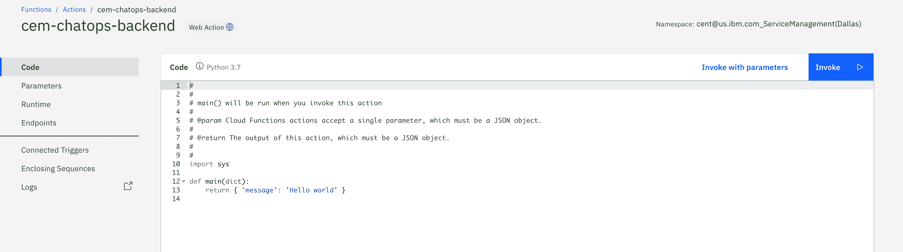

6.  单击左侧导航栏中的 **Parameters** 选项卡。单击 **Add parameter**，然后为函数添加一个名为 `cem_url` 的参数。 对于参数值，指定为前面记录的 Cloud Event Management Webhook URL。

    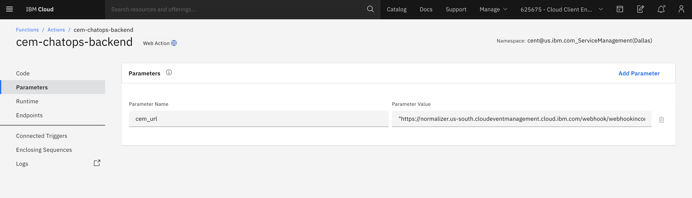

7.  移动到 **Endpoints** 选项卡，然后激活 **Enable as Web Action** 选项。这将使 Slack 能够访问 Cloud Function。

8.  记录 webhook URL。您很快将用到这个 URL。

    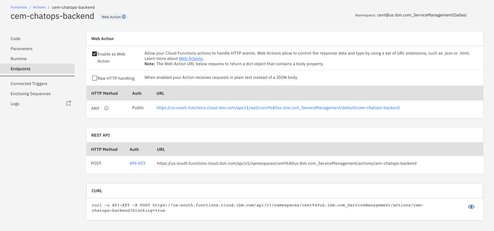

9.  返回到 **Code** 选项卡。然后，将以下代码复制并粘贴到该函数中。

    ```
     #
     # This function will be triggered by Slack
     #

     import sys, json, requests

     def main(dict):

         print("function begins")
         print(dict)

         if 'challenge' in dict.keys():
             return {"challenge" : dict['challenge']}

         if 'payload' not in dict.keys():
             return {"message":"Invalid message, payload not found"}

         d = dict['payload']
         if 'type' not in d.keys() or 'callback_id' not in d.keys():
             return {'message':"Invalid message, payload missing fields"}

         if d['type'] == 'dialog_submission' and d['callback_id'] == 'CreateCEMIncident':
             print ("create_cem_event begins")

             url = dict['cem_url']
             headers = {'Content-Type': 'application/json'}

             payload ={
                 "severity": d['submission']['severity'],
                 "summary":  d['submission']['summary'],
                 "resource": d['submission']['resource'],
                 "type":     d['submission']['type']
             }

             response = requests.post(url, data=json.dumps(payload), headers=headers)

             responseJson = json.loads(response.text)
             print (responseJson)

             print ("create_cem_event ends")

             return {responseJson}

         else:
             return {'message':'No work done'} 
    ```

10.  要测试您的后端 Cloud Function，可从命令行运行以下命令（将 `webhookurl` 替换为相关值）：

    ```
    bash
    `curl -X POST -d '{"payload":{"type":"dialog_submission","callback_id":"CreateCEMIncident","submission":{"severity":"Critical","summary":"My test message","resource":"Server","type":"standard"}}}' <webhookurl>.json` 
    ```

    您应该会看到类似这样的响应：

    ```
    json
    {
      "deduplicationKey": "609938c8259f1fbf8343a75611e11cbc",
      "eventid": "41e48940-b3cf-11ea-83a2-371d430da290"
    } 
    ```

    验证后端 Cloud Function 是否正常工作的另一种方法是在 Cloud Event Management 中查看事件列表。在托管在 IBM 美国南部的 Cloud Event Management 的 IBM Cloud SaaS 实例中，链接将为 [`console.us-south.cloudeventmanagement.cloud.ibm.com/incident-queue/all`](https://console.us-south.cloudeventmanagement.cloud.ibm.com/incident-queue/all?cm_sp=ibmdev-_-developer-tutorials-_-cloudreg)。如果在 Cloud Pak for Multicloud Management 中托管 Cloud Event Management，那么您将使用自己的 URL。

### 创建前端 Cloud Function

重复上述步骤，创建一个名为 `cem-chatops-frontend` 的 Cloud Function。

生成并记录该函数的 **Endpoint**。

创建两个参数：`cemUI` 和 `slackToken`。暂时将这两个参数留空 (“”)。

将以下代码粘贴到此前端 Cloud Function 的 **Code** 选项卡中：

```
 #
    #

    # This will create a dialog.When the dialog is filled, the data will be sent to the back-end function.

import sys
import os, json, requests

def main(dict):

    print (dict)

    if 'warmup' in dict.keys():
        return { "warmup": 1}

    if 'payload' in dict.keys():
        return {
            "response_type": "ephemeral",
            "replace_original": False,
            "text":  "Command recieved with id " + dict['trigger_id']
        }        
    else:
        openDialog(dict)
        return {
            "icon_emoji": ":csmo:",
            "response_type": "ephemeral",
            "replace_original": False,
            "text":  "Creating event, sent to <" + dict['cemUI'] + "|CEM>"
        }        

def openDialog(dict):

    url = "https://slack.com/api/dialog.open"

    payload={
        "trigger_id": dict["trigger_id"],
        "dialog": {
            "callback_id": "CreateCEMIncident",
            "title": "Send an event to CEM",
            "submit_label": "Create",
            "state": "Limo",
            "elements": [
            {
              "type": "text",
              "label": "Event Summary",
              "name": "summary"
            },
            {
              "type": "text",
              "label": "Affected resource",
              "name": "resource"

            },            {
              "type": "text",
              "label": "Affected resource type",
              "name": "resourceType",
              "optional" : True
            },            {
                "label":"Severity",
                "type":"select",
                "name":"severity",
                "value":"Critical",
                "options" : [
                    {
                        "label" : "Critical",
                        "value" : "Critical"
                    },
                    {
                        "label" : "Major",
                        "value" : "Major"
                    },
                    {
                        "label" : "Minor",
                        "value" : "Minor"
                    },
                    {
                        "label" : "Warning",
                        "value" : "Warning"
                    },
                    {
                        "label" : "Information",
                        "value" : "Information"
                    },
                    {
                        "label" : "Indeterminate",
                        "value" : "Indeterminate"
                    }
                ]
            },
            {
                "label" : "Event Type",
                "name"  : "type",
                "value" : "regular",
                "type"  : "text"
            }
        ]
     }
    }

    auth_token = 'Bearer ' + dict['slackToken']
    response = requests.post(url, data=json.dumps(payload), headers={'Content-Type': 'application/json;charset=utf-8', 'Authorization': auth_token })
    print(response.text) #TEXT/HTML 
```

### 创建一个 Slack 机器人并与 Cloud Functions 集成

1.  登录到您的 [Slack 工作空间](https://slack.com/intl/en-cn/)。输入您的工作空间 URL 名称，然后按 Enter。

2.  转到 [api.slack.com](https://api.slack.com/)，然后单击 **Start Building** 按钮。

3.  为您的 Slack 机器人命名

    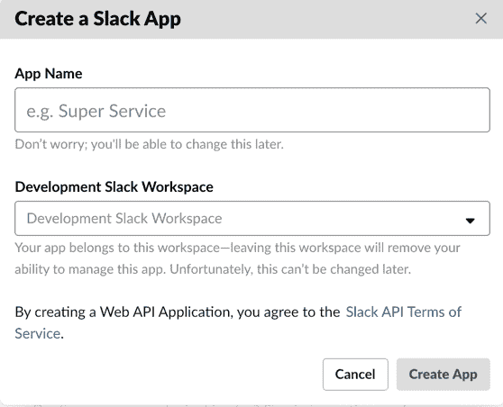

4.  在左侧导航栏中，转到 **Interactivity & Shortcuts** 选项卡，将开关设置为 **On**，并填写后端 Cloud Function 的端点 URL，然后单击 **Save Changes**。

    

5.  转到 **Slash Commands** 选项卡，然后单击 **Create New Command** 按钮。

    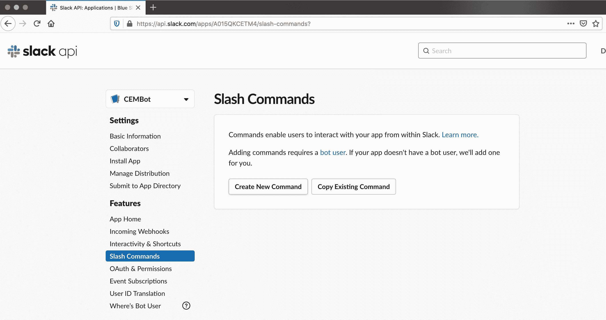

6.  填写 **Command Name** 和 **Short Description**。对于 **Request URL**，填写前端 Cloud Function 的端点 URL。在这种情况下，必须向端点名称添加 `.json`。单击 **Save**。

    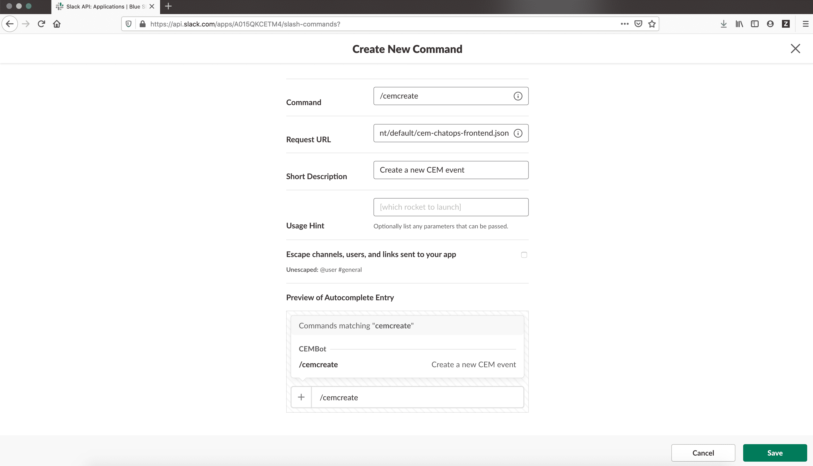

7.  转到 **Install App** 选项卡，然后单击 **Install App to Workspace** 按钮。

    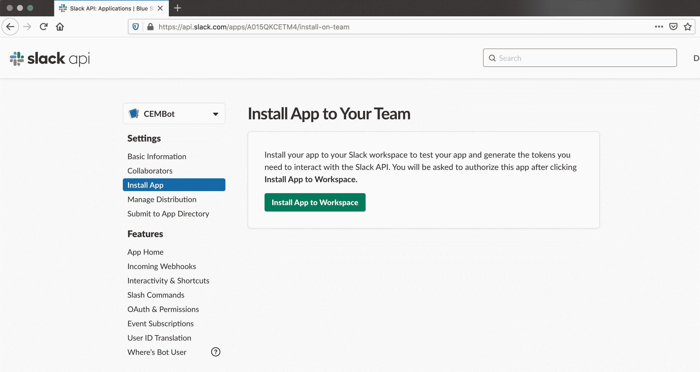

8.  在显示的对话框中，单击 **Allow** 按钮以允许新的 Slack 机器人具有相关权限。

    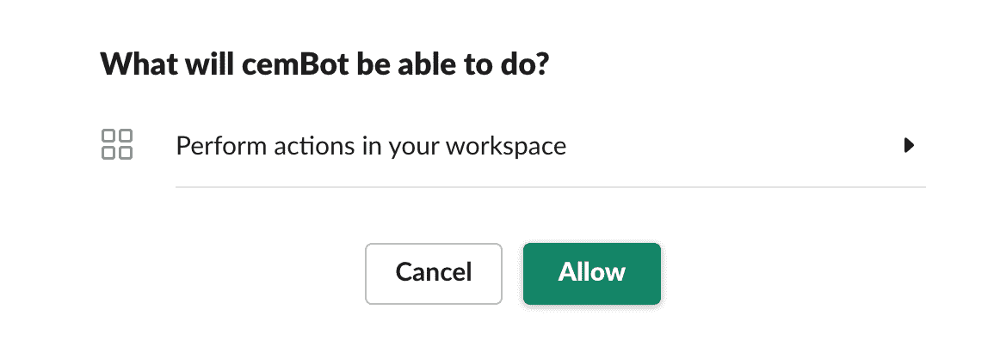

9.  记录将机器人安装到 Slack 工作空间后收到的访问令牌。

    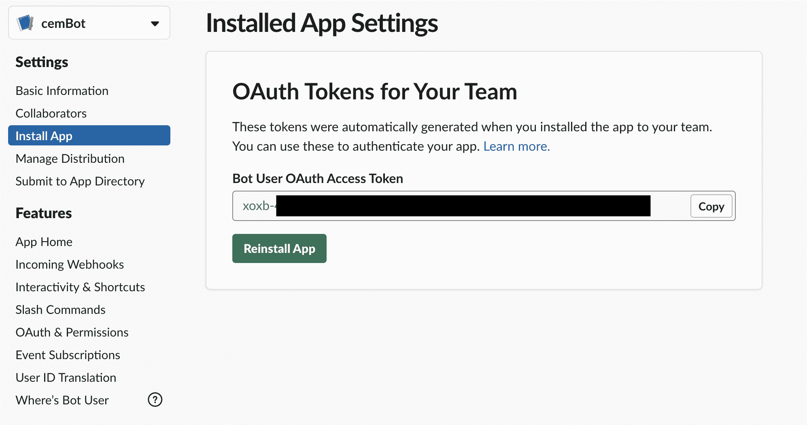

10.  返回到前端 Cloud Function (`cem-chatops-frontend`)，并更新参数：

    *   使用您在上一步中收到的值更新 **slackToken**。 *使用 Cloud Event Management 事件仪表板的 URL 地址更新 **cemUI**。对于 SaaS 版本的 Cloud Event Management，该值为 [`console.us-south.cloudeventmanagement.cloud.ibm.com/incident-queue`](https://console.us-south.cloudeventmanagement.cloud.ibm.com/incident-queue?cm_sp=ibmdev-_-developer-tutorials-_-cloudreg)

    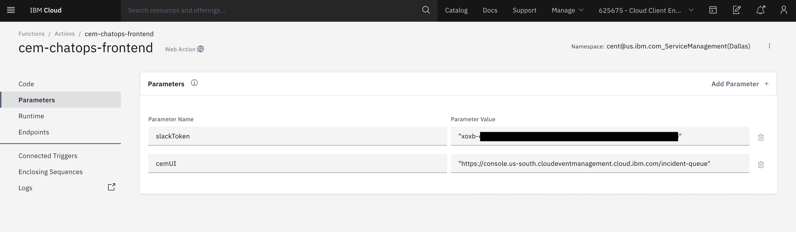

### 创建 Cloud Event Management 事件

1.  转到 Slack 工作空间中的任何通道，然后运行您定义的指令行来创建 Cloud Event Management 事件：`/cemcreate`

2.  在显示的对话框中，填写相关值。

    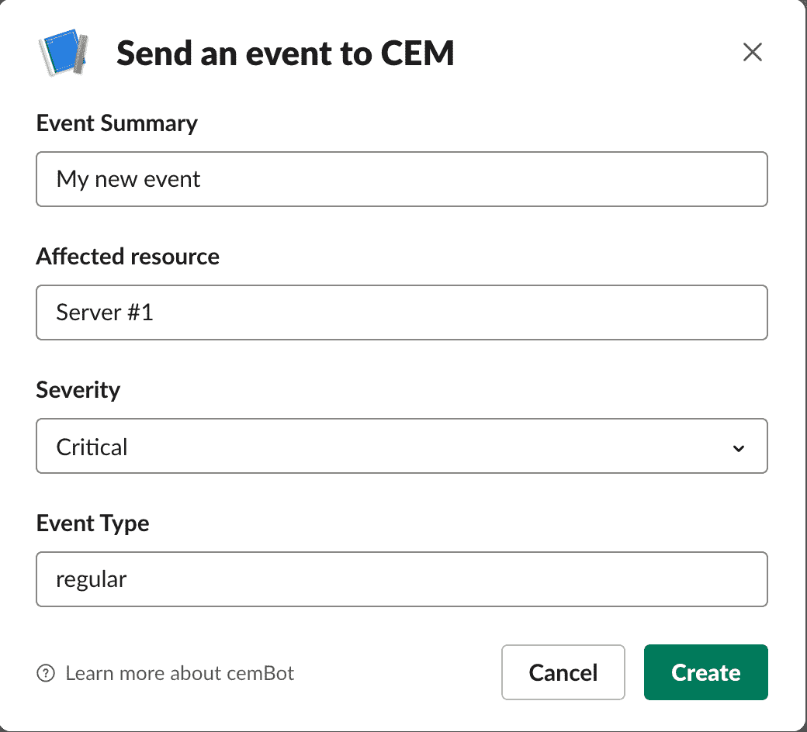

3.  单击 **Create**。您的 Slack 通道中显示以下响应：

    

4.  单击该响应中的 **CEM** 链接。这将启动 Cloud Event Management UI，以向您显示事件列表，包括您的新事件！

## 结束语

在本教程中，您学习了如何使用 IBM Cloud Functions 将 Slack 机器人与 IBM Cloud Event Management 集成。您可以在 IBM Cloud Garage 中进一步了解如何在[服务管理架构](https://www.ibm.com/cloud/architecture/architectures/serviceManagementArchitecture) 中实施 [ChatOps](https://www.ibm.com/garage/method/practices/manage/chatops)。

想要探索 ChatOps 之外的功能？查阅 [AIOps](https://www.ibm.com/cloud/learn/aiops)，通过它您可以将人工智能应用于 IT 运营和事件，并了解如何在下一个 ChatOps 解决方案中融入 [IBM Watson AIOps](https://www.ibm.com/watson/aiops)。

本文翻译自：[Deploy a ChatOps solution for creating events and incidents](https://developer.ibm.com/components/cloud-pak-for-multicloud/tutorials/deploy-a-chatops-solution-for-creating-events-and-incidents)（2020-07-09）