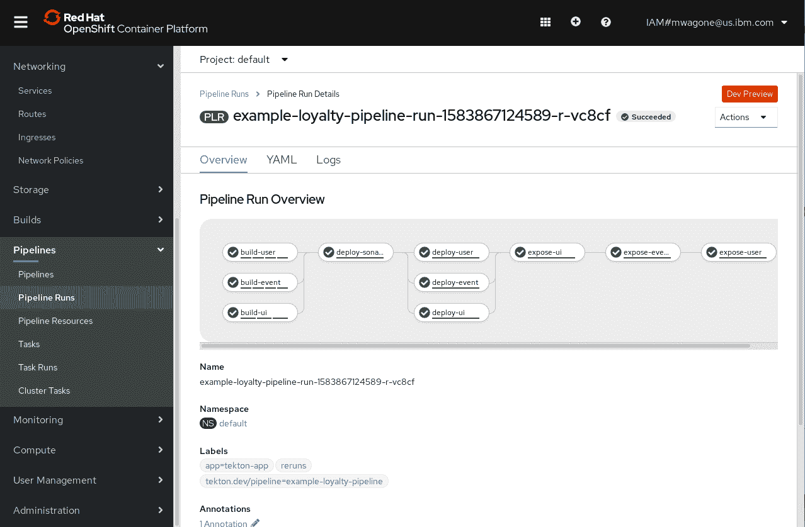
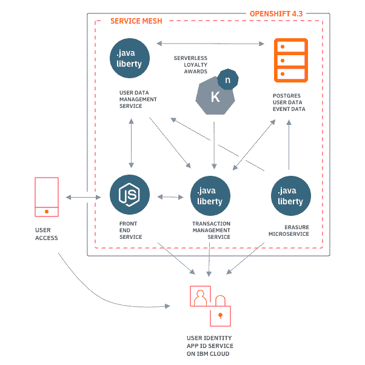
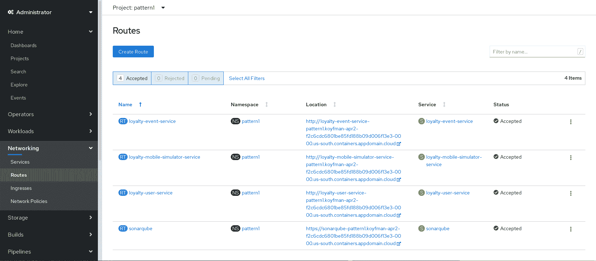
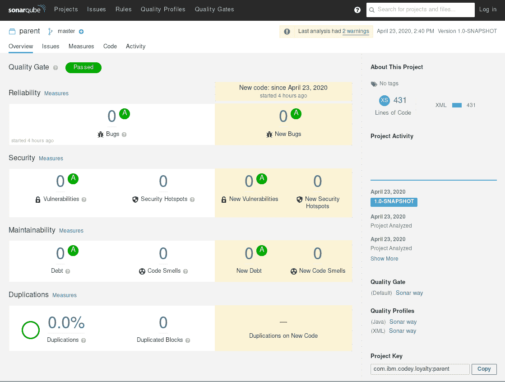
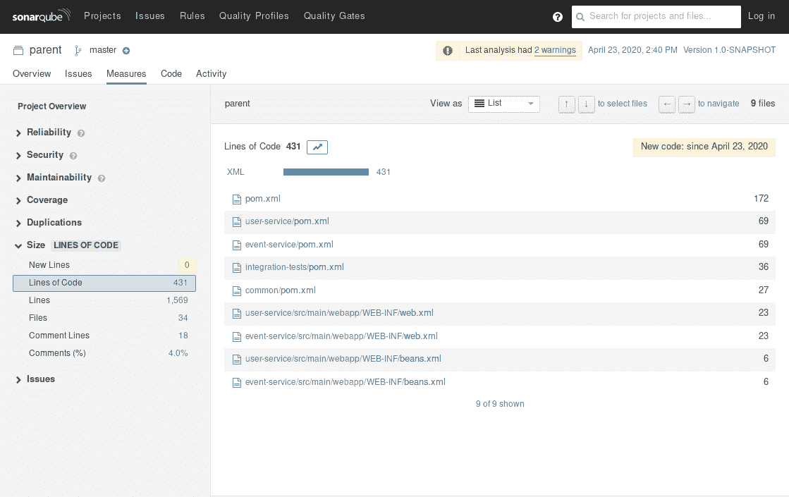
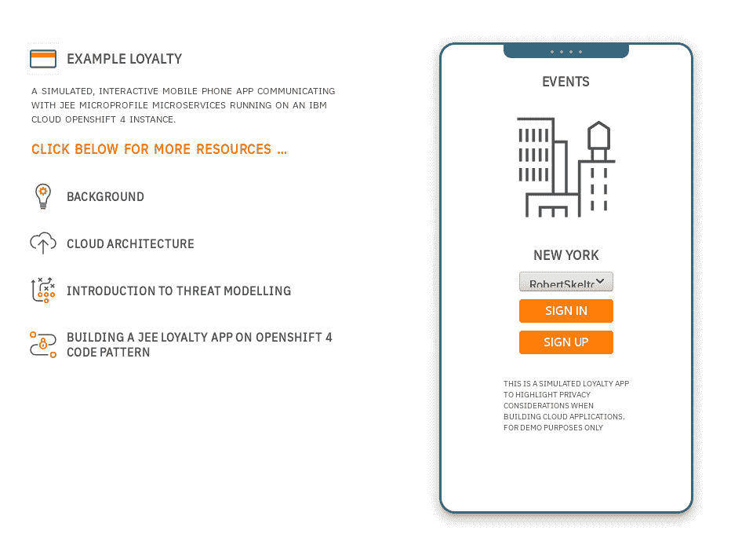

# 构建 Tekton Pipeline 以将移动应用程序后端部署到 OpenShift 4

> 原文：[`developer.ibm.com/zh/tutorials/tekton-pipeline-deploy-a-mobile-app-backend-openshift-4/`](https://developer.ibm.com/zh/tutorials/tekton-pipeline-deploy-a-mobile-app-backend-openshift-4/)

现在，[OpenShift 4.3 可以在 IBM Cloud 上使用](https://developer.ibm.com/zh/articles/intro-to-openshift-4/)，它提供了一些令人兴奋且备受关注的新功能。最让我激动的一项新功能是可以在 OpenShift Web 控制台中查看 Tekton Pipeline 资源。

虽然可以继续使用 [Tekton 仪表板](https://developer.ibm.com/blogs/why-nows-a-great-time-to-use-the-tekton-dashboard/)来查看 Tekton 资源状况，但 OpenShift 4 中提供的这项新功能可以在用户界面 (UI) 中查看 Tekton 资源状况，如以下截屏所示。



为了演示 OpenShift 上 Tekton 的一些功能，本教程部署了 Example Bank 实例，这是一个示例客户信用卡应用程序。本教程描述了如何将[通过移动银行应用程序后端来关注数据隐私](https://developer.ibm.com/zh/patterns/privacy-backend-loyalty-app-openshift-4/) Code Pattern 的手动部署转换到 Tekton Pipeline。

通过探索 Example Bank 应用程序，了解如何使用 OpenShift 构建安全的公共云应用程序

[阅读本系列的其余教程](https://developer.ibm.com/zh/blogs/build-secure-applications-with-openshift-4-public-cloud/#how-we-built-the-credit-card-application)

本教程中的示例使用了 [Red Hat® OpenShift® on IBM Cloud™](https://www.ibm.com/cn-zh/cloud/openshift)。

## 前提条件

要完成本 Tekton OpenShift 教程，您需要以下环境：

*   一个 Red Hat OpenShift on IBM Cloud 集群（配置此集群是为了设置流水线）。如果需要创建一个集群，那么可以使用 [IBM Cloud Web 控制台](https://cloud.ibm.com/kubernetes/catalog/cluster/create?platformType=openshift&cm_sp=ibmdev-_-developer-tutorials-_-cloudreg)或 `ibmcloud` CLI。如果使用后者，那么本[教程](https://cloud.ibm.com/docs/openshift?topic=openshift-openshift_tutorial#openshift_create_cluster&cm_sp=ibmdev-_-developer-tutorials-_-cloudreg)可能会派上用场。**注意**：本教程与 Cloud Pak for Applications 不兼容。您需要一个空集群。

*   包括 `kubectl` 和 `oc` 在内的几个 CLI（可在[此处](https://www.okd.io/download.html)找到）。

*   在开始本教程之前，需要先完成主 Code Pattern 中的几个步骤。完成[前提条件](https://github.com/IBM/example-bank#prerequisites)和[部署](https://github.com/IBM/example-bank#deployment)部分，以在 `example-bank` 项目中设置 App ID 实例、PostgreSQL 数据库和完整的 Kubernetes 密钥。

## 预估时间

在满足前提条件后，完成本教程大约需要 30 分钟，其中包括运行流水线所需的时间。

## 了解 Example Bank 应用程序

Example Bank 是一个示例应用程序，旨在展示如何奖励应用程序的用户。它源于在多个会议上实施的项目（大家还记得那些日子吗？），用于参与者注册和分发收益。



本教程将通过流水线来部署 Example Bank 的后端。它由几个微服务组成，包括两个分别用于跟踪事件和用户的 Java 服务、一个用于删除用户数据的夜间服务、一个 Node.js 前端以及一个用于跟踪所有这些信息的 PostgresSQL 实例。

## 用于设置流水线的步骤

首先，需要安装 Tekton Pipelines 本身。然后，您可以应用运行特定于此练习的流水线所需的所有资源。

### 1\. 定位集群

登录到您的 IBM Cloud 帐户，并导航至 OpenShift 集群的概述页面。单击右上角的 **OpenShift web console** 按钮。在 Web 控制台上，单击右上角的菜单（标签包含您的电子邮件地址），然后选择 **Copy Login Command**。将该命令粘贴到本地控制台窗口中。它应类似于以下示例：

```
oc login https://c100-e.us-east.containers.cloud.ibm.com:XXXXX --token=XXXXXXXXXXXXXXXXXXXXXXXXXX 
```

### 2\. 安装 Tekton

接下来是安装 Tekton。从 OpenShift Web 控制台左侧的导航菜单中，选择 **Operators** –> **Operators Hub**，然后搜索 **OpenShift Pipelines Operator**。单击此图块，然后单击随后的 **Install** 按钮。保留 **Create Operator Subscription** 页面上的默认设置，然后单击 **Subscribe**。

### 3\. 创建新项目

返回到本地控制台，通过创建一个新项目来将工具与应用程序分开：

```
oc new-project bank-infra 
```

### 4\. 创建服务帐户

为确保流水线具有将镜像存储在本地 OpenShift 注册表的相应权限，您需要创建一个服务帐户。在本教程中将其称为“pipeline”。

```
oc create serviceaccount pipeline
oc adm policy add-scc-to-user privileged -z pipeline
oc adm policy add-role-to-user edit -z pipeline
oc policy add-role-to-user edit system:serviceaccount:bank-infra:pipeline -n example-bank 
```

最后一条命令会向该服务帐户授予 `example-bank` 项目的访问权限。您应该已在满足前提条件的过程中创建了该项目。

### 5\. 安装任务

从本质上讲，Tekton Pipeline 是一系列单独的任务。本教程将使用多个任务，但您可以通过克隆主 Code Pattern 存储库并定位 `pipelines/tasks` 文件夹来一次安装所有任务：

```
git clone https://github.com/IBM/example-bank
cd example-bank/pipeline
oc apply -f tasks 
```

### 6\. 创建流水线

流水线文件 (`example-bank-pipeline.yaml`) 将流水线的所有任务链接在一起，在此例中，任务包括：扫描代码、将代码构建到镜像中以及部署和公开这些镜像。

```
kubectl apply -f example-bank-pipeline.yaml 
```

## 威胁测试步骤

我提到过代码扫描吗？继续完成此次练习，进一步创建流水线，并通过包含名为 SonarQube 的应用程序来引入威胁测试。SonarQube 是用于检查代码库的开源软件。它支持多种语言。SonarQube 可以报告错误和安全漏洞，还可以报告其他方面的有用信息，例如代码覆盖率和单元测试。本教程使用 SonarQube 测试代码以发现漏洞。

### 1\. 部署 SonarQube 实例

存储库中还有一个文件描述了部署 SonarQube 所需的所有设置。**Deployment** 列出了 SonarQube 所需的所有卷和安装路径。另外，**Service** 和 **Route** 允许公开访问该应用程序。在一个文件中包含了以下所有信息：

```
oc apply -f sonarqube.yaml 
```

### 2\. 创建 PVC

您还需要一个持久卷声明。这样，流水线中的任务可以在一个公共位置中编写要相互共享的信息：

```
oc apply -f bank-pvc.yaml 
```

### 3\. 运行流水线

最后，借助漏洞扫描器，您可以使用 **PipelineRun** 文件运行忠诚度流水线：

```
oc create -f bank-pipelinerun.yaml 
```

每当需要重新扫描和/或重新部署代码库时，只需运行该命令即可。

## 结果

现在分享一下我们的劳动成果！SonarQube 具有自己的 Web 界面。要访问该界面，可在 OpenShift Web 控制台中导航至 `loyalty-infra` 项目。从左侧的菜单中，选择 **Networking**，然后选择 **Routes**：



选择 SonarQube 的 URL，并查看安装的统计信息：



全是绿色的！由于此处没有漏洞，因此可以通过单击来查看代码行的统计信息：



返回到 **Routes** 页面，您还可以找到新安装的 Example Bank 应用程序的用户界面 URL。对于 `loyalty-mobile-simulator-service`：



## 结束语

如您所见，Tekton Pipeline 的功能十分强大，它可以自动处理一些重要的工作负载。与镜像代码库位于同一集群中，这种云原生的持续部署方法可以进行无缝部署，而无需手动操作。利用 OpenShift 4.3 中的新功能，可以更轻松地了解 Tekton Pipeline 的情况。

在动手实践此示例之后，您可以探索如何在自己的安装中使用流水线！

## 后续步骤

利用以下内容中的开源代码和说明来了解在使用 OpenShift 4.3 构建安全的云应用程序时执行的步骤：

*   **博客文章**：[使用 OpenShift 4.3 在公共云上构建安全的微服务应用程序](https://developer.ibm.com/zh/blogs/build-secure-applications-with-openshift-4-public-cloud/)
*   **文章**：[OpenShift 4 简介](https://developer.ibm.com/zh/articles/intro-to-openshift-4/)
*   **文章**：[微服务架构环境中的威胁建模](https://developer.ibm.com/zh/articles/threat-modeling-microservices-openshift-4/)
*   **教程**：[玩转 OperatorHub](https://developer.ibm.com/tutorials/operator-hub-openshift-4-operators-ibm-cloud/)
*   **Code Pattern**：[通过移动银行应用程序后端来关注数据隐私](https://developer.ibm.com/zh/patterns/privacy-backend-loyalty-app-openshift-4/)
*   **Code Pattern**：[使用 OpenShift 服务网格的微服务](https://developer.ibm.com/patterns/zh/microservices-with-the-openshift-service-mesh/)
*   **教程**：[使用 OpenShift Serverless Operator 构建无服务器 Node.js 应用程序](https://developer.ibm.com/tutorials/build-serverless-nodejs-applications-with-the-openshift-serverless-operator/)

本文翻译自：[Build a Tekton Pipeline to deploy a mobile app back end to OpenShift 4](https://developer.ibm.com/tutorials/tekton-pipeline-deploy-a-mobile-app-backend-openshift-4/)（2020-08-04）