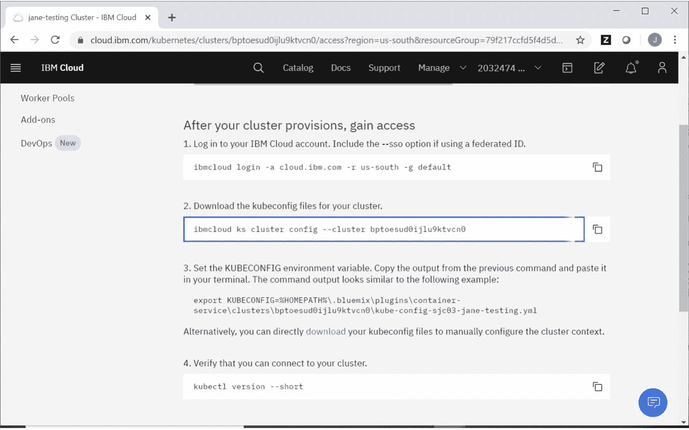
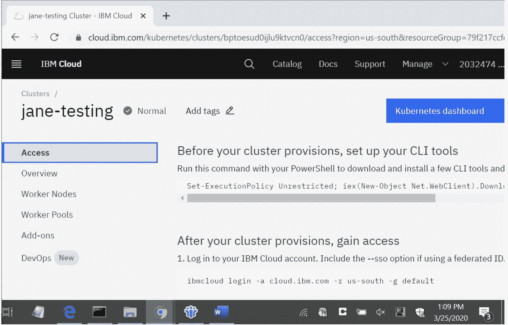
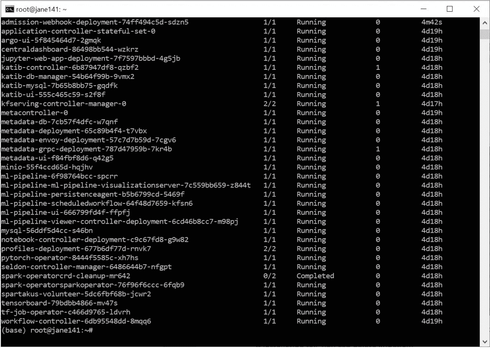
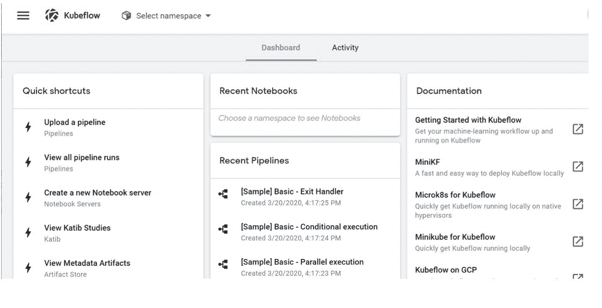

# IBM Cloud 上的 Kubeflow

> 原文：[`developer.ibm.com/zh/tutorials/kubeflow-in-ibm-cloud-public/`](https://developer.ibm.com/zh/tutorials/kubeflow-in-ibm-cloud-public/)

本教程是 [IBM Cloud 上的 Kubeflow 入门](https://developer.ibm.com/zh/series/learning-path-getting-started-with-kubeflow-ibm-cloud/)学习路径的一部分。

| 级别 | 主题 | 类型 |
| --- | --- | --- |
| **200** | **IBM Cloud 上的 Kubeflow** | 教程 |
| 201 | [在 IBM Cloud 上使用 Kubeflow 训练机器学习模型并使其为机器学习模型服务](https://developer.ibm.com/zh/tutorials/train-and-serve-a-machine-learning-model-using-kubeflow-in-ibm-cloud/) | 教程 |

## 简介

Kubeflow 是用于 Kubernetes 的机器学习工具包。这是一个开源项目，旨在使 Kubernetes 上的机器学习工作流程部署变得简单、可移植且可扩展。在本教程中，您将学习以下内容：

1.  在 IBM Cloud 中配置 Kubernetes 集群并安装所需的工具
2.  安装 Kubeflow
3.  启动 Kubeflow 中央仪表板

## 前提条件

要完成本教程，您需要：

*   至少具有 8 个内核、16 GB RAM 和 250 GB 存储空间的 Ubuntu 18 计算机
*   Ubuntu 计算机的 root 用户权限
*   一个 [IBM Cloud](https://cloud.ibm.com/registration?cm_sp=ibmdev-_-developer-tutorials-_-cloudreg) 帐户。

## 预估时间

完成本教程大约需要 30 分钟。

## 在 IBM Cloud 中配置 Kubernetes 集群并安装所需的工具

### 创建 Kubernetes 集群

1.  使用 Web 浏览器访问 [`cloud.ibm.com/kubernetes/overview`](https://cloud.ibm.com/kubernetes/overview?cm_sp=ibmdev-_-developer-tutorials-_-cloudreg)。

2.  登录到 IBM Cloud 后，单击概述页面中的 **Create a cluster**。

3.  在 Kubernetes Cluster 页面中，您可以选择套餐、环境、位置、集群元数据和默认工作程序池。建议您使用有意义的集群名称代替默认集群名称 (mycluster)。在右侧窗格中查看成本估算后，单击右下角的 **Create**。目前提供了一个免费的集群套餐（有效期为 30 天的集群，具有 1 个工作程序节点和有限的功能），非常适合用于测试和学习目的。下图展示了在创建集群后显示的集群设置和访问信息。



### 安装所需的工具

在配置集群之前，需要安装 IBM Cloud CLI 工具。在 Ubuntu 命令行中，输入：

```
curl -sL https://ibm.biz/idt-installer | bash 
```

可以在 [IBM Cloud 文档](https://cloud.ibm.com/docs/cli?topic=cloud-cli-getting-started)中找到更多详细信息。

### 访问集群

配置集群后，可以在 Ubuntu 计算机上使用在创建集群时显示的访问详细信息来访问该集群（参阅上图）。记住要使用您自己的访问信息。

```
ibmcloud login -a cloud.ibm.com -r us-south -g default -sso 
```

可能会为您提供一个 url，您可以使用此 url 来获取一次性身份验证密码。进行身份验证后，如果您有多个帐户，则系统会询问您要使用哪一个帐户。

```
ibmcloud ks cluster config --cluster bptoesud0ijlu9ktvcn0 
```

**注意：**如果您忘记了集群设置，则可以通过访问 [`cloud.ibm.com/kubernetes/clusters`](https://cloud.ibm.com/kubernetes/clusters?cm_sp=ibmdev-_-developer-tutorials-_-cloudreg) 在集群下单击 **Access** 来检索此信息。



要验证您的设置，可运行以下代码。

```
kubectl version --short 
```

以下代码显示了样本输出。

```
Client Version: v1.16.8
Server Version: v1.16.8+IKS 
```

### 设置 IBM Cloud 块存储

1.  在本地计算机上安装 Helm V3 客户端。可在[此处](https://helm.sh/docs/intro/install/)找到完整的操作说明。

    ```
     wget https://get.helm.sh/helm-v3.0.0-linux-amd64.tar.gz
     tar -zxvf helm-v3.0.0-linux-amd64.tar.gz
     mv linux-amd64/helm /usr/local/bin/helm 
    ```

2.  添加 IBM Cloud Helm Chart 代码库。

    ```
     helm repo add iks-charts https://icr.io/helm/iks-charts
     helm repo update
     helm install 1.6.0 iks-charts/ibmcloud-block-storage-plugin -n kube-system 
    ```

    以下代码显示了样本输出。

    ```
     NAME: 1.6.0
     LAST DEPLOYED: Fri Mar 20 11:38:21 2020
     NAMESPACE: kube-system
     STATUS: deployed
     REVISION: 1
     NOTES:
     Thank you for installing: ibmcloud-block-storage-plugin.   Your release is named: 1.6.0 
    ```

3.  将块存储设置为默认值。

    ```
     kubectl patch storageclass ibmc-block-gold -p '{"metadata": {"annotations":{"storageclass.kubernetes.io/is-default-class":"true"}}}'
     kubectl patch storageclass ibmc-file-bronze -p '{"metadata": {"annotations":{"storageclass.kubernetes.io/is-default-class":"false"}}}' 
    ```

## 安装 Kubeflow V1.0.1

我已在 /root 下创建了一个名为 kubeflow 的目录，当然，您可以使用自己喜欢的目录。下面是有关在 kubeflow 目录中安装 Kubeflow 1.0.1 的操作说明。

```
mkdir -p /root/kubeflow/v1.0.1
cd /root/kubeflow/v1.0.1
wget https://github.com/kubeflow/kfctl/releases/download/v1.0.1/kfctl_v1.0.1-0-gf3edb9b_linux.tar.gz
tar -xvf kfctl_v1.0.1-0-gf3edb9b_linux.tar.gz
export PATH=$PATH:/root/kubeflow/v1.0.1
export KF_NAME=my-kubeflow
export BASE_DIR=/root/kubeflow/v1.0.1
export KF_DIR=${BASE_DIR}/${KF_NAME}
# config file is IBM specific
export CONFIG_URI="https://raw.githubusercontent.com/kubeflow/manifests/master/kfdef/kfctl_ibm.yaml"

mkdir -p ${KF_DIR}
cd ${KF_DIR}
kfctl apply -V -f ${CONFIG_URI} 
```

完成安装后，运行以下命令来查看所有 Pod 是否都处于运行状态。

```
kubectl get pod -n kubeflow 
```

下图显示了样本输出。



注意，必须等到所有 Pod 都处于运行状态，才能继续执行下一步。如果安装失败，您可以删除 kubeflow。

```
cd ${KFAPP}
kfctl delete all --delete_storage 
```

## 启动 Kubeflow 中央仪表板

可以通过 istio-ingressgateway 服务来访问 Kubeflow 仪表板。要查看 istio-ingressgateway 服务的设置，可执行以下代码。

```
kubectl get -n istio-system svc/istio-ingressgateway 
```

以下代码显示了样本输出。

```
NAME                   TYPE           CLUSTER-IP       EXTERNAL-IP    PORT(S)                                                                                                                                      AGE
istio-ingressgateway   LoadBalancer   172.21.178.223   169.62.98.13   15020:31759/TCP,80:31380/TCP,443:31390/TCP,31400:31400/TCP,15029:30421/TCP,15030:31917/TCP,15031:30450/TCP,15032:32528/TCP,15443:30312/TCP   4d19h 
```

如果输出包含 `NodePort` TYPE（而不是 `LoadBalancer`）并且 `EXTERNAL-IP` 为空白，可运行以下命令将类型从 `NodePort` 更改为 `LoadBalancer`，然后进行保存。

```
kubectl edit -n istio-system svc/istio-ingressgateway 
```

再次运行以下命令以获取 EXTERNAL-IP。

```
kubectl get -n istio-system svc/istio-ingressgateway 
```

现在，您可以在 Web 浏览器中访问 Kubeflow 仪表板：`http://<EXTERNAL-IP>`。



## 结束语

在本教程中，我介绍了如何在 IBM Cloud 中安装 Kubeflow 以及如何启动 Kubeflow 仪表板。

本教程是 [IBM Cloud 上的 Kubeflow 入门](https://developer.ibm.com/zh/series/learning-path-getting-started-with-kubeflow-ibm-cloud/)学习路径的一部分。要继续完成此学习路径，可查看本系列中的下一个教程：[在 IBM Cloud 上使用 Kubeflow 训练机器学习模型并使其为机器学习模型服务](https://developer.ibm.com/zh/tutorials/train-and-serve-a-machine-learning-model-using-kubeflow-in-ibm-cloud)。

本文翻译自：[Kubeflow in IBM Cloud](https://developer.ibm.com/tutorials/kubeflow-in-ibm-cloud-public/)（2020-04-03）