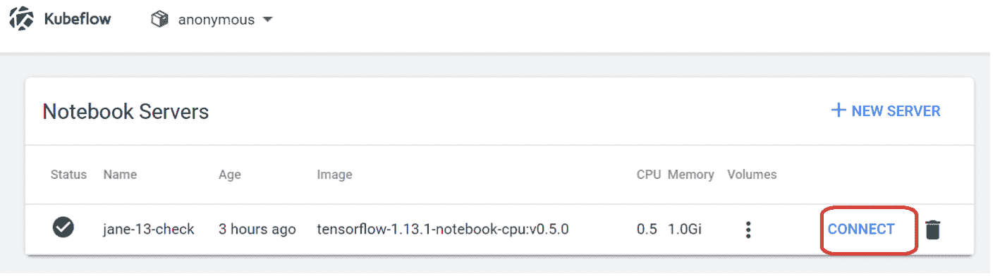

# 在 IBM Cloud 上使用 Kubeflow 训练机器学习模型并使其为机器学习模型服务

> 原文：[`developer.ibm.com/zh/tutorials/train-and-serve-a-machine-learning-model-using-kubeflow-in-ibm-cloud/`](https://developer.ibm.com/zh/tutorials/train-and-serve-a-machine-learning-model-using-kubeflow-in-ibm-cloud/)

本教程是 [IBM Cloud 中的 Kubeflow 入门](https://developer.ibm.com/zh/series/learning-path-getting-started-with-kubeflow-ibm-cloud/)学习路径的一部分。

| 级别 | 主题 | 类型 |
| --- | --- | --- |
| 200 | [IBM Cloud 中的 Kubeflow](https://developer.ibm.com/zh/tutorials/kubeflow-in-ibm-cloud-public/) | 教程 |
| **201** | **在 IBM Cloud 上使用 Kubeflow 训练机器学习模型并使其为机器学习模型服务** | 教程 |

## 简介

Kubeflow 是用于 Kubernetes 的机器学习工具包。这是一个开源项目，旨在使 Kubernetes 上的机器学习工作流程部署变得简单、可移植且可扩展。MNIST 数据库（美国国家标准与技术研究所收集整理的数据库）是目前最大的手写数字数据库之一。它通常用于机器学习训练和测试目的。

在本教程中，我将演示如何使用在 IBM Cloud 上 Kubeflow Notebook 服务器中托管的 GitHub Jupyter Notebook，针对 MNIST 数据库训练机器学习模型。在本教程中，您将学习以下内容：

*   创建 Kubeflow Jupyter Notebook 服务器
*   启动 Jupyter Notebook
*   执行一个 Notebook 以训练、测试和部署基于 MNIST 数据库的模型
*   访问 Web UI 以测试模型

## 前提条件

*   至少具有 8 个内核、16 GB RAM 和 250 GB 存储空间的 Ubuntu 18 计算机。
*   IBM Cloud 中安装的 Kubeflow。如果尚未执行此操作，可遵循 [IBM Cloud 中的 Kubeflow](https://developer.ibm.com/zh/tutorials/kubeflow-in-ibm-cloud-public/) 教程中的操作说明。

## 预估时间

完成本教程大约需要 45 分钟。

### 创建 Kubeflow Jupyter Notebook 服务器

1.  启动 Kubeflow 中央仪表板（参阅 [IBM Cloud 中的 Kubeflow](https://developer.ibm.com/zh/tutorials/kubeflow-in-ibm-cloud-public/) 教程中的操作说明）。
2.  在左侧窗格中的“Quick Shortcuts”下，单击 **Create a new Notebook server**。

    

3.  为您的 Notebook 服务器输入或选择以下详细信息：

    *   在顶部的下拉菜单中选择一个名称空间。
    *   在“Name”栏，输入 Notebook 的名称。
    *   在“Image”栏，选中 **Custom Image**。
    *   在“Custom Image”栏，输入 **gcr.io/kubeflow-images-public/tensorflow-1.13.1-notebook-cpu:v0.5.0**。 **注意**：其他默认图像可能也适用，但我只测试了 gcr.io/kubeflow-images-public/tensorflow-1.13.1-notebook-cpu:v0.5.0。
    *   在“Workspace Volume”栏，选中 **Don’t use Persistent Storage for User’s home**。

        

4.  单击 **Launch**。

### 启动 Jupyter Notebook

1.  在“Kubeflow Central Dashboard”页面上，单击顶部的三条线图标以打开手册。

    

2.  在下拉菜单中，选择 **Notebook Servers**。

    

3.  在“Notebook Servers”页面中，单击 **CONNECT** 以连接到上一步中创建的服务器。

    

4.  从 Jupyter 主页上：

    1.  选择 **Files**。
    2.  单击右侧的 **New > Terminal** 以打开终端。

        

5.  在 Jupyter 终端中，输入：

    ```
     Bash
     git clone https://github.com/kubeflow/examples.git git_kubeflow-examples 
    ```

    

6.  选择顶部的 Jupyter 主标签页，然后选择 **mnist_ibm.ipynb** 以打开 Notebook。

    

    这将在一个新标签页中打开 mnist_ibm.ipynb。

    

### 执行一个 Notebook 以训练、测试和部署基于 MNIST 数据库的模型

1.  遵循 Notebook 中的操作说明，创建一个 IBM Cloud Object Storage 实例并使用 HMAC 创建新凭证。提示：您的服务应该使用有意义的名称。

    

2.  在第一个单元中输入 IBM Cloud Object Storage 信息并运行。

3.  对第二个单元中的端点执行相同的操作。
4.  在“Configure Docker credentials”栏，使用 base64 编码的 Docker 注册表密码来更新“config auth”部分。
5.  在“Update the DOCKER*REGISTRY and build the training image using Kaniko”栏，使用自己的 Docker ID 和 cos_region 来更新 DOCKER_REGISTRY。可以在 IBM Cloud 仪表板*-developer-tutorials-_-cloudreg)中您的 Cloud Object Storage 实例下找到 cos_region 信息。

    

    下图是我的设置的示例。

    

6.  依次执行每个单元，无需进行任何更改。

### 访问 Web UI 以测试模型

如果 Notebook 中的所有单元都已成功执行，那么将部署一个 Web UI，以用于测试所创建的模型。运行以下代码以获取工作程序节点的外部 IP。

```
kubectl get no -o wide 
```

以下代码显示了样本输出。

```
NAME           STATUS   ROLES    AGE     VERSION       INTERNAL-IP    EXTERNAL-IP     OS-IMAGE             KERNEL-VERSION      CONTAINER-RUNTIME
10.87.76.116   Ready    <none>   5d23h   v1.16.8+IKS   10.87.76.116   169.62.82.166   Ubuntu 18.04.4 LTS   4.15.0-88-generic   containerd://1.3.3
10.87.76.95    Ready    <none>   5d23h   v1.16.8+IKS   10.87.76.95    169.62.82.173   Ubuntu 18.04.4 LTS   4.15.0-88-generic   containerd://1.3.3
10.87.76.99    Ready    <none>   5d23h   v1.16.8+IKS   10.87.76.99    169.62.82.174   Ubuntu 18.04.4 LTS   4.15.0-88-generic   containerd://1.3.3 
```

运行以下代码来设置 `INGRESS_HOST` 和 `PORT`。

```
export INGRESS_HOST=<one of worker-node-external-ip>
export INGRESS_PORT=$(kubectl -n istio-system get service istio-ingressgateway -o jsonpath='{.spec.ports[?(@.name=="http2")].nodePort}') 
```

Web UI 位于 `${INGRESS_HOST}:${INGRESS_PORT}/mnist/anonymous/ui/` 中。

**注意**：

*   url 的末尾有一个 /。
*   url 中的“anonymous”是指用于执行该 Notebook 的命名空间。如果您是在其他命名空间中执行该 Notebook，则您的 url 会有所不同。

在我的设置中，Web UI 为 `http://169.62.82.166:31380/mnist/anonymous/ui/`。


对于每个手写图像，模型将显示预测结果以及概率 0 到 9。也可以单击页面底部的 **TEST RANDOM IMAGE** 来测试其他图像。


现在，您可以使用不同的输入（手写数字）来测试模型。

## 结束语

在本教程中，我演示了如何使用 IBM Cloud 中的 Kubeflow 为基于 GitHub Notebook 的 MNIST 数据库训练和提供机器学习模型。如您所见，Kubeflow 明显简化了这个过程。

本教程是 [IBM Cloud 中的 Kubeflow 入门](https://developer.ibm.com/zh/series/learning-path-getting-started-with-kubeflow-ibm-cloud/)学习路径的一部分。

本文翻译自：[Train and serve a machine learning model using Kubeflow in IBM Cloud](https://developer.ibm.com/tutorials/train-and-serve-a-machine-learning-model-using-kubeflow-in-ibm-cloud/)（2020-04-03）