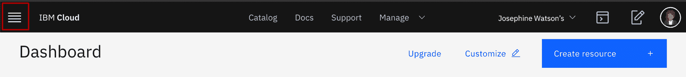
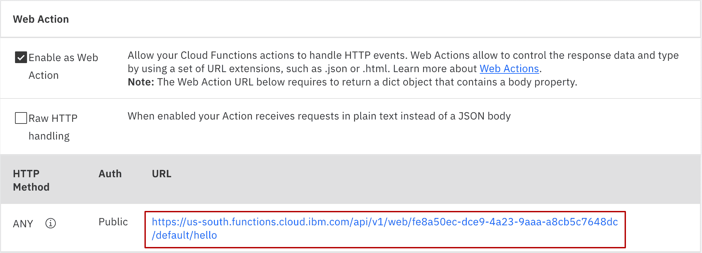

# 快速实验：没有基础架构，只有代码。了解无服务器的简单性。

> 原文：[`developer.ibm.com/zh/tutorials/no-infrastructure-just-code-see-the-sim-plicity-of-serverless/`](https://developer.ibm.com/zh/tutorials/no-infrastructure-just-code-see-the-sim-plicity-of-serverless/)

*无服务器计算*是一种模型，在这种模型中，服务器的存在已完全抽象化。尽管服务器仍然存在，但开发者不需要担心它们的操作。他们不需要担忧低级基础架构和操作细节，比如可扩展性、高可用性、基础架构安全等。无服务器计算实际上可以减少维护工作，使开发者能快速集中精力开发能增加价值的代码。

无服务器计算可简化云原生应用程序的开发（尤其是面向微服务的解决方案的开发），能够将复杂应用程序分解为可轻松交换的小型独立模块。

无服务器计算不涉及特定的技术。相反，它会涉及上述模型的基础概念。最近出现了一些很有前景的解决方案（例如 [Apache OpenWhisk](https://openwhisk.apache.org/)），它们可以简化无服务器模型中使用的开发方法。

[IBM Cloud Functions](https://cloud.ibm.com/functions/?cm_sp=ibmdev-_-developer-tutorials-_-cloudreg) 是 IBM Cloud 上的一个“功能即服务”(FaaS) 平台，它是使用 Apache OpenWhisk 开源项目构建的，允许您执行相应代码来响应事件。

它提供了无服务器部署和操作模型。通过适用于任何规模的细粒度定价模型，您可以准确地获得所需的资源（不多不少），而且只需为实际运行的代码付费。这种灵活的编程模型不仅支持 JavaScript、Swift、Python 和 Java 等语言，还支持通过 Docker 容器运行自定义逻辑。利用此编程模型，小型敏捷团队可以复用现有技能并根据目的进行有针对性的开发。IBM Cloud Functions 还提供了一些工具，用于以声明方式将所开发的构建块链接在一起。您可以链接微服务，以通过组合来形成工作流程。它是开放的，可以在任何地方运行，从而避免了任何形式的供应商锁定。

## 预估时间

完成本教程大约需要 45 分钟。

## 前提条件

要完成本教程，您需要一个 IBM Cloud 帐户。如果您没有此帐户，请参阅[注册您的 IBM Cloud 账户](https://cloud.ibm.com/docs/account?topic=account-account-getting-started&cm_sp=ibmdev-_-developer-tutorials-_-cloudreg)以获取详细说明。

## 步骤

下面是完成本教程所需的步骤。

1.  创建操作
2.  使用参数调用
3.  创建触发器
4.  创建 Web 操作

### 1\. 创建操作

可通过两个主要选项来开始使用 IBM Cloud Functions。不论使用其中哪一个选项，都可以通过创建、更新和删除操作、触发器、规则和序列来使用基本的实体。

通过命令行界面，您可以从 Shell 中执行这些基本操作。通过 IBM Cloud Functions 用户界面，您可以从浏览器中执行相同的操作。本教程使用的是浏览器用户界面。

1.  登录您的 [IBM Cloud](https://cloud.ibm.com?cm_sp=ibmdev-_-developer-tutorials-_-cloudreg) 账号。

2.  单击 **Navigation Menu** 图标：

    

3.  单击 **Functions** 以访问 IBM Cloud Functions（IBM Cloud 上的云原生开发体验）。

    

4.  您现在应处在 IBM Cloud Functions Web 控制台中。该页面应该具有一个导航菜单，该菜单提供了指向所有顶级功能的链接。在本教程中，您将探索该菜单中显示的以下功能区域：

    *   **Actions**：用于使用任何受支持的功能编码语言来创建、编辑和管理操作。

    *   **Triggers**：用于创建、编辑和管理触发器，这些触发器使用事件自动运行或触发操作。

    *   **Monitor**：用于显示有关您帐户上的操作和触发器调用（如执行）的信息，包括活动摘要和时间表。

5.  通过单击 Functions 主页上的 **Start Creating** 按钮来创建第一个操作。

    

    然后单击页面中的 **Action**：

    

6.  输入操作的名称（如 `hello`），然后验证运行时下拉列表是否显示最新的默认 Node.js 运行时版本（例如，Node.js 10）。现在，单击 **Create** 按钮。

    

7.  在打开的基于云的代码编辑器中，您可以创建和修改操作的功能。该编辑器中应预先填充了 `Hello World` 函数（用 Node.js 编写）：

    ```
     function main(params) {
            return { message: "Hello World" };
        } 
    ```

    *注意：如果您没有看到上面的代码片段，则可以将其复制并粘贴到代码编辑器中以替换任何现有代码，然后单击 **Save**。随后，您应该会看到 **Invoke** 按钮，以便执行下一步。*

8.  单击 **Invoke** 以直接从浏览器中测试您的操作。

    

    此时应该会显示 **Activations** 部分，其中包含由您的调用引起的激活记录，包括激活标识、调用结果以及函数写入的任何日志条目（在此例中为无）：

    

    现在，您应该会看到调用的结果是下面带有 `Hello World` 消息的 JSON 对象：

    ```
     {
       "message": "Hello World"
     } 
    ```

    每次调用都会记录一个唯一的激活记录，其中包含此页面上未显示的详细配置和指标信息。本教程稍后会介绍 Monitor 仪表板，您可以在此仪表板中查看一段时间内的所有帐户激活并访问其详细信息。

    *注意：如果您先离开然后返回该窗口，那么将重置此处显示的激活。*

### 2\. 使用参数调用

通过用户界面，可以声明指定的参数并以 JSON 对象格式将其传递给函数。

1.  确保代码窗口处于编辑模式。使用下面的代码来更新 `hello` 操作函数，然后单击 **Save**：

    ```
     function main(params) {
        return { message: "Hello, " + params.name + " from " + params.place };
     } 
    ```

2.  此操作现在需要输入参数 `name` 和 `place`。要添加参数，请单击 **Invoke with parameters**。

    

    这样会显示 **Change Action Input** 对话框。

3.  将以下 JSON 数据添加到 **Change Action Input** 对话框的输入区域，然后单击 **Apply**：

    ```
     {
       "name": "Elrond",
       "place": "Rivendell"
     } 
    ```

    

4.  通过单击 **Invoke**，再次使用新输入数据来运行该操作。您应该会在 **Activations** 窗口收到以下结果：

    ```
     {
       "message": "Hello, Elrond from Rivendell"
     } 
    ```

### 3\. 创建触发器

作为 FaaS 平台，IBM Cloud Functions 会运行相应代码来响应事件。可以通过以下项来生成事件：

*   **API 调用**：由标准 Web 或移动应用程序触发，可配置为触发操作。这是到目前为止您在用户界面中所执行的操作；Invoke 按钮触发了对操作的直接调用。

*   **服务**：属于 IBM Cloud 平台或使用触发器的外部服务提供者。

在接下来的步骤中，您将创建一个触发器，以便使用 IBM Cloud Functions 内置报警服务来定期运行函数。

1.  使用以下样本代码来更新现有的 `hello` 操作，然后单击 **Save**：

    ```
     var counter = 0; // global variable
     function main(msg) {
         var date = new Date();
         var time = date.getHours() + ":"+ date.getMinutes() + ":"+
         date.getSeconds();     
         counter++;
         return { message: "It is " + time + ".This action has been called " + counter + " time(s)."};
     } 
    ```

    此操作将返回调用的时间和频率。将使用全局变量 counter 来保留计数。由于它是一个全局变量，因此它在同一操作的不同调用中都保持不变。

2.  单击在导航菜单中的 **Connected Triggers**，然后单击 **Add Trigger**：

    

    现在选择 **Periodic** 作为触发器类型：

    

3.  将 **Trigger Name** 字段命名为 `minute alarm`。然后，在 **Timer Settings** 中的 **UTC Minutes** 模式，从 **Select a pattern** 菜单中选择 **Every Minute**。单击 **Create & Connect** 按钮以创建一个触发器，然后将其连接到 `hello` 操作：

    

4.  使用左上方的面包屑来浏览到 **Actions** 部分，然后从左侧菜单中选择 **Monitor** 以查看操作和触发器的最新活动。

    

    **Activity Log** 窗口应该会显示定期警报源确实每分钟触发了一次 `minute alarm` 触发器，进而又触发了所连接的 `hello` 操作：

    

5.  确保返回 **Triggers** 页面删除了该触发器，否则该触发器将继续每分钟触发一次，这会计入您帐户层的计算使用量！

    单击 `minute alarm` 旁边的 **Delete trigger** 以将其删除。

    

    在确认对话框上选择 **Delete**。

    *注意：也可以通过单击该触发器的名称并取消选中 Connection 列下的 **Enabled** 设置来禁用该触发器。然后使用面包屑浏览回到 Triggers 页面。*

### 4\. 创建 Web 操作

现在，使 `hello` 操作可通过 Web 访问，并让 IBM Cloud Functions 自动为其创建一个 HTTP 端点。

1.  从菜单中选择 **Actions**。然后选择 `hello` 操作。

    

2.  使用以下代码来更新现有的 `hello` 操作：

    ```
     function main(params) {
            let html = '<html style="color:red"><body><p>' +
            'Hello, ' + params.name + ` from ` + params.place +
            '</p></body></html>'
            return { headers: { "Content-Type": "text/html" },
                     body: html };
         } 
    ```

    单击 **Save**：

    

    当您点击 **Invoke**，该函数现在返回 HTML 格式的 `Hello World` 消息，此消息是在 HTTP 响应的 `body` 中返回的。注意，我们还会在 HTTP 响应头中将相应的 `Content-Type` 设置为 `text/html`。

3.  要使操作成为 Web 操作，请单击左侧菜单上的 **Endpoints**。选中 **Enable as Web Action** 框，然后单击 **Save**。

    

4.  在保存后，可通过单击所生成的 URL 以在 Web 浏览器中打开该 URL。

    

    现在，您的问候语应该显示：

    

    但是，`name` 和 `place` 的值显示为 `undefined`。让我们来解决这个问题。

5.  将以下查询参数附加到浏览器中的 URL 上，然后通过点击键盘上的 **Enter** 重新提交请求：

    ```
     ?name=Frodo&place=Shire 
    ```

    现在，`name` 和 `place` 的查询参数已作为输入参数传递到操作，消息“Hello, Frodo from Shire”应该出现在您的 Web 浏览器页面上。

    

## 结束语

恭喜！您已成功构建并部署多个无服务器功能，包括可从浏览器或微服务中调用的 Web 操作（全部在浏览器内进行）。

现在，您可以使用自己的代码来尝试执行这些步骤。通过运行用 Node.js 编写的云原生无服务器应用程序来进行更多试验。

本文翻译自：[Quick lab: No infrastructure, just code. See the simplicity of serverless.](https://developer.ibm.com/tutorials/no-infrastructure-just-code-see-the-sim-plicity-of-serverless/)（2020-09-30）