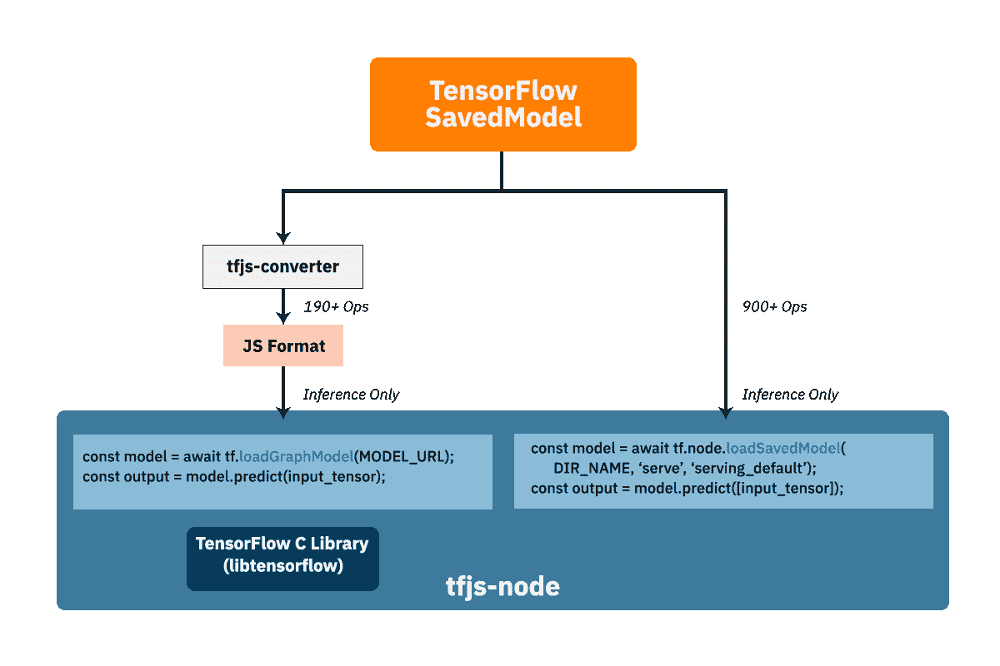

# 在 Node.js 中运行 AI 的环境

> 原文：[`developer.ibm.com/zh/tutorials/environments-for-running-ai-in-nodejs/`](https://developer.ibm.com/zh/tutorials/environments-for-running-ai-in-nodejs/)

[先前的教程](https://developer.ibm.com/zh/series/learning-path-get-started-with-ai-in-nodejs/)向您介绍了如何在 Node.js（和 Node-RED）中构建、训练和运行 TensorFlow.js。虽然表明可以使用 GPU，但这些任务主要侧重于在 CPU 上运行 TensorFlow.js。CPU 提供了将 AI 集成到 Node.js 的最便捷的方法。但这是以性能和 TensorFlow 满载运行为代价。

对于非常注重 CPU 性能的用例，可以考虑使用其他绑定和架构。在本教程中，我们不仅仅会介绍 CPU，还会探索在 Node.js 中通过 TensorFlow.js 更好地运行机器学习任务时可使用的一些环境和后端。我们将研究如何针对特定环境在 Node.js 中自定义和优化 TensorFlow.js。

了解如何使用 GPU 提供比 CPU 更强的性能，以及如何通过本机执行 SavedModel 来完全支持所有操作。此外，我们将回顾 TensorFlow.js 的替代后端，并了解如何在高性能的 IBM® Power® 计算机上的 Node.js 中成功运行 TensorFlow.js。

## Node.js 中的本机 SavedModel 执行

在本系列的[第一个教程](https://developer.ibm.com/zh/tutorials/an-introduction-to-ai-in-nodejs/)中，我们介绍了如何在 Node.js 环境中[安装](https://tensorflow.google.cn/js/tutorials/setup) TensorFlow.js。

```
npm install @tensorflow/tfjs-node 
```

然后，可以将各种格式的训练模型转换为可在 Node 程序中使用的 JavaScript 友好格式。特别是，从 SavedModel 格式转换而来的模型可用于通过 [tf.loadGraphModel](https://js.tensorflow.org/api/latest/index.html#loadGraphModel) API 进行推断。

```
const tf = require('@tensorflow/tfjs-node')
...
model = await tf.loadGraphModel(modelUrl, {fromTFHub: true})
...
const output = model.predict(input_tensor);
... 
```

在这种模式下运行时，后端会加载 TensorFlow C 库 (libtensorflow)，该库包含一组更完整的 TensorFlow 内核和 API，可用于在模型中执行各种操作。这与使用操作的 JavaScript 或 WebGL 实现来执行模型的浏览器环境不同。该 C 库可加速执行 CPU 硬件上的线性代数计算。因此，Node.js 和 Python 中相同模型的 CPU 推断性能都不相上下，并且在某些情况下，借助解释器，Node.js 版本的性能甚至会略胜一筹。

由于可以使用完整的 TensorFlow C 库，因此还可以直接加载 TensorFlow SavedModel 并在模型上运行推断。最近通过新的 [tf.node.loadSavedModel](https://js.tensorflow.org/api_node/2.0.1/#node.loadSavedModel) API 添加了此功能。

```
const model = tf.node.loadSavedModel(dirname, 'serve', 'serving_default');
const output = model.predict([input_tensor]); 
```

此方法具有两个显著的优势：

1.  您可以使用 TensorFlow C 库中的完整操作集，而不仅限于 TensorFlow.js 所支持的那部分操作。这样便可以在 Node.js 环境中运行 TensorFlow 1.x 中的 SavedModel，甚至运行 TensorFlow 2.x 中的某些 SavedModel。

2.  无需使用转换器，即可将 SavedModel 格式转换为 JavaScript 格式。因此无需安装转换器工具，该工具是一个 Python 程序并且需要安装 Python 环境（如果尚未安装的话）。

下图展示了这两个 API 之间的差异。



在后台，此方法使用 TensorFlow C TF_LoadSessionFromSavedModel API 直接加载 SavedModel。为了支持此新功能，还添加了几个其他实用程序，这些实用程序可方便管理 JavaScript 格式的 SavedModel，例如，检查签名和删除模型。可以在 [Node.js 中的本机 SavedModel 执行](https://github.com/tensorflow/community/blob/master/rfcs/20190821-nodejs-saved-model.md)中找到有关这种实现的更多详细信息。

注意：该 SavedModel 格式只能用于在 Node.js 中通过 `loadGraphModel` 或 `loadSavedModel` API 进行推断。不支持训练。其中一个原因是模型通常导出为可在生产环境中使用推断的 SavedModel 格式，并且推断图通常与训练图不同。但是，仍然可以在 Node.js 中使用 SavedModel 进行迁移学习。在此例中，将根据 SavedModel 图通过输入来生成嵌入向量，并在 SavedModel 图的顶部添加了几个额外层，以使用该嵌入向量进行训练。

## 使用 GPU

机器学习如此受欢迎的主要原因之一是它可以使用 GPU 来实现并行计算。随着 GPU 的价格越来越低且功能越来越强，用于训练和推断的时间也会显著缩短。毫无疑问，如果是在配备了 GPU 的环境中运行机器学习模型，那么绝对应该使用 GPU。

由于 JavaScript 广泛可用，因此在许多环境（例如，浏览器、Node.js 和 React）中都可以使用 TensorFlow.js。最重要的是，TensorFlow.js 可以使用以下几种技术，通过在这些受支持的环境中使用 GPU 来提高模型训练和推断的性能。在本部分中，我们将重点介绍 Node.js 环境。但是，在开始之前，我们来在浏览器中快速看一看两个由 GPU 加速的后端：[tfjs-backend-webgl](https://github.com/tensorflow/tfjs/tree/master/tfjs-backend-webgl) 和 [tfjs-backend-webgpu](https://github.com/tensorflow/tfjs/tree/master/tfjs-backend-webgpu)。

### WebGL

[WebGL](https://www.khronos.org/webgl/) 是适用于 3D 图形 API 的跨平台 Web 标准，它基于 [OpenGL ES](https://www.khronos.org/opengles/)。大多数现代浏览器（包括移动设备上的浏览器）都支持 WebGL。 TensorFlow.js 采用 GPU (GPGPU) 通用计算方法，实现了其独特的顶点和片段着色器程序，以用于在 GPU 上执行张量计算。在浏览器上运行 TensorFlow.js 时，其中一个注册后端就是 WebGL。它具有比 [tfjs-cpu-backend](https://github.com/tensorflow/tfjs/tree/master/tfjs-backend-cpu) 更高的优先级，这意味着在大多数情况下，设备的 GPU 可以提高浏览器中机器学习应用程序的运行速度。

### WebGPU

[WebGPU](https://webgpu.io/) 即将推出，它是 WebGL 的继任者。它是 W3C GPU 为 Web 社区小组开发的 JavaScript API，旨在改进 WebGL。大多数主流浏览器背后的公司都在为这项工作提供支持。

WebGPU 标准和实现目前仍在开发中，因此可能还需要几年时间，WebGPU 才会真正取代浏览器中的 WebGL。目前，可以在 Chrome 开发版本 Chrome Canary 中使用 WebGPU。Safari 也为此提供了开发者实验性功能。TensorFlow.js 中的 [WebGPU 后端](https://github.com/tensorflow/tfjs/tree/master/tfjs-backend-webgpu)目前还是一项实验性功能，因此它还不能执行某些操作，而且性能也不能与 WebGL 相提并论。如果想要试用 WebGPU，建议使用 Chrome Canary 浏览器。

### Node.js 上的 GPU

返回到主题：如何将 GPU 与 Node.js 结合使用。Node.js 提供了一些 [C++ 附加组件](https://nodejs.org/dist/latest-v12.x/docs/api/addons.html#addons_c_addons)，以用于向 JavaScript 公开 C/C++ API。TensorFlow.js 采用了此机制，并提供了 npm 包 [@tensorflow/tfjs-node-gpu](https://www.npmjs.com/package/@tensorflow/tfjs-node-gpu)，此包由预先构建的 TensorFlow C 共享库在后台加速。由于预先构建的 TensorFlow C 二进制文件的依赖性，因此 npm 包支持一组特定的环境。可以在[此处](https://github.com/tensorflow/tfjs/blob/master/tfjs-node/README.md#installing)找到该列表。在安装 npm 包之前，请确保您的操作系统和 NVIDIA 软件符合所列的条件。

如果您的平台不在该列表中，但您仍想在系统上使用 NVIDIA GPU，那么可以按照以下[说明](https://github.com/tensorflow/tfjs/blob/master/tfjs-node/README.md#optional-build-optimal-tensorflow-from-source)自行构建 Tensorflow C 二进制文件。它涉及许多依赖项，例如 Bazel 和构建工具。但如果 TensorFlow 支持您的平台，那么仍然可以这样做。在完成构建操作并将 tarball 文件解压缩到 `@tensorflow/tfjs-node-gpu` npm 文件夹的 `deps` 文件夹中之后，运行 以下命令以生成 C++ 附加组件。

```
yarn build-addon-from-source 
```

您还可以通过执行以下步骤，针对社区中的特定平台使用预先构建的 TensorFlow 二进制文件。

1.  编写一个名为 `custom-binary.json` 的 JSON 文件，然后将其放入 `@tensorflow/tfjs-node-gpu` npm 源文件夹下的 `scripts` 目录中。

2.  从 `@tensorflow/tfjs-node-gpu` npm 文件夹中运行 `yarn` 或 `npm install`，以触发下载和构建过程。

以下代码是一个示例 `custom-binary.json`，此示例将预先构建的 TensorFlow 二进制文件用于 NVIDIA Jetson Nano（arm64 架构）。

```
{
  "tf-lib": "https://developer.ibm.com/tfjs-cos/libtensorflow-gpu-linux-arm64-1.15.0.tar.gz"
} 
```

TensorFlow.js 可以结合使用 Node.js C++ 附加组件和 TensorFlow C 二进制文件，通过 GPU 加速机制来提高机器学习性能。在 `custom-binary.json` 文件中，可以指定预先构建的 TensorFlow C 二进制文件以及预先构建的 C++ 附加组件。如果省略了 C++ 附加组件，那么将通过相应 URL 来下载预先构建的 TensorFlow C 二进制文件，并在本地构建 C++ 附加组件。

### 用法

与其他 npm 包一样，必须运行以下任一命令来安装 `@tensorflow/tfjs-node-gpu` 包。

```
npm install @tensorflow/tfjs-node-gpu 
```

或

```
yarn install @tensorflow/tfjs-node-gpu 
```

如果可以成功安装 `@tensorflow/tfjs-node-gpu` 而不出现任何问题，那么只需使用 `require()` API 加载该模块，即可验证 TensorFlow.js 的 GPU 加速情况。

```
const tfjs = require('@tensorflow/tfjs-node-gpu'); 
```

您应该会看到如下日志消息：

```
tensorflow/stream_executor/platform/default/dso_loader.cc:44] Successfully opened dynamic library libcudart.so.10.0
tensorflow/stream_executor/platform/default/dso_loader.cc:44] Successfully opened dynamic library libcublas.so.10.0
tensorflow/stream_executor/platform/default/dso_loader.cc:44] Successfully opened dynamic library libcufft.so.10.0
tensorflow/stream_executor/platform/default/dso_loader.cc:44] Successfully opened dynamic library libcurand.so.10.0
tensorflow/stream_executor/platform/default/dso_loader.cc:44] Successfully opened dynamic library libcusolver.so.10.0
tensorflow/stream_executor/platform/default/dso_loader.cc:44] Successfully opened dynamic library libcusparse.so.10.0
tensorflow/stream_executor/platform/default/dso_loader.cc:44] Successfully opened dynamic library libcudnn.so.7 
```

这意味着 TensorFlow.js 可以加载 C++ 附加组件和 TensorFlow C 二进制文件。它将间接使用 NVIDIA 驱动程序和软件来与 GPU 交互。

但是，如果您无法正确安装 `@tensorflow/tfjs-node-gpu` 并看到以下错误消息，那么必须检查是否可以自行为系统构建 Tensorflow C 二进制文件，或者是否可以从社区中找到适用于您系统的现有预先构建的二进制文件。

```
* Downloading libtensorflow
(node:7840) UnhandledPromiseRejectionWarning: Error: Unsupported system: gpu-linux-arm64 
```

## WebAssembly 的替代后端

在某些情况下，由于在安装 `libtensorflow` 依赖项时出现问题，因此无法使用 TensorFlow.js 的 Node 后端 (`tfjs-node`)。可用的替代后端是 TensorFlow.js 的 WebAssembly 后端 (`tfjs-backend-wasm`)。

从 Node V8 开始，Node 中支持 [WebAssembly](https://webassembly.org/) 或 WASM 二进制格式，这种格式可以为 C、C++ 或 Rust 等语言提供编译目标。无论是在浏览器中还是在服务器上，都可以在 JavaScript 中加载和运行这种格式，从而提供接近本机的性能。WebAssembly 的另一个主要优势是可移植性，因此可以在 Web 上和 Web 之外的各种操作系统和指令集架构上运行代码。

对于 TensorFlow.js，WASM 后端提供的 CPU 执行速度要比普通 JavaScript CPU 后端快得多，因此在无法使用 `tfjs-node` 或者您不想通过源代码构建 `libtensorflow` 时，WASM 后端是 Node 应用程序的理想之选。

### WASM 性能

为了比较各种后端在 Node 环境中的性能，我们（在配备 2.8 Ghz 四核 Intel™ Core i7 的 2015 MacBook Pro 上）进行了一些测量来估算 MobileNet v2 模型的推断时间。 下面列出了每种后端进行 50 次推断时的平均推断时间。

| tjfs-node | tfjs-backend-wasm | tfjs-backend-cpu |
| --- | --- | --- |
| 49 毫秒 | 109 毫秒 | 966 毫秒 |

虽然 WASM 后端的速度不如 `tfjs-node` 后端快，但相比于 JavaScript CPU 后端，它有了相当大的进步。 TensorFlow.js 最近启用了 [WASM SIMD 支持](https://github.com/tensorflow/tfjs/commit/5db28e7aa47d39b633b679ef2680720d35a71e7e)， 从而进一步提高了性能。为了进行[浏览器测试](https://github.com/tensorflow/tfjs/tree/master/tfjs-backend-wasm#mobilenet-v2)， TensorFlow.js 团队在 MacBook Pro 上将 MobileNet v2 推断时间从 98.4 毫秒下调到 30.2 毫秒。无论是在浏览器中还是在 Node 中，SIMD 目前都还是一项实验性功能。但是，随着提供的支持在不断改进和增强，我们可以肯定地说，WASM 后端在 CPU 执行速度方面最终将超过 `tfjs-node` 后端。

### 警告

WASM 后端的当前开发主要集中在推断操作上，因此尚未实现训练中通常会使用的一些操作。如果只想在 Node 中使用 WASM 后端来执行推断操作，那么您可能不会遇到任何问题。但是，在尝试进行训练时，您可能会遇到问题，例如 `Error: '<op>' not yet implemented or not found in the registry`。这表明缺少该操作的 WASM 实现。您可以提交有关 [TensorFlow.js 存储库](https://github.com/tensorflow/tfjs)的问题，也可以自行尝试实现该操作，然后将其贡献给社区。无论如何，在使用此后端时，都需要记住其操作差异。

### 用法

在 Node 中使用 TensorFlow.js 的 WASM 后端非常简单。下面我们将完成一些步骤以运行一个简单应用程序。

1.  安装依赖项。我们使用主 TensorFlow.js 包，而不是 `tfjs-node`。

    ```
     npm install @tensorflow/tfjs @tensorflow/tfjs-backend-wasm 
    ```

2.  在新文件中，导入先前安装的依赖项。

    ```
     const tf = require('@tensorflow/tfjs');
     require('@tensorflow/tfjs-backend-wasm'); 
    ```

3.  然后，在同一文件中，创建一个函数以使用从 TFHub 下载的 MobileNet 模型运行快速推断。

    ```
     async function run() {
       await tf.setBackend('wasm');
       console.log(tf.getBackend());
       const img = tf.ones([1, 224, 224, 3]).toFloat();
       const model = await tf.loadGraphModel(
         'https://tfhub.dev/google/tfjs-model/imagenet/mobilenet_v2_130_224/classification/3/default/1',
         { fromTFHub: true });
       const prediction = await model.predict(img);
       console.log(prediction);
     }

     run(); 
    ```

4.  保存该文件，并在命令行上运行该文件。

    ```
     node test-wasm.js 
    ```

您应该会看到通过 TensorFlow.js 的 WASM 后端所执行的推断。由于我们不再导入 `tfjs-node` 包，因此缺少一些用于将镜像转换为张量的便利功能（例如 `tf.node.decodeImage`），但是可以使用其他方法来将镜像转换为张量。

## 使用 IBM Power 实现高性能

在本部分中，您将学习如何在 IBM Power 上借助 GPU 支持来运行 `tfjs-node` 包。以下说明基于具有 NVIDIA GPU 的 IBM POWER9 上的 Ubuntu 18.04 LTS ppc64le。如前所述，`tfjs-node` 包是 TensorFlow C 共享库的绑定，并为在 Node 下运行的服务器端 JavaScript 应用程序提供本机 TensorFlow 执行。

由于 `tfjs-node` 没有为 POWER 提供预编译的绑定，因此必须使用源代码进行构建。构建过程需要使用 `libtensorflow` 和 `CUDA` 共享库。幸运的是，IBM Watson™ Machine Learning Community Edition 正好提供了这些库。 我们只要专注于构建 C 绑定即可。

### 启动 Watson Machine Learning Community Edition 容器

本教程假定您已具备 [Docker](https://www.docker.com/) 的基础知识。为了快速启动构建过程，我们启动了 Watson Machine Learning Community Edition Docker 容器。

```
docker run --runtime nvidia -it --env LICENSE=yes --rm ibmcom/powerai:1.6.2-tensorflow-ubuntu18.04-py37-ppc64le bash 
```

或者，您可以使用以下内容：

```
nvidia-docker run -it --env LICENSE=yes --rm ibmcom/powerai:1.6.2-tensorflow-ubuntu18.04-py37-ppc64le bash 
```

要验证容器是否可以访问 GPU，可在容器内运行 `nvidia-smi` 命令。您应该会看到如下输出。

```
(wmlce) pwrai@7e039567d38c:/$ nvidia-smi
+-----------------------------------------------------------------------------+
| NVIDIA-SMI 440.33.01    Driver Version: 440.33.01    CUDA Version: 10.2     |
|-------------------------------+----------------------+----------------------+
| GPU  Name        Persistence-M| Bus-Id        Disp.A | Volatile Uncorr.ECC |
| Fan  Temp  Perf  Pwr:Usage/Cap|         Memory-Usage | GPU-Util  Compute M. |
|===============================+======================+======================|
|   0  Tesla V100-SXM2...  On   | 00000004:04:00.0 Off |                    0 |
| N/A   31C    P0    39W / 300W |      0MiB / 32510MiB |      0%      Default |
+-------------------------------+----------------------+----------------------+
|   1  Tesla V100-SXM2...  On   | 00000004:05:00.0 Off |                    0 |
| N/A   33C    P0    41W / 300W |      0MiB / 32510MiB |      0%      Default |
+-------------------------------+----------------------+----------------------+
|   2  Tesla V100-SXM2...  On   | 00000035:03:00.0 Off |                    0 |
| N/A   31C    P0    39W / 300W |      0MiB / 32510MiB |      0%      Default |
+-------------------------------+----------------------+----------------------+
|   3  Tesla V100-SXM2...  On   | 00000035:04:00.0 Off |                    0 |
| N/A   34C    P0    40W / 300W |      0MiB / 32510MiB |      0%      Default |
+-------------------------------+----------------------+----------------------+

+-----------------------------------------------------------------------------+
| Processes:                                                       GPU Memory |
|  GPU       PID   Type   Process name                             Usage      |
|=============================================================================|
|  No running processes found                                                 |
+-----------------------------------------------------------------------------+ 
```

运行以下命令以更新此 Docker 容器中的 TensorFlow 包。

```
conda install -y tensorflow=1.15.3 
```

### 构建 C 绑定

要编译 `tfjs-bindings.node`，可执行以下步骤。

1.  安装 npm。可通过 Node.js 安装来使用 npm 命令行界面。要安装 Node.js，可运行以下命令。

    ```
     cd ~
     curl --output ./node-v12.16.1-linux-ppc64le.tar.xz https://nodejs.org/dist/v12.16.1/node-v12.16.1-linux-ppc64le.tar.xz
     tar xvf node-v12.16.1-linux-ppc64le.tar.xz
     export PATH="/home/pwrai/node-v12.16.1-linux-ppc64le/bin:$PATH" 
    ```

    验证 Node.js 和 npm 版本。

    ```
     node -v
     npm -v 
    ```

2.  安装 tfjs-node。由于 TensorFlow.js 官方团队未托管针对 ppc64le 的预编译的 `libtensorflow` C 共享库，因此安装 `tfjs-node` 应该会失败。但是，安装仍会为您下载 `tfjs-node` 源代码。

    ```
     cd ~
     mkdir tfjs; cd tfjs
     npm install @tensorflow/tfjs-node 
    ```

    此操作应该会失败，并显示以下消息：

    ```
     * Downloading libtensorflow
     (node:1049) UnhandledPromiseRejectionWarning: Error: Unsupported system: cpu-linux-ppc64 
    ```

3.  使 libtensorflow 共享库可供 tfjs-node 包使用。

    ```
     cd ~/tfjs
     mkdir -p node_modules/\@tensorflow/tfjs-node/deps/lib
     cp /opt/anaconda/envs/wmlce/lib/python3.7/site-packages/tensorflow_core/libtensorflow* node_modules/\@tensorflow/tfjs-node/deps/lib/ 
    ```

4.  使 TensorFlow C 库头可供 `tfjs-node` 包使用。

    ```
     sudo mkdir -p /usr/local/include/tensorflow
     sudo cp -r /opt/anaconda/envs/wmlce/lib/python3.7/site-packages/tensorflow_core/include/tensorflow/c /usr/local/include/tensorflow/ 
    ```

    注意：在撰写本文时，`tfjs-node` 依赖于 libtensorflow 1.15.x。您可以检查受支持的 [libtensorflow 版本](https://github.com/tensorflow/tfjs/blob/e3b34b0818344c9d6ffa72c0660efa4c367fc1d2/tfjs-node/scripts/deps-constants.js#L25)。

5.  构建 tfjs-node.binding。

    ```
     sudo apt update
     sudo apt install -y build-essential
     cd  ~/tfjs/node_modules/\@tensorflow/tfjs-node
     npm run build-addon-from-source 
    ```

    验证是否存在 `/home/pwrai/tfjs/node_modules/@tensorflow/tfjs-node/lib/napi-v5/tfjs_binding.node`。

6.  使其他库可供运行时使用。

    ```
     export LD_LIBRARY_PATH="/opt/anaconda/envs/wmlce/lib" 
    ```

7.  验证是否可以导入 `tfjs-node`。首先，打开 Node shell。

    ```
     cd ~/tfjs
     node 
    ```

    您应该会看到以下内容：

    ```
     Welcome to Node.js v12.16.1.
     Type ".help" for more information.
     > 
    ```

8.  在 shell 中输入以下代码。

    ```
     const tf = require('@tensorflow/tfjs-node')
     tf.version 
    ```

    您应该会看到如下输出。验证是否返回了带有版本信息的对象。

    ```
     Overriding the gradient for 'Max'
     Overriding the gradient for 'OneHot'
     Overriding the gradient for 'PadV2'
     Overriding the gradient for 'SpaceToBatchND'
     Overriding the gradient for 'SplitV'
     node-pre-gyp info This Node instance does not support builds for N-API version 6
     node-pre-gyp info This Node instance does not support builds for N-API version 6
     2020-07-08 23:53:55.477732: I tensorflow/stream_executor/platform/default/dso_loader.cc:44] Successfully opened dynamic library libcudart.so.10.1
     2020-07-08 23:53:55.611085: I tensorflow/core/platform/profile_utils/cpu_utils.cc:101] CPU Frequency: 3783000000 Hz
     2020-07-08 23:53:55.638838: I tensorflow/compiler/xla/service/service.cc:168] XLA service 0x33c66f00 initialized for platform Host (this does not guarantee that XLA will be used).Devices:
     2020-07-08 23:53:55.638934: I tensorflow/compiler/xla/service/service.cc:176]   StreamExecutor device (0): Host, Default Version
     2020-07-08 23:53:55.644219: I tensorflow/stream_executor/platform/default/dso_loader.cc:44] Successfully opened dynamic library libcuda.so.1
     2020-07-08 23:53:56.110275: I tensorflow/core/common_runtime/gpu/gpu_device.cc:1639] Found device 0 with properties:
     name: Tesla V100-SXM2-32GB major: 7 minor: 0 memoryClockRate(GHz): 1.53
     pciBusID: 0004:04:00.0
     2020-07-08 23:53:56.112323: I tensorflow/core/common_runtime/gpu/gpu_device.cc:1639] Found device 1 with properties:
     name: Tesla V100-SXM2-32GB major: 7 minor: 0 memoryClockRate(GHz): 1.53
     pciBusID: 0004:05:00.0
     2020-07-08 23:53:56.114339: I tensorflow/core/common_runtime/gpu/gpu_device.cc:1639] Found device 2 with properties:
     name: Tesla V100-SXM2-32GB major: 7 minor: 0 memoryClockRate(GHz): 1.53
     pciBusID: 0035:03:00.0
     2020-07-08 23:53:56.116349: I tensorflow/core/common_runtime/gpu/gpu_device.cc:1639] Found device 3 with properties:
     name: Tesla V100-SXM2-32GB major: 7 minor: 0 memoryClockRate(GHz): 1.53
     pciBusID: 0035:04:00.0
     2020-07-08 23:53:56.116374: I tensorflow/stream_executor/platform/default/dso_loader.cc:44] Successfully opened dynamic library libcudart.so.10.1
     2020-07-08 23:53:56.118026: I tensorflow/stream_executor/platform/default/dso_loader.cc:44] Successfully opened dynamic library libcublas.so.10
     2020-07-08 23:53:56.119548: I tensorflow/stream_executor/platform/default/dso_loader.cc:44] Successfully opened dynamic library libcufft.so.10
     2020-07-08 23:53:56.119887: I tensorflow/stream_executor/platform/default/dso_loader.cc:44] Successfully opened dynamic library libcurand.so.10
     2020-07-08 23:53:56.121373: I tensorflow/stream_executor/platform/default/dso_loader.cc:44] Successfully opened dynamic library libcusolver.so.10
     2020-07-08 23:53:56.122499: I tensorflow/stream_executor/platform/default/dso_loader.cc:44] Successfully opened dynamic library libcusparse.so.10
     2020-07-08 23:53:56.125816: I tensorflow/stream_executor/platform/default/dso_loader.cc:44] Successfully opened dynamic library libcudnn.so.7
     2020-07-08 23:53:56.141703: I tensorflow/core/common_runtime/gpu/gpu_device.cc:1767] Adding visible gpu devices: 0, 1, 2, 3
     2020-07-08 23:53:56.141725: I tensorflow/stream_executor/platform/default/dso_loader.cc:44] Successfully opened dynamic library libcudart.so.10.1
     2020-07-08 23:53:57.485893: I tensorflow/core/common_runtime/gpu/gpu_device.cc:1180] Device interconnect StreamExecutor with strength 1 edge matrix:
     2020-07-08 23:53:57.485950: I tensorflow/core/common_runtime/gpu/gpu_device.cc:1186]      0 1 2 3
     2020-07-08 23:53:57.485963: I tensorflow/core/common_runtime/gpu/gpu_device.cc:1199] 0:   N Y Y Y
     2020-07-08 23:53:57.485977: I tensorflow/core/common_runtime/gpu/gpu_device.cc:1199] 1:   Y N Y Y
     2020-07-08 23:53:57.486006: I tensorflow/core/common_runtime/gpu/gpu_device.cc:1199] 2:   Y Y N Y
     2020-07-08 23:53:57.486018: I tensorflow/core/common_runtime/gpu/gpu_device.cc:1199] 3:   Y Y Y N
     2020-07-08 23:53:57.497925: I tensorflow/core/common_runtime/gpu/gpu_device.cc:1325] Created TensorFlow device (/job:localhost/replica:0/task:0/device:GPU:0 with 30487 MB memory) -> physical GPU (device: 0, name: Tesla V100-SXM2-32GB, pci bus id: 0004:04:00.0, compute capability: 7.0)
     2020-07-08 23:53:57.503382: I tensorflow/core/common_runtime/gpu/gpu_device.cc:1325] Created TensorFlow device (/job:localhost/replica:0/task:0/device:GPU:1 with 30487 MB memory) -> physical GPU (device: 1, name: Tesla V100-SXM2-32GB, pci bus id: 0004:05:00.0, compute capability: 7.0)
     2020-07-08 23:53:57.508492: I tensorflow/core/common_runtime/gpu/gpu_device.cc:1325] Created TensorFlow device (/job:localhost/replica:0/task:0/device:GPU:2 with 30487 MB memory) -> physical GPU (device: 2, name: Tesla V100-SXM2-32GB, pci bus id: 0035:3:00.0, compute capability: 7.0)
     2020-07-08 23:53:57.513843: I tensorflow/core/common_runtime/gpu/gpu_device.cc:1325] Created TensorFlow device (/job:localhost/replica:0/task:0/device:GPU:3 with 30487 MB memory) -> physical GPU (device: 3, name: Tesla V100-SXM2-32GB, pci bus id: 0035:04:00.0, compute capability: 7.0)
     undefined
     {
       'tfjs-core': '2.0.1',
       'tfjs-backend-cpu': '2.0.1',
       'tfjs-backend-webgl': '2.0.1',
       'tfjs-data': '2.0.1',
       'tfjs-layers': '2.0.1',
       'tfjs-converter': '2.0.1',
       tfjs: '2.0.1',
       'tfjs-node': '2.0.1'
     } 
    ```

## 结束语

在本教程中，您已经了解了几种在 Node 中最大限度地提高 TensorFlow.js 应用程序性能的方法。您可以执行本机 TensorFlow SavedModel，以加快推断速度并提供更广泛的操作。您还可以使用支持 GPU 的 `tfjs-node-gpu` 库，该库提供了 NVIDIA CUDA 支持，从而提供了更高的性能。

此外，如果无法使用受支持的 GPU，或者在查找或构建 `libtensorflow` 二进制文件时遇到问题，那么 TensorFlow.js 的 WebAssembly 后端也是一个不错的选择，与普通 JavaScript 相比，其 CPU 性能要好得多。最后，您学习了如何在 IBM Power 计算机上将 TensorFlow.js 与 Node 结合使用，TensorFlow.js 是在 Node 中用于运行 AI 应用程序的另一个替代平台。如您所见，TensorFlow.js 的使用范围非常广，这无疑在 Node 用例支持 AI 方面起到了很大作用。希望本教程对您有所帮助，可以作为参考来指导您自行设置 TensorFlow.js。

本文翻译自：[Environments for running AI in Node.js](https://developer.ibm.com/technologies/artificial-intelligence/tutorials/environments-for-running-ai-in-nodejs)（2020-08-04）