# 逐步了解如何设置基本区块链网络

> 原文：[`developer.ibm.com/zh/tutorials/quick-start-guide-for-ibm-blockchain-platform/`](https://developer.ibm.com/zh/tutorials/quick-start-guide-for-ibm-blockchain-platform/)

IBM Blockchain Platform 是一种“区块链即服务”产品，可为用户提供部署灵活性、可伸缩性以及对网络组件的可控性。此平台使用 Hyperledger Fabric 1.4.x 代码库，并将组件部署到由用户管理和控制的 IBM Cloud Kubernetes Service 中。用户界面可简化并加快区块链网络组件的部署过程。本教程将引导您完成使用 IBM Blockchain Platform 设置基本区块链网络的步骤。

## 前提条件

要完成本教程，您将需要：

*   区块链基础知识：Hyperledger Fabric：您应了解区块链网络及其组件。[本文](https://developer.ibm.com/articles/blockchain-basics-hyperledger-fabric/)可帮助您了解 Hyperledger Fabric Network 的基础知识。
*   一个 [IBM Cloud](https://cloud.ibm.com/login?cm_sp=ibmdev-_-developer-tutorials-_-cloudreg) 帐户：具有 IBM Cloud Lite 帐户的用户将无法创建此服务。
*   VS Code V1.38 或更高版本。
*   适用于 VS Code 的 IBM Blockchain Platform 扩展。 
*   任何样本 Go/Node.js chaincode。
*   [Go 1.12.x 或更高版本](https://golang.org/dl/)（如果使用了 Go chaincode）。
*   [Node V8.x 或 V10.x](https://nodejs.org/en/download/) 以及 npm V6.x 或更高版本（如果使用了 Node.js chaincode）。

## 预估时间

除了设置 IBM Blockchain Platform 所需的时间外，部署 Kubernetes 集群还需要大约 25 至 30 分钟。如果已存在 Kubernetes 集群，那么大约需要 60 分钟才能完成本教程。

## 步骤

设计任何区块链解决方案的第一步都是确定区块链共同体（即，区块链网络的参与者）。在选择区块链网络的组件（例如，组织数、每个组织的同级数、排序者和认证中心 (CA)）后，就可以开始在云上设置该网络了。如果区块链网络的结构类似于下图，则您需要创建以下项（如该结构所示）：

*   3 个 CA
*   3 个成员资格服务提供者 (MSP)
*   2 个同级
*   1 个排序者
*   1 个通道（包含 2 个同级组织和 1 个排序者组织）

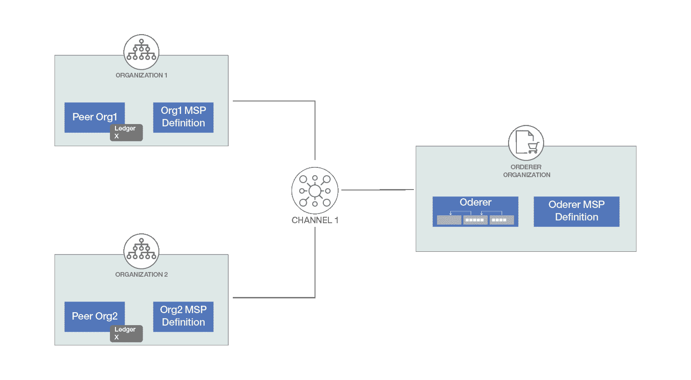

请注意，本教程将展示如何创建 1 个 CA、1 个 MSP 和 1 个同级节点等。您应该根据自己的网络结构来重复相同的步骤。

按照以下步骤，使用 IBM Blockchain Platform 控制台来部署区块链网络。

1

### 创建 IBM Cloud Kubernetes Service

在选择适当的套餐、Kubernetes 版本和风格等之后，在 IBM Cloud 上创建 [IBM Cloud Kubernetes Service (IKS)](https://cloud.ibm.com/kubernetes/catalog/cluster?cm_sp=ibmdev-_-developer-tutorials-_-cloudreg)。确保 Kubernetes 服务集群已完全部署。

2

### 在 IBM Cloud 上创建 IBM Blockchain Platform 服务实例

在 IBM Cloud 目录上搜索 IBM Blockchain Platform 服务，然后单击该服务。选择地区，提供服务名称和资源组，然后单击 **Create**。

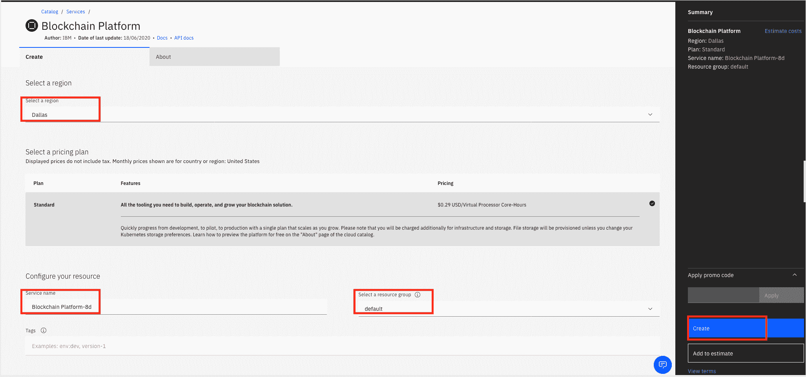

在本教程中，我们已设置 Kubernetes 集群，因此请选择选项 **Link a Kubernetes cluster on IBM Cloud**，然后单击 **Let’s get setup!**。提供现有集群的名称，然后单击 **Next**。（如果尚未创建 Kubernetes 集群，那么可选择 **Create a Kubernetes cluster on IBM Cloud**。）

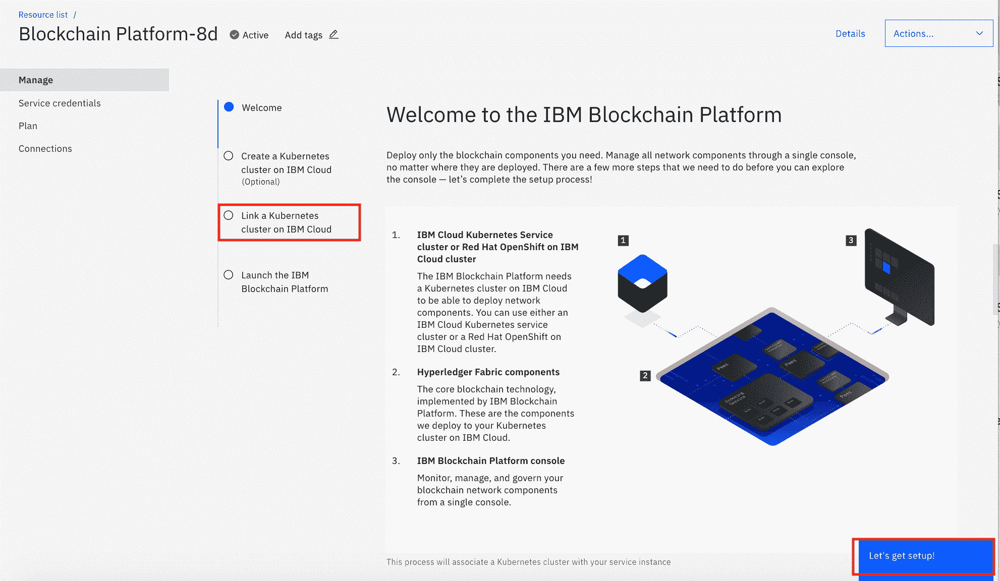

3

### 启动该平台

在将 IBM Blockchain Platform 成功部署到集群之后，可以启动 IBM Blockchain Platform。

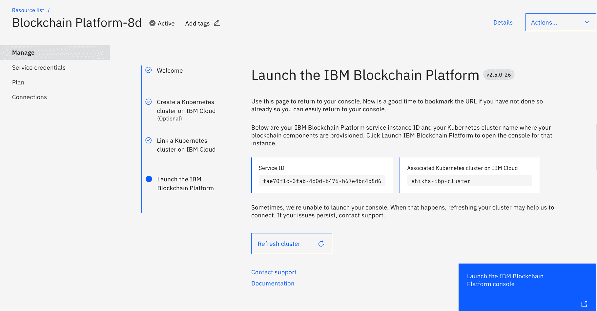

单击 **Launch the IBM Blockchain Platform console**。在 IBM Blockchain Platform 页面上，单击 **Let’s get started**。突出显示的信息图标提供了有关该节点/步骤的更多详细信息。此类信息可在您部署区块链平台时帮助您完成每个步骤。

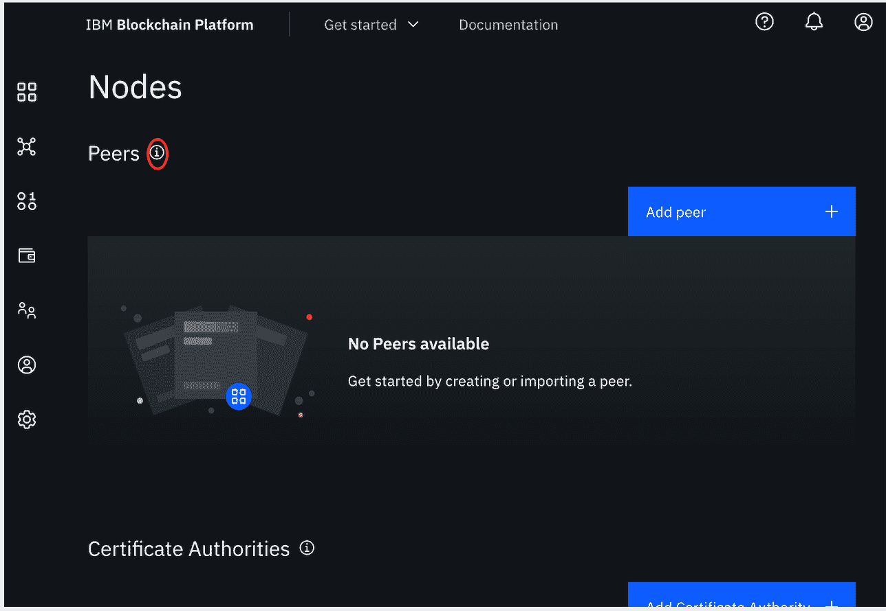

4

### 添加认证中心 (CA)

作为区块链的切入点，您需要创建一个 MSP 组织。为此，您需要具有组织管理员用户身份。除了定义组织外，CA 还会创建属于该组织的所有身份和证书。因此，设置区块链网络的第一步是创建 CA。

1.  开始使用 CA 设置您的网络。单击 **Add Certificate Authority**，选择 **Create a Certificate Authority** 部分，然后单击 **Next**。 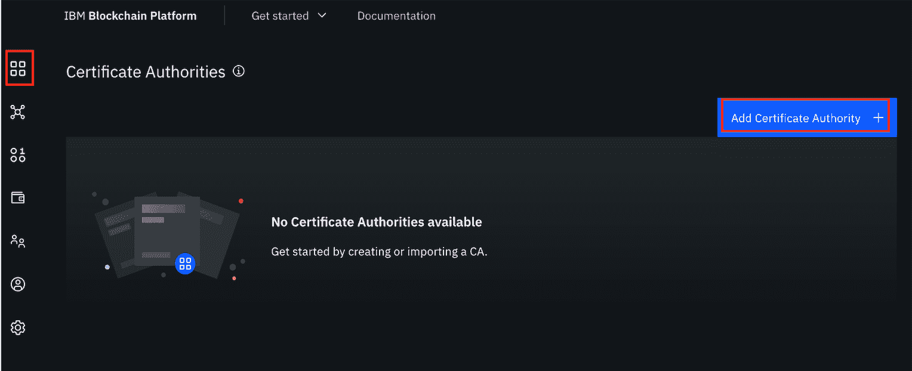

2.  为该 CA 提供一个名称（例如“Org1CA”）、CA 管理员注册 ID 和注册密钥（例如，ID“admin”和密钥“adminpw”），然后单击 **Next**。

3.  当您看到摘要时，单击 **Add Certificate Authority**。

5

### 注册用户

使用在上一步中创建的 CA 来注册用户。

1.  单击您创建的 CA，如下所示：

    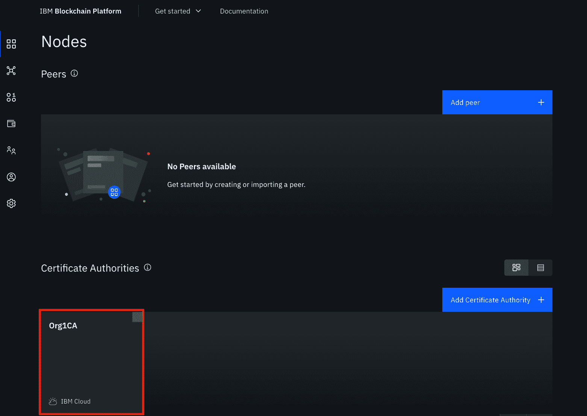

2.  单击 **Associate identity**。这会将 CA 管理员身份与 CA 节点相关联。提供 CA 注册 ID 和注册密钥（与步骤 4 中使用的注册 ID 和注册密钥相同）。您可以更改身份显示名称或继续使用所提供的默认名称。单击 **Associate identity**。

3.  单击 **Register user**，然后为组织注册管理员。

    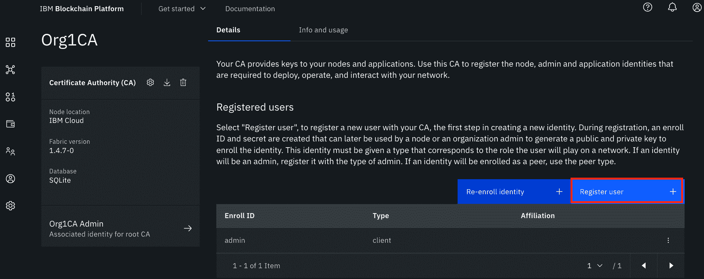

    提供注册 ID 和注册密钥（例如，ID“org1admin”和密钥“org1adminpw”）。将此身份的类型设置为 **admin**。此身份将充当组织管理员，允许您使用控制台来操作节点。余下的属性 **Maximum enrollments** 是一个可选属性。请将其留空，然后单击 **Next**。 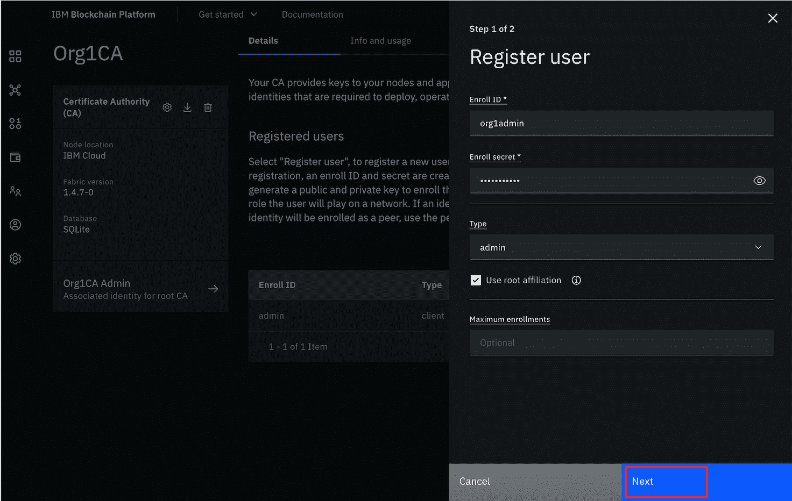

4.  接下来，将要求您添加一些属性。这可用于对资源进行基于角色的访问控制。就本教程而言，您不需要使用属性。单击 **Register user**。

5.  重复步骤 1 – 4，以使用 **peer** 类型身份再注册一个用户。该身份允许您部署一个同级。

6

### 创建组织的 MSP 定义

同级组织的正式定义称为 MSP。您已经创建了组织 CA 和用户，因此现在可以创建 MSP 定义了。

1.  导航到左侧面板中的 **Organizations** 选项卡，然后单击 **Create MSP definition**，如下所示： 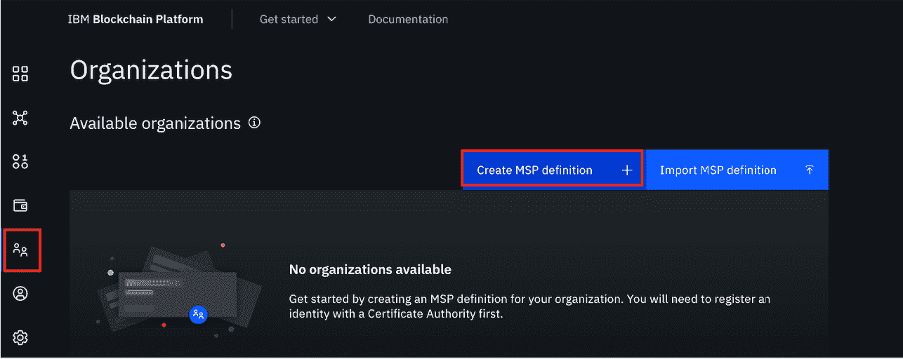

2.  提供所有必需的信息：

    *   **MSP details**：**MSP display name** 和 **MSP ID**。

    *   **Root Certificate Authority details**。选择 **Root Certificate Authority**（您在步骤 4 中创建的组织的根 CA），然后提供一个身份名称。

    *   **Admin certificates**：选择您为组织创建的注册 ID 作为管理员身份（例如，org1admin）。提供注册密钥和身份名称。

3.  单击 **Generate**。这会以组织管理员身份生成该身份，并将该身份添加到电子钱包中。 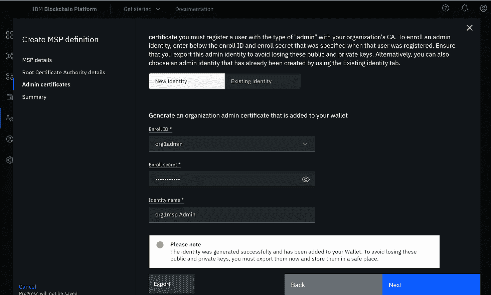

4.  为避免丢失这些公钥和私钥，请立即将其导出，然后单击 **Next**。最后，单击 **Create MSP definition**。

7

### 创建同级节点

同级是网络的一个基本要素，用于托管账本和智能合约。

1.  导航到 **Nodes** 选项卡，单击 **Add peer**，选择 **Create a peer**，然后单击 **Next**。 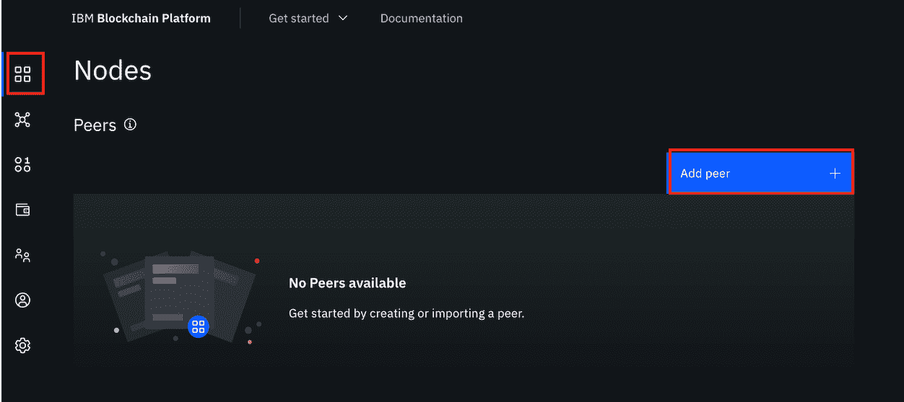

2.  提供同级显示名称，将高级部署选项保留为默认值，然后单击 **Next**。

3.  在下一个屏幕上，选择您在步骤 4 中创建的 CA。选择在步骤 5 结束时为同级创建的同级身份的注册 ID，并提供相关的密钥。然后，从下拉列表中选择 **Organization MSP** 和 Fabric 版本，然后单击 **Next**。 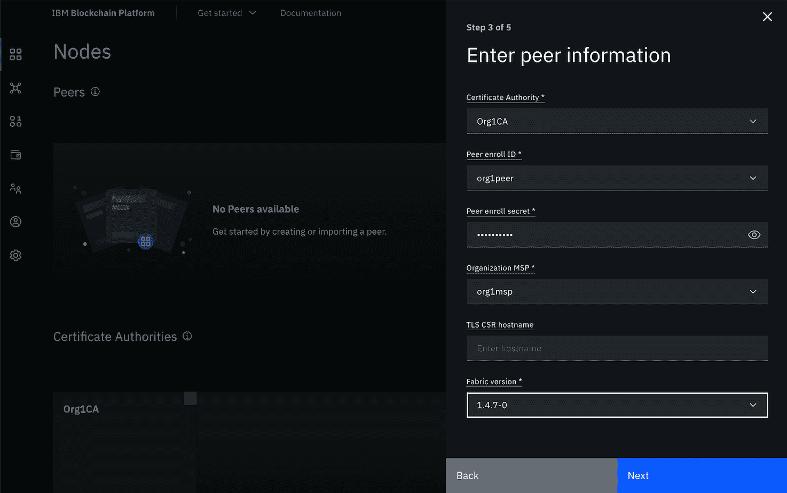

4.  在下一个屏幕上，将要求您关联一个身份，以使其成为同级的管理员。就本教程而言，您可以选择组织管理员 (org1 msp admin)，然后单击 **Next**。

5.  复查摘要，然后单击 **Add Peer**。要在同一组织中添加更多同级，请按照步骤 5 中所述使用同级身份注册一个新用户，然后重复此步骤。

**注意：**重复步骤 4 – 7，以根据需要创建更多的组织和同级。

8

### 创建排序者

排序者节点将运行通信服务，以保证网络中的事务传送。

1.  要创建排序者，您需要先创建排序者 CA。执行您在步骤 4 中所执行的相同步骤来创建排序者 CA。
2.  接下来，使用排序者 CA 来注册排序者用户身份。再次执行步骤 5 中的所有操作，以使用管理员和排序者身份来注册用户。
3.  以步骤 6 中所采用的方式创建排序者 MSP 定义。确保您选择了根认证中心的排序者 CA。
4.  现在可以开始创建排序者节点了。导航到 **Nodes** 选项卡，并单击 **Add ordering service**。

    选择 **Create an ordering service**，然后单击 **Next**。提供 **Ordering service display name**，并可以将 **Number of ordering nodes** 指定为一个排序节点。（一个排序节点适用于开发和测试。）然后单击 **Next**。

    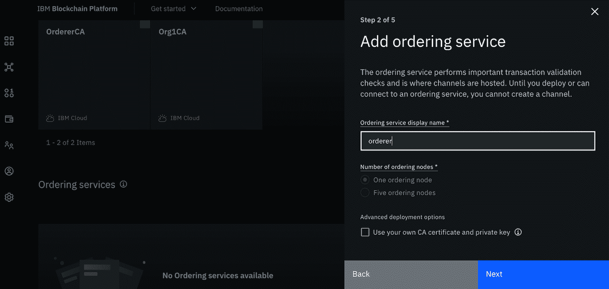

5.  按照步骤 7 中所述提供所需信息，但请确保您选择了正确的排序者 CA 和排序者 MSP。单击 **Next**。
6.  关联排序者管理员身份，然后单击 **Next**。
7.  复查摘要，然后单击 **Add ordering service**。

9

### 在排序者上添加组织作为共同体成员

1.  导航到 **Nodes** 选项卡，并单击您在步骤 8 中创建的排序者。
2.  在 **Consortium members** 下，单击 **Add organization**。
3.  选择 **Existing MSP Id**，然后从下拉列表中选择您在步骤 6 中创建的组织 MSP（MSP 表示同级的组织），然后单击 **Add organization**。
4.  针对将要成为该共同体一部分的所有组织重复此步骤。

10

### 创建通道

通道是区块链网络中的一组组件进行通信和交易时使用的一种机制。

1.  导航到左侧导航栏中的 **Channels** 选项卡，然后单击 **Create channel**。单击 **Next**。 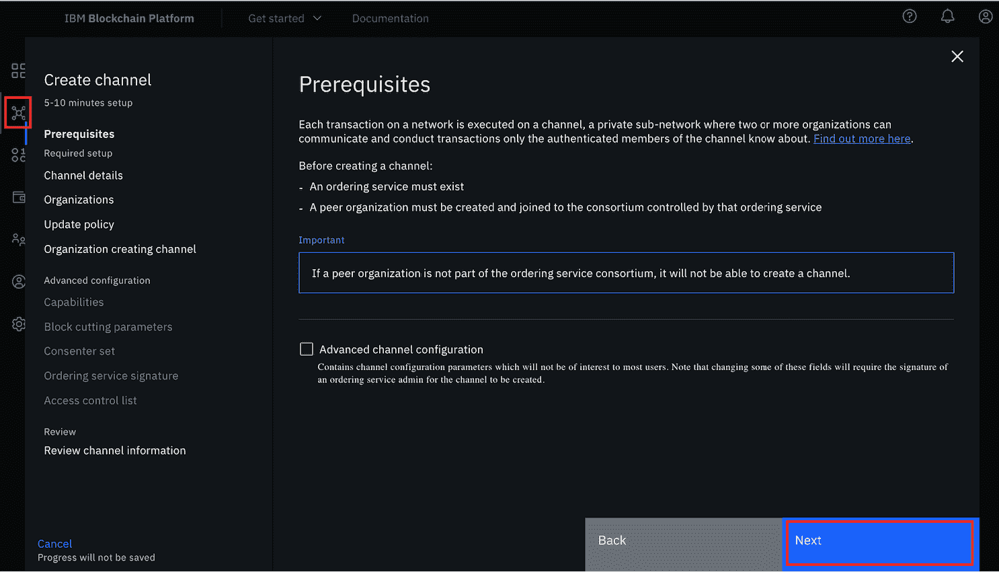

2.  在 **Channel details** 中，为通道提供一个名称。从“Ordering Service”下拉列表中选择您创建的排序者。单击 **Next**。

3.  现在将组织添加到通道中。选择组织（组织的 MSP）作为要构成通道的通道成员（一次选择一个），然后单击 **Add**。为组织选择适当的权限（操作者/编写者/阅读者）。重复此步骤，以将所有必要的组织都添加到通道中。单击 **Next**。 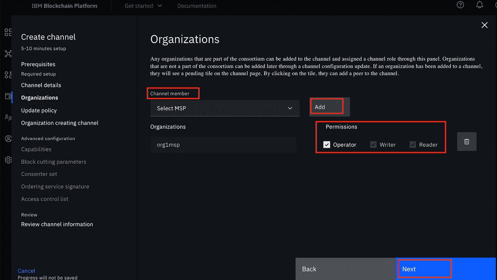

4.  从可用选项中选择适当的通道更新策略，然后单击 **Next**。

5.  接下来是通道创建者组织。选择 **Channel Creator MSP**，并从下拉列表中指出要创建通道的组织。然后，为该组织关联可用的管理员身份，并单击 **Next**。

6.  完成上述所有步骤后，复查通道信息，然后单击 **Create channel**。

11

### 加入通道

1.  导航到左侧导航栏中的 **Channels** 选项卡，然后单击 **Join Channel**。
2.  选择您的排序者，然后单击 **Next**。
3.  提供您在步骤 10 中创建的通道的名称，然后单击 **Next**。
4.  选择要加入通道的同级，然后单击 **Join Channel**。

12

### 打包智能合约

1.  如果使用 Golang 编写智能合约，则应将智能合约存储为 `$HOME/go/src/<chaincode_folder>/<chaincode_file>.go`。将 GOPATH 设置为 `$HOME/go`，将 GOROOT 设置为 `<go install directory>`，并在 PATH 上附加 `$GOROOT/bin`。
2.  在 VS Code 中打开该文件夹，应*仅*使用 Go/Node.js 编写智能合约。如果此文件夹中除了智能合约文件以外还有任何其他文件，那么您在打包智能合约时可能会遇到问题。
3.  按 **F1** 键以查看各种 VS Code 选项。选择 **IBM Blockchain Platform: Package Open Project**。在执行此步骤之前，请确保已安装 Node、NPM 和 Go 并设置了相应的路径。 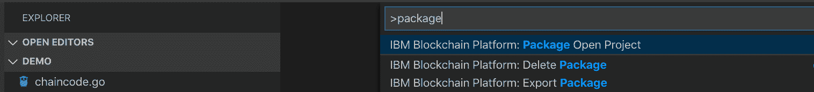

4.  系统将提示您输入包名称和版本。请务必提供适当的版本，因为随后可以升级智能合约来部署更新的版本。在提供此信息后，将创建智能合约包。

5.  在左侧导航面板中，单击 **IBM Blockchain Platform**。在智能合约包下，您应该能看到名为 `<package name>@<version>` 的 .cds 文件。
6.  右键单击该包，单击 **Export Package**，然后保存该文件。

13

### 安装智能合约

1.  导航到 **Smart contracts** 选项卡，然后单击 **Install smart contract**。 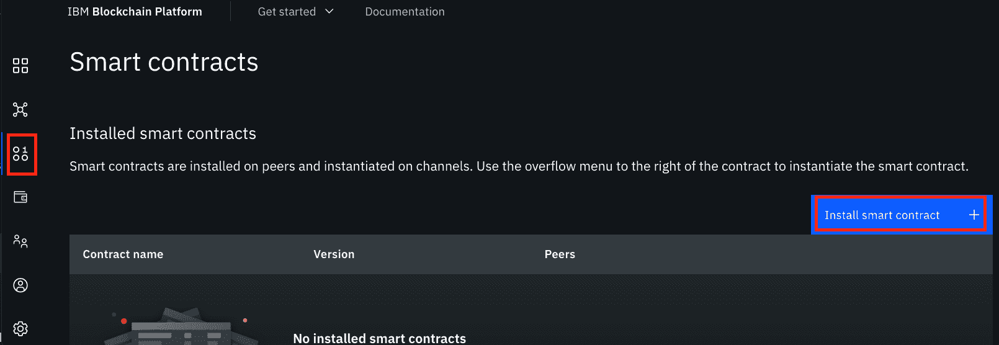

2.  在 **Upload package** 部分中，单击 **Add file**，然后提供要上传的在步骤 12 中使用 VS Code 扩展进行打包的智能合约包文件 (.cds)。 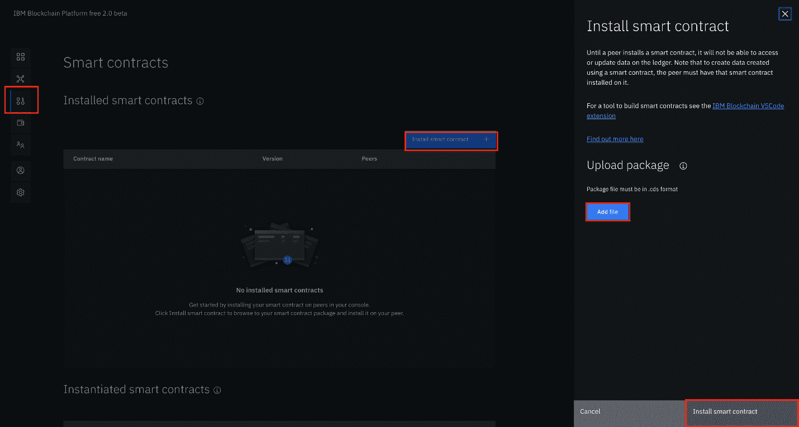

3.  在上传智能合约后，单击 **Install smart contract**。

14

### 实例化智能合约

1.  导航到 **Smart contracts** 选项卡。您应该会看到已安装的智能合约的列表。从列表中找到同级上安装的智能合约，然后从该行右侧的溢出菜单中选择 **Instantiate**。 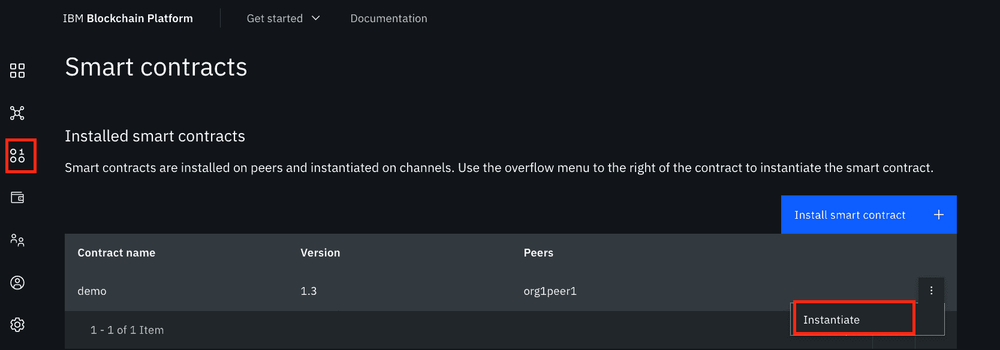

2.  在侧面板上，选择用于实例化智能合约的通道，然后单击 **Next**。

3.  接下来，您需要设置背书策略。选择要包含在背书策略中的组织成员，然后单击 **Next**。
4.  此时，您还可以设置私有数据集合（但此步骤是可选的，我们这次会跳过此步骤）。单击 **Next**。
5.  提供函数名称以使用必需参数来初始化智能合约，然后单击 **Instantiate smart contract**。等到此操作完成。
6.  在实例化后，它将在 **Smart contracts** 选项卡下列示为已实例化的智能合约。

15

### 下载连接配置文件

在成功创建网络并在网络上实例化智能合约后，就可以开始编写能使用任何 Fabric SDK (Node.js/Java) 与区块链网络进行交互的客户端应用程序。SDK 将使用连接配置文件连接到网络。要构建和下载连接配置文件，请导航到 **Organizations** 选项卡，单击组织 MSP 磁贴，然后单击 **Create connection profile**。选择要包含的同级，然后进行下载。 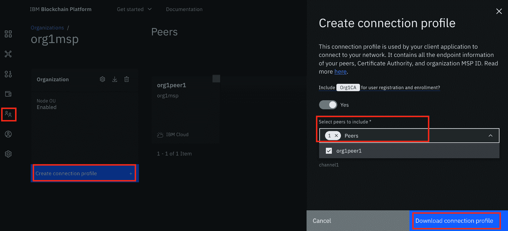

## 结束语

本教程展示了使用 IBM Blockchain Platform 控制台创建区块链网络、在网络上部署智能合约以及下载网络连接配置文件的步骤。IBM Blockchain Platform 是一个高度可定制的平台，通过此平台，您甚至可以在网络中测试、调试和升级已实例化的智能合约。下一步，您可以编写客户端应用程序，以调用智能合约在区块链账本上创建、传输或更新资产。 要了解有关这方面的更多信息，请浏览 IBM Developer Blockchain [Code Pattern](https://developer.ibm.com/zh/patterns/category/blockchain/)。

**最后说明一下：**根据集群中资源的可用情况，可以在网络中添加组件。如果您需要添加更多组件（例如同级或组织），那么可能需要相应地扩展 Kubernetes 集群的大小。

本文翻译自：[Learn step-by-step how to set up a basic blockchain network](https://developer.ibm.com/tutorials/quick-start-guide-for-ibm-blockchain-platform/)（2020-07-10）