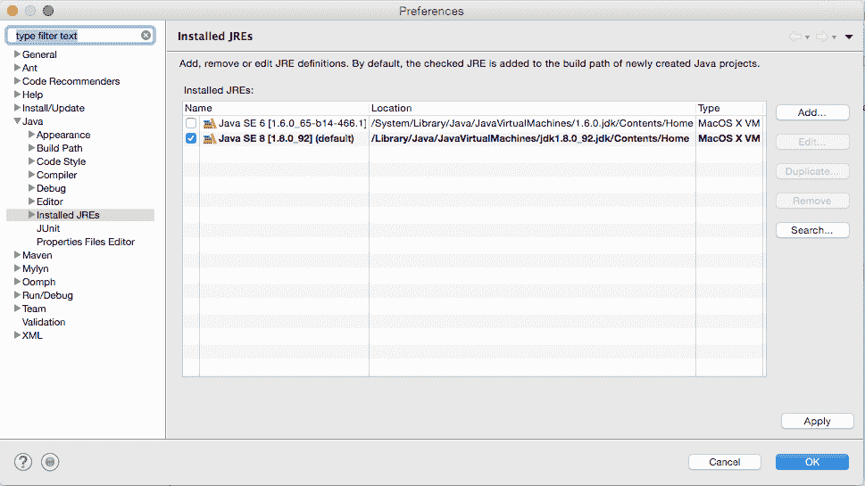

# 设置您的 Java 开发环境并学习基本的面向对象编程的原理

> 原文：[`developer.ibm.com/zh/tutorials/j-introtojava1/`](https://developer.ibm.com/zh/tutorials/j-introtojava1/)

## 开始之前

本教程是 *Java 编程入门* 系列的一部分。

| 级别 | 主题 | 类型 |
| --- | --- | --- |
| **101** | **设置您的 Java 开发环境并学习基本的面向对象编程的原理** | 教程 |
| 102 | Java 语言基础 | 教程 |
| 103 | 编写良好的 Java 代码 | 教程 |
| 201 | 构造真实的应用程序，第 1 部分 | 教程 |
| 202 | 构造真实的应用程序，第 2 部分 | 教程 |

尽管各单元中讨论的概念具有独立性，但实践组件是在您学习各单元的过程中逐步建立起来的，推荐您在继续学习之前复习前提条件、设置和单元细节。

## 目标

在本教程中：

*   了解构成 Java 平台的每个组件的功能
*   了解 Java 语言的结构
*   熟悉 Java API 文档导航
*   下载和安装 JDK 和 Eclipse IDE
*   设置 Eclipse 开发环境
*   了解主要的 Eclipse 组件和如何使用它们执行 Java 开发
*   在 Eclipse 中创建新 Java 项目
*   掌握面向对象范例与结构化编程范例的区别
*   了解对象的关键特征
*   了解面向对象编程 (OOP) 的定义原则带来的好处

## Java 平台概述

Java 技术用于为从消费者设备到异构企业系统的各种环境开发应用程序。在本节中，您将获得 Java 平台及其组件的高级视图。

### Java 语言

跟任何编程语言一样，Java 语言拥有自己的结构、语法规则和编程范例。Java 语言的编程范例基于面向对象编程 (OOP) 的概念，该语言的特性支持这一概念。

Java 语言是 C 语言的一种衍生语言，所以它的语法规则与 C 语言的语法规则非常相似。例如，方法使代码模块化并使用花括号（`{` 和 `}`）分隔，变量需要在使用之前声明。

在结构上，Java 语言以 *包* 作为开头。包是 Java 语言的命名空间机制。包中包含类，而类中包含方法、变量、常量等。您将在 “Java 语言基础”教程中了解 Java 语言的各个部分。

### Java 编译器

在 Java 平台编写程序时，您会在 .java 文件中编写源代码，然后编译它们。编译器针对语言的语法规则来检查代码，然后将 *字节码* 写出到 .class 文件中。字节码是一组需要在 Java 虚拟机 (JVM) 上运行的指令。添加了这一抽象级别后，Java 编译器不同于其他语言编译器，其他编译器会写出适合运行程序的 CPU 芯片集的汇编语言指令。

### JVM

在运行时，JVM 读取并解释 .class 文件，在编写的 JVM 的目标原生硬件平台上执行程序的指令。JVM 解释字节码就像 CPU 解释汇编语言指令一样。不同之处在于，JVM 是一个专为特定平台编写的软件。JVM 是 Java 语言的 “编写一次、随处运行” 原则的核心。您的代码可在任何拥有合适的 JVM 实现的芯片集上运行。JVM 可用于 Linux 和 Windows 等主要平台，在针对移动电话和爱好者芯片的 JVM 中也已实现了 Java 语言的子集。

### 垃圾收集器

Java 平台不会强制您时刻关注内存分配（或使用第三方库来完成此工作），它提供了开箱即用的内存管理功能。当您的 Java 应用程序在运行时创建一个对象实例时，JVM 会自动从 *堆* 中为该对象分配内存空间 — 堆是一个专门留给您的程序使用的内存池。Java *垃圾收集器* 在后台运行，跟踪记录应用程序不再需要哪些对象并从它们回收内存。这种内存处理方法称为 *隐式内存管理*，因为它不需要您编写任何内存处理代码。垃圾收集是 Java 平台性能的基本特征之一。

### Java 开发工具包

下载 Java 开发工具包 (JDK)，您会获得 — 包括编译器和其他工具 — 包含预构建的实用程序的完整类库，以帮助您完成最常见的应用程序开发任务。了解 JDK 包和库的范围的最佳方式是查阅[官方在线 Java API 文档](https://docs.oracle.com/en/java/javase/11/) — 也称为 Javadoc。可观看这个快速演示，了解如何浏览 Javadoc。

[https://cdnapisec.kaltura.com/p/1773841/sp/177384100/embedIframeJs/uiconf_id/44854321/partner_id/1773841?iframeembed=true&playerId=kplayer&entry_id=0_aw74ml1y&flashvars[streamerType]=auto](https://cdnapisec.kaltura.com/p/1773841/sp/177384100/embedIframeJs/uiconf_id/44854321/partner_id/1773841?iframeembed=true&playerId=kplayer&entry_id=0_aw74ml1y&flashvars[streamerType]=auto)

### Java 运行时环境

Java 运行时环境（JRE；也称为 Java 运行时）包含 JVM、代码库和运行以 Java 语言编写的程序所必要的组件。JRE 可用于多种平台。您可依据 JRE 许可条款，在您的应用程序中自由地重新分发 JRE，为应用程序的用户提供一个运行您的软件的平台。JRE 包含在 JDK 中。

## 设置 Java 开发环境

在本节中，将下载并安装 JDK 和 Eclipse IDE 的最新版本，并设置 Eclipse 开发环境。

### 您的开发环境

JDK 包含一组用于编译和运行 Java 代码的命令行工具，其中包括 JRE 的一个完整副本。可以使用这些工具开发应用程序，但大部分开发人员还喜欢 IDE 的其他功能、任务管理和可视界面。

在本学习路径中，您将使用 Eclipse，这是一个流行的开源 IDE。Eclipse 处理代码编译和调试等基本任务，以便您可集中精力编写和测试代码。此外，您可使用 Eclipse 将源代码文件组织到项目中，编译和测试这些项目，然后将项目文件存储在任意多个源代码存储库中。您需要一个已安装的 JDK，才能使用 Eclipse 执行 Java 开发。

### 安装 JDK

按照以下步骤下载并安装 AdoptOpenJDK：

1.  浏览到 [AdoptOpenJDK Installation](https://adoptopenjdk.net/installation.html)。
2.  在 “Archive Files” 下，选择 “OpenJDK 11（LTS）” 版本。
3.  选择 **OpenJ9** 作为 JVM。
4.  在 “Platform” 下拉列表中，选择与您的操作系统和芯片架构匹配的平台。
5.  根据您所用平台的按照说明进行操作（每个平台的说明略有不同，并显示在 “Platform” 下拉菜单下）。

现在，您的计算机上具有 Java 环境。 接下来，您将安装 Eclipse IDE 并在 Eclipse 中创建一个 Java 项目。

### 安装并设置 Eclipse

跟随该视频演示在您的系统上[下载并安装 Eclipse](https://www.eclipse.org/downloads/)，快速浏览 Eclipse，并创建一个 Java 项目。

[https://cdnapisec.kaltura.com/p/1773841/sp/177384100/embedIframeJs/uiconf_id/44854321/partner_id/1773841?iframeembed=true&playerId=kplayer&entry_id=0_p2ru51uv&flashvars[streamerType]=auto](https://cdnapisec.kaltura.com/p/1773841/sp/177384100/embedIframeJs/uiconf_id/44854321/partner_id/1773841?iframeembed=true&playerId=kplayer&entry_id=0_p2ru51uv&flashvars[streamerType]=auto)

### 回顾：Eclipse 开发环境

Eclipse 不仅仅是一个 IDE；它还是一个完整的开发生态系统。本节将简要介绍实际使用 Eclipse 执行 Java 开发。

Eclipse 开发环境有 4 个主要组件：

*   工作区
*   项目
*   透视图
*   视图

Eclipse 中的主要组织单元是 *工作区* 。一个工作区包含您的所有 *项目* 。 *透视图* 是一种查看每个项目的方法（因此而得名“透视图”），一个透视图中包含一个或多个 *视图*。

下图展示了 Java 透视图，它是 Eclipse 的默认透视图。在启动 Eclipse 时可以看到此透视图。

Java 透视图包含开始编写 Java 应用程序所需的工具。上图中所示的每个选项卡式窗口都是 Java 透视图的一个视图。Package Explorer 和 Outline 是两个特别有用的视图。

Eclipse 环境是高度可配置的。每个视图都可停靠，所以可以在 Java 透视图中移动它们，将它们放在想要放置的位置。但就现在而言，我们将保持默认的透视图和视图设置。

您现在已创建了一个新的 Eclipse Java 项目和源代码文件夹。您的开发环境已经准备好大显身手。但是，理解 OOP 范例（本教程中的接下来两节将会介绍）至关重要。

## 面向对象编程的概念和原理

Java 语言（基本上）是面向对象的。本节将介绍 OOP 语言概念，并使用结构化编程作为一个对比。

### 什么是对象？

面向对象的语言遵循的编程模式不同于结构化编程语言，比如 C 和 COBOL。结构化编程范例是高度面向数据的：您拥有数据结构，然后程序指令会处理该数据。面向对象的语言（比如 Java 语言）将数据和程序指令组合到 *对象* 中。

对象是一个独立的实体，它仅包含属性和行为，不含其他任何东西。在面向对象的语言中，数据和程序逻辑被组合在一起，而不是通过字段（属性）提供一个数据结构，并将该结构传递给处理它的所有程序逻辑（行为）。这种组合可能出现在完全不同的粒度级别上，从细粒度的对象（比如 `Number`）到粗粒度的对象（比如一个大型银行应用程序中的 `FundsTransfer` 服务）。

#### 父对象和子对象

*父对象* 用作派生更复杂的 *子对象* 的结构基础。子对象看起来类似于父对象，但更加特殊化。在面向对象的范例中，可以重用父对象的通用属性和行为，也可以向子对象添加不同的属性和行为。

#### 对象通信和协调

对象通过发送消息（在 Java 用语中称为 *方法调用* ）与其他对象进行通信。此外，在面向对象的应用程序中，程序代码会协调对象之间的活动，以便在特定应用程序域的上下文内执行任务。

#### 对象总结

一个精心编写的对象：

*   有明确定义的边界
*   执行一组有限的活动
*   只知道它的数据和它完成活动所需的其他所有对象

实质上，对象是一个离散的实体，它仅在其他对象上拥有必要的依赖关系来执行其任务。

是时候看看 Java 对象看起来像什么了。

### 示例：person 对象

第一个示例基于一种常见的应用程序开发场景：一个通过 `Person` 对象表示的人。

从对象的定义可以知道，一个对象有两个主要元素：属性和行为。下面将介绍这些元素如何应用到 `Person` 对象。

根据经验，可将对象的属性视为 **名词** ，将行为视为 **动词** 。

#### 属性（名词）

一个人可能有哪些属性？一些常见属性包括：

*   名称
*   年龄
*   身高
*   体重
*   眼睛颜色
*   性别

您可能会想到更多属性（而且始终可以在以后添加更多属性），但此列表是一个不错的开端。

#### 行为（动词）

一个真正的人可以做各种各样的事，但对象行为通常与某种应用程序上下文相关。例如，在业务应用程序上下文中，您可能想询问您的 `Person` 对象，”您的体重指数 (BMI) 是多少？”作为响应，`Person` 将使用它的身高和体重属性的值来计算 BMI。

`Person` 对象内部可能隐藏着更复杂的逻辑，不过现在，我们假设 `Person` 具有以下行为：

*   计算 BMI
*   输出所有属性

#### 状态和字符串

*状态* 是 OOP 中的一个重要概念。对象的状态在任何时刻都由它的属性的值来表示。

对于 `Person`，它的状态由姓名、年龄、身高和体重等属性来定义。如果想提供多个属性的列表，可以使用 `String` 类来完成此任务，稍后我们会更详细地介绍该类。

结合使用状态和字符串的概念，您可以对 `Person` 说：“向我提供你的属性列表（或 `String`）来告诉我你是谁”。

### OOP 的原则

如果您拥有结构化编程背景，您可能还不清楚 OOP 的价值主张。毕竟，一个人的属性和检索（并转换）这些值的任何逻辑都可使用 C 或 COBOL 编写。如果理解了 OOP 的定义原则，OOP 范例的优势就会更加明显： *封装*、 *继承* 和 *多态性*。

#### 封装

回想一下，对象是离散的（或独立的）。此特征就是 *封装* 的工作原理。 *隐藏* 是另一个有时用于表达对象的独立、受保护性质的术语。

无论使用哪个术语，重要的是对象在它的状态和行为与外部世界之间保持一个界线。像真实世界中的物体一样，计算机编程中使用的对象与使用它们的应用程序中的不同类别的对象之间有着各种各样的关系。

在 Java 平台上，可以使用 *访问修饰符* （将在后面介绍）将对象关系从 *公共* 改为 *私有*。公共访问是完全开放的，而私有访问意味着对象的属性只能在对象自身内访问。

公共/私有边界实施了面向对象的封装原则。在 Java 平台上，可以逐个对象地改变该边界的强度。封装是 Java 语言的一个强大特性。

#### 继承

在结构化编程中，常常会复制一个结构，为它提供一个新名称，然后添加或修改属性，使新实体（比如一个 `Account` 记录）不同于它的原始来源。随着时间的推移，此方法会生成大量重复代码，这可能带来维护问题。

OOP 引入了 *继承* 的概念，特殊化的类（无需额外的代码）可”复制”它们要特殊化的来源类的属性和行为。如果需要更改其中一些属性或行为，可以重写它们。您更改的唯一的源代码是创建特殊化的类所需的代码。源对象称为 *父对象* ，新的特殊化对象称为 *子对象* — 我们已介绍过这两个术语。

假设您正在编写一个人力资源应用程序，并想要使用 `Person` 类作为一个名为 `Employee` 的新类的基类（也称为 *超类*）。作为 `Person` 的子类， `Employee` 将拥有 `Person` 类的所有属性，以及更多属性，比如：

*   纳税人识别编号
*   员工编号
*   工资

继承使创建新的 `Employee` 类变得很容易，不需要手动复制所有 `Person` 代码。

#### 多态性

多态性是一个比封装和继承更难掌握的概念。事实上，多态性表示属于某个分层结构的同一个分支的对象，在发送相同的消息时（也就是说，在被告知做同一件事时）可通过不同方式表明该行为。

要了解如何将多态性应用到业务应用程序上下文中，可返回到 `Person` 示例。还记得告诉 `Person` 将它的属性格式化成一个 `String` 吗？多态性使 `Person` 可以依据它的 `Person` 类型，以各种不同的方式表示它的属性。

多态性是在 Java 平台上的 OOP 中将会遇到的更复杂概念之一，不属于此入门课程的讨论范围。后续小节将更深入地探索封装和继承。

### 不是纯粹的面向对象语言

有两种性质可区分 Java 语言与纯粹的面向对象语言（比如 Smalltalk）。首先，Java 语言是对象和原语类型的。其次，可以使用 Java 编写代码，将一个对象的内部情况向其他任何使用它的对象公开。

Java 语言为您提供了必要工具来遵循合理的 OOP 原则，并生成合理的面向对象的代码。因为 Java 不是纯粹面向对象的语言，所以必须在编写代码的方式上运用一些规则 — 该语言不会强制要求执行正确的操作，所以您必须学会自我约束。“编写良好的 Java 代码” 部分中将提供一些技巧。

## 结束语

在本教程中，您学习了面向对象编程，还熟悉了一种可帮助控制开发环境的 IDE。

### 下一步

本系列的下一个教程 专注于 Java 语言的基础知识，为您提供了充足的编写简单程序的知识和实践。

本文翻译自：[Set up your Java development environment and learn basic object-oriented programming principles](https://developer.ibm.com/tutorials/j-introtojava1/)（2020-02-21）