# 在贷款部门平台中注入 AI

> 原文：[`developer.ibm.com/zh/tutorials/infuse-a-loan-department-platform-with-ai/`](https://developer.ibm.com/zh/tutorials/infuse-a-loan-department-platform-with-ai/)

构建[实现银行贷款部门现代化](https://developer.ibm.com/zh/articles/modernizing-your-bank-loan-department)应用程序包括多个步骤。本教程解释了其中一个步骤：在平台中注入人工智能 (AI)。在通过 IBM Watson® Knowledge Catalog [处理信用风险数据](https://developer.ibm.com/tutorials/implement-data-governance-to-manage-and-secure-clients-data)以执行自定义操作（如创建数据类、业务术语和掩盖数据）后，将这些数据移交给数据研究人员以执行进一步的操作。

如下图中所示，在此阶段，您将使用 IBM Cloud Pak® for Data 中提供的两个服务来构建和部署机器学习模型。数据研究人员将创建一个模型管道，该管道可以探索数据、直观显示数据、构建机器学习模型、运行预测以及使用 Watson Studio 评估模型。然后将此模型部署在 IBM Cloud Pak for Data 中，供外部应用程序使用 Watson Machine Learning 服务进行访问。

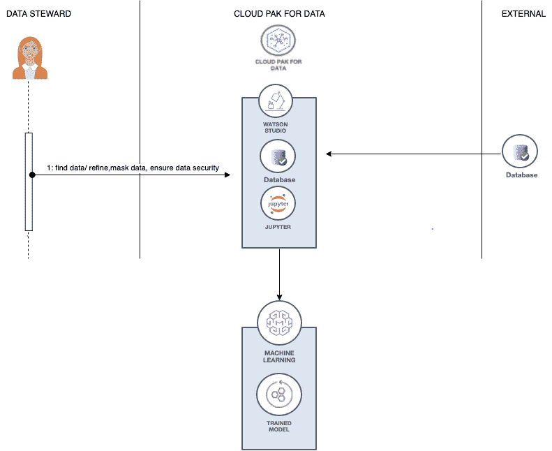

## Jupyter Notebook 中的机器学习

首先，我们将探索数据集并构建一个预测模型，该模型可用于确定信用贷款是否存在风险。在此用例中，您要构建的机器学习模型是一个分类模型，该模型将返回“存在风险”（根据申请人在贷款申请中的输入，预测存在很大的违约风险）或“无风险”（根据申请人的输入，预测可以还清贷款）预测。我使用了一些非常受欢迎的库和框架，通过 Jupyter Notebook 用 Python 语言构建该模型。在构建该模型后，您可以部署该模型，以便其他人可以使用该模型。

## 步骤 1\. 创建项目和部署空间

首先将创建一个项目和一个部署空间。

### 创建一个新项目

启动浏览器，并浏览至 IBM Cloud Pak for Data 部署。

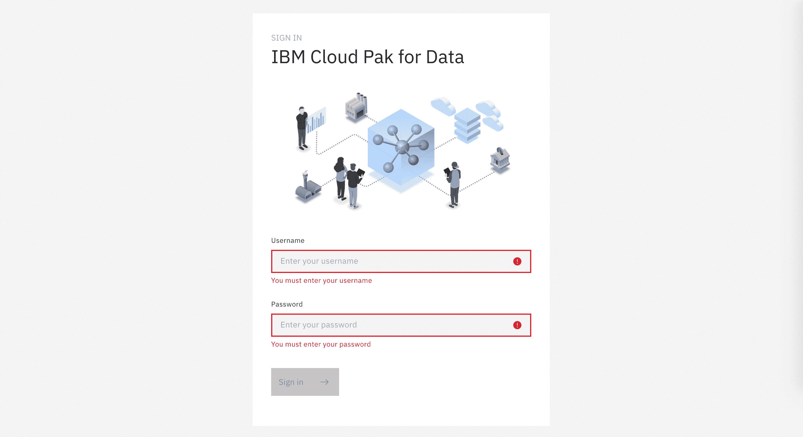

在 IBM Cloud Pak for Data 中，我使用一个项目来收集和组织资源以实现特定目标，例如，用于构建问题解决方案的资源。您的项目资源可能包括数据、合作者以及诸如 Notebook 和模型之类的分析资产。

1.  转至 (☰) 菜单并单击 **Projects**。

    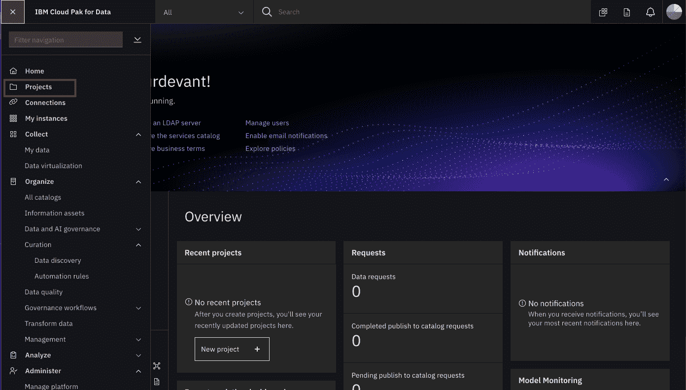

2.  单击 **New project +**。

    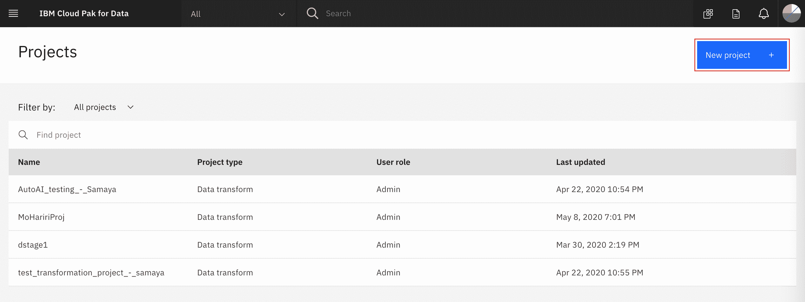

3.  针对项目类型选择 **Analytics project**，然后单击 **Next**。

    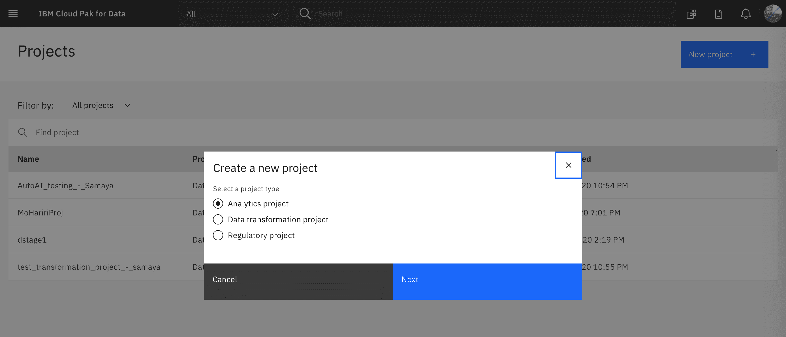

4.  通过选择 **Create an empty project** 来创建一个空项目。

    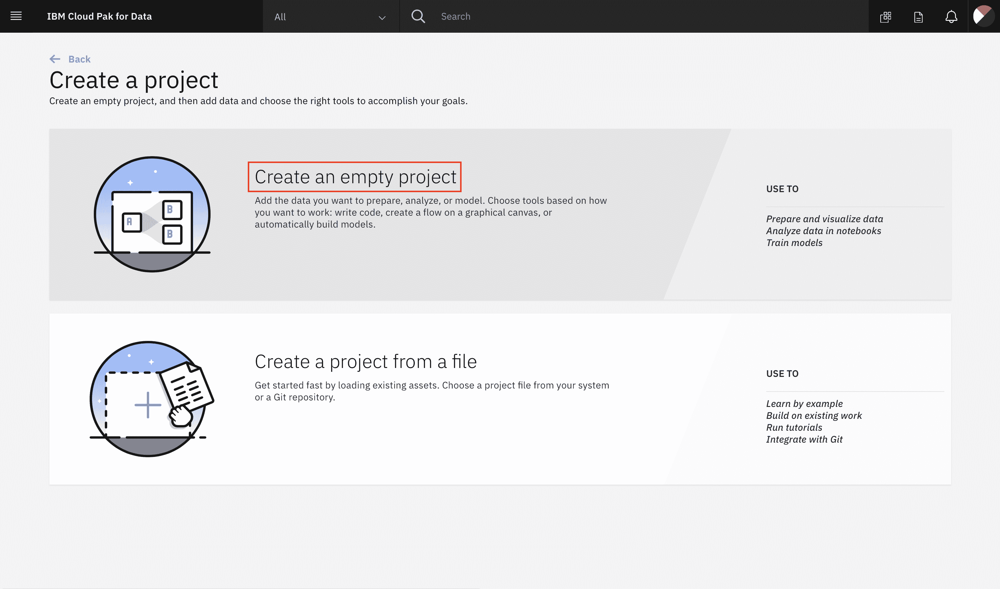

5.  为该项目命名，然后单击 **Create**。

    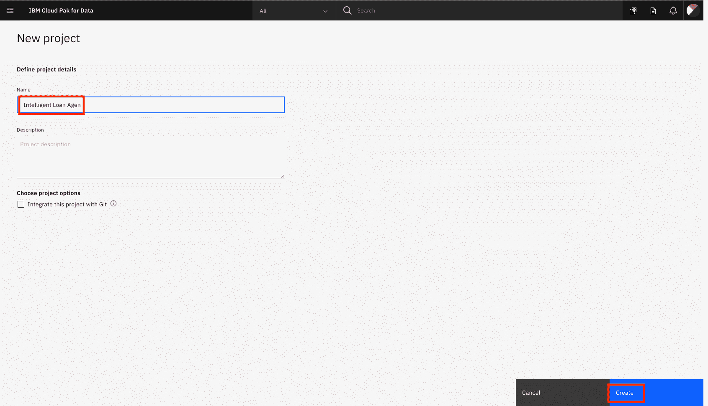

### 创建部署空间

IBM Cloud Pak for Data 使用部署空间来配置和管理一组相关资产的部署（这些资产是可部署的）。这些资产可以是数据文件或机器学习模型等。

1.  转至 (☰) 菜单并单击 **Analyze**，然后单击 **Analytics deployments**。

    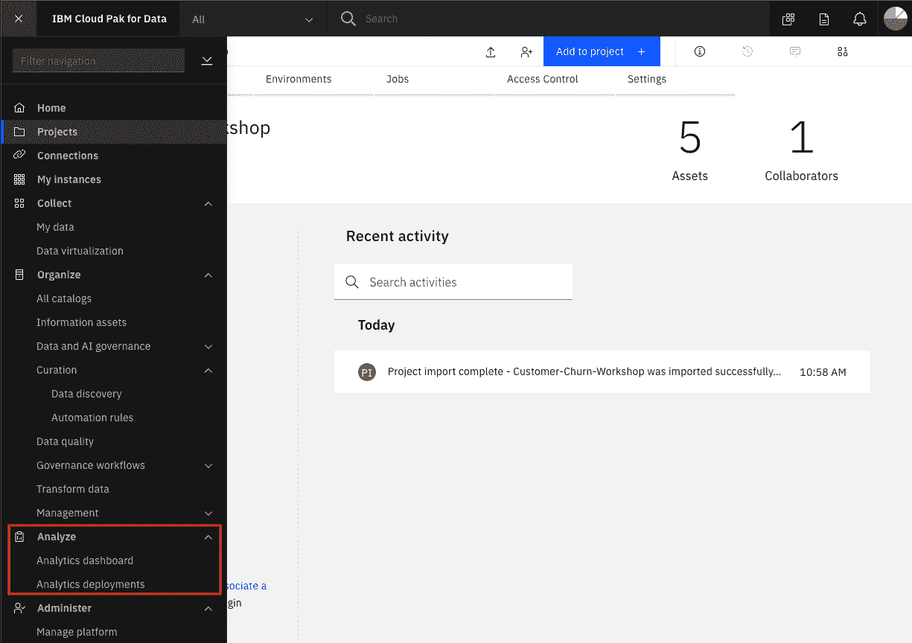

2.  选择 **Create an empty space**。

    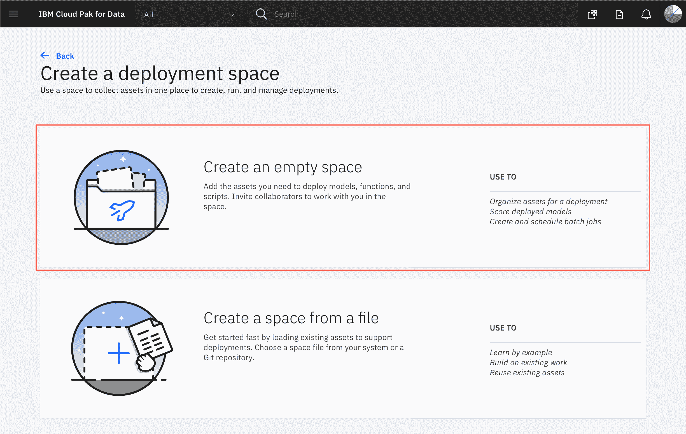

3.  为部署空间提供唯一名称和描述（可选），然后单击 **Create**。稍后部署机器学习模型时将使用此空间。

    

## 步骤 2\. 加载并运行 Jupyter Notebook

### 加载数据集

对于数据集，您将使用[德国信用风险](https://s3.us.cloud-object-storage.appdomain.cloud/developer/default/tutorials/infuse-a-loan-department-platform-with-ai/static/german_credit_data.csv)数据集。

1.  在项目概述页面中，单击 **Add to project +** 以启动“Choose asset type”窗口。

    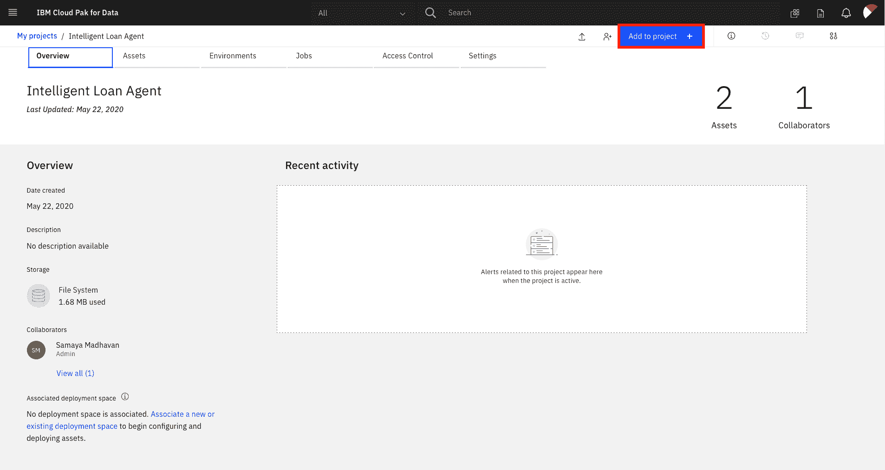

2.  从选项中选择 **Data**，然后上传 .csv 文件。

    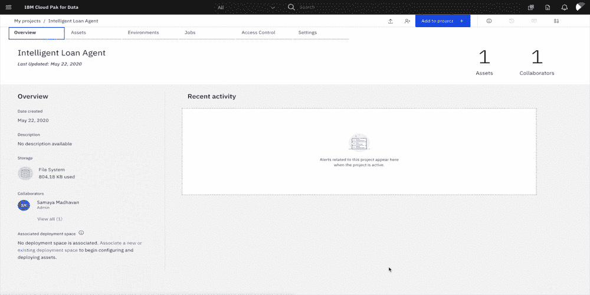

    **注意**：如果您是在学完[上一个教程](https://developer.ibm.com/tutorials/implement-data-governance-to-manage-and-secure-clients-data)后继续学习本教程，并且在 Watson Knowledge Catalog 中创建了一个目录，请切换到 Catalog 选项卡，从 **ADD FROM CATALOG** 下拉菜单中选择该目录，然后选择 CSV 文件。

    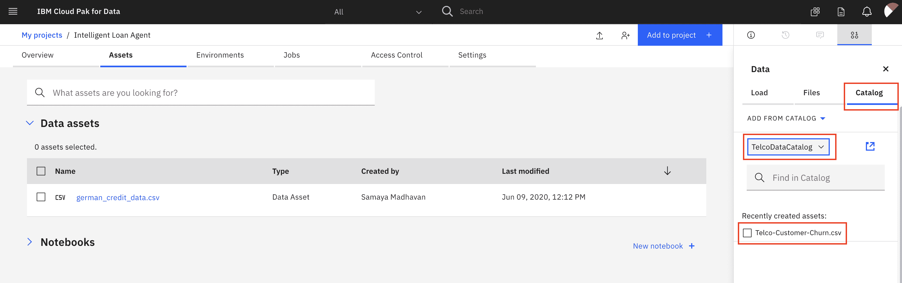

### 加载 Jupyter Notebook

对于 Notebook，您将使用 [machinelearning-creditrisk-sparkmlmodel.ipynb](https://s3.us.cloud-object-storage.appdomain.cloud/developer/default/tutorials/infuse-a-loan-department-platform-with-ai/static/machinelearning-creditrisk-sparkmlmodel.ipynb)。此外还提供了 Notebook 的副本，其中包含[运行完所有单元后保存的结果](https://s3.us.cloud-object-storage.appdomain.cloud/developer/default/tutorials/infuse-a-loan-department-platform-with-ai/static/all-machinelearning-creditrisk-sparkmlmodel.ipynb)。

1.  在项目概述页面中，单击 **Add to project +** 以启动“Choose asset type”窗口。

    

2.  从选项中选择 **Notebook**，然后切换到 **From file** 选项卡。

    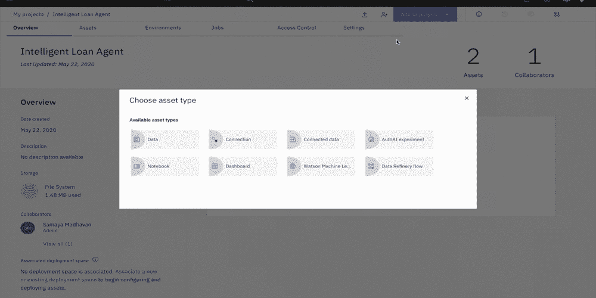

3.  单击 **Drag and drop files here or upload**，上传 machinelearning-creditrisk-sparkmlmodel Notebook，然后单击 **Create notebook**。这将加载 Jupyter Notebook。

### 运行该 Notebook

Notebook 由文本（markdown 或 heading）单元和代码单元组成。markdown 单元提供有关代码设计功能的注释。您可以通过突出显示每个单元并单击 Notebook 顶部的 **Run** 来单独运行单元，也可以使用键盘快捷键来运行单元（**Shift + Enter**，但这可能因平台而异）。运行单元时，在单元左侧会显示一个星号 (`[*]`)。运行完该单元后，会显示一个序号（例如，`[17]`）。

**注意：**Notebook 中的某些注释可以指导您修改代码的特定部分。在运行和执行单元之前，按照指示执行所有更改。

#### 加载和准备数据集

加载完 Jupyter Notebook 并且内核准备就绪后，就可以执行该 Notebook。单击右上角的铅笔图标以运行或编辑该 Notebook。


1.0 必需安装的软件包部分将安装要在 Notebook 中使用的一些库（许多库已预先安装在 IBM Cloud Pak for Data 上）。注意升级已安装的 Watson Machine Learning Python 客户端版本。查看第一个代码单元的输出，确保已成功安装 Python 软件包。

2.0 加载和清除数据部分将加载要用于构建机器学习模型的数据集。将数据导入到该 Notebook，使用 Watson Studio 的代码生成功能。

1.  通过单击代码单元来使其突出显示。确保将光标置于 **# Place cursor below and insert the Pandas Dataframe for the Credit Risk Data** 行下方。
2.  单击该 Notebook 右上角的 10/01 Find data 图标，以查找您必须导入的数据资产。
3.  使用先前导入到项目的数据集的 german_credit_data.csv 文件版本。
4.  对于您的数据集，单击 **Insert to code**，然后选择 **Insert Pandas DataFrame**。此时会在下面的单元中添加用于将数据引入到 Notebook 环境并创建 Pandas DataFrame 的代码。
5.  运行该单元，您将看到数据集的前五行。

    

**注意**：由于您是使用已生成的代码来导入数据，因此必须更新下一个单元才能分配 `df` 变量。复制上一个单元中生成的变量（类似于 `df=data_df_1` 或 `data_df_2`），并将其分配给 `df` 变量（例如，`df=df_data_1`）。

继续运行第 2 部分中的其余单元，以探索和清除数据。

#### 构建机器学习模型

在 3.0 创建模型部分中，运行相关步骤来构建模型管道。您将数据拆分为训练数据和测试数据，对分类字符串值进行编码，使用随机森林分类器算法创建模型，然后根据测试集评估模型。运行第 3 部分中的所有单元以构建模型。

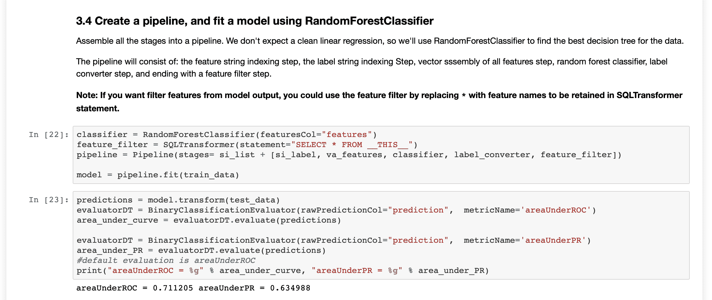

#### 保存模型

4.0 保存模型部分会将模型保存到项目中。

1.  保存模型并将其部署到 IBM Cloud Pak for Data 平台内的 Watson Machine Learning 服务中。在下一个代码单元中，请务必更新 `wml_credentials` 变量。

该 url 应该为 IBM Cloud Pak for Data 实例的完整主机名，您可以从浏览器地址栏中复制此主机名（例如，`https://zen.clustername.us-east.containers.appdomain.cloud`）。用户名和密码应与您用于登录 IBM Cloud Pak for Data 的凭证相同。

1.  更新 `MODEL_NAME` 和 `DEPLOYMENT_SPACE_NAME` 变量。使用易于识别的唯一模型名称。

    ```
     MODEL_NAME = "MY_NAME RISK MODEL"
     DEPLOYMENT_SPACE_NAME = "MY_NAME RISK MODEL DEPLOYMENT" 
    ```

2.  继续运行该部分中的单元，以将模型保存到 IBM Cloud Pak for Data 中。

您已成功地以编程方式构建并保存了机器学习模型。

**注意**：确保在完成后停止 Notebook 内核，以便节省资源。为此，请转至项目的 Asset 页面，针对正在运行的 Notebook 选择 Action 列下的三点图标，然后从 Actions 菜单中选择 **Stop Kernel**。如果您在该 Notebook 上看到一个锁定图标，单击该图标以解锁该 Notebook，然后才能停止内核。

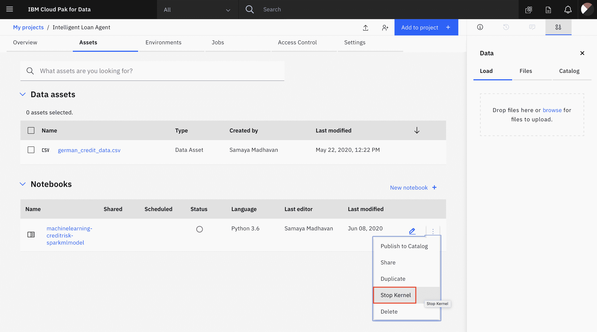

## 结束语

在本教程中，您学习了数据研究人员如何使用 IBM Cloud Pak for Data 中可用的服务来构建分类模型，以预测信用贷款存在风险的可能性。您学习了如何使用 Watson Studio 中的 Jupyter Notebook 来构建模型及如何使用 Watson Machine Learning SDK 保存模型等。

本教程是[实现银行贷款部门现代化](https://developer.ibm.com/zh/articles/modernizing-your-bank-loan-department)系列教程的一部分。接下来，您将学习如何通过 Flask 应用程序使用这个已部署模型并将其部署到 OpenShift® 集群上，以及贷款代理和客户如何使用此应用程序来预测风险。

本文翻译自：[Infuse a loan department platform with AI](https://developer.ibm.com/tutorials/infuse-a-loan-department-platform-with-ai/)（2020-09-17）