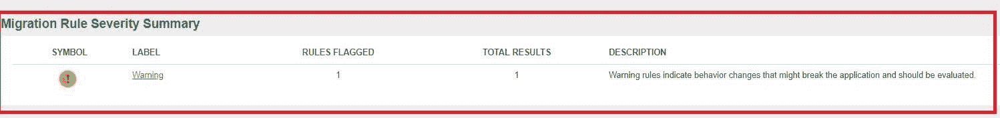
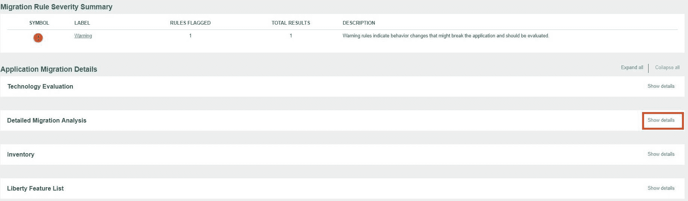
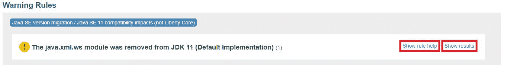
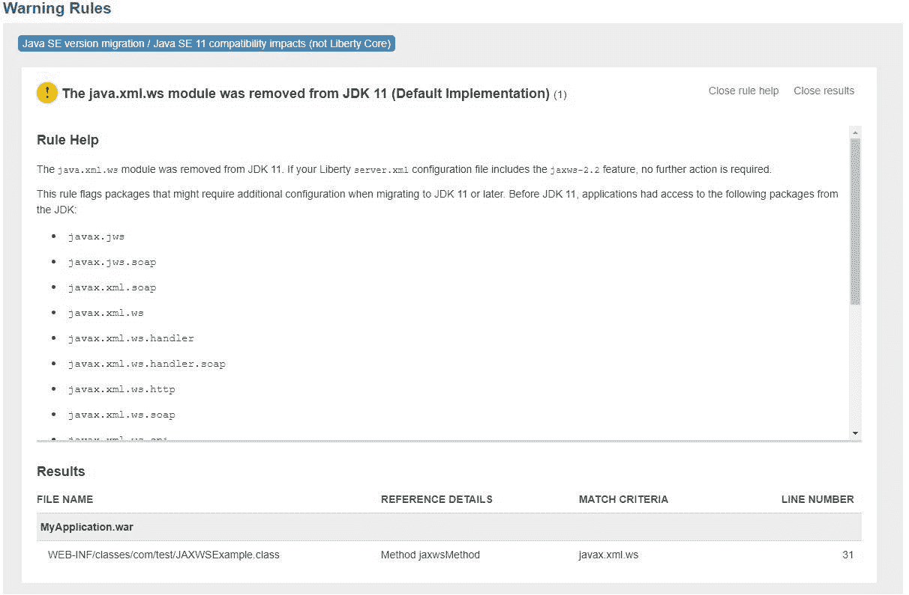

# 轻松迁移至 Java 11

> 原文：[`developer.ibm.com/zh/tutorials/migration-to-java-11-made-easy/`](https://developer.ibm.com/zh/tutorials/migration-to-java-11-made-easy/)

*本文内容有所更新。Migration Toolkit for Application Binaries 现在支持迁移到 Java 14。详情可以查看“注释” 部分信息。*

## 前言

您是否有应用程序正在 Java 8（甚至 Java 7）上运行，并且想知道需要执行多少工作才能让应用程序在 Java 11 上运行？[Migration Toolkit for Application Binaries](https://developer.ibm.com/wasdev/downloads/#asset/tools-Migration_Toolkit_for_Application_Binaries) 可以帮助到您！该工具可以扫描您的应用程序，发现迁移至 Java 11 时可能会遇到的任何潜在问题。

## 关于 Migration Toolkit for Application Binaries

[Migration Toolkit for Application Binaries](https://developer.ibm.com/wasdev/downloads/#asset/tools-Migration_Toolkit_for_Application_Binaries) 已经存在多年，可以帮助开发者从本地和云端的各种 Java SE 和应用程序服务器环境中进行迁移。多年来，我们增加了对以下场景的支持：帮助开发者升级到更新的 Java SE 级别。我们之前添加了迁移规则，用于标记从 Java 6 迁移至 Java 7 以及从 Java 7 迁移至 Java 8 时遇到的问题。现在，我们支持从 Java 8 迁移至 Java 11。您可能会问：“Java 9 和 10 发生了什么？”对于 Java 9 和 10，Oracle 宣布这些版本只有短期支持（六个月），我们由此认为大多数开发者都会通过长期支持的发行版（即 Java 11）进行大规模的迁移工作。本教程着重从 Java 11 角度介绍一些有趣的工具相关功能部件；如果您想了解有关其他方案的更多信息，可访问该工具的[下载页面](https://developer.ibm.com/wasdev/downloads/#asset/tools-Migration_Toolkit_for_Application_Binaries)，上面提供的众多资源。

## 解决迁移至 Java 11 时遇到的问题

[Liberty for Java™](https://cloud.ibm.com/catalog/starters/liberty-for-java?cm_sp=ibmdev-_-developer-tutorials-_-cloudreg): 在 IBM Cloud 上 轻松开发、部署、扩展 Java web 应用。

在迁移至 Java 11 时，应用程序开发者遇到的最大障碍之一就是[从 JDK 中删除 Java EE 模块](https://openjdk.java.net/jeps/320)。这意味着，如果您的应用程序正在使用其中任何模块内的任何类（javax.jws、javax.xml.ws 等中的类），这些应用程序将无法在 Java 11 上运行，因为它们无法访问这些类。这是坏消息。不过好消息是，Liberty 团队做了大量工作，当您在 Liberty 应用程序服务器（Open Liberty 和 WebSphere Liberty）上迁移至 Java 11 时，使得删除的 Java EE 模块变为可用。 对于缺失的 Java EE 程序包，只需向 server.xml 添加正确的功能部件，您的应用便可再次运行。

[WebSphere Application Server on IBM Cloud](https://cloud.ibm.com/catalog/services/websphere-application-server?cm_sp=ibmdev-_-developer-tutorials-_-cloudreg): 在 IBM Cloud 上体验 WebSphere Application Server。

那么，如何知道应用程序是否正在使用任何已删除的程序包呢？如何知道要启用哪些 Liberty 功能部件呢？Java 11 引入的其他更改如何应对？如何处理这些问题？该工具可以就此提供帮助。我建议您使用 [Migration Toolkit for Application Binaries](https://developer.ibm.com/wasdev/downloads/#asset/tools-Migration_Toolkit_for_Application_Binaries) 着手开展工作。该工具将扫描您的应用程序二进制文件（.ear 或 .war 文件）并生成一份报告，突出显示在您的应用程序中发现的任何潜在的 Java 11 问题。如果您正在使用 Eclipse，该工具还有一个 [源扫描程序版本](https://developer.ibm.com/wasdev/downloads/#asset/tools-WebSphere_Application_Server_Migration_Toolkit)，用于检查源代码，并标记二进制扫描程序查找的相同问题。当您确定需要在应用程序中更改源代码时，这个源扫描程序工具将很有用，因为它使您能够导航到需要处理的确切代码行。关于如何使用源扫描程序迁移至 Java 11，您可以观看这个[视频](https://youtu.be/m-l9eu4AAq4)。本教程重点介绍二进制扫描程序，因为这是准备迁移应用程序的第一步。

## 运行二进制扫描程序来查找 Java 11 问题

1.下载 [Migration Toolkit for Application Binaries](https://developer.ibm.com/wasdev/downloads/#asset/tools-Migration_Toolkit_for_Application_Binaries)。

2.在命令提示符窗口中，运行以下命令来安装该工具：

```
 java -jar binaryAppScannerInstaller.jar 
```

3.按照提示阅读/接受许可证，并指定产品文件的目标目录（按 **Enter** 键可在当前目录中安装）。

4.更改目录：

```
 cd <target directory>\wamt 
```

5.现在，您已准备好对您的应用程序运行该工具。您需要指定有关场景的一些信息，以便标记相关的迁移规则：

*   要对其运行该工具的应用程序
*   要迁移的 Java 版本以及要迁移至的 Java 版本

    以下是我运行的命令，用于告知二进制扫描程序我要从 Java IBM 8 迁移至 Java 11：

```
 java -jar binaryAppScanner.jar C:\demo\Apps\MyApplication.war --analyzeJavaSE --sourceJava=ibm8 --targetJava=java11 
```

6.运行报告需要几秒钟/分钟，具体取决于应用程序的大小。运行完成后，将生成一份 HTML 报告。生成的 HTML 报告的顶部显示该工具标记了多少个问题（如果有）。HTML 报告包括四个部分：

*   应用程序评估报告
*   应用程序库存报告
*   详细的迁移分析报告
*   Liberty 功能部件列表配置

    可随意阅读整个报告，但此处我真正感兴趣的是详细的迁移分析报告。就我而言，我对使用一些 javax.xml.ws 类的应用程序运行了报告。因此，我收到的这份报告显示我有一条标记的警告规则：

    

7.要了解有关已标记问题的更多信息，可转到 “Detailed Migration Analysis” 部分，然后单击 **Show details** 按钮：



8.您现在会看到所有已标记规则的列表。规则的标题表明我的问题与 JDK 11 中删除的 java.xml.ws 模块有关。要了解如何解决此问题，可单击 **Show rule help** 按钮以获取更多信息。如果您对使用这些程序包的类感到好奇，可单击 **Show results**。



9.在阅读规则帮助后，我了解了如何解决该问题。就我而言，我看到如果我想重新获得对已删除的 java.xml.ws 模块程序包的访问权限，解决方案就是将 jaxws-2.2 功能部件添加到我的 Liberty server.xml 文件中。我将该功能部件添加到 Liberty server.xml 文件（如果之前没有该功能部件），现在我的应用再次开始工作！（如果您有使用 Java 11 运行的 Liberty 服务器，可查看 Andy Guibert 关于[使用 Java 11 运行 Liberty](https://openliberty.io/blog/2019/02/06/java-11.html) 的博客。即使没有，也可以查看这篇博客 – 这篇博文写得很棒！）



该工具正在扫描许多迁移规则。对于每条规则，我们都包含了迁移建议和一些链接，可帮助您解决这些问题。您将需要浏览每条规则并阅读帮助，确定适合您的应用程序的正确操作过程。运行以下命令，可获得有关可用二进制扫描程序参数的更多信息：

```
java -jar binaryAppScanner.jar --help --all 
```

### 注释

*   迁移工具可帮助开发者从各种 Java 环境迁移，包括从其他应用程序服务器迁移至 Liberty 或 WebSphere Traditional、从 WebSphere Traditional 迁移至 Liberty、从本地迁移至云端，以及开发者可能需要帮助迁移其应用的其他场景。

*   对于 Open Liberty 和 WebSphere Liberty，这些工具的运行方式都是一样的。

*   将迁移规则添加到应用程序迁移工具后，我们已设法在工具中包含尽可能多的检测内容。但是，某些 Java 11 更改超出了工具的范围，因而无法被检测到，例如证书更改和其他删除的 JVM 选项。该工具仅尝试解决与应用程序相关的问题，如果您对 Java 11 中的所有更改感到好奇，可查看 [Oracle 的 JDK 11 迁移指南](https://docs.oracle.com/en/java/javase/11/migrate/index.html#JSMIG-GUID-C25E2B1D-6C24-4403-8540-CFEA875B994A)。

*   **更新**（20.0.0.2 及更高版本）：改迁移工具目前支持迁移到 Java 14。新增 `java14` `targetJava` 值。比如，从 Java 8 迁移至 Java 14，我可以使用以下命令：

    ```
     java -jar binaryAppScanner.jar C:\demo\Apps\MyApplication.war --sourceAppServer=liberty --targetAppServer=liberty --sourceJava=ibm8 --targetJava=java14 
    ```

    *   **注意：** Java 14 是非长期支持（non-LTS，Long Term Support）Java 版本，仅支持 6 个月时间。 要迁移至 Java 长期支持版本，您可以迁移到 Java SE 11。

本文翻译自：[Migration to Java 11 made easy](https://developer.ibm.com/tutorials/migration-to-java-11-made-easy/)（2020-09-02）