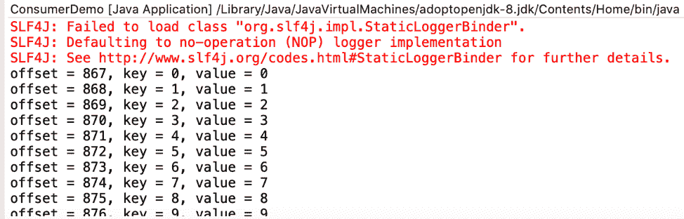

# 开发 Java 程序以在 Apache Kafka 中生成和消费消息

> 原文：[`developer.ibm.com/zh/tutorials/apache-kafkas-producer-api-and-consumer-api/`](https://developer.ibm.com/zh/tutorials/apache-kafkas-producer-api-and-consumer-api/)

[Apache Kafka](https://kafka.apache.org/) 是一个事件流平台，可帮助开发者实现事件驱动型架构。Kafka 的模型是一个应用程序（而不是 REST API 点对点通信模型），它可以生成消息（事件）并将其发送到管道，然后消费者就可以消费这些消息（事件）。生产者并不知道谁会消费其数据以及怎样消费这些数据。同样，消费者可以随时消费队列中的消息，而不必与生产者联系。这种架构会使事件驱动型架构所依赖的生产者和消费者解耦。

Kafka 网站上提供的[快速入门](https://kafka.apache.org/quickstart)很好地解释了 Kafka 各个组件的工作方式，即，如何通过在命令行中运行 shell 脚本来手动与 Kafka 进行交互。在本教程中，我将概述如何以编程方式使用 Kafka 生产者 API（Producer API）和消费者 API （Consumer API）与 Kafka 进行交互。

## 学习目标

本教程的目标是演示如何编写 Java 程序以便在 Apache Kafka 中生成和消费消息。由于需要投入一定的时间和计算能力才能创建和维护 Kafka 集群，因此我将用 IBM Cloud 上的 IBM Event Streams 来演示，它是一个完全托管的 Kafka 实例。

完成本教程后，您将了解：

*   Apache Kafka 简介
*   如何以编程方式在 Kafka 中生成消息
*   如何以编程方式在 Kafka 中消费消息
*   IBM Event Streams 简介
*   如何使用 IBM Event Streams 设置 Kafka 集群

## 前提条件

*   关于 Apache Kafka 的基础知识
*   [IBM Cloud 帐户](https://cloud.ibm.com/registration?cm_sp=ibmdev-_-developer-tutorials-_-cloudreg)

## 预估时间

完成本教程大约需要 45 分钟。

## Kafka 关键概念

要详细了解 Apache Kafka 的一些关键概念，可参阅[入门文档](https://kafka.apache.org/documentation/#gettingStarted)。

在开始之前，我们来回顾 Kafka 的一些关键概念。

事件存储在主题中，而主题进一步细分为多个分区。 从逻辑上讲，主题可被视为一串流式的记录，但主题实际上是由多个分区组成。主题中的记录分布在其各个分区中，从而提高了吞吐量，这意味着消费者可以并行从多个分区中读取数据。

可通过一个唯一 ID，称为偏移量（offset）来标识分区中的记录。消费者可以消费从任何偏移量开始的记录。另外，还可以使用元组（主题、分区、偏移量）来标识 Kafka 集群中的任何记录。

在 Kafka 中，生产者是指将消息写入主题的应用程序，而消费者是指从主题中读取记录的应用程序。

Kafka 提供了以下 2 个可通过代码与 Kafka 集群进行通信的 API：

*   [生产者 API（Producer API）](https://kafka.apache.org/10/javadoc/index.html?org/apache/kafka/clients/producer/KafkaProducer.html) 可以生成事件。
*   [消费者 API（Consumer API）](https://kafka.apache.org/25/javadoc/index.html?org/apache/kafka/clients/consumer/KafkaConsumer.html) 可以消费事件。

生产者 API 和消费者 API 最初都是为 Java 应用程序编写的，但后来又提供了适用于多种其他语言（包括但不限于 C/C ++、Go 和 Python）的 API。

在本教程中，我们介绍了一个最简单的 Kafka 实现用例，其中只包含一个生产者和一个消费者，分别负责将消息写入单个主题中以及从单个主题中读取消息。在生产环境中，可能会有多个 Kafka 代理、生产者和消费者组。正因为如此，才使得 Kafka 成为实现事件驱动型架构的强大技术。

## 步骤

本教程大致分为 3 个主要步骤。首先，您将创建一个 Kafka 集群。如前所述，我们将使用 IBM Cloud 上的 Event Streams 服务来实现此目的。接下来，您将编写一个可在 Kafka 集群中生成消息的 Java 程序。最后，您将编写一个可读取这些消息的消费者应用程序。

生产者和消费者应用程序都是使用 Java 编写的，因此可以在 IDE 中运行这些应用程序。我将使用 Eclipse，但是任何 IDE 都适用。

### 第 1 步：使用 IBM Cloud 上的 IBM Event Streams 来部署基本的 Kafka 实例

虽然使用 Apache Kafka [快速入门](https://kafka.apache.org/quickstart)可以轻松地在计算机上运行 Kafka 进行实验，但在生产环境中管理包含多个服务器的 Kafka 集群可能会非常棘手。IBM Cloud 上的 IBM Event Streams 是一项托管的 Kafka 服务，开发者可使用此服务来创建 Kafka 集群，而不必考虑 Kafka 集群的配置和维护。

要开始使用 IBM Cloud 上的 IBM Event Streams，可以按照[入门文档](https://cloud.ibm.com/docs/EventStreams?topic=EventStreams-getting_started)进行操作，也可以按照 IBM Developer 上的这篇视频教程进行操作。

要允许 Java 应用程序访问您的主题，您需要此服务的凭证和 API 密钥。务必记下这些值，因为本教程的后面部分中将会使用这些值。

## 第 2 步：使用 Kafka 生产者 API 创建生产者应用程序

首先，您需要在您首选的 IDE 中创建一个 Java 项目。然后，从 Maven 存储库下载最新版本的 [Apache Kafka 客户端](https://mvnrepository.com/artifact/org.apache.kafka/kafka-clients)，以将其添加到您的 Maven 项目中。

首先导入所需的程序包：

```
import java.util.Properties;
import org.apache.kafka.clients.producer.*;
import org.apache.kafka.common.serialization.*; 
```

接下来，创建一个 Java 属性对象（在此例中为 `producerProps`），并将生产者的所有属性都存储在该对象中。这些属性包括 Kafka 代理、用于连接到 Event Streams 的安全参数，以及用于在将消息发送到 Kafka 之前对消息进行序列化的键和值序列化器。

您可以在创建 Event Streams 集群时创建的服务凭证中找到 Kafka 代理列表。

```
 Properties producerProps = new Properties();
    producerProps.put("bootstrap.servers", "broker-5-rgtvthnhvdqfxgjw.kafka.svc06.us-south.eventstreams.cloud.ibm.com:9093, "
                         + "broker-2-rgtvthnhvdqfxgjw.kafka.svc06.us-south.eventstreams.cloud.ibm.com:9093, "
                         + "broker-4-rgtvthnhvdqfxgjw.kafka.svc06.us-south.eventstreams.cloud.ibm.com:9093, "
                         + "broker-1-rgtvthnhvdqfxgjw.kafka.svc06.us-south.eventstreams.cloud.ibm.com:9093, "
                         + "broker-0-rgtvthnhvdqfxgjw.kafka.svc06.us-south.eventstreams.cloud.ibm.com:9093, "
                         + "broker-3-rgtvthnhvdqfxgjw.kafka.svc06.us-south.eventstreams.cloud.ibm.com:9093"); 
```

接下来，提供可用于连接到 Event Streams 的 SASL 凭证。务必将 USERNAME 和 PASSWORD 替换为您在步骤 1 中为服务凭证记下的值。

```
producerProps.put("sasl.jaas.config", "org.apache.kafka.common.security.plain.PlainLoginModule required username=\"USERNAME\" password=\"PASSWORD\";");
producerProps.put("security.protocol", "SASL_SSL");
producerProps.put("sasl.mechanism", "PLAIN");
producerProps.put("ssl.protocol", "TLSv1.2");
producerProps.put("ssl.enabled.protocols", "TLSv1.2");
producerProps.put("ssl.endpoint.identification.algorithm", "HTTPS"); 
```

要了解有关 acks 参数的更多信息，可以阅读“持久化在 Apache Kafka 部署中的工作原理”一文。

最后，指定用于在将消息发送到 Kafka 之前对消息进行序列化的键和值序列化器。“acks”参数指定何时将请求视为完成。如果将此参数设置为“all”，将会阻止完全落实该记录。

```
producerProps.put("acks", "all");
producerProps.put("key.serializer", "org.apache.kafka.common.serialization.StringSerializer");
producerProps.put("value.serializer", "org.apache.kafka.common.serialization.StringSerializer"); 
```

设置完所有属性后，就可以开始生成事件了。我将运行一个循环以进行 1000 次迭代，每 5 秒生成一个迭代编号。

```
Producer<String, String> producer = new KafkaProducer<>(producerProps);
         for (int i = 0; i < 1000; i++) {
             producer.send(new ProducerRecord<String, String>("getting-started", Integer.toString(i), Integer.toString(i)));
             Thread.sleep(5000);
         }
         producer.close(); 
```

在生成完消息后，可以通过调用 `producer.close()` 来关闭生产者。

可以直接从 IDE 中运行此代码。



运行此代码应该会开始将事件写入 Kafka 中。您可能会收到与下面类似的错误：

`Error! Filename not specified.`

暂时可以忽略此消息。

现在，我们有了一个用于向 Kafka 主题写入消息的生产者应用程序。下面我们来创建一个可读取这些消息的消费者应用程序。

### 第 3 步：使用 Kafka 消费者 API 创建消费者应用程序

与生产者应用程序类似，要创建消费者应用程序，我们必须先指定其属性。

```
Properties consumerProps = new Properties();
         consumerProps.put("bootstrap.servers", "broker-5-rgtvthnhvdqfxgjw.kafka.svc06.us-south.eventstreams.cloud.ibm.com:9093,"
                                      + "broker-2-rgtvthnhvdqfxgjw.kafka.svc06.us-south.eventstreams.cloud.ibm.com:9093,"
                                      + "broker-4-rgtvthnhvdqfxgjw.kafka.svc06.us-south.eventstreams.cloud.ibm.com:9093,"
                                      + "broker-1-rgtvthnhvdqfxgjw.kafka.svc06.us-south.eventstreams.cloud.ibm.com:9093,"
                                      + "broker-0-rgtvthnhvdqfxgjw.kafka.svc06.us-south.eventstreams.cloud.ibm.com:9093,"
                                      + "broker-3-rgtvthnhvdqfxgjw.kafka.svc06.us-south.eventstreams.cloud.ibm.com:9093");
        consumerProps.put("sasl.jaas.config", "org.apache.kafka.common.security.plain.PlainLoginModule required username=\"token\" password=\"oZ17lr1q6tH52OrnJ913uU_XGhSn0MAMpHj5nOEqgFaN\";");
        consumerProps.put("security.protocol", "SASL_SSL");
        consumerProps.put("sasl.mechanism", "PLAIN");
        consumerProps.put("ssl.protocol", "TLSv1.2");
        consumerProps.put("ssl.enabled.protocols", "TLSv1.2");
        consumerProps.put("ssl.endpoint.identification.algorithm", "HTTPS");
        consumerProps.put("group.id", "KafkaExampleConsumer");
        consumerProps.put("key.deserializer", "org.apache.kafka.common.serialization.StringDeserializer");
        consumerProps.put("value.deserializer", "org.apache.kafka.common.serialization.StringDeserializer"); 
```

我们将通过一个 `KafkaConsumer` 来消费消息，其中每条消息都由一个 `ConsumerRecord` 表示。每个消费者都属于一个消费者组。将该消费者放入名为 G1 的组中。完成后，就可以订阅主题列表。接下来，在一个循环中调用 `poll()`，以接收一批要处理的消息，其中每条消息都由一个 `ConsumerRecord` 表示。

```
 consumerProps.put("group.id", "G1");
         Consumer<String, String> consumer = new KafkaConsumer<>(consumerProps);
         consumer.subscribe(Arrays.asList("getting-started"));
         while (true) {
            ConsumerRecords<String, String> records = consumer.poll(100);
            for (ConsumerRecord<String, String> record : records)
            System.out.printf("offset = %d, key = %s, value = %s%n", record.offset(), record.key(), record.value());
         } 
```

此消费者从 Kafka 集群的 “getting-started” 主题中获取消息，并将这些消息打印输出到控制台中。您可以在 IDE 中运行此代码，就像运行生产者代码一样。运行此代码时，应该会显示如下输出：


## 结束语及后续步骤

在本教程中，您使用 IBM Cloud 上的 IBM Event Streams 配置了一个托管的 Kafka 集群。然后，您使用该集群，通过 Java 生产者 API 和消费者 API 来生成和消费记录。

除了生产者 API 和消费者 API 外，您可能会发现以下两个 Kafka API 也很有用：

*   当应用程序的输入和输出数据源是 Kafka 集群时，可以考虑使用 [Kafka Streams API](https://kafka.apache.org/documentation/streams)。 尝试学习“[使用 Apache Kafka 开发流处理器](https://developer.ibm.com/tutorials/developing-a-streams-processor-with-apache-kafka)”教程。

*   如果要连接到外部数据源，可以考虑使用 [Kafka Connect API](https://kafka.apache.org/documentation/#connectapi)。

本文翻译自：[Develop Java programs to produce and consume messages to and from Apache Kafka](https://developer.ibm.com/tutorials/apache-kafkas-producer-api-and-consumer-api/)（2020-08-19）