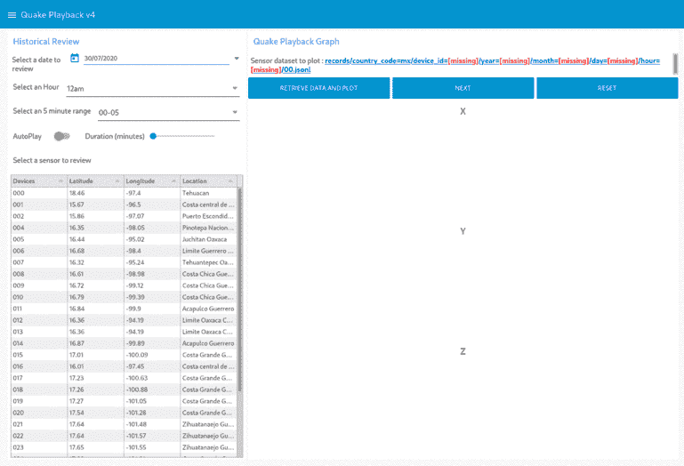

# 构建地震预警 (EEW) 系统并实现历史地震数据集可视化

> 原文：[`developer.ibm.com/zh/tutorials/build-an-openeew-earthquake-early-warning-node-red-dashboard/`](https://developer.ibm.com/zh/tutorials/build-an-openeew-earthquake-early-warning-node-red-dashboard/)

使用 Node-RED 和仪表板来构建地震预警 (EEW) 系统。完成本教程后，您将可以修改这些示例流程和仪表板，创建自己的 EEW 和数据可视化解决方案。

本教程中的 Node-RED 流程可观察实时 OpenEEW 加速传感器数据，并使用振动数据算法来计算传感器是否正在经历地震活动。

以下动画 gif 显示了从示例 3 创建的仪表板： 

## 学习目标

在本教程中，您将学习以下内容：

*   安装 Node-RED 以及构建仪表板所需的必备软件
*   了解如何编写算法来检测地震震动
*   构建一个仪表板，用于在地图上显示实时地震预警传感器警报，并在检测到可能的地震时发送手机短信警告。
*   构建一个仪表板，通过订阅 MQTT 代理，在图表中绘制实时地震活动传感器图。
*   构建一个仪表板，通过 OpenEEW 数据集绘制历史地震活动。

## 前提条件

**Node-RED Essentials**

使用此播放列表中的视频帮助您学习构建 Node-RED 流程的基础知识。

*   在您的系统上或 IBM Cloud 中[安装 Node-RED](https://nodered.org/docs/getting-started/)。 通过创建一个 Node-RED Starter 应用程序，可以创建这些流程和仪表板并将其部署到 [IBM Cloud](https://developer.ibm.com/dwwi/jsp/register.jsp?eventid=cfc-2020-projects)。

*   向 Node-RED 选用板中[添加以下节点](https://nodered.org/docs/user-guide/runtime/adding-nodes)。

    *   [node-red-dashboard](https://flows.nodered.org/node/node-red-dashboard)
    *   [node-red-contrib-web-worldmap](https://flows.nodered.org/node/node-red-contrib-web-worldmap)
    *   [node-red-node-twilio](https://flows.nodered.org/node/node-red-node-twilio)
    *   [node-red-node-ui-table](https://flows.nodered.org/node/node-red-node-ui-table)

## 预估时间

完成本教程大约需要 30 分钟。

## 步骤

[openeew-nodered](https://github.com/openeew/openeew-nodered) 项目的 [flows 文件夹](https://github.com/openeew/openeew-nodered/tree/master/flows)中提供了示例流程。

*   示例 1：构建一个在地图上显示传感器警报的流程

*   示例 2：构建一个在图表中绘制近乎实时地震活动传感器图的流程

*   示例 3：通过 OpenEEW 数据集绘制历史地震活动

### 示例 1：构建一个在地图上显示传感器警报的流程

此流程在墨西哥地图上绘制 OpenEEW 传感器，并显示其地震活动状态。

[获得代码](https://github.com/openeew/openeew-nodered/blob/master/flows/openeew-quakemap-v2.json)

### 示例 2：构建一个在图表中绘制近乎实时地震活动传感器图的流程

此流程订阅所选传感器的实时数据馈送（可通过 MQTT 获得），然后以一组图形形式绘制地震活动。

[获得代码](https://github.com/openeew/openeew-nodered/blob/master/flows/openeew-sensorplot.json)

### 示例 3：通过 OpenEEW 数据集绘制历史地震活动

此流程显示一个 Node-RED 仪表板，研究者可以选择一个感兴趣的传感器和时间段进行研究，然后查询 OpenEEW 数据集。之后，此流程会以一组图形形式绘制历史传感器数据。

此流程分为六个部分：

*   选择历史日期
*   构建并显示 OpenEEQ 数据集
*   选择一个传感器
*   在相邻数据集的时间序列中循环
*   绘制地震图
*   下载历史传感器数据

[获得代码](https://github.com/openeew/openeew-nodered/blob/master/flows/openeew-quakemap-v5.json)

## 结束语及后续步骤

[openeew-nodered](https://github.com/openeew/openeew-nodered) 项目是您可以为之做出贡献的众多 [OpenEEW 项目](https://github.com/openeew)之一。通过与开源社区互动并构建相应的解决方案，解决我们当今面临的问题。加入 [Call for Code 挑战赛](https://developer.ibm.com/cn/callforcode/)，为 Linux 基金会支持的这些开源项目贡献一己之力。

本文翻译自：[Build an Earthquake Early Warning (EEW) system and visualize historical seismic datasets](https://developer.ibm.com/tutorials/build-an-openeew-earthquake-early-warning-node-red-dashboard/)（2020-08-11）