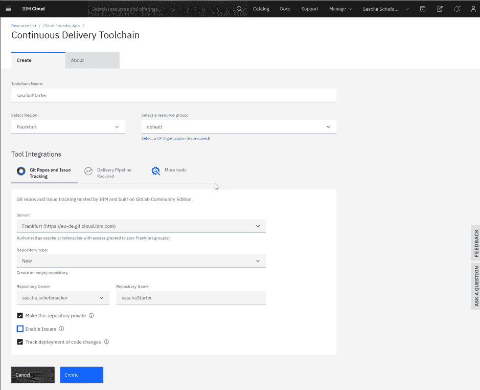
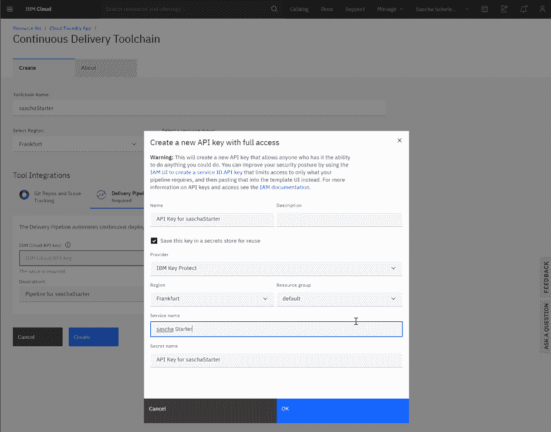

# 在 IBM Cloud 上快速为云原生应用建立受保护的 Web 界面

> 原文：[`developer.ibm.com/zh/tutorials/quickly-stand-up-protected-web-interface-for-cloud-native-app-on-ibm-cloud/`](https://developer.ibm.com/zh/tutorials/quickly-stand-up-protected-web-interface-for-cloud-native-app-on-ibm-cloud/)

本教程是一个快速入门指南，用于指导在 IBM Cloud 上开发 Node.js 入门应用程序。如今，即使是小型应用程序或黑客马拉松项目也能从身份验证和受保护区域中获益。为了满足这一需求，本教程中的云原生样本应用是一个受保护的 Web 界面应用程序，它使用 Passport 模块进行 OpenID Connect (OIDC) 身份验证以保护特定页面。

## 前提条件

*   [IBM Cloud Lite 帐户](https://cloud.ibm.com/registration?cm_sp=ibmdev-_-developer-tutorials-_-cloudreg)
*   一个简单的文本编辑器
*   要使用 GitHub 代码库进行自动构建和部署，需要[安装 Git](https://git-scm.com/downloads)。

## 步骤

1.  创建 Node.js 入门应用程序
2.  使用 GitHub 设置 CD/CD 流水线
3.  使用现有的样本应用程序
4.  使用 OIDC 在样本应用中启用保护
5.  在 Web 站点上添加更多页面

### 第 1 步：在 IBM Cloud 上创建 Node.js 入门应用程序

IBM Cloud 提供了适用于不同技术和运行时的入门工具包。使用这些应用便无需手动安装所需的框架，而且每位开发者在几分钟内就可以投入工作。

1.  登录到您的 [IBM Cloud 帐户](https://cloud.ibm.com/login?cm_sp=ibmdev-_-developer-tutorials-_-cloudreg)。

2.  使用 [SDK for Node.js](https://cloud.ibm.com/catalog/starters/cloud-foundry?runtime=sdk-for-nodejs&cm_sp=ibmdev-_-developer-tutorials-_-cloudreg) 应用程序运行时创建一个 Cloud Foundry 样本应用。在单击 **Create** 之前，为您的应用选择一个地区和名称。

    

服务将自动启动。


### 第 2 步：使用 GitHub 设置持续交付流水线

在软件项目中，协作至关重要。我们使用业界标准的 GitHub 来存储代码。这种方法还使我们能够适应另一种重要的软件开发模式，摆脱始终依赖于本地安装的本地构建，并将整个构建和部署过程迁移到云中。这保证了可再用于生产的质量，并解耦了代码包，使每位开发者都可以访问 GitHub 中的代码。

1.  在您的服务仪表板中，选择 **Overview**。

    

2.  在 **Continuous delivery** 框中，单击 **Enable continuous delivery** 链接。

3.  在 Continuous Delivery Toolchain 页面上的 Tool Integrations 部分，从 **Repository type** 下拉列表中选择 *New*。这将创建一个新的 GitHub 代码库以存储您的代码。

    

4.  要想正常工作，流水线需要一个 API 密钥。单击 Delivery Pipeline 选项卡，然后为您的代码库指定 API 密钥，或使用以下截屏中所示的向导生成一个新密钥。

    

现在，持续交付工具链已设置完成，可以开始使用了。


### 第 3 步：使用现有的样本应用程序作为入门工具包

在 IBM Cloud 中，大多数情况下不需要从零开始，因为已经有许多不错的入门工具包可供使用。本教程利用一个样本应用作为基础层，然后通过所需功能对其进行增强。为此，我们需要加载样本应用程序，并将其复制到我们自己的 GitHub 代码库中。

1.  在工具链仪表板中，单击 Git 卡以查看 GitHub 代码库的详细信息。由于 Git 代码库是一个新代码库，因此屏幕将类似于以下截屏所示，并包含命令行指令。

    

2.  页面顶部的消息提示需要个人访问令牌。所以单击此链接创建一个。这会进入 User Settings 部分。

3.  为个人访问令牌命名，并授予访问令牌完全控制权，因为您需要将代码更改推送到代码库。

    

4.  复制令牌字符串。如果忘记复制，只需撤销令牌，然后重新创建即可。

5.  要测试设置和 api-key，首先需要克隆新代码库。要查找您的代码库 URL，可单击 **Clone** 按钮，然后单击 **Clone with HTTPS** 字段中的复制按钮。

    

    然后，使用以下 `git clone` 命令：

    `git clone https://<your repository>/<yourFilename>.git`

    出现提示时，使用您的云电子邮件地址和生成的个人访问令牌进行身份验证。

    

6.  回到 IBM Cloud 控制台，单击 **Visit App URL** 链接（稍后将用作为 `yourNodeAppUrl`）。

    

    因为没有任何应用代码被推送到 GitHub 代码库，所以显示了备用屏幕“Hello World!”。

    

    Getting Started 选项卡说明了如何访问样本代码以及在本地使用。

7.  由于已经设置了要部署的工具链，因此，我们来克隆 `get-started-node` 样本，可从以下位置获取：`https://github.com/IBM-Cloud/get-started-node`。

    `git clone https://github.com/IBM-Cloud/get-started-node`

8.  通过提前克隆新的 GitHub 代码库，将 `get-started-node` 样本代码复制到您自己在本地开发系统上的文件结构中。

9.  使用以下 `git` 命令将文件提交到我们的样本应用的新 GitHub 代码库中。 首先，添加文件：

    `git add`。

    接下来，提交更改：

    `git commit -m "initial sample push"`

    

    最后，将更改推送到服务器：

    `git push`

    

    **提示：**如果不想每次输入个人访问令牌，可更新 `.git` 文件中的配置。

    

    输入 `git` 命令后，您将看到部署流水线启动，然后将所做的更改放入 Web 应用中。

    

等待完成之后，像以前一样打开应用 URL。现在，显示了新的欢迎页面。


小巧简单的 Web 应用现在正在运行。但是，内容没有受到保护。我们来使用 OpenID Connect 进行保护。

### 第 4 步：在样本应用程序中启用保护

对于大多数 Web 站点，通常需要设置一些受保护区域，或至少需要使用用户概要文件来实现某些附加功能。Node.js 提供了一些不同的模块来保护 Web 站点。在本教程中，我将使用 [Passport](http://www.passportjs.org/) 模块。Passport 模块支持不同的身份验证机制和提供程序。在本教程中，我们将使用 Google 作为 OIDC 提供程序。

对于本教程，您可以在我的 GitHub 代码库中访问 JSON 和 JavaScript 文件。

[获取代码](https://eu-de.git.cloud.ibm.com/sascha.schefenacker/saschaStarter?cm_sp=ibmdev-_-developer-tutorials-_-cloudreg)

您可以使用以下命令克隆我的代码库： `git clone https://eu-de.git.cloud.ibm.com/sascha.schefenacker/saschaStarter.git`

1.  设置一个 Google OIDC 项目，并在 Google Developer 的控制台上配置 clientID + clientSecret。在开发者文档中阅读有关 [Google OIDC 项目](https://developers.google.com/identity/protocols/oauth2/openid-connect) 的更多信息。

    a. 打开 Google API 控制台以创建一个新项目：`https://console.developers.google.com/apis/dashboard`

    b. 打开左上角的汉堡菜单，然后选择 **APIs & Services > OAuth consent screen**。

    c. 选择 **External** 用户类型，然后单击 **Create**。

    d. 输入应用程序名称和授权域，然后单击 **Create**。

    e. 切换到 Credentials 选项卡，然后单击顶部区域中的 **CREATE CREDENTIALS**，选择一个 OAuth 客户端 ID。

    f. 输入 Web 客户端名称和重定向 URI，我们还将通过后续步骤在客户端上进行配置。 **注意：**您需要使用从上一步中检索到的 `yourNodeAppUrl` 来构建回调 URL (`https://<yourNodeAppUrl>/auth/google/callback`)。

    g. 单击 **CREATE** 之后，将显示一个屏幕，以便于您复制和保存 ClientID 和 clientSecret。

    现在，您已经配置了新的 Google 身份验证，并存储了所需的凭据。

2.  切换回克隆的 Git 代码库。将 [`package.json`](https://eu-de.git.cloud.ibm.com/sascha.schefenacker/saschaStarter/-/blob/master/package.json?cm_sp=ibmdev-_-developer-tutorials-_-cloudreg) 文件从我的样本代码库复制到克隆的 Git 代码库的根目录。验证是否指定了以下模块：

    ```
    "cors": "².8.5",
    "cookie-parser": "¹.4.5",
    "express-session": "¹.17.1",
    "jsonwebtoken": "⁸.5.1",
    "passport": "⁰.4.1",
    "passport-google-oauth20": "².0.0" 
    ```

3.  将 [`server.js` 文件](https://eu-de.git.cloud.ibm.com/sascha.schefenacker/saschaStarter/-/blob/master/server.js?cm_sp=ibmdev-_-developer-tutorials-_-cloudreg)从我的 Git 代码库复制到根目录。然后，更新 `server.js` 文件以利用新模块。更新这些行以指定您的 `clientID`、`clientSecret` 和 `callbackURL`，使其匹配您的应用程序 URL。

    ```
    passport.use(new GoogleStrategy({
        clientID: 'FILLITWITHYOURVALUE.apps.googleusercontent.com',
        clientSecret: ' FILLITWITHYOURVALUE ',
        callbackURL: "https:///auth/google/callback"
      }, 
    ```

4.  和前面一样，使用 `git` 命令（`git add`、`git commit` 和 `git push`）推送对这两个文件的更改，然后等待 CI/CD 流水线完成。

5.  通过调用使用新建立的路径实现扩展的应用程序 URL，测试您的更改是否可以保护站点.

    a. 开始身份验证：`https://<yourNodeAppUrl>/auth/google`

    b. 查看从 Google 检索到的用户概要文件：`https://<yourNodeAppUrl>/profile`

### 第 5 步：在 Web 站点上添加更多页面

现在，我们已经设置了身份验证，我们可以向 Web 站点添加更多页面，以在子目录中包含登录页面和受保护页面。在此示例中，我们将添加一个受保护的用户概要文件页面，以显示有关我们在身份验证流程中从 Google 检索到的用户的数据。

对于本教程，您可以在我的 GitHub 代码库中访问这些页面。

[获取代码](https://eu-de.git.cloud.ibm.com/sascha.schefenacker/saschaStarter?cm_sp=ibmdev-_-developer-tutorials-_-cloudreg)

1.  更新 views 目录中的 [`index.html`](https://eu-de.git.cloud.ibm.com/sascha.schefenacker/saschaStarter/-/blob/master/views/index.html?cm_sp=ibmdev-_-developer-tutorials-_-cloudreg)。如果需要，您也可以针对您的应用程序对其进行修改。

2.  在本地开发系统上克隆的 Git 代码库中创建一个 `protected` 文件夹。将 [`userProfile.html`](https://eu-de.git.cloud.ibm.com/sascha.schefenacker/saschaStarter/-/blob/master/views/protected/userProfile.html?cm_sp=ibmdev-_-developer-tutorials-_-cloudreg) 页面复制到 `protected` 文件夹。查看代码，并确保更新这些 URL，使其匹配您的应用程序 URL。

在创建这些页面、提交更改并将更改推送到 Git 之后，以及在构建流水线处理了更改之后，您可以使用应用程序 URL 查看这些页面。登录页面 (`index.html`) 包含指向受保护页面 (`userProfile.html`) 的链接。由于我们将 Passport 和 Node.js 配置为保护 `/protected` 目录结构中的所有文件，因此未经身份验证，您将无法访问用户概要文件页面。

为了简化 `userProfile.html`，它与会话存储（session-store）一起使用，并通过一些简单的 JQuery API 调用从 Node.js 服务器及其会话存储中检索用户信息。

## 结束语及后续步骤

在本教程中，您学习了如何利用 IBM Cloud 创建 Node.js 应用程序，并建立构建自动化，这样每次 Git 代码库收到新代码推送时就会自动更新。此外，您的应用程序已获得保护，并利用著名的 Passport 模块进行 OpenID Connect 身份验证。

您可以根据需要选择扩展这个简单的应用程序。或许您可以使用 [React](https://developer.ibm.com/zh/components/react/) 构建更强大的前端，或者使用 [Node-RED](https://developer.ibm.com/zh/components/node-red/) 创建一些其他的后端逻辑。探索 IBM Developer 上的教程和 Code Pattern 以了解更多内容！

### 致谢

特别感谢 David Winter 在此项目的初期阶段为我提供了帮助。

本文翻译自：[Quickly stand up a protected web interface for a cloud-native app on IBM Cloud](https://developer.ibm.com/tutorials/quickly-stand-up-protected-web-interface-for-cloud-native-app-on-ibm-cloud/)（2020-08-04）