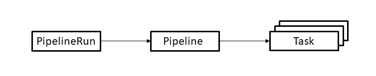

# 使用 Tekton Pipelines 在 Kubernetes 上构建和部署 Docker 镜像

> 原文：[`developer.ibm.com/zh/tutorials/build-and-deploy-a-docker-image-on-kubernetes-using-tekton-pipelines/`](https://developer.ibm.com/zh/tutorials/build-and-deploy-a-docker-image-on-kubernetes-using-tekton-pipelines/)

Tekton 是一个开源项目，可在 Kubernetes 集群中配置和运行持续集成 (CI) 和持续交付 (CD) 流水线。在本教程中，我将介绍 Tekton Pipelines 使用的基本概念。然后，您便可以创建用于构建和部署到容器注册表的流水线。您还将了解如何运行流水线，检查其状态以及对问题进行故障排除。但在开始之前，您必须搭建一个安装了 Tekton 的 Kubernetes 环境。

## 前提条件

*   安装[命令行界面 (CLI)](https://cloud.ibm.com/docs/containers?topic=containers-cs_cli_install#cs_cli_install_steps) 以便管理集群。

*   在 IBM Kubernetes Service 中创建一个[标准 Kubernetes 集群](https://cloud.ibm.com/docs/containers?topic=containers-clusters#clusters_ui_standard)。

    **注意**：

    *   Tekton 需要 Kubernetes V1.15 或更高版本。
    *   本教程将使用标准集群，因为标准集群支持动态配置存储卷。
*   在 IBM Container Service 中创建一个[专用容器注册表](https://cloud.ibm.com/docs/services/Registry?topic=registry-registry_setup_cli_namespace#registry_setup_cli_namespace)。

*   在集群中安装 Tekton。 编写本教程时使用的是 Tekton V0.11.1。请注意，如果使用的是旧版本，您可能会遇到一些功能差异。

    ```
     kubectl apply --filename https://storage.googleapis.com/tekton-releases/pipeline/previous/v0.11.1/release.yaml 
    ```

    使用以下命令来监视安装，直到所有组件都显示为正在运行状态：

    ```
     kubectl get pods --namespace tekton-pipelines --watch 
    ```

*   安装 [Tekton Pipelines CLI](https://github.com/tektoncd/cli#installing-tkn)。

## 预估时间

满足这些前提条件后，本教程大约需要 1 个小时才能完成。

## 步骤

1.  了解 Tekton Pipeline 的概念
2.  克隆代码库
3.  创建用于克隆 Git 代码库的任务
4.  创建用于构建镜像并将其推送到容器注册表的任务
5.  创建用于将镜像部署到 Kubernetes 集群的任务
6.  创建流水线
7.  定义服务帐户
8.  创建流水线运行
9.  运行流水线
10.  调试失败的流水线运行

### 了解 Tekton Pipeline 的概念

Tekton 以[自定义资源](https://kubernetes.io/docs/concepts/extend-kubernetes/api-extension/custom-resources/)的形式提供了一组 Kubernetes 扩展，以用于定义流水线。

下图显示了本教程中使用的资源。 箭头描述了从一种资源到另一种资源的引用。



可按如下方式使用资源：

*   **PipelineRun** 可定义流水线的执行。它将引用要运行的流水线。
*   **Pipeline** 可定义用于构成流水线的任务集。
*   **Task** 可定义一组构建步骤（例如，编译代码、运行测试以及构建和部署镜像）。

不用担心，我将在本教程中详细介绍每种资源。

现在可以创建一个简单流水线了，其用途如下：

*   通过源文件构建 Docker 镜像并将其推送到专用容器注册表
*   将镜像部署到 Kubernetes 集群

### 克隆代码库

您应该将此项目克隆到工作站，因为您需要先编辑一些 YAML 文件才能将这些文件应用于集群。完成克隆操作后，请务必查看 `beta-update` 分支。

```
git clone https://github.com/IBM/tekton-tutorial
git checkout beta-update 
```

我们从头开始。首先，定义用于构建和部署镜像的任务资源。然后，定义用于引用任务的流水线资源。最后，创建用于运行流水线的 `PipelineRun` 资源。

### 创建用于克隆 Git 代码库的任务

流水线首先需要执行的一项任务是克隆流水线要构建的 Git 代码库。这是一个通用功能，因此您无需自己编写此任务。Tekton 提供了一个可重用任务库（称为 [Tekton 目录](https://github.com/tektoncd/catalog)）。在该目录中，您可以找到 [`git-clone` 任务](https://github.com/tektoncd/catalog/tree/v1beta1/git#git-clone)的描述。该任务应如下所示：

```
apiVersion: tekton.dev/v1beta1
kind: Task
metadata:
  name: git-clone
spec:
  workspaces:
  - name: output
    description: The git repo will be cloned onto the volume backing this workspace
  params:
  - name: url
    description: git url to clone
    type: string
  - name: revision
    description: git revision to checkout (branch, tag, sha, ref�)
    type: string
    default: master
  - name: submodules
    description: defines if the resource should initialize and fetch the submodules
    type: string
    default: "true"
  - name: depth
    description: performs a shallow clone where only the most recent commit(s) will be fetched
    type: string
    default: "1"
  - name: sslVerify
    description: defines if http.sslVerify should be set to true or false in the global git config
    type: string
    default: "true"
  - name: subdirectory
    description: subdirectory inside the "output" workspace to clone the git repo into
    type: string
    default: "src"
  - name: deleteExisting
    description: clean out the contents of the repo's destination directory (if it already exists) before trying to clone the repo there
    type: string
    default: "false"
  results:
  - name: commit
    description: The precise commit SHA that was fetched by this Task
  steps:
  - name: clone
    image: gcr.io/tekton-releases/github.com/tektoncd/pipeline/cmd/git-init:latest
    script: |
      CHECKOUT_DIR="$(workspaces.output.path)/$(params.subdirectory)"

      cleandir() {
        # Delete any existing contents of the repo directory if it exists.
        #
        # We don't just "rm -rf $CHECKOUT_DIR" because $CHECKOUT_DIR might be "/"
        # or the root of a mounted volume.
        if [[ -d "$CHECKOUT_DIR" ]] ; then
          # Delete non-hidden files and directories
          rm -rf "$CHECKOUT_DIR"/*
          # Delete files and directories starting with . but excluding ..
          rm -rf "$CHECKOUT_DIR"/.[!.]*
          # Delete files and directories starting with .. plus any other character
          rm -rf "$CHECKOUT_DIR"/..?*
        fi
      }

      if [[ "$(params.deleteExisting)" == "true" ]] ; then
        cleandir
      fi

      /ko-app/git-init \
        -url "$(params.url)" \
        -revision "$(params.revision)" \
        -path "$CHECKOUT_DIR" \
        -sslVerify="$(params.sslVerify)" \
        -submodules="$(params.submodules)" \
        -depth="$(params.depth)"
      cd "$CHECKOUT_DIR"
      RESULT_SHA="$(git rev-parse HEAD | tr -d '\n')"
      EXIT_CODE="$?"
      if [ "$EXIT_CODE" != 0 ]
      then
        exit $EXIT_CODE
      fi
      # Make sure we don't add a trailing newline to the result!
      echo -n "$RESULT_SHA" > $(results.commit.path) 
```

任务可以包含一个或多个步骤。 每个步骤都会定义一个要运行的镜像以用于执行该步骤的功能。此特定任务包含一个步骤，即，使用 Tekton 提供的容器来克隆 Git 代码库。

任务还可以具有参数，以便对其进行重用。此任务将接受许多参数，包括要克隆的 Git 代码库的 URL 以及要查看的修订内容。

参数的值可以是任务提供的默认值，也可以是 `Pipeline` 和 `PipelineRun` 资源（见下文）提供的值。步骤可以使用语法 `$(params.name)` 来引用参数值，其中 `name` 是参数的名称。例如，此步骤使用 `$(params.url)` 来引用 `url` 参数值。

该任务需要一个用于存储克隆的工作空间。从任务的角度来讲，工作空间提供了一个可供读写数据的文件系统路径。步骤可以使用语法 `$(workspaces.name.path)` 来引用路径，其中 `name` 是工作空间的名称。 稍后，您将了解工作空间如何与存储卷关联。

现在将该文件应用于集群以创建任务：

```
kubectl apply -f https://raw.githubusercontent.com/tektoncd/catalog/v1beta1/git/git-clone.yaml 
```

### 创建用于构建镜像并将其推送到容器注册表的任务

流水线接下来需要执行的一项任务是构建 Docker 镜像并将其推送到容器注册表。Tekton 目录提供了 [`kaniko` 任务](https://github.com/tektoncd/catalog/tree/v1beta1/kaniko)，此任务使用 Google 的 `kaniko` 工具来完成上述操作。此任务如下所示：

```
apiVersion: tekton.dev/v1beta1
kind: Task
metadata:
  name: kaniko
spec:
  params:
  - name: IMAGE
    description: Name (reference) of the image to build.
  - name: DOCKERFILE
    description: Path to the Dockerfile to build.
    default: ./Dockerfile
  - name: CONTEXT
    description: The build context used by Kaniko.
    default: ./
  - name: EXTRA_ARGS
    default: ""
  - name: BUILDER_IMAGE
    description: The image on which builds will run
    default: gcr.io/kaniko-project/executor:latest
  workspaces:
  - name: source
  results:
  - name: IMAGE-DIGEST
    description: Digest of the image just built.

  steps:
  - name: build-and-push
    workingDir: $(workspaces.source.path)
    image: $(params.BUILDER_IMAGE)
    # specifying DOCKER_CONFIG is required to allow kaniko to detect docker credential
    # https://github.com/tektoncd/pipeline/pull/706
    env:
    - name: DOCKER_CONFIG
      value: /tekton/home/.docker
    command:
    - /kaniko/executor
    - $(params.EXTRA_ARGS)
    - --dockerfile=$(params.DOCKERFILE)
    - --context=$(workspaces.source.path)/$(params.CONTEXT)  # The user does not need to care the workspace and the source.
    - --destination=$(params.IMAGE)
    - --oci-layout-path=$(workspaces.source.path)/image-digest
    securityContext:
      runAsUser: 0
  - name: write-digest
    workingDir: $(workspaces.source.path)
    image: gcr.io/tekton-releases/github.com/tektoncd/pipeline/cmd/imagedigestexporter:v0.11.1
    # output of imagedigestexport [{"key":"digest","value":"sha256:eed29..660","resourceRef":{"name":"myrepo/myimage"}}]
    command: ["/ko-app/imagedigestexporter"]
    args:
    - -images=[{"name":"$(params.IMAGE)","type":"image","url":"$(params.IMAGE)","digest":"","OutputImageDir":"$(workspaces.source.path)/image-digest"}]
    - -terminationMessagePath=image-digested
  - name: digest-to-results
    workingDir: $(workspaces.source.path)
    image: stedolan/jq
    script: |
      cat image-digested | jq -j '.[0].value' | tee /tekton/results/IMAGE-DIGEST 
```

您可以看到该任务也需要一个工作空间。此工作空间包含要构建的源，并且流水线提供的工作空间与 git-clone 任务所用的工作空间相同。

`kaniko` 任务也会使用称为“结果”的特征。结果是由任务产生的值，可以将结果用作其他任务的参数值。此任务将声明一个名为 `IMAGE-DIGEST` 的结果，该结果将设置为所构建镜像的摘要。任务通过将结果写入名为 `/tekton/results/name` 的文件来设置结果，其中 `name` 是结果的名称（在此例中为 `IMAGE-DIGEST`）。稍后，您将了解流水线如何使用此结果。

您可能想知道任务如何向镜像存储库进行身份验证，以获取用于推送镜像的权限。本教程稍后也会对此进行介绍。

现在将该文件应用于集群以创建任务：

```
kubectl apply -f https://raw.githubusercontent.com/tektoncd/catalog/v1beta1/kaniko/kaniko.yaml 
```

### 创建用于将镜像部署到 Kubernetes 集群的任务

流水线最后需要执行的一项任务是将 Docker 镜像部署到 Kubernetes 集群。下面是执行此操作的 Tekton 任务：

```
apiVersion: tekton.dev/v1beta1
kind: Task
metadata:
  name: deploy-using-kubectl
spec:
  workspaces:
    - name: git-source
      description: The git repo
  params:
    - name: pathToYamlFile
      description: The path to the yaml file to deploy within the git source
    - name: imageUrl
      description: Image name including repository
    - name: imageTag
      description: Image tag
      default: "latest"
    - name: imageDigest
      description: Digest of the image to be used.
  steps:
    - name: update-yaml
      image: alpine
      command: ["sed"]
      args:
        - "-i"
        - "-e"
        - "s;__IMAGE__;$(params.imageUrl):$(params.imageTag);g"
        - "-e"
        - "s;__DIGEST__;$(params.imageDigest);g"
        - "$(workspaces.git-source.path)/$(params.pathToYamlFile)"
    - name: run-kubectl
      image: lachlanevenson/k8s-kubectl
      command: ["kubectl"]
      args:
        - "apply"
        - "-f"
        - "$(workspaces.git-source.path)/$(params.pathToYamlFile)" 
```

此任务包含两个步骤。

1.  第一步是在 Alpine Linux 容器中运行 `sed`，以使用由 `kaniko` 任务构建的镜像来更新用于部署的 YAML 文件。此步骤要求 YAML 文件包含 `__IMAGE__` 和 `__DIGEST__` 这两个字符串，它们将替换为参数值。

2.  第二步是使用 Lachlan Evenson 的常用 `k8s-kubectl` 容器镜像来运行 `kubectl`，以将 YAML 文件应用于正在运行流水线的集群。

与 `git-clone` 和 `kaniko` 任务一样，此任务也会使用参数以便尽可能重用此任务。此任务还需要工作空间才能部署 YAML 文件。

本教程稍后将介绍任务如何向集群进行身份验证，以获取用于将资源应用于 YAML 文件的权限。

现在将该文件应用于集群以创建任务：

```
kubectl apply -f tekton/tasks/deploy-using-kubectl.yaml 
```

### 创建流水线

下面是用于运行上面定义的任务的 Tekton 流水线：

```
apiVersion: tekton.dev/v1beta1
kind: Pipeline
metadata:
  name: build-and-deploy-pipeline
spec:
  workspaces:
    - name: git-source
      description: The git repo
  params:
    - name: gitUrl
      description: Git repository url
    - name: gitRevision
      description: Git revision to check out
      default: master
    - name: pathToContext
      description: The path to the build context, used by Kaniko - within the workspace
      default: src
    - name: pathToYamlFile
      description: The path to the yaml file to deploy within the git source
    - name: imageUrl
      description: Image name including repository
    - name: imageTag
      description: Image tag
      default: "latest"
  tasks:
    - name: clone-repo
      taskRef:
        name: git-clone
      workspaces:
        - name: output
          workspace: git-source
      params:
        - name: url
          value: "$(params.gitUrl)"
        - name: revision
          value: "$(params.gitRevision)"
        - name: subdirectory
          value: "."
        - name: deleteExisting
          value: "true"
    - name: source-to-image
      taskRef:
        name: kaniko
      runAfter:
        - clone-repo
      workspaces:
        - name: source
          workspace: git-source
      params:
        - name: CONTEXT
          value: $(params.pathToContext)
        - name: IMAGE
          value: $(params.imageUrl):$(params.imageTag)
    - name: deploy-to-cluster
      taskRef:
        name: deploy-using-kubectl
      workspaces:
        - name: git-source
          workspace: git-source
      params:
        - name: pathToYamlFile
          value: $(params.pathToYamlFile)
        - name: imageUrl
          value: $(params.imageUrl)
        - name: imageTag
          value: $(params.imageTag)
        - name: imageDigest
          value: $(tasks.source-to-image.results.IMAGE-DIGEST) 
```

流水线资源包含要运行的任务的列表。将为流水线内的每个流水线任务分配一个 `name`；在这里，它们为 `clone-repo`、`source-to-image` 和 `deploy-using-kubectl`。

流水线将通过任务参数来配置每个任务。您可以选择是将任务参数公开为流水线参数，直接设置该值，还是保留 任务中的默认值（如果这是可选参数）。 例如，该流水线在 `kaniko` 任务中公开 `CONTEXT` 参数（使用名称 `pathToContext`），但不公开 `DOCKERFILE` 参数，使其保留任务中的默认值。

此流水线还将展示如何获取一个任务的结果并将其传递给另一个任务。之前，`kaniko` 任务产生了一个名为 `IMAGE-DIGEST` 的结果，该结果保存了所构建镜像的摘要。流水线使用语法 `$(tasks.source-to-image.results.IMAGE-DIGEST)` 将该值传递给 `deploy-using-kubectl` 任务，其中 `source-to-image` 是要运行 `kaniko` 任务的流水线中使用的名称。

默认情况下，Tekton 假定可以并发执行流水线任务。在此流水线中，每个流水线任务都依赖于前一个流水线任务，这意味着这些任务必须按顺序执行。 可以使用 `runAfter` 关键字来表示流水线任务之间的依赖关系。此关键字指定任务必须在完成一系列给定任务之后才能运行。在此示例中，流水线指定 `source-to-image` 流水线任务必须在 `clone-repo` 流水线任务之后运行。

`deploy-using-kubectl`流水线任务必须在 `source-to-image` 流水线任务之后运行，但是不需要指定 `runAfter` 关键字。这是因为它引用了 `source-to-image` 流水线任务的任务结果，而 Tekton 又足够智能，明白这意味着它必须在该任务之后运行。

现在将该文件应用于集群以创建流水线：

```
kubectl apply -f tekton/pipeline/build-and-deploy-pipeline.yaml 
```

### 定义服务帐户

在运行流水线之前，必须先设置一个服务帐户，以便流水线可以访问受保护的资源。服务帐户将一对私钥（包含用于身份验证的凭证）和基于角色的访问控制 (RBAC) 相关资源绑定在一起，以便有权创建和修改某些 Kubernetes 资源。

首先，您需要通过创建 IBM Cloud Identity and Access Management (IAM) API 密钥 来启用对专用容器注册表的编程访问。请参阅[有关自动访问 IBM Cloud Container Registry 的 IBM Cloud 文档](https://cloud.ibm.com/docs/services/Registry?topic=registry-registry_access#registry_access)，以了解如何创建用户 API 密钥。

在获得 API 密钥之后，可以创建以下私钥：

```
kubectl create secret generic ibm-registry-secret --type="kubernetes.io/basic-auth" --from-literal=username=iamapikey --from-literal=password=<APIKEY>
kubectl annotate secret ibm-registry-secret tekton.dev/docker-0=<REGISTRY> 
```

请注意以下事项：

*   `<APIKEY>` 是您创建的 API 密钥。
*   `<REGISTRY>` 是容器注册表的域名，例如 `us.icr.io`（您可以使用命令 `ibmcloud cr region` 来查看注册表的域名）。

此私钥将用于在注册表中推送和提取镜像。

太棒了！现在，您可以使用以下 YAML 来创建服务帐户。

```
apiVersion: v1
kind: ServiceAccount
metadata:
  name: pipeline-account
secrets:
- name: ibm-registry-secret

---

apiVersion: v1
kind: Secret
metadata:
  name: kube-api-secret
  annotations:
    kubernetes.io/service-account.name: pipeline-account
type: kubernetes.io/service-account-token

---

kind: Role
apiVersion: rbac.authorization.k8s.io/v1
metadata:
  name: pipeline-role
rules:
- apiGroups: [""]
  resources: ["services"]
  verbs: ["get", "create", "update", "patch"]
- apiGroups: ["apps"]
  resources: ["deployments"]
  verbs: ["get", "create", "update", "patch"]

---

apiVersion: rbac.authorization.k8s.io/v1
kind: RoleBinding
metadata:
  name: pipeline-role-binding
roleRef:
  apiGroup: rbac.authorization.k8s.io
  kind: Role
  name: pipeline-role
subjects:
- kind: ServiceAccount
  name: pipeline-account 
```

此 YAML 将创建以下 Kubernetes 资源：

*   一个名为 `pipeline-account` 的服务帐户。此服务帐户将引用 `ibm-cr-push-secret` 私钥，以便流水线可以在推送和提取容器镜像时 向专用容器注册表进行身份验证。

*   一个名为 `kube-api-secret` 的私钥，其中包含用于访问 Kubernetes API 的 API 凭证（由 Kubernetes 生成）。这允许流水线使用 `kubectl` 来与集群通信。

*   一个名为 `pipeline-role` 的角色和一个名为 `pipeline-role-binding` 的角色绑定。这提供了该流水线创建和修改 Kubernetes 资源所需的基于资源的访问控制权限。

现在将该文件应用于集群以创建服务帐户和相关资源：

```
kubectl apply -f tekton/pipeline-account.yaml 
```

### 创建流水线运行

到目前为止，您已经定义了用于构建和部署镜像的可重用流水线和任务资源。现在可以了解如何运行流水线了。下面是用于运行上述流水线的 Tekton `PipelineRun` 资源。它应如下所示：

```
apiVersion: tekton.dev/v1beta1
kind: PipelineRun
metadata:
  generateName: picalc-pr-
spec:
  pipelineRef:
    name: build-and-deploy-pipeline
  params:
    - name: gitUrl
      value: https://github.com/IBM/tekton-tutorial
    - name: gitRevision
      value: beta-update
    - name: pathToYamlFile
      value: kubernetes/picalc.yaml
    - name: imageUrl
      value: <REGISTRY>/<NAMESPACE>/picalc
    - name: imageTag
      value: "1.0"
  serviceAccountName: pipeline-account
  workspaces:
    - name: git-source
      persistentVolumeClaim:
        claimName: picalc-source-pvc 
```

尽管这个文件很小，但内容却很丰富。 我们来从上到下分析一下其中的内容：

*   `PipelineRun` 没有固定名称。 每次创建该资源时，它都会使用 `generateName` 来生成名称。这是因为特定的 `PipelineRun` 资源仅执行一次流水线。 如果要再次运行流水线，您无法通过修改现有的 `PipelineRun` 资源来请求重新运行该流水线。您必须创建一个新的 `PipelineRun` 资源。每次创建 `PipelineRun` 时，虽然可以使用 `name` 为其分配唯一的名称，但使用 `generateName` 会容易得多。

*   流水线资源由 `pipelineRef` 关键字标识。

*   流水线公开的参数会设置为特定值，例如，要克隆的 Git 代码库、要构建的镜像和要部署的 YAML 文件。此示例将构建一个[用于计算 pi 的近似值的 Go 程序](https://github.com/IBM/tekton-tutorial/blob/beta-update/src/picalc.go)。源代码包含一个 [Dockerfile](https://github.com/IBM/tekton-tutorial/blob/beta-update/src/Dockerfile)，此文件将用于运行测试、编译代码以及构建要执行的镜像。

    您必须编辑 `picalc-pipeline-run.yaml` 文件，以将 `<REGISTRY>` 和 `<NAMESPACE>` 的值替换为专用容器注册表的信息。

    *   要查找 `<REGISTRY>` 的值，请输入 `ibmcloud cr region` 命令。
    *   要查找 `<NAMESPACE>` 的值，请输入 `ibmcloud cr namespace-list` 命令。
*   指定一个名为 `pipeline-account` 的服务帐户（您之前创建的），以提供成功运行流水线所需的凭证。

*   流水线用来克隆 Git 代码库的工作空间将映射到一个持久卷声明（即，对存储卷的请求）。

在首次运行流水线之前，必须为该工作空间创建持久卷声明：

```
kubectl create -f tekton/picalc-pipeline-pvc.yaml 
```

持久卷声明要求 Kubernetes 获取存储卷。由于每个 `PipelineRun` 都引用相同的声明并因此引用相同的卷，因此 `PipelineRun` 只能连续运行，以避免在使用该卷时发生冲突。但是，目前正在研发一项新[功能](https://github.com/tektoncd/pipeline/pull/2326)，其目标是让每个 `PipelineRun` 都创建自己的持久卷声明，从而使用自己的卷。

在继续之前，请检查是否已绑定持久卷声明：

```
$ kubectl get pvc picalc-source-pvc
NAME                STATUS   VOLUME                                     CAPACITY   ACCESS MODES   STORAGECLASS       AGE
picalc-source-pvc   Bound    pvc-662946bc-57f2-4ba5-982c-b0fa9db1d065   20Gi       RWO            ibmc-file-bronze   2m 
```

### 运行流水线

现在一切就绪，可以运行流水线了：

```
$ kubectl create -f tekton/run/picalc-pipeline-run.yaml
pipelinerun.tekton.dev/picalc-pr-c7hsb created 
```

请注意，您在此处使用的是 `kubectl create`，而不是 `kubectl apply`。如前所述，给定的 `PipelineRun` 资源只能运行一次流水线。这意味着您每次想要运行流水线时都需要新建此资源。`kubectl` 利用 `PipelineRun` 资源的已生成名称来作出响应：

我们来使用 `tkn` CLI 检查 `PipelineRun` 的状态。虽然可以使用 `kubectl describe` 命令来检查流水线的状态，但 `tkn` cli 可以提供更好的输出：

```
$ tkn pipelinerun describe picalc-pr-c7hsb 
Name:              picalc-pr-c7hsb
Namespace:         default
Pipeline Ref:      build-and-deploy-pipeline
Service Account:   pipeline-account

Status

STARTED         DURATION   STATUS
2 minutes ago   ---        Running

Resources

 No resources

Params

 NAME             VALUE
 gitUrl           https://github.com/IBM/tekton-tutorial
 pathToYamlFile   kubernetes/picalc.yaml
 imageUrl         us.icr.io/gregd/picalc
 imageTag         1.0

Taskruns

 NAME                                    TASK NAME         STARTED          DURATION   STATUS
 picalc-pr-c7hsb-source-to-image-s8rrg   source-to-image   56 seconds ago   ---        Running
 picalc-pr-c7hsb-clone-repo-pvbsk        clone-repo        2 minutes ago    1 minute   Succeeded 
```

这表明流水线正在运行。`clone-repo` 流水线任务已成功完成，而 `source-to-image` 流水线任务当前正在运行。

继续重新运行该命令以检查状态。 如果流水线成功运行，则描述最终应如下所示：

```
$ tkn pipelinerun describe picalc-pr-c7hsb
Name:              picalc-pr-c7hsb
Namespace:         default
Pipeline Ref:      build-and-deploy-pipeline
Service Account:   pipeline-account

Status

STARTED          DURATION    STATUS
12 minutes ago   2 minutes   Succeeded

Resources

 No resources

Params

 NAME             VALUE
 gitUrl           https://github.com/IBM/tekton-tutorial
 pathToYamlFile   kubernetes/picalc.yaml
 imageUrl         us.icr.io/gregd/picalc
 imageTag         1.0

Taskruns

 NAME                                      TASK NAME           STARTED          DURATION     STATUS
 picalc-pr-c7hsb-deploy-to-cluster-mwvfs   deploy-to-cluster   9 minutes ago    10 seconds   Succeeded
 picalc-pr-c7hsb-source-to-image-s8rrg     source-to-image     10 minutes ago   1 minute     Succeeded
 picalc-pr-c7hsb-clone-repo-pvbsk          clone-repo          12 minutes ago   1 minute     Succeeded 
```

检查 Kubernetes 部署的状态。它应该已准备就绪。

```
$ kubectl get deploy picalc
NAME     READY   UP-TO-DATE   AVAILABLE   AGE
picalc   1/1     1            1           9m 
```

您可以使用 NodePort 服务对应用程序发出 curl 命令。首先，显示节点并选择该节点的某个外部 IP 地址。然后，显示该服务以获取其 NodePort。

```
$ kubectl get nodes -o wide
NAME           STATUS   ROLES    AGE     VERSION       INTERNAL-IP    EXTERNAL-IP      OS-IMAGE             KERNEL-VERSION      CONTAINER-RUNTIME
10.221.22.11   Ready    <none>   7d23h   v1.16.8+IKS   10.221.22.11   150.238.236.26   Ubuntu 18.04.4 LTS   4.15.0-96-generic   containerd://1.3.3
10.221.22.49   Ready    <none>   7d23h   v1.16.8+IKS   10.221.22.49   150.238.236.21   Ubuntu 18.04.4 LTS   4.15.0-96-generic   containerd://1.3.3

$ kubectl get svc picalc
NAME     TYPE       CLUSTER-IP      EXTERNAL-IP   PORT(S)          AGE
picalc   NodePort   172.21.199.71   <none>        8080:30925/TCP   9m

$ curl 150.238.236.26:30925?iterations=20000000
3.1415926036 
```

### 调试失败的流水线运行

我们来看看 `PipelineRun` 失败后的结果。首先，编辑 `PipelineRun` YAML 文件并将 gitUrl 参数更改为不存在的 Git 代码库，这就强制导致失败。 然后，创建一个新的 `PipelineRun`，并在其运行一两分钟后对其进行描述。

```
$ kubectl create -f tekton/picalc-pipeline-run.yaml
pipelinerun.tekton.dev/picalc-pr-sk7md created

$ tkn pipelinerun describe picalc-pr-sk7md
Name:              picalc-pr-sk7md
Namespace:         default
Pipeline Ref:      build-and-deploy-pipeline
Service Account:   pipeline-account

Status

STARTED         DURATION     STATUS
2 minutes ago   41 seconds   Failed

Message

TaskRun picalc-pr-sk7md-clone-repo-8gs25 has failed ("step-clone" exited with code 1 (image: "gcr.io/tekton-releases/github.com/tektoncd/pipeline/cmd/git-init@sha256:bee98bfe6807e8f4e0a31b4e786fd1f7f459e653ed1a22b1a25999f33fa9134a"); for logs run: kubectl -n default logs picalc-pr-sk7md-clone-repo-8gs25-pod-v7fg8 -c step-clone)

Resources

 No resources

Params

 NAME             VALUE
 gitUrl           https://github.com/IBM/tekton-tutorial-not-there
 pathToYamlFile   kubernetes/picalc.yaml
 imageUrl         us.icr.io/gregd/picalc
 imageTag         1.0

Taskruns

 NAME                               TASK NAME    STARTED         DURATION     STATUS
 picalc-pr-sk7md-clone-repo-8gs25   clone-repo   2 minutes ago   41 seconds   Failed 
```

输出表明 `clone-repo` 流水线任务失败。 `Message` 还告诉您如何从用于运行任务的 Pod 中获取日志：

```
for logs run: kubectl -n default logs picalc-pr-sk7md-clone-repo-8gs25-pod-v7fg8 -c step-clone 
```

如果运行该 `kubectl logs` 命令，您会发现当您尝试获取不存在的 Git 代码库时会运行失败。从 `PipelineRun` 获取日志的更简单方法是使用 `tkn` CLI：

```
tkn pipelinerun logs picalc-pr-sk7md-clone-repo-8gs25-pod-v7fg8 -t clone-repo 
```

如果省略了 `-t` 标志，那么该命令将获取所有已执行的流水线任务的日志。您还可以使用以下命令来获取特定流水线的最后一个 `PipelineRun` 的日志：

```
tkn pipeline logs build-and-deploy-pipeline -L 
```

当不再需要引用某个 `PipelineRun` 的日志时，应删除该 `PipelineRun`。删除 `PipelineRun` 将删除用于运行流水线任务的 pod。

## 结束语

Tekton 提供了一些简单易用的功能，可用于构建要在 Kubernetes 上运行的 CI/CD 流水线。本教程介绍了一些基础知识，可帮助您开始构建自己的流水线。此外，它还提供了其他可用功能，并计划在即将发布的版本中提供更多功能。如果您想继续了解，请先熟悉 [Tekton Pipeline 的最新版本](https://developer.ibm.com/blogs/unpacking-tekton-pipelines-beta-release/)。接下来，请动手实践并完成 [Tekton Triggers 101](https://developer.ibm.com/tutorials/tekton-triggers-101/) 教程。

本文翻译自：[Build and deploy a Docker image on Kubernetes using Tekton Pipelines](https://developer.ibm.com/tutorials/build-and-deploy-a-docker-image-on-kubernetes-using-tekton-pipelines/)（2020-06-30）