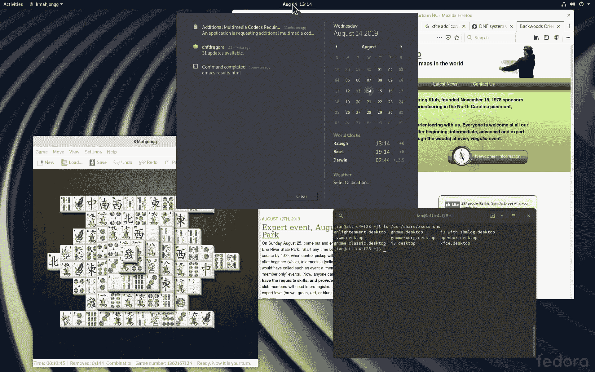
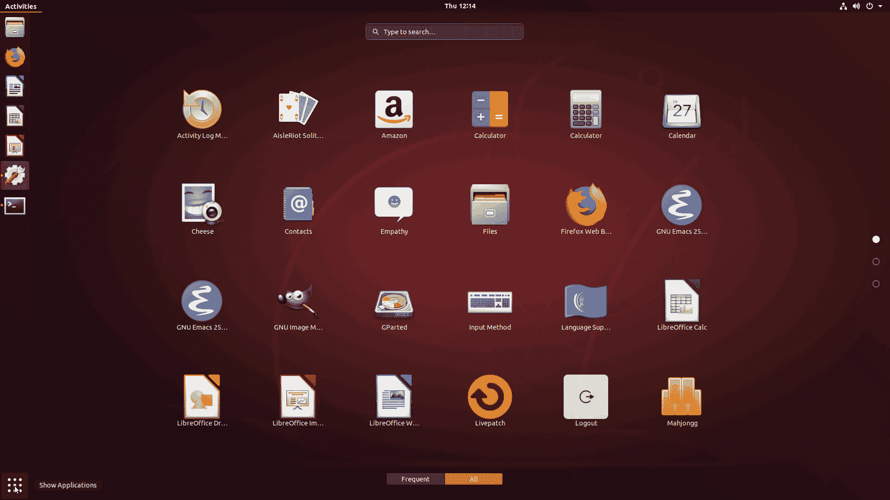

# 学习 Linux 101：图形桌面

> 原文：[`developer.ibm.com/zh/tutorials/l-lpic1-106-2/`](https://developer.ibm.com/zh/tutorials/l-lpic1-106-2/)

## 概述

在本教程中，您将了解多种 Linux 桌面及其访问方式。

了解：

*   多种流行桌面 —— KDE、GNOME 和 Xfce
*   用于本地和远程访问桌面的协议，包括 X11、XDMCP、VNC、SPICE 和 RDP。

##### 关于本系列教程

本系列教程将帮助您学习 Linux 系统管理任务。您还可以使用这些教程中的材料来准备参加 [Linux Professional Institute LPIC-1：Linux 服务器专业认证考试。](https://www.lpi.org/)

参阅“[学习 Linux 101：LPIC-1 学习路线图](https://developer.ibm.com/zh/tutorials/l-lpic1-map/)”，获得本系列中每个教程的简介和链接。该路线图仍在制定中。本教程反映了 2018 年 10 月 29 日更新的 5.0 版本的目标。在教程完成时，会将它们添加到路线图中。

## 使用和访问 Linux 桌面环境

Linux 桌面环境是应用程序的集合，这些应用程序旨在相互配合并提供一致的用户体验。桌面环境通常与登录管理器配合使用。登录管理器也称为欢迎程序或显示管理器，将在系统初始化时自动启动。登录管理器是一个 X Windows（或 Wayland）应用程序，可帮助用户以本地或远程方式登录，而且可能选择不同的桌面环境。 登录管理器桌面环境通常包括一个或多个面板、一个应用程序启动器、一个文件管理器、一个设置管理器以及一个合成窗口管理器，所有这些都具有一致的外观。

在本教程中，我将重点介绍 KDE、GNOME 和 Xfce，同时也会提到其他几个桌面。

您可以访问本地桌面、远程桌面或虚拟机中的桌面。我将向您介绍一些用于这些桌面的协议，包括 X11、XDMCP、VNC、SPICE 和 RDP。

本教程将帮助您围绕 Linux 系统管理员 (PIC-1) 考试 102 的 106 主题中的 106.2 目标进行应考准备。该目标的权重为 1。本教程反映了 2018 年 10 月 29 日更新的 5.0 版目标。

## 前提条件

要想最充分地利用本系列教程，您应该掌握 Linux 的基本知识，还应该有一个正常工作的 Linux 系统，您可以在这个系统上练习本教程中涵盖的命令。您还需要透彻理解[学习 Linux, 101：安装和配置 X11](https://developer.ibm.com/zh/tutorials/l-lpic1-106-1/) 中涵盖的资料。有时候，由于程序的不同版本会产生不同的输出格式，因此您的结果不一定与这里显示的清单和图完全相同。本教程中的示例来自使用 GNOME 桌面或 Xfce 桌面的 Fedora 30、使用 Gnome 桌面的 Ubuntu 18.04.2 LTS 和使用 KDE Plasma 桌面的 OpenSUSE Tumbleweed（5.2.5-1 内核）。

## 多种流行桌面

GNOME、KDE 和 Xfce 是适用于大多数发行版的流行桌面环境。项目主页对它们的描述如下：

*   GNOME 是一种轻松简洁地使用计算机的方法。GNOME 3 旨在让您掌握一切，并顺利完成任务。
*   KDE Plasma 是 KDE 的旗舰产品，提供可定制程度最高的桌面环境。KDE 社区追求的目标是：既能化繁为简，又能随时扩展。
*   Xfce 是用于类似 UNIX 的操作系统的轻量级桌面环境。它的目标是响应速度快、占用的系统资源少，同时拥有美观的用户友好型界面。

大多数发行版都带有默认桌面，例如 GNOME 用于 Fedora 或 KDE 用于 OpenSUSE。有些发行版提供许多种 spin 和风格，里面已经包含了您选择的预配置桌面。 例如，Fedora 和 Ubuntu 都提供以 Xfce 作为桌面的 spin。 如果找不到喜欢的 spin，您可以安装另一个桌面，然后安装所需的 spin。 或者，您可以在没有桌面的情况下执行自定义安装，然后安装所选的桌面。

桌面通常包括以下功能：

*   登录管理器，支持用户登录并可能在多个可用桌面中进行选择
*   窗口管理器，允许同时运行和显示多个应用程序
*   允许每个用户自定义自己桌面的功能
*   用于启动程序的程序启动器
*   多显示器支持
*   轻松访问设置，例如显示器、键盘、鼠标、辅助功能、声音和其他系统功能
*   便捷小部件，用于显示或更改时间、网络连接或其他内容，例如音量
*   多个工作空间，可帮助您将程序分组

### GNOME 桌面

图 1 显示了 Fedora 30 上的 GNOME 桌面，上面打开了三个应用程序。标题栏的左侧是应用程序启动器，中间是日期/时间显示器，右侧是设置访问权限。在此示例中，设置菜单已打开，并且我已展开当前登录用户的信息以显示注销等选项。光标下方的小图标可用于访问设置、屏幕锁定和电源选项，以便重新启动或关闭计算机。

##### 图 1\. Fedora 30 上打开了三个应用程序的 GNOME 桌面


单击日期/时间小部件以查看其他信息，例如图 2。您可能会看到有关可用软件更新、某些错误或状态消息的信息。我的世界时钟显示澳大利亚达尔文、瑞士巴塞尔以及我家北卡罗来纳州罗利市的时间。

##### 图 2\. 可从日期/时间小部件获取的 GNOME 桌面信息



左侧的标题栏选项可用于访问应用程序。不同桌面的应用程序访问构成有很大不同，我将通过其他示例向您展示。Fedora 最新版本上的 GNOME 在左侧列表中显示收藏夹和正在运行的应用程序的列表。桌面上显示了正在运行的应用程序的窗口，并且右侧以图标形式显示了两个正在运行的工作空间。应用程序列表底部的正方形 9 点图标用于显示其他应用程序。

##### 图 3\. 访问 Fedora 30 中 GNOME 上的应用程序


如果单击 9 点图标，就会显示经常使用的应用程序。屏幕底部的两个按钮可用于在常用应用程序和所有应用程序之间切换。

最后，您可以使用搜索框，通过键入一些匹配字符来搜索应用程序。

Ubuntu 18.04 上的 GNOME 桌面与 Fedora 30 上的略有不同，展示了可能的自定义功能的一小部分。桌面左侧以图标形式显示了收藏夹，还显示了已安装的驱动器以及回收站图标。左下角有一个 9 点图标用于访问应用程序，与许多智能手机上以及 Fedora 应用程序列表底部的图标类似。背景和颜色主题不同。这些通常可以直接通过桌面设置菜单进行更改。某些更改可能需要其他工具，例如 GNOME Tweaks 软件包。图 4 显示了来自 Ubuntu 18.04 的 GNOME 桌面。

##### 图 4\. Ubuntu 上的 GNOME 桌面


如果单击 9 点图标来显示已安装的应用程序，就可以看到一个如图 5 所示的窗口。屏幕右侧的三个点可用于切换页面。

##### 图 5\. 显示 Ubuntu GNOME 桌面上的应用程序



### KDE 桌面

KDE（最初名为 Kool Desktop Environment）项目于 1996 年宣布启动。KDE 一直是 SUSE 系统上的默认桌面，现在适用于许多版本，包括 Ubuntu 和 Fedora 版本。 我使用了滚动版 OpenSUSE Tumbleweed（更新于 2019 年 8 月）的示意图。

KDE 桌面显示了一个文件夹，它表示我的系统上已安装的驱动器。在图 6 中，我打开了一个终端窗口和 Konqueror。屏幕底部的任务栏上列出了这两个任务。通过左下角的图标可以访问其他应用程序，该图标可以打开一系列级联菜单。在图 6 中，突出显示了 Graphics 集合中的 GIMP。还有一个搜索框，可帮助您查找应用程序并快速访问系统功能，例如注销或重新启动计算机。

##### 图 6\. OpenSUSE 上的 KDE 桌面


KDE 任务栏的右端有许多小图标，可用于快速访问日期和时间、音量控制、剪贴板内容和状态通知等项。图 7 显示了 Status and Notifications 窗格的示例。

##### 图 7\. 其他 KDE 桌面功能


### Xfce 桌面

Xfce 是一个轻量级的桌面环境，适用于 Fedora 和 Ubuntu（例如 Xubuntu）等的 spin。 软件包也可以安装在没有针对 Xfce 的预构建 spin 的发行版上。

图 8 显示打开了三个窗口的 Xfce 桌面。顶部有一个任务栏，底部有一个窗格。像 KDE 一样，桌面上有收藏夹和回收站的图标。所有可用的驱动器也显示为图标，并以不同的颜色区分已安装的驱动器。在我的示例中，已安装的驱动器为白色，未安装的驱动器为灰色。

##### 图 8\. Fedora 30 上的 Xfce 桌面


与 KDE 类似，任务栏左侧的应用程序启动器会打开一个级联菜单，正在运行的应用程序在任务栏上显示了快速访问图标。任务栏还允许快速访问四个活动工作空间，每个工作空间的小图标将指示各自可能正在运行的内容。与其他桌面类似，任务栏右侧也有时钟，也可以快速访问网络设置以及注销/电源选项。

##### 图 9\. Xfce 应用程序启动器


您可以在屏幕底部的快速启动窗格中快速添加项目。在其他默认选项之中，您可以找到以放大镜形式显示的应用程序搜索功能。图 10 显示我正在搜索“tweak”以查找调整工具。注意半透明显示的悬浮式帮助。

##### 图 10\. 在 Xfce 中搜索应用程序


## 登录和更改桌面

在 X Window 系统的早期阶段，往往需要登录到文本屏幕，然后使用诸如 `startx` 之类的命令启动 X。桌面环境通常与登录管理器（或桌面管理器）配合使用，登录管理器负责在系统启动时启动 X，然后提供图形登录功能。尽管诸如 GNOME 显示管理器 (GDM) 之类的登录管理器通常与特定桌面环境（在本例中为 GNOME）相关联，但用户也可能希望使用其他桌面环境。因此，登录管理器通常允许从已安装的桌面中进行选择。图 11 显示了我在本教程中一直使用的 Fedora 30 系统的 GDM 登录管理器。密码输入字段旁边有一个小齿轮图标。单击可查看可用的桌面，然后选择一个。

其他桌面以其他方式显示此选择功能。例如，使用 KDM 登录管理器的 OpenSUSE Tumbleweed 在我的系统登录屏幕左下角附近有一个下拉选择框。

##### 图 11\. 使用 GDM 显示管理器选择桌面


如果已经登录并想知道还安装了哪些其他桌面，可以在 /usr/share/xsessions 中查看列表，如清单 1 所示。

##### 清单 1\. 已安装的桌面

```
ian@attic4-f30 ~]$ ls /usr/share/xsessions/
enlightenment.desktop  gnome.desktop       i3-with-shmlog.desktop
fvwm.desktop           gnome-xorg.desktop  openbox.desktop
gnome-classic.desktop  i3.desktop          xfce.desktop 
```

安装其他桌面不属于本教程的讨论范围，但须注意，如果要安装特定桌面，可能需要安装软件包组，而不是单个软件包。您可以使用与清单 2 所示类似的想法和命令，通过适用于自己的发行版的软件包管理工具来获取更多信息。

##### 清单 2\. 搜索桌面软件包组并显示有关 KDE 的信息

```
[ian@attic4-f30 ~]$ dnf group list "*[dD]esktop*"
Last metadata expiration check: 0:03:12 ago on Fri 16 Aug 2019 07:11:36 PM EDT.
Available Environment Groups:
   KDE Plasma Workspaces
   LXDE Desktop
   LXQt Desktop
   Cinnamon Desktop
   MATE Desktop
   Sugar Desktop Environment
   Deepin Desktop
   Basic Desktop
Installed Environment Groups:
   Xfce Desktop 
```

清单 3 显示了 Fedora 30 上有关 KDE Plasma Workspaces 组的信息。

##### 清单 3\. 显示有关 KDE 软件包组的信息

```
[ian@attic4-f30 ~]$ dnf group info "KDE Plasma Workspaces"
Last metadata expiration check: 0:03:25 ago on Fri 16 Aug 2019 07:11:36 PM EDT.
Environment Group: KDE Plasma Workspaces
 Description: The KDE Plasma Workspaces, a highly-configurable graphical user interface which includes a panel, desktop, system icons and desktop widgets, and many powerful KDE applications.
 Mandatory Groups:
   Administration Tools
   Common NetworkManager Submodules
   Core
   Dial-up Networking Support
   Fonts
   Guest Desktop Agents
   Hardware Support
   Input Methods
   KDE
   Multimedia
   Printing Support
   Standard
   base-x
 Optional Groups:
   3D Printing
   Cloud Management Tools
   Firefox Web Browser
   KDE Applications
   KDE Educational applications
   KDE Multimedia support
   KDE Office
   KDE Telepathy 
```

## 远程桌面访问协议

在“学习 Linux，101：安装和配置 X11”中，我展示了如何使用多种方法访问远程的 X 应用程序。在本教程的剩余部分中，我将简要讨论可用于帮助您远程访问整个桌面（而不是单个应用程序）的协议。这些协议适用于运行 X11 的系统。Wayland 旨在解决 X11 中暴露的许多安全性问题，其中很多是由远程协议造成。在撰写本文时（2019 年 8 月），使用 X11 远程访问目标系统的桌面变得更简单，但还需要考虑安全性。一般而言，您应该尽可能尝试通过 Secure Shell (SSH) 会话建立 X 会话或桌面隧道。这么做意味着需要打开的端口更少，并减少系统中的暴露。

### X 和 XDMCP

使用 X Window System 的系统通常具有一个 `startx` 脚本，该脚本往往作为系统初始化的一部分自动启动。或者，系统可以在不使用 X 的情况下启动（在运行级别 3），然后控制台用户可以运行 `startx`。如果在初始化时运行，`startx` 通常会提供一个登录管理器，例如 GDM。如果用户在运行级别 3 登录到控制台，然后运行 `startx`，尽管可以启动任何窗口管理器，甚至 X 应用程序，但这通常将打开用户的默认桌面环境或上次使用的桌面环境。使用的显示器将是连接到运行命令的计算机的本地显示器。那么我们如何实现远程访问？

在低成本个人计算机问世之前，X 终端是装有 X 服务器的高级终端，但缺乏通用的计算能力。它们取代了提供仅字符界面（通常为 24 或 26 行，每行 80 个字符）的旧终端。X 显示管理器控制协议 (XDMCP) 是 X.org 标准，其既定目标是“*提供统一的自主显示机制，以便从远程主机请求登录服务。所谓自主，是指显示器由独立于需要登录服务的任何特定主机的硬件和进程组成。（例如，不能简单地通过主机上的 fork/exec 序列而启动服务器。）X 终端（屏幕、键盘、鼠标、处理器、网络接口）是自主显示的主要示例*”。

因此，早期的 X 终端使用 XDMCP 与主机进行通信，并向用户提供 X 服务。

Xnest 和 Xephyr 这两个客户机通常用于提供嵌套的 X 服务器功能，使用户能够从使用中的 X Window System 桌面连接，并在窗口中通过 XDMCP 运行远程桌面。

如今，X 隧道技术是更安全的方法，可以在网络连接系统之间传输 X。

### VNC

另一个图形桌面共享系统是虚拟网络计算 (VNC)。VNC 使用远程帧缓冲 (RFB) 协议与另一台计算机进行交互。VNC 与平台无关，并有许多针对不同操作系统的客户端和服务器实现。TigerVNC 目前在许多 Linux 系统上都很流行。

帮助台可以使用 VNC 进行远程故障排除，用户也可以使用 VNC 从家用计算机或在旅途中访问办公桌面。VNC 由服务器部分和客户端部分组成，前者在要共享其桌面的计算机上运行，后者在希望访问该服务器的系统上运行。单个服务器可以由多个客户端访问。 您可以在防火墙中打开 VNC 使用的端口，也可以使用 SSH 通过 VNC 来建立 X 隧道。

图 12 显示了一个带有终端窗口的 Linux Mint 系统，我在上面启动了 TigerVNC 查看器，并启动了在另一个系统上运行的 Fedora 30 的桌面。远程桌面的窗口启动并运行后，您可以像在远程系统上那样与其进行交互。在此示例中，我单击了应用程序启动器，然后单击了 9 点应用程序菜单。

##### 图 12\. 带有 Fedora 30 GNOME 桌面窗口的 Linux Mint


### SPICE

SPICE 项目的自我描述是旨在“*提供一个完整的开源解决方案，以便无缝地远程访问虚拟机，让您可以轻松播放视频、录制音频、共享 USB 设备和共享文件夹*”。参阅 SPICE 主页。

SPICE 项目描述了四个组件：协议、客户端、服务器和访客。协议是其他三个组件的通信规范；客户端（例如远程查看器）负责发送数据并转换来自虚拟机 (VM) 的数据，以便您可以与之交互；SPICE 服务器是管理程序用来在 SPICE 协议下共享 VM 的库。最后，访客端是为使 SPICE 功能完整而必须在 VM 中运行的所有软件（例如 QXL 驱动程序和 SPICE VDAgent）。

SPICE 目前的主要目标是虚拟机环境中的 QEMU（Quick Emulator 的缩写）。

### RDP

远程桌面协议 (RDP) 为用户提供图形界面，以便客户端计算机能够通过网络连接来连接到服务器计算机。这是 Microsoft 开发的专有协议。与 VNC 一样，您在客户端使用客户端软件连接到服务器端的服务器软件。

Linux 上的服务器实现可从 xrdp 和 FreeRDP 中获得。xrdp 服务器适用于多种 RDP 客户端，包括 FreeRDP、rdesktop、NeutrinoRDP 和 Microsoft 远程桌面客户端（适用于 Windows、macOS、iOS 和 Android）。FreeRDP 实现包含服务器部分和客户端部分。

## 结束语

对主题 106.2“图形桌面”的介绍到此结束。

本文翻译自：[Learn Linux 101: Graphical desktops](https://developer.ibm.com/tutorials/l-lpic1-106-2/)（2019-09-05）