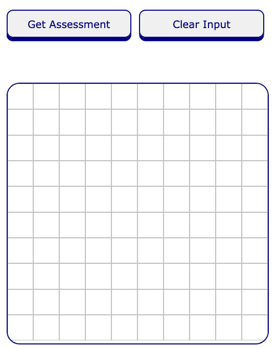
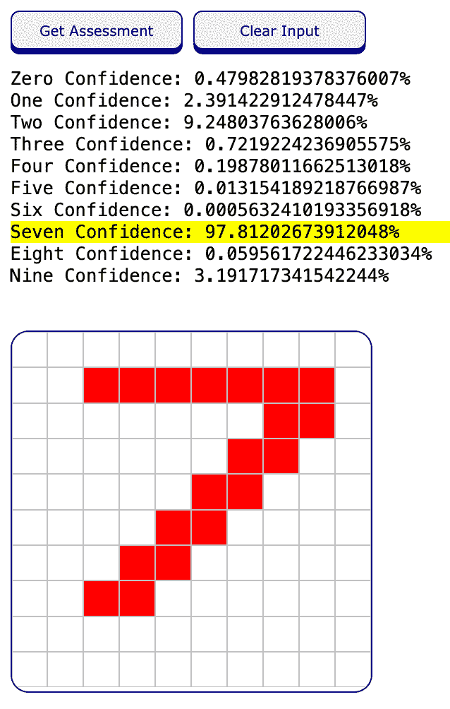
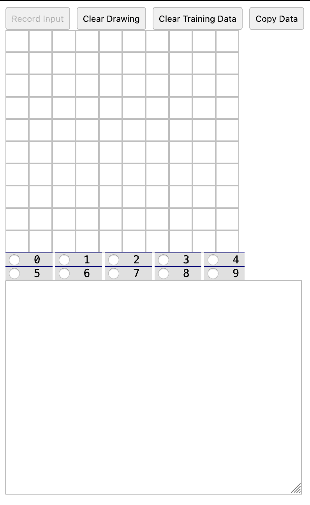
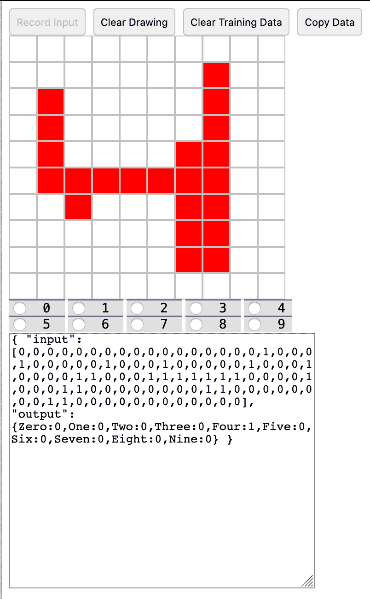

# 借助 Brain.js 仅使用 JavaScript 来构建和训练一个神经网络

> 原文：[`developer.ibm.com/zh/tutorials/build-a-neural-network-with-nothing-but-javascript-using-brainjs/`](https://developer.ibm.com/zh/tutorials/build-a-neural-network-with-nothing-but-javascript-using-brainjs/)

## 简介

对于软件开发，AI 和机器学习是令人兴奋的新前沿领域。虽然新的工具、站点和其他资源层出不穷，但其中大多数都是用 Python（也可能是 R）编写的。如果您是前端开发者（最喜欢的语言可能是 JavaScript），那么可能会好奇自己是否有可能探索这个新领域。

幸运的是，这个问题的答案是肯定的。目前有一些现成的库，可以让您在不了解 Python 的情况下进行机器学习。在本教程中，我们将探索其中之一 – Brain.js，展示如何仅使用 JavaScript 就能构建、训练和使用深度神经网络 (DNN)。

## 学习目标

我们将逐步完成一个预先构建的 DNN。我们将展示如何通过 UI 来运行，深入研究将 UI 连接到 DNN 的代码，然后解释实际创建和训练 DNN 的代码。接着，我们将回过头来解释一些基本概念，介绍什么是 DNN、DNN 的工作原理，以及人们如何创建和改进 DNN。在此过程中，我们将发现 DNN 如何让我们单凭少之又少的代码就能实现令人惊叹的效果。

## 先决条件

本教程假定您之前没有 DNN 或机器学习方面的经验。

对于本教程，您将需要：

*   基本熟悉 JavaScript
*   基本熟悉 Git 和 GitHub

## 预估时间

完成本教程大约需要 30 到 60 分钟。

## 步骤

### 第 1 步. 绘制和预测

克隆代码库后，在您选择的浏览器中打开 number-evaluator.html 文件。加载后，您应该看到以下内容。



这是数字预测应用程序的 UI，该应用程序使用 DNN 猜测您在其网格中绘制的内容。

尝试在网格中绘制数字；可以是 0 到 9 之间的任何值（仅限一位数字）。可以通过以下方法绘制数字：单击网格中的一个正方形，按住鼠标左键并拖动，完成后松开鼠标。

绘制完成后，单击 **Get Assessment** 按钮。这样做应该会产生如图 2 所示的反馈。



要再进行一次预测，可单击 **Clear Input** 按钮，并在网格中绘制另一个数字，然后再次单击 **Get Assessment**。

#### 这就是刚刚完成的操作

到现在为止，但愿您对这个程序的工作方式很感兴趣。目前，您已经与一个预先训练的 DNN 进行了交互。

从最基本的层次上来讲，您正在创建输入（也就是绘制的数字），并将其输入到 DNN 中。反过来，DNN 正在使用以前学会的内容（后面会详细介绍）进行有根据的猜测或预测。代码在用户界面中显示了这一预测结果，并增加了一些细节，例如，突出显示黄色，使网络的选择更加明显。

### 第 2 步. 通过 Brain.js 库以 JavaScript 实现 DNN

我们现在将浏览代码，让您了解通过 Brain.js 库以 JavaScript 实现 DNN 的具体情况。完成此操作后，我们将回过头来更广泛地讨论 DNN 的工作方式，并再次查看将一切组合在一起的代码。

单击 **Get Assessment** 按钮时，我们可以看到它调用了一个名为 `getAssessment()` 的函数：

```
<button onclick="getAssessment()" style="width:49%;">
    Get Assessment
</button> 
```

在 number-evaluator.html 文件中向下滚动时，我们可以看到 `getAssessment()` 的定义：

```
function getAssessment() {
    const inputArray = captureAndTransformInput()
    let ourNetwork = ourNeuralNetwork
    const result = arrayToHTML(resultToArray(ourNetwork.run(inputArray)))

    document.getElementById('assessment').innerHTML = result
} 
```

创建 `getAssessment()` 函数是为了让 UI 可以与 Brain.js 库创建的 DNN 对象进行通信（稍后会对此详加介绍）。

如果要使用 DNN，首先就要获取我们在屏幕上所绘制内容的相关数据。我们需要为 DNN 提供待检查的内容。为此，我们使用为演示创建的另一个函数 `captureAndTransformInput()`。此函数会遍历网页上的网格，并检查哪些框变为红色，哪些框则没有。然后，它会获取全部内容，将整体转换为 1 和 0 的数组，然后将其作为结果返回：

```
function captureAndTransformInput() {
    const boxes = Array.from(document.getElementsByClassName('cell'))
    const toOnesOrZeros = box => box.style.backgroundColor === 'red' ? 1 : 0
    return boxes.map(toOnesOrZeros)
} 
```

我们需要执行此转换，因为 Brain.js 库提供给我们的 DNN 并不知道如何处理原始数据（也就是 HTML 页面中的颜色信息）。我们的 DNN 只知道如何处理 1 和 0 的列表。

用深度学习的说法，我们就是使用 `captureAndTransformInput()` 函数为 DNN 创建一个*输入向量*。

### 第 3 步. 使用 DNN 对绘制的内容进行分类并确定其准确性

所有 DNN 都需要一个输入向量才能奏效。即使是您可能已经听说过的神经网络示例（如处理照片以确定是包含猫还是狗的神经网络示例），也无法直接处理照片。而是依靠脚本（通常是 Python）从照片中获取像素信息，然后将其分解为一长串值，这通常是数字，代表照片中每个像素的每个 RGB 值的不同部分。结果称为输入向量，对于照片，它可以包含许多值。我们正在使用 `captureAndTransformInput()` 进行类似的更简单操作。

既然有了输入向量，我们现在就可以使用 DNN 对刚刚绘制的内容进行分类，并确定其准确性。

使用 Brain.js 库时，您将创建一个对象来保存有关 DNN 的信息。名为 `run()` 的方法就是这个对象的一个方面。这实际上就是生成预测结果，并最终显示在我们看到的网页上：

```
ourNeuralNetwork.run(...) 
```

但在实际使用 DNN 对象之前，我们必须先训练这个对象并设置一些参数。后面会对此稍作解释，但现在，我们将继续了解在生成网络的预测结果之后如何回到网页。

Brain.js 的 `run()` 方法将输入向量作为参数并返回结果。此结果是一个 JSON 有效负载，包含有关 DNN 对所绘制数字进行有根据猜测的信息。对于本教程，我们将 `captureAndTransformInput()` 函数的输出提供给 `run()` 方法：

```
const inputArray = captureAndTransformInput()
const result = arrayToHTML(resultToArray(ourNeuralNetwork.run(inputArray)))
The output of the run() method - i.e., our network’s prediction - is then passed to another “transformer” function we have created called resultToArray():

function resultToArray(resultToConvert) {
    let arrayToReturn = []

    arrayToReturn.push({ label: 'Zero', likelihood: resultToConvert.Zero, topChoice: 0, ordinal: 0 })
    arrayToReturn.push({ label: 'One', likelihood: resultToConvert.One, topChoice: 0, ordinal: 1 })
    arrayToReturn.push({ label: 'Two', likelihood: resultToConvert.Two, topChoice: 0, ordinal: 2 })
    arrayToReturn.push({ label: 'Three', likelihood: resultToConvert.Three, topChoice: 0, ordinal: 3 })
    arrayToReturn.push({ label: 'Four', likelihood: resultToConvert.Four, topChoice: 0, ordinal: 4 })
    arrayToReturn.push({ label: 'Five', likelihood: resultToConvert.Five, topChoice: 0, ordinal: 5 })
    arrayToReturn.push({ label: 'Six', likelihood: resultToConvert.Six, topChoice: 0, ordinal: 6 })
    arrayToReturn.push({ label: 'Seven', likelihood: resultToConvert.Seven, topChoice: 0, ordinal: 7 })
    arrayToReturn.push({ label: 'Eight', likelihood: resultToConvert.Eight, topChoice: 0, ordinal: 8 })
    arrayToReturn.push({ label: 'Nine', likelihood: resultToConvert.Nine, topChoice: 0, ordinal: 9 })

    const byLikelihood = (x, y) => x.likelihood < y.likelihood ? 1 : -1
    const byOrdinal = (x, y) => x.ordinal < y.ordinal ? -1 : 1

    const topChoiceDesignation = (e, i, a) => {
        e.topChoice = i === 0 ? 1 : 0  // mark the first entry (index 0) as the top choice - we can do this because we've already sorted them to ensure that the top choice is the first item 
        return e
    }

    return arrayToReturn.sort(byLikelihood)
        .map(topChoiceDesignation)
        .sort(byOrdinal)
} 
```

此函数获取预测数据 (`resultToConvert`) 并创建一个新数组 (`arrayToReturn`)，该数组包含可用于在 UI 中显示结果的信息。DNN 返回的输出将是一个对象，具有 10 个属性（Zero、One、Two、Three、Four、Five、Six、Seven、Eight、Nine），每个属性都映射了一个概率（介于 0 到 1 之间）。

例如，DNN 中的预测有效负载（`resultToConvert` 参数）可能如下所示（我们的 DNN 很有信心，无论看到什么都认为是数字 4）：

```
// a possible payload for resultToConvert - this data came from the DNN
{
    Zero: 0.1927014673128724,
    One: 1.588071696460247,
    Two: 0.09038684074766934,
    Three: 0.0014367527001013514,
    Four: 94.81642246246338,
    Five: 0.8259298279881477,
    Six: 0.10091685689985752,
    Seven: 0.46726344153285027,
    Eight: 0.30299206264317036,
    Nine: 41.01988673210144
} 
```

我们使用此输出构建一个新数组，其中每个项目都有一个 label 属性（也就是我们所创建并为其赋予“Zero”、“One”等单词值的对象），一个 `likelihood` 属性（用于存储从神经网络接收到的该项目的概率），一个 `topChoice` 属性（由我们自己计算）和一个 `ordinal` 属性（我们为其赋值，例如 0、1、2-9）。我们按照 `likelihood` 对数组进行排序，确定 DNN 的最佳选择，然后使用此信息将项目的 `topChoice` 属性标记为 1 (true) 或 0 (false)。最后，我们会将新构造的数组输入到最终函数 `arrayToHTML()` 中，该函数会将此信息包装在 HTML 标签中：

```
function arrayToHTML(arr) {
    let htmlToReturn = ''
    htmlToReturn = arr.map(x => {
        let styleToUse = x.topChoice === 1 ? 'background-color: yellow;' : ''
        return `<div style="${styleToUse}">${x.label} Confidence: ${x.likelihood * 100}%</div>`
    }).join('')

    return htmlToReturn;
} 
```

除其他操作外，该函数还会对收到的每个项目执行检查，确定其 `topChoice` 属性是否为 1。如果是，则以黄色标记包装该项目。这就是我们在网页上看到的高亮显示。

至此，我们已经看到了从 UI 到 DNN（作为用户输入）以及再从 DNN 到 UI（作为被中继到 UI 的 DNN 输出）的完整过程。

### 第 4 步. 设置 Brain.js 神经网络对象

我们先前指出，要使用 Brain.js 库来创建 DNN 对象，首先需要进行一些设置。这里将深入讨论一下。

在 number-evaluator.html 文件中，我们创建了一个名为 `activate()` 的函数。最初加载 HTML 文档时会触发这个函数，并且我们会在这个函数中定义、创建和训练 DNN。

为此，我们调用 Brain.js 库中的 `NeuralNetwork()` 方法创建一个新的 DNN 对象，如下所示（brain 是我们从 Brain.js 库的本地副本中获得的一个变量，它存储在 local-brain.js 文件中）：

```
// setting up a BrainJS DNN object with two specified hyper parameters
ourNeuralNetwork = new brain.NeuralNetwork({
    activation: 'sigmoid',
    learningRate: 0.1
}) 
```

**超参数**

数据科学家和机器学习工程师创建神经网络时，他们通常需要提供一组初始值，以了解网络在训练后的运行方式。这些初始值或参数称为超参数（简称超参）。它们控制着神经网络调整学习方式的速度，在其隐藏层中使用哪种类型的操作以及许多其他方面。在其他语言和设置中，我们经常需要提供大量的超参数来训练神经网络。但如果使用 Brain.js，我们根本不需要提供任何内容；如果省略任何超参数，库将会提供默认值。

在上面的示例中，我们指定了两个超参数。第一个是名为 `activation` 的参数，我们已将它设置为 `sigmoid`。`activation` 函数是神经网络在其隐藏层中执行的函数，用于处理从某一层到下一层的输入。它们对于帮助神经网络学习至关重要，因为它们有助于控制哪些节点应保持触发状态，哪些节点则应在每一层都保持沉默。`sigmoid` 是一种 `activation` 函数。我们可以使用很多变体（ReLU、Tanh 等等）。每个激活函数都有各自的优缺点。使用 `sigmoid` 特别适合完成像分类这样的任务，而这正是我们在本教程中要实现的目标。

我们指定的另一个超参数是 `learningRate`。学习速率决定了当神经网络尝试创建有用的预测模型时（即，尝试学习如何区分 3 和 7 等内容时），神经网络调整其值的快慢。像指定其他超参数一样，指定学习速率既是艺术又是科学：如果将速率设置得太低，则训练网络所花费的时间长度可能会令人无法接受，比如，如果您在云服务上租用 GPU，这可能会带来实际的财务后果；如果将速率设置得太高，则网络可能永远不会收敛于所谓的“全局最小值”（一种求解方法）。您只有花时间去实践，才能知道合适的初始值应该是怎样的。

### 第 5 步. 训练神经网络

我们一直在说神经网络*学习*，讨论应该如何*训练*，但这到底是什么意思？看起来是什么样子？在我们的教程应用环境中，训练如下所示：

```
const ourTrainingData = getTrainingData()
ourNeuralNetwork.train(ourTrainingData) 
```

基本上，我们将整理一些训练数据 (`getTrainingData()`)，并以此训练我们的 DNN。

训练对于 DNN 的工作方式至关重要。通常情况下，使用有监督学习方法进行训练：我们提供一个数据集，其中包含样本输入和答案（或标签，有时也称为参考标准标签），用于描述该数据行的正确分类。在训练 DNN 时（Brain.js 允许以 `train()` 方法开始），它会使用这些标签来帮助自己学习。

但是，网络究竟如何学习呢？

从本质上说，它是从随机猜测开始的，并且每次通过我们提供的训练数据时，都会不断调整其公式，直到用完机会（即达到我们想要执行的最大迭代次数，这可能是另一个超参数），或者达到我们认为可以接受的精度阈值（同样也可能是另一个超参数）。机会的次数由一个名为 `iterations` 的超参数指定，默认值为 20000，除非您像我们之前那样为学习速率和激活指定了不同的值。这意味着一旦您在 DNN 对象上调用 `train()` 方法，底层库就将对训练数据进行多达 20,000 次迭代，试图揭示手写数字的奥秘。“可接受的准确度”是由另一个名为 `errorThresh` 的超参数设置的。Brain.js 库将此参数的默认值设置为 0.005，除非您为其提供不同的值。一旦满足以下任一条件，DNN 就会停止训练（学习）。

DNN 中的每个节点都有一组权重，它会将这组权重分配给从它之前层中所有节点收到的每个输入。然后，该节点会将每个输入乘以其关联的权重，求出总和，将此求和的值用作指定的任何激活函数的输入（我们之前讨论过），并触发使激活函数的输出（单个新值）进入下一层中每个节点的操作。每个隐藏层中的各个节点都会接收前一层所有节点的输出作为输入。所有此类计算都会产生预测结果，网络随后可以根据您为其提供的标签进行测试，确定预测结果的正确或错误程度。网络能够为该次运行预测结果的正确或错误程度分配一个数学值，并将该值与前一次运行的值进行比较，确定在应该预测的内容方面（这里即我们绘制的数字）是变得更好还是更差。它会使用这一差异进行回溯，并在特定方向分别调整每个权重（增加或降低权重，即反向传播过程），然后再次遍历整个过程，直到达到迭代次数，或者低于为 `errorThresh` 设置的任意值。对于人类而言，这项任务单调而乏味，很可能无法完成，而在功能更强大的处理芯片的帮助下，计算机轻而易举便可完成。

听起来确实很疯狂。我们怎样才能做到呢？

我们完全可以袖手旁观，让 DNN 为我们代劳。虽然您可以通过在 `train()` 调用中将 `log` 超参数指定为 true 来跟踪 DNN 的学习状况，但是所有这些权重调整活动（训练）对我们而言都是不可见的。

我们所要做的就是为网络提供一些训练数据（输入和参考标准标签），然后静待 Brain.js DNN 对象（`ourNeuralNetwork` 对象）完成繁重的模型构建工作。如果一切顺利，我们将使用模型创建 DNN，该模型可以准确预测从未见过的手写数字。

### 第 6 步. 训练数据

如果看一下 `getTrainingData()` 函数，我们就可以确切了解 DNN 正在学习什么。

Brain.js 允许我们通过训练数据指定输入数据的内容，以及希望从神经网络中看到的输出。主要的要求就是我们提供输入和输出属性。可以在 [Brain.js GitHub 代码库](https://github.com/BrainJS/brain.js)的 Training Options 下找到更多信息。

下面是其中的一个训练行：

```
{ "input": [0, 0, 0, 0, 0, 0, 0, 0, 0, 0, 0, 0, 1, 1, 1, 1, 1, 0, 0, 0, 0, 0, 1, 0, 0, 0, 1, 1, 0, 0, 0, 1, 1, 0, 0, 0, 0, 1, 0, 0, 0, 1, 0, 0, 0, 0, 0, 1, 0, 0, 0, 1, 1, 0, 0, 0, 0, 1, 0, 0, 0, 0, 1, 1, 0, 1, 1, 1, 0, 0, 0, 0, 0, 1, 1, 1, 0, 0, 0, 0, 0, 0, 0, 0, 0, 0, 0, 0, 0, 0, 0, 0, 0, 0, 0, 0, 0, 0, 0, 0], 
    "output": { 
        Zero: 1, 
        One: 0, 
        Two: 0, 
        Three: 0, 
        Four: 0, 
        Five: 0, 
        Six: 0, 
        Seven: 0, 
        Eight: 0, 
        Nine: 0 
        } 
    } 
```

在有效负载的 `input` 部分中，我们提供了很多 1 和 0。回想一下前面提到的 1 和 0 这样的大列表，这是我们的手写数字经过应用程序的代码处理后的样子。我们告诉 Brain.js DNN，这是它应该期望并要学会处理的输入数据的“形状”（输入向量的形状）。

如果进一步往下看，就会看到我们有一个输出部分，其中包含 10 个属性，每个属性对应了网络可能提供的一位数字。但别忘了，这是训练数据，因此我们在此特定记录上将 Zero 属性标记为 1，以此来表示 `input` 属性中的 1 和 0 的大列表对我们人类而言代表零。（其他行在其他属性上设置的值为 1；例如，数字 4 的示例会将 Four 属性设置为 1，而 Zero 将设置为 0。）

手动标记的输出部分是我们前面所讨论的参考标准标签。这将帮助 DNN 在训练过程中知道如何区分我们看起来像“7”与看起来像“0”的 1 和 0 的 Blob。通过此输出设置，我们告诉 Brain.js 构建一个 DNN，以在给出预测时返回具有这 10 个属性的对象。

当我们运行 DNN 并为其提供某个手写数字时，它返回的预测将是类似于上述输出标签的有效负载。同样，输出内容的示例如下：

```
{
    Zero: 0.1927014673128724,
    One: 1.588071696460247,
    Two: 0.09038684074766934,
    Three: 0.0014367527001013514,
    Four: 94.81642246246338,
    Five: 0.8259298279881477,
    Six: 0.10091685689985752,
    Seven: 0.46726344153285027,
    Eight: 0.30299206264317036,
    Nine: 41.01988673210144
} 
```

以上是我们前面讨论的 `resultToArray()` 和 `arrayToHTML()` 函数用来完成其工作的属性和值。

须注意，尽管每个值可能看起来都像是百分比概率，但它们并不需要和为 1。每个值只是一个单独度量，表示 DNN 认为您所绘制内容就是该特定属性所表示内容的强烈程度。对于上面的示例，它认为我们最有可能绘制了“4”（因为 Four 属性具有最高值），其次则可能是“9”（因为分配给 Nine 的值是第二大的值）。

在处理 DNN 或其他类型的机器学习神经网络时，这一点儿也不反常。作为开发者，我们习惯编写的代码返回离散值，如 True 或 False，或者一个字符串或一个数字。而人工智能、机器学习和 DNN 的世界则是一个概率世界。因此，我们不寻求 DNN 返回特定值来响应我们的输入。我们寻找的是某个值范围内的相对值。在这里，也就是 DNN 为其分配了最高分数的 number 属性。

**模型**

务必要记住的一点是，DNN 通过与我们的交互创建了一个模型。*模型*本质上是一种算法或巨型函数，可读取输入（这里就是您在屏幕上绘制的内容），并以不同的置信度对提供给它的内容进行预测。创建模型是构建和训练 DNN（以及其他类型的机器学习网络）的重点。因为一旦创建了（有用的）模型，便可以部署和使用（并在以后根据需要加以改进）。作为 DNN 的创建者和训练者，您通常不会直接查看模型（例如，对于从具有数百万个节点的 DNN 创建的模型，您根本上不可能搞清楚）。您只需要了解，它作为预测器或分类器执行任务的准确性如何。

如果您从未学习过 DNN 或机器学习，这一切对您来说听起来很陌生，也不用担心，消化吸收这些概念可能需要一段时间。与此同时，您应该感到自豪的是，自己也已加入了创建机器学习模型的人群中来！

**未优化**

我们在本教程中创建和使用的神经网络非常简陋。现实世界中使用的大多数网络要远远复杂得多（轻轻松松就会有数百万个节点）。

在此处的样本应用中，每次加载（或重新加载）HTML 页面时，我们都会创建和训练网络。由于我们的网络很小，这不会造成问题。但这并不是一个好的做法。在现实系统中，您很可能会使用耗时数天、数周乃至数月时间进行训练的 DNN（模型）。训练通常是任何模型/网络创建过程中唯一最耗时的部分。显然，您无法在每次加载应用或网页时都执行这一操作，除非您的用户非常有耐心。您可以改为对模型（网络）进行缓存，然后将其部署到内存中以进行会话，或者将其包装在客户端可以使用的 API 调用中。虽然训练 DNN 通常是一项耗时的任务，但一旦创建，它们通常便可以非常快速地执行预测。

由于我们每次运行程序时都会创建一个新的 DNN，这也为您的实验带来了一定的自由度。您可以尝试添加或删除训练数据，查看这些变更对 DNN 性能的影响。例如，您可以尝试注释掉数字“5”的训练示例的一半（或全部！），然后看看对其性能有何影响（尤其是绘制“5”时）。您也可以查阅 Brain.js 文档，看看还可以指定哪些超参数，了解这对网络准确性有何影响。

**提供您自己的训练数据**

您可能想知道 `getTrainingData()` 函数中所有训练数据的来源。这里使用了一个名为 training-data-recorder.html 的配套文件来创建条目；参见下图



该文件使用的网格与 number-evaluator.html 文件中的相似，只不过这里的网格用于创建训练样本（即，不会与 DNN 对话）。

可通过以下操作创建一个新的训练示例：

1.  在网格中绘制一个数字。
2.  重要注意事项：对您刚才绘制的内容进行分类。通过单击网格下方的一个单选按钮来执行此操作。例如，如果要添加“4”的训练示例，则可以选择 4 的单选按钮。选择一个类别后，将启用 Record Input 按钮。
3.  单击 **Record Input** 按钮。这样将在底部的文本框中创建一个条目，按照对本教程中的 DNN 有用的方式设置格式。
4.  单击 **Copy Data** 按钮，将文本框中的任何内容都复制到剪贴板上。完成此操作后，您可以将该条目粘贴到 number-evaluator.html 文件中的 `getTrainingData()` 函数中（如果愿意，也可以手动复制）。 

5.  要清除所绘图形，但不删除底部的训练数据，可单击 **Clear Drawing**。

6.  要在不删除所绘图形的情况下清除底部的训练数据，可单击 **Clear Training Data**。

## 结束语

在本教程中，我们展示了如何仅使用 JavaScript 来实现和训练一个 DNN，这多亏有了 Brain.js 库 – 因为这些任务通常需要 Python 以及 Keras、Pytorch 或 TensorFlow 之类的库。我们证明了只需非常少的代码就可以创建有效的数字识别器。我们还学习了机器学习的一些基本构建块和实践，例如，为 DNN 指定学习速率和激活函数（以及其他超参数）。我希望通过本教程，您可以明白，即使之前没有任何经验，也可以开始学习 AI 和机器学习，而且还可以采用像 JavaScript 这样的熟悉语言。浏览下面的链接，可找到更多资源来开启您的 AI 旅程。

本文翻译自：[Build and train a neural network with nothing but JavaScript using Brain.js](https://developer.ibm.com/tutorials/build-a-neural-network-with-nothing-but-javascript-using-brainjs/)（2020-07-27）