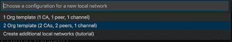

# 侦听来自分布式区块链网络的事件

> 原文：[`developer.ibm.com/zh/tutorials/listen-to-events-from-a-distributed-blockchain-network/`](https://developer.ibm.com/zh/tutorials/listen-to-events-from-a-distributed-blockchain-network/)

在本教程中，您将学习如何使用 Java 微服务侦听采用 Open Liberty 的分布式区块链网络的事件。具体来说，使用 Hyperledger Fabric SDK for Java 和 Open Liberty 提交事务并侦听事件。

“将 Java 微服务与区块链集成“（IBM Developer，2020 年 6 月）：了解区块链和 Open Liberty 的基础知识。启动一个单组织区块链网络，并使用 Open Liberty 向区块链执行事务。

具体来说，您将学习如何执行以下操作：

*   使用 IBM Blockchain Platform 扩展来创建一个双组织分布式本地区块链网络，并部署名为“FabCar”的样本智能合约
*   使用 Open Liberty 开发工具启动三个 Java 微服务
*   通过 Org1 Java 微服务在区块链网络上执行事务
*   在 Org2 Java 微服务上侦听从 Hyperledger Fabric 发出的事件
*   更新汽车的所有者并查看事件
*   按汽车 ID 查询汽车和整体账本状态

使用区块链可为供应链提供永久性的事务记录，这些记录被分组到不可篡改的块中，从而取代可能导致供应链出现不准确性和欺诈的传统纸质跟踪和人工检查系统。

本教程演示了使用汽车销售供应链中的卖方（组织 1）和买方（组织 2）的分布式区块链网络的场景。

卖方将向区块链网络添加一辆汽车，而买方将在新车辆被添加到区块链后通过发出的事件获得通知。

买方可以通过两种方式侦听事件：

*   查询上一个事件，或者
*   通过自动更新新事务数据的 Web 界面侦听事件

## 架构流程


1.  开发者使用 Java 开发智能合约（一个预配置的“FabCar”样本）。
2.  使用 IBM Blockchain Platform VS Code 扩展打包去中心化的“FabCar”智能合约。
3.  设置并启动 IBM Blockchain Platform 2.0 服务。
4.  IBM Blockchain Platform 2.0 服务支持在 Docker 容器中创建网络，并且能够在针对两个组织的网络上以本地方式安装和实例化“FabCar”智能合约。
5.  卖方使用 Open Liberty Organization 1 将新汽车添加到账本中。
6.  买方使用 Open Liberty 侦听事务，随后与 IBM Blockchain Platform 2.0 上已部署的网络进行交互。
7.  账本上添加的汽车会自动发出事务事件，而买方将收到上述事务。
8.  买方可以查询上一个事件或接收自动更新。

## 前提条件：

*   Java
*   Git
*   Maven
*   Docker
*   VS Code
*   Linux 或 Mac OS

## 步骤

*   获取开发工具。
*   将 Open Liberty 项目导入到 VS Code 中。
*   将 FabCar 样本智能合约项目导入到 VS Code 中.
*   启动一个双组织区块链网络，并将合约部署到这两个组织。
*   导出 Org1 和 Org2 的凭证，以便与区块链网络进行通信。
*   启动 Org1 和 Org2 微服务。
*   从 Org1 以卖方身份向账本中添加一辆汽车。
*   从 Org2 以买方身份查询总体账本状态。
*   查看来自 Hyperledger Fabric 的事件。
*   通过 Web 界面侦听事件。
*   从 Org2 更新账本上汽车的所有者。
*   在账本中查询特定汽车。
*   停止 Open Liberty 微服务。
*   停止区块链网络。

1

## 获取开发工具

1.  下载并[安装 Visual Studio Code V1.38](https://code.visualstudio.com/download)（如果尚未安装）。

2.  安装 [IBM Blockchain Platform VS Code 扩展](https://marketplace.visualstudio.com/items?itemName=IBMBlockchain.ibm-blockchain-platform)。

    安装后，如果需要任何其他必备软件，该扩展将指导您进行安装。确保您获得了 Docker 必备软件，因为它们将用于创建您的 Fabric 网络。

3.  安装 [Open Liberty Tools for VS Code](https://marketplace.visualstudio.com/items?itemName=Open-Liberty.liberty-dev-vscode-ext)。

2

## 将 Open Liberty 项目导入到 VS Code 中

在我们演示事件驱动的微服务架构期间，将启动 3 个 Open Liberty Java 微服务。Org1-Functions 为卖方处理与区块链网络的事务，Org2-Functions 为买方处理与区块链网络的事务，而 Org2-Events 为买方侦听事件。

1.  打开一个终端窗口，然后在 GitHub 中克隆[样本项目](https://github.com/tomjenningss/eventing-openliberty-blockchain)：

    `git clone https://github.com/IBM/eventing-openliberty-blockchain.git`

2.  要将 Org1-Functions 项目添加到 VS Code 中，选择 **File** > **Open** > **eventing-openliberty-blockchain/microservices/org1-microservice/org1-OL-Blockchain-Functions**，然后单击 **Open**。

    这会将 Org1 项目添加到工作区中，并自动将 `Liberty Dev Dashboard` 添加到 VS Code 扩展中。要显示 `org1-ol-blockchain-functions`，可以单击 `Liberty Dev Dashboard`。

3.  选择 **File** > **New Window** 打开一个新的 VS Code 窗口以添加 Org2-Functions 项目。

4.  要导入 Org2 项目，选择 **File** > **Open** > **eventing-openliberty-blockchain/microservices/org2-microservices/org2-OL-Blockchain-Functions**，然后单击 **Open**。

    打开 `Liberty Dev Dashboard` 以查看 `org2-ol-blockchain-functions`。

5.  选择 **File** > **New Window** 打开一个新的 VS Code 窗口以添加 Org2-Events 项目。

6.  要导入 Org2-Events 项目，选择 **File** > **Open** > **eventing-openliberty-blockchain/microservices/org2-microservices/org2-OL-Blockchain-Events**，然后单击 **Open**。

    要显示 `org2-ol-blockchain-events`，可以单击 **Liberty Dev Dashboard**。

3

## 将 FabCar 样本智能合约项目导入到 VS Code 中

1.  单击右上角的 IBM Blockchain Platform 图标（像一个正方形）。

    

    可能需要片刻时间。在底部的紫色条中，将显示“Activating extension”。

2.  从“Other Resources”部分中选择 **Sample Code: FabCar**。

3.  单击 **Clone** 按钮以对 FabCar 样本的样本代码执行 git clone 命令，然后选择一个克隆 Fabric 样本的便利位置。

4.  选择 **Clone**。

    

5.  从选项列表中，选择 **FabCar v1.0.0 Java**。

6.  单击 **Open Locally**。

    

7.  在命令面板中，单击 **Add to workspace**。

8.  *可选*：单击左上角的 **File explorer** 按钮，您将看到 `fabcar-contract-java`，也就是智能合约项目。

9.  单击左侧的 IBM Blockchain Platform 图标以导航回 IBM Blockchain Platform VS Code 扩展。

4

## 启动一个双组织区块链网络并部署合约

1.  在 **FABRIC ENVIRONMENTS** 中，选择添加 (+) 图标来创建一个定制的区块链网络。

2.  选择 **Create new from template**，使用模板区块链网络结构。

3.  在创建双组织网络时，选择 **2 Org template (2CAs, 2 peers, 1 channel)**。

    

4.  将该环境命名为 `2 Org Local Fabric`。

    启动新的本地环境将花费 2 到 5 分钟的时间。启动成功后，将显示“Successfully added a new environment”。

5.  单击 **2 Org Local Fabric** 以连接到本地 Fabric 运行时。连接到“2 Org Local Fabric”环境后，选择 **Smart Contracts** > **Instantiated**，**+ Instantiate**。

6.  选择 **fabcar-contract-java Open Project**（在命令面板提示中）。

7.  系统出现“Enter a name for your Java Package”提示时，输入 `fabcar`，然后按 **Enter**。

8.  系统出现“Enter a version for your Java package”提示时，输入 `2.0.0`。

9.  选择所有对等节点以安装智能合约，然后单击 **OK**。

    在供应链环境中，智能合约是各方之间的自我执行协议。如果所有各方都同意受该智能合约的约束，那么就可以将数据添加到区块链中。

    在我们的示例中，买卖双方都同意智能合约的条款和条件。

    

10.  显示“Optional functions”时，输入 `initLedger`。这将初始化包含唯一汽车的账本。不输入函数将导致块链网络为空。

    

11.  对于所有其他的“Optional functions”，按 **Enter** 跳过。

12.  当系统询问“Do you want to provide a private data collection configuration file?”时，选择 **No**。您不需要任何私有数据配置文件。

    左下角的通知窗口将显示“IBM Blockchain Platform extension: Instantiating Smart Contract”。实例化智能合约将花费大约 2 到 5 分钟的时间。

5

## 导出用于与区块链网络通信的凭证

为了使 Open Liberty 能够与区块链网络通信，除非您有特定的概要文件和证书颁发机构，否则 Hyperledger Fabric 提供的安全功能会阻止应用程序试图执行事务。

1.  导出本地 Fabric 网关：

    1.  在“FABRIC GATEWAYS”面板中，选择 **2 Org Local Fabric**。

        由于有多个组织，我们需要以管理员身份连接到 `Org1` 和 `Org2` 才能导出连接配置文件。

    2.  选择 **Org1**。

    3.  命令面板中将显示“Choose an identity to connect with”。选择 **admin**。

        

    4.  将鼠标悬停在 **FABRIC GATEWAYS** 标题上，然后单击 **…**> **Export connection profile**。

        

    5.  `finder` 窗口将会打开。

    6.  导航到 `Users/Shared/`。

    7.  创建新文件夹 `FabConnection`。

        完整的目录路径应该为 `Users/Shared/FabConnection`。

    8.  将 `.json` 文件另存为 `2-Org-Local-Fabric-Org1_connection.json`。

    9.  断开与 Org1 Fabric 网关的连接。

        

    10.  选择 **Org2**。

    11.  命令面板中将显示“Choose an identity to connect with”。选择 **admin**。

    12.  将鼠标悬停在 **FABRIC GATEWAYS** 标题上，然后单击 **…**> **Export connection profile**。

    13.  `finder` 窗口将会打开。

    14.  导航到 `Users/Shared/FabConnection`。

    15.  将 `.json` 文件另存为 `2-Org-Local-Fabric-Org2_connection.json`。

2.  导出 Fabric 钱包：

    1.  在“FABRIC WALLETS”面板中，选择 **2 Org Local Fabric**，然后右键单击 **Org1** 并选择 **Export Wallet**。

        

    2.  将该文件夹另存为 `org-1-wallet` 并保存到 `/Users/Shared/FabConnection/` 目录中。

    3.  要导出 Org2 钱包，选择 **Org2**，然后单击右键并选择 **Export Wallet**。

    4.  将该文件夹另存为 `org-2-wallet` 并保存到 `/Users/Shared/FabConnection/` 目录中。

6

## 启动 Org 1 和 Org 2 微服务

1.  您将打开三个 VS Code 窗口。导航回到包含 Org1 的 Java 微服务的 VS Code 窗口。由于我们已经为 Open Liberty 安装了 `Dev Tool`，因此可单击 Liberty Dev Dashboard 图标，然后该扩展将显示以下项目：`org-1-ol-blockchain-functions`.

2.  右键单击 **org1-ol-blockchain-functions**，然后选择 **Start**。

    这将在 2 到 5 秒内快速启动微服务。

    org-1-ol-blockchain-functions 现在正在端口 9080 上运行。

3.  导航到其他 VS Code 窗口，然后单击 Liberty Dev Dashboard 图标，该扩展将显示项目。

    右键单击 **org2-ol-blockchain-events**，然后选择 **Start**。

    org2-ol-blockchain-events 现在正在端口 9081 上运行。

    右键单击 **org2-ol-blockchain-functions**，然后选择 **Start**。

    org2-ol-blockchain-functions 现在正在端口 9082 上运行。

7

## 以卖方身份将一辆汽车添加到账本

由于有两个组织，我们将测试以卖方身份提交事务，然后以买方身份查看更新的账本。

1.  导航到卖方的 Java 微服务，在端口 9080 上：

    `http://localhost:9080/openapi/ui/`

2.  导航到 **POST /System/Resources/Car Add a car to the ledger**。

3.  单击 **Try it out**。

4.  用以下值填写示例模式：

    ```
    {
      "make": "VW",
      "model": "Golf",
      "colour": "White",
      "owner": "Tom J",
      "key": "CAR20"
    } 
    ```

8

## 以买方身份查询总体账本状态

买方可能想要购买一辆二手车，将在区块链上查询所有汽车。

1.  导航到买方的 Java 微服务，在端口 9082 上：

    `http://localhost:9082/openapi/ui/`

2.  打开一个新标签页，导航到 **GET /System/Resources/Cars Returns all cars** > **Try it out** > **Execute**。

    这将向账本发送一个请求，并返回所有汽车。

    成功的响应结果应如下所示：

    ```
    [
     {
       "owner": "Tomoko",
       "color": "blue",
       "model": "Prius",
       "make": "Toyota"
     },
     {
       "owner": "Brad",
       "color": "red",
       "model": "Mustang",
       "make": "Ford"
     },
     ...
     {
      "owner": "Tom",
      "color": "White",
      "model": "VW",
      "make": "Golf"
     }
    ] 
    ```

9

## 查看来自 Hyperledger Fabric 的事件

下图展示了 Open Liberty 如何以本地方式侦听来自 Hyperledger Fabric 的事件。


1.  卖方提交一个事务，Java 微服务处理汽车，并将其添加到区块链网络。

    可以从任何组织查询车辆，如本教程操作说明的步骤 8 所示。

2.  当买方或卖方向账本提交事务时，Hyperledger Fabric 将发出一个事件。组织 1 没有进行侦听上述事件的配置，因为卖方不希望收到事件通知。

3.  组织 2 进行了侦听上述事件的配置，因此该组织将收到由 Org1 触发的事件。

4.  这是组织 1 和组织 2 之间的事件驱动型架构。组织 2 自动接收从 Hyperledger Fabric 发出的事件，并通过 servlet (5) 显示这些事件。

### 提交一个新事务

1.  导航到卖方的 Java 微服务，在端口 9080 上：

    `http://localhost:9080/openapi/ui`

2.  导航到 **POST /System/Resources/Car Add a car to the ledger**。

3.  用以下值填写示例模式：

    ```
     {
      "make": "Audi",
      "model": "A6",
      "colour": "Black",
      "owner": "David J",
       "key": "CAR21"
     } 
    ```

4.  Org2 通过侦听事件自动接收事件数据。

5.  导航到买方的 Java 微服务，在端口 9081 上：

    `http://localhost:9081/openapi/ui`

6.  导航到 **GET /System/Resources/TransactionId Returns transactionId data**。

7.  查看已收集的事件的内容。

    

8.  可选：用您自己的汽车信息填写示例模式（schema），并查看您的汽车的最新事件。

9.  导航到 **GET /System/Resources/Events Returns events**。

    

    提交到 Hyperledger Fabric 的每个事务都有唯一的事务 ID。选择 **Execute** 将返回唯一的事务 ID 数据。

### 通过 Web 界面侦听事件

在您选择的 Web 浏览器中打开另一个标签页，体验侦听事件的事件驱动型架构。

1.  导航到：

    `http://localhost:9081/org-2-ol-blockchain-events/servlet`

    Servlet on Org2 使用 [servlet](https://openliberty.io/guides/maven-intro.html#creating-the-project-pom-file) 自动侦听从 Hyperledger Fabric 中发出的事件。

    

2.  导航到 Org1 并向账本中添加一辆汽车：**Post /System/Resources/Car Add a car to the ledger**。

3.  单击 **Try it out**。

4.  用以下值填写示例模式，如上图所示：

    ```
    {
      "make": "Ford",
      "model": "Fiesta",
      "colour": "Blue",
      "owner": "Hannah J",
      "key": "CAR22"
    } 
    ```

    该事件成功出现在买方的窗口中，显示已添加到账本中的最新事务。 窗口每隔五秒钟刷新一次以侦听新事件；但是，事件可能需要几秒钟的时间才能显示出来。

尝试将更多的汽车添加到账本中，以及查看从 Hyperledger Fabric 中发出的事件。

## 10\. 更新汽车的所有者

组织 2 上的买方可能决定要从卖方那里购买该汽车。

1.  导航到 Org2：

    `http://localhost:9082/openapi/ui/`

更新汽车的所有者：**PUT /System/Resources/Car Update the owner of a car in the ledger**。

1.  单击 **Try it out**。

2.  用以下值填写示例模式：

    ```
    {
      "make": "string",
      "model": "string",
      "colour": "string",
      "owner": "Yasmin A",
      "key": "CAR22"
    } 
    ```

## 11\. 在账本中查询特定汽车

由于区块链是分布式的，您可以从任何组织查询特定汽车。但是，由于买方已同意购买该汽车，因此可以从 Org2 进行查询：

`http://localhost:9082/openapi/ui/`

除了唯一的事务 ID 外，每辆汽车都有唯一的密钥。事务 ID 和密钥之间的区别在于，每次执行事务时都使用相同的密钥，而事务 ID 会改变；但密钥不会改变。

1.  在 OpenAPI UI 中，选择 **GET /System/Resources/Car Returns an individual car by key**。

2.  重新查询 CAR22 以查看更新后的所有者.

    通过插入 ID **CAR22** 并单击 Execute 来查询最近添加的汽车。

    成功的响应结果应如下所示：

    ```
    {
      "owner": "Yasmin A",
      "color": "Blue",
      "model": "Fiesta",
      "make": "Ford"
    } 
    ```

## 12\. 停止 Open Liberty 微服务

完成后，以这两个组织的身份分别转到 VS Code > Liberty Dev Dashboard，然后单击 **Stop**。这会停止 Open Liberty 服务器。

现在，该服务器已关闭，应用程序不再运行。如果您试图点击其中一个端点，您将找不到该端点。

## 13\. 停止区块链网络

*可选*：如果您决定之后还要继续使用区块链网络，则可以停止区块链网络，并将状态保存在账本中。单击左侧的 IBM Blockchain Platform 图标。在 Fabric Environments 中，单击 **…**> **Stop Fabric Environment**。

1.  只需单击 **2 Org Local Fabric**，便可轻松地再次启动。

要移除正在运行区块链网络的 Docker 镜像，在 Fabric Environments 中单击 **…**> **Teardown Fabric Environment**。

## 结束语

做得很好。您已经创建了一个双组织网络，不同的组织都可以向区块链提交事务，包括添加、更新和查询，以及使用 Hyperledger Java SDK 和 Open Liberty 侦听来自区块链的事件。

本文翻译自：[Listen to events from a distributed blockchain network](https://developer.ibm.com/tutorials/listen-to-events-from-a-distributed-blockchain-network/)（2020-07-29）