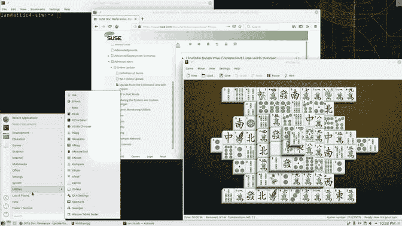
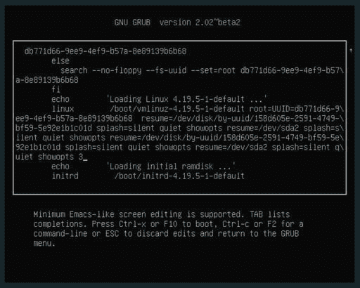
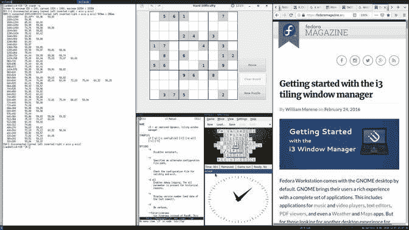
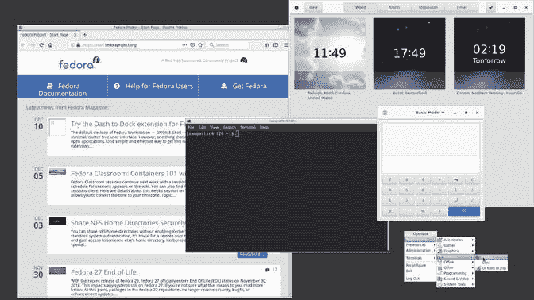
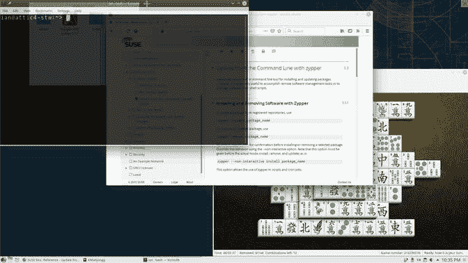
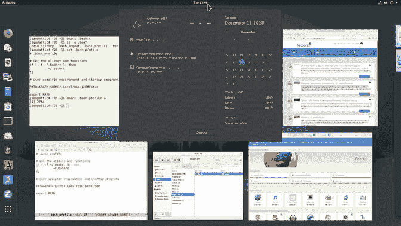
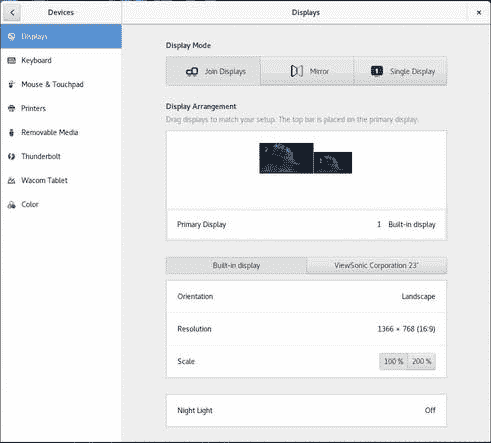
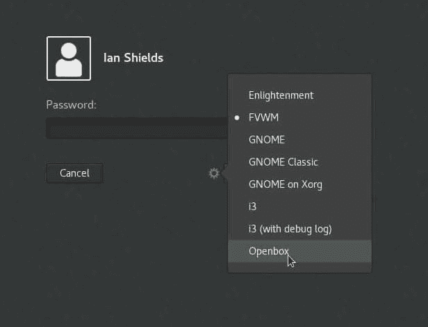

# 学习 Linux 101：安装和配置 X11

> 原文：[`developer.ibm.com/zh/tutorials/l-lpic1-106-1/`](https://developer.ibm.com/zh/tutorials/l-lpic1-106-1/)

## 概述

在本教程中，将学习如何为 Linux 系统安装和配置 X11。学习：

*   了解 X11 架构。
*   了解 X Window 配置文件的基础知识。
*   覆盖 Xorg 配置的特定方面，例如键盘布局。
*   了解桌面环境的组件，例如显示管理器和窗口管理器。
*   管理对 X 服务器的访问，并在远程 X 服务器上显示应用程序。
*   了解 Wayland。

## 什么是 X11？

##### 关于本系列教程

本系列教程将帮助您了解 Linux 系统管理任务。您还可以使用这些教程中的资料来准备参加 [Linux Professional Institute 的 LPIC-1：Linux 服务器专业认证考试。](https://www.lpi.org/)

参阅“[学习 Linux 101：LPIC-1 学习路线图](https://developer.ibm.com/zh/tutorials/l-lpic1-map/)”，获得本系列中每个教程的描述和链接。该路线图仍在制定中。本教程反映了 2018 年 10 月 29 日更新的 5.0 版本的目标。在教程完成时，会将它们添加到路线图中。

X Window 系统（也称为 X11，或简称 X）是用于位图显示的客户端/服务器窗口系统。它可以在大多数类似 UNIX 的操作系统上实现，并且已移植到许多其他系统上。X 服务器是显示窗口和处理输入设备（例如键盘、鼠标和触摸屏）的程序或专用终端。客户端是应用程序。

本教程将帮助您围绕 Linux 系统管理员 (LPIC-1) 考试 101 的 106 主题中的 106.1 目标进行应考准备。该目标的权重为 2。

## 前提条件

要想最充分地利用本系列教程，您应该掌握 Linux 的基本知识，还应该有一个正常工作的 Linux 系统，您可以在这个系统上练习本教程涉及的命令。有时候，程序的不同版本将获得不同的输出格式，所以您的结果可能并不总是与这里显示的清单和图完全相同。本教程中的示例来自 Fedora 28、openSUSE Tumbleweed (20181204) 和 Ubuntu 18.04 LTS。

## X 概览

X 最初是在 1984 年由麻省理工学院 (MIT) 开发。客户端/服务器 X 协议的版本为 11 (X11)，自 1987 年以来一直是此版本。X 项目现在由 X.Org 基金会领导，具有最新的参考实现 X.Org Server，作为免费的开源软件提供。它基于 MIT 许可和类似的宽松许可。

X 架构提供一个相当原始的图形显示客户端/服务器框架，支持在显示器上绘制和移动窗口以及与输入设备（例如键盘、鼠标、平板电脑或触摸屏）进行交互。X 被设计为对网络透明，因此 X 服务器可以显示来自本地或网络应用程序源的窗口。在许多用户共用非常昂贵的计算机的时代，X 终端为许多用户共享一台计算机的资源提供了一种低成本方式。该终端实现 X 协议，而计算机处理需要完成的其余工作。

单个应用程序窗口会占据显示屏的部分或全部空间，并且用户通常会同时打开多个这样的窗口。X 没有指定应该如何完成此类管理任务，因此管理器程序通常支持同时打开多个窗口。此类管理器的示例包括 GNOME 或 KDM 显示管理器或 Enlightenment 窗口管理器。这些界面通常提供诸如框架、标题栏和标准菜单之类的功能，并且通常为用户提供启动程序的方式。因此，不同的系统即使都使用 X，在外观和感觉上也会有很大的不同。在本教程的后面，我将讨论有关窗口管理器和显示管理器的更多信息。

合并和显示几个应用程序窗口的必需部分称为合成。这是窗口管理器功能的一部分。X 处理应用程序请求，将它们传递至管理器的合成器，以组装要显示给用户的窗口。然后将最终图像传递回 X 服务器进行显示。

图 1 显示了典型的现代 Linux 桌面的示例（来自 openSUSE Tumbleweed）。打开了三个窗口，用户正在使用系统菜单启动另一个应用程序。

*图 1\. openSUSE 桌面的示例*


## X Window 配置文件

在 X 的早期，配置显示器意味着要充分了解显示器的功能，并具备表达有关分辨率、水平和垂直同步值和色深等信息的能力。自视频电子标准协会 (VESA) 和显示数据通道 (DDC) 协议（这些协议允许显示器将这些功能传达给显卡，进而传达给计算机）问世以来，配置变得更加自动化。这是件幸运的事，因为现在我们希望能够将笔记本电脑随身携带，只需插入可用的外接显示器或投影仪即可。

配置鼠标、轨迹球或键盘也变得更加自动化。通常，您只需通过 USB 连接插入设备即可使用。

但是，与 Linux 中的大多数系统一样，您可以使用一种底层配置机制。实际上，X 的 Xorg 实现从多个来源获取配置信息。主要配置文件是 xorg.conf 以及 xorg.conf.d 目录中包含的文件。它们通常位于 /etc/X11 中。其他配置可以来自命令行选项、环境变量、自动检测和回退默认值。

可以将 xorg.conf 配置文件以及 xorg.conf.d 目录中的文件组织成可按任意顺序指定的节。清单 1 中显示了一般的节格式。

*清单 1\. xorg.conf 中的节布局*

```
 Section  "SectionName"
        SectionEntry
        ...
    EndSection 
```

如果省略了某个节，那么将使用其他来源或默认值。

您可以包含以下节：

*   Files – 文件路径名
*   ServerFlags – 服务器标志
*   Module – 动态模块加载
*   Extensions – 扩展启用
*   InputDevice – 输入设备描述
*   InputClass – 输入类描述
*   OutputClass – 输出类描述
*   Device – 图形设备描述
*   VideoAdaptor – Xv 视频适配器描述
*   Monitor – 显示器描述
*   Modes – 视频模式描述
*   Screen – 屏幕配置
*   ServerLayout – 总体布局
*   DRI – DRI 特定配置
*   Vendor – 供应商特定配置

阅读 xorg.conf 的手册页或信息页，了解有关这些文件的各个部分的更多信息（Xserver 和 Xorg 的手册页提供了更多信息）。

由于现在大部分配置都为动态确定，因此许多发行版在安装 X 时通常不会创建 xorg.conf 文件或 /etc/X11/xorg.conf 中的任何文件。

如果需要为 X 创建启动配置文件，使用带有 `-configure` 选项的 `Xorg` 命令。`Xorg` 命令实际上是通常位于 /usr/bin 中的 `X` 命令的符号链接。您需要以 root 用户身份运行 `Xorg` 命令，并确保没有 X 服务器正在运行。一种方法是编辑 GRUB2 节，在不使用 X 的情况下引导进入多用户模式。传统上，这是运行级别 3。只需编辑要引导的引导菜单项，然后在 `linux boot/vmlinuz...' 行末尾添加`3`，如图 2 所示。

*图 2\. 在不使用 X 的情况下引导进入多用户模式*


如果使用 systemd，则可以添加 `systemd.unit=multi-user.target` 而不是 `3`。

`Xorg -configure` 加载可用的设备驱动程序和硬件探针。它可以在许多系统上运行，但根据手册页，在某些系统上会出现问题。Fedora 文档建议使用 :1 显示器，而非默认的 :0 显示器，因此如果普通的 `Xorg -configure` 命令不起作用，那么可以尝试 `Xorg :1 -configure`。

清单 2 显示了在我的 openSUSE Tumbleweed 系统上使用此方法生成的样本文件。

*清单 2\. 示例 xorg.conf*

```
Section "ServerLayout"
        Identifier     "X.org Configured"
        Screen      0  "Screen0" 0 0
        InputDevice    "Mouse0" "CorePointer"
        InputDevice    "Keyboard0" "CoreKeyboard"
EndSection

Section "Files"
        ModulePath   "/usr/lib64/xorg/modules"
        FontPath     "/usr/share/fonts/misc:unscaled"
        FontPath     "/usr/share/fonts/Type1/"
        FontPath     "/usr/share/fonts/100dpi:unscaled"
        FontPath     "/usr/share/fonts/75dpi:unscaled"
        FontPath     "/usr/share/fonts/ghostscript/"
        FontPath     "/usr/share/fonts/cyrillic:unscaled"
        FontPath     "/usr/share/fonts/misc/sgi:unscaled"
        FontPath     "/usr/share/fonts/truetype/"
        FontPath      "built-ins"
EndSection

Section "Module"
        Load   "glx"
        Load   "vnc"
EndSection

Section "InputDevice"
        Identifier  "Keyboard0"
        Driver      "kbd"
EndSection

Section "InputDevice"
        Identifier  "Mouse0"
        Driver      "mouse"
        Option      "Protocol" "auto"
        Option      "Device" "/dev/input/mice"
        Option      "ZAxisMapping" "4 5 6 7"
EndSection

Section "Monitor"
        Identifier   "Monitor0"
        VendorName   "Monitor Vendor"
        ModelName    "Monitor Model"
EndSection

Section "Device"
        ### Available Driver options are:-
        ### Values: <i>: integer, <f>: float, <bool>: "True"/"False",
        ### <string>: "String", <freq>: "<f> Hz/kHz/MHz",
        ### <percent>: "<f>%"
        ### [arg]: arg optional
        #Option     "SWcursor"             # [<bool>]
        #Option     "HWcursor"             # [<bool>]
        #Option     "NoAccel"              # [<bool>]
        #Option     "ShadowFB"             # [<bool>]
        #Option     "VideoKey"             # <i>
        #Option     "WrappedFB"            # [<bool>]
        #Option     "GLXVBlank"            # [<bool>]
        #Option     "ZaphodHeads"          # <str>
        #Option     "PageFlip"             # [<bool>]
        #Option     "SwapLimit"            # <i>
        #Option     "AsyncUTSDFS"          # [<bool>]
        #Option     "AccelMethod"          # <str>
        #Option     "DRI"                  # <i>
        Identifier  "Card0"
        Driver      "nouveau"
        BusID       "PCI:1:0:0"
EndSection

Section "Screen"
        Identifier "Screen0"
        Device     "Card0"
        Monitor    "Monitor0"
        SubSection "Display"
                Viewport   0 0
                Depth     1
        EndSubSection
        SubSection "Display"
                Viewport   0 0
                Depth     4
        EndSubSection
        SubSection "Display"
                Viewport   0 0
                Depth     8
        EndSubSection
        SubSection "Display"
                Viewport   0 0
                Depth     15
        EndSubSection
        SubSection "Display"
                Viewport   0 0
                Depth     16
        EndSubSection
        SubSection "Display"
                Viewport   0 0
                Depth     24
        EndSubSection
EndSection 
```

注意，有两个 InputDevice 部分，一个用于键盘，一个用于鼠标。本示例中的 Monitor 部分包含三个 Display 子节。您可以在 /sys/class/drm 中找到有关系统发现的显示设备的信息，如清单 3 所示。

*清单 3\. 在 /sys/class/drm 中检测到的显示设备*

```
attic4-stw:~ # ls /sys/class/drm
card0          card0-HDMI-A-1  renderD128  version
card0-DVI-I-1  card0-VGA-1     ttm
attic4-stw:~ # for n in /sys/class/drm/card0-*; do echo $n $(cat $n/status);done
/sys/class/drm/card0-DVI-I-1 disconnected
/sys/class/drm/card0-HDMI-A-1 connected
/sys/class/drm/card0-VGA-1 disconnected 
```

该系统有一个显卡，它具有高清多媒体接口 (HDMI)、数字视频交互 (DVI) 和视频图形阵列 (VGA) 输出接口。因此，有三个子节。有一个显示器已连接到 HDMI 输出。

假设您的显示器支持 DDC，就像大多数现代显示器一样，那么您可以使用 `xrandr` 命令查询其功能。清单 4 显示了带有已连接显示器笔记本的 drm 信息以及 `xrandr` 的相应输出。

*清单 4\. 使用 xrandr 确定显示功能*

```
[root@localhost ~]# ls /sys/class/drm
card0  card0-eDP-1  card0-HDMI-A-1  renderD128  version
[root@localhost ~]# for n in /sys/class/drm/card0-*; do  echo $n $(cat $n/status);done
/sys/class/drm/card0-eDP-1 connected
/sys/class/drm/card0-HDMI-A-1 connected
[root@localhost ~]# xrandr -q
Screen 0: minimum 320 x 200, current 3286 x 1080, maximum 8192 x 8192
eDP-1 connected primary 1366x768+0+0 (normal left inverted right x axis y axis) 256mm x 144mm
   1366x768      60.02*+
   1280x720      60.00    59.99    59.86    59.74  
   1024x768      60.04    60.00  
   960x720       60.00  
   928x696       60.05  
   896x672       60.01  
   1024x576      59.95    59.96    59.90    59.82  
   960x600       59.93    60.00  
   960x540       59.96    59.99    59.63    59.82  
   800x600       60.00    60.32    56.25  
   840x525       60.01    59.88  
   864x486       59.92    59.57  
   700x525       59.98  
   800x450       59.95    59.82  
   640x512       60.02  
   700x450       59.96    59.88  
   640x480       60.00    59.94  
   720x405       59.51    58.99  
   684x384       59.88    59.85  
   640x400       59.88    59.98  
   640x360       59.86    59.83    59.84    59.32  
   512x384       60.00  
   512x288       60.00    59.92  
   480x270       59.63    59.82  
   400x300       60.32    56.34  
   432x243       59.92    59.57  
   320x240       60.05  
   360x202       59.51    59.13  
   320x180       59.84    59.32  
HDMI-1 connected 1920x1080+1366+0 (normal left inverted right x axis y axis) 509mm x 286mm
   1920x1080     60.00*+
   1600x1200     60.00  
   1680x1050     59.88  
   1400x1050     59.95  
   1280x1024     75.02    60.02  
   1440x900      59.90  
   1280x960      60.00  
   1152x864      75.00  
   1024x768      75.03    70.07    60.00  
   832x624       74.55  
   800x600       72.19    75.00    60.32    56.25  
   640x480       75.00    72.81    66.67    59.94  
   720x400       70.08 
```

## 更改配置

如果要更改键盘布局（例如允许在美国键盘和英国键盘之间切换），那么您可以编辑 xorg.conf 文件的键盘部分。清单 5 显示了我的 openSUSE Tumbleweed 系统上 /etc/X11/xorg.conf.d 中已更新的 00-keyboard.conf。

`XkbVariant` 选项定义应使用两种布局的哪些变体。如果使用 us 布局，则使用其默认变体。如果使用 sk 布局，则使用其标准键盘变体。`XkbOptions` 选项表示用户可以使用 CapsLock 键在不同布局之间切换。

*清单 5\. 更新键盘配置*

```
# Written by systemd-localed(8), read by systemd-localed and Xorg.It's
# probably wise not to edit this file manually.Use localectl(1) to
# instruct systemd-localed to update it.
Section "InputClass"
        Identifier "system-keyboard"
        MatchIsKeyboard "on"
        Option "XkbLayout" "us,uk"
        Option "XkbModel" "pc104"
        Option "XkbVariant" ",qwerty"
        Option "XkbOptions" "grp:caps_toggle"
EndSection 
```

如文件顶部的注释所述，键盘布局由使用 systemd 的系统上的 localectld 守护程序管理。与其以这种方式直接编辑 xorg.conf 来更新键盘设置，不如使用 `localectl` 命令。但是，`localectl status` 显示这些更改是在系统重新启动后应用，如清单 6 所示。

*清单 6\. 显示使用 localectl 的键盘状态*

```
ian@attic4-stw:~> localectl status
   System Locale: LC_CTYPE=en_US.UTF-8
       VC Keymap: us
      X11 Layout: us,uk
       X11 Model: pc104
     X11 Variant: ,qwerty
     X11 Options: grp:caps_toggle 
```

## 窗口管理器和显示管理器

从目前为止的讨论中可能还看不出来的是，尽管 X 能够在显示屏上显示内容和接收设备（例如，鼠标、键盘、平板电脑或触摸屏）的输入，但它并没有为用户提供很多方法来实际使用所有这些功能。进入窗口管理器和显示管理器。窗口管理器提供基本支持，使您可以在一个显示器上使用多个应用程序窗口、启动新窗口以及切换窗口。如果单个窗口提供框架或菜单，那很好！如果不提供，那就太糟糕了！显示管理器通常会添加菜单和框架，并提供其他功能来简化启动应用程序的过程。它们还会为您的桌面提供一致的主题。显示管理器通常会提供顶部“欢迎”栏，帮助您登录或选择不同的窗口管理器或显示管理器。显示管理器通常带有一些底层窗口管理器。

显示管理器分为三大类。

1.  平铺窗口管理器将屏幕划分为多个图块，并单独编写每个图块。性能总体上不错。
2.  堆叠窗口管理器按照称为 Z 顺序的列表堆叠屏幕上的各个窗口。当新窗口成为焦点时，它将被置于 Z 顺序的顶部，并且所有较低的窗口将被重绘。这种窗口管理器的速度很慢，尤其是对于较小的更改，不过已经开发出几种优化方法。
3.  合成窗口管理器通常就是堆叠窗口管理器，它可以为每个窗口保留一个缓冲区，然后将它们组合成单一缓冲区以用于显示，无需重绘每个单独的窗口，只需用 Z 顺序中下一个较高的窗口进行覆盖即可。这也可以产生透明之类的效果。

图 3 显示了 I3 平铺窗口管理器的示例。从空白桌面开始，然后创建一个窗口，例如终端窗口。这将占据整个屏幕。然后，您可以打开另一个窗口，将原始图块一分为二。如果再打开一个窗口，那么屏幕将被分为三个图块。您可以选择水平或垂直创建新图块。在此示例中，我选择垂直拆分包含数独游戏的原始中间图块，以创建另一个小的终端窗口。然后我将其水平拆分以添加 xlcock 窗口。

*图 3\. I3 平铺窗口管理器*


通常，您可以在虚拟桌面之间移动窗口，如果您打开了多个大窗口，这将很有帮助。

您可以通过屏幕顶部的菜单打开可用应用程序列表，然后通过水平滚动慢慢选择应用程序，或通过输入部分或全部名称（例如“xclock”）快速选择应用程序。

与平铺窗口管理器相比，堆叠窗口管理器使您能够获得显示器支持的任何大小的窗口，包括可能与显示器边缘重叠的窗口。图 4 是 Openbox 堆叠窗口管理器的示例，其中显示了四个重叠的窗口以及支持打开新应用程序的菜单。

*图 4\. Openbox 堆叠窗口管理器*


基本堆叠窗口管理器的工作原理是： 当焦点窗口发生改变或被移动、关闭或调整大小时，重绘显示器上的所有窗口。在处理整个 Z 顺序时，这可能导致对屏幕的各个区域进行多次重写。可以使用算法来最大限度地减少不必要的重写量。

合成窗口管理器是对基本堆叠概念的改进。此类窗口管理器为每个窗口的内容保留一个缓冲区，并将这些缓冲区合并或合成单一窗口。然后，只需将更新的部分写入显卡缓冲区即可。Compiz 是合成窗口管理器的一个示例，而许多桌面环境（例如 KDE 和 GNOME）也在使用合成窗口管理器。

桌面环境通常提供齐全的用户体验，包括图形登录欢迎程序、图形系统菜单、用于显示窗口小部件（例如日期时间）的托盘以及打开应用程序的图标等。一组集成应用程序通常会提供一致的用户体验。大多数窗口管理器比完整的桌面环境更为轻量。

图 5 展示了合成窗口管理器或桌面环境中的透明概念。准备移动终端窗口时，可在终端窗口标题栏上按住鼠标左键（按键 1）。显示器将更改为显示该特定区域下方的窗口。当您希望两个窗口都可见时，这可以帮助您将一个窗口移动到另一个窗口的上方。

*图 5\. KDE Plasma 桌面的透明显示*


图 6 展示了 Fedora 上的 GNOME 3.28。单击该屏幕左上角的 Activities 按钮，将在屏幕左侧打开一个以图标显示的收藏夹列表，并将一组正在运行的应用程序显示为小窗口。您可以单击收藏夹，可以单击小窗口，也可以使用屏幕顶部的搜索框来搜索程序。在此特定示例中，我单击了顶部栏中的日期和时间，目的是打开显示某些消息的窗口小部件，比如可用更新或完成的最新命令以及其他日期和时间信息。右上角的图标允许访问许多功能，例如扬声器音量、网络设置、辅助功能选项，以及关机、注销或重新启动选项。

*图 6\. Fedora GNOME 活动和窗口小部件*


我前面提到过，桌面环境常常包含集成应用程序，可帮助您管理桌面或系统的各个方面。图 7 显示了在显示器设置中打开 Fedora GNOME 3.28 设置对话框。本示例来自带有外部 Viewsonic 显示器的笔记本电脑。在这种情况下，常见的选择是将两个屏幕合并为单一显示器，或将一个屏幕上的内容镜像到另一个屏幕上。在本例中，我们选择将两个显示器与外部监视器右侧的内置显示器逻辑连接。

*图 7\. Fedora GNOME 屏幕设置对话框*


和可以在 xorg.conf 文件中更改屏幕分辨率一样，您也可以指示合成器将窗口缩放为 100% 或 200%。可用缩放比例可能取决于显示器的大小以及所使用的特定桌面。我也有一个 UHD (4K) 显示器，其本机文本分辨率非常小，肉眼根本无法读取。因此，在该显示器上，我经常使用 200% 的缩放比例。

注意，使用 GNOME 设置所做的更改不会更新 xorg.conf。这些设置将被保存在主目录的 .config/monitors.xml 文件中。GNOME 还会在 dconf 数据库中保存其他显示器和键盘设置，您也可以在主目录下找到这些设置。通过将这些设置保存在主目录中，它们将仅适用于您。其他用户可能具有不同的设置。

如果您安装了多个桌面环境或窗口管理器，那么您可能想知道如何在它们之间进行选择。您可以按照本教程前面所述，启用多用户模式，然后运行 `startx` 之类的命令以使用适当的管理器启动 X。如果您有一个桌面环境（例如 GNOME）提供欢迎程序，那么在欢迎程序屏幕上可能会有一个设置选项。图 8 显示了我的 Fedora 28 系统上安装的选项。

*图 8\. 带有 WM 选项的 Fedora GNOME 3 欢迎程序*


## 管理对 X 服务器的访问，并远程显示应用程序

目前为止，您已经看过了在具有一个或两个显示器的桌面计算机上运行 X 的示例。X 服务器将单个显示器视为共享一组通用输入设备的显示器集合。

因此，图 7 所示的笔记本电脑只有一个显示器，即使它具有内置显示器和外接显示器。在此示例中，这两个显示器就像连接在一起一样工作。这样就形成了单一逻辑屏幕，允许窗口在两个显示器之间移动，甚至在显示器之间进行拆分。多用户系统通常具有多个显示器，因此您需要一种方法来描述它们。

X 使用由三部分构成的显示器名称，形式为 hostname:displaynumber.screennumber，其中 hostname 是计算机主机名；displaynumber 是从 0 开始的数字，用于描述特定显示器；如果将两个或多个显示器视为单独的屏幕而非单一逻辑屏幕，则应使用 screennumber。hostname 和 screennumber 都可以省略，因此您将看到的最常见的显示器表示法为 :0。您可以在 `DISPLAY` 环境变量中查看当前设置，如清单 7 所示。

*清单 7\. DISPLAY 环境变量*

```
ian@attic5-u18:~$ echo $DISPLAY
:0 
```

您可能认为，设置 `DISPLAY` 环境变量将允许任何用户在您的屏幕上写入输出，但实际上 X 有一些访问控制限制。我将向您展示连接到 X 服务器的三种方法。

1.  使用带有 X 转发功能的 ssh
2.  使用 Xauthority 和 xauth
3.  通过 xhost 使用主机或用户控制

在另一个显示器上使用 X 最安全的方法是使用 X 转发功能（有时称为隧道技术）。必须通过在配置文件 /etc/ssh/sshd_config 中使用 `X11Forwarding yes` 命令行来在连接的 SSH 服务器上启用此功能。您还需要通过在 `ssh` 命令中指定选项 `-X`（大写 X）来在客户端上启用此功能。清单 8 比较了在我的系统上使用 `su - jane` 切换到用户 jane 以及使用 `ssh -X jane@localhost` 的情况。在这两种情况中，我都尝试运行 `xclock` 命令以在屏幕上显示一个小时钟。

*清单 8\. X 转发功能*

```
ian@attic5-u18:~$ # First use su - jane
ian@attic5-u18:~$ su - jane
Password:
jane@attic5-u18:~$ echo $DISPLAY
:0
jane@attic5-u18:~$ xclock&
[1] 2437
jane@attic5-u18:~$ No protocol specified
Error: Can't open display: :0

[1]+  Exit 1                  xclock
jane@attic5-u18:~$ logout
ian@attic5-u18:~$ # Now try ssh -X
ian@attic5-u18:~$ ssh -X jane@localhost
jane@localhost's password:
Welcome to Ubuntu 18.04.1 LTS (GNU/Linux 4.15.0-42-generic x86_64)

 * Documentation:  https://help.ubuntu.com
 * Management:     https://landscape.canonical.com
 * Support:        https://ubuntu.com/advantage

 * Canonical Livepatch is enabled.
   - All available patches applied.

0 packages can be updated.
0 updates are security updates.

Last login: Wed Dec 12 11:29:41 2018 from 127.0.0.1
jane@attic5-u18:~$ echo $DISPLAY
localhost:10.0
jane@attic5-u18:~$ xclock&
[1] 2543
jane@attic5-u18:~$ logout
Connection to localhost closed.
ian@attic5-u18:~$ 
```

注意，ssh 登录后，`DISPLAY` 变量将被设置为 localhost:10.0。sshd 服务器将在目标系统为您创建有效地 X 服务器。您不希望这个操作干扰系统上任何真实的 X 服务器。因此，配置文件 /etc/ssh/sshd_config 包含命令行 `X11DisplayOffset 10`，用于通过 ssh 为 X 服务器指定起始偏移量（从 0 开始）。默认值为 10，对于单用户工作站来说通常已经足够了，但是在多用户系统中可能需要增加这个数值。到服务器的第二个 ssh 连接将被指定为显示器 11，依此类推。

使其他人能够连接到 X 服务器的第二种方法是 Xauthority 方法。Xauthority 文件包含连接到 X 服务器时使用的授权信息。`XAUTHORITY` 环境变量指定当前正在使用的文件名称，可以是系统生成的文件（例如我的 Ubuntu 18 系统上的 /run/user/1000/gdm/Xauthority），也可以是您自己的 .Xauthority 文件。

使用 `xauth` 命令列出、提取或合并新的权限。使用 `-f` 选项指定一个 Xauthority 文件，而不是您的 `XAUTHORITY` 环境变量中的 Xauthority 文件。 您可以在命令行上指定 `xauth` 命令，也可以启动程序并在程序内部使用这些命令。清单 9 显示了一些示例，并将我对显示器 :0 的授权提取到了名为 auth-ian 的文件中。

*清单 9\. 使用 xauth 提取授权信息*

```
ian@attic5-u18:~$ echo $XAUTHORITY
/run/user/1000/gdm/Xauthority
ian@attic5-u18:~$ xauth list
attic5-u18/unix:  MIT-MAGIC-COOKIE-1  ed4e7b779c5f7509da089ec397b9f467
#ffff#6174746963352d753138#:  MIT-MAGIC-COOKIE-1  ed4e7b779c5f7509da089ec397b9f467
ian@attic5-u18:~$ xauth
Using authority file /run/user/1000/gdm/Xauthority
xauth> extract auth-ian :0
2 entries written to "auth-ian"
xauth> quit
ian@attic5-u18:~$ xauth -f auth-ian list
attic5-u18/unix:  MIT-MAGIC-COOKIE-1  ed4e7b779c5f7509da089ec397b9f467
#ffff#6174746963352d753138#:  MIT-MAGIC-COOKIE-1  ed4e7b779c5f7509da089ec397b9f467
ian@attic5-u18:~$ ls -l auth-ian
-rw------- 1 ian ian 108 Dec 12 12:39 auth-ian 
```

注意 auth-ian 文件的权限。拥有此信息的任何人都可以建立与您的显示器的连接。务必要注意！如果想要其他用户访问您的显示器，那么可以使用安全方法（例如，安全复制协议 (SCP)）将提取的授权信息传输给该用户，或将该文件传递到物理介质上。假设我已通过某种安全方式将该文件传输给了用户 jane，清单 10 显示了如何创建一个 .Xauthority 文件（如果不存在）、合并凭证以及设置 `XAUTHORITY` 环境变量。然后，用户 jane 就可以在我的显示器上显示应用程序。

*清单 10\. 使用 xauth 合并授权信息*

```
jane@attic5-u18:~$ export XAUTHORITY=.Xauthority
jane@attic5-u18:~$ xauth merge auth-ian
xauth:  file .Xauthority does not exist
jane@attic5-u18:~$ touch .Xauthority
jane@attic5-u18:~$ chmod 600 .Xauthority
jane@attic5-u18:~$ xauth merge auth-ian
jane@attic5-u18:~$ xauth list
#ffff#6174746963352d753138#:  MIT-MAGIC-COOKIE-1  ed4e7b779c5f7509da089ec397b9f467
#ffff#6174746963352d753138#:  MIT-MAGIC-COOKIE-1  ed4e7b779c5f7509da089ec397b9f467
jjane@attic5-u18:~$ echo $DISPLAY
:0
ane@attic5-u18:~$ xclock&
[1] 4620 
```

注意，在我的本地系统上，用户 jane 仍使用 :0 显示器。

在 ssh X 隧道技术问世之前，在远程服务器上打开窗口的情况也并不少见。这可以通过使用 xauth 获取远程系统的密钥来实现。您还需要打开远程服务器上的 X11 端口（通常是 TCP 端口 6000）。如果要在远程系统上运行显示管理器，那么还需要满足其他配置要求，例如，在显示管理器配置中启用各种选项。如果执行此操作，那么将以明文形式传递 X 凭证（magic cookie）。因此，除了本地网络之外，通过其他任何网络都存在一些轻微的安全风险。

允许其他人访问您的显示器的最后一种方法是使用 `xhost` 命令，这种方法的安全系数最低。在工作站上，您很可能利用这种方法，在以其他用户的身份运行时打开图形程序。不带任何选项的 `xhost` 命令将显示当前访问控制列表。使用带有名称的 `+` 选项可允许其他系统或用户访问。清单 11 显示了如何将本地系统上的用户 john 添加到访问控制列表中，以及用户 john 打开了图形程序 `xclock` 。

*清单 11\. 使用 xhost 启用单个本地用户*

```
ian@attic5-u18:~$ xhost
access control enabled, only authorized clients can connect
SI:localuser:ian
ian@attic5-u18:~$ xhost +si:localuser:john
localuser:john being added to access control list
ian@attic5-u18:~$ su - john
Password:
john@attic5-u18:~$ xclock &
[1] 9184
john@attic5-u18:~$
[1]+  Done                    xclock
john@attic5-u18:~$ logout
pat@attic5-u18:~$ 
```

您可以使用 `xhost +local:` 启用所有本地非联网用户，如清单 12 所示。注意 `local` 末尾的冒号 (:)。

清单 12\. 使用 xhost 启用所有本地非联网用户

```
ian@attic5-u18:~$ xhost +local:
non-network local connections being added to access control list
ian@attic5-u18:~$ xhost
access control enabled, only authorized clients can connect
LOCAL:
SI:localuser:john
SI:localuser:ian
ian@attic5-u18:~$ su - pat
Password:
pat@attic5-u18:~$ xclock&
[1] 9203
pat@attic5-u18:~$ 
```

使用 `-` 取代 `+` 来删除已启用的条目。有关其他选项的信息，参见 xhost 手册页或信息页。

为了安全起见，您应该使用 SSH 隧道技术或其他可行解决方案（例如虚拟网络计算 (VNC)），而不是 `xauth` 或 `xhost` 命令。VNC 不在本教程的教学范围内，但这种方法可以提供比 SSH 隧道技术更好的性能。

## 故障排查

由于 X 配置信息的来源如此之多，您需要知道在哪查找日志信息。与单个 X 会话相关的错误可能位于 ho9me 目录的 .xsession-errors 或 .xsession-errors-:0 中。后缀 :0 表示显示器 :0 上的错误。

X 主日志位于 /var/log 中。其名称通常是 /var/log/Xorg.0.log，其中 0 是您的显示器编号。如果使用的不是显示器 :0，那么该数字也将不同。

## 一种新的合成窗口管理器 — Wayland

最近开发了一种新的显示服务器和称为 Wayland 的合成协议。此模型应用程序会自己在离屏缓冲区中创建窗口内容。合成器和服务器已实现集成。Wayland 的目的是提供一种比 X 更简单、更高效的解决方案。Wayland 很大程度上重用了现有的驱动程序和基础架构，从而使该项目成为可能。

与 X 相比，Wayland 不具有网络透明的设计。如果需要远程窗口显示，那么可以使用其他解决方案，例如 VNC。

Weston 是实现 Wayland 的引用合成器。GNOME、KDE、Enlightenment 和其他几个窗口管理器现在均支持 Wayland。Qt 5 和 GTK+ 等工具包也支持 Wayland。在撰写本文时（2018 年 12 月），Fedora 和 Ubuntu 均随附 Wayland 作为默认的显示服务器。

Xorg 服务器现在包含 Xwayland，它允许现有的 X 应用程序与 Wayland 合成器一起运行。

当前大多数实现仍然可以选择为每个会话运行 X 或 Wayland。有关 GMS 欢迎程序如何允许您选择会话类型的示例，参见图 7。在 Fedora 上，默认设置是在 Wayland 上运行 GNOME。

您也可以在运行时进行检查，无需登录。如果运行 Wayland，将设置有 `WAYLAND_DISPLAY` 环境变量。在使用 systemd 的系统上，您可以使用 `loginctl` 命令来确定登录会话编号，然后再次使用该命令来确定会话类型。清单 13 显示了这些工具，首先是在使用 Wayland 的 Fedora 28 系统上，其次是在运行 Xorg 的 Ubuntu 18 系统上。

*清单 13\. 确定使用 X 还是 Wayland*

```
[ian@attic4-f28 ~]$ echo $WAYLAND_DISPLAY
wayland-0
[ian@attic4-f28 ~]$ loginctl
   SESSION        UID USER             SEAT             TTY
         4       1000 ian              seat0            tty2
        c1         42 gdm              seat0            tty1

2 sessions listed.
[ian@attic4-f28 ~]$ loginctl show-session 4 -p Type
Type=wayland

ian@attic5-u18:~$ echo $WAYLAND_DISPLAY

ian@attic5-u18:~$ loginctl
   SESSION        UID USER             SEAT             TTY
        c1        121 gdm              seat0            tty1
         2       1000 ian              seat0            tty2

2 sessions listed.
ian@attic5-u18:~$ loginctl show-session 2 -p Type
Type=x11 
```

对 X Window 系统的介绍到此结束。

## 参考资料

*   在 [Linux Professional Institute](https://www.lpi.org/) 网站上，查找这些认证的具体目标、任务列表和样例问题。尤其参阅以下内容：LPIC-1：系统管理员认证计划详细说明了 [LPIC-1 考试 101](https://www.lpi.org/our-certifications/exam-101-objectives) 的目标和 [LPIC-1 考试 102](https://www.lpi.org/our-certifications/exam-102-objectives) 的目标。随时访问 Linux Professional Institute 网站，以便了解最新的目标。
*   [学习 Linux 101：LPIC-1 的路线图](https://developer.ibm.com/zh/tutorials/l-lpic1-map/): IBM Developer 教程的完整列表，可帮助您根据 LPI 4.0 版本（2015 年 4 月）和 5.0 版本（2018 年）的目标考取 LPIC-1 认证。
*   [LPIC-1：Linux 服务器专业认证](https://www.lpi.org/certification/get-certified-lpi/lpic-1-linux-server-professional/)：Linux Professional Institute 提供的有关 LPIC-1 认证的信息
*   [XKB 配置指南](https://www.x.org/releases/current/doc/xorg-docs/input/XKB-Config.html)：X 键盘配置
*   [使用 xorg.conf 文件配置 X Window 系统](https://docs.fedoraproject.org/en-US/quick-docs/configuring-x-window-system-using-the-xorg-conf-file/)：在 Fedora 上配置 X

本文翻译自：[Learn Linux 101: Install and configure X11](https://developer.ibm.com/tutorials/l-lpic1-106-1/)（2019-01-03）