# 基于 Maven 构建 Selenium-WebDriver 和 TestNG 自动化测试框架实践

> 原文：[`developer.ibm.com/zh/tutorials/d-lo-maven-selenium-webdriver-testng/`](https://developer.ibm.com/zh/tutorials/d-lo-maven-selenium-webdriver-testng/)

## 概览

持续交付（Continuous Delivery）是当前比较流行和重要的软件开发策略，它使企业尽可能快速有效地向用户提供新特性，持续交付的目标是通过自动化软件生产线使变更和新的功能特性快速流入生产环境。在整个持续交付过程中，自动化测试起着举足轻重的作用。

Maven 是一个非常强大并且广泛使用的 Java 项目管理和自动构建工具，通过项目对象模型文件(pom.xml)来管理项目的构建、依赖项下载等，从中央存储库自动下载项目依赖项 JAR 的能力。正因为 Maven 的这些优点，使用 Maven 配置 Selenium-WebDriver 测试项目，大大简化了项目构建和添加依赖项等流程，当我们的测试依赖项需要更新的时候，通过 Maven 构建只需要在 pom.xml 中更改 jar 文件的版本号即可，Maven 将自动下载所有最新的 jar 包并将它们存储在本地存储库中。

SeleniumIDE 是 Firefox 的一个插件，支持录制回访形式的测试，对于一些稍微复杂的 Web 应用，录制回访模式存在比较多的局限性，扩展起来不太容易，另外现今的 Web App 支持各种各样的浏览器，如果自动化脚本只能在 Firefox 单一浏览器上执行是完全不够的。Selenium-WebDriver 克服了 SeleniumIDE 的缺点，是当前主流 UI 自动化测试框架之一，支持使用不同的编程语言跨不同浏览器。表 1 是对 Selenium-WebDriver 的总结。

**表 1\. Selenium-WebDriver 介绍**

|  | Selenium-WebDriver |
| --- | --- |
| 支持的浏览器 | Firefox、IE、Opera、Safari、Chrome、Edge |
| 支持的编程语言 | Java、Python、Perl、Ruby、.Net、PHP |
| 优点 | 简单、快速、直接操纵浏览器，API 丰富 |
| 缺点 | (1)不能轻易支持新的浏览器，需要对应浏览器的 Driver 作为桥梁；(2)没有用于生成测试结果的命令 |

基于 Selenium-WebDriver 的自动化脚本主要包括三部分：

1.  特定编程语言编写的自动化脚本，主要调用 WebDriver API；
2.  浏览器驱动，不同的浏览器都对应有自己的驱动；
3.  待测试的 Web App。

对于一条 SeleniumWebDriver 脚本，一个 http 请求会被创建并且发送给浏览器驱动，浏览器驱动中包含了一个 http Server，用来接收 http 请求，http server 接收到请求后操纵对应的浏览器，浏览器执行完操作步骤后将执行结果返回给 Driver， Driver 又将结构返回给执行的脚本，如图 1 所示。

**图 1\. Selenium-WebDriver 工作原理**

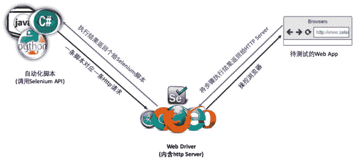

TestNG（NG 表示 Next Generation）是一个开源的自动化测试框架，是目前比较流行实用的单元测试框架之一，有非常完善的测试用例管理模块，配合 Maven 能够很方便管理第三方插件和依赖项。使用 TestNG 可以做功能、接口、单元、集成的自动化测试，结合 selenium 做 UI 自动化测试，不仅使用简单，还可以自动生成测试报告，批量执行测试用例等。

## 创建基于 Maven 构建的 TestNG 测试项目

基于上述分析的 Maven 和 TestNG 拥有的优点，在实际项目中，我们基于 Maven 构建搭建了 TestNG 测试框架，下面是具体的搭建步骤。

### 第一步：安装 Eclipse IDE 上的 Maven 插件

帮助->Eclipse Marketplace…，在弹出的对话框搜索域中输入“Maven”，选择 Maven Integration for Eclipse 安装，如图 2 所示。安装完后重启 Eclipse。安装好 Maven 插件后就可以在 Eclipse 上进行编译构建。

**图 2\. 安装 Maven 插件**

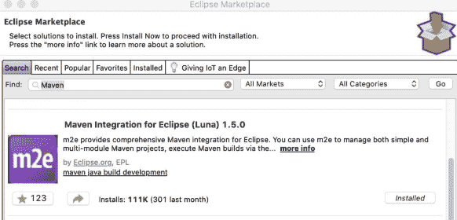

### 第二步：创建一个简单的 Maven 项目

**图 3\. 选择 Maven Project**

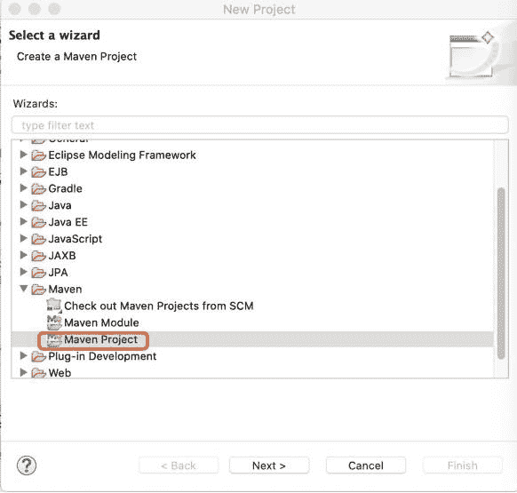

**图 4\. 选择“Create a simple project”**

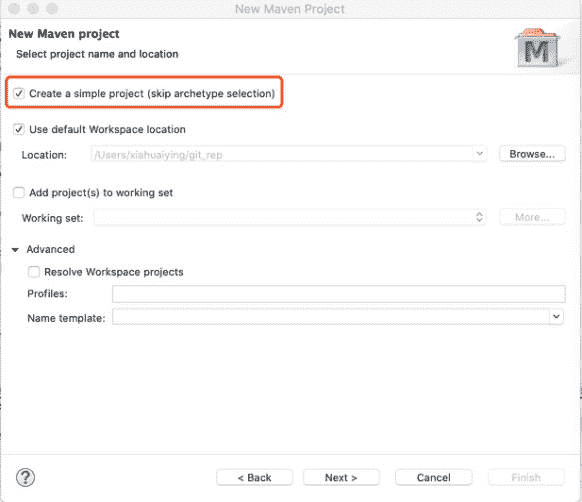

**图 5\. 填写 Group Id 和 Artifact Id**

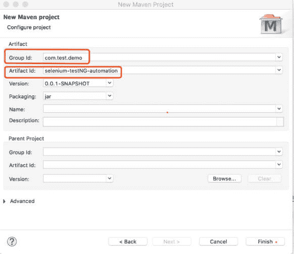

图 5 中 Group Id 和 Artifact Id 的含义如下：

*   Group Id：项目组织唯一的标识符，对应 Java 的包结构，main 目录里 java 的目录结构。
*   Artifact Id：项目的唯一的标识符，实际对应项目的名称。

### 第三步: 在 pom.xml 中添加依赖

在 pom.xml 中添加 Selenium 和 TestNG 依赖，这样在 Maven 构建过程中会自动下载 Selenium-WebDriver 和 TestNG API 对应的 jar 包到本地依赖库。其中 properties 选项用来控制下载依赖包的版本，如果有更新的版本可通过更改 properties 自动下载最新的依赖项，如清单 1 所示。

**清单 1\. 在 pom.xml 中添加依赖**

```
 <properties>
      <selenium.version>3.141.59</selenium.version>
      <java.version>1.8</java.version>
      <testng.version>6.9.10</testng.version>
      <maven-compiler-plugin.version>3.8.0</maven-compiler-plugin.version>
  </properties>

  <dependencies>
      <dependency>
           <groupId>org.seleniumhq.selenium</groupId>
           <artifactId>selenium-java</artifactId>
           <version>${selenium.version}</version>
      </dependency>
      <dependency>
           <groupId>org.testng</groupId>
           <artifactId>testng</artifactId>
           <version>${testng.version}</version>
           <scope>compile</scope>
      </dependency>
  </dependencies> 
```

在 pom.xml 中将 Java 的版本定义为 1.8（备注：根据自己项目的实际情况，自行定义要求的版本），需要在我们的项目中确保 Build Path 中设置的 JRE 版本也为 1.8，因为有时系统中有可能有多个版本的 JRE。在测试项目名称上右键鼠标，选择 Build Path ->Configure Build Path… 编辑 JRE System Library，选择 JRE1.8。

**图 6\. 设置编译路径中的 JRE 版本为 1.8**

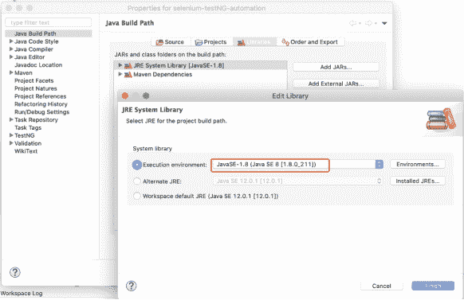

### 第四步：安装 TestNG 插件

在 Eclipse IDE 上安装 TestNG 插件，帮助->Install New Software…在弹出的安装新软件 Work with 输入框中输入 TestNG 插件的 URL：`http://beust.com/eclipse`，如图 7 所示。

**图 7\. 安装 TestNG 插件**

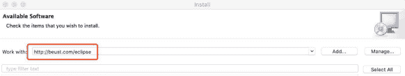

这样基于一个 TestNG 和 Maven 构建的测试项目已经创建好了。清单 2 是一个 TestNG 测试样例。

**清单 2\. TestNG 测试样例**

```
public class TC_01_Sample {

  private static String expected = "基于 Maven 构建的 Selenium-WebDriver 和 TestNG 自动化测试框架实践";

  @BeforeClass
  public void testSetUp() {

  }

  @Test
  public void checkpoint1() {
      String actual = "基于 Maven 构建的 Selenium-WebDriver 和 TestNG 自动化测试框架实践";
      Assert.assertEquals(actual, expected);
      Reporter.log("Check Point: " + actual , true);
  }

  @AfterClass
  public void tearDown() {
  }
} 
```

## 根据浏览器类型自动获取 Web Driver

对于 Selenium-WebDriver 自动化测试脚本，不同的浏览器有自己的 Driver，在本文的实践中，将测试用到的不同浏览器 Driver 都下载在测试项目的 lib 目录下，如图 8 所示。

**图 8\. 不同浏览器 Driver 结构目录**

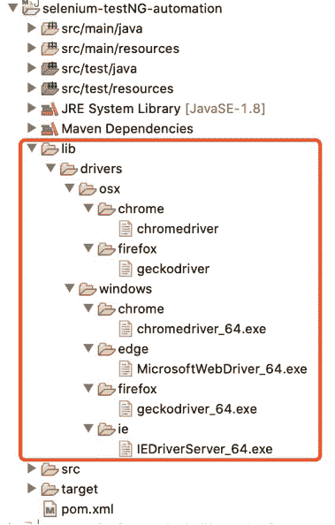

在我们的实际自动化测试项目中，可能需要支持多个不同的浏览器，通过设置不同的浏览器类型，脚本自动获取对应的 WebDriver。清单 3 中定义了不同浏览器的 WebDriver，由于篇幅限制，示例代码中只列举了三种浏览器 WebDriver 的定义，分别是 Firefox、Chrome 和 Safari。

**清单 3\. 不同浏览器 WebDriver 定义**

```
 /**
    //定义 Firefox WebDriver
    public WebDriver getFirefoxDriver( ) {
       FirefoxOptions options = new FirefoxOptions();
       options.merge(DesiredCapabilities.firefox());
       options.setHeadless(HEADLESS);

       return new FirefoxDriver(options);
    }

    //定义 Chrome WebDriver
    public WebDriver getChromeWebDriver( ) {
        HashMap<String, Object> chromePreferences = new HashMap<>();
        chromePreferences.put("profile.password_manager_enabled", false);

    DesiredCapabilities sCaps = new DesiredCapabilities();
    sCaps.setJavascriptEnabled(true);

    ChromeOptions options = new ChromeOptions();
    options.merge(DesiredCapabilities.chrome());
    options.merge(sCaps);
    options.setHeadless(HEADLESS);
    options.addArguments("--no-default-browser-check");
    options.setExperimentalOption("prefs", chromePreferences);

    return new ChromeDriver(options);
  }

  //定义 Safari WebDriver
   public RemoteWebDriver getSafariWebDriver( ) {
        SafariOptions options = new SafariOptions();
        options.merge(DesiredCapabilities.safari());

        return new SafariDriver(options);
   } 
```

清单 4 根据测试数据中设置的浏览器类型自动获取对应的 WebDriver，如 instantiateWebDriver 方法所示。getTestData(“browser”)为从 xml 配置文件中读取浏览器类型。

**清单 4\. 据浏览器类型自动获取 WebDriver**

```
public class InitialDriver {

  private WebDriver driver;
  private String selectedBrowser;
  public final static boolean HEADLESS =    Boolean.getBoolean("headless");

   public InitialDriver() {
    //从配置文件中获取待测试的浏览器类型
    String browser = getTestData("browser"); 
    if(browser.isEmpty()) {
    browser = "firefox";  //默认使用 firefox
    System.out.println("No Browser specified, use the default browser: '" + browser);
   }
   selectedBrowser = browser;
  }

// 根据浏览器类型自动获取 Driver 实例
public WebDriver getDriver() throws Exception {
   if (null == driver) {
instantiateWebDriver(selectedBrowser);
   }
     return driver;
   }

public void quitDriver() {
   if (null != driver) {
        driver.quit();
        driver = null;
     }
}

// 根据浏览器类型获取对应的
public WebDriver getDriverType(String browser) throws Exception {
   switch(browser.toUpperCase()) {
       case "CHROME":
           return getChromeWebDriver();
       case "FIREFOX":
           return getFirefoxDriver();
       case "IE":
           return getIEWebDriver();
       case "SAFARI":
           return getSafariWebDriver();
       case "EDGE":
           return getEdgeWebDriver();
       default:
           return getFirefoxDriver();
       }
    }

// 初始化 web driver
private void instantiateWebDriver(String browser) throws Exception {
        System.out.println("Selected Browser: " + selectedBrowser);

        String os = "mac";
        os = System.getProperty("os.name").toLowerCase();
        String projectPath = System.getProperty("user.dir");
        String macChromeDriver = "/lib/drivers/osx/chrome/chromedriver";
        String macFirefoxDriver = "/lib/drivers/osx/firefox/geckodriver";

        String winChromeDriver = "/lib/drivers/windows/chrome/chromedriver_64.exe";
        String winIEDriver = "/drivers/windows/edge/MicrosoftWebDriver_64.exe";
        String winFirefoxDriver = "/lib/drivers/windows/firefox/geckodriver_64.exe";
        String winEdgeDriver = "/lib/drivers/windows/edge/64bit/MicrosoftWebDriver.exe";

        if (os.contains("mac")) {
            System.setProperty("webdriver.chrome.driver", projectPath + macChromeDriver.replace("/", File.separator));
            System.setProperty("webdriver.gecko.driver", projectPath + macFirefoxDriver.replace("/", File.separator));
        } else if (os.contains("window")) {
            System.setProperty("webdriver.chrome.driver", projectPath + winChromeDriver.replace("/", File.separator));
            System.setProperty("webdriver.ie.driver", projectPath + winIEDriver.replace("/", File.separator));
            System.setProperty("webdriver.gecko.driver", projectPath + winFirefoxDriver.replace("/", File.separator));
            System.setProperty("webdriver.edge.driver", projectPath + winEdgeDriver.replace("/", File.separator));
        }
        driver = getDriverType(selectedBrowser);
    }

} 
```

## 三层测试架构搭建

一个结构明确、合理组织的自动化框架更加容易扩展、维护和重用，自动化测试三层架构是业界公认普遍采用的架构，分别是 appobjects、tasks 和 testcases，对应用于存放 UI 控件层、业务逻辑层和测试用例层的代码，图 9 是本文实践中以登录百度为示例的分层结构图。

**图 9\. 三层架构**

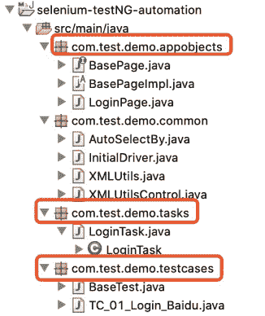

appobjects 层：本实践中按照待测试 App 的页面进行划分，一个页面中的所有元素存放在一个 appobjects 类中。除了定义基本的 UI 控件外，对一些基本操作也进行了封装。当 UI 控件属性发生变化时，只需要更改 appobjects 类即可，无需更新整个脚本。

**清单 5\. appObjects 层示例（百度首页上几个控件）**

```
public class LoginPage extends BasePageImpl {

    public LoginPage(WebDriver driver) {
        super(driver);
    }

    public WebElement mailAccount() {
        return findElementFluentWait("css=#TANGRAM__PSP_10__userName");
    }

    public WebElement password() {
        return findElementFluentWait("css=#TANGRAM__PSP_10__password");
    }

    public WebElement loginButton() {
        return findElementFluentWait("css=#TANGRAM__PSP_10__submit");
    }
} 
```

tasks 层：继承 appobjects，通过调用 appobjects 类中定义的控件完成一个个具体的操作任务。

**清单 6\. tasks 层示例（打开百度搜索页面后打开登录框）**

```
public class LoginTask extends LoginPage{

    public LoginTask(WebDriver driver) {
        super(driver);
    }

    public void openLoginDialog(String url) {
        driver.navigate().to(url);
        driver.manage().window().maximize();

        loginLink().click();
        accountLogin().click();
    } 
```

testcases：具体的测试用例，主要调用 tasks 层中的一个个任务构成相应的测试步骤，验证测试结果，输出测试日志，清单 7 是 testcases 的一个示例。

**清单 7\. testcases 层示例（打开登录框，验证登录框标题是否正确）**

```
public class TC_01_Login_Baidu extends BaseTest{

  private static String url = "https://www.baidu.com/";
  private LoginTask login;
  private String user = "tester";
  private String password = "123456"
  private static String expected = "用户名密码登录";

  @BeforeClass
  public void testSetUp() throws Exception {
      login = new LoginTask(getDriver());
  }

  @Test(enabled = true, priority = 1)
  public void checkpoint1() {
      login.openLoginDialog(url);
      String actual = login.getTitleLoginDialog();
      Assert.assertEquals(actual, expected);
      Reporter.log("Check Point: " + actual , true);

      login.setAccount(user, password);
  }

  @AfterClass(enabled = true)
    public void tearDown() {
        quitDriver();
    }
} 
```

appobjects、tasks 和 testcases 之间的关系如图 10 所示的实现类图。

**图 10\. 三层架构实现类图**

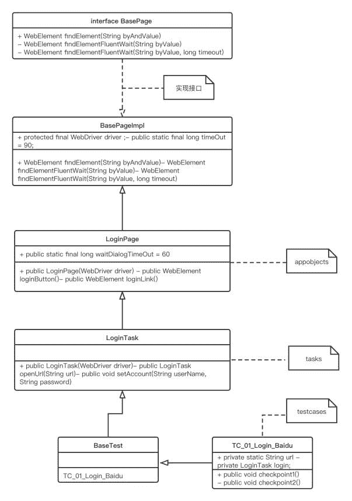

## 测试用例的批量执行

通过 TestNG.xml 文件可以执行多个测试脚本，把要执行的测试脚本按照 suite 架构组织在 xml 文件中。本文实践中把测试脚本放在 TestSuite.xml 文件中，选中 TestSuite.xml 文件，鼠标右键，选择 Run As ->TestNG Suite 即可批量执行测试脚本，如图 11 所示。

**图 11\. 批量执行测试用例**

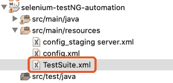 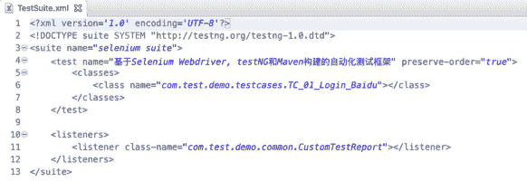

## 测试用例的命令行执行

在自动化脚本撰写过程中，通过 IDE 运行调试比较方便，但是在实际执行过程中可能需要在不同的环境中执行，通过命令行会更加方便。基于 Maven 构建的 TestNG 测试脚本通过命令行执行也非常容易，通过下面几个配置步骤即可实现。

### 第一步：安装 Maven 并配置环境变量

通过官网下载最新 Maven 安装包后安装（见文末参考资源中的 Maven 使用指南），安装好后将 Maven 的安装路径添加到系统的环境变量中。本实践环境为 Mac 机器。

*   Maven 安装：双击 Maven 安装包，解压到 Library 目录下。
*   Maven 文件路径查看：打开终端，将解压的文件夹拖到终端，就可以显示 Maven 安装路径；
*   将 Maven 安装路径添加到系统环境变量：在系统环境变量配置文件~/.bash_profile 中加入下列两行后保存退出。

```
export Maven_HOME=/Library/apache-maven-3.6.3
Export PATH=$PATH:$MAVEN_HOME/bin 
```

查看 Maven 是否安装配置成功：打开终端输入 `mvn -version`。

### 第二步：在 pom.xml 添加依赖项和 TestNG.xml 路径

在 pom.xml 中添加 TestNG 的依赖项和 TestSuite.xml 的路径配置。

**清单 8\. Maven 和 TestNG 捆绑**

```
<profiles>
        <profile>
            <id>selenium-tests</id>
            <activation>
                <activeByDefault>true</activeByDefault>
            </activation>
            <build>
             <pluginManagement>
                <plugins>
                    <plugin>
                        <groupId>org.apache.maven.plugins</groupId>
                        <artifactId>maven-compiler-plugin</artifactId>
                        <configuration>
                            <source>${java.version}</source>
                            <target>${java.version}</target>
                        </configuration>
                        <version>${maven-compiler-plugin.version}</version>
                    </plugin>
                </plugins>
               </pluginManagement>
            </build>
        </profile>
    </profiles>

    <build>
    <plugins>
      <plugin>
        <groupId>org.apache.maven.plugins</groupId>
        <artifactId>maven-surefire-plugin</artifactId>
        <version>2.19.1</version>
        <configuration>
          <suiteXmlFiles>
            <file>src/main/resources/TestSuite.xml</file>
          </suiteXmlFiles>
        </configuration>
      </plugin>
    </plugins>
   </build> 
```

### 第三步：通过 mvn test 执行测试用例

打开命令行窗口，进入自动化项目所在的跟目录，通过“mvn test”即可执行 TestSuite.xml 中设置的自动化脚本。

**图 12\. mvn test 执行测试用例**

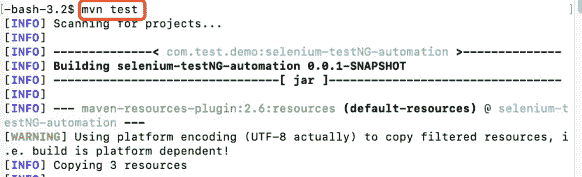

## 自定义测试报告

TestNG 本身提供了非常方便的报告功能，测试脚本执行后，将在项目的根目录下生成测试输出文件夹，包含两种类型的报告：

*   Index.html：当前自动化脚本执行情况的完整报告，其中包括错误、执行时间、日志等详细信息。
*   Emailiable-report.html：当前自动化脚本执行的摘要报告，其中包含用绿色代表执行成功的测试用例和红色表示执行失败的测试用例。

TestNG 自带的测试报告相当的方便，但是有时候我们需要定制较为简洁的数据或者想要的报告格式，TestNG 提供两种接口帮助我们自定义测试报告，即 IReporter 和 ITestListener，TestListenerAdapter 是 ITestListener 接口的一个实现类，本文的实践中我们继承了 TestListenerAdapter 类。具体的实现包括下面几个步骤：

### 第一步：创建自定义测试报告类，继承 TestListenerAdapter 类

在自定义测试报告类中，重写 onStart、onTestSkipped、onTestFailure、onTestSuccess 和 onFinish 方法，定义测试项目中希望的报告格式。由于篇幅限制，下面只列出 onStart、onTestFailure 和 onFinish 方法，在测试结构目录 test-output 目录下创建一个 customize-report 子目录，生成以当前时间命名的自定义报告文件。

**清单 9\. 自定义测试报告类**

```
public class CustomTestReport extends TestListenerAdapter {
    @Override
    public void onStart(ITestContext context) {

        File htmlReportDir = new File("test-output" + File.separator + "customize-report");  
        if (!htmlReportDir.exists()) {  
            htmlReportDir.mkdirs();  
        }

        String reportName = formatDateTime()+".html";  
        reportPath = htmlReportDir + File.separator + reportName;  
        File report = new File(htmlReportDir,reportName);  
        if(report.exists()){  
            try {  
                report.createNewFile();  
            } catch (IOException e) {  
                e.printStackTrace();  
            }  
        }

       sb.append(executeDetails());
    }

@Override
public void onTestFailure(ITestResult result) {

    String newTest = getTestcasesName(result);
    String appendCase =  newTest;
    if (testName.isEmpty() || !testName.equalsIgnoreCase(newTest)) {
        testName = newTest;
        sb.append("<tr><td>" + total ++);
        sb.append("</td><td>");
    } else {
        appendCase = "";
        sb.append("<tr><td>");
        sb.append("</td><td>");
    }

    sb.append(appendCase);
    sb.append("</td><td>");
    sb.append(result.getMethod().getMethodName());  
    sb.append("</td><td><font color=\"red\">Failed</font><br>");
    sb.append("<p align=\"left\">Test Case <font color=\"red\">Failed</font>, and the reason is <br>");
    sb.append("<br><a style=\"background-color:#CCCCCC;\">");
    Throwable throwable = result.getThrowable();  
    sb.append(throwable.getMessage());
    sb.append("</a></p></td></tr>");
}

@Override
public void onFinish(ITestContext testContext) {
    boolean overallStatus = true;
    if(testContext.getFailedTests().size()> 0 || testContext.getSkippedTests().size()>0 ) {
    overallStatus = false;
}
    String head = getOveralStatus (overallStatus);
    try {  
            Files.write((Paths.get(reportPath)), head.getBytes("utf-8"));  
        } catch (IOException e) {  
            e.printStackTrace();  
        }

    sb.append("</tbody></table></div></body>");
    sb.append("</html>");
    String msg = sb.toString();
    try {
        Files.write((Paths.get(reportPath)),msg.getBytes("utf-8"),StandardOpenOption.APPEND);
    } catch (IOException e) {
        e.printStackTrace();
    }
    String sbody = getTestResultFromCustomReport();
    sendTestReport(sbody);
}
} 
```

### 第二步：在测试用例中添加监听器类

**清单 10\. 添加监听器**

```
@Listeners(com.test.demo.common.CustomAssertListener.class)
public class TC_01_Login_Baidu extends BaseTest{
} 
```

**图 13\. 自定义的测试报告**

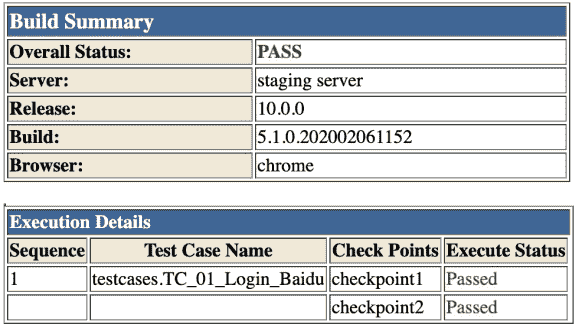

## Selenium-WebDriver 使用经验总结

1.等待机制

在自动化测试过程中，通常由于网络等因素影响，经常需要通过设置等待的方式等待某个对象或者页面的加载和展示。Selenium-WebDriver 有三种等待机制，表 2 列出了他们的区别和应用示例。

**表 2\. Selenium-WebDriver 等待机制**

| 等待机制 | 不同等待方式的说明 |
| --- | --- |
| 固定等待 | Thread.sleep（）；Thread.slepp(timeOfMillisecond); |
| 隐式等待 | 等待固定长度的时间，它的作用范围是 WebDriver 对象实例的整个生命周期，每次 Driver 执行找不到元素都会等待设置的时间 `WebDriver driver = new ChromeDriver(); driver.manage().timeouts().implicitlyWait(5, TimeUnit.SECONDS);//设置全局等多少秒` |
| 显示等待 | 只要条件成立，立即执行后续代码，如果没有满足条件，就会始终在这里等待条件成立 `new WebDriverWait(driver, 15).until(ExpectedConditions.presenceOfElementLocated(By.id("***")));` （比较灵活的等待方式，使用最为广泛。） |

2.滚动条的操作

在实际的测试过程中，有些对象需要拖动滚动条才能显示。下面介绍拖动滚动条的两种方法

**清单 11\. 滚动条拖动到底部**

```
 public void dragScrollBarToBottom() {
    ((JavascriptExecutor)this.driver).executeScript(
  "window.scrollTo(0,document.body.scrollHeight)");
  } 
```

**清单 12\. 滚动条拖动一次，相当于鼠标移动一次**

```
 public void dragScrollBar() {
      WebElement element = findElementFluentWait("css=body");
      element.sendKeys(Keys.PAGE_DOWN);
  } 
```

**清单 13\. 拖动到某个元素所在位置**

```
 public void DragScrollBar(String byAndValue) {
      WebElement element = findElementFluentWait(byAndValue);
      element.sendKeys(Keys.PAGE_DOWN);
  } 
```

3.自动选择定位器

在我们的自动化脚本中，可以将查找对象的方法进行封装，在实际使用中将属性及其 value 作为参数，就可以自动使用对应的选择器进行定位，比如查找”XPATH= //*[@id=\”password\”]”，只要将参数传入给方法 getBy（String byAndbyValue）方法即可，如清单 14 所示。

**清单 14\. 自动选择定位器**

```
public WebElement findElementFluentWait(String byValue, long timeout) {
WebDriverWait wait = new WebDriverWait(driver, fluentTimeOut);
      Return
  wait.until(ExpectedConditions.presenceOfElementLocated(AutoSelectBy.getBy(byValue)));
   }

   public static By getBy(String byAndbyValue) {

    List<String> byTypeValue = Arrays.asList(byAndbyValue.split("=", 2));

    if (byTypeValue.size() < 2 || "".equals((byTypeValue).get(1))) {
         return null;
    }

    String byValue = String.valueOf(byTypeValue.get(1));
    String byType = String.valueOf(byTypeValue.get(0));
    switch (byType.toUpperCase()) {
         case "ID":
             return By.id(byValue);
         case "NAME":
             return By.name(byValue);
         case "XPATH":
             return By.xpath(byValue);
         case "CSS":
             return By.cssSelector(byValue);
         case "TAG":
             return By.tagName(byValue);
         case "CLASS":
             return By.className(byValue);
         case "LINKTEXT":
             return By.linkText(byValue);
         case "PARTIALLINKTEXT":
             return By.partialLinkText(byValue);
         default:
             return By.xpath(byValue);
     } 
```

## TestNG 使用经验

1.指定测试顺序

默认情况下，一个 TestNG 测试用例中如果有多个测试方法，也就是@Test 方法，执行顺序是随机的。但是在实际的自动化测试中，有时候一个测试方法就是一个检查点，前后可能有依赖关系，这个时候默认的随机执行顺序不能满足我们的需求。我们可以通过 priority（priority=1，priority=2，priority=3）这个标注指定执行顺序，从小到大按顺序执行。

**清单 15\. 指定执行顺序**

```
 @Test(priority = 1)
    public void checkpoint1() {} 
```

2.某个方法执行与否的开关

尤其在我们调试自动化脚本的过程中，一个测试脚本中可能有多个方法，调试过程中可能不希望已经调试成功的方法，这时候可以通过 enable=true 或者 enable=false 这个开关来控制，清单 16 示例通过 enabled=false 不执行这个方法。

**清单 16\. 指定执行顺序**

```
 @AfterClass(enabled = false)
   public void tearDown() {
      quitDriver();
  } 
```

## 结束语

本文总结了基于 Maven 构建，利用 Selenium-WebDriver 和 TestNG 自动化测试框架实现 Web 应用程序的 UI 自动化测试，总结了如何构建自动化测试框架；WebDriver 的自动获取；三层测试架构的搭建；如何进行批量测试用例的执行以及通过命令行执行；Selenium-WebDriver 的使用经验总结。 不过本文框架还在不断实践中，可能还有一些方面需要进一步改进和优化，希望这篇文章能为正在从事自动化测试的您提供一定的参考。

## 参考资源

*   [Chrome WebDriver](https://chromedriver.storage.googleapis.com/index.html?path=80.0.3987.16/)：本实践中下载的 Chrome WebDriver。
*   [Firefox WebDriver](https://github.com/mozilla/geckodriver/releases/)：本实践中下载的 Firefox WebDriver。
*   [IE WebDriver](https://selenium-release.storage.googleapis.com/index.html?path=2.39/)：本实践中下载的 IE WebDriver。
*   [Edge WebDriver](https://developer.microsoft.com/en-us/microsoft-edge/tools/webdriver/)：本实践中下载的 Edge WebDriver。
*   [Selenium 中使用 Xpath 指南](https://www.lambdatest.com/blog/complete-guide-for-using-xpath-in-selenium-with-examples/)：Xpath 在 Selenium 中使用指南。
*   [持续交付](https://devops.com/continuous-delivery-pipeline/)：介绍什么是持续交付以及其作用。