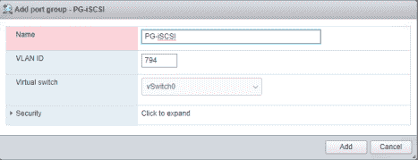

# ESXi6.7 使用 IBM Block Storage 做数据存储

> 原文：[`developer.ibm.com/zh/tutorials/cl-lo-use-ibm-block-storage-for-data-storage/`](https://developer.ibm.com/zh/tutorials/cl-lo-use-ibm-block-storage-for-data-storage/)

## 概述

在 IBM Cloud 平台上，我们有很多的客户是使用 ESXi 作为架构基础的。ESXi 是专为运行虚拟机、最大限度降低配置要求和简化部署而设计的。在 IBM Cloud 平台上我们给客户提供最灵活的方式来使用 VMware 兼容的硬件和软件组件，在 IBM -hosted 的环境中构建符合客户业务需求的生产环境。同时，IBM Block Storage 可以方便快速的作为 VMware 的数据仓库，来提供给客户高性能的 iSCSI 存储，并且客户可以方便的选择和扩展自己的存储能力，包括 IOPS 和容量。本文通过介绍和部署一个客户的使用场景，来说明 IBM Cloud 上 VMware 如何使用 Block Storage 作为数据存储。

## 相关产品和工具简介

#### 1\. ESXi6.7 介绍和使用

随着大数据、移动互联网时代的发展，现在非常多的用户都会选择 VMware ESXi 作虚拟化。ESXi 6.7 是一个混合云的高效安全平台，可以提供简单高效的管理规模，全面的内置安全性，通过应用程序平台助力数字化转型。IBM Cloud 提供了独特的能力可以在专用的 Bare Metal 服务器上部署 VMware 私有云。

#### 2\. IBM Block Storage 的介绍和使用

IBM Block Storage 部署并定制采用闪存的 iSCSI 块存储，容量从 25 GB 到 12000 GB 不等，IOPS 最高可达 48000。IBM Block Storage 提高存储容量或实时调整性能，进而快速适应工作负载需求的变化。 IBM Block Storage 可以通过 iSCSI 协议挂载到 ESXi 上。

## 前提条件

IBM Cloud 帐户。如果您还没有 IBM Cloud 帐户，可以先注册一个[免费试用](https://cocl.us/IBM_CLOUD_GCG)帐户。

## 应用场景描述

在本章节中，我们详细介绍 ESXi 挂载 IBM Block Storage 做数据存储的具体案例。我们会一步一步解析如何在 ESXi 上进行配置，来挂载 IBM Block Storage。

## 挂载 Block Storage 到 ESXi 的主机

### 第 1 步： 授权访问

IBM Block Storage 通过 Software iSCSI Adapter 挂载到 ESXi 主机。需要注意的是，就像在其他主机（Windows/Linux）上挂载 Block Storage 一样，我们首先需要将 ESXi 主机加到相应的 Block Storage 的 Authorized hosts 列表里。具体授权的过程可以参考下面的步骤。

1.  登录 IBM Cloud Console：[`cloud.ibm.com`](https://cloud.ibm.com?cm_sp=ibmdev-_-developer-tutorials-_-cloudreg)。
2.  在 Devices 列表中，我们选择需要授权的 ESXi 主机，主机的详情信息会显示出来。我们需要记录下来主机的私有 IP，因为公有 IP 默认是不可用的。
3.  通过下面路径找到相应的 Block Storage：menu->Classic Infrastructure->Storage->Block Storage。

4.  通过点击“Authorize Host”你可以把相应的主机以 Device 或私有 IP 的方式加入到“Authorized Hosts”列表里。

    **图 1\. 配置 Authorized Hosts**

    

5.  这个时候我们将能看到一条新的记录。在这里我们能得到 Username， Password 和 Host IQN，这些在后面步骤中配置 iSCSI Adapter 的时候会用到。

### 第 2 步： iSCSI Adapter 配置

现在我们可以把视角切回到 ESXi。

通过浏览器访问 ESXi 的私有 IP 地址（`https://<FQDN-or-IP-Address-of-ESXi>/ui`）。访问 ESXi 客户端，需要正确的认证信息，获取用户名密码（用户名密码的信息可以在 console 上的 Passwords 页面上找到），我们可以进入 ESXi 的管理界面。关于如何通过 VPN 访问私有 IP，本文将不再介绍，具体详情可以参考 [使用一个 SSL VPN](https://cloud.ibm.com/docs/infrastructure/iaas-vpn?topic=VPN-using-ssl-vpn&_ga=2.170312870.704655348.1575357150-1392713012.1575260897#use-ssl-vpn)。

**图 2.典型的 ESXi 的网络配置**


这里是一个典型的 ESXi 的网络配置，有四个物理网卡，其中 vmnic0 和 vmnic2 是私有网络，vmnic1 和 vmnic3 是共有网络。我们在下面配置 Port Binding 时会用到这个信息。

点击导航栏的“Storage”可以看到 Storage 相关的配置

我们要通过“Adapters”下面的“Software iSCSI”去挂载 Block Storage。 这里需要注意的是，如果没有 Software iSCSI 的标签页，我们需要到 host 主机上运行以下命令：

```
esxcfg-swiscsi -e
esxcli iscsi software set --enabled=true 
```

运行后，需要重启 vmware 主机来使它生效。 点击“Software iSCSI”，就进入到新的 iSCSI Adapter 的配置页面。选择“Enabled”，然后就可以配置 iSCSI Adapter 了。

*   Name & alias：显示当前主机的 iqn。
*   CHAP authentication：选择“Use CHAP”并输入相应的 Name 和 Cecret；
*   Mutual CHAP authentication：选择“Do not Use CHAP”；因为在 IBM 云，不需要做客户端的 CHAP authentication。
*   Advanced settings：保留默认配置；
*   Network port bindings：我们将在后面章节详细介绍 port bindings；
*   Static targets：我们通过 Dynamic targets 去连接 Block Storage，所以这里不需要配置；当配置了动态目标后，这里会自动填充。
*   Dynamic targets：点击“Add dynamic target”，输入 Block Storage 的 target IP，保留 3260 端口。

点击 Save Configuration 保存当前设置。

**图 3\. Software iSCSI 的具体配置信息**


这时我们能看到一个新的 adapter，通常名字是 vmhba64，然后我们点击“Rescan”就能在“Devices”里面找到新的 Storage。

但在这里我们可能会遇到一些问题导致新的 Storage 没能成功挂载。 在本示例中，没有挂载成功的原因是系统默认的 iqn 与我们在 Console 上看到的不同。如前面图显示本示例中的默认的 iqn 是 iqn.1998-01.com.vmware:baremetal02-73ec6b50，但在 Console 里面看到的是：iqn.2019-07.com.ibm:sl02su1160157-i135713797。因为 Adapter 配置没提供 iqn 的编辑选项，所以我们需要 ssh 到 ESXi 主机通过命令行的方式修改 iqn。我们通过命令来获取 adapter 的名字，并用这个名字来设置 iqn。下面是个命令行例子：

```
 [root@baremetal01:~] esxcli iscsi adapter list
Adapter  Driver     State   UID            Description
-------  ---------  ------  -------------  ----------------------
vmhba64  iscsi_vmk  online  iscsi.vmhba64  iSCSI Software Adapter

[root@baremetal01:~] esxcli iscsi adapter get -A vmhba64 | grep iqn
   Name: iqn.1998-01.com.vmware:baremetal01-5466f6ae

[root@baremetal01:~] esxcli iscsi adapter set -A vmhba64 -n iqn.2019-07.com.ibm:sl02su1160157-i135713797

 [root@baremetal01:~] esxcli iscsi adapter get -A vmhba64 | grep iqn
   Name: iqn.2019-07.com.ibm:sl02su1160157-i135713797
-------------------------- 
```

接下来，我们回到 iSCSI Adapter 配置页面，你可能会发现之前的配置丢失了，但是 iqn 已经被更改过来了。按照前面提到的步骤重新配置 iSCSI Adapter，保存，并“Rescan”，转到“Devices”界面，我们能发现新的 NETAPP iSCSI Disk。

**图 4.查看新的 NETAPP iSCSI Disk**


再次切换到“Adapters”，选择新的 adapter “vmhba64”并点击“Configure iSCSI”，从 iSCSI Adapter 配置页面我们能看到“Static targets”自动填充了两条信息。这说明到 Block Storage 的两个目标 ip（target ip）的连接都已经建立好。

### 第 3 步：创建并配置 Datastore

现在我们可以来配置 Datastore 了，切换到“Datastores”配置页面，点击“New datastore”来添加新的 Datastore。

**图 5.选择添加新的 Datastore**


这里有四个选项：

*   Create new VMFS datastore：用于创建新的 datastore；
*   Add an extent to existing VMFS datastore：这是用一个新的磁盘扩展已有的 datastore；
*   Expand an existing VMFS datasore extent：通过扩展磁盘容量来扩展已有 datastore；
*   Mount NFS datastore：使用 File Storage 创建 datastore。

这里我们选择 Create new VMFS datastore，点击 Next。

给 Datastore 命名，选中新添加的 NETAPP iSCSI 磁盘，点击“Next”。

选择分配给当前 Datastore 的磁盘空间，点击“Next”并完成配置。 到现在关于 Datastore 的配置已经完成，我们可以看到新添加的 Datastore。这里“Drive Type”显示当前设备的存储介质，Datastore-iSCSI 因为是网络存储器，所以标示为 Non-SSD；Capacity 是当前 datastore 的容量，Type 表示当前文件系统类型，VMFS6 就是 VMware File System version 6。

### 第 4 步：通过 Truck vlan 给存储流量提供独立通信通道

现在关于挂载 Block Storage 的基本配置已经完成，不过通常，我们要求 Storage 通信 应该与其他类型的通信相隔离，并且不建议 Storage 通信直接通过防火墙和路由器，这会对性能产生影响。要配置独立的通信通道我们需要给我们的 ESXi 服务器增加一个 trunk Vlan，它用于给 storage 流量提供独立的通信通道。

首先，需要登录 [`cloud.ibm.com/classic/network/vlans`](https://cloud.ibm.com/classic/network/vlans?cm_sp=ibmdev-_-developer-tutorials-_-cloudreg)，订购一个新的 Vlan。 在此之前我们先通过设备的详细信息查看一下当前的网络配置，这里是我测试用的服务器的网络配置：

**图 6.服务器的网络配置**


这里我们可以看到，当前默认 Vlan 是 hkg02.bcr02a.814。

现在我们回到订购新 Vlan 的页面：

**图 7\. 访问订购新 Vlan 的页面**


因为新的 Vlan 是用于 Storage 的通信，所以选择 Private，Location 处，我们选择 Pod，找到 hkg02，我们发现有两个 pod，前面我们看到的默认的 Vlan 是在 hkg02.brc02a 上，所以这里我们选择 hkg02.pod02。输入 Vlan Name，完成 Vlan 的创建。回到 VLAN List，根据 Name 找到我们刚刚创建的 Vlan 794。这个 Vlan id 794 在后面配置 Port Group 时会用到。

接下来我们要通过登录 [`cloud.ibm.com/classic/network/subnets`](https://cloud.ibm.com/classic/network/subnets?cm_sp=ibmdev-_-developer-tutorials-_-cloudreg)，为新增加的 Vlan 添加一个 Subnet。

**图 8\. 添加一个新的 subnet**


这里选择“Private”，选择需要的 IP 地址的数量，选择前面刚刚添加的 Vlan，输入需要填写的信息完成添加 Subnet。

返回到 Vlan，我们可以看到新添加的 Subnet 信息，点击 Subnet，记住这些信息，在下面的配置中将会用到。

做完上面的步骤，我们需要开一个 Ticket 给 Network 技术支持团队，要求给服务器增加一个 trunk Vlan。

完成添加 trunk Vlan 后，我们需要做一些网络配置。 现在我们回到 ESXi 的配置页面，点击“Networking”然后切换到“Virtual Switches”。我们已经有了两个默认的 switch：vSwitch0，私有网络，有两个 uplink（uplink0 和 uplink2）；vSwitch-pub，公共网络，有两个 uplink（uplink1 和 uplink3）。

回到 Networking，切换到 Port groups，点击“Add port group”添加一个新的 port group：

**图 9\. 添加新的 port group**



输入新的 port group 的名字，选择 vSwitch0 作为新 port group 的 Virtual switch（因为 Storage 需要私有网络连接）。输入 trunk 的 vlan id 794（在前面创建 Vlan 的时候讲到了如何得到 Vlan id）。点击“Add”完成添加。

回到“Networking”，切换到“VMKernel NICs”，点击“Add VMKernel NIC”添加新的 VMKernel NIC：

**图 10\. 添加新的 VMKernel NIC**


选择上面刚刚新加的 PG-iSCSI 作为新的 VMKernel NIC 的 port group，选择 Static IP，IP 地址从上面 Subnet 中选择没有被占用的。不要选择任何 Services，因为所有这些 service 都与 iSCSI 通讯无关。点击“Create”创建新的 VMKernel NIC。 Vmk1 就是新创建的 VMKernel NIC。

**图 11\. 查看新创建的 VMKernel NIC**


回到 Virtual Switches 页面，点击 vSwitch0，我们可以看到详细的网络拓扑， 从上图我们可以看到，右侧是物理网卡 vmnic0 和 vmnic2，左边是 VMkernel nic。 我们通过定义 VMkernel nic 来为不同的网络流量建立不同的通道。这里，iSCSI 流量将通过 vmk1（vmk1 的 IP，网关对应 trunk vlan 794 的 secondary subnet），其他流量 将通过 vmk0（vmk0 的 IP，网关对应 primary vlan）。

把 vmk1 的 IP 地址，本例中是图中的 10.174.31.66 加到 Block Storage 的 Authorized Hosts 列表。这里需要检查一下新的 iqn，用户名和密码，如果与之前不同，需要用新的 iqn，用户名和密码重新配置 Adapter。

接下来，通过下面的命令添加一条静态路由：

```
esxcfg-route -a 10.2.174.0/24 10.174.31.65 
```

其中 `10.2.174.0/24` 指向 Block Storage 的 Target IP 对应的网段，`10.174.31.65` 是新 Subnet 的网关。 可以从前面创建的 Vlan 794 的 Secondary Subnet 里得到。

然后通过下面的命名可以查看当前 iscsi 的连接状况：

```
[root@baremetal01:~] esxcli network ip connection list |grep :3260
tcp         0       0  10.174.31.66:45458                10.2.174.83:3260     ESTABLISHED   2097834  newreno  vmkiscsid
tcp         0       0  10.174.31.66:28112                10.2.174.82:3260     ESTABLISHED   2097834  newreno  vmkiscsid 
```

这表明有两个从 vmk1 出发到 storage target IPs 的连接已经建立。

### 第 5 步：扩展数据存储案例

前面我们在通过 New datastore 创建新的 datastore 的时候可以发现有多个选项。

**图 12\. 创建新的 datastore 的多种选项**


其中第二和第三项都是用来扩展已经存在的 datastore。在这里我们来讲一下如何拓展 已经存在 datastore。 首先新订购一个 Block Storage，如下图：200GB 的容量，OS type 是 Linux （这里需要注意，本例中 ESXi 要求 OS type 是 Linux）。

**图 13\. 订购一个新的 Block Storage**


将 vmk1 的 IP 地址 10.174.31.66 加到 storage 的 Authorized hosts 列表：

**图 14\. 将 vmk1 的 IP 地址加入 Authorized Hosts 列表**


这里我们对比前面 storage 的 authorized hosts list 会看到相同的网络地址，会得到相同的 Username、Password 和 Host IQN。

**图 15\. 对比前面 Storage 的 Authorized Hosts List**


重新配置 Software Adapter，把新 Block Storage 的 Target IP 加入到动态路由：

**图 16\. 重新配置 Software Adapter**


保存配置，点击 Rescan，这时我们在 Devices 页面将看到新的 Storage。

### 第 6 步：扩展一个新的 Lun 再增加存储

在扩展之前，我们先记录下 Datastore-iSCSI 的信息，如下图，容量为 430.5GB：

**图 17\. 记录 Datastore-iSCSI 的具体信息**


我们回到 Datastore 页面，选择 New datastore，然后选择“Add an extent to existing VMFS datastore”，点击“Next”，选择前面我们创建的 Datastore-iSCSI，点击“Next”，选择我们前面新添加的 Storage。

点击“Next”选择磁盘分区，这里我们选择“Use full disk”把整个磁盘容量用作扩展 datastore。点击“Next”，然后完成扩展。这时我们再来看 datastore 新的容量已经变为 630.25GB：

**图 18\. 查看 datastore 的新容量**


#### 扩展已有的 Lun 容量

扩展容量是一个新特性，有了这个特性，当前的 IBM Cloud™ Block Storage 用户可以立即将现有 Block Storage 的大小增加到 12tb（以 GB 为单位）。他们不需要创建副本或手动将数据迁移到更大的卷。在进行大小调整时，不会出现停机或无法访问存储的情况。 现在我们回到 [`cloud.ibm.com/classic/storage/block`](https://cloud.ibm.com/classic/storage/block?cm_sp=ibmdev-_-developer-tutorials-_-cloudreg)，找到前面创建的 200GB 的 storage，点击“Actions”，选择“Modify Volume”：

输入我们想要的新的容量，选择 IOPS 层级，完成扩展 storage。这可能需要一点儿时间完成扩容。

**图 19\. 扩展 storage**


当扩容完成后我们可以看到 Storage 的容量已经变成了 300GB。

回到 Storage 页面，点击“Rescan”，我们发现 Devices 页面的 Storage 容量变成 300GB。

**图 20\. 查看新的 Storage 里的容量变成了 300G**


现在我们回到 Datastore 页面，点击“New datastore”，选择“Expand existing VMFS datastore extent”，选择要扩展的 Datastore-iSCSI，然后选择我们刚刚扩展的磁盘，如下图，我们可以看到有 100GB 的空余空间：

**图 21\. 查看新扩展的磁盘剩余空间**


点击“Next”，这里我们选择 “Select partitioning options” 将所有的空余空间用于扩展 Datastore,点击“Next”并完成扩展 Datastore。 我们可以看到 Datastore 的容量已经变为 730.25GB：

**图 22\. Datastore 容量扩展完成**


### 第 7 步：验证 MPIO

为了验证冗余性，我们通过命令行来验证 MultiPath Input Output（MPIO）配置结果，并解释。

```
esxcfg-mpath -l
[root@baremetal01:/vmfs/volumes/a9f57ed8-12c9591d] esxcfg-mpath -l
iqn.2019-11.com.ibm:sl02su1160157-i143124202-00023d000001,iqn.1992-08.com.netapp:stfhkg0201,t,1029-naa.600a098038303845382b                 4a7948545852
   Runtime Name: vmhba64:C0:T0:L2
   Device: naa.600a098038303845382b4a7948545852
   Device Display Name: NETAPP iSCSI Disk (naa.600a098038303845382b4a7948545852)
   Adapter: vmhba64 Channel: 0 Target: 0 LUN: 2
   Adapter Identifier: iqn.2019-11.com.ibm:sl02su1160157-i143124202
   Target Identifier: 00023d000001,iqn.1992-08.com.netapp:stfhkg0201,t,1029
   Plugin: NMP
   State: active
   Transport: iscsi
   Adapter Transport Details: iqn.2019-11.com.ibm:sl02su1160157-i143124202
   Target Transport Details: IQN=iqn.1992-08.com.netapp:stfhkg0201 Alias= Session=00023d000001 PortalTag=1029

iqn.2019-11.com.ibm:sl02su1160157-i143124202-00023d000002,iqn.1992-08.com.netapp:stfhkg0201,t,1030-naa.600a098038303845382b                 4a7948545852
   Runtime Name: vmhba64:C1:T0:L2
   Device: naa.600a098038303845382b4a7948545852
   Device Display Name: NETAPP iSCSI Disk (naa.600a098038303845382b4a7948545852)
   Adapter: vmhba64 Channel: 1 Target: 0 LUN: 2
   Adapter Identifier: iqn.2019-11.com.ibm:sl02su1160157-i143124202
   Target Identifier: 00023d000002,iqn.1992-08.com.netapp:stfhkg0201,t,1030
   Plugin: NMP
   State: active
   Transport: iscsi
   Adapter Transport Details: iqn.2019-11.com.ibm:sl02su1160157-i143124202
   Target Transport Details: IQN=iqn.1992-08.com.netapp:stfhkg0201 Alias= Session=00023d000002 PortalTag=1030

esxcfg-mpath -bd
[root@baremetal01:/vmfs/volumes/a9f57ed8-12c9591d] esxcfg-mpath -b
naa.600a098038303845733f4a444a495571 : NETAPP iSCSI Disk (naa.600a098038303845733f4a444a495571)
   vmhba64:C0:T1:L0 LUN:0 state:active iscsi Adapter: iqn.2019-11.com.ibm:sl02su1160157-i143124202  Target: IQN=iqn.1992-08.com.netapp:stmhkg0201 Alias= Session=00023d000001 PortalTag=1030
   vmhba64:C1:T1:L0 LUN:0 state:active iscsi Adapter: iqn.2019-11.com.ibm:sl02su1160157-i143124202  Target: IQN=iqn.1992-08.com.netapp:stmhkg0201 Alias= Session=00023d000002 PortalTag=1031 
```

## 结束语

在本文中，通过介绍和部署一个客户的使用场景，说明在 IBM Cloud 上 VMware 如何使用 Block Storage 作为数据存储，来给客户提供高性能的 iSCSI 存储。