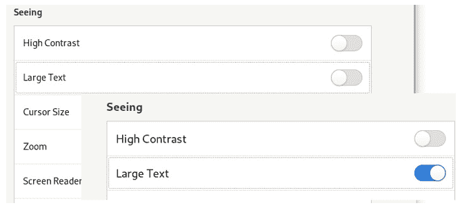

# 学习 Linux 101：辅助功能

> 原文：[`developer.ibm.com/zh/tutorials/l-lpic1-106-3/`](https://developer.ibm.com/zh/tutorials/l-lpic1-106-3/)

## 概述

在本教程中，了解有关辅助功能（有时称为“通用辅助”或“辅助技术”）的信息。学习内容：

*   了解和配置视觉设置和主题。
*   了解辅助技术。

## Linux 中的辅助功能

##### 关于本系列教程

本系列教程将帮助您了解 Linux 系统管理任务。您还可以使用这些教程中的资料来准备参加 [Linux Professional Institute LPIC-1：Linux 服务器专业认证考试](https://www.lpi.org/)。

参阅[学习 Linux 101：LPIC-1 学习路线图](https://developer.ibm.com/zh/tutorials/l-lpic1-map/)，获得本系列中每个教程的描述和链接。该路线图仍在制定中。本教程反映了 2018 年 10 月 29 日更新的 5.0 版本的目标。在教程完成时，会将它们添加到路线图中。

在当今世界，许多计算机用户都需要使用辅助技术（有时也称为“通用辅助”）。许多人都知道著名的数学家、物理学家和宇宙学家斯蒂芬·霍金 (Stephen Hawking) 所面临的问题，他就是借助辅助技术为科学事业做出了巨大的贡献。许多用户在使用计算机时或多或少地都会遇到一些挑战。本教程将介绍一些辅助技术，这些技术可帮助原本无法使用计算机的用户顺利地使用计算机。为了充分说明这一点，以我个人为例，我在 2015 年失去了大部分的视力，直到最近我才能够借助生物光学望远镜来恢复驾车。我每天都会使用本教程中介绍的多种辅助技术。

本教程将帮助您围绕 Linux 管理员 (LPIC-1) 考试 101 的 106 主题中的 106.3 目标进行应考准备。该目标的权重为 1。本教程反映了 2018 年 10 月 29 日更新的 5.0 版本的目标。

## 前提条件

要想最充分地利用本系列教程，您应该掌握 Linux® 的基本知识，还应该有一个正常工作的 Linux 系统，您可以在这个系统上练习本教程中涵盖的命令。有时候，程序的版本不同将导致相应的输出格式也不同，所以您的结果可能并不总是与这里显示的清单和图完全相同。

本教程中的示例来自 2020 年 6 月的 Fedora 32、Ubuntu 20.04 LTS 和 openSUSE Tumbleweed。

## 辅助类型

辅助通常是图形桌面的功能，而且辅助功能可能取决于桌面（例如 GNOME 或 KDE）。某些功能可能还取决于硬件，例如，显卡或屏幕功能、是否存在声卡、具有真正的键盘还是只有屏幕上的键盘等等。某些功能需要安装其他软件包，例如 Orca 屏幕朗读器。最新版本的 GNOME 下提供的支持相当不错，因此在本教程中，我将重点介绍这种支持，毕竟此处的目标是提高认识。我还会简要地介绍使用 KDE 的 openSUSE Tumbleweed，以展示它们之间的一些区别。

大多数辅助技术可分为以下几类：

*   **视觉**：这些技术可使屏幕内容更易于阅读，包括高对比度设置、屏幕缩放、大字体和屏幕朗读功能。
*   **听觉**：这些技术包括听力不佳时可能会错过的视觉警报，有时还包括其他自定义的声音警报。
*   **键入**：这些技术包括屏幕上键盘以及诸如粘滞键之类的功能，可以在您无法以正常速度键入或无法同时按下两个键（由于您无法用双手进行操作）时为您提供帮助。
*   **指向并单击**：这些功能可帮助您使用或定位鼠标。例如，将多长时间内的连续两次单击视为一次双击，或是否将长时间按住一个按钮视为第二次单击。
*   **手势**：这些技术包括多次按键或长时间按键，以及触摸板或触摸屏上的多手指操作。

通常可通过桌面设置对话框来使用这些辅助技术。某些辅助技术具有相关的键盘快捷键。使用设置对话框，可以自定义这些快捷键或添加更多快捷键。

不同的系统（甚至是使用通用桌面管理器的系统，例如 GNOME）可能具有截然不同的设置对话框，而辅助功能选项可能会位于设置对话框的不同部分下。下面我将展示一些示例（仅限您可以找到的示例）。

## 设置对话框

图 1 显示了使用 GNOME on Wayland 的 Fedora 32 系统上的设置对话框。顶部的选项始终显示桌面上的通用辅助菜单。这个带有下拉列表的图标显示在桌面布局的右上方，旁边是一组带有下拉列表的图标，可用于快速访问设置、网络以及关机或注销选项。我已经在设置对话框的图像上方说明了这一点。设置对话框的这一部分中显示的选项列表包括视觉选项、听觉选项以及键入选项。

##### 图 1：Fedora 32 GNOME Settings 对话框

相比之下，openSUSE 辅助功能设置对话框是使用选项卡来划分区域。您将会发现，不同系统的可用设置可能会有所不同。您可以将鼠标指针悬停在此对话框中的某个设置上，以了解有关该设置的更多信息（如图 2 所示）。而且，它没有提供用于固定辅助功能图标（像 GNOME 中那样）的设置。

##### 图 2：openSUSE Tumbleweed KDE 设置

因此，您可以看到不同的系统是以不同的方式呈现辅助功能设置。

## 视觉设置

一些与视觉相关的设置经常出现在硬件设置中。这些设置通常包括基本的显示器分辨率设置，有时还包括输入设备设置（例如鼠标速度或大小）。

### 硬件设置

屏幕分辨率和缩放功能通常是显示器硬件设置（而不是通用辅助设置）下的一项基本设置。例如，我有一台三星 28 英寸 4K 显示器，它能够实现 3840×2160 像素的分辨率。遗憾的是，我的眼睛无法在该分辨率的默认设置下工作。图 3 显示了 openSUSE Tumbleweed 的典型显示器设置对话框。分辨率下拉列表中显示首选长宽比为 16:9 分辨率为 3920×2180。该下拉列表中还显示了其他值，包括值 1920×1080，该值可以有效地使屏幕像全高清显示器一样工作。另外还提供了一个滑块，用于缩放显示区域。我将其设置为 200%，这理论上可以使屏幕以全高清模式显示内容。请注意，X11 上的 KDE 允许较小的缩放增量。其他系统（例如 Fedora 32 GNOME）的设置仅允许使用特定值，例如 100%、200% 或 300%。

##### 图 3：openSUSE Tumbleweed 显示设置

请注意，在本文撰写之时（2020 年 6 月），openSUSE Tumbleweed 的缩放功能似乎无法正常工作。在我设置过程中，我需要将分辨率更改为 1920×1080 才能看出差别。

与设置设备的系统默认值相比，设置非默认分辨率或缩放显示区域时会提供固定的缩放量。在本教程的后面部分中，我将介绍其他缩放可能性。

某些鼠标或指针设置也可以作为硬件设置（而不是作为辅助功能或通用辅助设置）进行管理。例如，将哪个按钮视为*左*按钮，将哪个按钮视为*右*按钮，以及速度和大小设置等。请务必检查硬件设置以及辅助功能或通用辅助设置。

### 高对比度

使用高对比度，可以更容易地区分屏幕上的文本。有时，整个桌面主题会使用相互衬托的颜色，这种主题称为高对比度主题。在目前的许多系统上，传统的黑色文本已被较浅的灰色阴影所代替。开启高对比度会使这些颜色变暗，并切换到可提供更好对比度的图标集。查看更多信息，请参阅“参考资料”中的 GNOME 发行说明。

### 大文本

大文本为桌面和遵守桌面设置的应用程序提供字号较大的文本。图 4 显示了在 Fedora 32 系统上开启大文本设置时带来的差异。

##### 图 4：Fedora 32 大文本

许多应用程序还允许您更改应用程序中文本的字号。例如，许多浏览器都支持使用 Ctrl++ 和 Ctrl+- 来增减文本字号，并且通常可使用 Ctrl+0 将字号重置为默认值。例如，Mozilla Firefox 允许您设置首选项，以指定这些操作是仅适用于文本还是适用于整个显示区域。浏览器还可能允许您设置默认字体和字号，这可能更适合您。设计欠佳的 Web 页面不一定能够根据这些首选项正常显示内容。

### 光标大小

在屏幕上查找光标时，光标的大小至关重要。最新的 GNOME 设置中公开了此设置，如图 5 中所示，我的实际光标大小为第二小尺寸，而不是默认的最小尺寸。

##### 图 5：Fedora GNOME 光标大小

早期版本是使用 `dconf-editor` 或 `gsettings` 命令公开此设置。清单 1 显示了如何使用带有 `get` 选项的 `gsettings` 命令来显示当前光标大小。可以使用 `set` 选项和一个数字值来更改光标大小。

##### 清单 1：使用 gsettings 显示光标大小

`[ian@attic5-f32 ~]$ gsettings get org.gnome.desktop.interface cursor-size`
`32`

### 缩放

缩放功能至少能够按一定的放大倍率查看部分或全部屏幕。某些系统可使用放大镜将鼠标指针或光标周围的一小块区域放大。在另一种极端情况下，放大镜可放大整个屏幕。尽管这通常意味着至少有一部分原始屏幕现在不在屏幕上，但是典型的操作是随着光标的移动而移动可见部分。缩放量通常是可配置的，而用于显示放大图像的区域通常也是可配置的，从指针周围的一小块区域开始，例如半个屏幕。其他选项可以在启用缩放功能时更改颜色，或在缩放的图像上显示十字线以更直观地显示当前位置。图 6 显示了 Fedora 32 系统上的一个示例，在此示例中，放大镜使用屏幕的下半部分，放大率为 125%，文本为黑底白字（而不是白底黑字）。

##### 图 6：将缩放功能与黑底白字相结合

除了这种 GNOME 缩放功能外，Xmag 或 Lmag 等应用程序还可以提供屏幕放大功能。

GIMP、LibreOffice（或 OpenOffice）等应用程序通常也可以在 View 菜单选项下提供缩放功能。这可以代替前面讨论的 Ctrl++ 和 Ctrl+- 选项。调整窗口大小（例如，通过拖动角落来使窗口变大）也会调整内容的字号。

### 屏幕朗读器

屏幕朗读器可通过朗读页面的结构和内容来帮助您浏览页面。Orca 是一个非常受欢迎的屏幕朗读器，它是作为 GNOME 项目的一部分开发的。它也可用于 KDE 和 Solaris。

Orca 可以通过语音合成器或可刷新的盲文显示器（盲文终端）来提供语音输出。对于语音，如果您更喜欢使用默认语言以外的其他语言，那么可以配置要使用的语言以及要使用的语音合成器。Orca 提供了丰富的配置选项，可用于确定要朗读页面的哪些部分、如何朗读数字，以及页面朗读的许多其他方面。

它提供了许多可配置的快捷键，可以帮助您浏览内容和使用该工具。特别是，您可以使用 Super+Alt+S 组合键来开启或关闭 Orca，其中超级键是典型 PC 键盘上的 Windows 键或 Apple 键盘上的 Apple 键（也称为 Command 键）。

图 7 显示了 Ubuntu 20.04 LTS 上的通用辅助对话框。用于始终显示通用辅助菜单的选项已开启，但光标大小仍设置为默认值（小）。

以下音频文件是 Orca 的录音，它帮助我通过语音合成器来浏览菜单。

##### 音频 1：用于浏览菜单的 Orca 录音

<https://s3.us.cloud-object-storage.appdomain.cloud/developer/default/tutorials/l-lpic1-106-3/static/orca-audio-menu-navigation.mp3>

您的浏览器不支持音频元素。

我使用向下箭头键向下移动所选项，直至到达 Cursor Size 选项。然后，按 Enter 键来打开子对话框以更改该选项。该对话框类似于图 5 中的对话框。在 Orca 告知我已选中了第一项后，我按向右箭头键移至第二项，然后按空格键将其选中。最后，按 Esc 键来关闭该子对话框。

##### 图 7：Ubuntu 通用辅助设置

以下音频文件演示了 Orca 如何在 Writer 中以文档形式朗读本教程中的文本。

##### 音频 2：Orca 朗读文本

<https://s3.us.cloud-object-storage.appdomain.cloud/developer/default/tutorials/l-lpic1-106-3/static/orca-audio-text.mp3>

您的浏览器不支持音频元素。

### 声音键

当您按下修改键（例如 Num Lock、Caps Lock 或 Scroll Lock）时，此选项会启用声音。在撰写本文之时，打开操作和关闭操作所发出的声音都相同的。针对每个状态指定不同的声音可能会对您更有帮助。如果要配置声音，请使用设置对话框的 Sounds 部分。例如，您可以将其更改为狗叫或滴水的声音。

## 听觉设置

现在提供了一项设置可帮助您解决听觉方面的问题。

### 视觉警报

每当播放警报声音时，请使用图 8 中所示的视觉警报设置来闪烁活动窗口或整个屏幕。注意，有一个按钮可以测试闪烁设置。

##### 图 8：在 Ubuntu 中设置视觉警报

## 键入设置

有多项设置已归入常规键入类别。

### 屏幕键盘

如果您使用过智能手机或平板电脑，则可能会对屏幕上键盘非常熟悉。Linux 也提供了屏幕键盘，您可以在需要时（例如在没有键盘的设备上）启用屏幕键盘。图 9 显示了一个示例。

##### 图 9：Ubuntu 屏幕键盘

### 重复键

此设置可控制按住一个键将如何产生多次按键。您可以开启或关闭重复键，也可以更改第一次按键后到重复操作开始前的延迟，以及按键的重复速度。

### 光标闪烁

有些人对反复闪烁的事物非常敏感。利用此设置，您可以禁用文本字段中的光标闪烁，如果启用了该设置，您还可以控制闪烁速率。

### 键入辅助 (AccessX)

键入辅助选项可处理诸如用户是否可以一次按住多个键或应根据用户操作多快地更改键操作等问题。图 10 中显示了 Ubuntu 20.04 TS 上的 GNOME 设置对话框。

##### 图 10：Ubuntu GNOME 键入辅助设置

这四项设置中的第一项设置是允许通过键盘开启或关闭这些设置。启用该设置后，连续按 Shift 键五次将打开粘滞键。

粘滞键将一系列单独按下的键（例如，先按 Alt 键再按 F1 键）视为同时按下的键。利用相应的选项，可以通过同时按下两个键来禁用该功能，也可以在按下修改键时发出蜂鸣声。

慢速键会增加按键被按下后到按键被接受前的延迟。相当于重复键的功能。同样，您可以启用在按下、接受或拒绝按键时发出蜂鸣声的功能。

回弹键会忽略快速重复的按键操作，将它们视为一次按键操作。

## “指向并单击”的设置

有几项设置可让您指向并单击特定选项。

### 鼠标键

鼠标键设置允许您使用数字小键盘上的键来移动鼠标指针或进行单击。将使用位于中心位置的 5 个键（8、4、5、6 和 2）。按 8 可向上移动鼠标指针，按 2 可向下移动鼠标指针，按 4 和 5 可分别向左或向右移动鼠标指针。按 5 可进行单击。您必须关闭 Num Lock 才能将这些键用作鼠标键。如果您需要使用数字小键盘来输入数字，请开启 Num Lock。

如果键盘上没有数字小键盘，则通常可以将备用 (Alt) 键与诸如功能 (Fn) 键之类的修改键结合使用。

### 定位指针

启用定位指针设置后，您可以按（左）Ctrl 键并提供一个小动画（例如，正在扩大的圆圈），即可显示指针所在的位置。相当于使用较大的鼠标指针。

### 单击辅助

利用此设置，可以通过按住主要按钮来模拟二次单击。延迟通常是可配置的。如果正在使用鼠标键，那么您可能需要启用此设置，以便按住按键 5 来模拟二次单击。

某些系统还允许您悬停单击，即在指针悬停时模拟单击。

### 双击延迟

双击延迟设置将指定被视为一次双击的两次连续单击之间可间隔的最长时间。

## 手势

如果您使用过智能手机或平板电脑，则您可能会很熟练地使用各种手势（如滑动、捏合或多指手势）来执行任务。Linux 对触摸屏和触摸板也支持此类手势。我在本教程的“参考资料”部分中提供了一些参考资料。

有时，组合键（例如，使用 Super+Alt+8 可开启或关闭屏幕放大功能）也称为手势，因此您可能会在此上下文中遇到该术语。

## 结束语

对主题 106.3“辅助功能”的介绍到此结束。

## 参考资料

*   在 [IBM Developer](https://developer.ibm.com/zh/) 主页上查找更多内容。
*   互联网标准由 IETF 作为 [Requests for Comment (RFC)](https://www.ietf.org/standards/rfcs/) 来维护。
*   GNOME 3.4 [发行说明](https://help.gnome.org/misc/release-notes/3.4/#rna11y)包含有关辅助功能的新增内容的说明。
*   有关使用 Orca 的更多信息，请参阅 GNOME 帮助中的 [Orca 屏幕朗读器](https://help.gnome.org/users/orca/stable/index.html.en)部分。
*   了解有关用于触摸屏和触摸板的 GNOME [手势和多点触控](https://wiki.gnome.org/Design/OS/Gestures)的信息。
*   了解在 Ubuntu 20.04 中[使用触摸屏手势来浏览桌面](https://help.ubuntu.com/stable/ubuntu-help/touchscreen-gestures.html.en)。
*   了解有关使用和自定义 [Ubuntu 18.04 LTS 中的触摸板手势](https://askubuntu.com/questions/1034624/touchpad-gestures-in-ubuntu-18-04-lts)的信息。

本文翻译自：[Learn Linux 101: Accessibility](https://developer.ibm.com/tutorials/l-lpic1-106-3/)（2020-07-09）