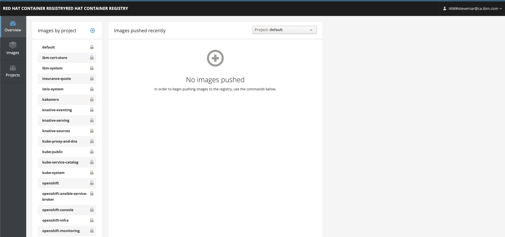
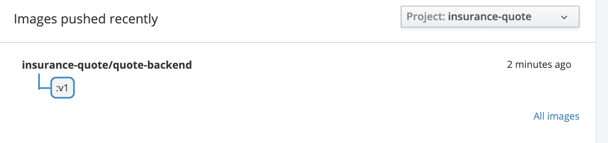
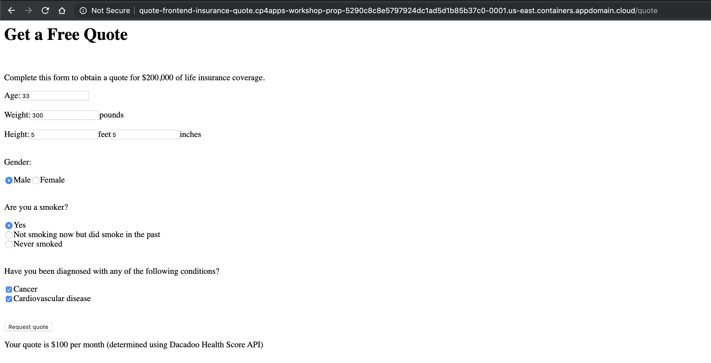

# Archived | 将 Appsody 应用程序部署到 OpenShift

> 原文：[`developer.ibm.com/zh/tutorials/deploy-appsody-applications-to-openshift/`](https://developer.ibm.com/zh/tutorials/deploy-appsody-applications-to-openshift/)

**本文已归档**

**归档日期：:** 2021-02-25

此内容不再被更新或维护。 内容是按“原样”提供。鉴于技术的快速发展，某些内容，步骤或插图可能已经改变。

在本教程中，我们将展示如何使用 Appsody 将样本[保险报价应用程序](https://github.com/IBM/appsody-sample-quote-app)部署到 Red Hat® OpenShift®。我们还将展示如何在 OpenShift 内部注册表上托管容器镜像，以及如何使用 [ConfigMap](https://docs.openshift.com/container-platform/3.11/dev_guide/configmaps.html) 资源来存储 API 密钥。在我们的示例中，将使用 Dacadoo API 密钥。

具体而言，我们将在本教程中使用以下命令：

*   `appsody build`，用于创建容器镜像
*   `apposdy deploy`，用于将镜像部署到集群

本教程是“[使用 Appsody 创建保险报价应用程序](https://developer.ibm.com/zh/patterns/create-insurance-quote-application-appsody/)”Code Pattern 的扩展。原始 Code Pattern 展示了如何部署到 IBM Kubernetes Service 以及如何将容器镜像存储在 IBM Container Registry 上。本教程将介绍如何部署到 OpenShift 并使用 OpenShift 内部注册表来存储容器镜像。

## 学习目标

在完成本练习后，您将了解如何：

*   使用 Appsody CLI 将应用程序部署到 OpenShift
*   访问 OpenShift 内部注册表
*   配置并使用 `ConfigMap`

## 前提条件

*   了解“[使用 Appsody 创建保险报价应用程序](https://developer.ibm.com/zh/patterns/create-insurance-quote-application-appsody/)”Code Pattern。**具体而言，在开始本教程之前，必须先执行[步骤 1-3](https://github.com/IBM/appsody-sample-quote-app#steps)（克隆、在本地运行前端、在本地运行后端）。**

*   安装 [Appsody](https://appsody.dev/) CLI。

*   获取对 [Red Hat OpenShift on IBM Cloud](https://cloud.ibm.com/kubernetes/catalog/openshiftcluster?cm_sp=ibmdev-_-developer-tutorials-_-cloudreg) 集群的访问权限。 *（可选）获取 [Dacadoo API 密钥](https://models.dacadoo.com/doc)。
    *   记录 API 的 URL（通常为 `https://models.dacadoo.com/score/2`）和 `key`（类似于 `UFDzMHAfsEg0oKzGp4rCSmXPClKKq3hDPLbPdvc2h`）。
    *   如果您不想注册，则可以使用代码中模拟的 API 实现。

## 预估时间

完成本教程中的步骤大约需要 45 分钟。

## 步骤

1.  设置项目名称空间
2.  访问内部 Docker 注册表
3.  将后端应用程序部署到 OpenShift
4.  将前端应用程序部署到 OpenShift

### 1\. 设置项目名称空间

在项目中部署 OpenShift 应用程序。因此，本教程的第一步是创建一个新项目。从终端中运行以下命令：

```
oc new-project insurance-quote 
```

您应该会看到如下输出：

```
$ oc new-project insurance-quote
Now using project "insurance-quote" on server "https://c100-e.us-east.containers.cloud.ibm.com:31718".

You can add applications to this project with the 'new-app' command.For example, try:

    oc new-app centos/ruby-25-centos7~https://github.com/sclorg/ruby-ex.git

to build a new example application in Ruby. 
```

检查当前上下文是否是您团队的项目空间。

```
oc project -q 
```

### 2\. 访问内部 Docker 注册表

现在，您需要一个位置来推送 Appsody 所创建的新构建的 Docker 镜像。幸运的是，OpenShift 随附了一个可供您使用的内部 Docker 注册表。但是，默认情况下，不支持公开访问此注册表。

如果运行下面的 `oc get route --all-namespaces` 命令，那么您会看到只有注册表的仪表板可用（这不是我们预期的结果）。

```
oc get route --all-namespaces | grep registry 
```

您应该会看到如下输出：

```
$ oc get route --all-namespaces | grep registry
default    registry-console    registry-console-default.cp4apps-workshop-prop-5290c8c8e5797924dc1ad5d1b85b37c0-0001.us-east.containers.appdomain.cloud 
```



要访问内部注册表，您需要创建一个路由并将其公开。请参阅 [IBM Cloud 文档](https://cloud.ibm.com/docs/openshift?topic=openshift-openshift-images#openshift_internal_registry)以获取完整的步骤。下面提供了简要步骤。

1.  运行以下命令以创建一个新路由。

    ```
     oc create route reencrypt docker-registry --service=docker-registry -n default 
    ```

2.  您现在可以获取 Docker 注册表 URL，如：

    ```
     oc get route --all-namespaces | grep registry 
    ```

    您应该会看到如下输出：

    ```
     $ oc get route --all-namespaces | grep registry
     default    docker-registry    docker-registry-default.cp4apps-workshop-prop-5290c8c8e5797924dc1ad5d1b85b37c0-0001.us-    east.containers.appdomain.cloud
     default    registry-console    registry-console-default.cp4apps-workshop-prop-5290c8c8e5797924dc1ad5d1b85b37c0-0001.us-    east.containers.appdomain.cloud 
    ```

    要使用的 URL 为 `docker-registry`。这类似于 `docker-registry-default.*.containers.appdomain.cloud`。

1.在您获得 URL 后，将其设置为变量：

```
```bash
export IMAGE_REGISTRY=<docker_url>
``` 
```

1.  将本地 `docker` 命令设置为使用该注册表。使用 `docker login`：

    ```
     docker login -u $(oc whoami) -p $(oc whoami -t) $IMAGE_REGISTRY 
    ```

### 3\. 将后端应用程序部署到 OpenShift

要进行部署，可以使用 `appsody deploy` 命令。此命令可用于：

*   构建用于生产用途的部署镜像（例如，其中不包括开发模式工具）
*   将镜像推送到指定的镜像注册表
*   构建一个部署 YAML 文件（如果尚未生成）作为 Appsody Operator 的 CR
*   将 YAML 文件应用于 Kubernetes 集群

Appsody 可以使用默认部署清单直接部署到 Kubernetes 集群。如果集群不需要任何特定凭证，则可以使用此方法。

在此示例中，您需要提供凭证，因此 Appsody 允许您生成所要使用的部署清单，但无需进行实际部署。然后，您可以修改该清单，并要求 Appsody 使用该清单来部署应用程序。

#### 3.1 为 Dacadoo API 密钥创建 ConfigMap

要使后端应用程序将请求发送到 Dacadoo Health Score API，您需要创建一个密钥，其中包含用于向 Dacadoo 服务器发出请求的配置。您已在本教程的前提条件中获得了 Health Score API。（注意：如果您不想使用 Dacadoo Health Score API，则可以跳过此设置并继续使用模拟端点。）

```
oc create configmap dacadoo-config --from-literal=url=<url> --from-literal=apikey=<apikey> 
```

其中：

*   `<url>` 是 Dacadoo 服务器的 URL（通常为 `https://models.dacadoo.com/score/2`）
*   `<apikey>` 是您注册使用 API 时获得的 API 密钥。

例如：

```
oc create configmap dacadoo-config --from-literal=DACADOO_URL=https://models.dacadoo.com/score/2 --from-literal=DACADOO_APIKEY=Y3VB...RMGG
configmap/dacadoo-config created 
```

#### 3.2 部署后端应用程序

> **重要事项**：本练习的这一部分扩展了初始 [Code Pattern](https://github.com/IBM/appsody-sample-quote-app#3-create-the-backend-application-and-run-it-locally)（其展示了如何为后端创建初始代码）。

1.  导航到 `quote-backend` 目录。您需要修改部署 YAML 文件，才能将密钥值传递给应用程序。您可以按如下所示生成初始部署 YAML 文件：

    ```
     cd ~/appsody-apps/quote-backend
     appsody deploy --generate-only 
    ```

    这将在项目中创建名为 `app-deploy.yaml` 的文件。

    ```
     apiVersion: appsody.dev/v1beta1
     kind: AppsodyApplication
     metadata:
       name: quote-backend
     spec:
       # Add fields here
       version: 1.0.0
       applicationImage: dev.local/quote-backend
       stack: java-spring-boot2
       service:
         type: NodePort
         port: 8080
         annotations:
           prometheus.io/scrape: 'true'
           prometheus.io/path: '/actuator/prometheus'
       readinessProbe:
         failureThreshold: 12
         httpGet:
           path: /actuator/health
           port: 8080
         initialDelaySeconds: 5
         periodSeconds: 2
       livenessProbe:
         failureThreshold: 12
         httpGet:
           path: /actuator/liveness
           port: 8080
         initialDelaySeconds: 5
         periodSeconds: 2
       expose: true
       createKnativeService: false 
    ```

2.  您需要在生成的文件中添加一个部分。在 `spec` 键下，创建一个新的 `envFrom` 键，该键具有 OpenShift ConfigMap 的值。在本研讨会中，使用 `dacadoo-config` 作为名称。

    > **技巧**：确保 `name` 前面有两个空格，请参阅[此 GitHub 问题](https://github.com/kubernetes/kubernetes/issues/46826#issuecomment-305728020)

    ```
     apiVersion: appsody.dev/v1beta1
     kind: AppsodyApplication
     metadata:
       name: quote-backend
     spec:
       # Add fields here
       version: 1.0.0
       .
       .
       envFrom:
         - configMapRef:
             name: dacadoo-config
       expose: true
       createKnativeService: false 
    ```

3.  现在使用 `appsody deploy` 来推送镜像并进行部署。使用 OpenShift Docker 注册表时，将使用不同的 URL 来推送和提取给定的镜像。`appsody deploy` 允许您在命令行上指定这些 URL：

    ```
     appsody deploy --tag insurance-quote/quote-backend:v1 --push-url $IMAGE_REGISTRY --push --pull-url docker-registry.default.svc:5000 --namespace insurance-quote 
    ```

    您应该会看到如下输出：

    ```
     $ appsody deploy --tag insurance-quote/quote-backend:v1 --push-url $IMAGE_REGISTRY --push --pull-url docker-registry.default.svc:5000 --namespace insurance-quote
     .
     .
     [Docker] Successfully built 4294712e0f9e
     [Docker] Successfully tagged docker-registry-default.cp4apps-workshop-prop-5290c8c8e5797924dc1ad5d1b85b37c0-0001.us-  east.containers.appdomain.cloud/insurance-quote/quote-backend:v1
     Built docker image docker-registry-default.cp4apps-workshop-prop-5290c8c8e5797924dc1ad5d1b85b37c0-0001.us-east.containers.appdomain.cloud/insurance-quote/quote-backend:v1
     Using applicationImage of: docker-registry-default.cp4apps-workshop-prop-5290c8c8e5797924dc1ad5d1b85b37c0-0001.us-east.containers.appdomain.cloud/insurance-quote/quote-backend:v1
     Pushing docker image docker-registry-default.cp4apps-workshop-prop-5290c8c8e5797924dc1ad5d1b85b37c0-0001.us-east.containers.appdomain.cloud/insurance-quote/quote-backend:v1
     Attempting to apply resource in Kubernetes ...
     Running command: kubectl apply -f app-deploy.yaml --namespace insurance-quote
     Deployment succeeded.
     Appsody Deployment name is: quote-backend
     Running command: kubectl get rt quote-backend -o jsonpath="{.status.url}" --namespace insurance-quote
     Attempting to get resource from Kubernetes ...
     Running command: kubectl get route quote-backend -o jsonpath={.status.ingress[0].host} --namespace insurance-quote
     Deployed project running at quote-backend-insurance-quote.cp4apps-workshop-prop-5290c8c8e5797924dc1ad5d1b85b37c0-0001.us-  east.containers.appdomain.cloud 
    ```

    > **注意**：如果部署过程中出现超时，请参阅《管理指南》中的[推送到 OpenShift 注册表时出现超时](https://www.kabanero.io/docs/ref/general/reference/troubleshooting.html#docker-push-fails-with-gateway-timeout-error)部分。 **注意**：运行 `appsody deploy` 以在集群的 *Default* 名称空间上安装 [Appsody Operator](https://github.com/appsody/appsody-operator)。

4.  在部署完成后，您可以使用 curl 来测试该服务。部署中的最后一行输出（见上文）提供了后端应用程序的 URL。为简便起见，我们将该 URL 放在一个环境变量中。

    因此，对于上面的示例，后端 URL 如下：

    ```
     export  BACKEND_URL=quote-backend-insurance-quote.cp4apps-workshop-prop-5290c8c8e5797924dc1ad5d1b85b37c0-0001.us-    east.containers.appdomain.cloud 
    ```

    使用 curl 测试该服务，如下所示：

    ```
     curl -X POST -d @backend-input.json  -H "Content-Type: application/json"  http://$BACKEND_URL/quote 
    ```

    您应该会看到如下输出：

    ```
     $ curl -X POST -d @backend-input.json -H "Content-Type: application/json" http://$BACKEND_URL/quote
     {"quotedAmount":70,"basis":"Dacadoo Health Score API"} 
    ```

    > **注意**：如果未使用 Dacadoo Health Score API，则您可能会看到“basis”的值为其他文本（您将看到“mocked backend computation”，而不是“Dacadoo Health Score API”）。

5.  返回到注册表仪表板，此时应该会显示新镜像。

    

### 4\. 将前端应用程序部署到 OpenShift

> **重要事项**：本练习的这一部分扩展了初始 [code pattern](https://github.com/IBM/appsody-sample-quote-app#2-create-the-frontend-application-and-run-it-locally)（其展示了如何为前端创建初始代码）。

现在，我们将前端应用程序部署到 OpenShift。部署步骤类似于部署后端应用程序时的步骤。区别在于，需要告知前端应用程序如何与后端应用程序进行通信。前端将查看环境变量 `BACKEND_URL` 以找到后端的地址，因此我们将在应用程序 CR 中设置此变量。

1.  您可以将其指定为先前使用且已实际公开的后端 URL。但是，由于前端和后端都在同一个集群中运行，因此最好是使用为后端定义的服务。

您可以通过输入以下内容来查看该服务：

```
```bash
oc get services
```

这应该会生成如下内容：

```bash
$ oc get services
NAME             TYPE       CLUSTER-IP       EXTERNAL-IP   PORT(S)          AGE
quote-backend    NodePort   172.21.175.254   <none>        8080:32379/TCP   15m
``` 
```

1.  要在应用程序资源中引用此内容，首先需要生成部署 YAML 文件，以便可以对其进行编辑。将当前目录切换回前端应用程序，并生成部署 YAML 文件。

    ```
     cd ../quote-frontend
     appsody deploy --generate-only 
    ```

2.  编辑所创建的文件 `app-deploy.yaml`，并添加如下的 `env` 部分（该部分使用集群中后端应用程序的 URL 来定义环境变量）。仔细匹配缩进（`env:` 缩进的空格数与 `applicationImage:` 相同）。

    ```
     apiVersion: appsody.dev/v1beta1
     kind: AppsodyApplication
     metadata:
       name: quote-frontend
     spec:
       # Add fields here
       version: 1.0.0
       applicationImage: quote-frontend
       env:
       - name: BACKEND_URL
         value: http://quote-backend:8080/quote
       .
       .
       . 
    ```

3.  保存该 YAML 文件并执行部署。

    ```
     appsody deploy --tag insurance-quote/quote-frontend:v1 --push-url $IMAGE_REGISTRY --push --pull-url docker-registry.default.svc:5000 --namespace insurance-quote 
    ```

    您应该会看到如下输出：

    ```
     $ appsody deploy --tag insurance-quote/quote-frontend:v1 --push-url $IMAGE_REGISTRY --push --pull-url docker-registry.default.svc:5000 --namespace insurance-quote
     ...
     [Docker] Successfully built ba7451568a04
     [Docker] Successfully tagged docker-registry-default.cp4apps-workshop-prop-5290c8c8e5797924dc1ad5d1b85b37c0-0001.us-    east.containers.appdomain.cloud/insurance-quote/quote-frontend:v1
     Built docker image docker-registry-default.cp4apps-workshop-prop-5290c8c8e5797924dc1ad5d1b85b37c0-0001.us- east.containers.appdomain.cloud/insurance-quote/quote-frontend:v1
     Using applicationImage of: docker-registry-default.cp4apps-workshop-prop-5290c8c8e5797924dc1ad5d1b85b37c0-0001.us-east.containers.appdomain.cloud/insurance-quote/quote-frontend:v1
     Pushing docker image docker-registry-default.cp4apps-workshop-prop-5290c8c8e5797924dc1ad5d1b85b37c0-0001.us-east.containers.appdomain.cloud/insurance-quote/quote-frontend:v1
     Attempting to apply resource in Kubernetes ...
     Running command: kubectl apply -f app-deploy.yaml --namespace insurance-quote
     Deployment succeeded.
     Appsody Deployment name is: quote-frontend
     Running command: kubectl get rt quote-frontend -o jsonpath="{.status.url}" --namespace insurance-quote
     Attempting to get resource from Kubernetes ...
     Running command: kubectl get route quote-frontend -o jsonpath={.status.ingress[0].host} --namespace insurance-quote
     Deployed project running at quote-frontend-insurance-quote.cp4apps-workshop-prop-5290c8c8e5797924dc1ad5d1b85b37c0-0001.us-    east.containers.appdomain.cloud 
    ```

4.  然后，您可以在浏览器中使用上述 URL 打开前端应用程序（在上述示例中，URL 为 `quote-frontend-insurance-quote.cp4apps-workshop-prop-5290c8c8e5797924dc1ad5d1b85b37c0-0001.us-east.containers.appdomain.cloud`）。

5.  填写表单，然后单击相应按钮以提交该表单。您应该会从后端应用程序中获取一份报价。



> **注意**：如果未使用 Dacadoo Health Score API，则您可能会在报价后看到其他文本。 您将看到“determined using mocked backend computation”，而不是“determined using Dacadoo Health Score API”。

## 结束语

**恭喜**！现在，您已将前端和后端应用程序都部署到 OpenShift，将它们连接在一起，并支持扩展到外部服务。

通常，为了在 Docker 或 Kubernetes 环境中启用其他测试，才会建议使用 Appsody 以这种方式部署应用程序。如您所知，在正式测试、登台和生产环境中使用这种手动方法并不能解决保持一致性、可重复性和可控性的问题。

在后续练习中，我们将展示如何使用 Appsody 和 Kabanero 来实现以下目标：使用 Tekton Pipeline，连接到应用程序代码的 Git 代码存储库，从而确保触发自动构建和部署。这是 Kabanero 和 Cloud Pak for Applications 支持的推荐方法。

本文翻译自：[Deploy Appsody applications to OpenShift](https://developer.ibm.com/tutorials/deploy-appsody-applications-to-openshift/)（2019-12-16）