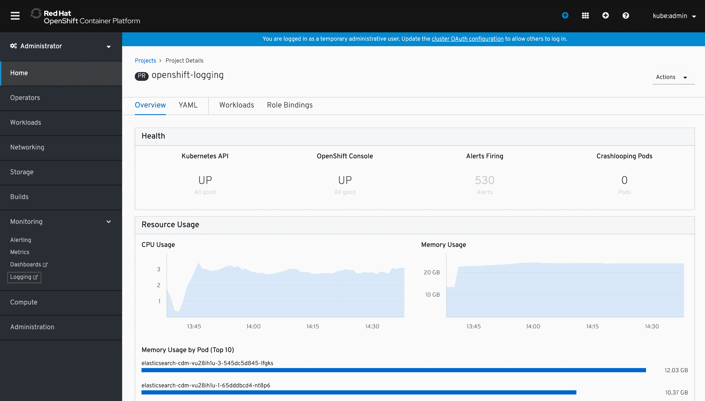
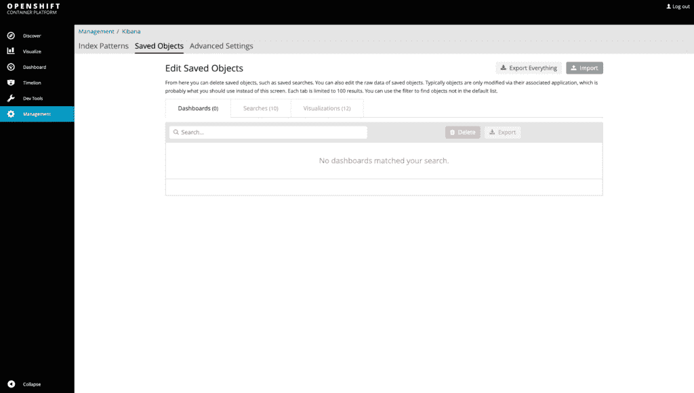
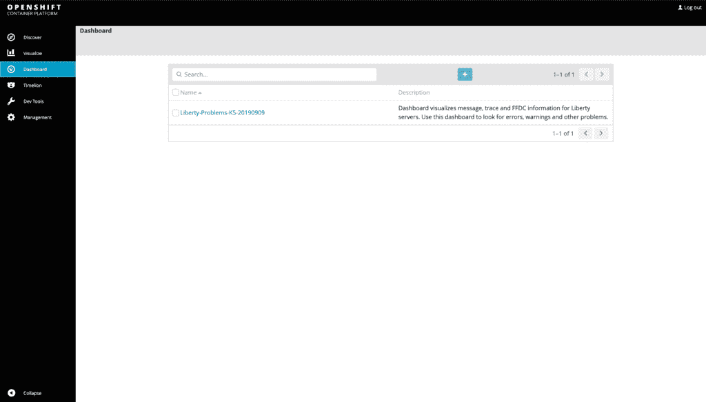
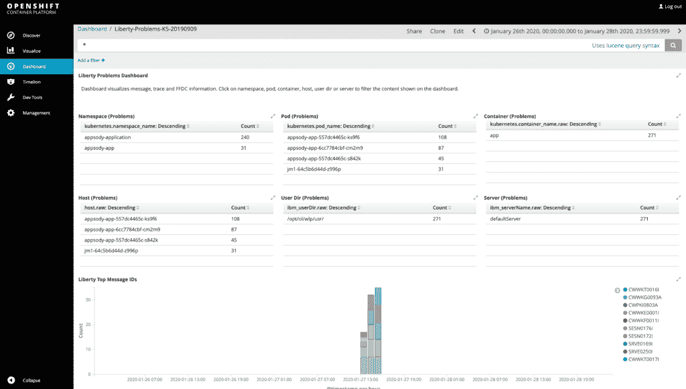
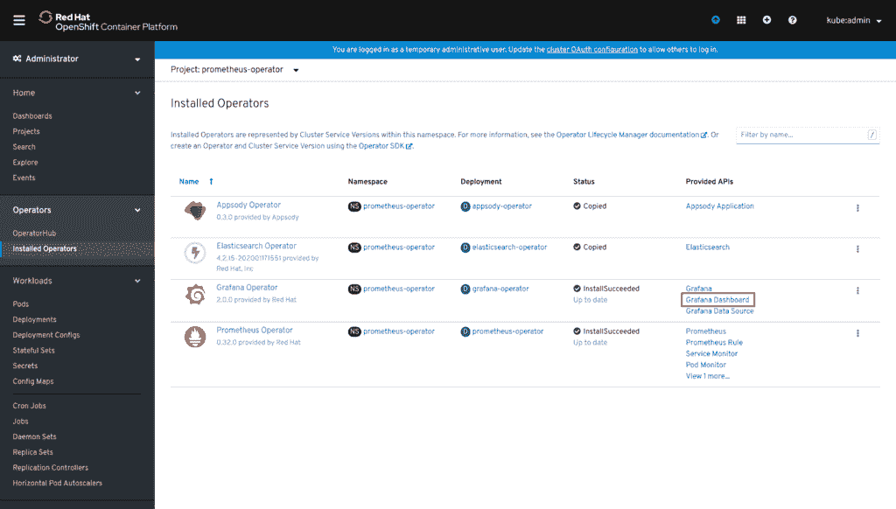
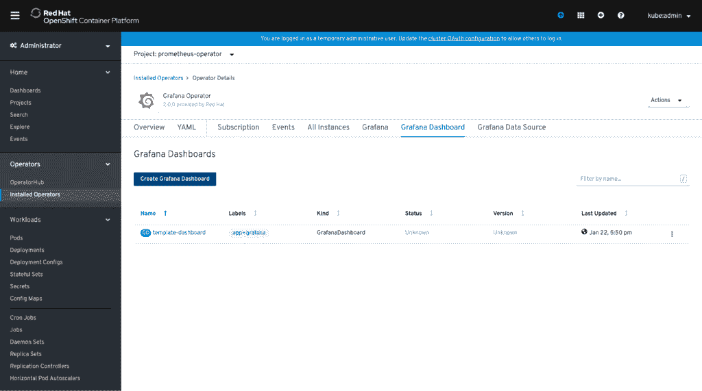
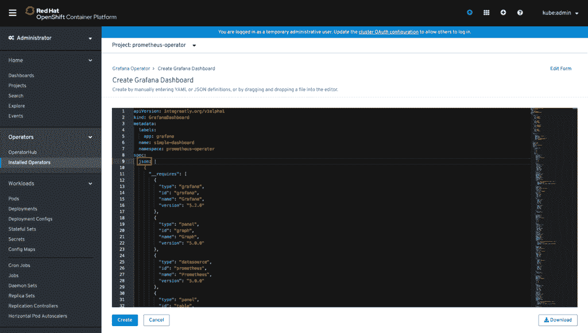
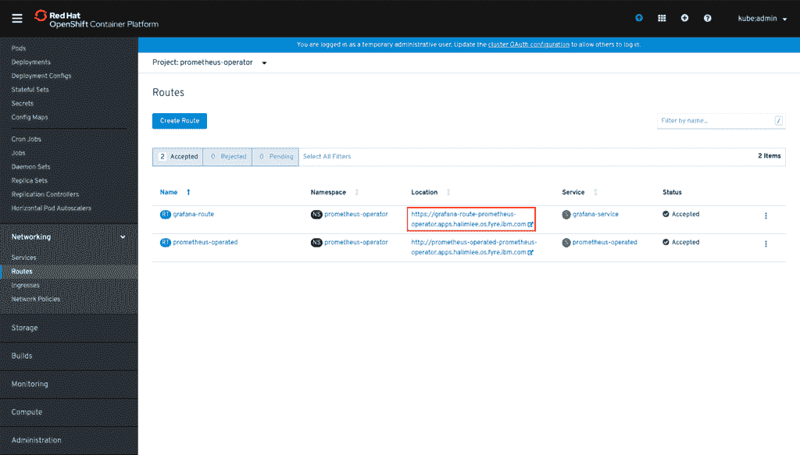

# Archived | 使用 Appsody、OpenShift 和 Open Liberty 配置可观测的微服务

> 原文：[`developer.ibm.com/zh/tutorials/configure-an-observable-microservice-with-appsody-openshift-open-liberty/`](https://developer.ibm.com/zh/tutorials/configure-an-observable-microservice-with-appsody-openshift-open-liberty/)

**本文已归档**

**归档日期：:** 2021-02-25

此内容不再被更新或维护。 内容是按“原样”提供。鉴于技术的快速发展，某些内容，步骤或插图可能已经改变。

*编者注：本教程于 2020 年 8 月 3 日（英文 6 月 23 日）更新，可与 Kabanero 0.8.0 和 Red Hat OpenShift Container Platform 4.4 兼容。*

Appsody Operator 与 OpenShift 搭配使用，让您能够快速、轻松地部署各种运行时模板。这些模板可以创建一个简单的基础项目工作空间，供您开始开发工作。

其中一个模板是 [Open Liberty](https://openliberty.io/) 支持的 Java MicroProfile Appsody 应用程序堆栈，该堆栈利用 Eclipse MicroProfile 3.2 技术来开发微服务。这是开发可观察的微服务的坚实基础。

为什么要采用 MicroProfile？因为 Eclipse MicroProfile 规范已经提供了重要的可观察性功能，例如 MicroProfile Metrics 和 MicroProfile Health。MicroProfile Health 功能允许服务通过两个不同的端点来报告各自就绪情况和活动状态。MicroProfile Metrics 功能允许运行时跟踪和公开用于通过端点进行监控的指标。

在本教程中，我们会向您展示如何自定义应用程序部署，并介绍各种监控工具，以便您使用和可视化运行状况和指标数据。此外，我们还将向您展示如何利用 Open Liberty 运行时的 JSON 日志记录功能，以使用 Kibana 来可视化日志记录数据。

## 前提条件

要完成本教程中的步骤，您需要：

*   [安装 Appsody](https://appsody.dev/docs/getting-started/installation)
*   登录到某个 Docker 注册表
*   登录到您的 OpenShift 集群
*   在 OpenShift 集群上部署了以下堆栈：
    *   Prometheus 和 Grafana 堆栈。[阅读文档](https://kabanero.io/guides/app-monitoring-ocp4.2/)以了解有关如何在 OpenShift 集群上部署此堆栈的说明。
    *   Elasticsearch、Fluentd 和 Kibana（EFK）堆栈。[阅读文档](https://kabanero.io/guides/app-logging-ocp-4-2/)以了解有关如何在 OpenShift 集群上部署 EFK 堆栈的说明。
*   安装 Open Liberty Operator

要使用 Prometheus 安全地从 Open Liberty 抓取指标数据，您的开发和运维团队需要共同努力来配置身份验证凭证。可以在以下章节中找到有关本主题的详细信息：配置 Open Liberty 安全性。

## 自定义和部署 Java MicroProfile 堆栈

在您的本地系统上，创建一个空目录作为项目目录。Appsody 将使用此目录的名称作为您的应用程序的名称。

在空白项目目录中，通过调用以下命令来初始化 Java MicroProfile 堆栈：

```
appsody init java-microprofile 
```

Java MicroProfile 模板现已部署到当前目录中。现在您可以开始自定义代码了。

我们可以从这里开始进行自定义。有关 MicroProfile 堆栈的详细信息，请参阅 [Appsody 堆栈 Github 页面](https://github.com/appsody/stacks/tree/f87a88a1398719737547f73fb4de38d89ccb7878/incubator/java-microprofile)。

在您的 OpenShift 集群中，您需要创建一个项目名称空间以供部署 Appsody 应用程序堆栈。以下代码向您展示了如何创建此名称空间；在我们的示例中，`appsody-application` 用作项目名称空间。

```
oc new-project appsody-application 
```

### 配置 Open Liberty 安全性

通过使用 `<appsody_project_directory>/src/main/liberty/config` 下的 `quick-start-security.xml` 配置中的 `<quickStartSecurity>` 属性，已经为 Java MicroProfile Appsody 配置了用于本地开发的基本身份验证。默认的用户名是 `admin`，密码是在启动时生成的。 `quick-start-security.xml` 配置仅用于本地部署原型制造，并且在部署到 OpenShift 时会删除该文件。您必须将任何形式的身份验证添加到`<appsody_project_directory>/src/main/liberty/config` 配置中，才能部署到 OpenShift。

为了简单起见，在下面的 `server.xml` 配置中添加了 `<quickStartSecurity>` 元素作为示例。您可能需要在 Liberty 中配置其他形式的身份验证，例如[基本注册表](https://www.ibm.com/support/knowledgecenter/en/SSEQTP_liberty/com.ibm.websphere.wlp.doc/ae/twlp_sec_basic_registry.html) 或 [LDAP 注册表](https://www.ibm.com/support/knowledgecenter/en/SSEQTP_liberty/com.ibm.websphere.wlp.doc/ae/twlp_sec_ldap.html)，来保护以身份验证进行服务器访问的安全。

在以下的 `server.xml` 示例中，使用 `<quickStartSecurity>` 元素中的两个环境变量 `username` 和 `password` 来避免在 `server.xml` 中进行硬编码以及明文身份验证凭证。在将应用程序部署到 Openshift 之后，将使用您选择的用户名和密码来设置这两个环境变量。在将部署应用程序的相同名称空间中创建一个包含所需身份验证凭证的秘密。在后面的在环境变量中使用秘密凭证。

以下代码显示了使用环境变量 `username` 和 `password` 指定的身份验证的 `server.xml`：

```
<server description="Liberty server">
    <featureManager>
        <feature>microProfile-3.2</feature>
    </featureManager>

    <quickStartSecurity userName="${env.username}" userPassword="${env.password}"/>

    <httpEndpoint host="*" httpPort="${default.http.port}" httpsPort="${default.https.port}" id="defaultHttpEndpoint"/>

    <webApplication location="starter-app.war" contextRoot="/"/>
</server> 
```

### 启用 Open Liberty JSON 日志记录

Open Liberty 运行时能够将日志记录事件以 JSON 格式发送到标准输出/控制台。这让强大的监控堆栈，如 Elasticsearch、Fluentd 和 Kibana（EFK），来更高效地使用、存储和可视化数据。

要启用 Open Liberty 的 JSON 日志记录功能，请修改 `pom.xml` 以使用所需的配置值来生成 `bootstrap.properties` 文件。

例如，将代码从：

```
...
    <bootstrapProperties>
        <default.http.port>${http.port}</default.http.port>
        <default.https.port>${https.port}</default.https.port>
        <app.context.root>${app.name}</app.context.root>
    </bootstrapProperties>
... 
```

更改为：

```
...
    <bootstrapProperties>
        <default.http.port>${http.port}</default.http.port>
        <default.https.port>${https.port}</default.https.port>
        <app.context.root>${app.name}</app.context.root>
        <com.ibm.ws.logging.console.format>json</com.ibm.ws.logging.console.format>
        <com.ibm.ws.logging.console.source>message,trace,accessLog,ffdc,audit</com.ibm.ws.logging.console.source>
        <com.ibm.ws.logging.console.log.level>info</com.ibm.ws.logging.console.log.level>
        <com.ibm.ws.logging.message.format>json</com.ibm.ws.logging.message.format>
        <com.ibm.ws.logging.message.source></com.ibm.ws.logging.message.source>
        <com.ibm.ws.logging.trace.file.name>stdout</com.ibm.ws.logging.trace.file.name>
    </bootstrapProperties>
... 
```

当您的服务器启动时，Open Liberty 运行时将解释这些值，并且发送到 *控制台* 的所有后续日志将由环境变量定义的 *源* 组成。另外，代码段中定义的设置将禁用向 `messages.log` 和 `traces.log` 的输出。

有关后续步骤，请参阅分析 Open Liberty 日志。

要了解有关 Open Liberty 的日志记录功能配置的详细信息，请参阅 [Open Liberty 日志记录文档](https://openliberty.io/docs/ref/general/#logging.html)。

### 启用 Open Liberty 指标

同时配置了 `monitor-1.0` 和 `mpMetrics-x.x` 功能时，额外指标将由 Open Liberty 运行时跟踪。`microProfile-3.2` 功能将启动 `mpMetrics-2.2` 功能。

在 `<appsody_project_directory>/src/main/liberty/config/server.xml` 中配置 `monitor-1.0` 功能，方法是添加以下内容：

`server.xml` 代码片段：

```
<featureManager>
   <feature>microProfile-3.2</feature>
   <feature>monitor-1.0</feature>
</featureManager> 
```

通过调用以下命令首先在本地测试您的 Appsody 应用程序：

```
appsody run 
```

可以转到 `http://localhost:9080/metrics` 在 `/metrics` 端点上查看您的指标。提示输入身份验证凭据时，请使用您在上面配置的用户名和密码。

### 将应用程序部署至 OpenShift

现在，您的 Appsody 应用程序已完成，请确保您已登录 Docker 存储库，然后使用以下命令将该应用程序部署到 OpenShift 集群：

`appsody deploy -t demo-repo/java-microprofile-demo:latest --push --namespace appsody-application`

代码发生了什么变化？我们来简单看看：

*   `-t` 标记我们的镜像。
*   `--push` 将镜像推送到外部 Docker 注册表。
*   `--namespace` 告知 OpenShift 集群我们希望在指定名称空间下面部署此 Appsody 应用程序。
*   `demo-repo` 是示例存储库的名称。请替换为适当的存储库名称。
*   `appsody-application` 是项目名称空间。请替换为适当的项目名称空间。

作为部署过程的一部分，Appsody CLI 将检查是否已在名称空间中部署了 Appsody Operator，并在需要的情况下进行部署。然后，部署流程将生成适用于该 operator 的 Appsody 应用程序的部署清单，并应用此部署清单。您的应用程序现在已经部署到 OpenShift 集群中。

将在您的本地项目目录中生成一个名为 `app-deploy.yaml` 的文件。这是部署到您的 OpenShift 集群的 `yaml` 文件。您可以通过额外的配置进一步修改此文件，然后执行以下命令重新应用此文件：

```
oc apply -f app-deploy.yaml 
```

运维团队创建的 `Service Monitor` 将配置为监控包含特定标签的部署。与您的运维团队沟通以确定此标签的键值的内容。您需要将这些标签应用于 `app-deploy.yaml`，然后重新部署此文件。

例如，如果 `Service Monitor` 在监控值为 `demo` 的标签 `app`。

```
metadata:
  labels:
    app: demo 
```

### 在环境变量中使用秘密凭证

在 `server.xml` 的 `<quickStartSecurity>` 元素中使用了两个环境变量 `username` 和 `password` 来进行基本身份验证。您可以通过修改 `app-deploy.yaml` 使用您自己的用户名和密码来设置这两个环境变量并重新部署。

您必须在与应用程序部署相同的名称空间中有一个包含所需凭证的秘密。这应该与在配置 Open Liberty 安全性部分中创建的秘密相同。修改您的 `app-deploy.yaml` 使其包含 `envFrom` 定义，并引用您的秘密。

在以下示例中，将 `metrics-liberty` 替换为您的秘密：

```
spec:
  envFrom:
  - secretRef:
      name: metrics-liberty 
```

这个 `envFrom` 配置使用您秘密的用户名和密码值为您的应用程序容器设置了两个环境变量 `username` 和 `password`。

#### 部署 Service Monitor

作为额外步骤，您可以通过修改并重新部署 `app-deploy.yaml` 将 `Service Monitor` 部署到您的 OpenShift 集群中。对于开发者来说，这让您能够更直接地控制应用程序部署与 Prometheus 的连接。不必等待运维团队成员来配置 `Service Monitor`，您可以自己配置。

添加以下配置：

```
 monitoring:
    endpoints:
    - basicAuth:
        password:
          key: password
          name: metrics-liberty
        username:
          key: username
          name: metrics-liberty
      interval: 10s
      tlsConfig:
        insecureSkipVerify: true
    labels:
      k8s-app: "" 
```

Prometheus 部署可以监控包含特定标签的 `Service Monitors`。在此示例中，Prometheus 部署需要监控包含 `k8s-app` 标签的 `Service Monitors`。此外，Prometheus 部署只能监控包含特定标签的名称空间。

您需要与您的运维团队沟通以了解需要哪个标签，以便获取您的 `Service Monitor` 和名称空间。

`basicAuth` 代码部分定义了在访问 `/metrics` 端点时应该用来进行身份验证的用户名和密码。

在此示例中，`metrics-liberty` 是对名为 `metrics-liberty`的 `secret` 的引用，其中包含加密的用户名和密码值。需要在与应用程序部署和服务监控相同的项目名称空间中创建密钥。这也应该与上一节中使用的秘密相同。参阅配置 Open Liberty 安全性，查看如何为底层 Open Liberty 运行时设置身份验证安全性。

以下代码显示了包含 *monitoring* 代码部分的 `app-deploy.yaml`。

```
apiVersion: appsody.dev/v1beta1
kind: AppsodyApplication
metadata:
  name: myAppsodyApplication
spec:
  # Add fields here
  version: 1.0.0
  applicationImage: demo-repo/java-openliberty-demo:latest
  stack: java-openliberty
  service:
    type: NodePort
    port: 9080
    annotations:
      prometheus.io/scrape: 'true'
  readinessProbe:
    failureThreshold: 12
    httpGet:
      path: /health/ready
      port: 9080
    initialDelaySeconds: 5
    periodSeconds: 2
  livenessProbe:
    failureThreshold: 12
    httpGet:
      path: /health/live
      port: 9080
    initialDelaySeconds: 5
    periodSeconds: 2
  monitoring:
    endpoints:
    - basicAuth:
        password:
          key: password
          name: metrics-liberty
        username:
          key: username
          name: metrics-liberty
      interval: 10s
      tlsConfig:
        insecureSkipVerify: true
    labels:
      k8s-app: ''
  expose: true
  createKnativeService: false 
```

## 分析 Open Liberty 日志

### 使用 Kibana 仪表板查看日志

由于 Open Liberty 运行时发送 JSON 格式的日志，因此我们可以利用 EFK 堆栈来帮助我们监控这些日志记录事件。Fluentd 收集 JSON 数据，然后将其发送到 Elasticsearch 以进行存储和索引编制。然后，Kibana 将数据可视化。

提供了 Kibana 仪表板以可视化来自 Open Liberty 运行时的事件。在[此处](https://github.com/OpenLiberty/open-liberty-operator/tree/master/deploy/dashboards/logging)检索专为分析 Liberty 日志记录事件而设计的 Kibana 仪表板。

注意：要使用这些仪表板，日志记录事件必须以 JSON 格式发送到标准输出。如果尚未配置 Open Liberty 运行时，请参阅启用 Open Liberty JSON 日志记录

### 导入 Kibana 仪表板

要导入 Kibana 仪表板，请完成以下步骤：

1.  在您的 OpenShift Container Platform 网页控制台中，导航到 Networking > Routes 以访问 Kibana。

    

2.  在 Kibana 中的 Management > Saved Objects 下，单击 **Import** 以在文件系统中浏览所需的仪表板。

    

3.  您可以在侧栏中的 Dashboards 选项卡下查看导入的仪表板。

    

4.  单击导入的仪表板以查看可视化的日志数据。

    

### 从命令行中查看日志

要从命令行查看日志，可使用 `oc logs` 命令，如下所示：

```
oc logs -f pod_name -n namespace 
```

其中 `pod_name` 是您的 Open Liberty Pod 的名称，`namespace` 是运行 Pod 的名称空间。

您可以使用命令行 JSON 解析器，比如 JSON Query 工具 (jq)，来创建 JSON 格式日志的人类可读视图。在以下示例中，日志将通过 grep 在管道中传递，以确保在 jq 解析该行之前，消息字段已经存在：

```
oc logs -f pod_name -n namespace | \
  grep --line-buffered message | \
  jq .message -r 
```

## 监控 Java MicroProfile Appsody 堆栈的运行状况

MicroProfile Health 允许服务报告其就绪状态和活跃状态，并会将总体运行状况发布到已定义的端点。如果某个服务报告 “UP”，则此服务可用。如果某个服务报告 “DOWN”，则此服务不可用。MicroProfile Health 在端点上报告各个服务的状态，如果所有服务的状态均为 “UP”，则指示总体总状态为 “UP”。然后，服务管理员可以根据运行状态来制定决策。

在 `/health/live` 和 `/health/ready` 端点上提供健康数据，这两个端点分别用于活动状态检查和就绪状态检查。

Kubernetes 提供了活动状态和就绪状态探针，用于检查容器的运行状况。这些探针可以检查容器中的某些文件，检查 TCP 套接字或发出 HTTP 请求。如上所述，MicroProfile Health 会公开微服务上的就绪状态和活动状态端点，Kubernetes 将按照探针的规定方式轮询这些端点，以对微服务状态的任何变化做出适当的反应。

这些 Kubernetes 活动状态和就绪状态探针已经在 Appsody Operator 和 MicroProfile Appsody 堆栈配置文件中预先配置为各自的 MicroProfile Health 端点，[如此处所示](https://github.com/appsody/stacks/blob/master/incubator/java-microprofile/image/config/app-deploy.yaml)。

可在[此处](https://kubernetes.io/docs/tasks/configure-pod-container/configure-liveness-readiness-startup-probes/)阅读有关 Kubernetes 活动状态和就绪状态配置的详细信息。

## 监控 MicroProfile Appsody 堆栈的指标

支持 MicroProfile Metrics 的 Open Liberty 运行时能够跟踪和观察来自 JVM 和 Open Liberty 服务器的指标，以及跟踪已部署的应用程序中检测到的指标。指标数据在 `/metrics` 端点上提供。跟踪的指标数据随后可以由 Prometheus 提取，然后通过 Grafana 进行可视化。

IBM 提供的 Grafana 仪表板利用了从 JVM 和 Open Liberty 运行时跟踪的指标。在[此处](https://github.com/OpenLiberty/open-liberty-operator/tree/37143e6b0e6a6fc7fee0dae098333eb2dcbad4c1/deploy/dashboards/metrics)可以找到适当的仪表板。

### 使用 Grafana Operator 导入 Grafana 仪表板

在您的 OpenShift Container Platform 网页控制台中，转到已安装 Prometheus/Grafana operator 堆栈的项目，然后导航到 **Installed Operators**。

在已安装的 Grafana Operator，单击 **Grafana Dashboard**.



在这里，您可以看到现有的仪表板。 要启动新的 Grafana 仪表板，单击 “Create Grafana Dashboard”。



在 `yaml` 文件中的 JSON 定义下，删除预先存在的内容并复制到所需的仪表板中。点击 **Create**，创建好了。



要查看在 Grafana 中可视化的仪表板，导航至 Networking > Routes，并访问为 Grafana 公开的路线。



## 结束语

现在，使用基于 Open Liberty 的 Java MicroProfile Appsody 堆栈，我们配置了一个微服务，该微服务利用 MicroProfile Health 和 MicroProfile Metrics 以及 Liberty 的 JSON 日志记录与各种监控工具，提高了可观察性。我们已集成了 Elasticsearch、Fluentd 和 Kibana 等强大的监控工具，用于检索、存储、可视化日志数据。我们还使用 Prometheus 和 Grafana 来帮助检索、存储、可视化指标数据。

## 后续步骤

*   在您构建和监控自己的微服务的过程中，探索最新的 [Open Liberty 指南](https://openliberty.io/guides/) 和 [Appsody](https://appsody.dev/)。
*   有关[配置 MicroProfile Health](https://openliberty.io/guides/microprofile-health.html) 的信息，参阅此 Open Liberty 指南。
*   有关如何调整 [MicroProfile Metrics](https://openliberty.io/guides/microprofile-metrics.html) 的信息，参阅此 Open Liberty 指南。

本文翻译自：[Configure an observable microservice with Appsody, OpenShift, and Open Liberty](https://developer.ibm.com/tutorials/configure-an-observable-microservice-with-appsody-openshift-open-liberty/)（2020-06-23）