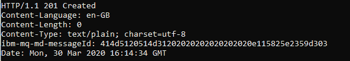
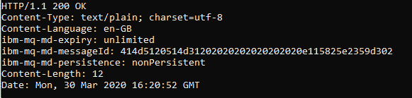
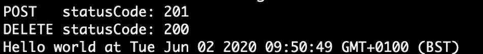

# IBM MQ 消息传递 REST API 入门

> 原文：[`developer.ibm.com/zh/tutorials/mq-develop-mq-rest-api/`](https://developer.ibm.com/zh/tutorials/mq-develop-mq-rest-api/)

使用 IBM MQ，您可以通过不同的接口或 API 来与服务器对象进行交互。您可能需要以架构师身份来设置某些内容，以管理员身份进行配置和维护，或者以应用程序开发者身份在连接到 MQ 服务器的应用程序中使用队列、主题和订阅。

本教程展示了如何在应用程序中使用消息传递 REST API 来与队列管理器及其对象进行交互。

MQ 提供了许多 API，可供用不同语言编写的应用程序使用。单击并浏览“语言”、“连接格式”和“API”幻灯片，以获取有关它们如何连接的信息。消息队列接口（简称 MQI）是一种接口，允许应用程序对 MQ 对象进行最全面的访问。

消息传递 REST API 当前提供了一个用于与队列进行交互的更基本的接口，以便您可以快速轻松地开始使用该 API。

## 前提条件

*   [Curl](https://curl.haxx.se/)
*   Go 运行时
*   Node.js 运行时

## 步骤

1.  设置队列管理器
2.  配置 mqweb 服务器
3.  将消息放入队列
4.  从队列获取消息
5.  使用 Swagger UI 来与 MQ 消息传递 REST API 进行交互

## 第 1 步：设置队列管理器

使用准备、设置和连接 IBM MQ 教程中的任何一个教程来设置队列管理器。回到这里并继续执行下一步。

## 第 2 步：配置 mqweb 服务器

转到 IBM MQ 知识中心内的[消息传递 REST API 入门](https://www.ibm.com/support/knowledgecenter/SSFKSJ_9.1.0/com.ibm.mq.dev.doc/q130950_.htm)主题，以便设置 MQ REST API。如果还需要设置 IBM MQ 控制台，查看 [IBM MQ 控制台入门](https://www.ibm.com/support/knowledgecenter/SSFKSJ_9.1.0/com.ibm.mq.adm.doc/q127580_.htm)主题。

回到这里并继续执行下一步。

## 第 3 步：将消息放入队列

您可以通过 cURL 来试用 MQ 消息传递 REST API。cURL 是用于通过 URL 传输数据的命令行工具和库。您可以在任何平台上安装 cURL。

确保已安装了 cURL：

```
curl -V 
```

MQ 消息传递 REST API 期望在用于将消息放入队列的 POST 请求中包含以下基本详细信息：

*   `-k` – 此选项允许您连接到具有自签名证书（而不是由 CA 颁发的证书）的服务器。

*   `-i` – 此选项在输出中包含响应头（可选）。

*   以下格式的 `request URL`： `https://host:port/ibmmq/rest/v1/messaging/qmgr/your_qm_name/queue/your_queue_name/message`。

    例如： `https://localhost:9443/ibmmq/rest/v1/messaging/qmgr/QM1/queue/DEV.QUEUE.1/message`。

*   `-X` – 此选项指定请求方法。

*   `-u` – 此选项是您在 mqwebuser.xml 文件中添加的用户的名称和密码。

*   `-H` – 此选项包含两个头值，分别表示消息的跨站点请求伪造令牌和内容类型。

*   `-d` – 此选项是数据或消息有效负载。

发出 cURL POST 命令以将消息放入队列：

```
curl -i -k https://localhost:9443/ibmmq/rest/v1/messaging/qmgr/QM1/queue/DEV.QUEUE.1/message -X POST -u user:password -H "ibm-mq-rest-csrf-token: blank" -H "Content-Type: text/plain;charset=utf-8" -d "Hello World!" 
```

您应该会看到如下输出：



做得好！如果输出消息与这里类似，则表明您已成功使用 cURL 将消息放入队列。看看能否使用类似的命令来使消息脱离队列。

## 第 4 步：从队列中获取消息

MQ 消息传递 REST API 期望在用于以中断的方式从队列中获取消息的 DELETE 请求中包含以下基本详细信息：

*   `-k` – 此选项允许您连接到具有自签名证书（而不是由 CA 颁发的证书）的服务器。

*   `-i` – 此选项在输出中包含响应头（可选）。

*   以下格式的 `request URL`： `https://host:port/ibmmq/rest/v1/messaging/qmgr/your_qm_name/queue/your_queue_name/message`。

    例如： `https://localhost:9443/ibmmq/rest/v1/messaging/qmgr/QM1/queue/DEV.QUEUE.1/message`。

*   `-X` – 此选项指定请求方法。

*   `-u` – 此选项是您在 mqwebuser.xml 文件中添加的用户的名称和密码。

*   `-H` – 此选项包含两个头值，分别表示消息的跨站点请求伪造令牌和内容类型。

发出 cURL DELETE 命令以中断的方式从队列中获取消息：

```
curl -i -k https://localhost:9443/ibmmq/rest/v1/messaging/qmgr/QM1/queue/DEV.QUEUE.1/message -X DELETE -u user:password -H "ibm-mq-rest-csrf-token: blank" 
```

您应该会看到如下输出：



做得好！如果输出消息与这里类似，则表明您已成功使用 cURL 从队列中获取消息。

## 第 5 步：使用 Swagger UI 来与 MQ 消息传递 REST API 进行交互

mqweb 服务器提供了用于打开“API 发现”功能的选项。

设置并运行 mqweb 服务器后，您在第 3 节中配置的 `.xml` 文件将在 `featureManager` 标签内包含以下行：

```
<featureManager>
<feature>apiDiscovery-1.0</feature>
</featureManager> 
```

您现在可以通过以下方式来使用 Swagger 文档：

*   将浏览器指向： `https://host:port/ibm/api/explorer`

    然后使用 Swagger UI 来与 REST API 进行交互。您可以通过“消息传递 REST API”来放入和获取消息，还可以在 MQ 控制台中查看队列 `DEV.QUEUE.1` 的队列深度更改。

*   将浏览器指向： `https://host:port/ibm/api/docs`

    然后检索用于描述整个 REST API 的 Swagger 2 文档。

## 探究使用 REST API 的样本应用程序

您可以探究以下示例：

*   Go 示例
*   使用 HTTPS 模块的 Node.js 示例
*   使用 Promise 模块的 Node.js 示例

对于以上三个样本应用程序，确保在 IBM Cloud 中正在运行应用程序要与之通信的队列管理器。在 IBM Cloud 中运行的队列管理器的默认 SSL HTTP 端口为 9443。用户可以指定其他端口，但如果没有可用端口，则将使用默认端口。

### 使用 MQ 消息传递 REST API 的 Go 示例

在此示例中，PUT 和 GET 调用都包装在 Go 函数中。

队列管理器的请求 URL“qmURL”构造为包括主机、端口、消息传递 REST API 的默认路径、队列管理器名称和队列名称。

然后创建请求，设置消息类型，并添加先前在 cURL 调用中使用的其他参数；CSRF 令牌、内容类型以及用于身份验证的用户名和密码。

作为此应用程序一部分的发送方和接收方样本会将正确的 MQ 参数传递给此方法，然后才会构建并发送 REST 调用。

```
func mqRestCall(qm QueueManager, q Queue, verb string, msg Message, queryParams string) (statusCode int, body []byte, err error) {

if qm.Port == "" {
    qm.Port = "9443"
}

qmURL := "https://"+ qm.Host + ":"+ qm.Port + "/ibmmq/rest/v1/messaging/qmgr/" + qm.Name + "/queue/" + q.Name + "/message"
if queryParams != "" {
    qmURL = qmURL + queryParams
}

// allow self-signed certs.Only required in dev.
tr := &http.Transport{
    TLSClientConfig: &tls.Config{InsecureSkipVerify: true},
}
client := &http.Client{Transport: tr}

//    client := &http.Client{}
msgByteSlice := []byte(msg.Message)
req, err := http.NewRequest(verb, qmURL, bytes.NewBuffer(msgByteSlice))
if err != nil {
    fmt.Printf("Error preparing rest call.Error: %v", err)
    return statusCode, body, err
}

if msg.MsgType == "" {
    msg.MsgType = "application/json"
}
req.Header.Add("ibm-mq-rest-csrf-token", "anyvalue")
req.Header.Add("Content-Type", msg.MsgType)
req.SetBasicAuth(qm.Username, qm.Password)

resp, err := client.Do(req) 
```

### 使用 HTTPS 模块的 Node.js 示例

在这个 Node.js 示例（可在我们的 [GitHub 代码库](https://github.com/ibm-messaging/mq-dev-samples/tree/master/gettingStarted/messaging-rest)中找到）中，我们将借助基本 HTTPS 模块来放入和获取消息。

设置相应的变量以包含 HTTPS 模块、REST 调用的基本 URI、Liberty 服务器和 MQ 的用户名和密码、队列管理器名称和队列名称：

```
// Use the inbuilt HTTPS module.Though there are simplified alternatives
var https=require('https')

// All the admin REST calls start from this point
var apiBase="/ibmmq/rest/v1/"

// Who am I
var username="app"
var password="_APP_PASSWORD_"

var queue="DEV.QUEUE.1"
var qMgr ="QM1" 
```

使用 MQ 消息传递 REST API 对请求进行身份验证所需的基本详细信息来设置 GET 调用：

```
// Use basic authentication - pass userid/password on every request
// Could use alternatives with the LTPA token after a call to the /login API
var options = {
  hostname:"localhost",
  port:9443,
  method:'GET',
  headers: {
    'Authorization': 'Basic ' + new Buffer(username + ':'+ password).toString('base64'),
    'Content-Type' : 'text/plain',
// Need this header for POST operations even if it has no content
    'ibm-mq-rest-csrf-token' : ''
   }
} 
```

根据声明的变量来构造请求路径：

```
// Construct the full API path from the base for a particular request
                options.path = apiBase + "messaging/qmgr/" + qMgr + "/queue/" + queue + "/message" 
```

放入消息：

```
putMessage()

///////////////////////////////////////////////////////
function putMessage() {
  // And call the operation
  options.method = 'POST'
  var request = https.request(options,(response) => {
    console.log('POST   statusCode : ', response.statusCode);
    response.setEncoding('utf8');

    response.on('data',function(cbresponse) {
       console.log('POST response: ',cbresponse);
    });

    // Once the message has been successfully put, try to get it again
    response.on('end', function() {
        getMessage();
    });
  });

  request.on('error', function (e) {
    console.log('problem with request: ' + e);
  });

  var msg = "Hello world at " + new Date()

  request.write(msg)
  request.end();
} 
```

获取消息：

```
function getMessage() {
// Call the operation
options.method = 'DELETE'
var request = https.request(options,(response) => {
  console.log('DELETE statusCode : ', response.statusCode);
  response.setEncoding('utf8');
  response.on('data',function(cbresponse) {
     console.log('Message is <%s>',cbresponse);
  });
}); 
```

确保已安装了 Node。从包含 mq-rest-node-https.js 样本的目录中，运行以下命令：

```
node mq-rest-node-https.js 
```

您应该会看到如下输出：


### 使用 Promise 模块的 Node.js 示例

在这个 Node.js 示例（可在我们的 [GitHub 代码库](https://github.com/ibm-messaging/mq-dev-samples/tree/master/gettingStarted/messaging-rest)中找到）中，将展示如何使用 [JavaScript promise](https://developer.mozilla.org/en-US/docs/Web/JavaScript/Guide/Using_promises)，以便可以按正确的顺序使用 PUT 和 GET。

```
// Define the function to be used when putting a message.The
// function returns a Promise so it can be used in sequence
// before the retrieval.
const putMessage = function(msg) {
  return new Promise((resolve,reject) =>  {
    options.method = 'POST';

    // Create the request and aggregate any returned data
    var request = https.request(options,(response) => {
      if (response.statusCode < 200 || response.statusCode > 299) {
        var errMsg = util.format("POST failed.\nStatusCode: %d\nStatusMessage: \n",response.statusCode, response.statusMessage);
        reject(new Error(errMsg));

      } else {
        console.log('POST   statusCode: ' + response.statusCode);
      }
      var body = '';
      response.on('data',(chunk) => body +=chunk);
      response.on('end', () => resolve());
    });

    request.on('error', (error) => reject(error));
    // Send the message contents
    request.write(msg);
    request.end();
  });
};

// Define a function used to retrieve a message.Use
// a Promise to control when it's ready to print the
// contents.
const getMessage = function() {
  return new Promise((resolve,reject) => {
    options.method = 'DELETE';

    // Create the request and aggregate any returned data
    var request = https.request(options,(response) => {
      if (response.statusCode < 200 || response.statusCode > 299) {
        var errMsg = util.format("DELETE failed.\nStatusCode: %d\nStatusMessage: ",response.statusCode, response.statusMessage);
        reject(new Error(errMsg));
      } else {
        console.log('DELETE statusCode: ' + response.statusCode);
      }
      var body = ''; // The message contents
      response.on('data',(chunk) => body +=chunk);
      response.on('end', () => resolve(body));
    });
    request.on('error', (error) => reject(error));
    request.end();
  });
};

// Create message contents
var msg = "Hello world at " + new Date();

// Put the message and then try to retrieve it.Using Promises
// simplifies the flow and error handling.
putMessage(msg)
  .then(()   => getMessage())
  .then(body => console.log(body))
  .catch(err => console.error(err)); 
```

确保已安装了 Node。从包含 mq-rest-node-promise.js 样本的目录中，运行以下命令：

```
node mq-rest-node-promise.js 
```

您应该会看到如下输出：



## 后续步骤

恭喜！放入和获取消息后，您现在可以轻松使用 REST 了。

本文翻译自：[Get started with the IBM MQ messaging REST API](https://developer.ibm.com/tutorials/mq-develop-mq-rest-api/)（2020-06-23）