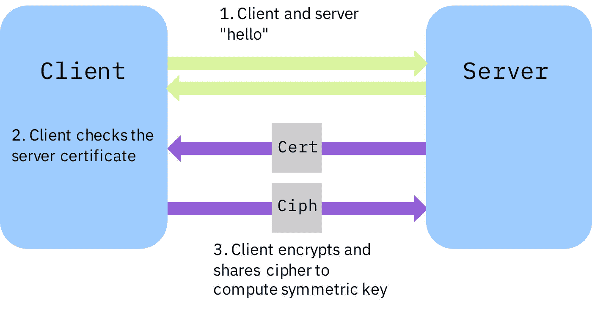
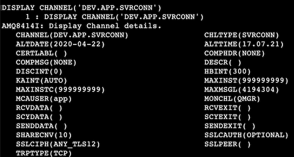
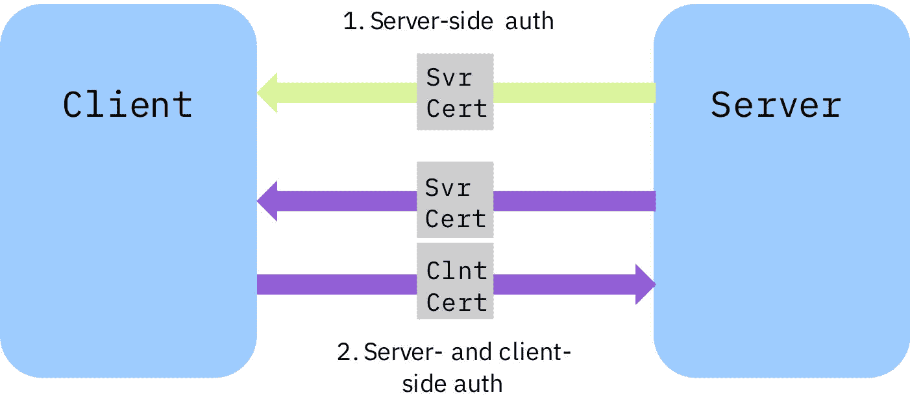
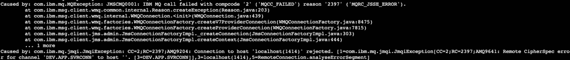
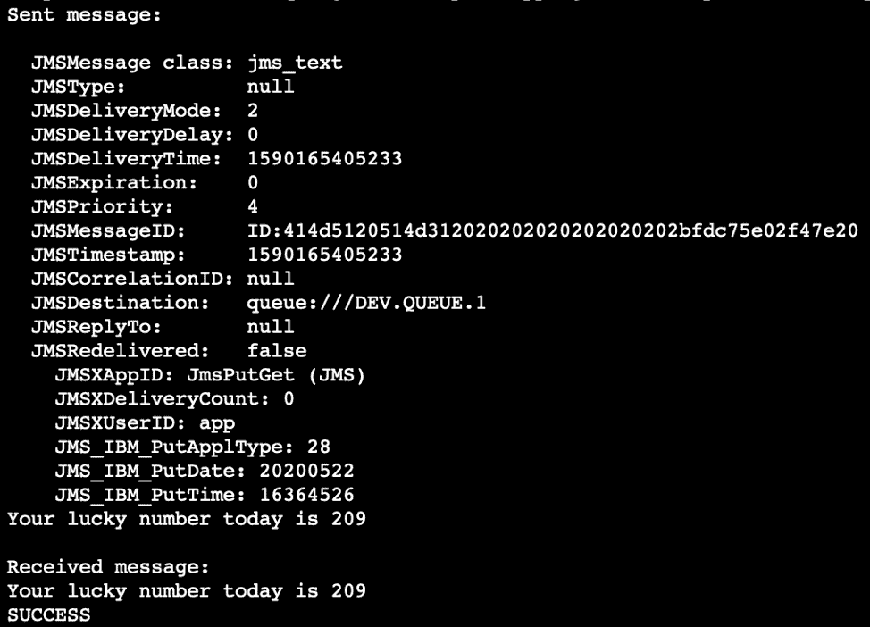

# 使用 TLS 保护 IBM MQ 端点之间的通信

> 原文：[`developer.ibm.com/zh/tutorials/mq-secure-msgs-tls/`](https://developer.ibm.com/zh/tutorials/mq-secure-msgs-tls/)

在其他教程（“准备、设置、连接 IBM MQ” 系列和“编写并运行第一个 IBM MQ JMS 应用程序”）中，我们展示了如何在 JMS 应用程序和 MQ 服务器之间设置和使用点对点消息传递。在这些教程中，客户端和服务器通过互联网进行的通信并未加密。这意味着，消息内容是使用纯文本格式传输的，并且可能被第三方查看。

本教程将帮助您开始通过对 MQ 使用传输层安全性 (TLS) 来保护传输中的消息。

值得注意的是，其他准备、设置和连接 IBM MQ 教程中使用的默认开发者配置包括针对应用程序用户和管理用户的身份验证和授权控件。

TLS 是一种密码加密协议，可用于保护传输中的数据。有关客户端和服务器之间的 TLS 握手如何工作的说明，可参阅图 1：

##### 图 1：TLS 握手



在图 1 中：

1.  服务器和客户端进行沟通以确定连接设置。
2.  客户端验证服务器证书。
3.  客户端生成一个密码，并使用服务器的公钥对其进行加密。将与服务器共享此公钥，此公钥用于生成对称密钥以加密会话的其余部分。

TLS 身份验证方法包括匿名身份验证和相互身份验证。

在本教程中，我们将设置最简单的配置，在该配置中，我们仅向服务器端提供证书。

## TLS 在 IBM MQ 中如何工作

在 MQ 中将使用 TLS 来保护通道。它提供了完整性和加密保护。为通道启用 TLS 后，该通道传递的所有消息在传输过程中都会受到保护。您可以在 [IBM MQ 文档](https://www.ibm.com/support/knowledgecenter/SSFKSJ_9.1.0/com.ibm.mq.sec.doc/q009930_.htm)中了解有关 TLS 的更多信息。

在生产环境中，队列管理器通常会具有由[证书颁发机构](https://en.wikipedia.org/wiki/Certificate_authority)颁发的数字证书。MQ 管理员应该为您提供可能要用于客户端应用程序的所有证书。

在本教程中，我们将创建一个自签名证书，并从中提取公钥以供客户端使用。使用自己的私钥对自签名证书进行签名；这表明“我值得信赖，因为我是这么说的”。不应在生产环境中使用自签名证书，但在此示例中，它有助于您理解 TLS 配置的工作方式。

为了演示基本的 MQ TLS 配置，我们将使用 IBM MQ Docker 镜像在 Docker 容器中运行 MQ 服务器。我们可以在任何需要的地方运行该服务器，但从 MQ 管理角度来讲，MQ 容器可以简化安全性的配置。您可以深入了解 [Docker Hub 中的 IBM MQ Docker 镜像](https://hub.docker.com/r/ibmcom/mq/)。

## 前提条件

*   来自 Docker Hub 的最新 MQ Docker 镜像参阅“获取用于在容器中进行开发的 IBM MQ 队列”教程。
*   [OpenSSL](https://www.openssl.org/source/)
*   JMS 或 [MQI](https://ibm.biz/mq-dev-patterns) 样本及其先决条件

## 步骤

下面是设置 TLS 所要执行的步骤：

1.  创建 TLS 对象：使用 OpenSSL 创建 TLS 对象、自签名服务器密钥和证书。然后，创建一个客户端密钥库以在客户端存储服务器证书的副本，以便客户端知道它可以信任服务器
2.  设置 MQ 服务器：启动要在为 TLS 加密消息设置的 Docker 容器中运行的 MQ 队列管理器（即，我们的服务器）
3.  保护应用程序：编辑一些样本代码，用于将加密消息发送到队列管理器

### 步骤 1：创建 TLS 对象

我们需要创建服务器密钥和证书。然后，我们需要使用 JMS 或其他 MQ 客户端库来创建客户端密钥库。

#### 创建服务器密钥和证书

为了创建要用于保护通道的证书，我们将使用 OpenSSL（大多数计算机上默认情况下已安装 OpenSSL）。通过在终端中输入以下命令来检查是否安装了 OpenSSL：

```
openssl version 
```

如果需要 OpenSSL，则需要[下载 OpenSSL](https://www.openssl.org/source/)。

在计算机上创建一个新目录，然后在终端中浏览至该目录。

现在，我们可以使用以下命令创建服务器密钥和证书：

```
openssl req -newkey rsa:2048 -nodes -keyout key.key -x509 -days 365 -out key.crt 
```

系统将提示您输入一些信息。随便输入一些内容，由于这是一个自签名证书，因此它仅供您查看。使用以下命令验证是否已成功创建证书：

```
openssl x509 -text -noout -in key.crt 
```

您应该会看到自己输入的信息以及其他证书属性（例如公钥和签名算法）。

#### 创建客户端密钥库

对于使用 JMS API 的 Java 代码以及使用 MQ 客户端库的其他语言（例如 C、Python、Node.js 或 Golang）的代码，创建客户端密钥库的说明会略有不同。

根据您的语言，按照以下步骤进行操作。

***创建 JMS 密钥库 (Java)***

在我们的示例中，我们将保护一些为 JMS 编写的 Java 代码。我们将使用 Java JRE 和 SDK 随附的 keytool（一种 Java 安全工具）。要创建 `.jks` 客户端密钥库并将服务器证书导入到其中，可输入以下命令：

```
keytool -keystore clientkey.jks -storetype jks -importcert -file key.crt -alias server-certificate 
```

系统将提示您创建一个密码。 务必记住您设置的密码，以备日后使用。

列出目录内容应该会产生如下内容：


将 `clientkey.jks` 文件移到其他目录（您需要记住）中的新文件夹中。最好是在客户端应用程序的根目录中创建一个新文件夹，并将 `.jks` 文件放在该文件夹中。

现在，当前目录中应该只包含 `.crt` 文件和 `.key` 文件。如果情况并非如此，则容器将无法正常工作！您需要返回到步骤 1 的开始处，并检查是否已完成所有任务以便将这些文件放在正确的位置。

***为基于 MQI 的客户端应用程序（C、Python、Node.js 或 Golang）创建密钥库***

如果使用的是 MQI，则无论您使用哪种语言（例如 C、Python、Node.js 或 Golang）编写应用程序，这些步骤都将帮助您创建客户端密钥库并将服务器证书导入到其中。

如果您尚未安装 MQ 客户端库，那么现在可以获取这些库：

```
* 对于 MacOS，请按照 [MQ MacOS 工具包教程](https://www.ibm.com/tutorials/mq-macos-dev)中的步骤进行操作。

* 对于 Windows 或 Linux MQ 客户端，可从 [IBM 支持站点](https://www.ibm.com/support/pages/node/712701)下载并安装 MQ 客户端库。 
```

现在，您已安装了 MQ 客户端库，可以开始安装 MQ 安全性命令行工具 `runmqakm`。输入此命令以创建 `.kdb` 格式的密钥库，并将密码存储在 `.sth` 文件中。在此示例中，我们使用了密码 `passw0rd`，但您可以将其更改为自己所选的密码。

```
runmqakm -keydb -create -db clientkey.kdb -pw [!!pick_a_passw0rd_here!!]-type pkcs12 -expire 1000 -stash 
```

我们已经生成了一个包含密钥库密码的存储文件，以简化以下步骤。如果您希望手动输入密钥库密码，可从命令中移除 `-stash` 选项，并务必记住您设置的密码！

接下来，输入以下命令以将服务器的公钥证书导入到客户端密钥库：

```
runmqakm -cert -add -label QM1.cert -db clientkey.kdb -stashed -trust enable -file key.crt 
```

如果列出当前目录的内容，则您应该会看到以下文件：


将 `clientkey.kdb` 和 `clientkey.sth` 文件移到其他目录（您需要记住）中的新文件夹中。最好是在客户端应用程序的根目录中创建一个新文件夹，并将这些文件放在该文件夹中。

现在，当前目录中应该只包含 `.crt` 文件和 `.key` 文件。如果情况并非如此，则容器将无法正常工作！您需要返回到步骤 1 的开始处，并检查是否已完成所有任务以便将这些文件放在正确的位置。

### 步骤 2：设置 MQ 服务器

设置 MQ 服务器的第一步是安装或启动 Docker。

如果您已完成了“获取用于在容器中进行开发的 IBM MQ 队列”教程，则已在步骤 1 中安装了 Docker，并且已在步骤 2 中在 Docker 镜像中安装了 MQ。 如果您尚未完成该教程，请现在完成该教程中的步骤 1 和步骤 2。

现在，您可以从最新的 MQ Docker 镜像中运行容器。 如果您已完成了“获取用于在容器中进行开发的 IBM MQ 队列”教程，则需要使用 `docker stop <container_id>` 命令来停止此容器，否则需要选择其他端口来映射到主机 OS。

要运行最新的 MQ Docker 镜像，可在终端中输入以下命令，以指定包含 `.key` 和 `.crt` 文件的目录的完整路径。在此示例中，我们使用了应用程序用户的密码 `passw0rd`，但您应指定之前使用的密码。

```
docker run --name mqtls --env LICENSE=accept --env MQ_QMGR_NAME=QM1 --volume [!!path to directory with key and crt files!!]:/etc/mqm/pki/keys/mykey --publish 1414:1414 --publish 9443:9443 --detach --env MQ_APP_PASSWORD=passw0rd ibmcom/mq:latest 
```

输入以下命令来查看容器 ID：

```
docker ps 
```

您应该会看到如下输出:


务必记下您的容器 ID，因为以后会用到。

#### 如果您的容器未运行…

一个常见问题是没有对 key.key 文件设置正确的读许可权。由于此文件的用户和组所有者不太可能存在于容器中，并且取决于您的 umask 设置，因此我们需要检查此文件在容器中是否可读。

查看容器的 docker 日志：

```
docker logs <container_id> 
```

如果无法读取密钥文件，则您会看到如下错误：


然后，可以使用 `chmod` 命令来更改文件许可权：

```
chmod o+r <path_to_key_file>/key.key 
```

#### 验证是否已启用安全性

我们来看看队列管理器，检查是否已启用安全性。使用以下命令以在容器中执行：

```
docker exec -it <container_id> bash 
```

然后，输入以下命令：

```
runmqsc QM1 
```

此命令允许您将 MQSC 接口用于队列管理器。输入以下命令以查找有关通道属性的信息：

```
DISPLAY CHANNEL(DEV.APP.SVRCONN) 
```

您将看到如下输出：



我们看到，已经将 `SSLCIPH` 选项配置为使用 `ANY_TLS12` CipherSpec。设置 `SSLCIPH` 选项后，针对所有使用此通道与队列管理器建立的连接都开启 TLS 加密。将 CipherSpec 设置为 `ANY_TLS12` 可以完全按照您的期望工作：该通道允许那些使用有效 TLS 1.2 CipherSpec 的连接。阅读[本社区文章中的 ANY_TLS12 CipherSpec](https://community.ibm.com/community/user/imwuc/viewdocument/allow-ibm-mq-channels-to-use-any-tl?CommunityKey=b382f2ab-42f1-4932-aa8b-8786ca722d55) 以了解详情。

在本教程中，我们将使用匿名（仅服务器）身份验证，因为我们将使用应用程序名称和密码对客户端进行身份验证。`CERTLABL` 选项是我们在上面的 Docker 运行步骤中隐式提供的证书的标签。

##### 图 2：TLS 身份验证方法



在图 2 中：

1.  匿名身份验证：服务器向客户端提供证书。
2.  相互身份验证：服务器和客户端均提供证书并相互进行身份验证。

我们将需要在客户端上指定相同的 CipherSpec，这样客户端和服务器才能进行连接并执行 TLS 握手。

使用 `exit` 命令退出 MQSC 接口，然后同样使用 `exit` 命令退出容器。

### 步骤 3：保护应用程序

对于 JMS 应用程序和 MQI 客户端应用程序（例如 C、Python、Node.js 或 Golang），有关保护应用程序的说明会略有不同。根据您的语言，按照以下步骤进行操作。

#### 保护并运行 JMS 应用程序 (Java)

##### 启动并运行 JMS 应用程序

首先，按照“编写并运行第一个 IBM MQ JMS 应用程序”中的步骤来启动并运行 JMS 样本应用程序 `JmsPutGet.java`。确保您已根据启用了 TLS 的新容器的详细信息来设置了主机名和端口号。

##### 在不加密的情况下运行 JMS 应用程序

我们来看看，在客户端上不加密的情况下试图连接到队列管理器时会发生什么。

从顶级应用程序目录（如果遵循了 JMS 教程，则为 MQClient），使用以下命令来编译该应用程序：

```
javac -cp ./com.ibm.mq.allclient-9.1.5.0.jar:./javax.jms-api-2.0.1.jar com/ibm/mq/samples/jms/JmsPutGet.java 
```

然后使用以下命令来运行该应用程序：

```
java -cp ./com.ibm.mq.allclient-9.1.5.0.jar:./javax.jms-api-2.0.1.jar:. com.ibm.mq.samples.jms.JmsPutGet 
```

该连接将被队列管理器拒绝，并出现大量错误。您将看到 MQRC_JSSE_ERROR 以及通道 DEV.APP.SVRCONN 的远程 CipherSpec 错误，因为我们没有在客户端上指定加密密码。堆栈将包含如下部分：



如果因其他错误而失败，可尝试使用方便的备忘单来帮助您调试错误。

##### 加密 JMS 应用程序

我们来向客户端应用程序添加加密功能。我们将选择与 ANY_TLS12 兼容的特定 CipherSpec，但也可以将规范设置为 `*TLS12`。编辑 `JmsPutGet.java` 样本，在其他连接工厂属性下添加以下行：

```
cf.setStringProperty(WMQConstants.WMQ_SSL_CIPHER_SUITE, "TLS_RSA_WITH_AES_128_CBC_SHA256"); 
```

按如上所示进行编译。在运行时，可使用此命令（包括某些环境变量的设置）。在运行该命令之前，您需要对其进行编辑，以添加信任库的标准名称及其密码。

```
java -Djavax.net.ssl.trustStoreType=jks -Djavax.net.ssl.trustStore=/your_key_directory/clientkey.jks -Djavax.net.ssl.trustStorePassword= -Dcom.ibm.mq.cfg.useIBMCipherMappings=false -cp ./com.ibm.mq.allclient-9.1.4.0.jar:./javax.jms-api-2.0.1.jar:. com.ibm.mq.samples.jms.JmsPutGet 
```

大功告成！您将看到如下内容：



注意：由于使用的是非 IBM JRE，因此 run 命令中的 `-Dcom.ibm.mq.cfg.useIBMCipherMappings=false` 参数是必需的。如果要使用 IBM JRE，则只需移除此参数即可。

#### 保护和运行 MQI 应用程序（C、Python、Node.js 或 Golang）{: #secure-and-run-an-mqi-application-c-python-node-js-or-golang}

在本教程中，我们将仅显示用下面这种语言编写的示例：[Python](https://www.python.org/)。有关保护其他语言的高质量样本代码，可查看[此处](https://github.com/ibm-messaging/mq-dev-patterns)。假定您已经安装了 Python，并且您处在一个便于开发 MQ 应用程序的 Python 环境中。

##### 启动并运行 Python 应用程序

MQ 客户端功能是通过 [PyMQI](https://dsuch.github.io/pymqi/) 用 Python 语言实现的，PyMQI 是 MQ 客户端上的开源 Python 包装器。安装很简单，只需在终端中输入以下命令即可：

```
pip install pymqi 
```

我们来试图连接到加密通道并使用未加密的 Python 程序来发送消息。复制这个（简单的）Python 程序（用于将消息放入队列中，然后从队列中获取消息），并将其保存为 `.py` 文件：

```
import pymqi

queue_manager = 'QM1'
queue_name = 'DEV.QUEUE.1'
message = 'Hello from Python!'

cd = pymqi.CD()
cd.ChannelName = 'DEV.APP.SVRCONN'
cd.ConnectionName = 'localhost(1414)'
cd.ChannelType = pymqi.CMQC.MQCHT_CLNTCONN
cd.TransportType = pymqi.CMQC.MQXPT_TCP

qmgr = pymqi.QueueManager(None)
qmgr.connect_with_options(queue_manager, user='app', password='[!!password for user "app"!!]', cd=cd)

put_queue = pymqi.Queue(qmgr, queue_name)
put_queue.put(message)

get_queue = pymqi.Queue(qmgr, queue_name)
print(get_queue.get())

put_queue.close()
get_queue.close()

qmgr.disconnect() 
```

##### 在不加密的情况下运行 Python 应用程序

现在，我们有了 Python 应用程序，可以使用以下命令来运行该应用程序：

```
python [!!name you gave the program!!] 
```

该连接将被队列管理器拒绝，并且您将在返回的输出中看到一条错误消息：


这是因为未加密的 Python 应用程序试图连接到加密通道，从而引发了上面的错误。

##### 加密 Python 应用程序

我们来向客户端应用程序添加加密功能。我们将选择与 ANY_TLS12 兼容的特定 CipherSpec，但也可以将规范设置为 `ANY_TLS12`。在 `cd.TransportType = pymqi.CMQC.MQXPT_TCP` 行后面，添加以下行：

```
cd.SSLCipherSpec = 'TLS_RSA_WITH_AES_128_CBC_SHA256'
sco = pymqi.SCO()
sco.KeyRepository = '[!!your_keystore_location here!!]'# include file name but not file extension 
```

如下所示，将 `sco` 变量添加到 `connect_with_options` 函数中：

```
qmgr.connect_with_options(queue_manager, user='app', password='[!!password for user "app"!!]', cd=cd, sco=sco) 
```

再次运行该应用程序，您应该会看到：


## 结束语及后续步骤

恭喜！您已为 MQ 配置了基本 TLS，因此队列管理器和客户端应用程序现在可以对其在互联网上的通信进行加密。您使用 OpenSSL 为队列管理器创建了自签名数字证书。这样，客户端和服务器就可以协商共享密钥以加密其会话。

现在，您应该了解在结合使用 TLS 与 MQ 时需要在 MQ 服务器和客户端应用程序端上配置的内容。您已经让客户端和服务器能够使用自签名证书进行私密且安全的通信。在将应用程序投入生产之前，记住要升级到实际证书！

要查看启用了加密和日志记录的生产型样本，可访问我们的 [IBM Messaging GitHub 代码库](https://github.com/ibm-messaging/mq-dev-patterns)。

本文翻译自：[Secure communication between IBM MQ endpoints with TLS](https://developer.ibm.com/tutorials/mq-secure-msgs-tls/)（2020-07-20）