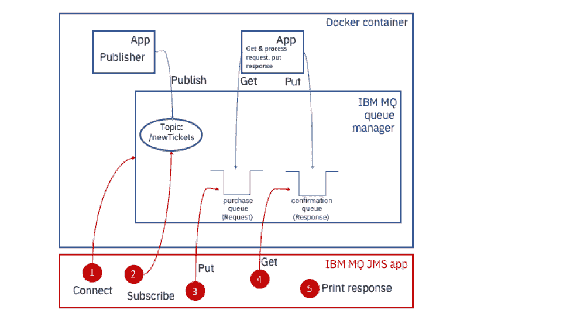
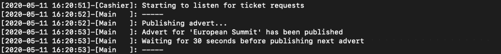
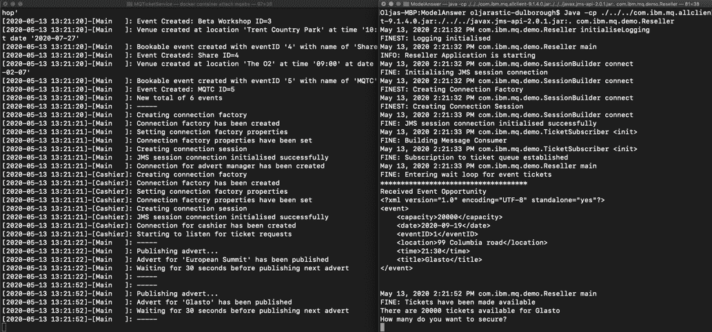

# 接受 IBM MQ 消息传递应用程序编程挑战

> 原文：[`developer.ibm.com/zh/tutorials/mq-badge-mq-dev-challenge/`](https://developer.ibm.com/zh/tutorials/mq-badge-mq-dev-challenge/)

##### 学习路径：IBM MQ Developer Essentials 徽章

本教程是 IBM MQ Developer Essentials 学习路径和徽章的一部分。

*   IBM MQ 基础知识
*   使用 MQ on Containers、MQ on Cloud、MQ on Ubuntu 或 MQ on Windows 来启动并运行队列管理器。
*   准备使用 Java 编程
*   接受消息传递编程挑战（本教程）
*   调试应用程序或环境

深入了解实际的消息传递解决方案可以多么简单。

按照分步说明开发一个消息传递应用程序，使之与在容器中提供的队列管理器和应用程序进行交互。在此过程中，您将掌握一些新的消息传递概念和技能，以便能够通过测验并获得 IBM MQ Developer Essentials 徽章。

## 前提条件

要完成此挑战赛，您的本地环境中需要具备以下项：

*   Java Development Kit (JDK)，用于开发和运行应用程序
*   JMS 类，位于 `JMS.jar` 文件中
*   适用于 JMS 的 IBM 和 IBM MQ 类，位于 `com.ibm.mq.allclient.jar` 文件中
*   `JmsPutGet.java` 样本
*   适用于此 MQ 开发者挑战赛的样本代码，位于 `mq-dev-badge-sample` 中

## 挑战赛

恭喜！（假设）您刚刚开启了新的职业，担任会议门票经销商的开发者。

您的团队负责人给您安排的任务是：创建一个新的消息传递应用程序，以与 MQ 会议预订服务集成并自动执行门票分配流程。这可确保您的新组织与客户需求保持同步。 我们已构建了活动预订服务（包括队列管理器），并将其作为 Docker 镜像提供。您只需构建并运行该镜像即可。

然后，为了这次挑战赛，您将编写一个经销商应用程序。我们在 GitHub 中提供了一个 Java 应用程序模板，其中包含注释和代码存根。您只需通过编写场景中的 JMS 和消息处理部分来填补空白即可。

您的代码将执行以下操作：

*   **连接**到队列管理器（即我们提供的队列管理器）
*   **订阅** `newTickets` 主题
*   **发送**一个 `request message` 以批量购票，**设置**一个 `reply-to destination` 并将 `message expiry` 设置为 15 分钟（我们不希望无限期地提交购票请求）
*   从指定为 `reply-to destination` 的确认队列中**获取** `response message`
*   **输出**结果

如果您遇到了无法解决的问题，我们提供了一张备忘单并打包了 [ModelAnswer](https://github.com/ibm-messaging/mq-dev-badge-sample/tree/master/ModelAnswer/com/ibm/mq/demo) 以供参考。

您可使用以下三种方式来应对挑战：

1.  立即自行编写代码
2.  查看 ModelAnswer 应用程序
3.  尝试修复一个简单缺陷

## 客户端应用程序的消息传递服务架构

当有门票可供出售时，第三方服务会生成一条经销商消息来通知其订阅者（也就是您！）。

然后，门票经销商会请求获取会议活动的一批门票。在分配门票后，经销商可以自由地将门票分发给其客户。

我们来看一下架构图。您将构建经销商应用程序。


活动预订服务 *每 30 秒* 在 `newTickets` 主题上发布一次消息。

消息有效负载包含 `EventId` 和可预定门票数。

经销商应用程序会使用所接收的有效负载来构造请求消息。 最后，预订服务会处理购买队列中的请求，并使用有效负载集来响应 `JMSReplyTo` 目标（确认队列）中的每条消息，如下所示：

`Accepted - <number_of_tickets_allocated>` 或者 `Rejected - Sold out`

### 重点介绍您要创建的客户端消息传递应用程序

您正在创建门票经销商应用程序，这是一个 IBM MQ 客户端应用程序。

为了帮助您专注于 MVP（最小可行产品），此图展示了您要创建的 IBM MQ JMS 应用的各个元素，这些元素与我们在 Docker 容器中提供的 MQ 服务器以及经销商服务有关。其中已对主要客户端应用程序操作进行了命名和编号。



在完成应用程序编码后，该应用程序将执行以下操作：

1.  连接到队列管理器
2.  订阅主题
    *   接收发布
    *   处理发布
    *   收到发布后，构造一条请求消息并将其发送到购买队列，以购买零张或更多张门票。请求消息具有以下属性：
        *   表示所需门票数
        *   表示给定的 `EventID`
        *   设置 `reply-to destination` 作为确认（响应）队列
        *   将 `message expiry` 设置为 15 分钟
3.  将请求消息放入购买（请求）队列
    *   （购票协调器应用程序会从此队列中获取消息）
    *   （处理消息并分配一定数量的门票（如果有））
    *   （将消息放入确认（响应）队列中。）响应消息具有以下属性：
        *   表示分配的门票数（如果有）
        *   对于给定的 `EventID`
4.  从响应队列中获取消息
5.  输出已购买的活动门票数

客户端消息传递应用程序需要具备以下行为：

*   每 30 秒在 `newTickets` 主题上发布一次消息。
*   提供提示来询问用户要购买的门票数。
*   处理会议活动预订服务在处理请求消息后提供的响应。
*   将响应结果输出到 `stdout`。

## 检查前提条件

首先来检查您是否安装了 Java Development Kit。 发出以下命令：

```
java -version 
```

您应该会看到如下输出：


您将需要 JDK 8（即 `1.8.n_nnn`）。

如果尚未安装 Java，转到 [OpenJDK](https://adoptopenjdk.net/installation.html) 页面，选择 OpenJDK 8 和您的平台。在某些平台上，您可以使用命令行来提取并安装 OpenJDK 8。确保您获取了用于开发的 JDK (Java Development Kit)，而不仅仅是 JRE（Java 运行时环境）。

如果您完成了开发点到点 JMS 应用程序教程，那么应该已经具有 JDK (Java Development Kit) 以及含有 `com.ibm.mq.allclient.jar` 和 `javax.jms-api-2.0.1.jar` 文件的 MQClient 目录。您将需要这些 `.jar` 文件来运行挑战赛应用程序。如果您具有 JDK 并且在 MQClient 目录中具有这些 `.jar` 文件，则可以跳到下一步“获取挑战赛代码”。

如果您尚未完成该教程，则可以进行以下设置：

1.  创建 MQClient 目录来保存样本所需的文件，例如在您的主目录中：

    ```
     mkdir MQClient 
    ```

2.  切换到 `MQClient` 目录，并使用以下 `curl` 命令来提取 `com.ibm.mq.allclient.jar` 文件。

    ```
     curl -o com.ibm.mq.allclient-9.1.4.0.jar https://repo1.maven.org/maven2/com/ibm/mq/com.ibm.mq.allclient/9.1.4.0/com.ibm.mq.allclient-9.1.4.0.jar 
    ```

3.  从 `MQClient` 文件夹中，使用以下 `curl` 命令来提取 JMS `.jar` 文件。

    ```
     curl -o javax.jms-api-2.0.1.jar https://repo1.maven.org/maven2/javax/jms/javax.jms-api/2.0.1/javax.jms-api-2.0.1.jar 
    ```

## 获取挑战赛代码

您需要下载徽章挑战赛代码，该代码存储在 [ibm/messaging/mq-dev-badge-sample](https://github.com/ibm-messaging/mq-dev-badge-sample) Github 代码库中。

转到 Github 中的 [ibm/messaging/mq-dev-badge-sample](https://github.com/ibm-messaging/mq-dev-badge-sample) 代码库，然后单击克隆或下载按钮。您可以选择对代码执行 “Clone with SSH”、“Use HTTPS” 或 “Download ZIP” 操作。将代码库克隆或解压缩到 MQClient 目录中。

1.  将代码存储在本地后，切换到样本代码目录：

    `cd mq-dev-badge-sample`

2.  运行 print-working-directory 命令以确保您处于正确的位置：

    `pwd`

    您应该会看到该路径的结尾为：

    `~/MQClient/mq-dev-badge-sample`

3.  输入 ls 以列出该目录的内容：

    `ls`

    您应该会看到以下目录和文件：

    `├-- MQTicketService │ ├-- Dockerfile │ . │ . │ └-- TicketGenerator ├-- ModelAnswer ├-- ModelAnswerWithDefectToFix └-- TicketReseller`

`MQTicketService` 目录中包含 `Dockerfile` 文件，此文件定义了如何构建镜像并通过 MQ 服务器（队列管理器）来建立容器。此目录还包含 `TicketGenerator`，后者包含应用程序/服务的代码，在您编写并运行应用程序时这些应用程序/服务将与该应用程序进行交互。服务器端应用程序与队列管理器同时在容器内启动。

## 使活动预订系统正常运行

在开始编写经销商应用程序之前，我们来看一下服务器端或活动预订服务的工作原理。

首先，我们将构建一个 Docker 镜像，并利用容器运行 MQ 和相关应用程序（用于发布门票可用情况并响应来自您的应用程序的请求）。

在看到该服务正常运行后，将其终止，并在准备好测试挑战赛应用程序后将其重新启动。

执行以下步骤来运行活动预订服务：

1.  从 mq-dev-badge-sample 目录中切换到 MQTicketService 目录：

    ```
     cd MQTicketService 
    ```

2.  此位置中的 `Dockerfile` 定义了在容器内运行 MQ 以及运行发布者应用程序和响应应用程序所需的全部设置。运行以下命令来构建镜像：

    ```
     docker build .-t mqbadge:latest 
    ```

3.  Docker 将提取所有必备软件并构建镜像。完成后，检查是否构建了镜像 `mqbadge`：

    ```
     docker images 
    ```

    您将看到： 

4.  从镜像中运行容器：

    ```
     docker run -e LICENSE=accept -e MQ_QMGR_NAME=QM1 -e LOG_FORMAT=json -e MQ_APP_PASSWORD=passw0rd -p 1414:1414 -p 9443:9443 -ti --name mqebs mqbadge:latest 
    ```

    您很快就会看到从命令行启动的容器的输出。您应该会看到将要发布的活动： 

活动预订系统现在正在容器内运行。注意，容器是在未使用 `--detach` 选项的情况下启动的，因此在容器运行时，屏幕上会显示日志。

容器进程包括：

*   **发布者应用程序**，每 30 秒发布一次可用门票数
*   **购票协调器**，处理购买请求并分配一批门票。
    **重要提示：** 这是活动预订业务的核心，它可以处理购买请求并分配门票。在会议活动处理代码中，IBM MQ Messaging 的作用至关重要，它可以在会议活动预订服务和门票经销商之间安全地传递重要消息。会议活动预订业务必须做到这一点，因为售票过多或未能响应请求都会损害其声誉。
*   **IBM MQ 服务器**，它是队列管理器，其托管了**订阅主题** `newTickets`、用于请求消息的**购买队列**以及用于响应消息的**确认队列**。

通过在 Docker 容器启动时运行 [MQSC 命令](https://www.ibm.com/support/knowledgecenter/en/SSFKSJ_9.1.0/com.ibm.mq.ref.adm.doc/q083460_.htm)，以管理方式创建队列。 也可以通过 MQ 控制台、使用 [MQ REST 接口](https://www.ibm.com/support/knowledgecenter/en/SSFKSJ_9.1.0/com.ibm.mq.adm.doc/q127600_.htm)或以编程方式创建队列对象。

现在，您可以开始开发经销商应用程序了。首先，我们来看一下 ModelAnswer 应用程序如何与活动预订服务一起使用。

## 运行 ModelAnswer 应用程序以查看其实际运行效果

打开另一个终端，然后切换到 `MQClient/mq-dev-badge-sample/ModelAnswer` 目录。

从该目录中运行以下命令来编译该应用程序：

`javac -cp ../../com.ibm.mq.allclient-9.1.4.0.jar:../../javax.jms-api-2.0.1.jar com/ibm/mq/demo/*.java`

仅当 `MQClient` 目录中包含 `.jar` 文件时，此命令才能正常运行。参阅检查您的前提条件和获取挑战赛代码部分，以确保正确设置了您的代码。

通过查看以下文件来检查是否正确编译了该应用程序：

```
`ls com/ibm/mq/demo` 
```

您应该会看到已编译的类以及 Java 文件：


返回到原始终端窗口，其中包含该服务的容器已停止。

使两个终端窗口并排排列，以便您可以轻松地与之交互。


在左侧的 Docker 容器终端中，您需要重新启动容器并查看服务器和正在运行的应用程序的输出。启动容器：

```
```
docker restart mqebs
``` 
```

在终端中获取容器的输出：

```
```
docker container attach mqebs
``` 
```

在右侧的终端中，准备使用以下命令来运行 ModelAnswer 应用程序，但等到服务器终端中开始出现活动时再输入该命令：

```
```
java -cp ../../com.ibm.mq.allclient-9.1.4.0.jar:../../javax.jms-api-2.0.1.jar:. com.ibm.mq.demo.Reseller
``` 
```


现在，当运行命令来启动 ModelAnswer 应用程序时，您应该会看到：


在发布下一组可用门票后，您应该会在 ModelAnswer 终端中看到提示，询问您要购买的门票数：



输入要在 ModelAnswer 应用程序终端中保留的门票数。 您应该会在两个终端中看到交换消息。


一旦没有其他要发布的门票活动，该容器就会退出。


在您输入最后一个推广活动的门票数后，ModelAnswer 应用程序才会退出。然后，您应该会看到该应用程序断开连接，因为容器中的应用程序也断开了连接，并且 MQ 队列管理器停止了线程并关闭了连接。


现在，您已经了解了应用程序和服务之间的交互方式，继续在 `TicketReseller` 目录中编写自己的 Java 代码，或者修复缺陷并使 `ModelAnswerWithDefectToFix` 目录中的内容正常运行。

## 编写经销商应用程序

为了方便起见，您可能需要使用 Java IDE，例如 [Eclipse](https://www.eclipse.org/downloads/)。另外，您可以在喜欢的编辑器（例如 [Atom](https://atom.io/)）中开发代码。

在您选择的编辑器中，打开 TicketReseller 或 ModelAnswerWithDefectToFix 目录。

样本代码分为多个类。为了完成这次挑战赛，您需要对以下类进行代码更新：

*   `SessionBuilder.java`
*   `TicketSubscriber.java`
*   `TicketRequester.java`

这些类的存根中的注释将指导您完成所需操作。有关您的应用程序需要实现的功能、编译方面的帮助以及应用程序工作方式的示例，参阅前面的部分。

### 是否需要调试？

出问题了吗？查看备忘单。

## 增强应用程序

要了解有关可用于生产环境的客户端消息传递应用程序的更多信息，您需要考虑安全性和消息持久性。您可能还需要考虑消息的事务性。

### 为何要使用消息传递？

会议活动系统与经销商应用程序已进行了松散耦合。通过异步消息传递，可以集成这些组件并构建缓冲区或减震器。如果组件断开连接、失败或吞吐量出现波动，则消息传递层将会处理任何不稳定情况。这样就简化了我们的应用程序代码，因为消息传递层会负责处理诸如安全性、恢复和组件间消息交换持久性等难题。

消息传递 API 提供了一个框架，可在传递消息时驱动经销商应用程序逻辑，而不是不断轮询服务器来检查工作。这可以消除网络与会议活动应用程序之间不必要的负载。IBM MQ 允许解决方案随需求增长进行扩展。

#### 发布/订阅消息传递类型

发布/订阅是 IBM MQ 实现的一种消息传递类型。另一种消息传递类型是点到点。在点到点消息传递中，将在两个应用程序之间交换消息。在发布/订阅消息传递中，一个或多个发布者可以向某一主题的一个或多个订阅者发布内容。

下面介绍了如何在解决方案中实现发布/订阅消息传递类型： 

活动预订服务是发布者，而经销商应用程序是其中一个订阅者。下面来讨论这种消息传递类型中的其他组件：

*   主题是对象，并且具有属性。
*   主题的关键属性是主题字符串。
*   消息由发布者发布到主题字符串。
*   每个发布都指向一个主题字符串。订阅者可注册感兴趣的内容或订阅主题字符串。
*   当发布者将消息发布到主题字符串时，该主题字符串的一个或多个订阅者会收到发布消息。
*   在点到点方案中，JMS 应用程序可以使用 JMS 目标对象，该对象按照与使用目标映射到队列的方式来映射到主题。要将发布成功发送给订阅者，发布者和订阅者都必须与同一主题字符串匹配。订阅者仅在订阅主题后才能获取发布。
*   如果某个发布是在创建特定应用程序的订阅之前发送的，则该应用程序将无法获取该发布。

#### 请求/响应消息传递模式

请求响应或请求回复是一种集成或消息传递模式，在这种模式中，将消息发送到另一个应用程序的应用程序需要来自接收方应用程序的某种回复。它通常基于点到点消息传递类型，可以是同步的（发送方应用程序等待响应直至超时）和异步的（也称为“请求/回调”，此时发送方应用程序将断开连接，但设置了回调来处理回复）。

经销商应用程序即是发送方应用程序，活动预订服务即是接收方应用程序。 

发送方应用程序通常会设置一个回复目标地址和一个关联 ID，以便可以将响应返回给正确的发送方应用程序。

对于活动预订服务，已在队列管理器上通过管理方式定义了回复目标地址。但是，请求者可以从其 JMS 会话中动态创建一个临时目标以完成交换。

### 保护应用程序

了解如何配置队列管理器和客户端应用程序，以便在服务器与客户端之间通过 Internet 传输消息时使用 TLS 加密消息。

### 在应用程序中设置消息持久性

在设计应用程序时，务必考虑消息持久性。IBM MQ 支持持久和非持久的消息传递。在活动预订场景中，我们在预定义的 MQ 队列上使用持久消息传递作为默认设置。

很重要的一点是，如果系统中断，那么在恢复后，非持久消息可能会丢失。尽管在大多数情况下非持久消息传递可能会加快消息交换的速度，但它不一定适用于所有应用程序。

例如，对于重要消息，持久性可能很重要，但如果持续传输的是参考性消息，则持久性就不那么重要了。在后一种情况下，系统设计可能会容忍一定程度的消息丢失。

您可以在 IBM MQ Knowledge Center 中阅读有关[消息持久性](https://www.ibm.com/support/knowledgecenter/SSFKSJ_9.0.0/com.ibm.mq.dev.doc/q023070_.htm)的更多信息。

### 消息的事务性如何？

通常，生产应用程序要比我们的样本更复杂，每次交互都涉及多个资源（例如消息或数据库更新），而这些资源将通过单个原子操作进行协调。以这种方式管理的资源将出现在一个工作单元或事务中。

例如，一笔简单的银行交易可能需要在一个帐户中存入 100 美元，并从另一个帐户中扣除相同金额。 事务性协调器用于确保两个操作都成功完成，或者都没有完成。

随着应用程序复杂性的增加，将使用企业级框架来协调多个应用程序或后端系统之间的事务。企业级框架有很多，例如，由以下项提供的框架：

*   [Open Liberty](https://openliberty.io/)（一个 IBM 开源项目）
*   [IBM WebSphere Application Server](https://www.ibm.com/cn-zh/cloud/websphere-application-platform)
*   [Spring](https://spring.io/)

### 关注应用程序性能

如果您想确保应用程序能够正常运行，查看开发者最佳实践。

## 结束语及后续步骤

恭喜！您已查看了我们的 [GitHub 代码库](https://github.com/ibm-messaging/mq-dev-badge-sample)，并通过三种方式使用了样本。确保您已查看了 MQ 备忘单，因为其中包含了每位 MQ 开发者都应该注意的一些事项。

如果您已完成所有工作并准备参加测验来获得 MQ Developer Essentials 徽章，返回到 IBM MQ Developer Essentials 徽章页面，然后点击进入测验！

本文翻译自：[Take the IBM MQ messaging app coding challenge](https://developer.ibm.com/tutorials/mq-badge-mq-dev-challenge/)（2020-06-23）