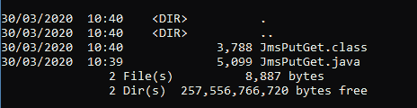
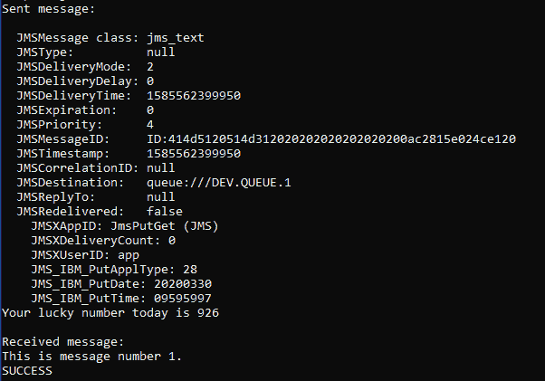

# 编写并运行第一个 IBM MQ JMS 应用程序

> 原文：[`developer.ibm.com/zh/tutorials/mq-develop-mq-jms/`](https://developer.ibm.com/zh/tutorials/mq-develop-mq-jms/)

##### 学习路径：IBM MQ Developer Essentials 徽章

本文是 IBM MQ Developer Essentials 学习路径和徽章的一部分。

*   IBM MQ 基础知识
*   使用 MQ on Containers、MQ on Cloud、MQ on Ubuntu 或 MQ on Windows 来启动并运行队列管理器。
*   准备使用 Java 编程（本教程）

*   接受消息传递编程挑战
*   调试应用程序或环境

JMS 表示 [Java 消息服务](https://download.oracle.com/otndocs/jcp/jms-2_0-fr-eval-spec/index.html)。JMS 是用于定义如何从 Java 程序访问企业消息传递系统的标准。JMS API 由消息传递服务提供者（如 IBM MQ）实现，可允许 JMS 客户端应用程序访问提供者的消息传递服务。

在本教程中，您会将用于保存数据的消息放入队列中，而使用者应用程序会从队列中获取该消息。您将使用 JMS API 连接到消息传递提供者，在此例中为 IBM MQ。

## 前提条件

*   [Java Software Development Kit (JDK)](https://developer.ibm.com/javasdk/downloads/sdk8/)（用于开发和运行应用程序）
*   JMS 类（位于 [JMS.jar 文件](https://repo1.maven.org/maven2/javax/jms/javax.jms-api/2.0.1/javax.jms-api-2.0.1.jar)中）
*   适用于 JMS 的 IBM 和 IBM MQ 类（位于 [com.ibm.mq.allclient.jar 文件](https://ibm.biz/mq-jms-allclient-jar)中）
*   [JmsPutGet.java 样本](https://ibm.biz/learn-mq-jms-sample)

## 使用 JMS 和 IBM MQ 开发点到点应用程序

您的应用程序必须能够执行以下操作：

*   连接到队列管理器
*   打开队列
*   放入消息
*   获取消息
*   关闭队列
*   断开与队列管理器的连接

我们假定已在要连接到的 MQ 服务器上设置了以下 MQ 对象：

*   队列管理器 QM1
*   队列 DEV.QUEUE.1
*   通道 DEV.APP.SVRCONN
*   端口 1414

如果您要使用自己的对象，则需要相应地调整这些名称。或者，您可以转到“准备、设置和连接 IBM MQ” 教程来完成入门学习。

如果您已完成了“准备、设置和连接 IBM MQ” 教程，则应该已经正确配置了队列管理器。如果您还没有完成该教程，则需要在队列管理器上设置授权，以便能够通过指定的通道接受来自应用程序的连接，并且必须授权应用程序在队列中放入和获取消息。

如果您已经有一个 JMS 应用程序，但是需要一些性能或调试方面的帮助，查看本文。

## 设置环境

在第一步中，我们将引导您安装和设置必备软件。

1.  创建一个目录来保存样本所需的文件，例如在您的主目录中：

    ```
     mkdir MQClient 
    ```

2.  从 `MQClient` 文件夹中，使用以下 `curl` 命令下载 `com.ibm.mq.allclient.jar` 文件。

    ```
     curl -o com.ibm.mq.allclient-9.1.4.0.jar https://repo1.maven.org/maven2/com/ibm/mq/com.ibm.mq.allclient/9.1.4.0/com.ibm.mq.allclient-9.1.4.0.jar 
    ```

3.  从 `MQClient` 文件夹中，使用以下 `curl` 命令下载 JMS API 文件。

    ```
     curl -o javax.jms-api-2.0.1.jar https://repo1.maven.org/maven2/javax/jms/javax.jms-api/2.0.1/javax.jms-api-2.0.1.jar 
    ```

4.  如果您还没有 Java JDK V8，则可以从[此处](https://developer.ibm.com/javasdk/downloads/sdk8/)进行下载。选择适合您平台的正确下载项并进行安装。

## 下载点到点 JMS 样本应用程序

我们来从 GitHub 中获取样本，将其保存在本地计算机上，然后查看其中的一些关键 JMS 构造，您可以在这些构造中添加主机、端口、通道和队列详细信息，以便可以将该样本连接到队列管理器。

1.  在 `MQClient` 目录中，创建以下目录结构： `com/ibm/mq/samples/jms`。

    在 Windows 上：

    ```
     mkdir -p com\ibm\mq\samples\jms 
    ```

    在 Linux 上：

    ```
     mkdir -p com/ibm/mq/samples/jms 
    ```

2.  从 `MQClient/com/ibm/mq/samples/jms` 目录中，使用以下 `curl` 命令从 GitHub 下载 JmsPutGet.java 样本：

    ```
     curl -o JmsPutGet.java https://raw.githubusercontent.com/ibm-messaging/mq-dev-samples/master/gettingStarted/jms/JmsPutGet.java 
    ```

3.  编辑 `JMSPutGet.java` 文件。替换主机、端口和应用程序密码变量，以与您的队列管理器配置相匹配。

    ```
     // Create variables for the connection to MQ
     private static final String HOST = "_YOUR_HOSTNAME_"; // Host name or IP address
     private static final int PORT = 1414; // Listener port for your queue manager
     private static final String CHANNEL = "DEV.APP.SVRCONN"; // Channel name
     private static final String QMGR = "QM1"; // Queue manager name
     private static final String APP_USER = "app"; // User name that application uses to connect to MQ
     private static final String APP_PASSWORD = "_APP_PASSWORD_"; // Password that the application uses to connect to MQ
     private static final String QUEUE_NAME = "DEV.QUEUE.1"; // Queue that the application uses to put and get messages to and from 
    ```

您现在应该能够编译并运行该应用程序。

## 编译并运行 JMS 应用程序

在这里，您最终将应用程序连接到队列管理器，并在队列中放入和获取消息。

要编译该样本，转到 MQClient 目录。

使用 javac 编译该应用程序。

1.  在 `MQClient` 目录中，使用 `javac` 编译该应用程序。

    在 Windows 上：

    ```
     javac -cp .\com.ibm.mq.allclient-9.1.4.0.jar;.\javax.jms-api-2.0.1.jar com\ibm\mq\samples\jms\JmsPutGet.java 
    ```

    在 Linux 上：

    ```
     javac -cp ./com.ibm.mq.allclient-9.1.4.0.jar:./javax.jms-api-2.0.1.jar com/ibm/mq/samples/jms/JmsPutGet.java 
    ```

    要确认已编译该样本，运行以下命令之一。 现在，除了 `.java` 文件外，您应该还会看到一个 `.class` 文件。

    在 Windows 上，运行 `dir` 命令：

    ```
     dir com\ibm\mq\samples\jms\ 
    ```

    在 Linux 上，运行 `ls` 命令：

    ```
     ls -l com/ibm/mq/samples/jms/ 
    ```

    现在，除了 `.java` 文件外，您应该还会看到一个 `.class` 文件： 

2.  运行该应用程序。

    在 Windows 上：

    ```
     java -cp .\com.ibm.mq.allclient-9.1.4.0.jar;.\javax.jms-api-2.0.1.jar;. com.ibm.mq.samples.jms.JmsPutGet 
    ```

    在 Linux 上：

    ```
     java -cp ./com.ibm.mq.allclient-9.1.4.0.jar:./javax.jms-api-2.0.1.jar:. com.ibm.mq.samples.jms.JmsPutGet 
    ```

    您应该会看到如下输出：



### 后续步骤

恭喜！您已编辑并编译了第一个 JMS 应用程序，向 IBM MQ 队列发送了一条消息，并从队列中获取了该消息。您还相应地设置了环境，使其具备使用 JMS 和 IBM MQ 进行开发所需要的一切。

您已经基本了解了要使用 JMS 应用程序中的对象在 MQ 服务器端实现怎样的目标以及 JMS 如何帮助您实现这一目标。

如果您想要确保 JMS 应用程序正常运行，查看本文。

本文翻译自：[Write and run your first IBM MQ JMS application](https://developer.ibm.com/tutorials/mq-develop-mq-jms/)（2020-06-23）