# 使用 Watson OpenScale 监控模型偏移

> 原文：[`developer.ibm.com/zh/tutorials/monitoring-model-drift-with-watson-openscale/`](https://developer.ibm.com/zh/tutorials/monitoring-model-drift-with-watson-openscale/)

使用注入 AI 的[现代银行贷款](https://developer.ibm.com/zh/articles/modernizing-your-bank-loan-department)应用程序进行有关批准或拒绝贷款的预测可以显著减少银行贷款代理人的工作。然而，假如结果存在争议，那么代理人有责任解释导致这些结果的原因。

假设一位客户向银行申请贷款，但贷款申请被拒绝。客户自然会联系在银行工作的贷款代表，要求解释原因并了解结果是否公平。经过初步分析后，贷款代表会将分析结果传递给 IT 部门以进行详细分析。之后，将这个贷款申请发送给开发初始模型的数据科学家。

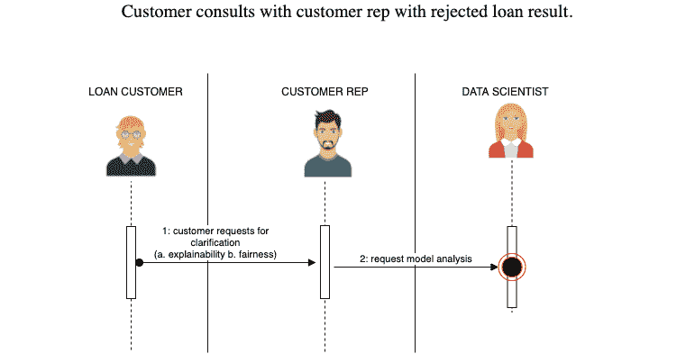

经过初步分析和重新检查模型参数之后，寻找答案的数据科学家试图确定此模型发生了哪些变化。正如您在[本教程](https://developer.ibm.com/tutorials/infuse-a-loan-department-platform-with-ai)中所看到的，机器学习模型是在 IBM® Watson™ Studio 中使用 Jupyter Notebook 构建，并使用 Watson Machine Learning 进行部署。为了分析模型的行为，数据科学家将此模型设置为需要由 Watson OpenScale 监控。Watson OpenScale 是 IBM Cloud Pak® for Data 中提供的一项服务，类似于 Watson Studio 和 Watson Machine Learning。

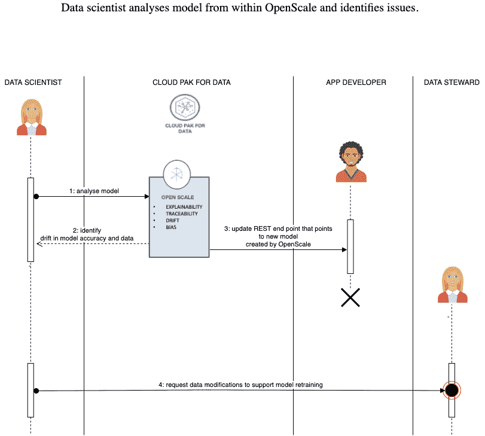

Watson OpenScale 包含用于分析质量、公平性、可解释性和偏移的监控器。在本教程中，您将学习如何配置一个偏移监控器，以检测模型何时准确性下降或何时开始收到与训练方式不一致的数据。

## 偏移监控

在机器学习生命周期中，偏移是指模型性能随时间推移而发生变化。通过模型处理的预测数据会影响模型的准确性，还会影响使用该模型的业务流程。Watson OpenScale 能够分析事务，以检测模型准确性的偏移以及数据的偏移。

*   如果类似模型没有正确评估训练数据这样的事务数量增加，就会导致模型准确性发生偏移。
*   数据偏移可以预估运行时的数据与训练时的数据特征的一致性下降。

确定偏移是模型内的潜在问题后，您有两种选择：

1.  联系可以重新部署应用程序的开发者，将其指向由 Watson OpenScale 生成的新模型的新 REST 端点。

2.  联系数据专员，修改支持重新训练模型的数据。

# 使用 Watson OpenScale 监控偏移入门

## 验证 Watson OpenScale 设置

1.  启动浏览器并浏览至 IBM Cloud Pak for Data 部署。

    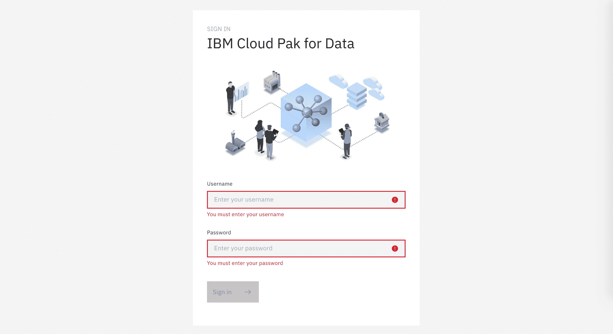

2.  单击右上角的 **services** 图标。

    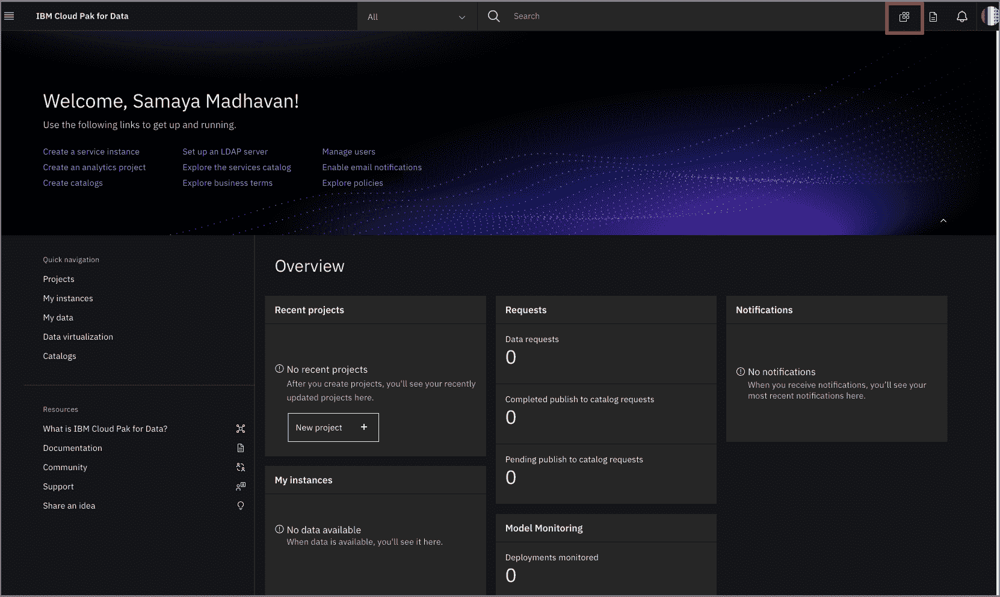

3.  查看 Watson OpenScale 磁贴，确保上面显示了 Enabled 标签。

    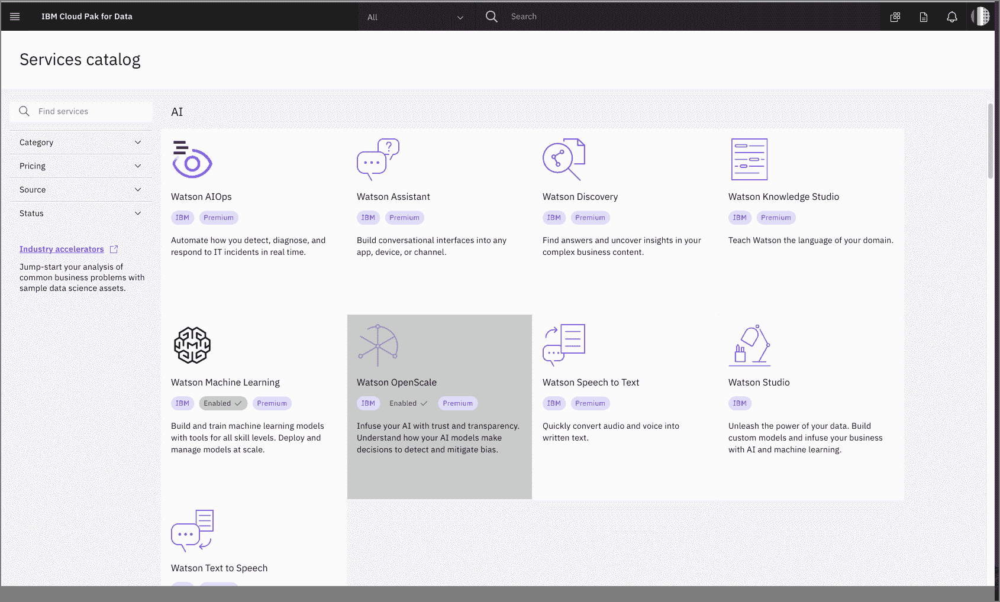

可通过多种方式配置 Watson OpenScale 来监控机器学习模型。此外，您还可以使用自动设置快速进行设置。在本教程中，我将通过 Jupyter Notebook 中的 Python API 来配置偏移监控器。

**注意**：在通过 Jupyter Notebook 继续进行设置时，请保持此浏览器窗口处于打开状态，因为在运行单元时需要分析仪表板上的变化。

## 创建项目和部署空间

### 创建一个新项目

IBM Cloud Pak for Data 使用项目来收集和整理资源。您的项目资源可能包括数据、合作者以及诸如 Notebook 和模型之类的分析资产。

1.  单击左侧菜单中的 **Projects**。

    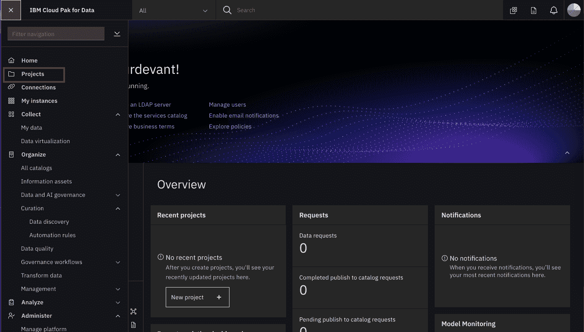

2.  单击 **New project +**。

    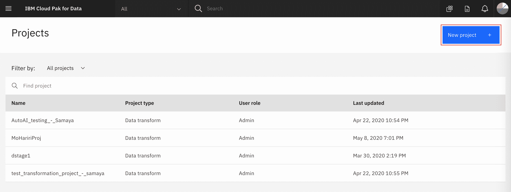

3.  对于项目类型，选择 **Analytics project**，然后单击 **Next**。

    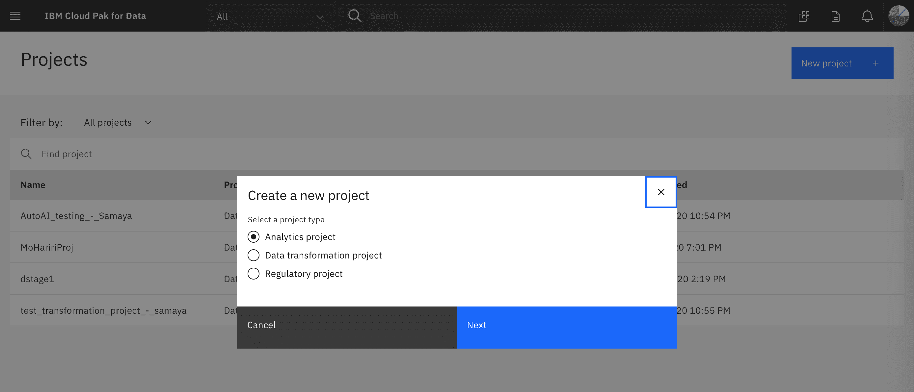

4.  选择 **Create an empty project**。

    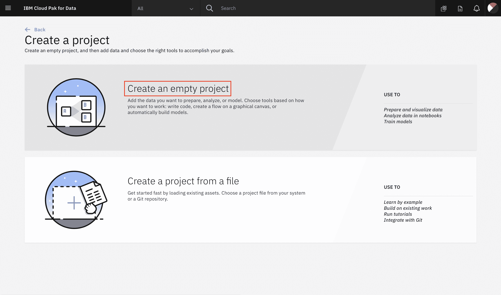

5.  为项目命名，然后单击 **Create**。

    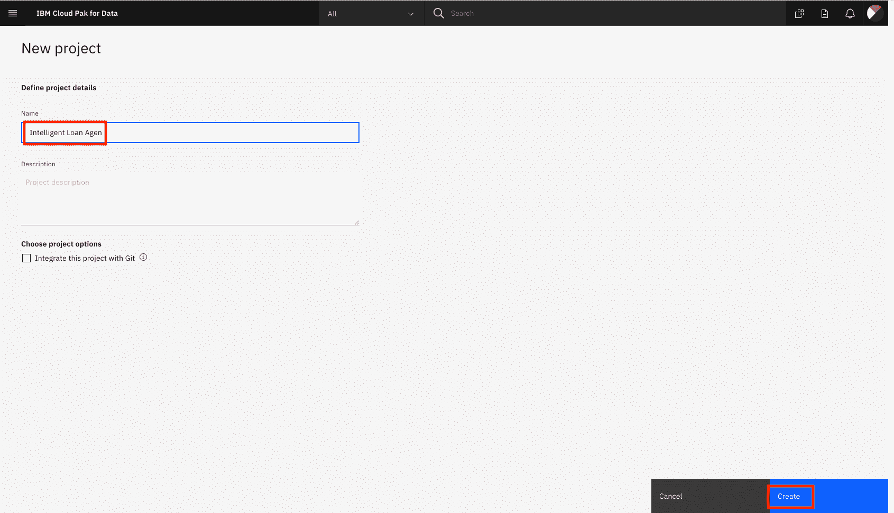

### 创建部署空间

IBM Cloud Pak for Data 使用部署空间来配置和管理一组相关可部署资产的部署。这些资产可以是数据文件、机器学习模型等等。

1.  单击 **Analyze**，然后从左侧菜单中选择 **Analytics deployments**。

    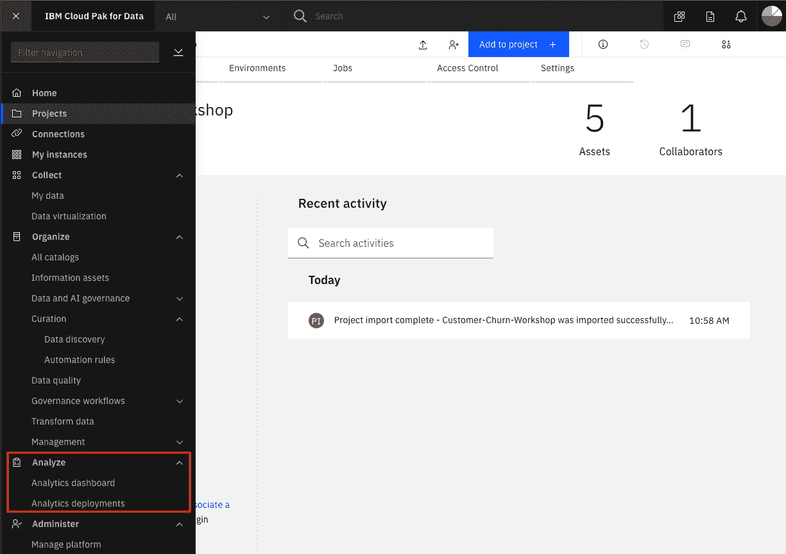

2.  单击 **New deployment space +**。

    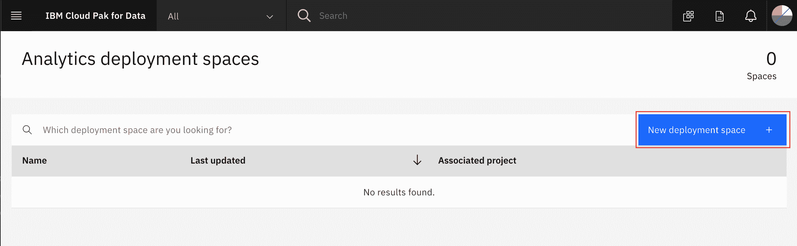

3.  选择 **Create an empty space**。

    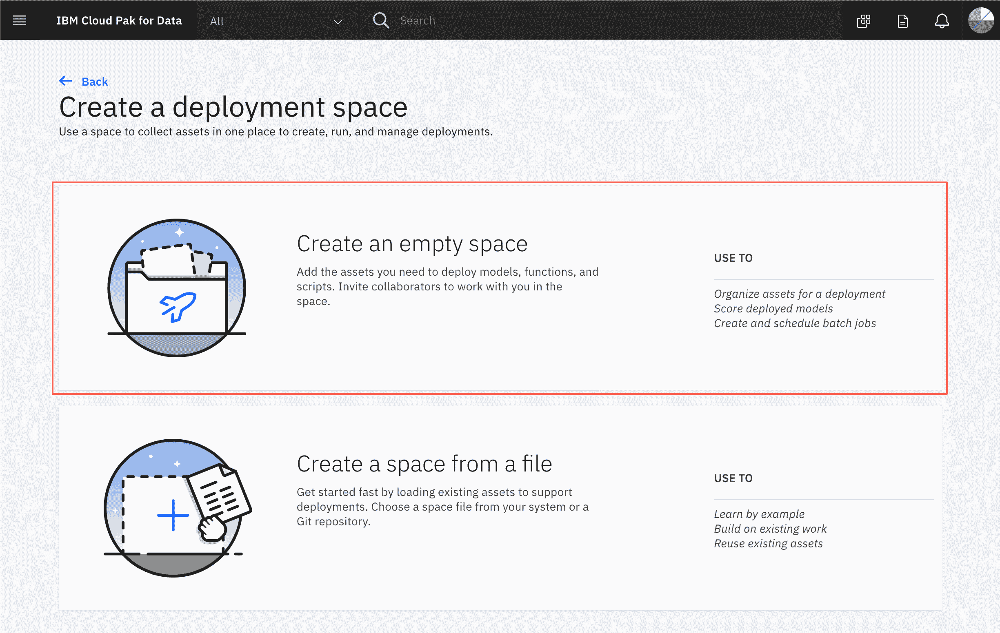

4.  为部署空间提供唯一名称和可选的描述，然后单击 **Create**。稍后部署机器学习模型时将使用此空间。

    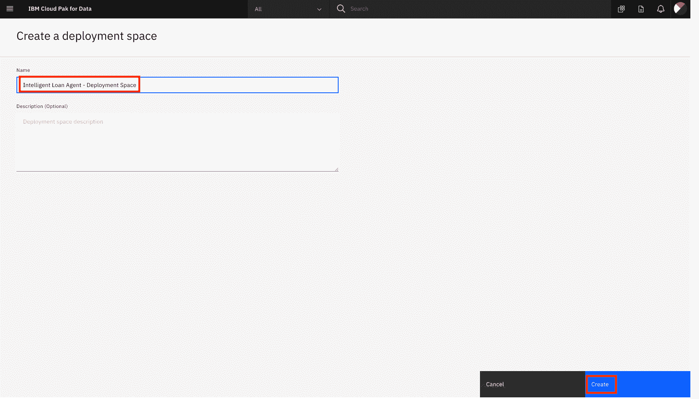

## 使用 Jupyter Notebook 设置偏移监控器

### 加载该 Notebook

您将使用 [ConfigureOpenScale-Drift.ipynb](https://github.com/IBM/cpd-intelligent-loan-agent-assets/blob/master/notebooks/phase3-watson-openscale/ConfigureOpenScale-Drift.ipynb) Notebook。您还可以查看该 Notebook 的副本，[其中包含运行完所有单元后保存的结果](https://github.com/IBM/cpd-intelligent-loan-agent-assets/blob/master/examples/phase3-watson-openscale/ConfigureOpenScale-Drift.ipynb)。

1.  在项目概述页面中，单击 **Add to project +** 以启动 Choose asset type 窗口。

    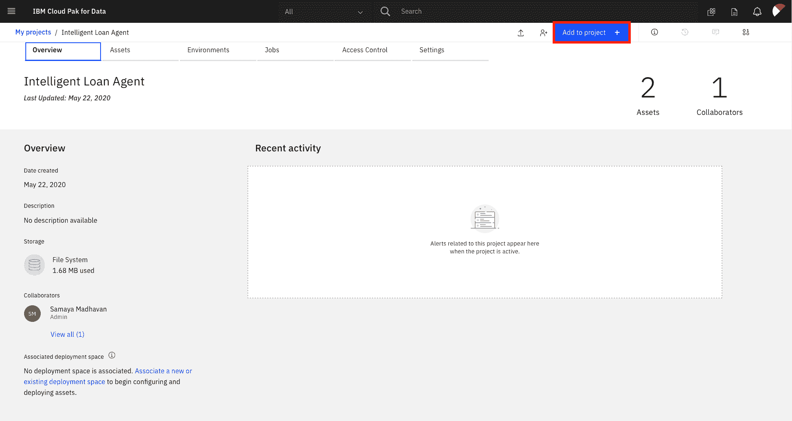

2.  从选项中选择 **Notebook**，然后切换到 **From file** 选项卡。

    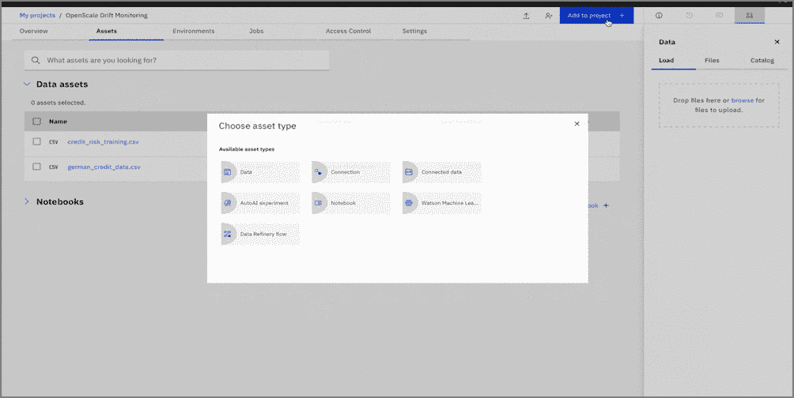

3.  单击 **Drag and drop files here or upload**，上传 **ConfigureOpenScale-Drift** notebook，然后单击 **Create notebook**。这将加载 Jupyter Notebook。

### 运行该 Notebook

Notebook 由文本（markdown 或 heading）单元和代码单元组成。markdown 单元提供有关代码设计功能的注释。

您可以单独运行这些单元，方法是首先突出显示每个单元，然后单击 Notebook 顶部的 **Run** 按钮，也可以使用键盘快捷键来运行单元（Shift + Enter，但不同平台可能有所不同）。

单元在运行时，单元左侧将显示星号 (`[*]`)。该单元运行结束后，将显示序列号（例如，`[17]`）。

**注意**：Notebook 中的某些注释是修改代码特定部分的指示信息。在运行单元之前，请按照指示执行所有更改。

#### 加载和准备数据集

加载完 Jupyter Notebook 并且内核准备就绪后，就可以开始运行该 Notebook。单击铅笔图标以运行或编辑该 Notebook。

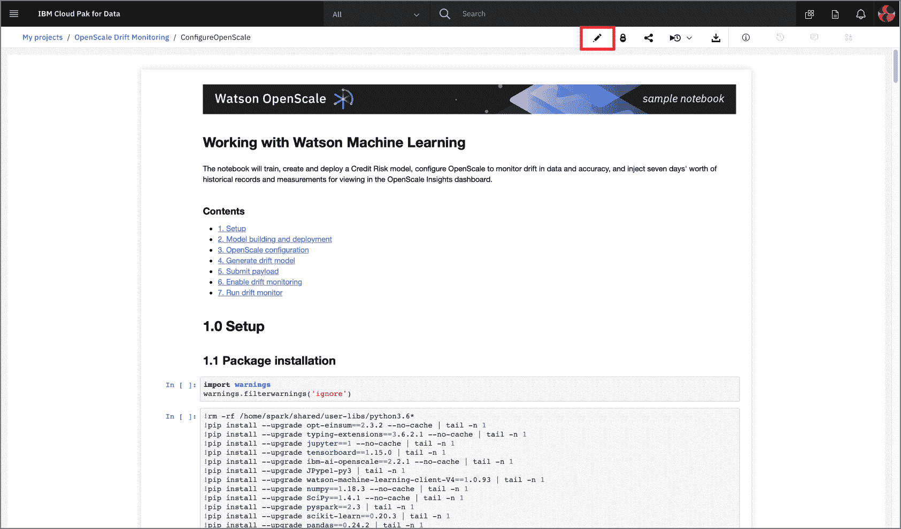

Package installation 章节将安装在 Notebook 中要用到的一些库（许多库在 IBM Cloud Pak for Data 上已经预先安装）。

#### 模型构建和部署

Notebook 的这一节将加载数据集，构建分类模型，然后使用 Watson Machine Learning 部署模型。

执行完本节中的所有单元之后，最后一步是在 Watson Machine Learning 中将模型部署为 RESTful Web 服务。

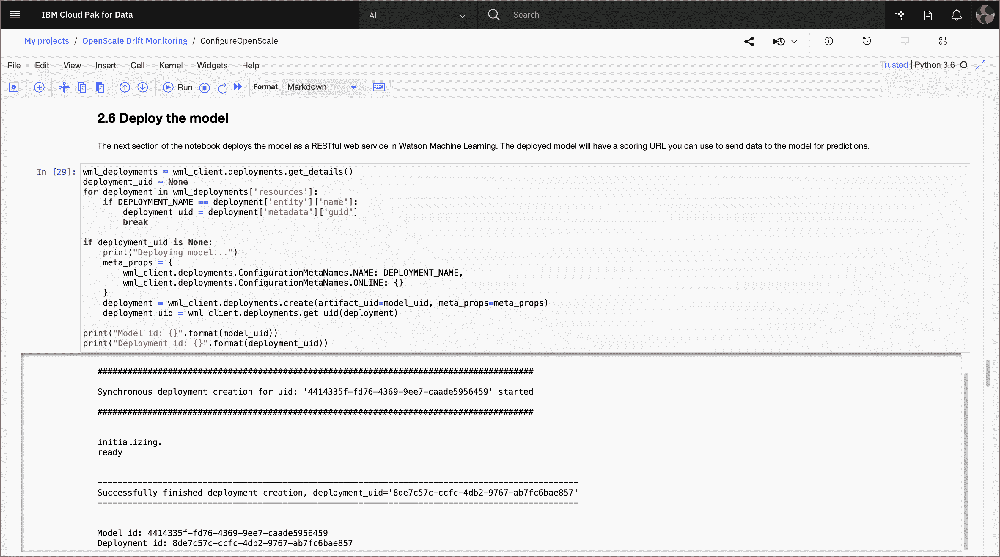

#### 配置 Watson OpenScale

在此步骤中，首先需要导入库，以便设置 Python Watson OpenScale 客户端。

在执行以下操作之前，关联数据集市以保存提交到模型的训练和反馈数据：

1.  创建订阅，通过 Python 代码获取 Watson OpenScale 监控器的句柄。

    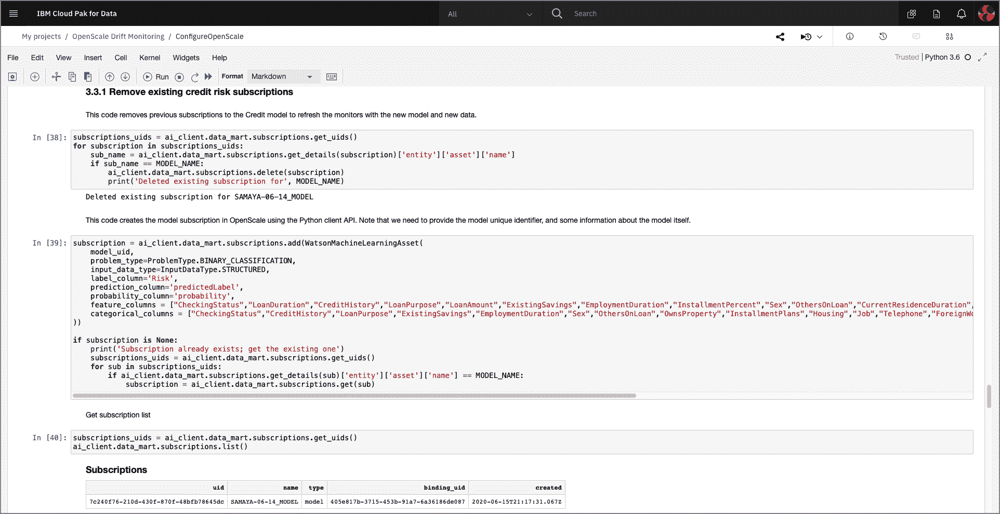

2.  切换到启动 Watson OpenScale 仪表板的窗口，您将看到在 Model Monitors 仪表板下创建的磁贴。

    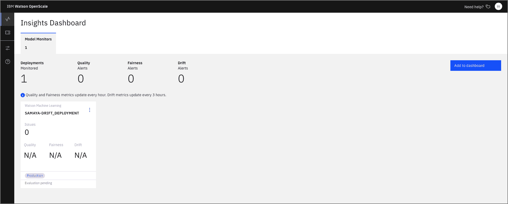

3.  单击部署磁贴以打开 **Evaluations** 视图。请注意，目前尚未配置任何监控器。不过，在运行 Notebook 单元时，将会启用偏移监控器。

    

    **注意**： 部署的名称就是您在 Notebook 中为 `CUSTOM_NAME` 变量设置的值。

    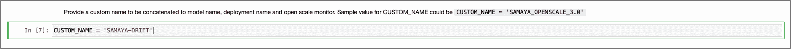

#### 生成偏移模型

要启用偏移监控，您必须创建一个模型，使用有效负载来评估模型是否正在发生偏移。

在此 Notebook 中，我使用 Watson OpenScale DriftTrainer API 生成了一个基于 Watson Machine Learning 的偏移模型。

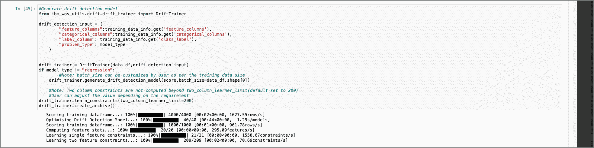

您可以选择导入先前创建的模型来继续学习本教程。

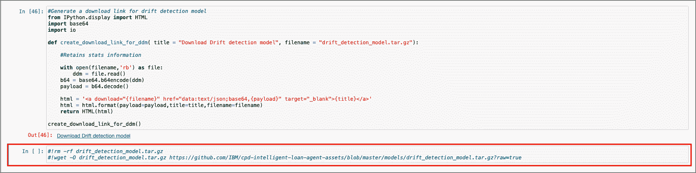

#### 提交有效负载

在绑定 Watson Machine Learning 服务并创建订阅之后，您必须先向模型发送请求，然后才能配置 Watson OpenScale。这样一来，Watson OpenScale 就可以使用正确的模式在数据集市中创建有效负载日志，以便捕获进出模型的数据。

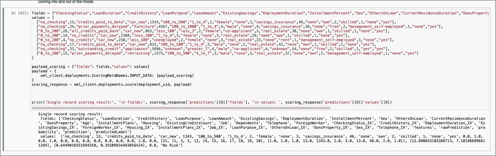

#### 启用偏移监控

1.  运行以下单元，通过 API 来启用偏移监控。

    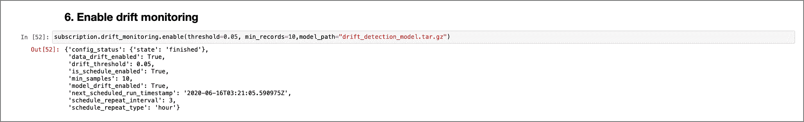

2.  切换到 Watson OpenScale 仪表板窗口，从部署磁贴中单击 **three dots icon**，然后选择 **Configure monitors**。

    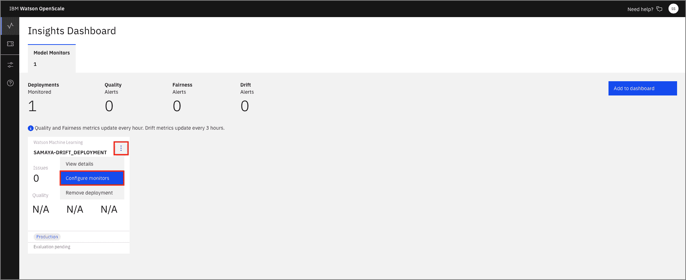

**注意**：Drift 监控器已启用，且旁边标记了一个对勾。Drift threshold 和 Sample size 为在前面显示的 Python 代码中设置的值。

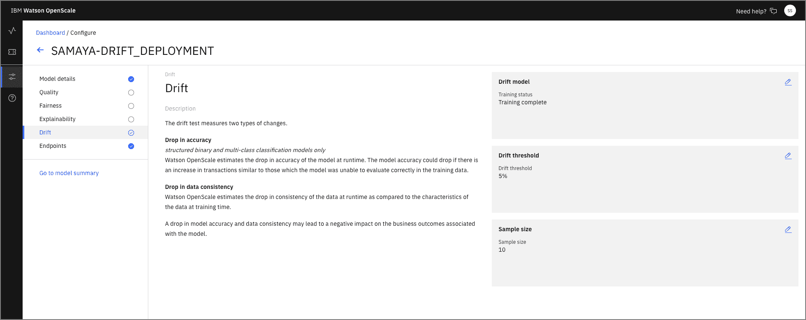

#### 运行偏移监控器

在默认情况下，偏移监控器每 3 小时针对在此时间段内提交的数据运行一次。不过，您也可以通过前面创建的监控器订阅来调用该监控器，如以下代码所示。

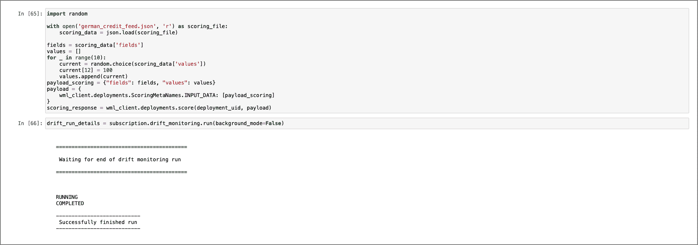

**注意**：确保在运行结束后停止 Notebook 内核，以便节省资源。为此，请转至项目的 Asset 页面，针对正在运行的 Notebook 选择 Action 列下的三点图标，然后从 Actions 菜单中选择 **Stop Kernel**。如果您在该 Notebook 上看到一个锁定图标，请单击该图标以解锁该 Notebook，然后才能停止内核。

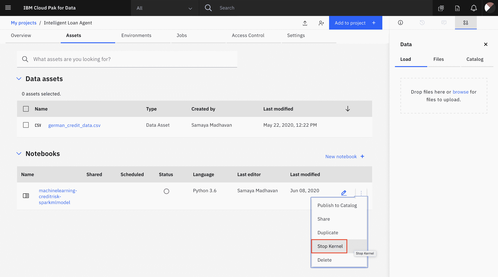

现在，您已经完成了执行此 Notebook 的所有操作。

## 使用 Watson OpenScale GUI 分析模型偏移

现在，您已经创建了机器学习模型且配置了 Watson OpenScale，您可以使用 Watson OpenScale 仪表板来监控该模型。

偏移监控器扫描发送到模型部署的请求（即有效负载），确保模型非常可靠，不会随时间推移而发生偏移。模型预测出现偏移的原因有两种，要么是发送到模型的请求类似于训练数据中模型难以处理的样本，要么是请求与模型最初使用的训练数据不一致。

1.  刷新 Insights 仪表板页面，在 **Model Monitors** 选项卡下，您将看到一个偏移警报。通过这次运行，该部署确定模型中的偏移为 35%。

    

2.  单击部署磁贴，然后选择左侧面板上的 **Drop in accuracy** 选项以显示模型偏移可视化界面。

    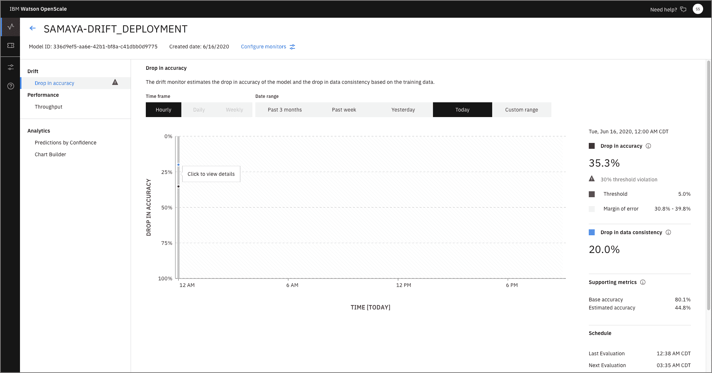

    您会看到，该模型的准确性估计下降了 35.3%，数据一致性估计下降了 20%。这意味着事务数据（评分请求）与训练数据相比不一致。

3.  单击 **Drop in accuracy** 图中的数据点（上图中的一条蓝线）以查看偏移详细信息。

    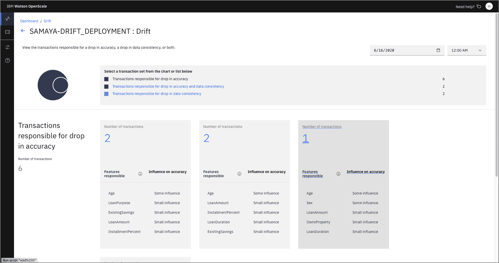

在这里，您可以浏览导致准确性偏移和数据一致性偏移的事务。

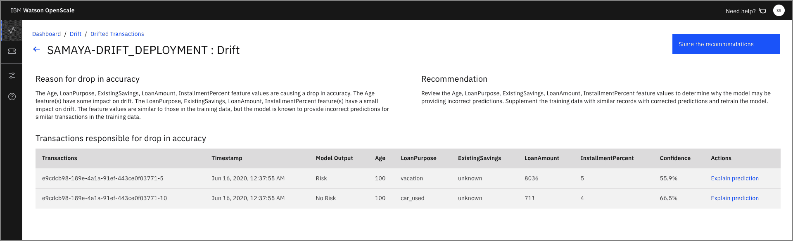

**注意**：前面的图像与您在仪表板上看到的图像可能并不完全一样。这些监控器正在使用发送到模型的有效负载（评分请求），这些有效负载为随机选择结果。

在某些情况下，您可能不会看到模型偏移导致的准确性下降。如果在仪表板上看不到任何内容，您始终可以向模型提交一组新的请求，以便再次触发偏移评估。

如果需要浏览事务，系统可能需要一些时间才能生成事务解释，因为 Watson OpenScale 会向已部署的模型发出多个请求。只有结构化数据支持偏移，而回归模型仅支持数据偏移。

## 结束语

本教程解释了如何配置一个偏移监控器，以检测模型何时准确性下降或何时开始收到与训练方式不一致的数据。本教程是[实现银行贷款部门现代化](https://developer.ibm.com/zh/articles/modernizing-your-bank-loan-department)系列的一部分，这一套解决方案主要介绍如何利用 AI 来自动执行和改进贷款交易流程。

本文翻译自：[Monitor model drift with Watson OpenScale](https://developer.ibm.com/tutorials/monitoring-model-drift-with-watson-openscale/)（2020-06-19）