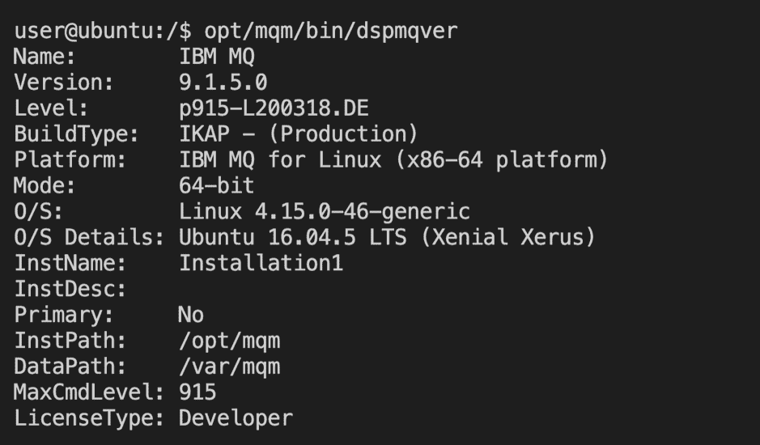
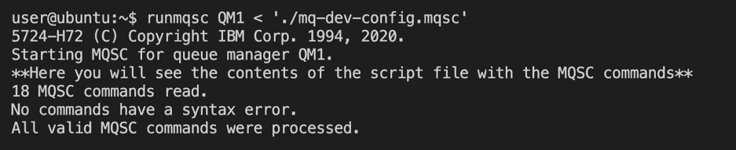
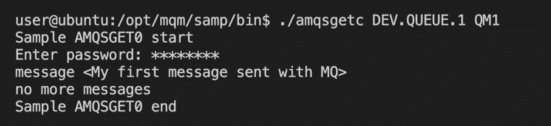

# 获取用于在 Ubuntu 上进行开发的 IBM MQ 队列

> 原文：[`developer.ibm.com/zh/tutorials/mq-connect-app-queue-manager-ubuntu/`](https://developer.ibm.com/zh/tutorials/mq-connect-app-queue-manager-ubuntu/)

##### 学习路径：IBM MQ Developer Essentials 徽章

本系列是 IBM MQ Developer Essentials 学习路径和徽章的一部分。

*   IBM MQ 基础知识
*   使用 MQ on Ubuntu（本教程）、MQ on Containers、MQ on Cloud 或 MQ on Windows 来启动并运行队列管理器。
*   准备使用 Java 编程
*   接受消息传递编程挑战
*   调试应用程序或环境

为了介绍 IBM MQ 的工作方式，首先会引导您创建并配置队列管理器（服务器）。接下来，您将应用程序（客户端）连接到该队列管理器。

在完成本教程后，您将能够向队列发送消息以及从队列中检索消息。

可使用多种方式来下载、安装和运行 IBM MQ 队列管理器（服务器）：

*   在容器中。
*   在 IBM Cloud 中。
*   在各种操作系统上：Linux/Ubuntu（本教程）或 Windows。 对于 MacOS，请使用 MQ on Containers。

    ## 学习目标

完成本教程后，您将了解以下概念：

*   IBM MQ 队列管理器
*   IBM MQ 队列
*   点到点消息传递

## 前提条件

按照教程步骤来下载并安装以下必备软件：

*   [IBM MQ Advanced for Developers](https://ibm.biz/mq-advanced-ubuntu)
*   IBM MQ 配置 (MQSC) 脚本
*   [这个方便的 bash 脚本](https://github.com/ibm-messaging/mq-dev-samples/tree/master/gettingStarted/installing-mq-ubuntu)

## 预估时间

本教程大约需要 30 分钟。

## 步骤

1.  创建用于运行 MQ 客户端应用程序的用户和组
2.  下载 IBM MQ
3.  安装 IBM MQ
4.  设置 MQ 环境
5.  创建并配置队列管理器
6.  在队列中放入和获取消息

### 第 1 步：创建用于运行 MQ 客户端应用程序的用户和组

在开始安装之前，我们需要创建一个名为 “mqclient” 的组，并在该组中创建一个名为 “app” 的用户帐户。使用这些名称，可以配置要使用的 MQ 对象（例如，队列和通道）。

***我们实际上永远不需要以 “app” 用户身份登录。创建该帐户后，请保持登录到您自己的帐户。***

从终端中使用以下命令创建 `mqclient` 组：

```
sudo addgroup mqclient 
```

您应该会看到表明该操作成功的确认消息。接下来，我们创建 “app” 用户，并将该用户添加到 `mqclient` 组中：

```
sudo adduser app 
```

这会提示您为帐户 “app” 创建密码，您必须执行此操作。然后，系统会要求您提供其他帐户详细信息，您可以将其留空，只需按 ENTER 键直至创建帐户。

现在，我们需要将 “app” 用户添加到“mqclient”组中，并检查此操作是否成功。

```
sudo adduser app mqclient
groups app 
```

我们应该会看到以下输出：


现在，已正确设置该帐户，我们可以开始实际安装和配置了。

现在，可以使用 2 种选项来在 Ubuntu 上安装 MQ：

*   如果您要完成安装和配置过程的每一个步骤，完成本教程的第 2 步到第 5 步，并自己输入命令。然后，继续执行第 6 步。

*   如果您想尽快完成，则可以使用[这个方便的 bash 脚本](https://github.com/ibm-messaging/mq-dev-samples/tree/master/gettingStarted/installing-mq-ubuntu)，这个脚本将安装 MQ 并设置开发环境。如果要使用此脚本，请确保返回到本教程，并继续执行第 6 步以放入和获取第一条消息。

选好了吗？绝对不想使用 [bash 脚本](https://github.com/ibm-messaging/mq-dev-samples/tree/master/gettingStarted/installing-mq-ubuntu)？继续阅读以安装 MQ 并完成配置。

### 第 2 步：下载 IBM MQ

我们将安装 MQ Advanced for Developers 版本，然后对其进行配置，以便您可以使用 MQ 进行开发。从[此处](https://ibm.biz/mq-advanced-ubuntu)下载 tar.gz 文件。

### 第 3 步：安装 IBM MQ

解压缩您所下载的文件夹。将内容解压缩到名为 “MQServer” 的文件夹。此文件夹包含许多需要安装的 Debian 程序包。注意此文件夹的位置，例如 `/home/username/Downloads/MQServer`。打开一个终端并输入：

```
sudo ./mqlicense.sh -text_only 
```

这将在终端中打开许可证。阅读许可证，然后按 1 以接受相关条款。

接下来，我们要确保 apt 安装程序可以找到程序包依赖项并正确安装 MQ。为此，我们需要将此文件夹添加到 apt 缓存中。

1.  导航到 `/etc/apt/sources.list.d` 目录
2.  使用类似 `ibmmq-install.list` 的名称来创建一个 `.list` 文件

在此文件中，输入以下行：

```
deb [trusted=yes] file:/home/username/Downloads/MQServer ./ 
```

然后，使用以下命令将这些程序包添加到 apt 缓存中：

```
sudo apt update 
```

现在，我们准备安装 MQ。使用单个命令安装所有程序包：

```
sudo apt install "ibmmq-*" 
```

现在，我们已经安装了 IBM MQ，我们来检查安装是否成功。使用 `/opt/mqm/bin/dspmqver` 命令执行此操作。您应该会看到如下输出：



大功告成！

### 第 4 步：设置 MQ 环境

安装完成后，我们需要将用户添加到管理组 “mqm”，以便您具有 MQ 管理员权限（例如，创建并启动队列管理器的能力）。**重要提示：** 这不是 “app” 用户，而是您的用户帐户。您是以管理员身份执行操作，而 “app” 用户使用的是您创建的 MQ 设置。使用以下命令来添加您的用户帐户：

```
sudo adduser $(whoami) mqm 
```

现在，已将您的用户帐户（*并非* 名为 “app” 的帐户）添加到该组中，我们希望使用这些权限来设置队列管理器。但是，我们需要确保已设置 mq 环境。输入以下命令来执行此操作：

```
cd /opt/mqm/bin
. setmqenv -s 
```

这意味着您现在可以输入 MQ 命令来执行各种任务，例如，创建并启动队列管理器。现在已经设置了该环境，但这 *仅对当前 shell 有效*。如果要使用其他 shell 或终端，则需要重复此步骤。

### 第 5 步：创建并配置队列管理器

我们来创建并启动队列管理器。使用 `crtmqm` 命令来创建一个名为 QM1 的队列管理器：

```
crtmqm QM1 
```

使用以下命令来启动新队列管理器：

```
strmqm QM1 
```

现在，我们有了一个队列管理器，可以开始对其进行配置并为其提供一些 MQ 对象了。我们将通过 config 脚本来实现此目的。移至可将文件下载到的文件夹，然后输入：

```
wget mq-dev-config.mqsc https://raw.githubusercontent.com/ibm-messaging/mq-dev-samples/master/gettingStarted/mqsc/mq-dev-config.mqsc 
```

下载该脚本后，运行以下命令：

```
runmqsc QM1 < "./mq-dev-config.mqsc" 
```

此命令使用 .mqsc 脚本中的输入命令来运行队列管理器 QM1。您应该会看到如下输出：



最后，要完成此过程，您需要为 “mqclient” 组添加相应的权限，以便其成员（即 “app” 用户）有权连接到队列管理器来放入和获取消息。使用以下命令来执行此操作：

```
setmqaut -m QM1 -t qmgr -g mqclient +connect +inq
setmqaut -m QM1 -n DEV.**-t queue -g mqclient +put +get +browse +inq 
```

现在，一切都设置完毕，您可以使用 MQ 了！下面我们将通过发送第一条消息来进行测试。

### 第 6 步：在队列中放入和获取消息

现在，我们已经安装了 MQ，下面我们来连接到预设的队列并发送消息。

如果您在使用 bash 脚本后想要再次加入我们，欢迎回来！如果您使用了 bash 脚本，则需要在此处执行一个额外的步骤，以允许您的帐户使用 MQ 命令。如果您使用了该脚本，则只需输入：

```
./opt/mqm/bin/setmqenv -s 
```

这会为当前 shell 设置 MQ 环境。如果要使用其他 shell 或终端，则需要重新完成此操作。已经完成了吗？太棒了，下面我们来继续发送消息。

要使用样本消息放置程序 amqsputc，我们需要导出几个环境变量。

```
export MQSERVER='DEV.APP.SVRCONN/TCP/localhost(1414)'
export MQSAMP_USER_ID='app' 
```

MQSERVER 将指定队列管理器端点。MQSAMP_USER_ID 将指定有权运行 MQ 安装附带的样本程序的帐户。

记住，无需以“app”用户身份登录。只需运行以下终端命令即可执行消息放置脚本：

```
cd /opt/mqm/samp/bin
./amqsputc DEV.QUEUE.1 QM1 
```

这会提示您输入用户帐户 “app” 的密码。输入此密码，然后您可以选择将一条或多条消息（按 ENTER 键进行分隔）放入队列 DEV.QUEUE.1 中。放置完消息后，按两次 ENTER 键以将其提交到队列中。

最后，我们可以从队列中获取消息。运行：

```
./amqsgetc DEV.QUEUE.1 QM1 
```

输入“app”用户的密码，然后会返回您的消息。程序将等待 15 秒以防有新消息到达，并在 15 秒后退出。返回的消息应如下所示：



## 结束语

在本教程中，您为传入客户端连接**配置了要在 Windows 计算机上运行的队列管理器**。`amqsputc` 应用程序打开了一个队列并在其中**放入了消息**。`amqsputc` 应用程序从同一队列中**获取了消息**。

在您开始开发要连接到队列管理器的客户端应用程序时，按照以下步骤进行操作：

1.  配置与队列管理器的连接。
2.  打开队列。
3.  将消息放入队列中。
4.  从队列中获取消息。
5.  关闭与队列管理器的连接。

此过程展示了**点到点**模式的消息传递。

`amqsputc` 应用程序在放入消息时充当**生产者**端点。`amqsputc` 应用程序在从队列中获取消息时充当**使用者**端点。

在 IBM MQ 中，**队列管理器实际上是系统的服务器**部分，而**连接到队列管理器的应用程序则是客户端**。

通常是由管理员来维护 MQ 服务器，此服务器会定义所有 MQ 对象并传递消息。客户端应用程序由开发者创建，IBM MQ 提供了开发者必须在其应用程序中包括的客户端库。这些库也称为 MQ 客户端，用于处理和使用管理员在 MQ 服务器端设置的 MQ 对象。在更复杂的场景中，MQ 库会为您执行大部分繁重的消息传递工作，因此您只需了解如何使用这些库即可。

**在服务器端和客户端都需要进行配置，消息传递才能正常工作。**

首次开发 MQ 客户端应用程序时，您需要有权访问自己的队列管理器和一个队列，以便测试您的客户端应用程序。在开始开发自己的 MQ 应用程序时，通过在 Ubuntu 计算机上安装 IBM MQ，您可以访问队列管理器和许多用于配置 MQ 对象的选项。

### 后续步骤

下一步？编写第一个 JMS 应用程序。

### 想要停止还是移除队列管理器？卸载 MQ？

如果您打算继续学习 MQ Essentials 学习路径中的其他教程，**不要**使用以下命令。

要停止队列管理器，发出以下命令：`endmqm QM1`

要移除队列管理器，发出以下命令：`dltmqm QM1`

要卸载 IBM MQ 并移除产品缓存的定义，使用以下命令：`apt purge "ibmmq-*"`

要保留缓存的定义，使用以下命令：`apt remove "ibmmq-*"`

本文翻译自：[Get an IBM MQ queue for development on Ubuntu](https://developer.ibm.com/tutorials/mq-connect-app-queue-manager-ubuntu/)（2020-06-23）