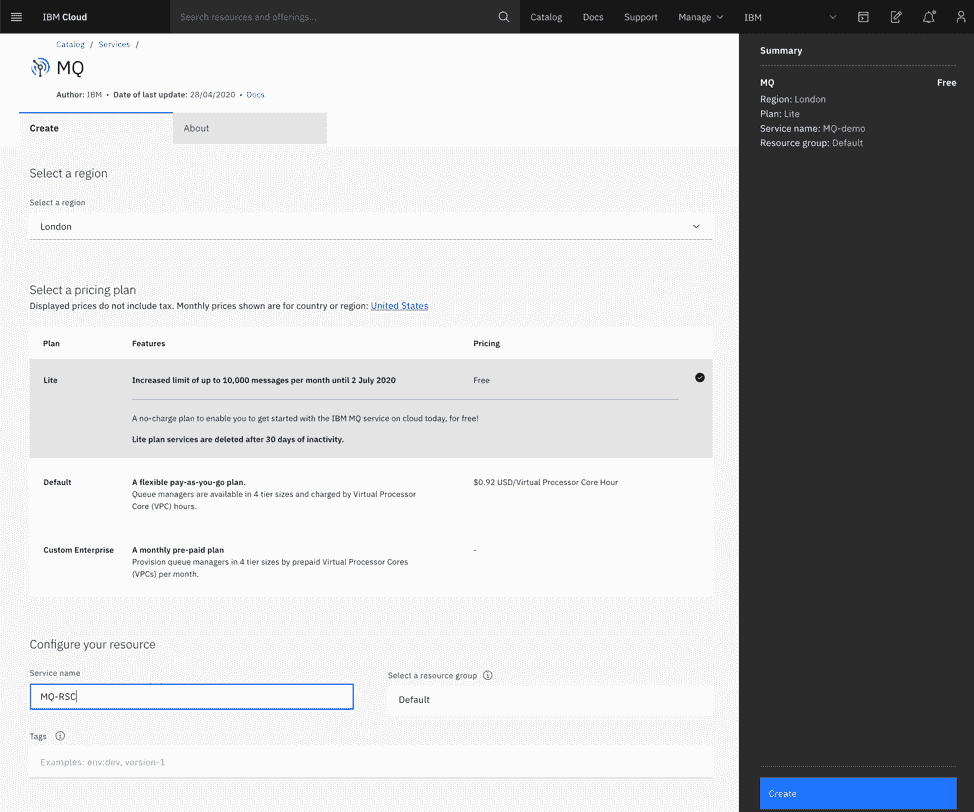
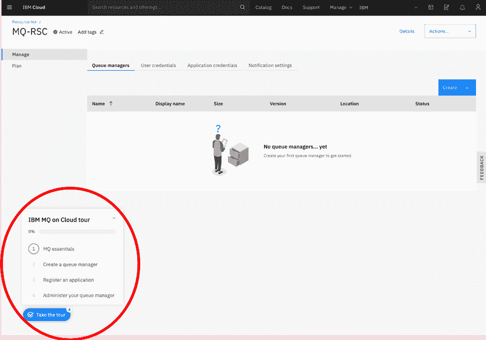
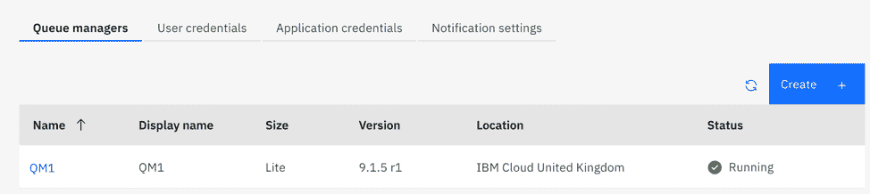
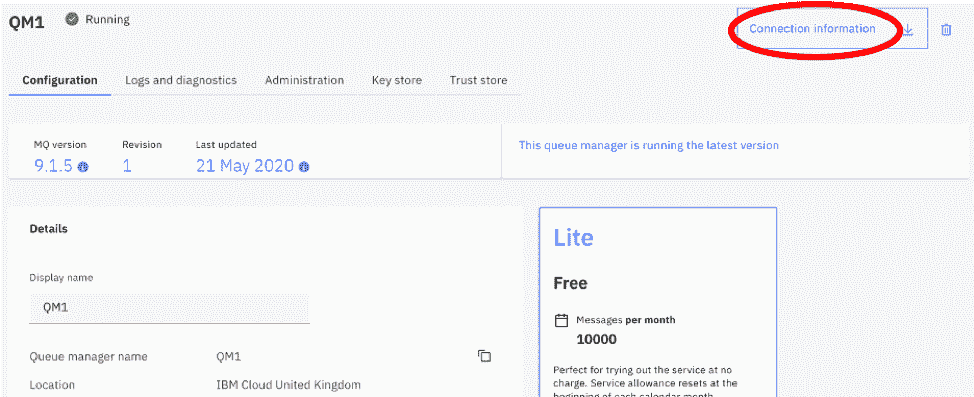
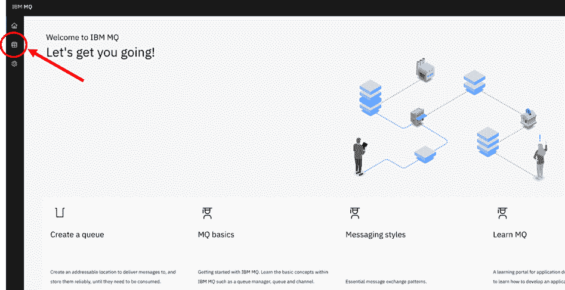
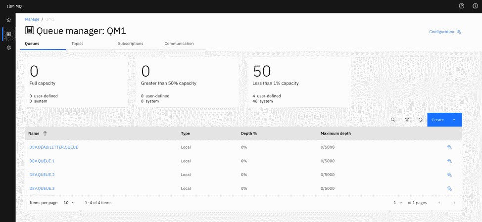
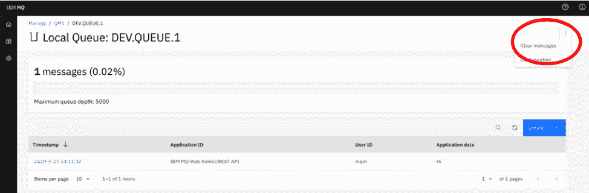

# 获取用于在 IBM Cloud 中进行开发的 IBM MQ 队列

> 原文：[`developer.ibm.com/zh/tutorials/mq-connect-app-queue-manager-cloud/`](https://developer.ibm.com/zh/tutorials/mq-connect-app-queue-manager-cloud/)

##### 学习路径：IBM MQ Developer Essentials 徽章

本系列是 IBM MQ Developer Essentials 学习路径和徽章的一部分。

*   IBM MQ 基础知识
*   使用 MQ on Cloud（本教程）、MQ on Containers、MQ on Ubuntu 或 MQ on Windows 来启动并运行队列管理器。
*   准备使用 Java 编程
*   接受消息传递编程挑战
*   调试应用程序或环境

为了介绍 IBM MQ 的工作方式，首先会引导您创建和配置队列管理器（服务器）。

在完成本教程后，您将能够向队列发送消息以及从队列中检索消息。

可使用多种方式来下载、安装和运行 IBM MQ 队列管理器（服务器）：

*   在容器中。
*   在 IBM Cloud 中（本教程）。
*   在各种操作系统上：Linux/Ubuntu 或 Windows。对于 MacOS，请使用 MQ on Containers。

## 学习目标

完成本教程后，您将大致了解以下概念：

*   IBM MQ 队列管理器
*   IBM MQ 队列
*   IBM MQ 控制台

## 前提条件

您需要注册一个 [IBM Cloud 帐户](https://cloud.ibm.com/registration?cm_sp=ibmdev-_-developer-tutorials-_-cloudreg)。

## 预估时间

本教程大约需要 15-30 分钟。

## 步骤

1.  创建 MQ on Cloud 服务
2.  使用导览
3.  将自己的应用程序连接到云中的 MQ
4.  使用 MQ 控制台

### 第 1 步：创建 MQ on Cloud 服务

登录到您的 IBM Cloud 帐户，并创建一个 [MQ on Cloud](https://cloud.ibm.com/catalog/services/mq?cm_sp=ibmdev-_-developer-tutorials-_-cloudreg) 服务。

选择您所在的区域，选择 Lite（免费！）定价套餐，将服务名称更改为容易记住的内容，并暂时将资源组保留为 `Default`。然后，单击 **Create** 以创建一个免费的 MQ 实例。创建 MQ 实例可能需要几秒钟时间。

### 第 2 步：使用导览

使用导览（IBM MQ on Cloud tour，中文界面：引导式概览）来创建和配置队列管理器。弹出的提示将引导您完成这些步骤。

导览包含以下步骤：

*   回顾 IBM MQ 的基础知识。（我们在 IBM MQ Developer Essentials 徽章中也涵盖了这些基础知识。）

*   **创建队列管理器。** 预估所需时间（通常为几分钟）。部署队列管理器时，您可以继续执行导览中的下一步，但不能完成导览中的最后一步“管理队列管理器”，必须等到队列管理器已部署并处于 “Running” 状态（如下图所示）之后再完成该步骤：

    

*   **注册应用程序。** 您将创建一组 IBM Cloud 凭证，供应用程序用于连接到队列管理器。确保已记下所生成的 API 密钥，然后再关闭该窗口。

    在注册应用程序并下载连接信息（在您开发的任何应用程序中需要设置的变量：主机名、端口、应用程序通道名称和队列管理器名称）之后，您将能够学习 Developer Essentials 徽章学习路径中关于使用 IBM MQ 和 JMS 开发应用程序的教程。

*   **管理队列管理器。** 您将了解 MQ 控制台以及可用于配置队列管理器的所有方式。请参阅本教程中的步骤 4，以获取有关如何创建和删除队列以及如何放入和获取消息（所有这些操作都使用 MQ 控制台来完成）的说明。

完成导览后，回到本教程并继续执行步骤 3。

### 第 3 步：将自己的应用程序连接到云中的 MQ

要将应用程序连接到队列管理器，您需要在导览中注册的应用程序名称以及已保存的 API 密钥。您还需要已下载的连接信息（可以从 “Application credentials” 选项卡中进行访问）：

### 第 4 步：使用 MQ 控制台

导览最后会要求您打开 MQ 控制台，这是一个功能强大的工具，可用于查看队列管理器的状态以及进行管理更改。您还可以创建和删除队列、放入和获取消息等等。

要开始使用 MQ 控制台，请直接单击左侧边栏中的 “Manage” 图标：

MQ 控制台的 “Manage” 窗口显示了队列管理器上处于活动状态的所有对象。第一个选项卡显示队列列表。当您要求应用程序将消息放入队列时，您提供的名称对应于此处定义的某个队列对象。

您可以通过单击队列列表上方的 **Create** 按钮来创建自己的队列。队列管理器在默认情况下为队列设置了一些安全选项。因此，要从应用程序连接到队列，您创建的队列的名称必须以 `DEV.` 开头，就像队列管理器上的其他预定义队列一样。可以在 [IBM Cloud 文档](https://cloud.ibm.com/docs/mqcloud?topic=mqcloud-mqoc_common_problems#mqoc_auth_record)中进一步了解此主题。

在该控制台中，您还可以查看单个队列上的消息，以及放入和获取自己的消息。直接单击要查看的队列，然后选择所需的选项。

例如，单击 `DEV.QUEUE.1` 以查看有关此队列的信息。然后，单击 **Create** 以将消息放入队列中。您可以通过选择队列右上角的多个点并选择 **Clear messages** 来清除该队列的消息。

### 结束语

在本教程中，您创建了在 IBM Cloud 上运行的 IBM MQ 实例，并创建了要在整个学习路径中使用的队列管理器。您了解了如何使用 MQ 控制台管理队列管理器，并获取了可用于连接到应用程序以便将消息发送到队列的连接信息。

当您开始开发自己的客户端应用程序以连接到队列管理器时，您将遵循以下步骤：

1.  配置与队列管理器的连接。
2.  打开队列。
3.  将消息放入队列中。
4.  从队列中获取消息。
5.  关闭与队列管理器的连接。

此过程展示了**点到点模式的消息传递**。

在 IBM MQ 中，**队列管理器实际上是系统的服务器**部分，而**连接到队列管理器的应用程序则是客户端**。

通常是由管理员来维护 MQ 服务器，此服务器会定义所有 MQ 对象并传递消息。客户端应用程序由开发者创建，而 IBM MQ 提供了开发者必须在其应用程序中包含的客户端库。这些库也称为 MQ 客户端，用于处理和使用管理员在 MQ 服务器端设置的 MQ 对象。在更复杂的场景中，MQ 库会为您执行大部分繁重的消息传递工作，因此您只需了解如何使用这些库即可。

**在服务器端和客户端都需要进行配置，消息传递才能正常工作。**

首次开发 MQ 客户端应用程序时，您需要有权访问自己的队列管理器和一个队列，以便测试您的客户端应用程序。MQ on Cloud 服务为您提供了队列管理器的访问权，以及用于在开始开发自己的 MQ 应用程序时配置 MQ 对象的简单选项。

### 后续步骤

下一步？编写第一个 JMS 应用程序。

本文翻译自：[Get an IBM MQ queue for development in IBM Cloud](https://developer.ibm.com/tutorials/mq-connect-app-queue-manager-cloud/)（2020-06-23）