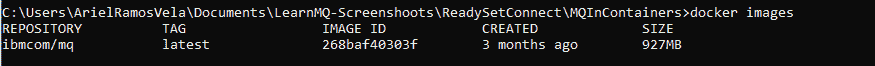

# 获取用于在容器中进行开发的 IBM MQ 队列

> 原文：[`developer.ibm.com/zh/tutorials/mq-connect-app-queue-manager-containers/`](https://developer.ibm.com/zh/tutorials/mq-connect-app-queue-manager-containers/)

##### 学习路径：IBM MQ Developer Essentials 徽章

本系列是 IBM MQ Developer Essentials 学习路径和徽章的一部分。

*   IBM MQ 基础知识
*   使用 MQ on Containers（本教程）、MQ on Cloud、MQ on Ubuntu 或 MQ on Windows 来启动并运行队列管理器。
*   准备使用 Java 编程
*   接受消息传递编程挑战
*   调试应用程序或环境

为了介绍 IBM MQ 的工作方式，首先会引导您创建和配置一个队列管理器（服务器）。然后，您将应用程序（客户端）连接到该队列管理器。

在完成本教程后，您将能够向队列发送消息以及从队列中检索消息。

可使用多种方式来下载、安装和运行 IBM MQ 队列管理器（服务器）：

*   在容器中（本教程）。
*   在 IBM Cloud 中。
*   在各种操作系统上：Linux/Ubuntu 或 Windows。对于 MacOS，请使用 MQ on Containers（本教程）。

## 学习目标

完成本教程后，您将了解以下概念：

*   IBM MQ 队列管理器
*   IBM MQ 队列
*   点到点消息传递

## 前提条件

*   Docker Community Edition V17.06 或更高版本
*   Docker Hub 中的 IBM MQ Docker 镜像

## 预估时间

本教程大约需要 30 分钟。

## 步骤

1.  安装 Docker
2.  从 Docker 镜像获取 MQ
3.  从镜像中运行容器
4.  放入和获取消息

### 第 1 步：安装 Docker

如果已在系统上安装 Docker，请检查安装了哪个版本。如果您的 Docker 版本为 `docker` 或 `docker-engine`，则必须先将其卸载，然后再安装最新的 `docker-ce` 版本。

1.  从 [Docker Hub](https://hub.docker.com/search/?type=edition&offering=community) 下载 Docker Community Edition V17.06 或更高版本。

2.  按照[安装文档](https://docs.docker.com/install/)中的说明来安装 Docker。

### 第 2 步： 从 Docker 镜像获取 MQ

容器是从镜像中运行的，而镜像是根据 Dockerfile 中列出的规范构建的。我们将使用 Docker Hub 中预先构建的 IBM MQ 服务器镜像，这样便可以直接运行容器而无需构建镜像。我们最终会得到一个可正常运行的 MQ 安装，以及预配置了可供开发者使用的对象的队列管理器。

1.  从 Docker Hub 中提取包含最新版本 MQ 服务器的镜像：

    ```
     docker pull ibmcom/mq:latest 
    ```

2.  完成后，检查您拥有哪些镜像：

    ```
     docker images 
    ```

    您应该会看到如下输出：



### 第 3 步：从镜像中运行容器

现在，MQ 服务器镜像已位于本地 Docker 存储库中，您可以运行容器以在容器中 RHEL 建立 MQ。

建立容器时，会使用一个内存中文件系统（在删除该容器时也会删除此文件系统）。队列管理器和队列数据都保存在此文件系统中。为了避免丢失队列管理器和队列数据，我们可以使用 Docker 卷。

这些卷在容器运行时附加到容器，并在删除容器后仍然存在。运行新容器时，可以附加现有卷，并稍后复用队列管理器和队列数据。

1.  使用 Docker 创建数据卷：

    ```
     docker volume create qm1data 
    ```

2.  运行 MQ 服务器容器。**编辑该命令，为您自己设置用于连接应用程序的密码。**您稍后需要对客户端演示应用程序使用此密码，并且在运行自己的客户端应用程序时也需要使用此密码。在本示例中，我们将密码设置为“passw0rd”，但您也可以选择自己的密码：

    ```
     docker run --env LICENSE=accept --env MQ_QMGR_NAME=QM1 --volume qm1data:/mnt/mqm --publish 1414:1414 --publish 9443:9443 --detach --env MQ_APP_PASSWORD=passw0rd ibmcom/mq:latest 
    ```

队列管理器已设置了一些简单的默认配置，以便您连接第一个客户端应用程序。

我们向 docker run 命令添加了一些参数，例如，用于为开发者接受 IBM MQ Advanced 的许可证，以及将队列管理器（我们的队列位于其中）命名为 “QM1”。

由于 MQ 是在容器中运行，所以它会与外界隔离，因此我们打开了几个端口以供 MQ 使用。

队列管理器的侦听器将在端口 1414 上侦听传入连接，而端口 9443 将由 MQ 控制台使用。

MQ 客户端演示应用程序将使用该侦听器端口，并且可以 在端口 9443 上通过浏览器查看 MQ 控制台仪表板。

稍等片刻，让容器启动，然后检查容器是否正在运行：

```
docker ps 
```

您应该会看到如下输出：


恭喜！您刚刚创建了第一个简单队列管理器。它称为 QM1，并且正在容器中运行。

要访问此队列管理器，您需要通过 TCP/IP 进行连接（这就是为什么需要公开端口 1414 的原因）。

记下您自己的容器 ID，并使用此 ID 获取容器中的命令行访问权。例如：

```
docker exec -ti <your container id> /bin/bash 
```

您应该会看到如下输出：


您可以通过在命令行界面中运行 `dspmqver` 命令（显示 MQ 版本）来显示 MQ 安装和数据路径。

```
dspmqver 
```

您应该会看到如下输出：


您可以使用 `dspmq` 命令显示正在运行的队列管理器。

```
dspmq 
```

您应该会看到如下输出：


要退出 Docker 容器并返回到命令行，请输入 `exit` 并按 **Enter** 键。

#### 目前进展

您**下载了预先构建的 Docker 镜像**，并**运行了容器**以在 RHEL 上运行 MQ。客户端应用程序连接到队列管理器并能够在队列中放入和获取消息所需的 IBM **MQ 对象和权限**是**自动创建的**。Docker 和 MQ 使用的是主机资源和连接。

在容器中，RHEL 上的 MQ 安装包含以下对象：

*   队列管理器 `QM1`
*   队列 `DEV.QUEUE.1`
*   通道：`DEV.APP.SVRCONN`
*   侦听器：端口 1414 上的 `DEV.LISTENER.TCP`

您要使用的**队列** **DEV.QUEUE.1** 位于**队列管理器 QM1** 上。该**队列管理器还有一个侦听器**，用于侦听传入连接，例如**在端口 1414 上**。**客户端应用程序可以连接**到队列管理器，并且**可以打开队列、放入和获取消息以及关闭队列**。

应用程序使用 **MQ 通道**来连接到队列管理器。可通过多种不同方式来限制对这三个对象的访问权。例如，**用户“app”是组“mqclient”的成员，可以使用通道 `DEV.APP.SVRCONN` 来连接到队列管理器 `QM1`，并有权在队列 `DEV.QUEUE.1` 中放入和获取消息**。

运行 MQ 服务器容器时，会创建并配置客户端应用程序所需的所有 MQ 对象和权限。


### 第 4 步：使用 MQ 控制台放入和获取消息

MQ 控制台是基于 Web 浏览器的界面，用于与 MQ 对象进行交互。在容器中的开发者版本 MQ 内随附了预配置的 MQ 控制台。

管理员可使用 MQ 控制台来管理队列管理器。开发者可使用 MQ 控制台来测试和调试客户端应用程序。

我们分配了端口 9443 以供 MQ 控制台在开始时使用，因此，如果您将本地系统上的浏览器指向 [`localhost:9443/ibmmq/console/`](https://localhost:9443/ibmmq/console/)，则可以查看队列管理器 QM1。

现在，我们来使用 MQ 控制台在队列中放入和获取消息：

1.  使用用户 “admin” 和密码 “passw0rd” 登录到 MQ 控制台。
2.  单击 “Home” 图标下的 **Manage**。这将打开一个页面，其中显示您的 QM1 资源。
3.  在 “QM1 resources” 页面中，单击 `DEV.QUEUE.1`。
4.  在 “Local queue `DEV.QUEUE.1`” 页面中，单击 **Create** 按钮以将消息放入队列中。
5.  在消息界面的 **Application data** 字段中输入 `Hello World`。然后单击 **Create**。
6.  在队列页面上查看您的消息（在一行上）。
7.  单击右上角的三个垂直点以打开 “options” 菜单。
8.  单击 **Clear messages** 以清空该队列。

## 结束语

在本教程中，您在容器中建立了一个 MQ 队列管理器，并使用 MQ 控制台在队列中**放入和获取消息**。MQ 容器已进行预配置，允许传入的客户端连接。

当您开始开发自己的客户端应用程序以连接到队列管理器时，您将遵循以下步骤：

1.  配置与队列管理器的连接。
2.  打开队列。
3.  将消息放入队列中。
4.  从队列中获取消息。
5.  关闭与队列管理器的连接。

此过程展示了**点到点模式的消息传递**。

在 IBM MQ 中，**队列管理器实际上是系统的服务器**部分，而**连接到队列管理器的应用程序则是客户端**。

通常是由管理员来维护 MQ 服务器，此服务器会定义所有 MQ 对象并传递消息。客户端应用程序由开发者创建，而 IBM MQ 提供了开发者必须在其应用程序中包含的客户端库。这些库也称为 MQ 客户端，用于处理和使用管理员在 MQ 服务器端设置的 MQ 对象。在更复杂的场景中，MQ 库会为您执行大部分繁重的消息传递工作，因此您只需了解如何使用这些库即可。

**在服务器端和客户端都需要进行配置，消息传递才能正常工作。**

首次开发 MQ 客户端应用程序时，您需要有权访问自己的队列管理器和一个队列，以便测试您的客户端应用程序。利用 Docker 镜像中预配置的 MQ 以及可从此镜像中轻松运行的容器，您可以访问队列管理器，并可以在开始开发自己的 MQ 应用程序时使用许多选项来配置 MQ 对象。

### 后续步骤

下一步？编写第一个 JMS 应用程序。

本文翻译自：[Get an IBM MQ queue for development in a container](https://developer.ibm.com/tutorials/mq-connect-app-queue-manager-containers/) （2020-06-23）