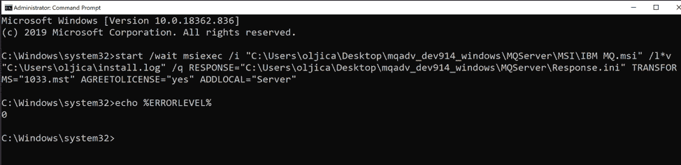
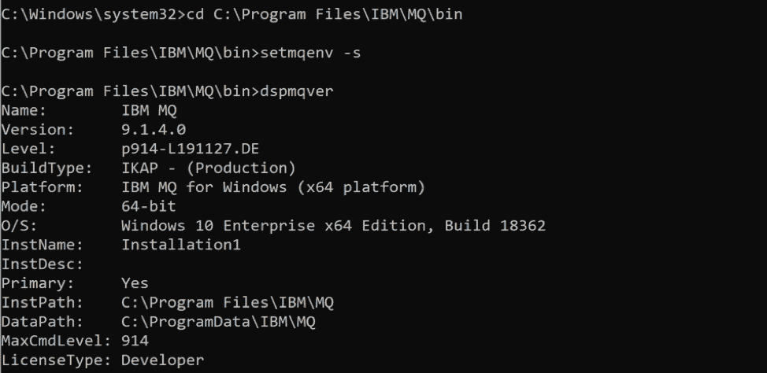
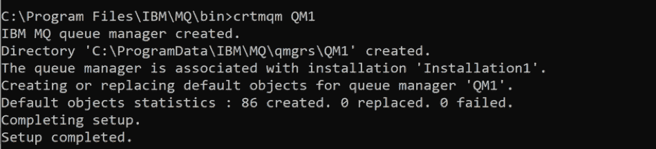
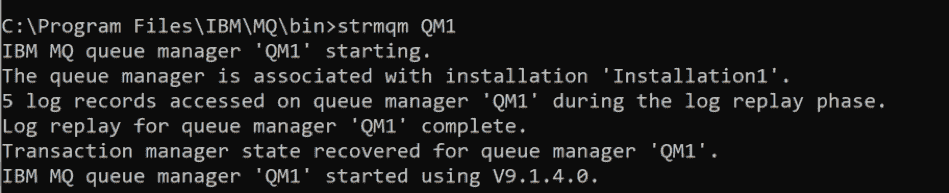
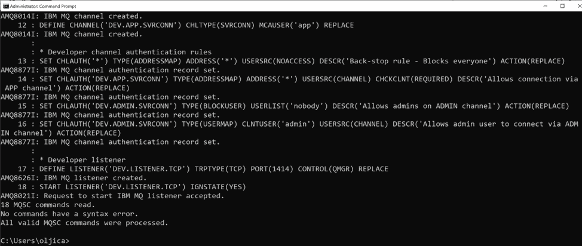
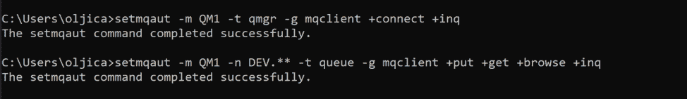
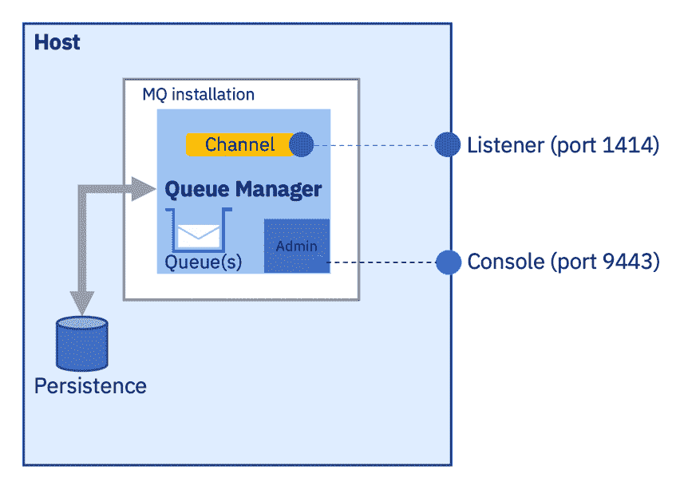
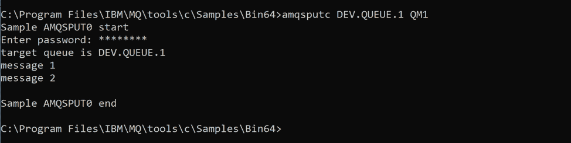
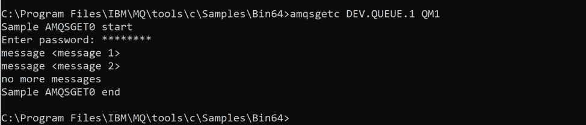

# 获取用于在 Windows 上进行开发的 IBM MQ 队列

> 原文：[`developer.ibm.com/zh/tutorials/mq-connect-app-queue-manager-windows/`](https://developer.ibm.com/zh/tutorials/mq-connect-app-queue-manager-windows/)

##### 学习路径：IBM MQ Developer Essentials 徽章

本系列是 IBM MQ Developer Essentials 学习路径和徽章的一部分。

*   IBM MQ 基础知识
*   使用 MQ on Windows（本教程）、MQ on Containers、MQ on Cloud 或 MQ on Ubuntu 来启动并运行队列管理器。
*   准备使用 Java 编程
*   接受消息传递编程挑战
*   调试应用程序或环境

为了介绍 IBM MQ 的工作方式，首先会引导您创建并配置队列管理器。接下来，您将应用程序连接到该队列管理器。

在完成本教程后，您将能够向队列发送消息以及从队列中检索消息。

可使用多种方式来下载、安装和运行 IBM MQ 队列管理器（服务器）：

*   在容器中。
*   在 IBM Cloud 中。
*   在各种操作系统上：Linux/Ubuntu 或 Windows（本教程）。对于 MacOS，使用 MQ on Containers。

## 学习目标

完成本教程后，您将大致了解以下概念：

*   IBM MQ 队列管理器
*   IBM MQ 队列
*   点到点消息传递

## 前提条件

按照教程步骤来下载并安装以下必备软件：

*   具有管理员特权的 Windows 10 计算机
*   IBM MQ Advanced for Developers
*   IBM MQ 配置 (MQSC) 脚本

## 预估时间

本教程大约需要 30-45 分钟。

## 步骤

1.  下载 IBM MQ
2.  安装 IBM MQ
3.  创建并启动队列管理器
4.  配置队列管理器
5.  创建用于运行 MQ 客户端应用程序的用户和组
6.  在队列中放入和获取消息

### 第 1 步：下载 IBM MQ

下载 [IBM MQ Advanced for Developers for Windows](https://ibm.biz/mq-win-adv-dev)。此文件较大，因此需要一些时间来下载此文件。

解压缩下载的文件，并记下 MQ Server 文件夹的位置。

### 第 2 步：安装 IBM MQ

**重要提示**：如果您用于登录 Windows 的管理员用户 ID 的长度超过 12 个字符，那么您将无法完成本教程。在这种情况下，退出然后以管理员用户（其用户名的长度小于 12 个字符）身份重新登录。

“以管理员身份”打开命令行界面。您需要获得更高的权限才能运行本教程中的某些命令。

构造用于在计算机上安装 MQ 的命令。为此，您需要以下三个路径：

*   MQ 安装程序包文件 IBM MQ.msi 所在位置的路径，例如：`C:\mqadv_dev914_windows\MQServer\MSI\IBM MQ.msi`。

*   用于存储 MQ 为安装所创建的纯文本日志文件的文件夹的路径（包括文件名），例如：`C:\Users\username\install.log`。

*   MQ 默认安装参数文件 `Response.ini` 所在位置的路径，例如：`C:\Users\username\Downloads\mqadv_dev914_windows\MQServer\Response.ini`。

通过用三个文件位置路径替换示例路径来编辑此命令，然后在命令行中运行此命令：

```
start /wait msiexec /i "C:\Users\username\Downloads\mqadv_dev914_windows\MQServer\MSI\IBM MQ.msi" /l*v "C:\Users\username\install.log" /q RESPONSE="C:\Users\username\Downloads\mqadv_dev913_windows\MQServer\Response.ini" TRANSFORMS="1033.mst" AGREETOLICENSE="yes" ADDLOCAL="Server" 
```

安装将在后台进行。要跟踪安装进度，查看您指定的日志文件。

要检查安装是否成功，输出错误级别：

```
echo %ERRORLEVEL% 
```

如果一切顺利，则将返回代码 0。



如果您获得了不同的代码，并且安装似乎失败，首先检查您是否“以管理员身份”运行了命令行工具。如果不是，在“以管理员身份运行”模式下打开另一个命令行窗口，然后重试该命令。

成功完成安装后，由于 MQ 会在安装后自动启动，因此任务栏上将出现一个新图标。


如果安装失败，查看日志文件以了解发生了什么：

```
notepad C:\Users\username\install.log 
```

如果静默安装失败，则可通过双击 MQServer 文件夹中的 Setup.exe 来打开启动板（将引导您完成安装步骤）以安装 MQ。

### 第 3 步：创建并启动队列管理器

在点到点消息传递中，应用程序感兴趣的主要 MQ 对象是队列。必须先创建队列管理器，然后才能创建队列。IBM MQ 队列管理器是用于托管队列的服务器。

如果您是首次安装 MQ，则 MQ 安装路径为：`C:\Program Files\IBM\MQ`。

在命令行上，切换到 MQ 安装的 bin 文件夹，例如：

```
cd "C:\Program Files\IBM\MQ\bin" 
```

现在输入：

```
setmqenv -s 
```

现在，您可以直接发出 IBM MQ 命令，而不必在 MQ 安装的 bin 文件夹中发出。

您可以通过在命令行上运行 `dspmqver`（显示 MQ 版本）命令来显示 MQ 安装和数据路径：

```
dspmqver 
```

您应该会看到如下输出：



您需要一个队列才能开始放入和获取消息。队列是位于队列管理器上，因此您需要先创建一个队列管理器。在命令行中，输入：

```
crtmqm QM1 
```

您应该会看到如下输出：



队列管理器已创建但尚未启动。启动队列管理器：

```
strmqm QM1 
```

您应该会看到如下输出：



<h3 id=”-4-” # step-4-configure-your-queue-manager>第 4 步：配置队列管理器

我们提供了一个脚本来帮助您为队列管理器创建 MQ 对象。我们将使用 curl 命令从 GitHub 中获取此脚本。确保从您具有写权限的文件夹（例如，主目录）中运行以下命令。

```
curl -o mq-dev-config.mqsc https://raw.githubusercontent.com/ibm-messaging/mq-dev-samples/master/gettingStarted/mqsc/mq-dev-config.mqsc 
```

运行以下命令以创建 MQ 对象并添加用于保存脚本文件的位置，例如：

```
runmqsc QM1<"C:\Users\user\Downloads\mq-dev-config.mqsc" 
```

完成后，您应该会看到如下输出：



#### 您是否在运行 Windows 10 Enterprise 版本？

如果 `runmqsc` 命令失败，并且您运行的是 Windows 10 Enterprise，则原因可能是您的域用户未在计算机上列示为本地用户。要解决此问题，您可以运行“本地用户和组”管理器：

```
lusrmgr.msc 
```

您应该在其中创建一个用户，并将其添加到在 MQ 安装过程中创建的 mqm 组中。完成此操作后，只需以该用户身份运行 runmqsc 命令即可：

```
runas /user:THE_USER "runmqsc QM1<\"C:\Users\user\Downloads\mq-dev-config.mqsc\"" 
```

现在，应该一切正常。该脚本会创建一些对象（例如，队列、通道和侦听器）。尝试连接到队列管理器时，应用程序需要了解这些对象。

### 第 5 步：创建用于运行 MQ 客户端应用程序的用户和组

用户的角色是通过他们所属的组来定义。我们通常希望通过无管理员权限的帐户来运行 MQ 应用程序。您的用户帐户是一个 MQ 管理员帐户。

客户端应用程序需要获得授权才能执行诸如打开和关闭队列、放入和获取消息之类的操作。客户端将通过通道来连接到队列管理器。要执行此操作，客户端需要通过特定用户帐户进行连接，此用户帐户必须属于其成员有权使用该通道的组。

在 Windows “计算机管理”工具的“本地用户和组”下，

1.  创建 Windows 组 `mqclient`
2.  创建 Windows 用户 `app`，该用户是 `mqclient` 组的成员。 将密码设置为 `passw0rd`。用户将在下次登录时更改此密码。

然后，您可以为 `mqclient` 组添加相应的权限，以便其成员可以连接到队列管理器并在队列中放入和获取消息。

运行以下命令：

```
setmqaut -m QM1 -t qmgr -g mqclient +connect +inq 
```

然后，运行以下命令：

```
setmqaut -m QM1 -n DEV.**-t queue -g mqclient +put +get +browse +inq 
```



#### 目前进展

您已经在 Windows PC 上安装了 IBM MQ，创建了一个队列管理器，并运行了 MQSC 脚本来创建 MQ 对象。现在，您可以创建并运行 MQ 应用程序了。MQ 正在使用您的主机资源和连接。



以下对象和权限集：

*   `Queue manager QM1`
*   `Queue DEV.QUEUE.1`
*   通道：`DEV.APP.SVRCONN`
*   侦听器：`DEV.LISTENER.TCP`（在端口 1414 上）

属于 `mqclient` 组的 `app` 用户可以使用 `DEV.APP.SVRCONN` 通道来连接到队列管理器 QM1。`app` 用户可以在队列 `DEV.QUEUE.1` 中放入和获取消息。

### 第 6 步：在队列中放入和获取消息

现在，我们已经安装了 MQ，下面我们来连接到预设的队列并发送一些消息来练习一下。

我们将使用 MQ 安装中的样本消息放置程序 `amqsputc`。我们需要设置几个环境变量。

```
set MQSERVER=DEV.APP.SVRCONN/TCP/localhost(1414)
set MQSAMP_USER_ID=app 
```

`MQSERVER` 将指定队列管理器端点。`MQSAMP_USER_ID` 将指定有权运行 MQ 安装附带的样本程序的帐户。

切换到样本所在的目录：

```
cd C:\Program Files\IBM\MQ\tools\c\Samples\Bin64 
```

无需以 `app` 用户身份登录。只需运行以下命令即可放入消息：

```
amqsputc DEV.QUEUE.1 QM1 
```

这会提示您输入用户帐户 `app` 的密码。输入 passw0rd，然后您可以选择将一条或多条消息（按 ENTER 键进行分隔）放入队列 `DEV.QUEUE.1` 中。放置完消息后，按两次 ENTER 键以将其提交到队列中。

您应该会看到如下输出:



最后，我们可以从队列中获取消息。运行以下命令：

```
amqsgetc DEV.QUEUE.1 QM1 
```

输入 `app` 用户的密码，然后会返回您的消息。程序将等待 15 秒以防有新消息到达，并在 15 秒后退出。返回的消息应如下所示：



## 结束语

在本教程中，您为传入客户端连接**配置了要在 Windows 计算机上运行的队列管理器**。`amqsputc` 应用程序打开了一个队列并在其中**放入了消息**。`amqsputc` 应用程序从同一队列中**获取了消息**。

在您开始开发要连接到队列管理器的客户端应用程序时，按照以下步骤进行操作：

1.  配置与队列管理器的连接。
2.  打开队列。
3.  将消息放入队列中。
4.  从队列中获取消息。
5.  关闭与队列管理器的连接。

此过程展示了**点到点**模式的消息传递。

`amqsputc` 应用程序在放入消息时充当**生产者**端点。`amqsputc` 应用程序在从队列中获取消息时充当**使用者**端点。

在 IBM MQ 中，**队列管理器实际上是系统的服务器**部分，而**连接到队列管理器的应用程序则是客户端**。

通常是由管理员来维护 MQ 服务器，此服务器会定义所有 MQ 对象并传递消息。客户端应用程序由开发者创建，IBM MQ 提供了开发者必须在其应用程序中包括的客户端库。这些库也称为 MQ 客户端，用于处理和使用管理员在 MQ 服务器端设置的 MQ 对象。在更复杂的场景中，MQ 库会为您执行大部分繁重的消息传递工作，因此您只需了解如何使用这些库即可。

**在服务器端和客户端都需要进行配置，消息传递才能正常工作。**

首次开发 MQ 客户端应用程序时，您需要有权访问自己的队列管理器和一个队列，以便测试您的客户端应用程序。在开始开发客户端应用程序时，通过在 Windows 计算机上安装 IBM MQ，您可以访问队列管理器和许多用于配置 MQ 对象的选项。

### 后续步骤

下一步？编写第一个 JMS 应用程序。

本文翻译自：[Get an IBM MQ queue for development on Windows](https://developer.ibm.com/tutorials/mq-connect-app-queue-manager-windows/)（2020-06-23）