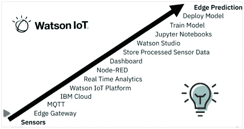

# 将 AI 和边缘预测应用于 IoT 数据

> 原文：[`developer.ibm.com/zh/tutorials/apply-ai-edge-prediction-to-iot-data/`](https://developer.ibm.com/zh/tutorials/apply-ai-edge-prediction-to-iot-data/)

本教程中，我将向您展示如何实施边缘计算架构的高级步骤。您将了解如何将传感器、无线连接、多处理器边缘设备、低功耗微控制器和传感器库集成到此 IoT 边缘架构中。您还将了解如何将边缘设备连接到 IBM Cloud 和 Watson IoT Platform 以创建新的 Node-RED 应用程序。通过使用 Watson Studio 数据科学门户网站，您将了解如何创建要部署到边缘设备的机器学习模型。最重要的是，您将了解如何在边缘设备上运行机器学习预测模型。

如果您发现学习本教程有些困难，也许您可以从另一个教程“为 IoT 边缘配置网状网络”开始。

我希望，即使您不能完全按照本教程的步骤进行操作，也可以将它们作为一个模型，用于指导您使用类似硬件和软件构建自己的 IoT 边缘解决方案。

以下步骤是本教程的主要步骤：

1.  设置边缘设备

2.  创建 Node-RED 应用程序

3.  创建、部署和运行机器学习模型

这次教程将遵循这一系列步骤。

## 前提条件

本教程中的边缘设备是连接了 [IKS01A2 传感器扩展板](https://www.st.com/resource/en/user_manual/dm00333132-getting-started-with-the-xnucleoiks01a2-motion-mems-and-environmental-sensor-expansion-board-for-stm32-nucleo-stmicroelectronics.pdf)的 [STM32MP1 发现套件](https://www.st.com/resource/en/user_manual/dm00591354-discovery-kits-with-stm32mp157-mpus-stmicroelectronics.pdf)。

您可以使用 IBM Cloud 帐户完成本教程：

*   创建一个 [IBM Cloud 帐户](https://cocl.us/IBM_CLOUD_GCG)。
*   登录到 [IBM Cloud](https://cloud.ibm.com/login?cm_sp=ibmdev-_-developer-tutorials-_-cloudreg)。

## 第 1 步：设置边缘设备

在设置开发板并连接传感器扩展板后，您将了解如何在边缘设备上打开 OpenSTLinux 的电源、检测 wifi IP 地址并连接到边缘设备。然后，您将运行环境传感器程序以观察环境传感器数据。最后，在将浏览器连接到边缘设备上运行的 Node-RED 之后，将传感器数据发送到 Watson IoT Quickstart。

1.  [拆箱并设置开发板](https://github.com/johnwalicki/STM32MP1-Edge-WatsonIoT-Workshop/blob/master/part1/UNBOX.md)

2.  [打开 OpenSTLinux 的电源并连接到边缘设备](https://github.com/johnwalicki/STM32MP1-Edge-WatsonIoT-Workshop/blob/master/part1/POWERUP.md)

3.  [运行环境传感器程序以查看传感器数据](https://github.com/johnwalicki/STM32MP1-Edge-WatsonIoT-Workshop/blob/master/part1/SENSORDATA.md)

4.  [连接到边缘设备上的 Node-RED](https://github.com/johnwalicki/STM32MP1-Edge-WatsonIoT-Workshop/blob/master/part1/EDGE-NODERED.md)

5.  [将数据从设备发送到 Watson IoT Platform Quickstart](https://github.com/johnwalicki/STM32MP1-Edge-WatsonIoT-Workshop/blob/master/part1/EDGE-QUICKSTART.md)

## 第 2 步：创建 Node-RED 应用程序

在开始创建 Node-RED 应用程序之前，需要创建一个在 IBM Cloud 中运行的 IoT 入门应用程序，打开 Watson IoT Platform 以确认您可以在边缘设备上发送/接收数据，并在 Watson IoT Platform 中注册边缘设备。接下来，您将配置 Node-RED，安装其他节点，并导入预构建的流程，然后创建第一个 Node-RED 应用程序，输出传感器数据。

然后，您将在 IBM Cloud 中创建第二个 Node-RED 应用程序“Node-RED 仪表板”，您可以使用它来试用图表类型并绘制实时传感器数据。当传感器数据超出阈值时，还会触发警报。

最后，您将创建第三个 Node-RED 应用程序，该应用程序将传感器数据存储在 Cloudant 数据库中，格式化时间序列数据库记录，从 Cloudant 数据库中读取数据集，并创建历史数据图表。

1.  [创建 IoT Platform 入门应用程序](https://github.com/johnwalicki/STM32MP1-Edge-WatsonIoT-Workshop/blob/master/part2/CREATEIOTP.md)

2.  [向 Watson IoT Platform 注册边缘设备](https://github.com/johnwalicki/STM32MP1-Edge-WatsonIoT-Workshop/blob/master/part2/DISCOVERYDEVICE.md)

3.  [在 IBM Cloud 中设置和配置 Node-RED](https://github.com/johnwalicki/STM32MP1-Edge-WatsonIoT-Workshop/blob/master/part2/NODERED.md)

4.  [通过 MQTT 将传感器数据从边缘设备发送到 Watson IoT Platform](https://github.com/johnwalicki/STM32MP1-Edge-WatsonIoT-Workshop/blob/master/part2/SENDEDGE.md)

5.  [在 IBM Cloud 中接收来自 Node-RED 应用程序的传感器数据](https://github.com/johnwalicki/STM32MP1-Edge-WatsonIoT-Workshop/blob/master/part2/DISCOVERYIOTDATA.md)

6.  [在 Node-RED 仪表板图表中分析实时传感器数据](https://github.com/johnwalicki/STM32MP1-Edge-WatsonIoT-Workshop/blob/master/part2/DASHBOARD.md)

7.  [在 IBM Cloud 中将传感器数据存储在 Cloudant 数据库中](https://github.com/johnwalicki/STM32MP1-Edge-WatsonIoT-Workshop/blob/master/part2/CLOUDANT.md)

8.  [在 Node-RED 仪表板图形中分析历史数据](https://github.com/johnwalicki/STM32MP1-Edge-WatsonIoT-Workshop/blob/master/part2/HISTORY.md)

## 第 3 步：创建、部署和运行机器学习模型

在此步骤（最后一步）中，您将使用 Watson Studio 创建机器学习模型。接下来，您将使用 IBM Cloud 中的 Node-RED 将模型发送到边缘设备上运行的 Node-RED。 最后，您将根据传入的传感器数据在边缘设备上运行该模型，以便做出关于是否持有传感器的预测。

1.  [在 IBM Cloud 中设置和配置 Watson Studio](https://github.com/johnwalicki/STM32MP1-Edge-WatsonIoT-Workshop/blob/master/part3/STUDIO.md)

2.  [创建用于训练机器学习模型的训练数据](https://github.com/johnwalicki/STM32MP1-Edge-WatsonIoT-Workshop/blob/master/part3/TRAINING.md)

3.  [从 Cloudant 数据库中读取传感器数据并创建用于对传感器数据进行分类的模型](https://github.com/johnwalicki/STM32MP1-Edge-WatsonIoT-Workshop/blob/master/part3/JUPYTER.md)

4.  [在边缘设备上部署和运行机器学习模型](https://github.com/johnwalicki/STM32MP1-Edge-WatsonIoT-Workshop/blob/master/part3/MODEL.md)

## 结束语及后续步骤

在本教程中，我试图展示了如何从传感器到洞察，从边缘到云。如果您想尝试其他边缘计算解决方案，请查看边缘计算和 IBM Edge Application Manager Hub。

本文翻译自：[Applying AI and Edge prediction to IoT data](https://developer.ibm.com/depmodels/edge-computing/tutorials/apply-ai-edge-prediction-to-iot-data)（2020-05-05）